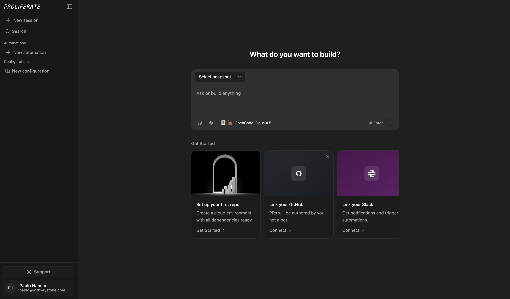

<a name="readme-top"></a>

<h2 align="center">
  <a href="https://proliferate.com" target="_blank" rel="noreferrer">
    <picture>
      <source media="(prefers-color-scheme: dark)" srcset="https://d1uh4o7rpdqkkl.cloudfront.net/logotype-inverted.webp" />
      
    </picture>
  </a>
</h2>

<p align="center"><strong>Clawdbot for product builders. An open source cloud harness for coding agents.</strong></p>

<p align="center">
  <a href="https://github.com/proliferate-ai/proliferate/actions/workflows/ci.yml" target="_blank" rel="noreferrer">
    
  </a>
  <a href="#docs">
    
  </a>
  <a href="https://proliferate.com" target="_blank" rel="noreferrer">
    
  </a>
  <a href="LICENSE">
    
  </a>
</p>

<p align="center">
  <a href="#quick-start">Quick start</a> &middot;
  <a href="#features">Features</a> &middot;
  <a href="#deployment">Deployment</a> &middot;
  <a href="#architecture">Architecture</a> &middot;
  <a href="#docs">Docs</a> &middot;
  <a href="CONTRIBUTING.md">Contributing</a>
</p>

> [!WARNING]
> **Beta:** Proliferate is under active development. A managed hosted version is coming soon.
> Feedback via [issues](https://github.com/proliferate-ai/proliferate/issues) or [contributions](CONTRIBUTING.md).

**Proliferate** is an open source cloud harness for coding agents. It lets you run many agents in parallel, each in an isolated cloud session with a real dev environment and access to your toolchain (Docker, GitHub, Sentry, PostHog, Linear, Slack, Chrome, Gmail, internal docs, infra, etc.).

Example workflows:

- Watch a PostHog session replay -> identify a UX issue -> create a Linear ticket -> open a PR
- Triggered by a Sentry exception -> reproduce it -> draft a PR + tag the teammate who introduced it (and optionally draft a customer update)
- Tag an agent in Slack -> let it iterate -> jump into the same session from web or the terminal when you want

Two things we focus on:

- **Access + integration**: agents need safe, real access to your stack. Most teams wire this up with custom wrappers / MCP servers / glue code, and it tends to be brittle and hard to share.
- **Verification**: even when an agent ships a PR, someone still has to answer "does this actually work?" Proliferate makes each run a shareable session with a live environment so review isn't "pull the branch locally just to verify."

****

<p align="center">
  
</p>

<a name="features"></a>
## ⭐ Features

- **Snapshot your dev environment:** Connect your GitHub repos via GitHub App. Agents get a real, isolated sandbox to clone, build, run, and push code (not just a repo checkout).
- **Triggers and automations:** Kick off agents from GitHub issues, Sentry exceptions, PostHog session replays, Linear tickets, Slack messages, webhooks, or cron schedules.
- **Review what agents actually did:** Stream output live to the web UI or CLI. Every session is a link you can share with anyone on the team.
- **Deploy it your way:** Self-host on your own infra, or wait for the managed version (coming soon).

<a name="quick-start"></a>
## Quick start

### Step 1. Clone and configure

```bash
git clone https://github.com/proliferate-ai/proliferate
cd proliferate
cp .env.example .env
```

<a name="step-2-create-a-github-app-required-for-repo-access"></a>
### Step 2. Create a GitHub App (Required for Repo Access)

Each self-hosted instance needs its own GitHub App to access repos, create branches, and open PRs.

Create one using a prefilled link:

- **Personal account:** [Create GitHub App](https://github.com/settings/apps/new?name=proliferate-self-host&description=Proliferate+self-hosted+GitHub+App&url=http%3A%2F%2Flocalhost%3A3000&public=false&setup_url=http%3A%2F%2Flocalhost%3A3000%2Fapi%2Fintegrations%2Fgithub%2Fcallback&metadata=read&contents=write&pull_requests=write&issues=read&webhook_active=false)
- **Organization:** [Create GitHub App for org](https://github.com/organizations/YOUR_ORG/settings/apps/new?name=proliferate-self-host&description=Proliferate+self-hosted+GitHub+App&url=http%3A%2F%2Flocalhost%3A3000&public=false&setup_url=http%3A%2F%2Flocalhost%3A3000%2Fapi%2Fintegrations%2Fgithub%2Fcallback&metadata=read&contents=write&pull_requests=write&issues=read&webhook_active=false) (replace `YOUR_ORG` in the URL with your GitHub org slug)

After creating the app, generate a private key and add these to your `.env`:

```bash
NEXT_PUBLIC_GITHUB_APP_SLUG=proliferate-self-host   # Your app's slug (from the URL)
GITHUB_APP_ID=123456                                 # From the app's General page
GITHUB_APP_PRIVATE_KEY="-----BEGIN RSA..."           # PEM contents (\\n sequences supported)
GITHUB_APP_WEBHOOK_SECRET=any-random-string          # Any random string (webhooks are disabled by default)
```

> **Note:** If you change `NEXT_PUBLIC_*` values after the web image is already built, rebuild it:
> `docker compose up -d --build web`

For webhooks, public domains, and advanced setup, see [`docs/self-hosting/localhost-vs-public-domain.md`](docs/self-hosting/localhost-vs-public-domain.md).

### Step 3. Start Proliferate

```bash
docker compose up -d
```

Open http://localhost:3000 — sign up, then install your GitHub App on the repos you want agents to access.

<a name="deployment"></a>
## 🚀 Deployment

- **Local (build images from this repo):** `docker compose up -d` using `docker-compose.yml`
- **Production (pull pre-built images):** `docker compose -f docker-compose.prod.yml up -d` using `docker-compose.prod.yml`
- **Custom domain / HTTPS:** see `Caddyfile.example` and `docker-compose.override.yml.example`
- **Localhost vs public domain (webhooks, Slack, etc.):** see [`docs/self-hosting/localhost-vs-public-domain.md`](docs/self-hosting/localhost-vs-public-domain.md)

## 🧑‍💻 Development (from source)

```bash
pnpm install
pnpm services:up          # Postgres + Redis via Docker
pnpm -C packages/db db:migrate
pnpm dev                   # Web + Gateway + Worker
```

Requires **Node.js 20+**, **pnpm**, and Docker.

<a name="architecture"></a>
## 🏗️ Architecture

```
Sentry / PostHog / GitHub / Linear / Slack / Webhooks / Cron
                         |
                         v
                  +------+------+
                  |   Web App   |    Sessions, automations, integrations
                  +------+------+
                         |
               +---------+---------+
               |                   |
          +----+----+        +----+----+
          | Gateway |        | Worker  |
          |  (ws)   |        | (BullMQ)|
          +----+----+        +---------+
               |
          +----+----+
          | Sandbox |    Isolated cloud session (Modal or E2B)
          +---------+
```

Every run gets an **isolated sandbox** on [Modal](https://modal.com) or [E2B](https://e2b.dev) -- a real environment where agents can clone, build, and run your code. The **gateway** streams output live over WebSocket. The **worker** handles the automation pipeline: enrich context, execute the agent, finalize results. An optional **[LLM proxy](apps/llm-proxy/README.md)** can issue scoped virtual keys for cost tracking.

## Docs

- [docs.proliferate.com](https://docs.proliferate.com) (source: `~/documentation`)
- [Self-hosting (Docker Compose)](docker-compose.yml)
- [Self-hosting (pre-built images)](docker-compose.prod.yml)
- [Gateway spec](apps/gateway/SPEC.md)
- [Infrastructure spec (Pulumi migration + one-click deploy)](infra/SPEC.md)
- [Environment package spec](packages/environment/SPEC.md)
- [LLM proxy](apps/llm-proxy/README.md)

## Community

If this is useful, please star the repo. For feedback or questions, reach out at [pablo@proliferate.com](mailto:pablo@proliferate.com) (or open an issue).

## Contributing

See [CONTRIBUTING.md](CONTRIBUTING.md).

## Security

See [SECURITY.md](SECURITY.md).

## License

[MIT](LICENSE)
