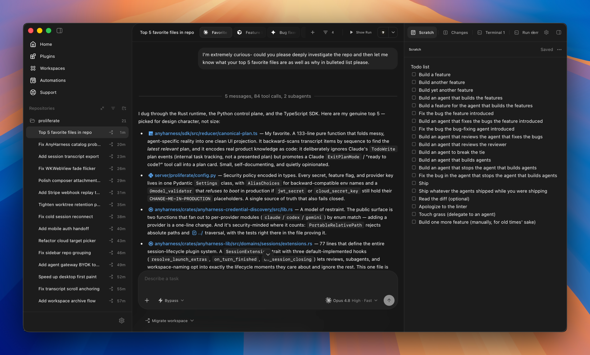

<div align="center">

<p>
  <picture>
    <source media="(prefers-color-scheme: dark)" srcset="./specs/developing/assets/readme/proliferate-wordmark-dark.svg" />
    
  </picture>
</p>

<h3>Build and own workflows for any coding agent</h3>

<p>
  <a href="https://github.com/proliferate-ai/proliferate"></a>
  <a href="https://proliferate.com/changelog"></a>
  <a href="./LICENSE"></a>
  <a href="https://proliferate.com/docs"></a>
  <a href="https://discord.gg/7b5afMTqW"></a>
</p>

<br />

Turn Claude Code, Codex, Cursor, OpenCode, Grok, and open models into repeatable software workflows.<br />
Use the best agent for each step, run locally or in the cloud, and keep the workflow layer open source.

<br />

<p>
  <a href="https://proliferate.com/api/download"><strong>Download for macOS</strong></a>
  &nbsp;&bull;&nbsp;
  <a href="https://proliferate.com/docs/product/quickstart">Quickstart</a>
  &nbsp;&bull;&nbsp;
  <a href="https://proliferate.com/docs/product/workflows">Workflows</a>
  &nbsp;&bull;&nbsp;
  <a href="https://proliferate.com/docs/deployment">Self-hosting</a>
</p>



</div>

<br />

Proliferate is an open-source workspace for turning one-off coding-agent runs
into work you can repeat, inspect, and share. It keeps each agent's native
harness intact, gives every task an isolated workspace, and lets you choose the
model, tools, authentication, and execution environment that fit the job.

## Use the Best Agent for Each Step

The best workflow rarely belongs to one model. A release workflow might look
like this:

```text
GitHub issue
  -> Claude Code plans the change
  -> Codex implements it and runs the tests
  -> OpenCode + an open model reviews the result
  -> Proliferate opens a pull request for you to review
```

Proliferate's workflow editor is in **beta**. Workflows can combine agent
prompts with typed outputs, scripts, model switches, branches, pull requests,
notifications, and reusable sub-workflows. Run them manually, on a schedule,
or from a polling feed, then inspect the sessions, outputs, cost, and status of
each run.

Use a frontier model for the hard step and a cheaper or self-hosted model for
routine review and triage. Your workflow stays the same when the model changes.

[Read the workflow guide](https://proliferate.com/docs/product/workflows).

## Bring Your Agent

Each agent runs through its native harness, so its authentication, tools,
models, permissions, and transcript behavior stay intact. Proliferate adds the
shared workspace, execution, and review layer around it.

<table>
  <tr>
    <td align="center" width="120">
      <br />
      <strong>Claude Code</strong>
    </td>
    <td align="center" width="120">
      <picture>
        <source media="(prefers-color-scheme: dark)" srcset="./apps/desktop/public/provider-icons/codex-dark.svg" />
        
      </picture><br />
      <strong>Codex</strong>
    </td>
    <td align="center" width="120">
      <br />
      <strong>OpenCode</strong>
    </td>
    <td align="center" width="120">
      <picture>
        <source media="(prefers-color-scheme: dark)" srcset="./specs/developing/assets/readme/cursor-dark.svg" />
        
      </picture><br />
      <strong>Cursor</strong>
    </td>
  </tr>
</table>

Use the subscriptions you already pay for, bring provider API keys, connect
your own model gateway, or run open models through OpenCode. Grok and other
supported harnesses use the same native adapter layer.

[See supported agents and authentication](https://proliferate.com/docs/product/agents).

## From One Agent Run to a Team Workflow

- **Isolated workspaces.** Give every task its own local checkout, worktree, or
  cloud sandbox so agents do not compete over branches and files.
- **Parallel work.** Run several agents at once, compare approaches, and keep
  each branch reviewable.
- **Shared tools.** Configure MCP servers, skills, and integrations once and
  make them available to the agents that need them.
- **Reviewable output.** Inspect transcripts, terminals, files, tests, and git
  diffs before you merge.
- **Reusable workflows (beta).** Encode recurring implementation, review,
  triage, and maintenance work instead of rebuilding the process in chat.
- **Team execution (beta).** Run shared workflows in organization cloud
  environments with centralized configuration and run history.

## Run Where the Work Belongs

| Target | Best for | Availability |
| --- | --- | --- |
| Local checkout | Fast feedback in an existing working directory | Available |
| Local worktree | Parallel tasks with isolated branches and files | Available |
| Proliferate Cloud | Long-running work in isolated cloud sandboxes | Beta |
| Self-hosted control plane | Teams that need to operate the application layer themselves | Beta |

Cloud workspaces keep running after you close your laptop. Local work keeps the
fast feedback loop and credentials on your machine. Both use the same workspace
and review model.

[Learn about workspaces](https://proliferate.com/docs/product/workspaces).

## Own the Workflow Layer

The workflow is more than a prompt. It accumulates your model choices, tools,
repository context, environments, triggers, outputs, and operating rules. That
should not become a dependency on one model vendor's application.

Proliferate is licensed under **AGPL-3.0**. You can inspect it, extend it, and
self-host the control plane. The official self-hosted deployment is currently
in beta and uses Docker Compose or the provided AWS stack. Cloud workspace
runtimes are still provider-hosted today; self-hosting the control plane does
not yet mean self-hosting the sandbox substrate.

[Self-host Proliferate](https://proliferate.com/docs/deployment).

## Getting Started

### Download the App

Download Proliferate for macOS from
[proliferate.com](https://proliferate.com/api/download), then follow the
[quickstart](https://proliferate.com/docs/product/quickstart) to connect a
repository and run your first agent.

### Run From Source

Requirements:

- Rust stable
- Node.js 22+
- pnpm

Run the desktop app with the bundled local AnyHarness runtime:

```bash
make install
make dev-local
```

<details>
<summary>Run the local full stack</summary>

Additional requirements:

- Python 3.12+
- `uv`
- Docker, for the local control plane database

Use a named development profile:

```bash
make server-install
make setup PROFILE=main
make build
make run PROFILE=main
```

See [dev profiles](./specs/developing/local/dev-profiles.md) for profile state,
ports, generated Tauri configuration, and app labels.

</details>

<details id="self-hosting">
<summary>Self-host Proliferate (beta)</summary>

Every `server-v*` release publishes a standalone deployment bundle. The
canonical deployment contains Caddy, Postgres, migrations, and the Proliferate
API.

- **Docker Compose:** [deployment guide](./specs/developing/deploying/self-hosted-deploy.md)
- **AWS:** [one-click stack](./specs/developing/deploying/self-hosted-aws.md)
- **Configuration:** [`server/deploy/.env.production.example`](./server/deploy/.env.production.example)

Point the desktop app at your control plane with `apiBaseUrl` in
`~/.proliferate/config.json`. Expect rough edges while self-hosting is in beta.
Please [open an issue](https://github.com/proliferate-ai/proliferate/issues/new/choose)
or ask in [Discord](https://discord.gg/7b5afMTqW) if you hit one.

</details>

## How It Works

- **Desktop and web apps** provide the workspace, workflow, transcript,
  terminal, file, and review surfaces.
- **AnyHarness** is the Rust runtime underneath Proliferate. It exposes HTTP
  and SSE APIs for workspaces, sessions, transcripts, tools, and agent-specific
  harness adapters.
- **The control plane** manages organizations, repositories, cloud workspaces,
  automations, shared configuration, and billing.
- **Isolated runtimes** execute agent work locally or in cloud sandboxes.

Start with the [architecture overview](./specs/codebase/README.md) if you want
to explore the codebase.

## Community

- Join [Discord](https://discord.gg/7b5afMTqW)
- Read the [documentation](https://proliferate.com/docs)
- Follow the [changelog](https://proliferate.com/changelog)
- Report vulnerabilities through [SECURITY.md](./SECURITY.md)

## Contributing

Contributions are welcome. See [CONTRIBUTING.md](./CONTRIBUTING.md).

## License

[AGPL-3.0](./LICENSE)
