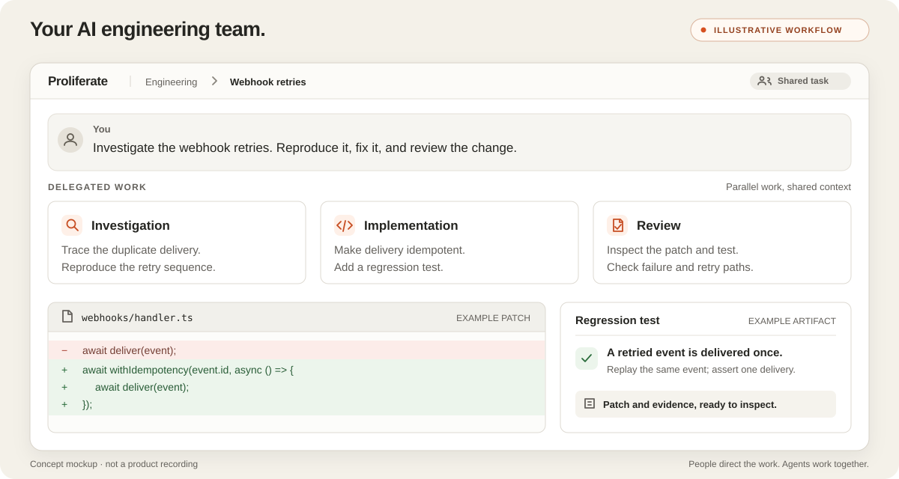
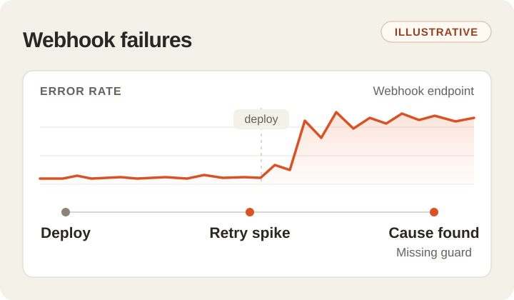
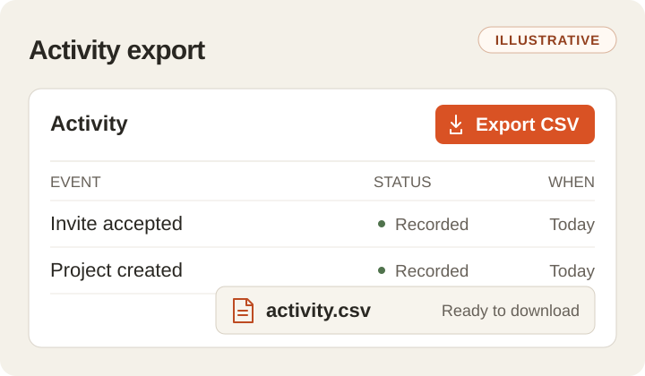
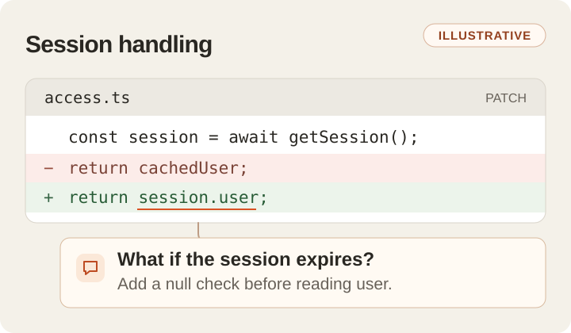
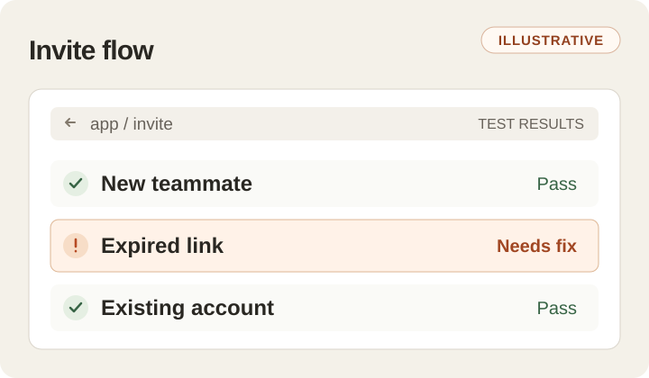
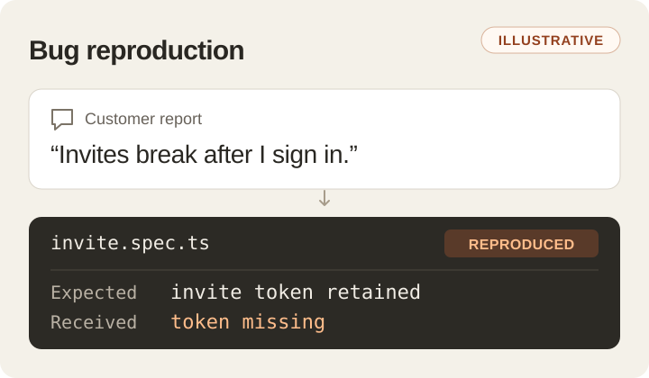
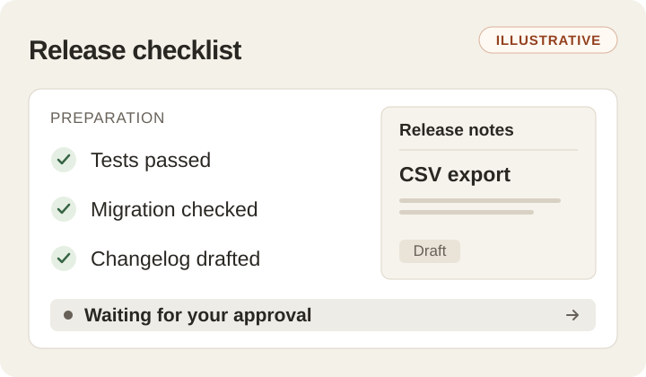

<div align="center">

<p>
  <picture>
    <source media="(prefers-color-scheme: dark)" srcset="./assets/readme/proliferate-wordmark-dark.svg" />
    
  </picture>
</p>

<h3>Your AI engineering team. Open source.</h3>

<p>
  <a href="https://github.com/proliferate-ai/proliferate/stargazers"></a>
  <a href="https://proliferate.com/changelog"></a>
  <a href="./LICENSE"></a>
</p>

<br />

Give your agents real engineering work, together with your team.

<br />

<p>
  <a href="https://proliferate.com"><strong>Download for macOS</strong></a>
  &nbsp;&bull;&nbsp;
  <a href="#self-hosting">Self-host</a>
  &nbsp;&bull;&nbsp;
  <a href="https://proliferate.com">Managed cloud</a>
</p>



</div>

## Who's on your team?

Example assignments. Pick a role to see the prompt.

<table>
  <tr>
    <td width="50%" align="center">
      <a href="./assets/readme/team/examples.md#on-call-engineer"><br /><strong>On-call engineer →</strong></a>
    </td>
    <td width="50%" align="center">
      <a href="./assets/readme/team/examples.md#product-engineer"><br /><strong>Product engineer →</strong></a>
    </td>
  </tr>
  <tr>
    <td align="center">
      <a href="./assets/readme/team/examples.md#code-reviewer"><br /><strong>Code reviewer →</strong></a>
    </td>
    <td align="center">
      <a href="./assets/readme/team/examples.md#qa-engineer"><br /><strong>QA engineer →</strong></a>
    </td>
  </tr>
  <tr>
    <td align="center">
      <a href="./assets/readme/team/examples.md#support-engineer"><br /><strong>Support engineer →</strong></a>
    </td>
    <td align="center">
      <a href="./assets/readme/team/examples.md#release-engineer"><br /><strong>Release engineer →</strong></a>
    </td>
  </tr>
</table>

## Bring the tools your team already uses

**GitHub repos · Linear · Sentry · PostHog · Notion · Supabase · GitLab.com ·
Render · Neon · Axiom · Context7 · Exa · Tavily**

Plus custom remote MCP servers. Slack read/search is available behind a deployment gate.

<details>
<summary>Current connection support</summary>

- **Slack is still in development.** Its MCP read/search connection is gated by
  deployment configuration. The conversational Slack app and agent message
  delivery are not included in this release.
- **GitHub access here is repository access.** A built-in agent-tool connection
  for GitHub issues and comments is not included.
- Other listed connections use remote MCP servers and require account setup.
- Supabase defaults to read-only, and the Neon connection is configured
  read-only. Available actions depend on the provider, connection, and grants.
- Custom connections use remote HTTP(S) MCP endpoints. Authentication support
  depends on the connection type.

See the [connector catalog](./server/proliferate/server/integration_gateway/connections/seeds.py)
and [integration docs](https://proliferate.com/docs/product/integrations) for
configuration. Provider availability can change; the catalog is not a record
of live connectivity checks.

</details>

## Use your agents

Native harnesses. Model choice and authentication depend on the agent.

<table>
  <tr>
    <td align="center" width="120">
      <br />
      <strong>Claude</strong>
    </td>
    <td align="center" width="120">
      <picture>
        <source media="(prefers-color-scheme: dark)" srcset="./apps/desktop/public/provider-icons/codex-dark.svg" />
        
      </picture><br />
      <strong>Codex</strong>
    </td>
    <td align="center" width="120">
      <br />
      <strong>OpenCode</strong>
    </td>
    <td align="center" width="120">
      <picture>
        <source media="(prefers-color-scheme: dark)" srcset="./assets/readme/cursor-dark.svg" />
        
      </picture><br />
      <strong>Cursor</strong>
    </td>
    <td align="center" width="120">
      <picture>
        <source media="(prefers-color-scheme: dark)" srcset="./assets/readme/grok-dark.svg" />
        
      </picture><br />
      <strong>Grok</strong>
    </td>
  </tr>
</table>

## Software your company can own

Companies should own the platform their agents work through. Proliferate is
**[AGPL-3.0](./LICENSE)**, with full-product self-hostability as the goal.
Managed hosting is the option we operate for you.

**Work in progress:** the current control plane and web app are self-hostable.
Cloud workspaces still use E2B; the fully owned sandbox stack and broader team
experience are being built.

## Self-hosting

[Guided install](./guides/deploying/self-hosted-deploy.md#guided-installer-recommended) ·
[AWS deployment](./guides/deploying/self-hosted-aws.md) ·
[Configuration](./server/deploy/.env.production.example)

<details>
<summary>Run from source</summary>

Requires Rust stable, Node.js 22+, and pnpm.

Run the desktop app with the bundled local AnyHarness runtime:

```bash
make install
make dev-local
```

**Local full-stack development** additionally requires Python 3.12+, `uv`, and
Docker for the local control plane database. Use named dev profiles when
multiple worktrees run at the same time.

```bash
make server-install
make setup PROFILE=main
make build # first clean worktree, or after generated/Rust/frontend artifacts change
make dev-list
make run PROFILE=main
```

See [dev profiles](./guides/local/dev-profiles.md) for profile state, ports,
generated Tauri config, and app labels.

</details>

## Build with us

Share what your team builds. Help make the next job easier.

[Community](https://discord.gg/2RVNNzEZnj) ·
[Contribute](./CONTRIBUTING.md) ·
[Docs](https://proliferate.com/docs) ·
[Changelog](https://proliferate.com/changelog) ·
[Report a vulnerability](./SECURITY.md)
