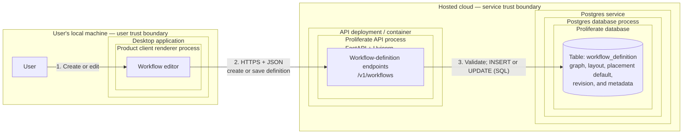
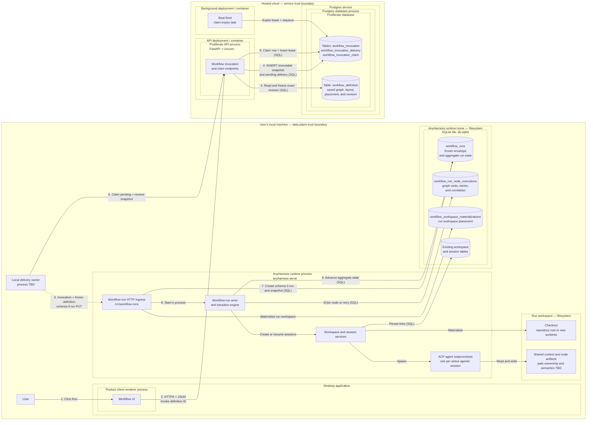

Description: Define the v1 local workflows product and the architecture that can extend to later workflow capabilities.
Date: 2026-08-07
Status: working draft

# Workflows v1 launch

This is the working ADR for the workflows PR ladder. The filename and date are
provisional until the team approves the decision. Per the
[ADR procedure](../guides/process/adrs.md), this file lands in `adrs/` only in
the final PR of the ladder, after the decision has shipped.

## Orientation

### Purpose

Workflows let a user define, save, and execute a directed graph of agentic work.
A graph contains agentic work nodes (`agent` and `human_in_loop`), conditional
decision nodes (`choice`), and terminal nodes (`succeed` and `fail`). A workflow
definition is JSON conforming to a schema owned by this repository.

The product is intended to become a general infrastructure primitive for
individuals and teams automating knowledge work, including software delivery,
support engineering, ticket triage, on-call response, bug fixes, and email.

### Goals

- Ship a deliberately scoped workflows feature end to end for v1.
- Let a user manually create and save a workflow definition.
- Let a user manually trigger a saved workflow.
- Choose runtime and data-model primitives that can accommodate the planned
  follow-up capabilities without redesigning the foundation.

### Non-goals

- Generating workflows from a prompt. A later workflow-builder agent will need
  repository-owned Markdown rules that encode the product's workflow standards.
- Triggering workflows through webhooks or schedules. V1 supports only manual
  triggers.
- Executing workflows in a cloud sandbox. V1 execution is local only.

### Requirements

1. The implementation consists of four sequential PRs: engine, data models,
   workflow lifecycle orchestration, then UI and client. The ladder may carry
   temporary migration code, but the released feature has one graph definition,
   invocation, and run path. Each PR removes the beta behavior whose graph
   replacement becomes complete in that PR.
2. The v1 product surface stays intentionally narrow, but its runtime primitives
   and data model account for the known follow-up capabilities so those changes
   do not require an architectural redesign.
3. A user can create a workflow manually in the graph UI.
4. A user can save a workflow as a `workflowDefinition`.
5. A user can modify an existing `workflowDefinition` and save it in place.
6. A user can delete an existing `workflowDefinition`.
7. A user can manually trigger an existing `workflowDefinition`.
8. Each `agent` and `human_in_loop` node has its own model configuration.
9. Each workflow run creates its own workspace.
10. A `workflowDefinition` specifies whether a run creates a new worktree
    or runs at the repository root by default.
11. When manually triggering a workflow, the user can override the definition's
    worktree or repository-root default in the UI.
12. One workflow run owns one workspace, and each agentic workflow run node
    maps to one session in that workspace.
13. Each `agent` and `human_in_loop` node receives a prompt, a set of goals, and
    optional verification methods.
14. A `choice` node evaluates a condition and selects an outgoing branch.
15. A valid workflow has exactly one `succeed` node and exactly one `fail` node;
    these are its only terminal node types.
16. Every non-terminal node has an edge to `fail` for runtime errors and
    exceptions.
17. Multiple nodes may have an edge to `succeed`.
18. All nodes in a workflow run share context under
    `<workspace-root>/context/shared/<document>`. Shared context is typically
    Markdown but may be any file or artifact usable by agents and humans.
19. All nodes have full read and write access to
    `<workspace-root>/.proliferate/workflows/<workflow-name>/shared/`.
20. Each agentic node can create files and artifacts under
    `<workspace-root>/.proliferate/workflows/<workflow-name>/<node-index>/`, where
    `<node-index>` is the zero-padded agentic-node index (`00`, `01`, `02`, and
    so on).
21. The graph UI shows each agentic node's index in both definition and run
    views, matching the index used in the node artifact path in requirement 20.
22. A workflow run workspace uses the same UI and UX primitives as a
    normal workspace and its sessions.
23. A user can chat in any workflow-generated session.
24. A user can manually create additional sessions in a workflow run
    workspace to work with the workflow's shared context.
25. Agentic nodes (i.e. `agent`/`human_in_loop`) should inherit permissions for
    all configured integrations that the user has for their normal sessions.

## Current context

A complete Workflows beta already ships in this repository, spanning the
product clients, the Cloud SDKs, the hosted control plane, and the AnyHarness
runtime. Its current operating law is
[Workflows](../specs/FEATURE_DOCS/WORKFLOWS.md).
The beta models a workflow as a linear document executed remotely:

- A definition is `inputs[]` plus ordered `stages[]`; each stage is one
  `harnessConfig` plus sequential `agent.prompt` steps
  ([Workflow Definitions](../specs/FEATURE_DOCS/WORKFLOWS.md#workflow-definitions)).
  There are no other node kinds, no edges, no conditions, and no terminal
  vocabulary.
- The only executable shape is exactly one stage containing exactly one prompt
  step, run as one prompt in one new session in one workspace
  ([Workflow Runs](../specs/FEATURE_DOCS/WORKFLOWS.md#workflow-runs); enforced for
  both schema versions in
  [service.rs](../anyharness/crates/anyharness-lib/src/domains/workflows/service.rs)
  and
  [portable_validation.rs](../anyharness/crates/anyharness-lib/src/domains/workflows/portable_validation.rs)).
- The only launch target is `managedCloud`: a Cloud worker pipeline delivers
  the run into the user's personal cloud sandbox
  ([Portable Invocation and Target Resolution](../specs/FEATURE_DOCS/WORKFLOWS.md#portable-invocation-and-target-resolution),
  [Managed Cloud Workflow Execution](../specs/FEATURE_DOCS/WORKFLOWS.md#managed-cloud-workflow-execution)).
  There is no local execution path.
- Triggers are manual-only, matching this ADR's non-goals. New managed
  delivery is gated off by default (`WORKFLOW_MANAGED_RUNS_ENABLED`,
  [env-vars.yaml](../specs/developing/reference/env-vars.yaml)). Definition
  authoring, run history, and cancellation are live for every signed-in user
  behind a dismissable interstitial that gates nothing structurally
  ([WorkflowsBetaGateModal.tsx](../apps/packages/product-client/src/components/workflows/WorkflowsBetaGateModal.tsx)).

This decision extends the beta into a locally executed JSON graph of `agent`,
`human_in_loop`, `choice`, `succeed`, and `fail` nodes. Graph-specific work adds
versioned definition, invocation, and run members, a transition engine,
node-attempt state, and a graph editor. Parent resource names stay the same.
Definition ownership and revisioning, immutable invocation acceptance,
workflow-run replay and cancellation, session correlation, and workspace
materialization already match the required boundaries.

The cutover migration is:

```text
workflow definition schema 1  beta linear document      ── migrate in place ──► schema 2 graph document

workflow invocation schema 1  managed-cloud target      ── terminalize, then archive or delete
workflow invocation schema 2  local graph-run delivery  ── only accepted member after cutover

AnyHarness workflow run schema 1/2  beta one-prompt run ── terminalize, then archive or delete
AnyHarness workflow run schema 3    graph run            ── only accepted member after cutover

workspace materialization schema 1  beta placement       ── archive or delete with its beta run
workspace materialization schema 2  graph-run placement  ── only active member after cutover
```

The version numbers preserve lineage and make stale clients fail closed; they
do not define parallel supported behaviors. Graph writers are enabled only
after the migration proves there are no active beta invocations or runs and no
schema-1 definition remains in the live table. Final APIs reject beta contract
members, and the released runtime contains no linear executor or recovery path.

### Source tree, ordered by data flow

Only the paths below are the feature. `hooks/<area>/workflows/` and
`lib/workflows/**` elsewhere in the frontend are an action-orchestration
naming convention, `.github/workflows/**` is CI, and the legacy `automations`
domain is the older scheduled-sessions feature whose routes redirect to
`/workflows`; none of those are part of the beta.

```text
apps/packages/product-client/src/
├── pages/WorkflowsPage.tsx                      /workflows routes; beta interstitial
├── components/workflows/                        form editor; run launch/history/detail
├── hooks/workflows/workflows/                   save/launch/cancel/open actions
├── hooks/access/cloud/workflows/                Cloud query access wrappers
└── domain/workflows/                            client twin of the linear definition

cloud/sdk-react/src/hooks/workflows.ts           queries; 3 s nonterminal run polling
cloud/sdk/src/client/workflows.ts                wraps the eleven Cloud endpoints

server/proliferate/
├── server/workflows/                            api, service, managed gate, validation
│   └── worker/                                  workflows.deliver / observe / cancel
├── server/cloud/workspaces/workflow_binding.py  Cloud workspace alias per run
├── db/models/workflows.py                       the three Postgres tables
└── integrations/anyharness/workflow_*.py        runtime HTTP clients

anyharness/crates/
├── anyharness-contract/src/v1/workflow_*.rs     v1 + v2 wire contracts
├── anyharness-lib/src/api/http/workflow_*.rs    the five runtime endpoints
├── anyharness-lib/src/domains/workflows/        acceptance, resolution, execution,
│   │                                            run control
│   └── workspace_materialization/               placement claim for workflows/<runId>
├── anyharness-lib/src/domains/workspaces/       workflow_placement.rs worktree seam
├── anyharness-lib/src/domains/sessions/         admission.rs session admission
└── anyharness-lib/src/persistence/              migrations 0060–0064; three SQLite
                                                 tables
```

### Clients — `apps/packages/product-client`, one surface for Desktop and Web

Routes `/workflows`, `/workflows/:workflowId`, and
`/workflows/:workflowId/runs/:runId`
([app-routes.ts](../apps/packages/product-client/src/config/app-routes.ts))
mount a sequential form editor — title, description, default repository,
scalar input rows, ordered stage cards with catalog-driven agent/model/effort
selects, ordered prompt blocks with optional goal
([WorkflowDefinitionEditor.tsx](../apps/packages/product-client/src/components/workflows/WorkflowDefinitionEditor.tsx))
— plus managed-run launch, cursor-paginated history, and a run detail view of
the remote delivery pipeline
([WorkflowRunsSurface.tsx](../apps/packages/product-client/src/components/workflows/runs/WorkflowRunsSurface.tsx)).
The editor authors up to 64 stages and steps, but launch eligibility blocks
anything beyond one stage, one step, no goal: authoring capability already
exceeds runnable capability. Navigation chrome: a sidebar entry with a beta
pill, a command palette entry, a keyboard shortcut, and legacy `/automations`
redirects into `/workflows`. Mobile and the Desktop shell have no additional
workflow surfaces.

- Reused: app routing and navigation chrome; definition list, query, mutation,
  revision-conflict, and draft-preservation mechanics; the catalog-driven
  agent/model/effort selectors as the basis for per-node model configuration
  (requirement 8); the ordinary workspace and session UI that requirement 22
  mandates, which the beta never modified.
- Replaced at UI cutover: requirements 3 and 21 require a graph editor with
  visible node indexes; the current surface is a sequential form, and
  [Workflow Definitions](../specs/FEATURE_DOCS/WORKFLOWS.md#workflow-definitions)
  records "There is no canvas". The run detail view narrates remote delivery
  custody that local execution does not have.

### SDKs — `cloud/sdk`, `cloud/sdk-react`, `anyharness/sdk`

[client/workflows.ts](../cloud/sdk/src/client/workflows.ts) wraps the eleven
Cloud endpoints;
[hooks/workflows.ts](../cloud/sdk-react/src/hooks/workflows.ts) owns
definition queries, mutation actions, and 3-second nonterminal run polling.
The AnyHarness SDK carries workflow runs only as generated OpenAPI types,
pinned by
[workflow-runs.test.ts](../anyharness/sdk/src/workflow-runs.test.ts) against
[workflow-portable-execution/v1.json](../fixtures/contracts/workflow-portable-execution/v1.json).

- Extended: the Cloud SDK keeps its definition and invocation resource clients,
  adding graph-definition schema 2, local-invocation schema 2, and invocation
  claim operations. The AnyHarness SDK keeps `/workflow-runs` and adds strict
  schema-3 request and response members plus human-decision and retry methods.
- Removed at cutover: managed-cloud `deliver`, projection-specific client
  models, beta definition types, and AnyHarness V1/V2 run types. The final SDKs
  expose only graph definitions, local invocations, and graph runs.

### Hosted control plane — `server/`

[api.py](../server/proliferate/server/workflows/api.py) owns eleven endpoints
under `/v1/workflows` and `/v1/workflow-invocations`: definition CRUD plus
run-eligibility, immutable invocation acceptance, deliver, cancel, and
history. Three Postgres tables live in
[db/models/workflows.py](../server/proliferate/db/models/workflows.py):
`workflow_definition` (linear `inputs_json`/`stages_json`, `schema_version`
CHECK-pinned to 1, optimistic `revision`, soft delete), `workflow_invocation`
(immutable snapshot; only `target.kind == "managedCloud"` is accepted), and
`workflow_managed_execution` (delivery checkpoints, sandbox custody,
monotonic runtime projection). Delivery runs as three outbox tasks —
`workflows.deliver`, `workflows.observe`, `workflows.cancel`
([worker/delivery.py](../server/proliferate/server/workflows/worker/delivery.py))
— that place a workspace, bind a product Cloud workspace alias
([workflow_binding.py](../server/proliferate/server/cloud/workspaces/workflow_binding.py)),
PUT the run into the sandbox runtime, and poll it to a terminal state.
[check_workflow_managed_boundaries.py](../scripts/check_workflow_managed_boundaries.py)
ratchets this tree off the legacy Cloud sync planes.

- Reused and extended: the five definition routes, `workflow_definition`
  ownership and revision compare-and-set, `/workflow-invocations`, immutable
  `workflow_invocation` snapshots, caller-minted IDs, canonical replay,
  owner-safe conflicts, history pagination, and cancellation intent.
- Added: graph-definition schema 2, local-invocation schema 2,
  `workflow_invocation_delivery`, and `workflow_invocation_claim`.
- Removed at cutover: `workflow_managed_execution`, managed delivery workers,
  projection polling, sandbox custody, `/deliver`, and `run-eligibility`. They
  encode the beta cloud target and have no graph-local responsibility.

### AnyHarness runtime — `anyharness/`

Five endpoints: `PUT`/`GET /v1/workflow-runs/{runId}`,
`POST /v1/workflow-runs/{runId}/cancel`, and
`PUT`/`GET /v1/workflow-run-workspaces/{runId}`
([workflow_runs.rs](../anyharness/crates/anyharness-lib/src/api/http/workflow_runs.rs),
[workflow_workspaces.rs](../anyharness/crates/anyharness-lib/src/api/http/workflow_workspaces.rs)).
A run freezes `invocation_json` as canonical-JSON replay identity, resolves
one concrete agent/model/mode/effort plan before effects
([resolution.rs](../anyharness/crates/anyharness-lib/src/domains/workflows/resolution.rs)),
creates one InternalOnly session, dispatches the single deterministic prompt
`workflow:<runId>:0:0`
([model.rs](../anyharness/crates/anyharness-lib/src/domains/workflows/model.rs)),
and terminalizes through a session-completion extension. Run control adds
truthful cancellation, `stateVersion`, restart fencing to
`interrupted/runtime_restarted`, and exclusive session admission with
`409 SESSION_CONTROLLED_BY_WORKFLOW`
([Run Control and Session Admission](../specs/FEATURE_DOCS/WORKFLOWS.md#run-control-and-session-admission)).
Placement materializes `<managed-worktrees-root>/workflows/<runId>` on branch
`workflow/<runId>` — scratch or repository worktree, never repository root
([Workspace Placement](../specs/FEATURE_DOCS/WORKFLOWS.md#workspace-placement)).
Local persistence is three SQLite tables — `workflow_runs`,
`workflow_run_steps`, `workflow_workspace_materializations`, plus a
partial-unique active-controller index — across migrations 0060–0064, snapshot
in [anyharness-db-schema.sql](../specs/GENERATED/anyharness-db-schema.sql).
Steps are addressed as `(stage_index, step_index)`, a linear coordinate space
with only `(0, 0)` ever materialized. Nothing resembling the requirement
18–20 shared-context paths exists; run artifacts live only in session
transcripts.

- Reused and extended: `/workflow-runs`, `workflow_runs`, the
  accept/replay/conflict store boundary, state versions, durable cancellation,
  exact session/prompt/turn correlation, detached effect handoff, and the
  generic seams the beta added to the sessions domain (checked
  internal session creation, persisted startup, text-prompt dispatch with a
  caller-owned prompt ID, `SessionExtension` completion hooks) and the
  workspace materialization state machine, worktree implementation, and
  operation gates.
- Added: workflow-run schema 3, graph transition policy, one actor per live
  schema-3 run, and `workflow_run_node_executions` for graph visits and retries.
- Removed at cutover: `workflow_run_steps`, the one-prompt executor, run-level
  session/resolved-plan fields, V1/V2 wire contracts, and V1/V2 startup
  recovery. No beta run can execute after the graph writer is enabled.

### Workspace and session lifecycle, repository/worktree setup

The beta consumes ordinary workspaces and sessions without changing their
contracts: a placed workflow workspace is a visible ordinary workspace
excluded from generic retention by creator context, and the run's session is
a normal session inspectable through existing session APIs. The new feature
keeps that posture (requirements 22–24) and needs two behaviors the beta
lacks: run-owned workspace creation with a repository-root mode
(requirements 9–10), and open chat in workflow sessions, which the beta's
exclusive admission deliberately rejects while a run is nonterminal
([admission.rs](../anyharness/crates/anyharness-lib/src/domains/sessions/admission.rs)).

### Canonical documentation and repository tooling

The workflow feature document above is current-status operating law, and
roughly twenty more documents reference the beta: server and AnyHarness structure
guides, the product system map, testing scenarios (active `T2-WFDEF-1` and
parked `T2-WF`/`T3-WF` rows in
[scenarios.md](../specs/TESTING/scenarios.md)), the env-var reference, the
generated SQLite schema, contract fixtures
([workflow-definition](../fixtures/contracts/workflow-definition/minimal.json)),
and the intent spec
[workflow-definitions.spec.ts](../tests/intent/specs/workflow-definitions.spec.ts).
[check_docs.py](../scripts/check_docs.py) pins the workflows README as a
required routing root. Each ladder PR updates these documents, fixtures, and
generated references in the same PR that changes their behavior, per
[specs/README.md](../specs/README.md).

### Reuse and extension decision

| Shipped primitive | V1 treatment |
| --- | --- |
| `workflow_definition`, five `/v1/workflows` routes, ownership, revision CAS, soft delete | Keep the resource and routes. Migrate every live row to graph schema 2, then remove linear columns, contracts, validation, and editor code. |
| `workflow_invocation`, `/v1/workflow-invocations`, canonical replay, history, cancel | Keep the resource and routes for schema-2 local invocations. Stop beta acceptance, terminalize old work, and remove schema-1 contracts. |
| `workflow_managed_execution`, managed delivery workers, `/deliver` | Remove after terminalizing beta invocations. Archive or delete historical rows before dropping the table. |
| `/v1/workflow-runs`, `workflow_runs`, state versions, cancellation, replay | Keep the resource and table, rebuilding them for schema-3 graph runs only. |
| `workflow_run_steps` | Remove after beta runs are terminalized and archived or deleted. Graph runs use `workflow_run_node_executions`. |
| `workflow_workspace_materializations` and worktree placement | Keep the table and workspace seams, rebuilding the active table for schema-2 repository-root/new-worktree placement only. |
| One-prompt executor and run-wide resolved plan | Remove. The graph actor and per-node resolution become the only run implementation. |
| Exclusive `SESSION_CONTROLLED_BY_WORKFLOW` policy | Remove. Graph node sessions use normal interactive session admission. |
| Sequential editor and managed-cloud detail | Replace at UI cutover while retaining routes, CRUD actions, query infrastructure, catalog controls, and ordinary run/workspace surfaces. |

### Migration through the ladder

Temporary migration readers may coexist inside the ladder, but they are not a
second product mode. Engine work adds no writer. Data-model work adds the
deterministic definition migration and the invocation/run disposition
migrations. Lifecycle work drains beta delivery and wires schema-2 invocations
to schema-3 runs. The UI/client PR enables graph writers and deletes the
remaining linear and managed-cloud code. Release is blocked unless an invariant
sweep proves that active tables contain only definition schema 2, invocation
schema 2, run schema 3, and materialization schema 2.

## External systems and spikes
- 

## Design

### Preferred design

The v1 launch keeps the beta's separation between durable product intent and a
runtime-owned run. Reusable definitions and immutable invocations live in the
hosted control plane. A claimed invocation becomes a run whose frozen
definition and live graph state live in the executor runtime's SQLite database
on the user's machine.

This ADR uses the shipped resource vocabulary:

- A **definition** is the saved, revisioned workflow configuration.
- An **invocation** is the immutable control-plane intent created when a user
  triggers a definition.
- A **run** is the durable AnyHarness activity created from an invocation.
- **Execution** describes the activity in ordinary prose. It is not the name of
  a new parent API resource, table, or domain aggregate.

The beta schemas are migration inputs, not runtime variants. After cutover,
live product APIs, workers, stores, and UI accept only graph definitions,
local invocations, and graph runs.

The maps below read from the outside in: infrastructure and trust boundary,
deployment or container, operating-system process, logical module or endpoint,
then table or filesystem. Only a box explicitly labeled as a process or
container is a running unit. `TBD` marks a placement, transport, or path that
this design has not settled.

#### Control-plane flow: create and save a definition

Source-readable deployment map:

```text
USER'S LOCAL MACHINE — user trust boundary
├─ User
└─ Desktop application
   └─ Product client renderer process
      └─ Workflow editor

HOSTED CLOUD — service trust boundary
├─ API deployment / container
│  └─ Proliferate API process (FastAPI + Uvicorn)
│     └─ Workflow-definition endpoints (`/v1/workflows`)
└─ Postgres service
   └─ Postgres database process
      └─ Proliferate database
         └─ table: workflow_definition
            └─ graph, layout, placement default, revision, and metadata

FLOW
1. User ── create or edit ──► Workflow editor
2. Workflow editor ── HTTPS + JSON ──► Workflow-definition endpoint
3. Workflow-definition endpoint ── validate; INSERT or UPDATE (SQL)
   ──► workflow_definition
```

Rendered map:



#### Data-plane flow: run a saved definition locally

Source-readable deployment map:

```text
USER'S LOCAL MACHINE — data-plane trust boundary
├─ User
├─ Desktop application
│  └─ Product client renderer process
│     └─ Workflow UI
├─ Local delivery owner (process TBD)
│  └─ claims pending invocations and forwards them to loopback
├─ AnyHarness runtime process (`anyharness serve`)
│  ├─ Workflow-run HTTP ingress (`/v1/workflow-runs`)
│  ├─ Workflow-run actor and transition engine
│  ├─ Workspace and session services
│  └─ ACP agent subprocesses (one per active agentic session)
├─ AnyHarness runtime home (filesystem)
│  └─ SQLite file: db.sqlite
│     ├─ workflow_runs: frozen envelope and aggregate run state
│     ├─ workflow_run_node_executions: graph visits, retries, and correlation
│     ├─ workflow_workspace_materializations: run workspace placement
│     └─ existing workspace and session tables
└─ Run workspace (filesystem)
   ├─ checkout: repository root or new worktree
   └─ shared context and node artifacts (path ownership and semantics TBD)

HOSTED CLOUD — service trust boundary
├─ API deployment / container
│  └─ Proliferate API process (FastAPI + Uvicorn)
│     └─ Workflow invocation and claim endpoints
├─ Postgres service
│  └─ Postgres database process
│     └─ Proliferate database
│        ├─ table: workflow_invocation
│        ├─ table: workflow_invocation_delivery
│        ├─ table: workflow_invocation_claim
│        └─ table: workflow_definition
│           └─ exact schemas in New and modified primitives
└─ Background deployment / container
   └─ Beat-fired claim-expiry task

FLOW
1. User ── click Run ──► Workflow UI
2. Workflow UI ── HTTPS + JSON: definition ID ──► Invocation endpoint
3. Invocation endpoint ── read and freeze exact revision (SQL)
   ──► workflow_definition
4. Invocation endpoint ── INSERT schema-2 snapshot and pending delivery (SQL)
   ──► workflow_invocation + workflow_invocation_delivery
5. Local delivery owner ── POST claim; claim endpoint INSERTs lease (SQL)
   ──► workflow_invocation_delivery + workflow_invocation_claim
6. Local delivery owner ── invocation + frozen definition; transport TBD
   ──► workflow-run PUT
7. Workflow-run PUT ── create schema-3 run and frozen snapshot (SQL)
   ──► workflow_runs
8. Workflow-run PUT ── start in process ──► workflow-run actor
9. Workflow-run actor ── advance run state (SQL)
   ──► workflow_runs + workflow_run_node_executions
```

Rendered map:



### Assumptions
- Workflows are only allowed to be executed in the local runtime

### Tradeoffs

n/a

### Alternatives

n/a

### Open decisions

| Decision | Owner | Must close by |
| --- | --- | --- |
| Define the canonical graph JSON vocabulary for definitions, run nodes, and the `succeed` terminal. The source draft used both `succeed` and `success`; this ADR consistently uses `succeed`. | Product and runtime | Engine PR delivery spec |
| Decide whether requirements 18 and 19 describe two distinct context classes or two candidate paths for the same shared context, then define ownership, visibility, cleanup, and migration semantics. | Runtime and product | Engine PR delivery spec |
| Define graph validation semantics, including entry-node cardinality, cycles, unreachable nodes, choice exhaustiveness, and whether every non-terminal node must have an explicit failure edge or may inherit one. | Runtime | Engine PR delivery spec |
| Define what "account for follow-up capabilities" means as a finite capability list so requirement 2 is testable and does not force speculative generality. | Product | Engine PR delivery spec |
| Choose archive/export versus deletion for terminal schema-1 invocations and schema-1/2 AnyHarness runs. Neither option may leave beta rows or readers in the active workflow path. | Product, server, and runtime | Data-model PR delivery spec |
| Define the cutover drain window and operator proof that no managed-cloud invocation or one-prompt run remains non-terminal before their workers and executors are removed. | Server and runtime | Lifecycle PR delivery spec |

## New and modified primitives, by grid cell

### AnyHarness

1. **`live/workflows` — new**
   - `LiveWorkflowRunManager` — owns the process-local run-to-actor registry,
     guarantees at most one actor per schema-3 run in this process, and routes
     start, recovery, and command submission by durable run ID
   - `WorkflowRunActor` — monitors for node completion, human decisions,
     cancellation, retry, and shutdown for one run, recording durable
     state before each external effect or graph transition
   - private `WorkflowRunActorHandle` — carries only the typed actor command sender
     and request/reply plumbing so callers do not depend on mailbox details or
     acquire a second workflow-state surface
   - private `WorkflowRunCommand` — closes the actor's internal command vocabulary
     over node completion, human decision, cancellation, retry, and shutdown;
     it is neither a wire contract nor a domain-state model

   An actor starts from a durable run ID and rehydrates through the
   workflow domain; there is no separate `WorkflowLaunch` object. App wiring
   supplies actor dependencies directly until a repeated dependency bundle
   earns a named internal type, so V1 does not predeclare
   `WorkflowRunActorCapabilities`. SQLite remains authoritative, and API reads
   use durable run records, so V1 has no process-local `WorkflowLiveSnapshot`.
   A live snapshot may be added only if a concrete transient state appears that
   cannot correctly be represented by actor presence plus durable state.

2. **`domains/workflows` — extended**
   - `ValidatedWorkflowGraph` — fail-closed executable graph for pure transition policy.
   - `WorkflowEvent` and `WorkflowTransitionPlan` — closed input and output of one graph decision.
   - `WorkflowRunStore` — existing SQLite boundary, extended with schema-3
     acceptance and atomic run/node compare-and-set writes.
   - `WorkflowRunService` — existing durable acceptance, transition, view, and
     recovery boundary, with its linear policy replaced by graph rules.
   - `WorkflowRunRuntime` — existing async facade, now routing every accepted
     run through `LiveWorkflowRunManager`.
   - `WorkflowRunSessionExtension` — extends the exact session/prompt lookup to
     return a node execution and forward its outcome to the run actor.
   - `WorkflowRunEnvelopeV3` — canonical immutable replay identity accepted
     before effects.
   - `FrozenWorkflowDefinition` — pins one validated definition revision across recovery.
   - `WorkflowRunRecordV3` — schema-3 aggregate state and external correlation.
   - `WorkflowRunNodeExecutionRecord` — one graph visit or retry with
     session/edge correlation.
   - `WorkflowRunViewV3` — records plus allowed actions without policy in HTTP.
   - `context_layout` — pure shared/node-artifact paths; the runtime materializes them.
   - graph run/node status and failure/interruption enums — the only persisted
     workflow control vocabulary after cutover.

   This cell owns durable workflow meaning. It validates frozen definitions,
   decides graph transitions, records run and node state, correlates
   workflow-owned session turns, and bridges durable state to
   `LiveWorkflowRunManager`.

3. **`api/http/workflow_runs` — extended**

   The required AnyHarness HTTP surface is:

   ```http
   PUT  /v1/workflow-runs/{runId}
   GET  /v1/workflow-runs/{runId}
   POST /v1/workflow-runs/{runId}/cancel
   POST /v1/workflow-runs/{runId}/human-decision
   POST /v1/workflow-runs/{runId}/retry
   ```

   - `PUT` accepts only schema 3, stores the frozen graph envelope and effective
     placement before effects, and rejects V1/V2 requests as unsupported. It
     returns `201` on create, `200` on exact replay, and `409` on mismatch.
   - `GET` returns durable run and node views, links, selected edges, state
     version, terminal or failure state, and currently allowed actions.
   - `cancel` idempotently records intent and returns the latest truthful view;
     repeats preserve the terminal result or current non-terminal state.
   - `human-decision` submits a configured choice for the waiting node at an
     observed state version; stale, non-current, or invalid requests return `409`.
   - `retry` targets a failed or interrupted node and state version, inserting a
     new correlated attempt that may reuse its session; invalid requests return `409`.

   Every handler is a thin operation over `WorkflowRunRuntime`, with wire/domain
   mappers and typed problem responses at the API boundary. V1 has no local
   run-list endpoint: the control plane owns invocation history, and every local
   read begins with a known run ID. V1 also has no
   workflow-specific event stream; the ProductClient polls the durable `GET`
   while ordinary session streams carry node-session activity.

4. **`anyharness-contract/v1/workflow_runs` — extended**
   - `VersionedPutWorkflowRunRequest::V3`
   - `VersionedWorkflowRunResponse::V3`
   - frozen schema-3 run envelope
   - run view
   - run-node view
   - effective placement
   - human-decision and retry requests
   - typed problem responses

   V1 and V2 request/response components are removed with the one-prompt
   executor. The versioned wrapper retains only V3 so stale generated clients
   receive an unsupported-schema error instead of invoking beta behavior.

5. **SQLite persistence schema — extended**

   `persistence/**` owns the migrations; `domains/workflows/store/**` owns the
   queries and row mapping. The schema is exactly:

   ```text
   workflow_runs
     id                         text primary key
     schema_version             integer not null
                                check (schema_version = 3)
     invocation_json            text not null check (json_valid(invocation_json))
     status                     text not null
                                check (status in
                                ('accepted', 'running', 'completed',
                                'failed', 'cancelled', 'interrupted'))
     workspace_id               text null
     failure_code               text null check (length(failure_code) <= 64)
     state_version              integer not null check (state_version >= 1)
     cancel_requested_at        text null
     interruption_code          text null check (length(interruption_code) <= 64)
     definition_id              text not null
     definition_revision        integer not null
                                check (definition_revision >= 1)
     definition_schema_version  integer not null
                                check (definition_schema_version = 2)
     repo_root_id               text not null
     effective_placement        text not null
                                check (effective_placement in
                                ('repository_root', 'new_worktree'))
     created_at                 text not null
     updated_at                 text not null
     started_at                 text null
     finished_at                text null

     check ((status = 'failed') = (failure_code is not null))
     check ((status = 'interrupted') = (interruption_code is not null))
     check (status <> 'cancelled' or cancel_requested_at is not null)
     check (status not in ('running', 'completed', 'interrupted') or
            workspace_id is not null)

   workflow_run_node_executions
     id                         text primary key
     run_id                     text not null
                                references workflow_runs(id) on delete cascade
     definition_node_id         text not null
     sequence                   integer not null check (sequence >= 0)
     attempt                    integer not null check (attempt >= 1)
     retry_of_node_execution_id text null
                                references workflow_run_node_executions(id)
                                on delete set null
     node_kind                  text not null
                                check (node_kind in
                                ('agent', 'human_in_loop', 'choice',
                                'succeed', 'fail'))
     agentic_index              integer null
                                check (agentic_index >= 0)
     status                     text not null
                                check (status in
                                ('pending', 'running', 'waiting_for_human',
                                'completed', 'failed', 'cancelled', 'interrupted'))
     session_id                 text null
     prompt_id                  text null unique
     turn_id                    text null
     resolved_plan_json         text null check
                                (resolved_plan_json is null or
                                json_valid(resolved_plan_json))
     selected_edge_id           text null
     next_definition_node_id    text null
     result_json                text null check
                                (result_json is null or json_valid(result_json))
     failure_code               text null check (length(failure_code) <= 64)
     interruption_code          text null check (length(interruption_code) <= 64)
     created_at                 text not null
     updated_at                 text not null
     started_at                 text null
     finished_at                text null

     check ((status = 'failed') = (failure_code is not null))
     check ((status = 'interrupted') = (interruption_code is not null))
     check ((status not in ('pending', 'running', 'waiting_for_human')) =
            (finished_at is not null))
     check ((node_kind in ('agent', 'human_in_loop')) =
            (agentic_index is not null))
     check ((node_kind in ('agent', 'human_in_loop')) =
            (prompt_id is not null))
     check ((node_kind in ('agent', 'human_in_loop')) =
            (resolved_plan_json is not null))
     check (node_kind in ('agent', 'human_in_loop') or
            (session_id is null and turn_id is null))
     check (status <> 'waiting_for_human' or node_kind = 'human_in_loop')

     unique (run_id, sequence)
     unique (run_id, definition_node_id, attempt)

   workflow_workspace_materializations
     run_id                      text primary key
     schema_version              integer not null
                                 check (schema_version = 2)
     request_json                text not null check (json_valid(request_json))
     resolved_placement_json     text null check
                                 (resolved_placement_json is null or
                                 json_valid(resolved_placement_json))
     status                      text not null
                                 check (status in
                                 ('accepted', 'materializing', 'ready', 'failed'))
     workspace_id                text null
     failure_code                text null
     failure_message             text null
     created_at                  text not null
     updated_at                  text not null
     finished_at                 text null
   ```

   The active schema contains graph runs only. Agent/model resolution belongs
   to each agentic node execution; there is no run-level session or resolved
   plan. The run status remains `completed`; entering the graph's `succeed` node
   causes that terminal status. `interrupted` is a retryable pause.

   Node table checks require `failure_code` exactly for `failed` and
   `interruption_code` exactly for `interrupted`. Node `finished_at` is present
   for every state except `pending`, `running`, and `waiting_for_human`.
   `cancel_requested_at` is write-once and required for `cancelled`.
   `agentic_index` and `prompt_id` are present exactly for `agent` and
   `human_in_loop`; `choice`, `succeed`, and `fail` also require null
   `session_id` and `turn_id`. Only `human_in_loop` may be
   `waiting_for_human`. Running, completed, and interrupted runs require
   `workspace_id`; setup failure and pre-placement cancellation may
   leave it null. The interrupted node execution itself is finished and
   immutable.

   Materialization schema 2 owns strict repository-root/new-worktree request and
   response members and is driven by the run after acceptance. The existing
   table and its accepted/materializing/ready/failed recovery state are reused.

   The exact indexes are
   `idx_workflow_runs_nonterminal(status, updated_at)` for
   `accepted|running|interrupted`,
   `idx_workflow_run_node_executions_sequence(run_id, sequence)`,
   `idx_workflow_run_node_executions_session(session_id)`, and the partial
   unique `idx_workflow_run_node_executions_active(run_id)` for
   `pending|running|waiting_for_human`. All timestamps are RFC 3339 UTC text.

   The run ID plus canonical `invocation_json` remains the replay authority.
   The active node is derived from the partial unique active-row index rather
   than duplicated as a parent pointer. `sequence` is contiguous per run;
   `attempt` is contiguous per definition node; and
   `retry_of_node_execution_id` names an earlier row from that run.
   Workspace, repo-root, session, prompt, and turn IDs are durable correlations
   rather than foreign keys to those domains, so run history survives
   ordinary artifact deletion. A node row is one graph visit or retry and
   carries its attempt and correlation identity; no separate attempt or event
   table exists in V1. `result_json` contains only the closed decision, choice,
   and verification result, never transcript or assistant output.

   A named custom foreign-key migration first verifies that no beta run is
   non-terminal, applies the chosen archive/delete policy to schema-1/2 rows,
   drops `workflow_run_steps` and the active-session-controller index, rebuilds
   `workflow_runs` for schema 3, and rebuilds
   `workflow_workspace_materializations` for schema 2. It then creates
   `workflow_run_node_executions`, restores FK enforcement, and runs
   `foreign_key_check`. Migrations 0060–0064 remain in the chain, but no beta
   table or row remains active after this migration.

6. **`app/workflows` — extended**
   - retain workflow store/service/runtime construction
   - add `LiveWorkflowRunManager` construction and run-actor wiring
   - extend route and `WorkflowRunSessionExtension` registration
   - replace one-prompt startup recovery with graph-run recovery

   This cell composes dependencies. It owns no graph or transition policy.

7. **`domains/workspaces` — modified**
   - remove the beta scratch/worktree workflow-placement contract
   - rebuild workflow materialization records as schema 2
   - route repository-root and worktree placement through ordinary
     workspace creation with workflow creator context

   A workflow run still owns one ordinary workspace. Context and artifact
   directories belong to the workflow domain rather than the workspace domain.

8. **`domains/sessions` — modified**
   - remove `SESSION_CONTROLLED_BY_WORKFLOW` and its active-controller index
   - retain caller-owned prompt IDs and `SessionExtension` completion
   - retain normal user prompts and user-created sessions

   Workflows use `SessionRuntime`; they do not add another session manager,
   actor, or HTTP surface. Existing workflow session origin metadata remains.

### Server

1. **`(models, workflows)` Postgres schema — extended**

   `db/models/workflows.py` reuses the definition and invocation tables, removes
   the managed-execution table, and adds two local-delivery tables:

   ```text
   workflow_definition
     id                         uuid primary key
     user_id                    uuid not null
                                references user(id) on delete cascade
     title                      varchar(255) not null
     description                text not null default ''
     schema_version             integer not null default 2
                                check (schema_version = 2)
     revision                   integer not null default 1
                                check (revision >= 1)
     validated_catalog_version  varchar(128) not null
     default_repo_config_id     uuid null references repo_config(id)
                                on delete set null
     default_placement          varchar(32) not null
                                check (default_placement in
                                ('repository_root', 'new_worktree'))
     graph_json                 jsonb not null
     layout_json                jsonb not null
     created_at                 timestamptz not null default now()
     updated_at                 timestamptz not null default now()
     deleted_at                 timestamptz null

   workflow_invocation
     id                         uuid primary key
     user_id                    uuid not null
                                references user(id) on delete cascade
     schema_version             integer not null default 2
                                check (schema_version = 2)
     workflow_definition_id     uuid not null
     definition_revision        integer not null
                                check (definition_revision >= 1)
     definition_schema_version  integer not null
                                check (definition_schema_version = 2)
     title_snapshot             varchar(255) not null
     description_snapshot       text not null
     creation_request_json      jsonb not null
     invocation_json            jsonb not null
     created_at                 timestamptz not null default now()
     updated_at                 timestamptz not null default now()

   workflow_invocation_delivery
     invocation_id              uuid primary key
                                references workflow_invocation(id) on delete cascade
     delivery_status            varchar(32) not null default 'pending'
                                check (delivery_status in
                                ('pending', 'claimed', 'accepted',
                                'failed', 'cancelled'))
     desired_state              varchar(16) not null default 'active'
                                check (desired_state in
                                ('active', 'cancelled'))
     state_version              bigint not null default 1
                                check (state_version >= 1)
     delivery_attempt_count     integer not null default 0
                                check (delivery_attempt_count >= 0)
     last_delivery_error_code   varchar(64) null
     local_run_id               varchar(255) null
     local_workspace_id         varchar(255) null
     local_state_version        bigint null
                                check (local_state_version >= 1)
     cancel_requested_at        timestamptz null
     accepted_at                timestamptz null
     delivery_finished_at       timestamptz null
     created_at                 timestamptz not null default now()
     updated_at                 timestamptz not null default now()

     check ((desired_state = 'cancelled') =
            (cancel_requested_at is not null))
     check ((delivery_status in ('accepted', 'failed', 'cancelled')) =
            (delivery_finished_at is not null))
     check ((delivery_status = 'accepted') =
            (local_run_id is not null))
     check ((delivery_status = 'accepted') =
            (local_workspace_id is not null))
     check ((delivery_status = 'accepted') =
            (local_state_version is not null))
     check ((delivery_status = 'accepted') = (accepted_at is not null))
     check (delivery_status <> 'failed' or
            last_delivery_error_code is not null)
     check (delivery_status <> 'cancelled' or desired_state = 'cancelled')

   workflow_invocation_claim
     id                         uuid primary key
     invocation_id              uuid not null
                                references workflow_invocation(id) on delete cascade
     attempt                    integer not null check (attempt >= 1)
     status                     varchar(16) not null
                                check (status in
                                ('active', 'acknowledged', 'failed',
                                'expired', 'cancelled'))
     expires_at                 timestamptz not null
     failure_code               varchar(64) null
     local_run_id               varchar(255) null
     local_workspace_id         varchar(255) null
     local_state_version        bigint null
                                check (local_state_version >= 1)
     created_at                 timestamptz not null default now()
     updated_at                 timestamptz not null default now()
     finished_at                timestamptz null

     check ((status = 'active') = (finished_at is null))
     check ((status = 'failed') = (failure_code is not null))
     check ((status = 'acknowledged') =
            (local_run_id is not null))
     check ((status = 'acknowledged') =
            (local_workspace_id is not null))
     check ((status = 'acknowledged') =
            (local_state_version is not null))
     unique (invocation_id, attempt)
   ```

   Definitions soft-delete and update by revision compare-and-set. The exact
   live-list index is
   `ix_workflow_definition_user_updated(user_id, updated_at desc, id)` where
   `deleted_at is null`.
   The definition migration moves `inputs_json` and `stages_json` into
   `graph_json`, adds `layout_json` and `default_placement`, and retains
   `default_repo_config_id`. `graph_json` is the node-and-edge contract;
   `layout_json` contains editor coordinates only.

   Invocation acceptance keeps the complete frozen definition in the existing
   `invocation_json`; there is no definition-revision table.
   `workflow_definition_id` remains deliberately free of a foreign key, so
   invocation history survives definition deletion. Canonical typed
   `creation_request_json`, not JSONB equality, remains the replay authority.

   `cancel_requested_at` is present exactly when `desired_state = cancelled`.
   Accepted local delivery requires `local_run_id`, `local_workspace_id`,
   `local_state_version`, `accepted_at`, and `delivery_finished_at`. Failed
   delivery requires `last_delivery_error_code` and `delivery_finished_at`;
   cancelled delivery requires `desired_state = cancelled` and
   `delivery_finished_at`.

   Invocation history keeps
   `ix_workflow_invocation_user_created(user_id, created_at, id)` and
   `ix_workflow_invocation_definition(workflow_definition_id)`.
   `ix_workflow_invocation_delivery_pending(delivery_status, desired_state,
   created_at, invocation_id)` covers active pending work, and
   `ix_workflow_invocation_delivery_cancellation(desired_state, updated_at)` covers
   cancellation delivery. Every externally visible transition increments
   `state_version` once and updates `updated_at`.

   Claims retain delivery-attempt history. Partial unique index
   `ix_workflow_invocation_claim_active(invocation_id)` where
   `status = 'active'` permits one live lease;
   `ix_workflow_invocation_claim_expiry(status, expires_at)` drives expiry.
   Active claims have no `finished_at`; every other status does.
   `acknowledged` requires all three local correlation fields, and `failed` requires
   `failure_code`. Claim, acknowledgement, failure, cancellation, and expiry
   update the claim and delivery in one transaction. Only an active claim can
   acknowledge or fail. Acknowledgement copies local run, workspace, and
   state-version correlation onto the delivery; expiry marks the claim expired and requeues
   the same immutable invocation. `delivery_attempt_count` increments with each
   claim insert and equals the greatest claim `attempt` for that invocation.
   `delivery_status = claimed` if and only if that invocation has the active
   claim; the store updates both rows atomically.

2. **`(domain, workflows)` — extended**
   - replace linear validation with graph and stable agentic-node index validation
   - replace managed-cloud invocation policy with local-run invocation policy
   - add local-delivery and claim transition policy

   This cell contains pure product rules and performs no I/O.

3. **`(store, workflows)` — extended**
   - extend `db/store/workflow_definitions.py`
   - extend `db/store/workflow_invocations.py`
   - add local invocation-delivery and invocation-claim stores

   The stores own definition CRUD and revision compare-and-set, pending
   invocation creation, delivery transitions, acknowledgement, cancellation,
   failure, and stale-delivery recovery.

4. **`(service, workflows)` — extended**
   - retain the current workflow definition and invocation service entry points
   - replace linear parsing with graph-definition validation
   - add local invocation-delivery operations

   These services orchestrate the workflow stores, catalog reads, and selected
   local-delivery transport without exposing ORM rows.

5. **`(api, workflows)` — extended**

   The required control-plane HTTP surface is:

   ```http
   GET    /v1/workflows
   POST   /v1/workflows
   GET    /v1/workflows/{definitionId}
   PUT    /v1/workflows/{definitionId}
   DELETE /v1/workflows/{definitionId}

   PUT    /v1/workflow-invocations/{invocationId}
   GET    /v1/workflow-invocations/{invocationId}
   GET    /v1/workflow-invocations?workflowDefinitionId={definitionId}&cursor={cursor}
   POST   /v1/workflow-invocations/{invocationId}/cancel

   POST   /v1/workflow-invocation-claims
   POST   /v1/workflow-invocation-claims/{claimId}/acknowledge
   POST   /v1/workflow-invocation-claims/{claimId}/fail
   ```

   - Definition CRUD keeps the five beta routes but accepts only graph schema 2;
     update and delete keep revision compare-and-set.
   - Invocation `PUT` keeps its client-minted UUID, canonical replay identity,
     and `201/200/409` create/replay/mismatch behavior. Schema 2 atomically
     freezes the graph revision, repository, placement, and pending delivery.
   - Detail, definition-scoped history, and idempotent cancel expose Cloud request,
     delivery, cancellation, and local links; AnyHarness owns graph and node state.
   - Claim leases one pending envelope (`204` if none); its active ID gates
     acknowledgement or a closed failure, while expiry redelivers ambiguous handoffs.
   - `run-eligibility` and managed-cloud `deliver` are removed. Graph
     definitions validate during save and invocation acceptance; local delivery
     uses claims.

   The API composes authentication and resource access, then delegates to the
   workflow services.

6. **`(worker/service, workflows)` — replaced**
   - expired-claim detection and atomic requeue operation

   Managed-cloud deliver, observe, and cancel workers are removed. The worker
   service owns stale local-delivery lease recovery only; local delivery is
   driven through the claim API and never from a hosted background task.

7. **`background` — extended**
   - thin Celery claim-expiry task
   - Beat-owned dispatch

   There is no process-owned one-second scheduler. Background task shims contain
   no workflow policy.

### Local invocation delivery

1. **Owner TBD — new**
   - invocation delivery identity
   - claim or dispatch lease
   - frozen-definition handoff envelope
   - AnyHarness workflow-run acceptance call
   - certain/uncertain acknowledgement and retry

   One owner must move a pending control-plane invocation to the user's loopback
   AnyHarness runtime. A Desktop ProductClient lifecycle can claim and forward
   work; server push instead requires a new authenticated outbound device
   connection. A hosted sweeper cannot call loopback directly, and Proliferate
   Worker cannot absorb this under its current no-command-runner contract.

### SDK

1. **`cloud/sdk` — extended**
   - `src/client/workflows.ts`
     - definition operations: `listWorkflowDefinitions`,
       `getWorkflowDefinition`, `createWorkflowDefinition`,
       `updateWorkflowDefinition`, and `deleteWorkflowDefinition`
     - invocation operations: retain `putWorkflowInvocation`,
       `getWorkflowInvocation`, `listWorkflowInvocationHistory`, and
       `cancelWorkflowInvocation`, replacing managed-cloud payloads with schema 2
     - delivery operations: `claimWorkflowInvocation`,
       `acknowledgeWorkflowInvocationClaim`, and
       `failWorkflowInvocationClaim`
   - `src/types/workflows.ts`
     - thin public aliases for generated `WorkflowDefinition*`,
       `WorkflowInvocation*`, and `WorkflowInvocationClaim*` request/response
       schemas
   - `src/generated/openapi.ts`
     - generated FastAPI workflow schemas and operation contracts
   - `src/index.ts`
     - the curated public exports for the workflow client and types

   This is the framework-independent control-plane transport surface. It owns
   no query cache, delivery loop, or product orchestration.

2. **`cloud/sdk-react` — extended**
   - `src/hooks/workflows.ts`
     - queries: retain `useWorkflowDefinitions`, `useWorkflowDefinition`,
       `useWorkflowRun`, and `useWorkflowRunHistory`
     - mutations: retain `useWorkflowDefinitionActions` for create/update/delete
       and `useWorkflowRunActions` for invocation put/cancel; add
       `useWorkflowInvocationClaimActions` for claim/acknowledge/fail
   - `src/lib/query-keys.ts`
     - `workflowDefinitionsRootKey`, `workflowDefinitionsListKey`, and
       `workflowDefinitionDetailKey`
     - retain `workflowRunsRootKey`, `workflowRunDetailKey`, and
       `workflowRunHistoryKey`
   - `src/index.ts`
     - public hook and query-key exports

   Definition mutations invalidate definition list/detail state. Run and claim
   mutations update or invalidate the matching product run detail and
   definition-scoped history. This cell owns generic React state for Cloud
   workflow resources; it does not run the local delivery lifecycle.

3. **`anyharness/sdk` — regenerated**
   - `src/generated/openapi.ts`
     - retain the generated `/workflow-runs` operations
     - replace V1/V2 types with schema-3 run, node, human-decision, retry, and
       typed-problem types
   - `src/workflow-runs.test.ts`
     - pin the graph-run V3 contract fixture and rejection of stale V1/V2 input

   The SDK keeps its generated-OpenAPI boundary; this decision does not add a
   parallel hand-written workflows client. V1 adds no workflow stream because
   the runtime has no workflow-specific event endpoint.

4. **`anyharness/sdk-react` — new**
   - `src/hooks/workflows.ts`
     - `useWorkflowRunQuery`
     - `usePutWorkflowRunMutation`
     - `useCancelWorkflowRunMutation`
     - `useSubmitWorkflowHumanDecisionMutation`
     - `useRetryWorkflowRunMutation`
   - `src/lib/query-keys.ts`
     - runtime-scoped `anyHarnessWorkflowRunsKey`
     - run-scoped `anyHarnessWorkflowRunKey`
   - `src/index.ts`
     - public hook and query-key exports

   The run query polls the durable `GET` only while the run is
   non-terminal. Every successful mutation writes or invalidates the exact
   run key. These hooks use `AnyHarnessRuntime`, not
   `AnyHarnessWorkspace`, because acceptance begins before a workspace ID
   exists. There is no workflow stream lifecycle in V1.

### Product-client

1. **`stores/workflows` — new**

   ```text
   stores/workflows/
   ├── workflow-editor-store.ts
   │   └── useWorkflowEditorStore
   └── workflow-delivery-identity-store.ts   conditional on the delivery decision
       └── useWorkflowDeliveryIdentityStore
   ```

   `useWorkflowEditorStore` owns the active definition key, editable graph and
   layout draft, loaded base revision, selected node/edge, and dirty state. Its
   setters are local intents such as `replaceDraft`, `patchNode`, `patchEdge`,
   `setNodePosition`, `setSelection`, and `clearDraft`. The saved definition and
   layout remain Cloud query data; the store is not a second remote cache.

   `workflow-delivery-identity-store.ts` exists only if the selected transport
   requires a renderer-owned device identity. If delivery belongs to another
   process or needs no client identity, this file and store do not exist.
   Hydration, persistence, timers, and delivery retries never live in either
   store.

   Only client-owned state lives here. Cloud definitions/invocations and
   AnyHarness runs remain in their owning query caches.

2. **`hooks/access/cloud/workflows` — extended**

   ```text
   hooks/access/cloud/workflows/
   ├── use-workflow-definition-access.ts
   │   └── existing definition query and mutation access, extended for schema 2
   ├── use-workflow-run-access.ts
   │   ├── useWorkflowRunLaunchAccess
   │   └── useWorkflowRunDetailAccess
   └── use-workflow-invocation-claim-access.ts   conditional on ProductClient delivery
       └── useWorkflowInvocationClaimMutationsAccess
   ```

   The two shipped access modules and product-facing run names remain.
   Definition access adds graph authoring resources; run access composes the
   schema-2 invocation with local run detail. Claim access is new and exists
   only if ProductClient is selected as the local delivery owner.

   This is the ProductClient boundary to `cloud/sdk-react`. ProductClient does
   not redefine or re-export Cloud workflow query keys and does not perform
   cache writes itself; the generic SDK React hooks above retain query-key,
   invalidation, and optimistic-update ownership.

3. **`hooks/access/anyharness/workflows` — new**

   ```text
   hooks/access/anyharness/workflows/
   ├── use-workflow-run-access.ts
   │   └── useAnyHarnessWorkflowRunAccess
   ├── use-workflow-run-mutations-access.ts
   │   └── useAnyHarnessWorkflowRunMutationsAccess
   └── use-workflow-run-delivery-access.ts   conditional on ProductClient delivery
       └── useAnyHarnessWorkflowRunDeliveryAccess
   ```

   The read hook wraps the runtime-scoped run query. The mutation hook
   exposes cancel, human-decision, and retry. The conditional delivery hook
   exposes idempotent run `PUT` only when ProductClient owns claim
   forwarding and acknowledgement.

   This is the connected ProductClient boundary to `anyharness/sdk-react`.
   These hooks use `AnyHarnessRuntime`, not a workspace context, and add only
   product runtime selection/bridging that the generic SDK cannot know. Query
   keys, polling, invalidation, and cache writes remain in
   `anyharness/sdk-react`; ProductClient does not create parallel keys.

4. **`domain/workflows` and `lib/domain/workflows` — extended**

   ```text
   domain/workflows/
   ├── definition.ts                 replace linear mapping with graph schema 2
   ├── graph-draft.ts                draft creation and write-request projection
   ├── validation.ts                 replace linear validation with graph rules
   ├── node-index.ts                 stable agentic-node index projection
   ├── run-presentation.ts           extend existing product run presentation
   ├── run-graph.ts                  add read-only node/attempt graph projection
   └── placement.ts                  default and trigger-override resolution

   lib/domain/workflows/
   ├── workflow-definition-authoring.ts   replace linear authoring projection
   ├── workflow-run-state.ts              extend existing Cloud/local composition
   └── workflow-trigger-model.ts
   ```

   `graph-draft.ts` owns `createWorkflowGraphDraft`,
   `workflowDefinitionToDraft`, `workflowDraftToCreateRequest`, and
   `workflowDraftToUpdateRequest`. `validation.ts` owns
   `validateWorkflowDefinitionDraft`; `node-index.ts` owns
   `projectStableAgenticNodeIndexes`; `run-graph.ts` owns
   `projectWorkflowRunGraph`; and `placement.ts` owns
   `resolveWorkflowTriggerPlacement`.

   The existing pure modules remain the sharing boundary. They project Cloud
   definitions, repository choices,
   Cloud invocation delivery and AnyHarness run state into authoring, trigger,
   and run view models. They also own revision-conflict and safe failure
   presentation. They do not settle the graph-validation or choice-language
   decisions that remain open above.

   These modules contain synchronous product rules and import no React or
   transport clients. `domain/workflows` is the Mobile-safe sharing boundary;
   `lib/domain/workflows` remains connected Desktop/Web product logic.

5. **`hooks/workflows/workflows` — extended**

   ```text
   hooks/workflows/workflows/
   ├── use-workflow-definition-actions.ts   extend for graph save/delete
   ├── use-workflow-run-launch-actions.ts   extend for schema-2 invocation
   ├── use-workflow-run-detail-actions.ts   extend for cancel/decision/retry
   ├── use-workflow-run-open-actions.ts     extend for local workspace link
   └── use-workflow-local-delivery-lifecycle.ts   new, conditional
   ```

   The shipped definition, launch, detail, and open hooks keep their names and
   responsibilities. Save writes the graph/layout revision. Launch mints one
   invocation ID and preserves it as the AnyHarness run ID. Detail composes
   Cloud delivery with local run actions. Open follows the acknowledged local
   workspace link.

   `useWorkflowLocalDeliveryLifecycle` mounts only in the Desktop-capable host
   and only if ProductClient wins the delivery-owner decision. It drives
   claim/forward/acknowledge recovery through access hooks and cleans up its
   timers or subscriptions; otherwise the lifecycle file is absent. V1 creates
   no empty `ui` or `cache` responsibility folder. The hooks define no query
   keys and write no remote cache objects directly.

6. **`components/workflows` — extended**

   The feature-component boundary is:

   ```text
   components/workflows/
   ├── definitions/
   │   ├── WorkflowDefinitionsSurface.tsx       existing surface, extended
   │   └── PersistedWorkflowEditor.tsx           existing wrapper, extended
   ├── WorkflowDefinitionList.tsx                existing list
   ├── WorkflowDefinitionEditor.tsx              existing editor shell, extended
   ├── WorkflowRunForm.tsx                       existing trigger form, extended
   ├── WorkflowRunList.tsx                       existing list, extended
   ├── WorkflowRunDetail.tsx                     existing detail, extended
   ├── editor/
   │   ├── WorkflowEditorHeader.tsx
   │   ├── WorkflowDefinitionFields.tsx
   │   ├── WorkflowValidationSummary.tsx
   │   ├── graph/
   │   │   ├── WorkflowGraphEditor.tsx
   │   │   ├── WorkflowNodePalette.tsx
   │   │   ├── WorkflowEditorNode.tsx
   │   │   └── WorkflowEditorEdge.tsx
   │   └── inspector/
   │       ├── WorkflowNodeInspector.tsx
   │       ├── AgentNodeEditor.tsx
   │       ├── HumanInLoopNodeEditor.tsx
   │       ├── ChoiceNodeEditor.tsx
   │       ├── TerminalNodeEditor.tsx
   │       └── AgenticNodeConfigurationFields.tsx
   └── runs/
       ├── WorkflowRunsSurface.tsx               existing history/detail surface
       ├── WorkflowRunHeader.tsx
       ├── WorkflowRunGraph.tsx
       ├── WorkflowRunNode.tsx
       ├── WorkflowRunInspector.tsx
       ├── WorkflowNodeSessionLink.tsx
       ├── WorkflowHumanDecisionControls.tsx
       └── WorkflowRetryControls.tsx
   ```

   The existing definition and run containers keep their route and resource
   responsibilities. `WorkflowDefinitionEditor` replaces its stage-card body
   with metadata, default placement, graph editing, node inspection, validation,
   and save/run/delete actions. `WorkflowRunsSurface`, `WorkflowRunList`, and
   `WorkflowRunDetail` switch from managed-cloud projection to combined
   invocation-delivery and local-run state.
   `WorkflowEditorNode` and `WorkflowRunNode` both show the stable,
   zero-padded index for `agent` and `human_in_loop` nodes.

   `WorkflowNodeInspector` selects the editor for the active node kind.
   `AgentNodeEditor` and `HumanInLoopNodeEditor` share
   `AgenticNodeConfigurationFields` for model, prompt, goals, and verification
   methods; `ChoiceNodeEditor` owns condition and outcome configuration; and
   `TerminalNodeEditor` covers the unique `succeed` and `fail` nodes.

   `WorkflowRunForm` composes repository selection with the effective placement
   and explicit override. `WorkflowRunDetail` composes Cloud invocation delivery
   state with the local AnyHarness run once it is accepted. Its header shows
   delivery and runtime status, workspace-open, and cancel
   actions. Its read-only graph shows node status and attempts; its inspector
   links agentic nodes to their ordinary sessions and renders human-decision or
   retry controls only when the selected node permits that action.

   `WorkflowInputEditor`, `WorkflowStageEditor`, `WorkflowsBetaGateModal`, and
   managed-cloud-only run presentation code are deleted. No route or feature
   flag can reopen the sequential editor or managed-cloud launch flow.

   Components render state and call hooks; they own no raw access or
   orchestration. Generic controls and dialogs come from ProductClient
   primitives; this feature adds no workflow-specific primitive tier.

7. **Workflow pages and route configuration — modified**
   - workflow list/editor route
   - workflow run route
   - navigation and command-palette entries

   Existing workflow URLs remain. The list and detail surfaces keep their
   resource hooks while the sequential editor and managed-cloud projection are
   replaced at graph-writer cutover.

Catalogs, repo roots, the normal workspace/session UI,
`LiveSessionManager`/`SessionActor`, and Desktop's AnyHarness sidecar lifecycle
are accessed but otherwise unchanged. Proliferate Worker is not a workflow-run
cell.

## Flows

These flows use **local delivery owner** for the unresolved cell that claims or
receives a pending control-plane invocation and hands it to the user's
AnyHarness runtime. The owner, transport, delivery authentication and
targeting, and condition language remain open decisions.
The control-plane claim and acknowledgement paths and the AnyHarness paths are
fixed above; the ordering and durability guarantees below do not depend on the
remaining choices.

The user-facing flows below link to dedicated pages in the native Claude Design
project. Each page opens in the state named by the link and includes **Restart
flow** so reviewers can replay it. Reviewers must have access to the shared
Claude workspace. The numbered hops in this ADR remain normative; the designs
illustrate the corresponding product behavior. Start from the
[workflow index](https://claude.ai/design/p/4f1f806c-1064-4edb-b09b-597ebf99b11d?file=WorkflowIndexArtifact.dc.html)
for an overview of definitions and executions.

### Create and save a workflow definition

**Playable design:** [Create and save a workflow](https://claude.ai/design/p/4f1f806c-1064-4edb-b09b-597ebf99b11d?file=CreateWorkflowArtifact.dc.html)

1. The user opens the workflow editor and starts an unsaved graph draft.
2. The user adds nodes and edges, configures each agentic node's model, prompt,
   goals, and optional verification methods, and chooses the definition's
   default placement.
3. The ProductClient projects stable agentic-node indexes into the graph and
   shows the same indexes that will name node artifact directories.
4. On Save, the ProductClient validates the draft against the supported schema
   and graph rules. At minimum, it requires exactly one `succeed` node, exactly
   one `fail` node, and a failure edge from every non-terminal node.
5. The save workflow sends the graph, layout, placement default, and metadata
   through the Cloud SDK to the control-plane definition API.
6. The API authenticates the user, checks resource access, and delegates to the
   definition service. The server repeats graph, node-index, and catalog
   validation; client validation is not authoritative.
7. The definition store atomically inserts the definition and its initial
   revision, then returns the canonical saved representation.
8. The ProductClient replaces the unsaved draft with the returned definition,
   updates definition queries, and opens the saved-definition route. If any
   hop fails, the draft stays in the editor and no local run state is
   created.


### Create a workflow definition from a template

**Playable design:** [Create from a template](https://claude.ai/design/p/4f1f806c-1064-4edb-b09b-597ebf99b11d?file=TemplateWorkflowArtifact.dc.html)

### Edit a workflow definition

**Playable design:** [Edit a saved workflow](https://claude.ai/design/p/4f1f806c-1064-4edb-b09b-597ebf99b11d?file=EditWorkflowArtifact.dc.html)

1. The ProductClient loads the saved definition and its current revision into a
   graph draft.
2. The user changes the graph, node configuration, metadata, layout, or default
   placement. The ProductClient preserves existing agentic-node indexes and
   assigns new indexes without renumbering unchanged nodes.
3. On Save, the client performs the same local validation as creation and sends
   the edited definition with the revision it loaded.
4. The control plane authenticates, authorizes, and revalidates the document,
   then updates it with a revision compare-and-set.
5. A successful update creates the next definition revision and returns it to
   the ProductClient. Existing invocations and local runs remain pinned to the
   revision they already captured.
6. If the compare-and-set fails, the API returns a stable revision-conflict
   error. The ProductClient keeps the user's draft and asks them to reload or
   reconcile it instead of silently overwriting the newer revision.

### Delete a workflow definition

**Playable design:** [Delete a saved workflow](https://claude.ai/design/p/4f1f806c-1064-4edb-b09b-597ebf99b11d?file=DeleteWorkflowArtifact.dc.html)

1. The user requests deletion from the definition list or editor and confirms
   the action.
2. The ProductClient sends the definition ID and loaded revision to the
   control-plane definition API.
3. The API authenticates, authorizes, and applies the definition deletion
   policy with a revision compare-and-set.
4. After deletion, new invocations for that definition are rejected.
   Invocations that already captured a revision and local runs
   with a frozen snapshot remain readable and executable.
5. The ProductClient removes the definition from its caches and leaves the
   deleted definition route. A revision conflict leaves the definition and
   local draft untouched.

### Manually trigger a workflow run

**Playable design:** [Trigger a saved workflow](https://claude.ai/design/p/4f1f806c-1064-4edb-b09b-597ebf99b11d?file=TriggerWorkflowArtifact.dc.html)

1. From a saved definition, the user opens the trigger dialog and selects the
   repository.
2. The dialog shows the definition's default placement and asks the user to run
   there or in the other placement. If the default is the repository root, the
   alternative is a new worktree; if the default is a new worktree, the
   alternative is the repository root. Choosing the alternative creates an
   explicit trigger-time override.
3. The ProductClient sends the definition ID, observed current revision,
   repository reference, and optional placement override to the control-plane
   invocation API.
4. The control plane authenticates and authorizes the request, verifies that
   the observed revision is still current and triggerable, resolves the
   effective placement, and atomically copies that definition into a pending
   schema-2 invocation snapshot.
5. The local delivery owner claims or receives the pending invocation, obtains
   the exact definition revision, and resolves the repository reference to the
   user's local repository.
6. The local delivery owner sends the invocation ID as the run ID, plus the
   frozen definition and effective placement, to AnyHarness. Acceptance is
   idempotent by run ID so an uncertain delivery can repeat this hop.
7. AnyHarness validates the schema-3 envelope and persists the accepted run and
   frozen definition before starting workflow effects.
8. The existing workspace-materialization service creates the run-owned
   ordinary workspace in the effective placement. Repository-root placement
   binds the workspace to the existing repository root without creating a
   branch or worktree.
   New-worktree placement creates a worktree through the existing
   worktree-creation path.
9. The workflow domain records the workspace link and materializes the shared
   context and node-artifact layout required by the definition.
10. If placement fails, AnyHarness records the failed run before any
    agentic node starts and returns a closed failure code. The delivery owner
    fails the active claim instead of acknowledging it, and the flow ends.
11. After placement succeeds, `LiveWorkflowRunManager` registers one
    `WorkflowRunActor` for the durable run ID. The actor rehydrates the accepted
    run and starts at the graph's entry node.
12. The local delivery owner acknowledges the run ID, local workspace, and
    state version to the control plane. The ProductClient opens the ordinary
    workspace and run view. If acknowledgement is uncertain, redelivery returns
    the existing local run and workspace rather than creating either again.

### Advance through `agent`, `human_in_loop`, and `choice` nodes

**Playable designs:** [Running execution](https://claude.ai/design/p/4f1f806c-1064-4edb-b09b-597ebf99b11d?file=RunningExecutionArtifact.dc.html) · [Human-in-the-loop checkpoint](https://claude.ai/design/p/4f1f806c-1064-4edb-b09b-597ebf99b11d?file=HumanInLoopArtifact.dc.html)

All node transitions pass through one `WorkflowRunActor`. The actor serializes
session completion, human decisions, cancellation, retry, and shutdown, while
SQLite remains authoritative.

#### `agent`

**Playable design:** [Advance an agent node](https://claude.ai/design/p/4f1f806c-1064-4edb-b09b-597ebf99b11d?file=RunningExecutionArtifact.dc.html)

1. The actor enters the `agent` node and durably records it as the current
   running node before dispatching work.
2. The workflow runtime creates the node's ordinary session in the run
   workspace, links that session to the node execution, and prepares the
   node-indexed artifact directory.
3. The runtime sends the node's prompt, goals, verification instructions, and
   model configuration through `SessionRuntime` with a workflow-owned prompt
   ID.
4. The agent subprocess runs as an ordinary session and may read or write the
   checkout, shared context, and its node artifacts.
5. `WorkflowRunSessionExtension` reports completion only for the workflow-owned
   turn. The actor ignores ordinary user-chat turns for graph advancement.
6. The transition policy evaluates the completion and configured verification
   result. A successful result selects the node's normal outgoing edge; an
   execution error or failed verification selects its explicit edge to `fail`.
7. The actor atomically records the node result, selected edge, next node, and
   new state version before it dispatches the next node.

#### `human_in_loop`

**Playable design:** [Review and decide at a human checkpoint](https://claude.ai/design/p/4f1f806c-1064-4edb-b09b-597ebf99b11d?file=HumanInLoopArtifact.dc.html)

1. The actor enters the `human_in_loop` node, records it as current, and creates
   its ordinary node session through the same path as an `agent` node.
2. The runtime dispatches the workflow-owned turn using that node's prompt,
   goals, verification instructions, and model configuration.
3. When the turn reaches its human checkpoint, the actor records that the node
   is waiting for a human decision. It does not choose an outgoing edge.
4. The run view shows the node session, relevant context, and the
   decision controls defined by the node.
5. The user may chat in the session without advancing the graph. To advance,
   the user submits an explicit human-decision request with the state version
   they observed.
6. The actor rejects a stale or invalid decision, or durably records an
   accepted decision and maps it to the node's configured outgoing edge.
7. The actor records the completed node, selected edge, next node, and new
   state version in one transition before continuing.

#### `choice`

**Playable design:** [Observe automatic choice routing in the running graph](https://claude.ai/design/p/4f1f806c-1064-4edb-b09b-597ebf99b11d?file=RunningExecutionArtifact.dc.html)

1. The actor enters the `choice` node and durably records it as current. A
   `choice` node does not create a session.
2. The transition policy evaluates the node's condition against the frozen
   node configuration and the inputs allowed by the condition contract.
3. Exactly one matching outcome selects one configured outgoing edge.
4. The actor atomically records the evaluated outcome, selected edge, next
   node, and new state version before continuing, so recovery never evaluates
   an already-committed choice a second time.
5. An evaluation error or an outcome with no valid branch selects the node's
   explicit edge to `fail`. The condition language and exhaustiveness rule
   remain part of the graph-semantics open decision.

### Succeed, fail, and cancel a run

**Playable designs:** [Succeeded run](https://claude.ai/design/p/4f1f806c-1064-4edb-b09b-597ebf99b11d?file=SucceededExecutionArtifact.dc.html) · [Failed run](https://claude.ai/design/p/4f1f806c-1064-4edb-b09b-597ebf99b11d?file=FailedExecutionArtifact.dc.html) · [Cancel a running run](https://claude.ai/design/p/4f1f806c-1064-4edb-b09b-597ebf99b11d?file=CancelRunArtifact.dc.html)

#### Succeed

**Playable design:** [Inspect a succeeded run](https://claude.ai/design/p/4f1f806c-1064-4edb-b09b-597ebf99b11d?file=SucceededExecutionArtifact.dc.html)

1. A completed non-terminal node selects an edge to the workflow's unique
   `succeed` node.
2. The actor enters the `succeed` node and atomically records the predecessor's
   result, terminal node, terminal run status, timestamp, and state
   version.
3. The actor dispatches no further nodes and rejects later completion or
   decision messages as stale.
4. The ProductClient reads the terminal state from AnyHarness and leaves the
   run workspace and its sessions available through the ordinary
   workspace UI.

#### Fail

**Playable design:** [Inspect a failed run](https://claude.ai/design/p/4f1f806c-1064-4edb-b09b-597ebf99b11d?file=FailedExecutionArtifact.dc.html)

1. A node may select the unique `fail` node as a defined graph outcome. A
   runtime error, exception, invalid choice result, or failed verification
   takes the non-terminal node's required failure edge.
2. The actor records the source-node result and a stable, scrubbed failure code
   before entering `fail`.
3. Entering `fail` atomically records the terminal node, failed run
   status, timestamp, and state version.
4. The actor dispatches no further nodes. The run view identifies the
   failed node and exposes retry only when the eventual retry policy allows it.

#### Cancel

**Playable design:** [Cancel a running workflow](https://claude.ai/design/p/4f1f806c-1064-4edb-b09b-597ebf99b11d?file=CancelRunArtifact.dc.html)

1. The user chooses Cancel from the run view.
2. For an unclaimed pending invocation, the ProductClient asks the control plane
   to cancel it. The store atomically prevents a later claim and returns the
   cancelled invocation.
3. For a claimed invocation, the control plane records cancellation intent for
   the local delivery owner. For a locally accepted run, the ProductClient
   also sends an idempotent cancel command to AnyHarness.
4. The `WorkflowRunActor` serializes cancellation against node completion and
   durably records cancellation intent before asking `SessionRuntime` to stop
   the active workflow-owned turn.
5. The actor fences late session completions, records the current node as
   cancelled, and terminalizes the run without traversing `fail`.
6. Repeated cancellation returns the same terminal result. The ordinary
   workspace and completed session transcripts remain available.

### Recover or retry after process, session, or client interruption

**Playable designs:** [Reopen durable running state](https://claude.ai/design/p/4f1f806c-1064-4edb-b09b-597ebf99b11d?file=RunningExecutionArtifact.dc.html) · [Retry a failed node](https://claude.ai/design/p/4f1f806c-1064-4edb-b09b-597ebf99b11d?file=RetryRunArtifact.dc.html)

#### ProductClient or delivery interruption

**Related playable state:** [Reopen the durable running execution](https://claude.ai/design/p/4f1f806c-1064-4edb-b09b-597ebf99b11d?file=RunningExecutionArtifact.dc.html). The interruption itself has no distinct UI state.

1. A trigger survives renderer or Desktop shutdown because the pending invocation
   and selected definition revision are durable in the control plane.
2. When the local delivery owner is available again, it reclaims or receives
   the pending invocation under the delivery lease policy and repeats the
   handoff with the same invocation/run ID.
3. If AnyHarness accepted the first handoff but its acknowledgement was lost,
   idempotent acceptance returns the existing run, frozen snapshot, and
   workspace link.
4. The owner acknowledges that run to the control plane. Reopening the
   ProductClient reads Cloud invocation delivery and local run state instead
   of relying on renderer memory.

#### AnyHarness process interruption

**Related playable state:** [Reopen the durable running execution](https://claude.ai/design/p/4f1f806c-1064-4edb-b09b-597ebf99b11d?file=RunningExecutionArtifact.dc.html). Runtime rehydration is intentionally transparent in the product UI.

1. The workflow runtime persists the current node, node result, selected edge,
   state version, and workflow-owned prompt identity before each corresponding
   external effect or graph transition.
2. On startup, the app composition root scans non-terminal schema-3 workflow
   runs and registers at most one actor for each with
   `LiveWorkflowRunManager`.
3. Recovery reconciles the durable node record with the linked ordinary
   session and its workflow-owned prompt. A completion already recorded by the
   session is applied at most once.
4. A waiting human checkpoint remains waiting. A committed choice continues
   from its stored selected edge rather than evaluating again.
5. If the agent process disappeared with no durable completion, recovery
   records an interruption and follows the configured recovery policy; it
   never infers success from process disappearance.
6. State-version checks fence commands and completion messages from the actor
   that existed before restart.

#### Session interruption and explicit retry

**Playable design:** [Retry a failed node](https://claude.ai/design/p/4f1f806c-1064-4edb-b09b-597ebf99b11d?file=RetryRunArtifact.dc.html)

1. `WorkflowRunSessionExtension`, or startup reconciliation, reports that the
   workflow-owned turn ended without a valid completion.
2. The actor records the interruption with a stable interruption code and does
   not take the node's normal outgoing edge.
3. The user requests Retry or Resume from the run view. The request names the
   run, failed or interrupted node, and observed state version.
4. The actor rejects stale requests and nodes that are not retryable under the
   configured policy.
5. For an accepted request, the actor records the retry transition before
   resuming or redispatching through the node's session. The frozen definition,
   workspace, shared context, and prior node history do not change.
6. The retried workflow-owned turn receives a new correlation identity, and
   late events from the previous turn cannot complete the new attempt. The actor
   inserts a new `workflow_run_node_executions` row with the next attempt
   number and `retry_of_node_execution_id` pointing to the prior row.

### Chat in a workflow-generated session and create an additional session

**Playable design:** [Chat and create an additional session](https://claude.ai/design/p/4f1f806c-1064-4edb-b09b-597ebf99b11d?file=ChatAndSessionArtifact.dc.html)

#### Chat in a node session

**Playable design:** [Chat in a workflow node session](https://claude.ai/design/p/4f1f806c-1064-4edb-b09b-597ebf99b11d?file=ChatAndSessionArtifact.dc.html)

1. Each `agent` and `human_in_loop` node exposes its linked ordinary session in
   the run workspace.
2. The user opens that session through the normal workspace and session UI and
   sends a prompt through the ordinary session API.
3. `SessionRuntime` admits and persists the user turn. The beta
   `SESSION_CONTROLLED_BY_WORKFLOW` admission policy no longer exists.
4. Caller-owned prompt identities distinguish user turns from the
   workflow-owned turn that may advance the node.
5. The user and agent can read and update the run workspace and shared
   context under normal session permissions.
6. Completion of the user turn updates the session transcript but does not
   complete a node, select an edge, or substitute for the explicit decision on
   a `human_in_loop` node.

#### Create an additional session

**Playable design:** [Create an ordinary additional session](https://claude.ai/design/p/4f1f806c-1064-4edb-b09b-597ebf99b11d?file=ChatAndSessionArtifact.dc.html)

1. The user opens the run's ordinary workspace and chooses the standard
   action to create a session.
2. The existing workspace/session service creates and persists the session
   without a workflow-node binding.
3. The new session can work in the same checkout and with the same shared
   context under ordinary workspace permissions.
4. The workflow actor does not wait for, advance from, or cancel this session.
   Any artifact it writes affects a later node only if that node reads it
   through the workflow's defined context contract.
5. The session remains visible under the ordinary workspace lifecycle after
   the workflow run becomes terminal.

### Cut over beta data and remove linear behavior

**Playable design:** None. This is an operator-only data and code migration
with no user-facing product state.

#### Migrate definitions to graphs

**Playable design:** None. The migration runs before graph writers are enabled.

1. The migration blocks definition writes, then reads every live schema-1
   definition under the same validation rules used by the beta.
2. It preserves the definition ID, owner, title, description, optional default
   repository, catalog metadata, and authored inputs. It increments `revision`
   once because the stored representation changes.
3. It flattens `stages[].steps[]` in authored order. Each `agent.prompt` step
   becomes one graph `agent` node with the stage's harness/model/effort
   configuration and the step's prompt and optional goal.
4. It chains those agent nodes in order, adds one `succeed` and one `fail` node,
   connects the last agent to `succeed`, and gives every agent an error edge to
   `fail`. Agentic indexes and a deterministic initial layout follow the
   existing stage/step order.
5. Migrated definitions default to `new_worktree`, matching the beta's isolated
   repository behavior. A definition with no repository remains valid but
   requires repository selection before invocation.
6. Multi-step beta definitions were never executable; mapping each step to its
   own graph session does not change shipped run behavior. The only executable
   beta shape, one stage with one step, maps exactly to one agent node.
7. The migration validates the generated graph before updating the row to
   schema 2. Any conversion failure aborts the migration; there is no legacy
   editor or linear read fallback.

#### Drain and dispose of beta invocations and runs

**Playable design:** None. This is an operator drain over durable records.

1. Cutover first disables schema-1 invocation acceptance and managed-cloud
   delivery, then prevents creation of new V1/V2 AnyHarness runs.
2. The operator drain waits for existing managed-cloud invocations and
   one-prompt runs to become terminal or explicitly cancels/interrupts them.
   Worker queues and outbox tasks must be empty before migration continues.
3. Terminal beta invocations and runs are historical facts and are not rewritten
   as graph activity. Rewriting them would falsify their immutable target,
   placement, and session semantics.
4. The data-model delivery spec chooses archive/export or deletion for those
   terminal records. Either choice removes schema-1 invocations, managed
   execution rows, schema-1/2 runs, run steps, and schema-1 materializations
   from active workflow storage.

#### Enable the graph-only path

**Playable design:** None. The user-facing result is the graph-only surface
shown in the artifacts above.

1. Postgres rebuilds `workflow_definition` and `workflow_invocation` with their
   graph-only checks, drops `workflow_managed_execution`, and creates local
   delivery and claim tables.
2. AnyHarness rebuilds `workflow_runs` and
   `workflow_workspace_materializations`, drops `workflow_run_steps`, and
   creates `workflow_run_node_executions`.
3. The release deletes beta wire models, validators, workers, executor,
   recovery, session-admission policy, SDK types, UI, tests, fixtures, and
   canonical documentation.
4. Graph writers remain disabled until invariant sweeps prove that active
   storage contains only definition schema 2, invocation schema 2, run schema 3,
   and materialization schema 2, with no managed worker or one-prompt executor
   registered.
5. Future graph schema changes follow readers-before-writers migration
   discipline, but no future compatibility rule revives the beta linear model.

## Failure modes, tests, and observability

Failures are owned by the durable boundary that can recover them. Each delivery
spec maps its rows below to a closed error code; raw error text is never
persisted or used for control flow.

| Failure | Detection and stable contract | Recovery | Proof |
| --- | --- | --- | --- |
| Invalid, unauthorized, or stale definition mutation or trigger | Typed validation, access, or revision result; no write on rejection | Keep the local draft and require reload or reconciliation | Tier 1; Tier 2 |
| Delivery expiry, lost acknowledgement, or conflicting handoff | Lease and immutable-envelope checks; one invocation/run ID and envelope create at most one local run and workspace | Reclaim and resend the same envelope; exact replay returns the existing run and mismatch has no effects | Tier 1 with Postgres, contract fixtures, and SQLite; Tier 2 to the delivery seam; Tier 3 |
| Workspace, context, session, node, choice, or verification failure | Persist the owning node and a closed failure code; setup fails before an agent starts, and node failures take the explicit edge to `fail` | No implicit retry; offer retry only when policy permits it | Tier 1 |
| Stale decision, retry, completion, or cancellation race | State version plus prompt and attempt identity; the first concurrent terminal transition wins at that version and repeated cancellation is idempotent | Refresh state, then issue a new valid command if still allowed | Tier 1 with real SQLite race tests |
| Runtime or session interruption | Startup sweep and exact session/prompt correlation; at most one actor per non-terminal schema-3 run | Rehydrate durable state, never infer success, record interruption, then require explicit retry when needed | Tier 1 file-backed restart; Tier 3 restart |
| Stale beta request, storage failure, failed migration, or impossible state | Reject V1/V2 or schema-1 input, verify transactions and migration invariants, and abort startup rather than registering a beta path. Hosted must-never-happen invariants emit `CRITICAL_FAILURE` | Retry only after a proven rollback; otherwise leave state untouched and stop before partial resume | Tier 1 rejection, fault, fixture, and migration tests; Tier 4 upgrade |

Tiers 1 and 2 gate merge; Tiers 3 and 4 gate release. Tier 1 owns graph and
transition matrices, the cross-language `definition.json` and
`run-envelope.json` fixtures under `fixtures/contracts/workflow-v1/`,
and stateful guarantees against real Postgres or SQLite with network boundaries
faked. Agent execution uses a scripted executor. Tier 2 scenario
`T2-WORKFLOW-1` covers definition CRUD, revision conflict, manual trigger,
pending state, and delivery attempt with the real renderer, server, and
Postgres; it stops at the AnyHarness seam.

Tier 3 guarantee `T3-WORKFLOW-1` extends the local-runtime smoke through one
real-agent graph, a deterministic choice, a human decision, and terminal
success. It asserts durable state and artifacts, not transcript wording, and
proves redelivery creates no second workspace, session, prompt, or turn. When
the workflow migrations land, `T4-DESKTOP-1` starts from an N-1 beta database
and proves the exact candidate package converts definitions, disposes beta
invocation/run state according to policy, and starts with graph-only schemas.

Migration tests cover every valid beta definition shape, including multiple
stages, multiple steps, goals, inputs, and default repositories. They also
prove stale schema-1 definition/invocation and V1/V2 run requests fail closed.
An invariant test fails if the released composition registers managed delivery,
the one-prompt executor, beta recovery, or the workflow session-admission gate.

Regression tests cover ordinary workspace and session behavior, both
repository-root and worktree creation, user chat in a workflow session, and
additional sessions that must not advance the graph.

Hosted failures use structured server logs as the alert source and Sentry as
diagnostic evidence. Runtime use-case entries have one tracing span; errors are
logged once where handled with safe correlation IDs and the closed failure
code. Expected validation errors, conflicts, cancellation, and a user's offline
runtime are not exceptions and do not page.

The `Workflow delivery health` dashboard plots trigger volume, claim outcomes,
oldest pending age, expired-claim age, and infrastructure failure rate. The
`Workflow delivery unhealthy` warning fires when infrastructure failures exceed
5% over 15 minutes with at least 20 claims, or an expired claim remains
unrecovered for 10 minutes. Unclaimed pending work is visible but does not
alert. Impossible hosted invariants use the existing `CRITICAL_FAILURE` alert.

Typed events `workflow_definition_saved`, `workflow_run_triggered`, and
`workflow_run_finished` are permitted for hosted PostHog; anonymous
telemetry receives only their fixed counters. Payloads contain schema version,
node counts, placement, terminal status, and closed failure class. They never
contain graph or prompt content, conditions, repository names or paths, context
or file contents, transcripts, terminal output, credentials, environment
values, or provider responses. The editor and run views use
`data-telemetry-block` or `data-telemetry-mask` around user-authored content.
`workflow_run_finished` is emitted client-side after reading AnyHarness
terminal state; Postgres stores no graph or node outcome projection.

## High-level sequencing

1. Engine: add pure graph transitions and schema-3 run-actor behavior without
   enabling a graph writer.
2. Data models: extend the existing definition, invocation, run, and
   materialization resources; add invocation delivery/claims and graph
   node-attempt rows; add deterministic conversion and beta-data disposition
   migrations without enabling writers.
3. Workflow lifecycle orchestration: drain managed-cloud and one-prompt work,
   enable schema-2 invocation delivery and schema-3 AnyHarness runs, then remove
   managed workers, the linear executor, beta recovery, and old API members.
4. UI and client: replace the sequential editor and managed-cloud projection,
   remove beta SDK and product models, run final invariants, and enable graph
   writers. The release contains no switch back to beta behavior.

Each PR receives a frozen delivery specification. The ADR remains the working
decision record across the ladder and is committed in the final PR as required
by the [ADR procedure](../guides/process/adrs.md).

## Appendix

- Current Obsidian draft: `obsidian://open?vault=Proliferate%20Workspace&file=ADRs%2FWorkflows%2FWorkflows%20%28v1%20launch%29`
- [ADR procedure](../guides/process/adrs.md)
- [Codebase documentation index](../specs/codebase/README.md)
- [Testing](../specs/TESTING.md)
- [Observability](../specs/OBSERVABILITY.md)
