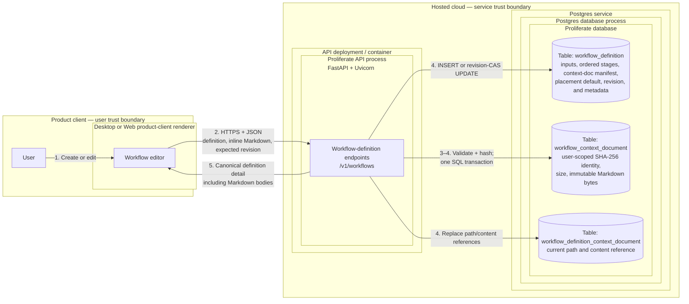
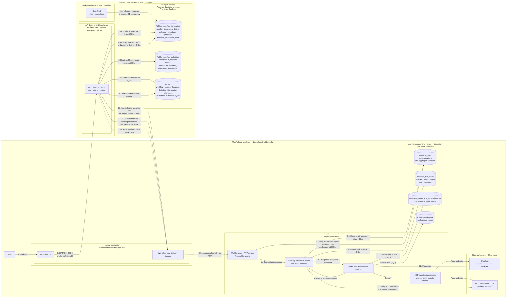

Description: Define the v1 local linear workflows product by extending the beta's ordered stages and steps.
Date: 2026-08-07
Status: working draft

# Workflows v1 launch

This is the working ADR for the workflows PR ladder. The filename and date are
provisional until the team approves the decision. Per the
[ADR procedure](../guides/process/adrs.md), this file lands in `adrs/` only in
the final PR of the ladder, after the decision has shipped.

## Orientation

### Purpose

Workflows let a user define, save, and execute a strictly ordered sequence of
agentic work. The only user-authored node kinds are `agent` and
`human_in_loop`. A workflow definition is JSON conforming to a schema owned by
this repository.

The product is intended to become a general infrastructure primitive for
individuals and teams automating knowledge work, including software delivery,
support engineering, ticket triage, on-call response, bug fixes, and email.

### Goals

- Ship a deliberately scoped workflows feature end to end for v1.
- Let a user manually create and save a workflow definition.
- Let a user manually trigger a saved workflow.
- Extend the beta's ordered definition and execution path instead of replacing
  it with a second workflow model.

### Non-goals

- Generating workflows from a prompt. A later workflow-builder agent will need
  repository-owned Markdown rules that encode the product's workflow standards.
- Triggering workflows through webhooks or schedules. V1 supports only manual
  triggers.
- Executing workflows in a cloud sandbox. V1 execution is local only.
- Conditional routing, authored branches, cycles, parallel nodes, or a
  `choice` node.
- `succeed` or `fail` nodes. Success and failure are run outcomes, not 
  workflow-definition nodes.

### Requirements

1. The implementation consists of four sequential PRs: engine, data models,
   workflow lifecycle orchestration, then UI and client. The ladder may carry
   temporary migration code, but the released feature has one linear
   definition, invocation, and run path. Each PR extends the beta's ordered
   `stages[].steps[]` representation and `(stageIndex, stepIndex)` execution
   coordinates; it does not introduce an authored edge model or a branching
   graph schema.
2. Branching is deferred in V1; V1 does not support choice expressions or
   loops.
3. A user can create a workflow manually in a linear graph UI. Node order is
   the workflow order; connectors are derived from adjacent nodes and are not
   authorable definition data.
4. A user can save a workflow as a `workflowDefinition`.
5. A user can modify an existing `workflowDefinition` and save it in place.
6. A user can delete an existing `workflowDefinition`.
7. A user can manually trigger an existing `workflowDefinition`.
8. `agent` and `human_in_loop` are the only two node types. Each has its own
   model configuration; model configuration is not inherited from another node.
9. Each workflow run creates its own workspace.
10. A `workflowDefinition` specifies whether a run creates a new worktree
    or runs at the repository root by default.
11. When manually triggering a workflow, the user can override the definition's
    worktree or repository-root default in the UI.
12. One workflow run owns one workspace. Each agentic node owns one ordinary
    session in that workspace. Its workflow-owned turn and any user chat occur
    in that session; retrying or resuming the node reuses the same session.
13. An `agent` node is an automatically advancing unit of agent work. On entry,
    the runtime dispatches one workflow-owned turn containing the node's prompt
    and required goal in the node's session. The node completes when that turn
    completes successfully, then advances to the next node in authored order
    without waiting for user action. If it is the last node, the workflow run
    becomes `completed`. An execution error makes the node and workflow run
    `failed`; an operational execution failure is eligible for explicit retry.
14. A `human_in_loop` node is a human-agent collaboration unit. On entry, it
    dispatches the same prompt-and-goal workflow-owned turn as an `agent` node.
    Successful completion moves the node to `waiting_for_human`, where the user
    can continue collaborating with the agent in the node's ordinary session.
    Chat does not advance the workflow. An explicit Continue decision completes
    the node and advances to the next node in authored order, or completes the
    run when it is last. An explicit Fail decision makes the node and run
    `failed` and is not retryable. An execution error before collaboration also
    fails the node and run and is eligible for explicit retry.
15. Every node stores a nonblank prompt and a `goals` array containing exactly
    one nonblank `{ objective }`. The runtime includes that goal in the
    workflow-owned turn for every harness, independent of native structured-goal
    support. V1 has no authored verification member or post-turn verification
    method.
16. V1 has no condition or routing primitive. Agent reasoning may change
    workspace files and artifacts, but it cannot choose a different successor:
    successful execution always advances to the next authored node.
17. `completed`, `failed`, and `cancelled` are stopped workflow run states
    persisted in control-plane
    `workflow_invocation_delivery.local_run_status` and AnyHarness
    `workflow_runs.status`. `completed` and `cancelled` are final. A `failed`
    run is also final after explicit human Fail, setup failure, or attempt-ten
    exhaustion; on attempts one through nine, a retryable operational failure
    may be explicitly reopened in place. Retry preserves the run, workspace,
    and session, clears the aggregate failure, returns the run to `running`, and
    inserts the next node-attempt row. Outcomes are not nodes and never appear
    in the user-authored graph.
18. The definition is strictly linear: it has one first node, every node has at
    most one implicit successor, and only the final node has none. There are no
    authored edges, branches, joins, cycles, unreachable nodes, or parallel
    lanes.
19. The user-facing definition and run graphs render only `agent` and
    `human_in_loop` nodes. The UI may draw adjacency connectors, but it does not
    render success or failure as nodes.
20. Context docs are workflow-scoped UTF-8 Markdown files that a user supplies
    for nodes to use as reference material or writable templates and artifacts.
    Every normalized path ends in lowercase `.md`. A definition may contain at
    most 20 files, each at most 256 KiB, and at most 2 MiB in aggregate. Context
    docs are versioned with the workflow definition and frozen for each run.
    They are private user content, not a secrets vault: V1 warns users not to
    put secrets in them, does not scan their contents, and never records their
    paths or contents in logs or telemetry.
21. Before the first node starts, each run materializes its own writable copy of
    the definition's context docs under
    `<workspace-root>/.proliferate/context/`. Every workflow-generated or
    user-created session in the run workspace can read and write those copies.
    Run-time changes do not mutate the saved definition.
22. Every node has full write/read access to every context doc.
23. The graph UI shows each agentic node's index in both definition and run
    views.
24. On the delivering Desktop, a workflow run workspace uses the same UI and UX
    primitives as a normal workspace and its sessions. Web and other Desktops
    expose only the Cloud delivery/run projection.
25. On the delivering Desktop, a user can chat in any workflow-generated
    session.
26. On the delivering Desktop, a user can manually create additional sessions
    in a workflow run workspace to work with the workflow's context docs.
27. Workflow-created `agent` and `human_in_loop` sessions use the same
    integration and credential paths as ordinary sessions in their run
    workspace. They are created with
    `SessionMcpBindingPolicy::InheritWorkspace`, pass through normal session MCP
    assembly and the existing integration-gateway session-launch extension, and
    resolve local-surface harness auth through the ordinary `state.json` launch
    path. Integrations are resolved when each node session launches rather than
    frozen into the workflow. Workflows add no integration selector, OAuth
    flow, credential store or copy, provider client, or workflow-specific
    grant. Definitions, invocations, runs, and delivery journals persist no
    credential material.
28. Immutable context-doc bytes live in Postgres in a separate user-scoped,
    SHA-256-addressed table. Definition create and revision-CAS update requests
    carry bounded Markdown content inline; the server validates UTF-8 and paths,
    computes hashes, writes content and reference rows, and writes the manifest
    and definition in one transaction. Current definitions and deliverable
    invocations pin content. Removing the final reference deletes the immutable
    content in the same transaction; an invariant sweep deletes any accidental
    zero-reference row. This is immediate deletion from live product storage;
    ordinary database disaster-recovery backups follow the existing Postgres
    backup lifecycle and expose no workflow restore/read surface.
29. The Desktop ProductClient renderer lifecycle owns local invocation
    delivery. While authenticated and connected to a healthy AnyHarness
    sidecar, it polls the control plane, claims compatible pending invocations,
    forwards them over loopback HTTP, acknowledges the idempotent run, and
    reports monotonic run state. The Tauri host owns the sidecar process but not
    workflow orchestration; Proliferate Worker and hosted background jobs never
    deliver a run to loopback.
30. Claims form a user-scoped pending pool. The first signed-in Desktop that
    reports the invocation's repository as locally available may claim it. That
    first claim permanently assigns delivery of this invocation to the Desktop
    install; lease expiry permits only that install to reclaim it. This sticky
    assignment prevents an uncertain accepted handoff from executing on two
    machines. Web may author and trigger a local workflow, but cannot claim it;
    when no compatible Desktop is online, the invocation remains visibly
    pending until one becomes available. If an assigned Desktop is lost, the
    user may cancel this invocation and trigger a new one; V1 has no
    reassignment. That explicit failover uses a new invocation ID and warns that
    an unacknowledged run on the unavailable Desktop may have started and will
    be cancelled if that Desktop reconnects.
31. Cutover permanently deletes terminal schema-1 control-plane invocations,
    managed-execution rows, schema-1/2 AnyHarness runs, and schema-1
    materializations. It creates no product archive, offline export, or legacy
    reader, and never rewrites beta execution history as schema-3 activity.
32. Cutover gives beta work no courtesy drain window. After schema-1 acceptance
    is disabled, the operator immediately cancels or interrupts every remaining
    nonterminal beta invocation and run. Destructive migration starts only
    after managed-workflow gauges and outbox tasks are zero and every runtime
    reports no nonterminal beta run.
33. V1 retains the beta's scalar `string`, `number`, and `boolean` inputs and
    exact `{{inputs.name}}` placeholder rules. Manual trigger freezes one
    validated argument map in the invocation. Every node prompt and goal renders
    once from that same map before its workflow-owned turn; context-doc paths
    and Markdown bodies are never templates.

## Current context

A complete Workflows beta already ships in this repository, spanning the
product clients, the Cloud SDKs, the hosted control plane, and the AnyHarness
runtime. Its current operating law is
[Workflows](../specs/FEATURE_DOCS/WORKFLOWS.md).
The beta models a workflow as a linear document executed remotely:

- A definition is `inputs[]` plus ordered `stages[]`; each stage is one
  `harnessConfig` plus sequential `agent.prompt` steps
  ([Workflow Definitions](../specs/FEATURE_DOCS/WORKFLOWS.md#workflow-definitions)).
  There are no other node kinds, no edges, no conditions, and no terminal
  vocabulary.
- The only executable shape is exactly one stage containing exactly one prompt
  step, run as one prompt in one new session in one workspace
  ([Workflow Runs](../specs/FEATURE_DOCS/WORKFLOWS.md#workflow-runs); enforced for
  both schema versions in
  [service.rs](../anyharness/crates/anyharness-lib/src/domains/workflows/service.rs)
  and
  [portable_validation.rs](../anyharness/crates/anyharness-lib/src/domains/workflows/portable_validation.rs)).
- The only launch target is `managedCloud`: a Cloud worker pipeline delivers
  the run into the user's personal cloud sandbox
  ([Portable Invocation and Target Resolution](../specs/FEATURE_DOCS/WORKFLOWS.md#portable-invocation-and-target-resolution),
  [Managed Cloud Workflow Execution](../specs/FEATURE_DOCS/WORKFLOWS.md#managed-cloud-workflow-execution)).
  There is no local execution path.
- Triggers are manual-only, matching this ADR's non-goals. New managed
  delivery is gated off by default (`WORKFLOW_MANAGED_RUNS_ENABLED`,
  [env-vars.yaml](../specs/developing/reference/env-vars.yaml)). Definition
  authoring, run history, and cancellation are live for every signed-in user
  behind a dismissable interstitial that gates nothing structurally
  ([WorkflowsBetaGateModal.tsx](../apps/packages/product-client/src/components/workflows/WorkflowsBetaGateModal.tsx)).

This decision keeps that linear model and extends it in place. Definition
schema 2 retains ordered `inputs[]` and `stages[].steps[]`, adds
`human_in_loop`, and constrains each stage to one node step so the stage remains
the node's model/session boundary. Every schema-2 node has exactly one portable
goal. Migration preserves an existing beta goal and gives a goal-less beta step
the deterministic objective `Complete the work described in the prompt.`
AnyHarness extends the existing `workflow_run_steps` coordinate and executor
from one prompt to the full ordered sequence. The ProductClient renders the
order as a linear graph, but the saved definition contains no authored edges or
terminal nodes. Definition ownership and revisioning, immutable invocation
acceptance, workflow-run replay and cancellation, session correlation, and
workspace materialization already match the required boundaries.

The cutover migration is:

```text
workflow definition schema 1  beta agent-only linear document ── migrate in place ──► schema 2 agent/HITL linear document

workflow invocation schema 1  managed-cloud target      ── terminalize, then delete
workflow invocation schema 2  local linear-run delivery ── only accepted member after cutover

AnyHarness workflow run schema 1/2  beta one-prompt run ── terminalize, then delete
AnyHarness workflow run schema 3    linear multi-node run ── only accepted member after cutover

workspace materialization schema 1  beta placement       ── delete with its beta run
workspace materialization schema 2  local-run placement  ── only active member after cutover
```

The version numbers preserve lineage and make stale clients fail closed; they
do not define parallel supported behaviors. Schema-2 writers are enabled only
after the migration proves there are no active beta invocations or runs and no
schema-1 definition remains in the live table. Final APIs reject beta contract
members, while the released runtime contains one extended linear executor and
recovery path rather than separate beta and replacement implementations.

### Source tree, ordered by data flow

Only the paths below are the feature. `hooks/<area>/workflows/` and
`lib/workflows/**` elsewhere in the frontend are an action-orchestration
naming convention, `.github/workflows/**` is CI, and the legacy `automations`
domain is the older scheduled-sessions feature whose routes redirect to
`/workflows`; none of those are part of the beta.

```text
apps/packages/product-client/src/
├── pages/WorkflowsPage.tsx                      /workflows routes; beta interstitial
├── components/workflows/                        form editor; run launch/history/detail
├── hooks/workflows/workflows/                   save/launch/cancel/open actions
├── hooks/access/cloud/workflows/                Cloud query access wrappers
└── domain/workflows/                            client twin of the linear definition

cloud/sdk-react/src/hooks/workflows.ts           queries; 3 s nonterminal run polling
cloud/sdk/src/client/workflows.ts                wraps the eleven Cloud endpoints

server/proliferate/
├── server/workflows/                            api, service, managed gate, validation
│   └── worker/                                  workflows.deliver / observe / cancel
├── server/cloud/workspaces/workflow_binding.py  Cloud workspace alias per run
├── db/models/workflows.py                       the three Postgres tables
└── integrations/anyharness/workflow_*.py        runtime HTTP clients

anyharness/crates/
├── anyharness-contract/src/v1/workflow_*.rs     v1 + v2 wire contracts
├── anyharness-lib/src/api/http/workflow_*.rs    the five runtime endpoints
├── anyharness-lib/src/domains/workflows/        acceptance, resolution, execution,
│   │                                            run control
│   └── workspace_materialization/               placement claim for workflows/<runId>
├── anyharness-lib/src/domains/workspaces/       workflow_placement.rs worktree seam
├── anyharness-lib/src/domains/sessions/         admission.rs session admission
└── anyharness-lib/src/persistence/              migrations 0060–0064; three SQLite
                                                 tables
```

### Clients — `apps/packages/product-client`, one surface for Desktop and Web

Routes `/workflows`, `/workflows/:workflowId`, and
`/workflows/:workflowId/runs/:runId`
([app-routes.ts](../apps/packages/product-client/src/config/app-routes.ts))
mount a sequential form editor — title, description, default repository,
scalar input rows, ordered stage cards with catalog-driven agent/model/effort
selects, ordered prompt blocks with optional goal
([WorkflowDefinitionEditor.tsx](../apps/packages/product-client/src/components/workflows/WorkflowDefinitionEditor.tsx))
— plus managed-run launch, cursor-paginated history, and a run detail view of
the remote delivery pipeline
([WorkflowRunsSurface.tsx](../apps/packages/product-client/src/components/workflows/runs/WorkflowRunsSurface.tsx)).
The editor authors up to 64 stages and steps, but launch eligibility blocks
anything beyond one stage, one step, no goal: authoring capability already
exceeds runnable capability. Navigation chrome: a sidebar entry with a beta
pill, a command palette entry, a keyboard shortcut, and legacy `/automations`
redirects into `/workflows`. Mobile and the Desktop shell have no additional
workflow surfaces.

- Reused: app routing and navigation chrome; definition list, query, mutation,
  revision-conflict, and draft-preservation mechanics; the catalog-driven
  agent/model/effort selectors as the basis for per-node model configuration
  (requirement 8); the ordinary workspace and session UI that requirement 24
  mandates, which the beta never modified.
- Extended at UI cutover: requirements 3 and 23 require the existing sequential
  editor to render its ordered stages as a linear graph with visible node
  indexes. It adds `human_in_loop` configuration and drag-to-reorder, but no
  edge authoring or free-position canvas.
  The current
  [Workflow Definitions](../specs/FEATURE_DOCS/WORKFLOWS.md#workflow-definitions)
  records "There is no canvas". The run detail view narrates remote delivery
  custody that local execution does not have.

### SDKs — `cloud/sdk`, `cloud/sdk-react`, `anyharness/sdk`

[client/workflows.ts](../cloud/sdk/src/client/workflows.ts) wraps the eleven
Cloud endpoints;
[hooks/workflows.ts](../cloud/sdk-react/src/hooks/workflows.ts) owns
definition queries, mutation actions, and 3-second nonterminal run polling.
The AnyHarness SDK carries workflow runs only as generated OpenAPI types,
pinned by
[workflow-runs.test.ts](../anyharness/sdk/src/workflow-runs.test.ts) against
[workflow-portable-execution/v1.json](../fixtures/contracts/workflow-portable-execution/v1.json).

- Extended: the Cloud SDK keeps its definition and invocation resource clients,
  adding linear-definition schema 2, local-invocation schema 2, and invocation
  claim operations. The AnyHarness SDK keeps `/workflow-runs` and adds strict
  schema-3 request and response members plus human-decision and retry methods.
- Removed at cutover: managed-cloud `deliver`, projection-specific client
  models, beta definition types, and AnyHarness V1/V2 run types. The final SDKs
  expose only linear definitions, local invocations, and linear runs.

### Hosted control plane — `server/`

[api.py](../server/proliferate/server/workflows/api.py) owns eleven endpoints
under `/v1/workflows` and `/v1/workflow-invocations`: definition CRUD plus
run-eligibility, immutable invocation acceptance, deliver, cancel, and
history. Three Postgres tables live in
[db/models/workflows.py](../server/proliferate/db/models/workflows.py):
`workflow_definition` (linear `inputs_json`/`stages_json`, `schema_version`
CHECK-pinned to 1, optimistic `revision`, soft delete), `workflow_invocation`
(immutable snapshot; only `target.kind == "managedCloud"` is accepted), and
`workflow_managed_execution` (delivery checkpoints, sandbox custody,
monotonic runtime projection). Delivery runs as three outbox tasks —
`workflows.deliver`, `workflows.observe`, `workflows.cancel`
([worker/delivery.py](../server/proliferate/server/workflows/worker/delivery.py))
— that place a workspace, bind a product Cloud workspace alias
([workflow_binding.py](../server/proliferate/server/cloud/workspaces/workflow_binding.py)),
PUT the run into the sandbox runtime, and poll it to a terminal state.
[check_workflow_managed_boundaries.py](../scripts/check_workflow_managed_boundaries.py)
ratchets this tree off the legacy Cloud sync planes.

- Reused and extended: the five definition routes, `workflow_definition`
  ownership and revision compare-and-set, `/workflow-invocations`, immutable
  `workflow_invocation` snapshots, caller-minted IDs, canonical replay,
  owner-safe conflicts, history pagination, and cancellation intent.
- Added: linear-definition schema 2, local-invocation schema 2,
  `workflow_invocation_delivery`, and `workflow_invocation_claim`.
- Removed at cutover: `workflow_managed_execution`, managed delivery workers,
  projection polling, sandbox custody, `/deliver`, and `run-eligibility`. They
  encode the beta cloud target and have no local-run responsibility.

### AnyHarness runtime — `anyharness/`

Five endpoints: `PUT`/`GET /v1/workflow-runs/{runId}`,
`POST /v1/workflow-runs/{runId}/cancel`, and
`PUT`/`GET /v1/workflow-run-workspaces/{runId}`
([workflow_runs.rs](../anyharness/crates/anyharness-lib/src/api/http/workflow_runs.rs),
[workflow_workspaces.rs](../anyharness/crates/anyharness-lib/src/api/http/workflow_workspaces.rs)).
A run freezes `invocation_json` as canonical-JSON replay identity, resolves
one concrete agent/model/mode/effort plan before effects
([resolution.rs](../anyharness/crates/anyharness-lib/src/domains/workflows/resolution.rs)),
creates one InternalOnly session, dispatches the single deterministic prompt
`workflow:<runId>:0:0`
([model.rs](../anyharness/crates/anyharness-lib/src/domains/workflows/model.rs)),
and terminalizes through a session-completion extension. Run control adds
truthful cancellation, `stateVersion`, restart fencing to
`interrupted/runtime_restarted`, and exclusive session admission with
`409 SESSION_CONTROLLED_BY_WORKFLOW`
([Run Control and Session Admission](../specs/FEATURE_DOCS/WORKFLOWS.md#run-control-and-session-admission)).
Placement materializes `<managed-worktrees-root>/workflows/<runId>` on branch
`workflow/<runId>` — scratch or repository worktree, never repository root
([Workspace Placement](../specs/FEATURE_DOCS/WORKFLOWS.md#workspace-placement)).
Local persistence is three SQLite tables — `workflow_runs`,
`workflow_run_steps`, `workflow_workspace_materializations`, plus a
partial-unique active-controller index — across migrations 0060–0064, snapshot
in [anyharness-db-schema.sql](../specs/GENERATED/anyharness-db-schema.sql).
Steps are addressed as `(stage_index, step_index)`, a linear coordinate space
with only `(0, 0)` ever materialized. The beta has no definition-owned context
docs or `.proliferate/context/` materialization contract.

- Reused and extended: `/workflow-runs`, `workflow_runs`, the
  accept/replay/conflict store boundary, state versions, durable cancellation,
  exact session/prompt/turn correlation, detached effect handoff, and the
  generic seams the beta added to the sessions domain (checked
  internal session creation, persisted startup, text-prompt dispatch with a
  caller-owned prompt ID, `SessionExtension` completion hooks) and the
  workspace materialization state machine, worktree implementation, and
  operation gates.
- Extended: workflow-run schema 3, the existing linear executor and
  `workflow_run_steps` table for ordered `agent`/`human_in_loop` execution,
  per-node sessions, human decisions, and retries. Workflow session creation
  changes from the beta's `InternalOnly` policy to
  `SessionMcpBindingPolicy::InheritWorkspace` so each node uses normal workspace
  MCP assembly, integration-gateway injection, and local-surface agent auth.
- Removed at cutover: the beta workflow-wide restriction that only one stage
  containing one step may execute, run-wide session/resolved-plan assumptions,
  managed-cloud-only acceptance, and workflow use of InternalOnly session
  creation. Schema 2 separately requires exactly one node step per stage and
  permits multiple ordered stages. The existing run/store/runtime/
  session-extension path remains the one V1 implementation.

### Workspace and session lifecycle, repository/worktree setup

The beta consumes ordinary workspaces and sessions without changing their
contracts: a placed workflow workspace is a visible ordinary workspace
excluded from generic retention by creator context, and the run's session is
a normal session inspectable through existing session APIs. The new feature
keeps that posture (requirements 24–26) and needs two behaviors the beta
lacks: run-owned workspace creation with a repository-root mode
(requirements 9–10), and open chat in workflow sessions, which the beta's
exclusive admission deliberately rejects while a run is nonterminal
([admission.rs](../anyharness/crates/anyharness-lib/src/domains/sessions/admission.rs)).
V1 also stops creating workflow node sessions through the beta's internal-only
seam. The workflow runtime uses a checked create-before-start operation with
`InheritWorkspace`; session startup then performs the same persisted workspace
MCP assembly, integration-gateway extension assembly, and agent-auth route
resolution as an ordinary local session. Integration grants and credentials
are read at each node-session launch, so a revocation before a later node takes
effect without mutating the frozen workflow definition or invocation.

### Canonical documentation and repository tooling

The workflow feature document above is current-status operating law, and
roughly twenty more documents reference the beta: server and AnyHarness structure
guides, the product system map, testing scenarios (active `T2-WFDEF-1` and
parked `T2-WF`/`T3-WF` rows in
[scenarios.md](../specs/TESTING/scenarios.md)), the env-var reference, the
generated SQLite schema, contract fixtures
([workflow-definition](../fixtures/contracts/workflow-definition/minimal.json)),
and the intent spec
[workflow-definitions.spec.ts](../tests/intent/specs/workflow-definitions.spec.ts).
[check_docs.py](../scripts/check_docs.py) pins the workflows README as a
required routing root. Each ladder PR updates these documents, fixtures, and
generated references in the same PR that changes their behavior, per
[specs/README.md](../specs/README.md).

### Reuse and extension decision

| Shipped primitive | V1 treatment |
| --- | --- |
| `workflow_definition`, five `/v1/workflows` routes, ownership, revision CAS, soft delete | Keep the resource, routes, `inputs_json`, and `stages_json`. Migrate rows to linear schema 2 by normalizing each authored beta step into one ordered stage/node, then extend validation for `human_in_loop` and placement. |
| No beta context-doc definition or workspace contract | Add bounded UTF-8 Markdown content in user-scoped Postgres rows keyed by SHA-256, definition/invocation reference rows, a revisioned `context_docs_json` manifest, inline transactional save and claim transfer, and per-run writable materialization under `.proliferate/context/`. |
| `workflow_invocation`, `/v1/workflow-invocations`, canonical replay, history, cancel | Keep the resource and routes for schema-2 local invocations. Stop beta acceptance, terminalize old work, and remove schema-1 contracts. |
| `workflow_managed_execution`, managed delivery workers, `/deliver` | Remove after immediately terminalizing beta invocations. Delete historical rows before dropping the table; add no archive or legacy reader. |
| `/v1/workflow-runs`, `workflow_runs`, state versions, cancellation, replay | Keep the resource, table, and status vocabulary; extend schema 3 for the frozen linear sequence, per-step progression, and explicit in-place reopening of retryable failures. |
| `workflow_run_steps` | Keep and extend the existing `(stage_index, step_index)` coordinate space with node kind, attempt, session, resolved plan, human-wait, and retry state. |
| `workflow_workspace_materializations` and worktree placement | Keep the table and workspace seams, rebuilding the active table for schema-2 repository-root/new-worktree placement only. |
| One-prompt executor and run-wide resolved plan | Extend the executor to visit every ordered step. Resolution and session correlation move from the run to each step because every node has its own model and session. |
| Exclusive `SESSION_CONTROLLED_BY_WORKFLOW` policy | Remove. Linear workflow node sessions use normal interactive session admission. |
| InternalOnly workflow session creation | Stop using the beta's `create_persisted_internal_session` path for workflow nodes. Preserve checked create-before-start and durable session-ID correlation, but create each node session with `InheritWorkspace` and route startup through ordinary workspace MCP, integration-gateway, and agent-auth assembly. |
| Sequential editor and managed-cloud detail | Keep the ordered editor/domain model and render it as a linear graph; replace only managed-cloud run projection while retaining routes, CRUD actions, query infrastructure, catalog controls, and ordinary run/workspace surfaces. |

### Migration through the ladder

Temporary migration readers may coexist inside the ladder, but they are not a
second product mode. Engine work adds no writer. Data-model work adds the
deterministic definition migration, bounded Markdown content tables, reference
rows, and destructive invocation/run disposition migrations. Lifecycle work
disables beta acceptance, immediately cancels or interrupts remaining beta
work, proves the managed gauges, outbox, and runtime nonterminal counts are
zero, then wires schema-2 invocations to schema-3 linear runs through the
extended beta executor. The UI/client PR enables schema-2 writers and removes
managed-cloud-only code. Release is blocked unless an invariant sweep proves
that active tables contain only definition schema 2, invocation schema 2, run
schema 3, and materialization schema 2, with no branching definition or
executor path registered.

## External systems and spikes

No external workflow DSL enters the V1 contract. The shipped beta's ordered
stages and steps are the implementation reference.

## Design

### Preferred design

The v1 launch keeps the beta's separation between durable product intent and a
runtime-owned run. Reusable definitions and immutable invocations live in the
hosted control plane. A claimed invocation becomes a run whose frozen
definition and live ordered state live in the executor runtime's SQLite database
on the user's machine.

This ADR uses the shipped resource vocabulary:

- A **definition** is the saved, revisioned workflow configuration.
- An **invocation** is the immutable control-plane intent created when a user
  triggers a definition.
- A **run** is the durable AnyHarness activity created from an invocation.
- **Execution** describes the activity in ordinary prose. It is not the name of
  a new parent API resource, table, or domain aggregate.

The beta schemas are migration inputs, not runtime variants. After cutover,
live product APIs, workers, stores, and UI accept only schema-2 linear
definitions, local invocations, and schema-3 linear runs.

#### Linear definition and outcome contract

Definition schema 2 keeps the beta's ordered `stages[]` array and requires
exactly one node step per stage. Flattening `stages[].steps[]` therefore yields
the complete execution order, and `(stageIndex, 0)` remains the durable address
of each node. The only step discriminators are `agent` and `human_in_loop`.
Each stage retains its beta `harnessConfig`, and its one step stores `prompt`
plus `goals[]` with exactly one `{ objective }`. Migration maps a beta singular
`goal` to that array and inserts
`Complete the work described in the prompt.` when the beta goal is absent. The
runtime renders one portable workflow-owned turn for every harness as the
input-rendered prompt followed by `Goal:` and the input-rendered objective;
native structured-goal support is neither required nor selected by the
definition. Invocation arguments retain the beta scalar types and exact
placeholder grammar, and one frozen argument map serves every node.

The schema-2 node contract is exactly:

```text
stage
  harnessConfig
    agentKind                  nonblank, at most 32 characters
    modelId                    optional, at most 255 characters
    effort                     optional, at most 64 characters
  steps                       exactly one member
    kind                       "agent" | "human_in_loop"
    prompt                     nonblank, at most 100,000 characters
    goals                      exactly one member
      objective                nonblank, at most 20,000 characters
```

Definitions retain the beta limits of at most 64 inputs and 64 stages. Agent,
model, and effort selections remain catalog-validated; omitted model/effort
retain target-default meaning, and effort requires an explicit model. Every
rendered prompt-plus-goal turn is nonblank and at most 32,768 UTF-8 bytes. This
raises the beta's 16-KiB rendered-prompt ceiling so adding the mandatory
migration goal cannot invalidate a previously maximal runnable prompt.
Save parses both templates, rejects malformed or undeclared placeholders, and
rejects fixed prompt/goal text that already exceeds that rendered limit;
invocation acceptance applies the final bound after argument substitution.
Unknown members fail validation. In particular, neither step kind has
`verification`, `checkpoint`, `next`, condition, layout, retry-policy, tool,
integration, or credential members.

Input names are unique, 1–64 characters, and match
`[A-Za-z][A-Za-z0-9_]*`. Trigger arguments contain no undeclared keys, include
every required or referenced input, and use exact declared scalar types. String
arguments are at most 16,384 UTF-8 bytes. Numbers are finite JSON numbers and
integers stay within JavaScript's safe integer range. Optional unreferenced
inputs may be omitted; one canonical argument object is frozen in
`creation_request_json` and `invocation_json`.

The definition also owns a `contextDocs[]` manifest. Every entry is
`{ path, contentSha256, sizeBytes, mediaType }`, where `mediaType` is fixed to
`text/markdown; charset=utf-8`. Paths are Unicode-NFC POSIX-relative paths with
lowercase `.md` suffixes: absolute paths, `.` or `..` segments, backslashes,
control characters, depth above eight, length above 255 bytes, and duplicate
NFC/case-folded materialization paths are rejected. The manifest is bounded by
requirement 20.

Definition create and update requests carry each path and UTF-8 Markdown body
inline. Bodies must decode as strict UTF-8 and contain no NUL; content is not
Unicode- or newline-normalized. In one Postgres transaction, the service
validates the complete set, computes SHA-256 over the exact UTF-8 bytes, upserts
immutable content under the user, replaces definition reference rows, writes
the canonical manifest, and inserts or revision-CAS updates the definition. A
conflict rolls back every effect, so there is no upload lifecycle or failed-CAS
orphan. Invocation acceptance copies manifest and reference rows in the
invocation transaction.
Pending and claimed invocations retain those references; acknowledgement,
closed delivery failure, or cancellation releases them because AnyHarness has
either durably accepted the bytes or no run can start. Definition update,
soft-delete, and invocation release delete a content row in the same transaction
when no definition or deliverable invocation references it. A background
invariant sweep deletes any zero-reference row left by a defect.

The wire projections are distinct and contain no optional upload state:

```text
definition create/update context doc  { path, content }
definition list manifest entry        { path, contentSha256, sizeBytes, mediaType }
definition detail context doc         { path, contentSha256, sizeBytes, mediaType, content }
invocation claim/run context doc      { path, contentSha256, sizeBytes, mediaType, content }
```

`content` is a JSON string. The server derives all manifest fields on writes;
clients never choose a hash, size, or media type. Create/update/detail return the
detail projection, while definition lists return only manifest entries.

The definition stores no `next`, edge, condition, terminal, or layout member.
The editor may render adjacent nodes with connectors and allow reorder, but it
serializes only array order. A successful node at index `i` advances to
`i + 1`; a successful final node atomically makes the run `completed`. An
execution error or explicit Fail decision atomically makes the node and run
`failed`. Execution-failure and interruption codes permit explicit Retry;
human Fail, cancellation, and setup failures do not. Retry keeps the same
run/workspace/session, clears aggregate failure and `finished_at`, changes the
run back to `running`, and inserts the next attempt, up to ten total attempts
for that coordinate. An operational failure on attempt ten is nonretryable; an
interruption on attempt ten closes the run as `failed/retry_attempts_exhausted`
while retaining the interrupted step row. Control-plane projection and
AnyHarness persistence carry those outcomes without adding synthetic graph
nodes.

The maps below read from the outside in: infrastructure and trust boundary,
deployment or container, operating-system process, logical module or endpoint,
then table or filesystem. Only a box explicitly labeled as a process or
container is a running unit.

#### Control-plane flow: create and save a definition

Source-readable deployment map:

```text
PRODUCT CLIENT — user trust boundary
├─ User
└─ Desktop or Web product-client renderer
   └─ Workflow editor

HOSTED CLOUD — service trust boundary
├─ API deployment / container
│  └─ Proliferate API process (FastAPI + Uvicorn)
│     └─ Workflow-definition endpoints (`/v1/workflows`)
├─ Postgres service
│  └─ Postgres database process
│     └─ Proliferate database
│        ├─ table: workflow_definition
│        │  └─ inputs, ordered stages, context-doc manifest, placement default,
│        │     revision, and metadata
│        ├─ table: workflow_context_document
│        │  └─ user-scoped SHA-256 identity, size, and immutable Markdown bytes
│        └─ table: workflow_definition_context_document
│           └─ current definition path and content reference

FLOW
1. User ── create or edit ──► Workflow editor
2. Workflow editor ── HTTPS + JSON: definition, bounded inline Markdown,
   and expected revision
   ──► Workflow-definition endpoint
3. Workflow-definition endpoint ── validate UTF-8, normalized paths, and bounds;
   compute SHA-256 for every body
4. Workflow-definition endpoint ── one SQL transaction: upsert immutable
   content, replace definition references, and INSERT or revision-CAS UPDATE
   the definition and canonical manifest ──► Postgres tables
5. Workflow-definition endpoint ── canonical saved definition detail, including
   bounded Markdown bodies
   ──► Workflow editor
```

Rendered map:



#### Data-plane flow: run a saved definition locally

Source-readable deployment map:

```text
USER'S LOCAL MACHINE — data-plane trust boundary
├─ User
├─ Desktop application
│  └─ Product client renderer process
│     ├─ Workflow UI
│     └─ Workflow local-delivery lifecycle
│        └─ claims compatible invocations and forwards them to loopback
├─ AnyHarness runtime process (`anyharness serve`)
│  ├─ Workflow-run HTTP ingress (`/v1/workflow-runs`)
│  ├─ Existing workflow runtime and linear executor
│  ├─ Workspace and session services
│  └─ ACP agent subprocesses (one per active agentic session)
├─ AnyHarness runtime home (filesystem)
│  └─ SQLite file: db.sqlite
│     ├─ workflow_runs: frozen envelope and aggregate run state
│     ├─ workflow_run_steps: ordered node attempts and correlation
│     ├─ workflow_workspace_materializations: run workspace placement
│     └─ existing workspace and session tables
└─ Run workspace (filesystem)
   ├─ checkout: repository root or new worktree
   └─ `.proliferate/context/`: per-run writable context docs

HOSTED CLOUD — service trust boundary
├─ API deployment / container
│  └─ Proliferate API process (FastAPI + Uvicorn)
│     └─ Workflow invocation and claim endpoints
├─ Postgres service
│  └─ Postgres database process
│     └─ Proliferate database
│        ├─ table: workflow_invocation
│        ├─ table: workflow_invocation_delivery (delivery + run-status projection)
│        ├─ table: workflow_invocation_claim
│        ├─ table: workflow_definition
│        ├─ table: workflow_context_document
│        ├─ table: workflow_definition_context_document
│        └─ table: workflow_invocation_context_document
│           └─ exact schemas in New and modified primitives
└─ Background deployment / container
   └─ Beat-fired claim-expiry task

FLOW
1. User ── click Run ──► Workflow UI
2. Workflow UI ── HTTPS + JSON: definition ID ──► Invocation endpoint
3. Invocation endpoint ── read and freeze exact revision (SQL)
   ──► workflow_definition
4. Invocation endpoint ── INSERT schema-2 snapshot, content references, and
   pending delivery (SQL)
   ──► workflow_invocation + workflow_invocation_delivery
5. Desktop local-delivery lifecycle ── every 10 s, POST claimant ID and locally
   available repository IDs; claim endpoint selects the oldest unassigned
   compatible invocation or one already assigned to this Desktop, persists
   first-claim assignment, and INSERTs a two-minute lease (SQL)
   ──► workflow_invocation_delivery + workflow_invocation_claim
6. Desktop local-delivery lifecycle ── every 30 s while handing off, extend the
   active lease to two minutes from now ──► claim heartbeat endpoint
7. Claim endpoint ── join frozen content references to immutable Markdown
   bytes; HTTPS + JSON returns the invocation, definition, and bounded inline
   content ──► Desktop local-delivery lifecycle
8. Desktop local-delivery lifecycle ── loopback HTTP using the existing
   AnyHarness connection and auth: invocation + frozen definition + Markdown
   bytes ──► workflow-run PUT
9. Workflow-run PUT ── verify hashes and create accepted schema-3 run and
   frozen snapshot (SQL)
   ──► workflow_runs
10. Desktop local-delivery lifecycle ── acknowledge durable `accepted` run,
    state version, and claimant ID; release Cloud invocation content references
    (HTTPS + JSON) ──► workflow_invocation_delivery
11. Workflow-run PUT ── start setup in process ──► workflow runtime
12. Workflow runtime ── materialize run workspace and persist placement (SQL)
    ──► workflow_workspace_materializations + checkout
13. Workflow runtime ── verify frozen identities and materialize writable
    copies ──► `<workspace-root>/.proliferate/context/`
14. Workflow runtime ── atomically enter the first node, then advance ordered
    run state (SQL)
   ──► workflow_runs + workflow_run_steps
15. Desktop local-delivery lifecycle ── report changed workspace, run status,
    failure code, and state version (HTTPS + JSON)
    ──► workflow_invocation_delivery
```

Web performs hops 1–4 and displays `pending`; it never mounts hops 5–15. The
next compatible signed-in Desktop completes those hops. Cloud claim calls use
the ordinary authenticated user session. The Desktop obtains loopback
connection information from its existing host bridge and adds no
workflow-specific local credential.

Rendered map:



### Assumptions

- Workflows execute only in a local AnyHarness runtime.
- Local delivery requires a signed-in Desktop renderer and a healthy sidecar.
  Cloud intent remains durable while every compatible Desktop is offline.
- The Markdown-only 20-file, 256-KiB-per-file, 2-MiB-total contract is a V1
  product boundary and does not depend on later object storage.

### Tradeoffs

- Retaining ordered stages/steps minimizes V1 migration and execution risk, but
  users cannot express conditional or parallel work.
- The UI presents a graph-like sequence while storage remains an ordered
  document. Future branching will require an explicit schema decision and
  migration rather than unlocking dormant edges.
- Keeping completion and failure on run records removes synthetic terminal
  nodes from authoring, but the run header and node status must communicate the
  outcome and whether an operational failure can be retried clearly.
- Bounded Markdown in Postgres makes definition save and content revision one
  transaction and avoids object-store lifecycle work, but V1 cannot attach
  PDFs, images, archives, or large reference corpora.
- ProductClient-owned delivery reuses existing Cloud and loopback clients and
  needs no device push channel, but Cloud projection can remain stale while the
  Desktop renderer is closed. Reopening Desktop reconciles from authoritative
  AnyHarness state.
- Sticky first-claim assignment prevents automatic cross-machine duplicate
  execution, but it deliberately gives up transparent device failover. After
  acknowledgement, local SQLite and the run workspace are the only execution
  authority; losing that Desktop requires an explicitly warned new invocation.

### Alternatives

- Replace the beta definition with an arbitrary directed graph and add
  `choice` node type. We're scoping this out since this will require us to 
  introduce a new primitive to send input into the choice node and the use case 
  for choice node seems narrow enough that it should not be a lauch blocker.
- Introduce a new flat `nodes[]` contract while enforcing linear order.
  Rejected because `stages[].steps[]` and `(stage_index, step_index)` already
  provide an ordered definition and durable execution coordinate.
- Store context docs in S3 and transfer them with presigned URLs. Rejected for
  V1 because Markdown is strictly bounded and Postgres can commit immutable
  content, references, and the definition revision atomically.
- Push invocations from Cloud over a new device connection or move orchestration
  into Tauri. Rejected because the Desktop ProductClient already owns the
  authenticated Cloud client, runtime bridge, and local-automation claim-loop
  pattern.

### Resolved decisions

| Area | Decision |
| --- | --- |
| Node contract | Keep `harnessConfig` on the one-step stage. Both node kinds store a prompt and exactly one portable goal; neither stores verification or checkpoint-copy fields. `agent` advances after its turn. `human_in_loop` starts the same turn, then stays available for collaboration until Continue or Fail. Operational execution failures and interruptions permit explicit in-place retry, capped at ten attempts; human Fail and cancellation do not. |
| Session integrations and credentials | Replace beta InternalOnly workflow sessions with checked create-before-start sessions using `SessionMcpBindingPolicy::InheritWorkspace`. Resolve workspace MCP bindings, integration-gateway injection, and local-surface agent auth through ordinary session startup for each node. Store no credential or integration selection in workflow resources. |
| Context docs | Accept only bounded UTF-8 `.md` files. Store immutable bytes and normalized reference rows in Postgres, keyed per user by server-computed SHA-256. Create/update and claim/run handoff carry bounded content inline. Current definitions and deliverable invocations pin bytes; zero-reference content is deleted immediately. Content is private ordinary product data, is not scanned, and is never logged or emitted as telemetry. |
| Local delivery | A Desktop ProductClient renderer polls every ten seconds and claims the oldest invocation compatible with its locally available repositories. The first claim permanently assigns that invocation to the claimant install; expiry can be reclaimed only by the same install, preventing cross-machine duplicate execution after an uncertain PUT. Claims use the signed-in user session, a two-minute lease, and 30-second heartbeats. The owner forwards through the existing loopback AnyHarness connection, acknowledges acceptance, and reports later state. Web can trigger but only a compatible Desktop can deliver. |
| Beta history | Permanently delete terminal schema-1 invocations, managed-execution rows, schema-1/2 AnyHarness runs, and schema-1 materializations. Do not archive, export, rewrite, or retain a legacy reader. |
| Cutover | Disable beta acceptance and immediately cancel or interrupt every nonterminal beta execution. Before destructive migration, require all managed queued/delivering, accepted-nonterminal, and pending-cancellation gauges to be zero; require no pending, publishing, or failed `workflows.deliver`, `workflows.observe`, or `workflows.cancel` outbox task; and require every AnyHarness database to contain no nonterminal beta run, active beta step, or in-progress beta materialization. |

## New and modified primitives, by grid cell

### AnyHarness

1. **`domains/workflows` — extended**
   - `ValidatedLinearWorkflow` — fail-closed ordered stages/steps contract with
     exactly one `agent` or `human_in_loop` step per stage, one portable goal
     per step, and no verification member.
   - `WorkflowRunStore` — existing SQLite boundary, extended with schema-3
     acceptance and atomic run/step compare-and-set writes.
   - `WorkflowRunService` — existing durable acceptance, ordered-step
     progression, view, and recovery boundary.
   - `WorkflowRunRuntime` — existing async facade, extended to resolve, create a
     session for, and dispatch the next durable step.
   - `WorkflowRunSessionExtension` — extends the exact session/prompt lookup to
     return a step execution and schedule the next linear progression through
     `WorkflowRunRuntime`.
   - `WorkflowRunEnvelopeV3` — canonical immutable replay identity accepted
     before effects.
   - `FrozenWorkflowDefinition` — pins one validated definition revision across recovery.
   - `WorkflowRunRecordV3` — schema-3 aggregate state and external correlation.
   - `WorkflowRunStepRecordV3` — one ordered node attempt with
     stage/step/session correlation.
   - `WorkflowRunViewV3` — records plus allowed actions without policy in HTTP.
   - `context_docs` — validates the frozen Markdown manifest and inline bytes,
     verifies SHA-256 and bounds, normalizes relative paths, and materializes
     per-run writable copies through a run-private staging directory and atomic
     rename to `.proliferate/context/` before the first node.
   - run/step status and failure/interruption enums — the only persisted
     workflow control vocabulary after cutover.

   This cell owns durable workflow meaning. It validates frozen linear
   definitions, advances only to the next array coordinate, records run and
   step state, and correlates workflow-owned session turns. V1 adds no workflow
   actor, manager, generic transition engine, edge model, or in-memory source of
   truth.

2. **`api/http/workflow_runs` — extended**

   The required AnyHarness HTTP surface is:

   ```http
   PUT  /v1/workflow-runs/{runId}
   GET  /v1/workflow-runs/{runId}
   POST /v1/workflow-runs/{runId}/cancel
   POST /v1/workflow-runs/{runId}/human-decision
   POST /v1/workflow-runs/{runId}/retry
   ```

   - `PUT` accepts only schema 3, stores the frozen linear envelope and effective
     placement before effects, and rejects V1/V2 requests as unsupported. It
     returns `201` on create, `200` on exact replay, and `409` on mismatch.
     Context-doc paths, immutable identities, and bounded Markdown bodies are
     part of canonical `invocation_json` replay identity; missing, mismatched,
     non-UTF-8, oversized, or unsafe content fails before a node starts.
   - `GET` returns durable run and ordered step views, links, current position,
     state version, stopped or active state, retryability, and currently allowed
     actions.
   - `cancel` idempotently records intent and returns the latest truthful view;
     repeats preserve the final result or current active state.
   - `human-decision` submits `continue` or `fail` for the waiting
     `human_in_loop` node at an observed state version; stale, non-current, or
     invalid requests return `409`.
   - `retry` targets an operationally retryable failed or interrupted node and
     observed state version. In one transaction it clears the aggregate failure
     or interruption, clears run `finished_at`, returns the same run to
     `running`, and inserts the next attempt linked to the same session. Human
     Fail, cancellation, setup failure, an active ordinary session turn, stale
     requests, and an eleventh attempt return `409`.

   Every handler is a thin operation over `WorkflowRunRuntime`, with wire/domain
   mappers and typed problem responses at the API boundary. V1 has no local
   run-list endpoint: the control plane owns invocation history, and every local
   read begins with a known run ID. V1 also has no
   workflow-specific event stream; the ProductClient polls the durable `GET`
   while ordinary session streams carry node-session activity.

3. **`anyharness-contract/v1/workflow_runs` — extended**
   - `VersionedPutWorkflowRunRequest::V3`
   - `VersionedWorkflowRunResponse::V3`
   - frozen schema-3 linear run envelope
   - run view
   - ordered run-step view
   - effective placement
   - human-decision and retry requests
   - typed problem responses

   V1 and V2 request/response components are removed at cutover. The versioned
   wrapper retains only V3 so stale generated clients receive an
   unsupported-schema error instead of invoking beta behavior; the underlying
   executor is extended rather than replaced.

4. **SQLite persistence schema — extended**

   `persistence/**` owns the migrations; `domains/workflows/store/**` owns the
   queries and row mapping. The schema is exactly:

   ```text
   workflow_runs
     id                         text primary key
     schema_version             integer not null
                                check (schema_version = 3)
     invocation_json            text not null check (json_valid(invocation_json))
     status                     text not null
                                check (status in
                                ('accepted', 'running', 'completed',
                                'failed', 'cancelled', 'interrupted'))
     workspace_id               text null
     context_materialized_at    text null
     failure_code               text null check (length(failure_code) <= 64)
     state_version              integer not null check (state_version >= 1)
     cancel_requested_at        text null
     interruption_code          text null check (length(interruption_code) <= 64)
     definition_id              text not null
     definition_revision        integer not null
                                check (definition_revision >= 1)
     definition_schema_version  integer not null
                                check (definition_schema_version = 2)
     repo_root_id               text not null
     effective_placement        text not null
                                check (effective_placement in
                                ('repository_root', 'new_worktree'))
     created_at                 text not null
     updated_at                 text not null
     started_at                 text null
     finished_at                text null

     check ((status = 'failed') = (failure_code is not null))
     check ((status = 'interrupted') = (interruption_code is not null))
     check (status <> 'cancelled' or cancel_requested_at is not null)
     check (status not in ('running', 'completed', 'interrupted') or
            workspace_id is not null)
     check (context_materialized_at is null or workspace_id is not null)
     check (status not in ('running', 'completed', 'interrupted') or
            context_materialized_at is not null)
     check ((status in ('completed', 'failed', 'cancelled')) =
            (finished_at is not null))

   workflow_run_steps
     id                         text primary key
     run_id                     text not null
                                references workflow_runs(id) on delete cascade
     stage_index                integer not null check (stage_index >= 0)
     step_index                 integer not null check (step_index = 0)
     attempt                    integer not null check (attempt between 1 and 10)
     retry_of_step_execution_id text null
                                references workflow_run_steps(id)
                                on delete set null
     node_kind                  text not null
                                check (node_kind in
                                ('agent', 'human_in_loop'))
     status                     text not null
                                check (status in
                                ('pending', 'running', 'waiting_for_human',
                                'completed', 'failed', 'cancelled', 'interrupted'))
     session_id                 text null
     prompt_id                  text null unique
     turn_id                    text null
     resolved_plan_json         text null check
                                (resolved_plan_json is null or
                                json_valid(resolved_plan_json))
     human_decision             text null
                                check (human_decision in ('continue', 'fail'))
     failure_code               text null check (length(failure_code) <= 64)
     interruption_code          text null check (length(interruption_code) <= 64)
     created_at                 text not null
     updated_at                 text not null
     started_at                 text null
     finished_at                text null

     check ((status = 'failed') = (failure_code is not null))
     check ((status = 'interrupted') = (interruption_code is not null))
     check ((status not in ('pending', 'running', 'waiting_for_human')) =
            (finished_at is not null))
     check (status <> 'waiting_for_human' or node_kind = 'human_in_loop')
     check (human_decision is null or
            (node_kind = 'human_in_loop' and
             status in ('completed', 'failed')))
     check (human_decision <> 'continue' or status = 'completed')
     check (human_decision <> 'fail' or status = 'failed')

     unique (run_id, stage_index, step_index, attempt)

   workflow_workspace_materializations
     run_id                      text primary key
     schema_version              integer not null
                                 check (schema_version = 2)
     request_json                text not null check (json_valid(request_json))
     resolved_placement_json     text null check
                                 (resolved_placement_json is null or
                                 json_valid(resolved_placement_json))
     status                      text not null
                                 check (status in
                                 ('accepted', 'materializing', 'ready', 'failed'))
     workspace_id                text null
     failure_code                text null
     failure_message             text null
     created_at                  text not null
     updated_at                  text not null
     finished_at                 text null

     check ((status in ('ready', 'failed')) = (finished_at is not null))
   ```

   The active schema contains linear runs only. Agent/model resolution belongs
   to each node execution; there is no run-level session or resolved plan. A
   successful final step changes the run to `completed`; a failed step or
   explicit human Fail decision changes it to `failed`. `interrupted` is a
   retryable pause. A retryable `failed` run is stopped until explicit Retry,
   which reopens that same run and retains the immutable failed attempt as
   history. An attempt-ten interruption closes the aggregate run as
   `failed/retry_attempts_exhausted`. No terminal-node row is created.

   Step table checks require `failure_code` exactly for `failed` and
   `interruption_code` exactly for `interrupted`. Step `finished_at` is present
   for every state except `pending`, `running`, and `waiting_for_human`.
   Only `human_in_loop` may be `waiting_for_human` or carry a
   `human_decision`; Continue requires a completed step and Fail requires a
   nonretryable failed step. Failed and interrupted attempts are finished and
   immutable; retry inserts the next attempt and never rewrites them.

   On the run, `cancel_requested_at` is write-once and required for
   `cancelled`; `finished_at` is present exactly for `completed`, `failed`, and
   `cancelled`. Running, completed, and interrupted runs require `workspace_id`
   and `context_materialized_at`; setup failure and pre-placement cancellation
   may leave either null.

   Materialization schema 2 owns strict repository-root/new-worktree request and
   response members and is driven by the run after acceptance. The existing
   table and its accepted/materializing/ready/failed recovery state are reused.

   The exact indexes are
   `idx_workflow_runs_nonterminal(status, updated_at)` for
   `accepted|running|interrupted`,
   `idx_workflow_run_steps_sequence(run_id, stage_index, step_index, attempt)`,
   `idx_workflow_run_steps_session(session_id)`, and the partial
   unique `idx_workflow_run_steps_active(run_id)` for
   `pending|running|waiting_for_human`. All timestamps are RFC 3339 UTC text.

   The workflow store enforces the cross-row invariant that a stopped run has
   no active step. An `accepted` run may have no step while workspace and
   context-doc setup is in progress. Context setup writes all files beneath a
   run-private staging directory without following symlinks, fsyncs them, then
   atomically renames the directory into `.proliferate/context/`. The following
   SQLite transaction sets `context_materialized_at`, changes the run to
   `running`, and inserts its first pending step. Before that transaction no
   session is created and the workspace link is not exposed to product UI. If
   recovery finds the final directory but no marker, it verifies every file
   against the frozen original and finishes the transaction; any mismatch fails
   setup. Once the marker is set, recovery never recopies or re-hashes the live
   writable files. Setup failure atomically changes the run to `failed` without
   inserting a step.

   The run ID plus canonical `invocation_json` remains the replay authority.
   The active node is derived from the partial unique active-row index rather
   than duplicated as a parent pointer. Stage indexes are contiguous per run;
   `step_index` is always zero; `attempt` is contiguous per coordinate; and
   `retry_of_step_execution_id` names an earlier row from that run.
   Workspace, repo-root, session, prompt, and turn IDs are durable correlations
   rather than foreign keys to those domains, so run history survives
   ordinary artifact deletion. A step row is one node attempt and carries its
   correlation identity; no separate attempt, verification-result, or event
   table exists in V1. `human_decision` is the only persisted node result beyond
   status and closed failure/interruption codes; transcript and free-form
   assistant output remain in the ordinary session domain.

   A named custom foreign-key migration first verifies that no beta run is
   nonterminal, deletes every schema-1/2 run and schema-1 materialization,
   rebuilds `workflow_runs` for schema 3, extends `workflow_run_steps` with the
   fields above, removes the active-session-controller index, and rebuilds
   `workflow_workspace_materializations` for schema 2. It creates no archive.
   It restores FK enforcement and runs `foreign_key_check`. Migrations
   0060–0064 remain in the chain; their tables and linear coordinates remain
   the base of V1.

5. **`app/workflows` — extended**
   - retain workflow store/service/runtime construction
   - extend route and `WorkflowRunSessionExtension` registration
   - extend one-prompt startup recovery across schema-3 linear runs
   - pass the ordinary app-wired `SessionRuntime` and session-launch extension
     set through workflow dispatch

   This cell composes dependencies. It does not construct a workflow-specific
   MCP, integration-gateway, agent-auth, ordering, or transition path.

6. **`domains/workspaces` — modified**
   - remove the beta scratch/worktree workflow-placement contract
   - rebuild workflow materialization records as schema 2
   - route repository-root and worktree placement through ordinary
     workspace creation with workflow creator context

   A workflow run still owns one ordinary workspace. The workflow domain owns
   `.proliferate/context/` validation and materialization; the workspace domain
   remains unaware of context-doc semantics.

7. **`domains/sessions` — modified**
   - remove `SESSION_CONTROLLED_BY_WORKFLOW` and its active-controller index
   - replace workflow use of `create_persisted_internal_session` with a checked
     create-before-start operation that persists
     `SessionMcpBindingPolicy::InheritWorkspace`
   - retain ordinary workspace MCP assembly, integration-gateway launch
     extension assembly, local-surface agent-auth resolution, and typed launch
     failures
   - retain caller-owned prompt IDs and `SessionExtension` completion
   - retain normal user prompts and user-created sessions

   Workflows use `SessionRuntime`; they do not add another session manager,
   actor, HTTP surface, MCP assembler, integration provider client, or
   credential path. Existing workflow session origin metadata remains. The
   workflow domain supplies durable correlation and the selected agent/model;
   the sessions domain remains the sole owner of launch-time integrations and
   credentials.

### Server

1. **`(models, workflows)` Postgres schema — extended**

   `db/models/workflows.py` reuses the definition and invocation tables, removes
   the managed-execution table, and adds immutable Markdown content,
   content-reference, and local-delivery tables:

   ```text
   workflow_definition
     id                         uuid primary key
     user_id                    uuid not null
                                references user(id) on delete cascade
     title                      varchar(255) not null
     description                text not null default ''
     schema_version             integer not null default 2
                                check (schema_version = 2)
     revision                   integer not null default 1
                                check (revision >= 1)
     validated_catalog_version  varchar(128) not null
     default_repo_config_id     uuid null references repo_config(id)
                                on delete set null
     default_placement          varchar(32) not null
                                check (default_placement in
                                ('repository_root', 'new_worktree'))
     inputs_json                jsonb not null
     stages_json                jsonb not null
     context_docs_json          jsonb not null
     created_at                 timestamptz not null default now()
     updated_at                 timestamptz not null default now()
     deleted_at                 timestamptz null

   workflow_context_document
     id                         uuid primary key
     user_id                    uuid not null
                                references user(id) on delete cascade
     content_sha256             char(64) not null
     size_bytes                 integer not null
                                check (size_bytes between 0 and 262144)
     media_type                 varchar(64) not null
                                default 'text/markdown; charset=utf-8'
                                check (media_type =
                                'text/markdown; charset=utf-8')
     content_bytes              bytea not null
     created_at                 timestamptz not null default now()

     check (content_sha256 ~ '^[0-9a-f]{64}$')
     check (octet_length(content_bytes) = size_bytes)
     unique (user_id, content_sha256)

   workflow_definition_context_document
     workflow_definition_id     uuid not null
                                references workflow_definition(id)
                                on delete cascade
     path                       varchar(255) not null
     document_id                uuid not null
                                references workflow_context_document(id)
                                on delete restrict

     primary key (workflow_definition_id, path)

   workflow_invocation
     id                         uuid primary key
     user_id                    uuid not null
                                references user(id) on delete cascade
     schema_version             integer not null default 2
                                check (schema_version = 2)
     workflow_definition_id     uuid not null
     definition_revision        integer not null
                                check (definition_revision >= 1)
     definition_schema_version  integer not null
                                check (definition_schema_version = 2)
     title_snapshot             varchar(255) not null
     description_snapshot       text not null
     repo_config_id             uuid not null
     effective_placement        varchar(32) not null
                                check (effective_placement in
                                ('repository_root', 'new_worktree'))
     creation_request_json      jsonb not null
     invocation_json            jsonb not null
     created_at                 timestamptz not null default now()
     updated_at                 timestamptz not null default now()

   workflow_invocation_context_document
     invocation_id              uuid not null
                                references workflow_invocation(id)
                                on delete cascade
     path                       varchar(255) not null
     document_id                uuid not null
                                references workflow_context_document(id)
                                on delete restrict

     primary key (invocation_id, path)

   workflow_invocation_delivery
     invocation_id              uuid primary key
                                references workflow_invocation(id) on delete cascade
     delivery_status            varchar(32) not null default 'pending'
                                check (delivery_status in
                                ('pending', 'claimed', 'accepted',
                                'failed', 'cancelled'))
     desired_state              varchar(16) not null default 'active'
                                check (desired_state in
                                ('active', 'cancelled'))
     state_version              bigint not null default 1
                                check (state_version >= 1)
     delivery_attempt_count     integer not null default 0
                                check (delivery_attempt_count >= 0)
     last_delivery_error_code   varchar(64) null
     assigned_claimant_id       varchar(255) null
     local_claimant_id          varchar(255) null
     local_run_id               varchar(255) null
     local_workspace_id         varchar(255) null
     local_state_version        bigint null
                                check (local_state_version >= 1)
     local_run_status           varchar(32) null
                                check (local_run_status in
                                ('accepted', 'running', 'completed',
                                'failed', 'cancelled', 'interrupted'))
     local_failure_code         varchar(64) null
     local_status_reported_at   timestamptz null
     cancel_requested_at        timestamptz null
     accepted_at                timestamptz null
     delivery_finished_at       timestamptz null
     created_at                 timestamptz not null default now()
     updated_at                 timestamptz not null default now()

     check ((desired_state = 'cancelled') =
            (cancel_requested_at is not null))
     check ((delivery_attempt_count = 0) =
            (assigned_claimant_id is null))
     check ((delivery_status in ('accepted', 'failed', 'cancelled')) =
            (delivery_finished_at is not null))
     check (local_claimant_id is null or
            local_claimant_id = assigned_claimant_id)
     check ((delivery_status = 'accepted') =
            (local_claimant_id is not null))
     check ((delivery_status = 'accepted') =
            (local_run_id is not null))
     check ((delivery_status = 'accepted') =
            (local_state_version is not null))
     check ((delivery_status = 'accepted') =
            (local_run_status is not null))
     check ((local_run_status is not null) =
            (local_status_reported_at is not null))
     check ((local_run_status = 'failed') =
            (local_failure_code is not null))
     check ((delivery_status = 'accepted') = (accepted_at is not null))
     check (delivery_status <> 'failed' or
            last_delivery_error_code is not null)
     check (delivery_status <> 'cancelled' or desired_state = 'cancelled')

   workflow_invocation_claim
     id                         uuid primary key
     invocation_id              uuid not null
                                references workflow_invocation(id) on delete cascade
     attempt                    integer not null check (attempt >= 1)
     claimant_id                varchar(255) not null
     status                     varchar(16) not null
                                check (status in
                                ('active', 'acknowledged', 'failed',
                                'expired', 'cancelled'))
     heartbeat_at               timestamptz not null
     expires_at                 timestamptz not null
     failure_code               varchar(64) null
     local_run_id               varchar(255) null
     local_workspace_id         varchar(255) null
     local_state_version        bigint null
                                check (local_state_version >= 1)
     created_at                 timestamptz not null default now()
     updated_at                 timestamptz not null default now()
     finished_at                timestamptz null

     check ((status = 'active') = (finished_at is null))
     check ((status = 'failed') = (failure_code is not null))
     check ((status = 'acknowledged') =
            (local_run_id is not null))
     check ((status = 'acknowledged') =
            (local_state_version is not null))
     check (expires_at > heartbeat_at)
     unique (invocation_id, attempt)
   ```

   Definitions soft-delete and update by revision compare-and-set. The exact
   live-list index is
   `ix_workflow_definition_user_updated(user_id, updated_at desc, id)` where
   `deleted_at is null`.
   The definition migration retains `inputs_json`, `stages_json`, and
   `default_repo_config_id`, adds `default_placement`, and normalizes every
   stage to exactly one `agent` or `human_in_loop` step. It initializes
   `context_docs_json` to an empty manifest. Linear graph layout is derived from
   array order and is not persisted. A migrated beta step with a goal maps it to
   a one-element `goals[]`; a step without one receives
   `Complete the work described in the prompt.` The manifest contains only
   normalized `.md` path, fixed Markdown media type, size, and SHA-256 identity.

   Definition create/update request models carry bounded Markdown bodies, while
   list responses carry manifests and detail/create/update responses carry the
   canonical manifest plus bodies. The service computes hashes rather than
   trusting a client identity. Content upsert, reference replacement,
   zero-reference deletion, manifest write, and definition insert or
   revision-CAS update share one transaction. Soft delete removes definition
   reference rows and zero-reference content in its transaction. The list route
   never joins content bytes.

   Invocation acceptance keeps the complete frozen definition, including the
   context-doc manifest and immutable content identities, in the existing
   `invocation_json`, and copies current definition content references into
   `workflow_invocation_context_document`; there is no definition-revision
   table. A pending or claimed invocation therefore remains deliverable after
   its definition changes or is deleted. Acknowledgement, closed delivery
   failure, or cancellation removes its content-reference rows and deletes
   content that then has no definition reference.
   `workflow_definition_id` remains deliberately free of a foreign key, so
   invocation history survives definition deletion. `repo_config_id` is the
   normalized compatibility key copied from the accepted trigger and likewise
   has no foreign key, so pending intent survives later repository-config
   deletion; the frozen invocation contains the repository snapshot used by
   AnyHarness. Canonical typed `creation_request_json`, not JSONB equality,
   remains the replay authority.

   `cancel_requested_at` is present exactly when `desired_state = cancelled`.
   Accepted local delivery requires `local_claimant_id`, `local_run_id`,
   `local_state_version`, `local_run_status`, `local_status_reported_at`,
   `accepted_at`, and `delivery_finished_at`. `local_workspace_id` is present
   after successful placement and may remain null when an accepted run fails
   before placement.
   Failed delivery requires `last_delivery_error_code` and
   `delivery_finished_at`; cancelled delivery requires
   `desired_state = cancelled` and `delivery_finished_at`.

   `local_run_status` is a monotonic control-plane projection of the
   authoritative AnyHarness `workflow_runs.status`. The Desktop delivery
   lifecycle reports it with `local_state_version`; stale reports are ignored
   and an equal
   version with different content conflicts. `local_failure_code` is present
   exactly for `failed`. A newer report may move an operationally retryable run
   from `failed` or `interrupted` back to `running` and clear the projected
   failure because monotonicity is by AnyHarness state version, not by status
   rank. Completion and failure remain persisted run states in both planes
   without becoming definition nodes.

   Invocation history keeps
   `ix_workflow_invocation_user_created(user_id, created_at, id)` and
   `ix_workflow_invocation_definition(workflow_definition_id)`.
   `ix_workflow_invocation_delivery_pending(delivery_status, desired_state,
   assigned_claimant_id, created_at, invocation_id)` covers active pending
   work. Claim selection considers an unassigned invocation only when
   `workflow_invocation.repo_config_id` is in the claimant's bounded locally
   available repository IDs; after first claim it considers that invocation
   only for the same `assigned_claimant_id` and while that repository remains in
   the claimant's available set.
   `ix_workflow_invocation_delivery_claimant_active(local_claimant_id,
   local_run_status, updated_at, invocation_id)` where delivery is accepted and
   local status is `accepted|running` covers Desktop restart recovery. The index
   `ix_workflow_invocation_delivery_cancellation(desired_state, updated_at)` covers
   cancellation delivery. Every externally visible transition increments
   `state_version` once and updates `updated_at`.

   Claims retain delivery-attempt history. The first claim atomically writes
   `assigned_claimant_id`; expiry and subsequent claim attempts retain it. No
   automatic transition clears or changes assignment. Partial unique index
   `ix_workflow_invocation_claim_active(invocation_id)` where
   `status = 'active'` permits one live lease;
   `ix_workflow_invocation_claim_expiry(status, expires_at)` drives expiry.
   Active claims have no `finished_at`; every other status does. A claim starts
   with `heartbeat_at = now()` and `expires_at = now() + interval '2 minutes'`.
   A heartbeat from the same authenticated user and `claimant_id` advances both
   timestamps, setting `expires_at` to two minutes from the server's current
   time. Desktop heartbeats every 30 seconds; no client-supplied timestamp is
   accepted. A repeated claim request from the assigned claimant while its
   claim is still active returns that same claim and frozen envelope, refreshes
   the lease, and does not increment `delivery_attempt_count`.
   `acknowledged` requires local run and state-version correlation, and `failed`
   requires `failure_code`. Claim, acknowledgement, failure, cancellation, and
   expiry update the claim and delivery in one transaction. Only the active
   claim's authenticated owner and claimant ID can heartbeat, acknowledge, or
   fail it for the first time. An exact acknowledge/fail replay by that owner
   and claimant returns the already-committed result; a different terminal
   payload conflicts. Acknowledgement copies claimant, local run, optional
   workspace, state version, and initial run status onto the delivery; expiry
   marks the claim expired and requeues the same immutable invocation for that
   assigned Desktop only.
   `delivery_attempt_count` increments with each claim insert and equals the
   greatest claim `attempt` for that invocation.
   `delivery_status = claimed` if and only if that invocation has the active
   claim; the store updates both rows atomically.

2. **`(domain, workflows)` — extended**
   - extend linear validation with the closed two-kind step union and exactly
     one step and one portable goal per stage, with no verification field
   - validate UTF-8 Markdown bodies, normalized paths, fixed media type,
     per-file/count/aggregate bounds, hashes, and manifests
   - replace managed-cloud invocation policy with local-run invocation policy
   - add compatible-repository delivery, claim-heartbeat, and transition policy

   This cell contains pure product rules and performs no I/O.

3. **`(store, workflows)` — extended**
   - extend `db/store/workflow_definitions.py`
   - extend `db/store/workflow_invocations.py`
   - add context-document/reference, local invocation-delivery, and
     invocation-claim stores

   The stores own definition CRUD and revision compare-and-set, pending
   invocation creation, atomic content-reference replacement and cleanup,
   delivery transitions, heartbeats, acknowledgement, cancellation, failure,
   monotonic local-run projection, and stale-delivery recovery.

4. **`(service, workflows)` — extended**
   - retain the current workflow definition and invocation service entry points
   - extend linear parsing and validation for the shared prompt/one-goal node
     body, collaborative `human_in_loop`, Markdown content, and placement
   - add compatible Desktop claim, heartbeat, local-delivery, and run-state
     projection operations

   These services orchestrate the workflow stores, catalog reads, and fixed
   ProductClient pull-delivery contract without exposing ORM rows.

5. **`(api, workflows)` — extended**

   The required control-plane HTTP surface is:

   ```http
   GET    /v1/workflows
   POST   /v1/workflows
   GET    /v1/workflows/{definitionId}
   PUT    /v1/workflows/{definitionId}
   DELETE /v1/workflows/{definitionId}

   PUT    /v1/workflow-invocations/{invocationId}
   GET    /v1/workflow-invocations/{invocationId}
   GET    /v1/workflow-invocations?workflowDefinitionId={definitionId}&cursor={cursor}
   GET    /v1/workflow-invocations?localClaimantId={claimantId}&activeLocalOnly=true&cursor={cursor}
   POST   /v1/workflow-invocations/{invocationId}/cancel
   PUT    /v1/workflow-invocations/{invocationId}/local-run-state

   POST   /v1/workflow-invocation-claims
   POST   /v1/workflow-invocation-claims/{claimId}/heartbeat
   POST   /v1/workflow-invocation-claims/{claimId}/acknowledge
   POST   /v1/workflow-invocation-claims/{claimId}/fail
   ```

   - Definition CRUD keeps the five beta routes but accepts only linear schema
     2. Create/update accept bounded Markdown bodies inline and commit immutable
     content, references, manifest, and revision atomically; update and delete
     keep revision compare-and-set. List responses omit bodies, while
     detail/create/update responses return the complete canonical definition.
   - Invocation `PUT` keeps its client-minted UUID, canonical replay identity,
     and `201/200/409` create/replay/mismatch behavior. Schema 2 atomically
     freezes the linear definition revision, repository, placement, context
     references, and pending delivery.
   - Detail, definition-scoped history, claimant-scoped active-delivery
     recovery, and idempotent cancel expose Cloud request, delivery,
     cancellation, and local links; AnyHarness owns run and ordered node state.
     The recovery query is authenticated, requires exact
     `desktop:<install-id>` claimant syntax, and returns accepted deliveries
     whose projected local status is `accepted` or `running`.
   - Claim authenticates the ProductClient user, accepts a stable Desktop
     claimant ID and at most 256 locally available repository IDs, and leases
     the oldest unassigned pending envelope whose repository is in that set or
     the oldest pending envelope already assigned to that claimant whose
     repository remains in the set (`204` if none). First claim persists sticky
     assignment. Its response includes the frozen definition and bounded
     Markdown bodies. The active claim ID and claimant ID gate heartbeat,
     acknowledgement, or a closed failure; acknowledge/fail exact replay is
     idempotent. Repeating claim from the owner of an active claim returns that
     claim; expiry redelivers only to the sticky claimant.
   - Heartbeat extends an active claim to two minutes from server time and is
     safe to repeat. It never changes invocation content or delivery attempt.
   - `local-run-state` accepts the acknowledged local run ID, current workspace
     ID when available, status, failure code when applicable, and AnyHarness
     state version from the same `local_claimant_id` that acknowledged the run.
     It advances the control-plane projection monotonically, fills the workspace
     link after placement, and is idempotent for an exact replay.
   - `run-eligibility` and managed-cloud `deliver` are removed. Linear
     definitions validate during save and invocation acceptance; local delivery
     uses claims.

   The API composes authentication and resource access, then delegates to the
   workflow services.

6. **`(worker/service, workflows)` — replaced**
   - expired-claim detection and atomic requeue operation
   - zero-reference context-document invariant sweep

   Managed-cloud deliver, observe, and cancel workers are removed. The worker
   service owns stale local-delivery lease recovery and deletion of content rows
   with no definition or deliverable-invocation reference; local delivery is
   driven through the claim API and never from a hosted background task.

7. **`background` — extended**
   - thin Celery claim-expiry task
   - thin zero-reference context-document sweep
   - Beat-owned dispatch

   There is no process-owned one-second scheduler. Background task shims contain
   no workflow policy.

### Local invocation delivery

1. **Desktop ProductClient renderer lifecycle — new**
   - invocation delivery identity
   - compatible-repository claim and heartbeat lease
   - frozen-definition handoff envelope
   - frozen Markdown retrieval, identity verification, and inline handoff
   - AnyHarness workflow-run acceptance call
   - certain/uncertain acknowledgement and retry
   - monotonic AnyHarness run-state reporting to the control plane

   `useWorkflowLocalDeliveryLifecycle` mounts once under
   `DesktopProductLifecycleRoot`. It runs only while the ProductClient has an
   authenticated Cloud client, a healthy AnyHarness connection, a stable
   Desktop install ID, and at least one locally available repository. Its
   claimant ID is `desktop:<install-id>`. Every ten seconds it submits that ID
   and the bounded repository-ID set to the claim endpoint; while a handoff is
   active it heartbeats every 30 seconds.

   Before the loopback `PUT`, the lifecycle persists a single-entry ProductStorage
   journal entry containing only invocation ID, claim ID, claimant ID, envelope
   SHA-256, and timestamp. It never persists definition, prompt, argument, or
   context-doc content. Acknowledgement removes the entry. On mount, journal
   recovery runs before claimant-scoped Cloud recovery or new claims: it reads
   Cloud intent, probes AnyHarness by invocation/run ID, reclaims the same
   active or expired claim when delivery is still pending, acknowledges an
   existing exact run, and cancels a possible local run when Cloud intent was
   cancelled or failed. It clears an entry only after one of those states is
   durably reconciled. If the assigned repository is no longer locally
   available, it performs no PUT and offers cancellation. A malformed journal
   fails closed: the lifecycle claims no new work, shows a local
   delivery-recovery error, and requires the user to cancel any assigned pending
   invocation before clearing the journal.

   The lifecycle uses the ordinary Cloud user session for claim, heartbeat,
   acknowledgement, failure, and projection calls. It obtains the loopback URL
   and any configured bearer from the existing Desktop runtime bridge, then
   calls the generated AnyHarness client. Workflows add no local auth mode,
   Worker token, renderer-owned secret, or outbound device channel.

   An uncertain run `PUT` repeats with the same invocation/run ID. Exact replay
   returns the existing run; an envelope mismatch fails closed. Once accepted,
   the lifecycle acknowledges the claim, then polls active local state and
   reports only newer state versions. On mount it first queries claimant-scoped
   active deliveries and reconciles each known local run ID before claiming more
   work. The same query carries cancellation intent; the delivering Desktop
   forwards idempotent cancel before it claims new work. If the renderer closes
   before acknowledgement, the lease expires and only that assigned Desktop
   can redeliver. If it closes after acknowledgement, the local run
   continues and the next mount of that same Desktop install reconciles its
   authoritative state. Other clients can read the Cloud projection but cannot
   call or open that machine-local run.

   Web never mounts this lifecycle. A hosted sweeper cannot call loopback, and
   Proliferate Worker remains an enrollment/update agent rather than a command
   runner.

### SDK

1. **`cloud/sdk` — extended**
   - `src/client/workflows.ts`
     - definition operations: `listWorkflowDefinitions`,
       `getWorkflowDefinition`, `createWorkflowDefinition`,
       `updateWorkflowDefinition`, and `deleteWorkflowDefinition`
     - invocation operations: retain `putWorkflowInvocation`,
       `getWorkflowInvocation`, `listWorkflowInvocationHistory`, and
       `cancelWorkflowInvocation`, replacing managed-cloud payloads with schema
       2; add `listActiveWorkflowInvocationsForClaimant` for Desktop recovery
     - delivery operations: `claimWorkflowInvocation`,
       `heartbeatWorkflowInvocationClaim`,
       `acknowledgeWorkflowInvocationClaim`, and
       `failWorkflowInvocationClaim`
     - projection operation: `reportWorkflowInvocationRunState`
     - bounded Markdown bodies in definition create/update/detail and invocation
       claim contracts; list contracts carry manifests only
   - `src/types/workflows.ts`
     - thin public aliases for generated `WorkflowDefinition*`,
       `WorkflowInvocation*`, and `WorkflowInvocationClaim*` request/response
       schemas
   - `src/generated/openapi.ts`
     - generated FastAPI workflow schemas and operation contracts
   - `src/index.ts`
     - the curated public exports for the workflow client and types

   This is the framework-independent control-plane transport surface. It owns
   no query cache, delivery loop, or product orchestration.

2. **`cloud/sdk-react` — extended**
   - `src/hooks/workflows.ts`
     - queries: retain `useWorkflowDefinitions`, `useWorkflowDefinition`,
       `useWorkflowRun`, and `useWorkflowRunHistory`; add
       `useActiveWorkflowInvocationsForClaimant`
     - mutations: retain `useWorkflowDefinitionActions` for create/update/delete
       and `useWorkflowRunActions` for invocation put/cancel; add
       `useWorkflowInvocationClaimActions` for
       claim/heartbeat/acknowledge/fail/run-state reporting
   - `src/lib/query-keys.ts`
     - `workflowDefinitionsRootKey`, `workflowDefinitionsListKey`, and
       `workflowDefinitionDetailKey`
     - retain `workflowRunsRootKey`, `workflowRunDetailKey`, and
       `workflowRunHistoryKey`; add a claimant-scoped active-delivery key
   - `src/index.ts`
     - public hook and query-key exports

   Definition mutations invalidate definition list/detail state. Run and claim
   mutations update or invalidate the matching product run detail and
   definition-scoped history. This cell owns generic React state for Cloud
   workflow resources; it does not run the local delivery lifecycle.

3. **`anyharness/sdk` — regenerated**
   - `src/generated/openapi.ts`
     - retain the generated `/workflow-runs` operations
     - replace V1/V2 types with schema-3 linear run, ordered-step,
       human-decision, retry, and
       typed-problem types
   - `src/workflow-runs.test.ts`
     - pin the linear-run V3 contract fixture and rejection of stale V1/V2 input

   The SDK keeps its generated-OpenAPI boundary; this decision does not add a
   parallel hand-written workflows client. V1 adds no workflow stream because
   the runtime has no workflow-specific event endpoint.

4. **`anyharness/sdk-react` — new**
   - `src/hooks/workflows.ts`
     - `useWorkflowRunQuery`
     - `usePutWorkflowRunMutation`
     - `useCancelWorkflowRunMutation`
     - `useSubmitWorkflowHumanDecisionMutation`
     - `useRetryWorkflowRunMutation`
   - `src/lib/query-keys.ts`
     - runtime-scoped `anyHarnessWorkflowRunsKey`
     - run-scoped `anyHarnessWorkflowRunKey`
   - `src/index.ts`
     - public hook and query-key exports

   The run query polls the durable `GET` only while the run is active. It stops
   on `completed`, `cancelled`, `failed`, or `interrupted`; Retry/Resume
   invalidates the key and restarts polling when the returned run is
   `running`. Every successful mutation writes or invalidates the exact run
   key. These hooks use `AnyHarnessRuntime`, not
   `AnyHarnessWorkspace`, because acceptance begins before a workspace ID
   exists. There is no workflow stream lifecycle in V1.

### Product-client

1. **`stores/workflows` — new**

   ```text
   stores/workflows/
   └── workflow-editor-store.ts
       └── useWorkflowEditorStore
   ```

   `useWorkflowEditorStore` owns the active definition key, editable ordered
   stages and bounded Markdown body drafts, loaded base revision, selected node,
   and dirty state. Its setters are local intents such as `replaceDraft`,
   `patchNode`, `insertNode`, `moveNode`, `removeNode`, `addContextDoc`,
   `removeContextDoc`, `setSelection`, and `clearDraft`. The saved definition
   remains Cloud query data; the store is not a second remote cache.

   Delivery identity comes from the Desktop bridge's stable install ID; it is
   not duplicated in a workflow store. Hydration, persistence, timers, and
   delivery retries never live in the editor store. Cloud
   definitions/invocations and AnyHarness runs remain in their owning query
   caches.

2. **`hooks/access/cloud/workflows` — extended**

   ```text
   hooks/access/cloud/workflows/
   ├── use-workflow-definition-access.ts
   │   └── existing definition query and mutation access, extended for schema 2
   ├── use-workflow-run-access.ts
   │   ├── useWorkflowRunLaunchAccess
   │   └── useWorkflowRunDetailAccess
   └── use-workflow-invocation-claim-access.ts
       └── useWorkflowInvocationClaimMutationsAccess
   ```

   The two shipped access modules and product-facing run names remain.
   Definition access adds linear node authoring resources; run access composes the
   schema-2 invocation with local run detail. Claim access is the Desktop
   ProductClient's Cloud delivery boundary.

   This is the ProductClient boundary to `cloud/sdk-react`. ProductClient does
   not redefine or re-export Cloud workflow query keys and does not perform
   cache writes itself; the generic SDK React hooks above retain query-key,
   invalidation, and optimistic-update ownership.

3. **`hooks/access/anyharness/workflows` — new**

   ```text
   hooks/access/anyharness/workflows/
   ├── use-workflow-run-access.ts
   │   └── useAnyHarnessWorkflowRunAccess
   ├── use-workflow-run-mutations-access.ts
   │   └── useAnyHarnessWorkflowRunMutationsAccess
   └── use-workflow-run-delivery-access.ts
       └── useAnyHarnessWorkflowRunDeliveryAccess
   ```

   The read hook wraps the runtime-scoped run query. The mutation hook
   exposes cancel, human-decision, and retry. The delivery hook exposes
   idempotent run `PUT` for ProductClient claim forwarding and acknowledgement.

   This is the connected ProductClient boundary to `anyharness/sdk-react`.
   These hooks use `AnyHarnessRuntime`, not a workspace context, and add only
   product runtime selection/bridging that the generic SDK cannot know. Query
   keys, polling, invalidation, and cache writes remain in
   `anyharness/sdk-react`; ProductClient does not create parallel keys.

4. **`domain/workflows` and `lib/domain/workflows` — extended**

   ```text
   domain/workflows/
   ├── definition.ts                 extend beta stages/steps with schema 2
   ├── ordered-draft.ts              draft creation and write-request projection
   ├── validation.ts                 linear two-kind definition rules
   ├── context-docs.ts               manifest and path validation
   ├── node-index.ts                 flattened authored-order index projection
   ├── run-presentation.ts           extend existing product run presentation
   ├── run-sequence.ts               read-only ordered node/attempt projection
   └── placement.ts                  default and trigger-override resolution

   lib/domain/workflows/
   ├── workflow-definition-authoring.ts   extend linear authoring projection
   ├── workflow-run-state.ts              extend existing Cloud/local composition
   └── workflow-trigger-model.ts
   ```

   `ordered-draft.ts` owns `createWorkflowOrderedDraft`,
   `workflowDefinitionToDraft`, `workflowDraftToCreateRequest`, and
   `workflowDraftToUpdateRequest`. `validation.ts` owns
   `validateWorkflowDefinitionDraft`; `context-docs.ts` owns
   `validateWorkflowContextDocs`; `node-index.ts` owns
   `projectAuthoredNodeIndexes`; `run-sequence.ts` owns
   `projectWorkflowRunSequence`; and `placement.ts` owns
   `resolveWorkflowTriggerPlacement`.

   The existing pure modules remain the sharing boundary. They project Cloud
   definitions, repository choices,
   Cloud invocation delivery and AnyHarness run state into authoring, trigger,
   and run view models. They also own revision-conflict and safe failure
   presentation. They implement the fixed linear two-kind contract above and
   contain no edge, condition, terminal-node, or graph-traversal policy.

   These modules contain synchronous product rules and import no React or
   transport clients. `domain/workflows` is the Mobile-safe sharing boundary;
   `lib/domain/workflows` remains connected Desktop/Web product logic.

5. **`hooks/workflows/workflows` — extended**

   ```text
   hooks/workflows/workflows/
   ├── use-workflow-definition-actions.ts   extend for linear schema-2 save/delete
   ├── use-workflow-run-launch-actions.ts   extend for schema-2 invocation
   ├── use-workflow-run-detail-actions.ts   extend for cancel/decision/retry
   ├── use-workflow-run-open-actions.ts     extend for local workspace link
   ├── workflow-delivery-journal.ts         new, ProductStorage persistence
   └── use-workflow-local-delivery-lifecycle.ts   new, Desktop-only
   ```

   The shipped definition, launch, detail, and open hooks keep their names and
   responsibilities. Save writes the ordered definition revision. Launch mints one
   invocation ID and preserves it as the AnyHarness run ID. Detail composes
   Cloud delivery with local run actions. Open follows the acknowledged local
   workspace link.

   `useWorkflowLocalDeliveryLifecycle` mounts once under the Desktop-capable
   lifecycle root. It drives 10-second compatible claim polling, 30-second
   active-lease heartbeats, forward/acknowledge recovery, and monotonic run-state
   reporting through access hooks, and cleans up its timers or subscriptions.
   `workflow-delivery-journal.ts` owns the single-entry ID/hash-only ProductStorage
   journal and its strict parser; context or definition content never enters
   ProductStorage. Web does not mount either delivery cell. V1 creates
   no empty `ui` or `cache` responsibility folder. The hooks define no query
   keys and write no remote cache objects directly.

6. **`components/workflows` — extended**

   The feature-component boundary is:

   ```text
   components/workflows/
   ├── definitions/
   │   ├── WorkflowDefinitionsSurface.tsx       existing surface, extended
   │   └── PersistedWorkflowEditor.tsx           existing wrapper, extended
   ├── WorkflowDefinitionList.tsx                existing list
   ├── WorkflowDefinitionEditor.tsx              existing editor shell, extended
   ├── WorkflowRunForm.tsx                       existing trigger form, extended
   ├── WorkflowRunList.tsx                       existing list, extended
   ├── WorkflowRunDetail.tsx                     existing detail, extended
   ├── editor/
   │   ├── WorkflowEditorHeader.tsx
   │   ├── WorkflowDefinitionFields.tsx
   │   ├── WorkflowContextDocsEditor.tsx
   │   ├── WorkflowValidationSummary.tsx
   │   ├── graph/
   │   │   ├── WorkflowLinearGraph.tsx
   │   │   ├── WorkflowNodePalette.tsx
   │   │   ├── WorkflowEditorNode.tsx
   │   │   └── WorkflowAdjacencyConnector.tsx
   │   └── inspector/
   │       ├── WorkflowNodeInspector.tsx
   │       ├── AgentNodeEditor.tsx
   │       ├── HumanInLoopNodeEditor.tsx
   │       └── AgenticNodeConfigurationFields.tsx
   └── runs/
       ├── WorkflowRunsSurface.tsx               existing history/detail surface
       ├── WorkflowRunHeader.tsx
       ├── WorkflowRunSequence.tsx
       ├── WorkflowRunNode.tsx
       ├── WorkflowRunInspector.tsx
       ├── WorkflowNodeSessionLink.tsx
       ├── WorkflowHumanDecisionControls.tsx
       └── WorkflowRetryControls.tsx
   ```

   The existing definition and run containers keep their route and resource
   responsibilities. `WorkflowDefinitionEditor` keeps its ordered stage draft
   and renders metadata, default placement, context-doc authoring, the linear
   node graph, node inspection, validation, and save/run/delete actions.
   `WorkflowRunsSurface`, `WorkflowRunList`, and `WorkflowRunDetail` switch from
   managed-cloud projection to combined invocation-delivery and local-run state.
   `WorkflowEditorNode` and `WorkflowRunNode` both show the authored-order,
   zero-padded index for `agent` and `human_in_loop` nodes.

   `WorkflowContextDocsEditor` accepts only UTF-8 files with lowercase `.md`
   paths, decodes uploads with a fatal UTF-8 decoder, shows
   count/per-file/aggregate usage, and displays the fixed warning
   `Context docs are available to every session in this workflow. Do not include secrets.`
   Any Markdown preview uses the ordinary sanitized product renderer; raw HTML
   is never executed.

   `WorkflowNodeInspector` selects the editor for the active node kind.
   `AgentNodeEditor` and `HumanInLoopNodeEditor` share
   `AgenticNodeConfigurationFields` for model, prompt, and exactly one goal.
   `HumanInLoopNodeEditor` explains that the initial turn opens collaboration
   and adds no checkpoint-copy field. No verification, choice, or terminal-node
   editor exists.

   `WorkflowRunForm` composes repository selection with the effective placement
   and explicit override. `WorkflowRunDetail` composes Cloud invocation delivery
   state with the local AnyHarness run once it is accepted. Its header shows
   delivery and runtime status, workspace-open, and cancel
   actions. Its read-only sequence shows node status and attempts; its inspector
   links agentic nodes to their ordinary sessions and renders human-decision or
   retry controls only when the selected node permits that action.
   Web and an offline Desktop show a pending invocation as
   `Waiting for a compatible Desktop` before assignment and
   `Waiting for the assigned Desktop` after an expired claim. The latter state
   offers an explicit Cancel and Run again flow, not automatic reassignment,
   with the warning `The assigned Desktop may already have started this run.
   Starting again can duplicate work.` After acceptance, only the Desktop whose
   install ID matches `local_claimant_id` reads the local run or opens its
   workspace; Web and other Desktops show the Cloud projection and
   `Open on the delivering Desktop`. A remote cancellation remains
   `Cancellation pending on the delivering Desktop` until that lifecycle
   reports local `cancelled`.

   `WorkflowInputEditor` and `WorkflowStageEditor` are retained and extended as
   the ordered authoring primitives behind the linear graph. The
   `WorkflowsBetaGateModal` and managed-cloud-only run presentation code are
   deleted. No route or feature flag can enable authored branching.

   Components render state and call hooks; they own no raw access or
   orchestration. Generic controls and dialogs come from ProductClient
   primitives; this feature adds no workflow-specific primitive tier.

7. **Workflow pages and route configuration — modified**
   - workflow list/editor route
   - workflow run route
   - navigation and command-palette entries

   Existing workflow URLs remain. The list and detail surfaces keep their
   resource hooks while the sequential editor is extended and the managed-cloud
   projection is replaced at schema-2 writer cutover.

Catalogs, repo roots, the normal workspace/session UI,
`LiveSessionManager`/`SessionActor`, and Desktop's AnyHarness sidecar lifecycle
are accessed but otherwise unchanged. Proliferate Worker is not a workflow-run
cell.

## Flows

These flows use **Desktop delivery lifecycle** for the ProductClient renderer
that claims a compatible pending invocation and hands it to the user's
AnyHarness runtime. Cloud calls use the authenticated user session; local calls
use the existing Desktop runtime connection. Web can create the pending intent
but never performs local delivery.

The user-facing flows below link to dedicated pages in the native Claude Design
project. Each page opens in the state named by the link and includes **Restart
flow** so reviewers can replay it. Reviewers must have access to the shared
Claude workspace. The numbered hops in this ADR remain normative; the designs
illustrate the corresponding product behavior. Start from the
[workflow index](https://claude.ai/design/p/4f1f806c-1064-4edb-b09b-597ebf99b11d?file=WorkflowIndexArtifact.dc.html)
for an overview of definitions and executions.

### Create and save a workflow definition

**Playable design:** [Create and save a workflow](https://claude.ai/design/p/4f1f806c-1064-4edb-b09b-597ebf99b11d?file=CreateWorkflowArtifact.dc.html)

1. The user opens the workflow editor and starts an unsaved ordered draft.
2. The user adds or reorders `agent` and `human_in_loop` nodes, configures each
   node's model, prompt, and one goal, adds up to 20 bounded `.md` context docs,
   and chooses the definition's default placement. The editor offers no
   verification, checkpoint-copy, edge, condition, choice, or terminal-node
   control.
3. The ProductClient projects authored-order node indexes into the linear
   graph and run views.
4. On Save, the ProductClient validates the draft against the supported schema
   and linear rules. It requires at least one stage, exactly one node step per
   stage, exactly one goal per node, only the two V1 node kinds, and UTF-8
   Markdown bodies that satisfy path, count, per-file, and aggregate bounds.
5. The save request sends inputs, ordered stages, bounded Markdown bodies,
   placement default, and metadata through the Cloud SDK to the control-plane
   definition API.
6. The API authenticates the user, checks resource access, repeats all
   definition and catalog validation, and computes SHA-256 over each exact
   Markdown body; client validation and hashes are not authoritative.
7. One Postgres transaction upserts user-scoped immutable content, inserts
   definition reference rows, writes the canonical manifest, and inserts the
   definition and initial revision. Any failure rolls back every effect.
8. The ProductClient replaces the unsaved draft with the returned definition,
   updates definition queries, and opens the saved-definition route. If any
   hop fails, the draft stays in the editor and no local run state is
   created.

### Edit a workflow definition

**Playable design:** [Edit a saved workflow](https://claude.ai/design/p/4f1f806c-1064-4edb-b09b-597ebf99b11d?file=EditWorkflowArtifact.dc.html)

1. The ProductClient loads the saved definition and its current revision into a
   linear draft.
2. The user changes node order, node configuration, context docs, metadata, or
   default placement. Node indexes are derived from the resulting authored
   order.
3. On Save, the client performs the same local validation as creation, then
   sends all current bounded Markdown bodies and the revision it loaded.
4. The control plane authenticates, authorizes, revalidates, and hashes the
   document. One transaction upserts content, replaces definition references,
   deletes any newly zero-reference content, writes the canonical manifest, and
   updates the definition with a revision compare-and-set.
5. A successful update creates the next definition revision and returns it to
   the ProductClient. Existing invocations and local runs remain pinned to the
   revision they already captured.
6. If the compare-and-set fails, the API returns a stable revision-conflict
   error. The ProductClient keeps the user's draft and asks them to reload or
   reconcile it instead of silently overwriting the newer revision.

### Delete a workflow definition

**Playable design:** [Delete a saved workflow](https://claude.ai/design/p/4f1f806c-1064-4edb-b09b-597ebf99b11d?file=DeleteWorkflowArtifact.dc.html)

1. The user requests deletion from the definition list or editor and confirms
   the action.
2. The ProductClient sends the definition ID and loaded revision to the
   control-plane definition API.
3. The API authenticates, authorizes, and applies the definition deletion
   policy with a revision compare-and-set. The same transaction soft-deletes
   the definition, removes its content references, and deletes zero-reference
   content.
4. After deletion, new invocations for that definition are rejected.
   Pending or claimed invocations retain independent content references; local
   runs retain frozen bytes. They remain readable and executable.
5. The ProductClient removes the definition from its caches and leaves the
   deleted definition route. A revision conflict leaves the definition and
   local draft untouched.

### Manually trigger a workflow run

**Playable design:** [Trigger a saved workflow](https://claude.ai/design/p/4f1f806c-1064-4edb-b09b-597ebf99b11d?file=TriggerWorkflowArtifact.dc.html)

1. From a saved definition, the user opens the trigger dialog, fills the
   definition's scalar inputs, and selects the repository.
2. The dialog shows the definition's default placement and asks the user to run
   there or in the other placement. If the default is the repository root, the
   alternative is a new worktree; if the default is a new worktree, the
   alternative is the repository root. Choosing the alternative creates an
   explicit trigger-time override.
3. The ProductClient validates required and referenced scalar inputs, then sends
   the definition ID, observed current revision, canonical argument map,
   repository reference, and optional placement override to the control-plane
   invocation API.
4. The control plane authenticates and authorizes the request, verifies that
   the observed revision is still current and triggerable, resolves the
   effective placement, and atomically copies that definition and its content
   references into a pending schema-2 invocation snapshot.
5. If the trigger came from Web, or no compatible Desktop is online, the run
   view shows `Waiting for a compatible Desktop`; the invocation remains
   pending without alerting.
6. A signed-in Desktop delivery lifecycle polls with its stable claimant ID and
   locally available repository IDs. The control plane leases the oldest
   unassigned compatible pending invocation, permanently assigns it to that
   Desktop install, and returns its exact definition, manifest, and bounded
   Markdown bodies. On later expiry, only the assigned install may reclaim it.
   The lifecycle heartbeats every 30 seconds during handoff.
7. The Desktop verifies content identities and sends the invocation ID as the
   run ID, plus the frozen definition, inline Markdown bytes, and effective
   placement to AnyHarness over the existing loopback connection. Acceptance is
   idempotent by run ID so an uncertain delivery can repeat this hop.
8. AnyHarness validates the schema-3 linear envelope, rechecks every content
   hash and bound, persists the accepted run and frozen definition, returns the
   durable `accepted` view, and starts setup asynchronously. It does not create
   a step attempt during setup.
9. The Desktop lifecycle immediately acknowledges the run ID, claimant ID,
   `accepted` status, and state version to the control plane. Acknowledgement
   releases the invocation's Cloud content references because AnyHarness now
   owns frozen bytes. If acknowledgement is uncertain, redelivery returns the
   existing local run rather than creating it again.
10. The existing workspace-materialization service creates the run-owned
   ordinary workspace in the effective placement. Repository-root placement
   binds the workspace to the existing repository root without creating a
   branch or worktree.
   New-worktree placement creates a worktree through the existing
   worktree-creation path.
11. The workflow domain records the workspace link, verifies the frozen
   context-doc content identities, and materializes writable copies under
   `<workspace-root>/.proliferate/context/`.
12. If placement or context-doc materialization fails, AnyHarness records the
    failed run before any agentic node starts and returns a closed failure code.
    The Desktop lifecycle reports `failed`, its state version, and the workspace
    ID when placement succeeded so both planes retain the nonretryable setup
    outcome, and the flow ends.
13. After placement and context-doc materialization both succeed,
    `WorkflowRunRuntime` atomically changes the run to `running` and creates the
    pending `(stageIndex: 0, stepIndex: 0, attempt: 1)` node, then starts it
    through the extended beta execution path.
14. The Desktop lifecycle reports the local workspace, `running` status, and
    state version to the control plane. The delivering Desktop opens the
    ordinary workspace and run view.

### Advance through `agent` and `human_in_loop` nodes

**Playable designs:** [Running execution](https://claude.ai/design/p/4f1f806c-1064-4edb-b09b-597ebf99b11d?file=RunningExecutionArtifact.dc.html) · [Human-agent collaboration](https://claude.ai/design/p/4f1f806c-1064-4edb-b09b-597ebf99b11d?file=HumanInLoopArtifact.dc.html)

All progression uses the existing `WorkflowRunRuntime` and durable
`workflow_run_steps` coordinate. The store serializes session completion, human
decisions, cancellation, and retry with state-version and attempt checks;
SQLite remains authoritative.

#### `agent`

**Playable design:** [Advance an agent node](https://claude.ai/design/p/4f1f806c-1064-4edb-b09b-597ebf99b11d?file=RunningExecutionArtifact.dc.html)

1. `WorkflowRunRuntime` changes the pending `agent` step to `running` before
   dispatching work.
2. The workflow runtime creates the node's ordinary session in the run
   workspace with `SessionMcpBindingPolicy::InheritWorkspace`, durably links
   that session to the node execution before startup, and starts it through
   ordinary workspace MCP, integration-gateway, and local-surface agent-auth
   assembly. A typed auth or integration launch failure stops the node before
   its workflow turn is dispatched.
3. The runtime renders the authored prompt followed by `Goal:` and the node's
   one objective, then sends that portable turn and the node's model
   configuration through `SessionRuntime` with a workflow-owned prompt ID.
4. The agent subprocess runs as an ordinary session and may read or write the
   workspace checkout and `.proliferate/context/`.
5. `WorkflowRunSessionExtension` reports completion only for the workflow-owned
   turn. Ordinary user-chat turns do not advance the workflow.
6. An execution error atomically marks the step and run `failed` with a closed
   retryable operational code.
7. On successful turn completion, one transaction completes the current step
   and either inserts
   the next authored coordinate as `pending` or, when this is the final node,
   marks the run `completed`. Only creation of a new pending row schedules the
   next node.

#### `human_in_loop`

**Playable design:** [Collaborate with an agent](https://claude.ai/design/p/4f1f806c-1064-4edb-b09b-597ebf99b11d?file=HumanInLoopArtifact.dc.html)

1. `WorkflowRunRuntime` starts the `human_in_loop` node and creates its ordinary
   node session through the same path as an `agent` node.
2. The runtime dispatches the same portable prompt-plus-goal turn and model
   configuration as an `agent` node.
3. If that initial turn fails, the node and run stop with a retryable
   operational failure. On success, the service records
   `waiting_for_human`; it does not advance the sequence.
4. The run view opens the ordinary node session for continued human-agent
   collaboration and shows explicit Continue and Fail controls. The definition
   stores no separate checkpoint title or instructions; the prompt and one goal
   define the collaboration.
5. The user may exchange any number of ordinary chat turns in the session
   without advancing the sequence, and the wait has no timeout. The controls
   are disabled while an ordinary chat turn is active.
6. To finish, the user submits an explicit human-decision request with the state
   version they observed. The service rejects stale requests and a decision
   while the session has an active turn. Continue atomically records the
   decision, completes the current node, and inserts the next authored
   coordinate or completes the run. Fail atomically records the decision and a
   closed human-decision failure code, then marks the current node and run
   `failed`; that deliberate failure cannot be retried.

### Complete, fail, and cancel a run

**Playable designs:** [Succeeded run](https://claude.ai/design/p/4f1f806c-1064-4edb-b09b-597ebf99b11d?file=SucceededExecutionArtifact.dc.html) · [Failed run](https://claude.ai/design/p/4f1f806c-1064-4edb-b09b-597ebf99b11d?file=FailedExecutionArtifact.dc.html) · [Cancel a running run](https://claude.ai/design/p/4f1f806c-1064-4edb-b09b-597ebf99b11d?file=CancelRunArtifact.dc.html)

#### Complete

**Playable design:** [Inspect a succeeded run](https://claude.ai/design/p/4f1f806c-1064-4edb-b09b-597ebf99b11d?file=SucceededExecutionArtifact.dc.html)

1. The final authored node completes successfully.
2. The same transaction records the final step result and changes the
   `workflow_runs` status to `completed` with its timestamp and next state
   version. No terminal-node row exists.
3. The runtime dispatches no further nodes and rejects later completion or
   decision messages as stale.
4. The Desktop delivery lifecycle reports `completed` and the new state version to
   the control plane, which persists the monotonic run projection.
5. The ProductClient reads the final state from AnyHarness and leaves the
   run workspace and its sessions available through the ordinary
   workspace UI.

#### Fail

**Playable design:** [Inspect a failed run](https://claude.ai/design/p/4f1f806c-1064-4edb-b09b-597ebf99b11d?file=FailedExecutionArtifact.dc.html)

1. A runtime error, exception, or explicit human Fail decision fails the current
   node.
2. One transaction records the source-node result, a stable scrubbed failure
   code, and the `workflow_runs` status `failed` with its timestamp and next
   state version. No terminal-node row exists.
3. The runtime dispatches no further nodes. The run view identifies the
   failed node. Execution-error codes expose Retry while the attempt is below
   ten; the human-Fail code and setup-failure codes do not.
4. The Desktop delivery lifecycle reports `failed`, the scrubbed failure code,
   and the new state version to the control plane. If the user later retries,
   it reports the newer `running` state version and clears the projected failure.

#### Cancel

**Playable design:** [Cancel a running workflow](https://claude.ai/design/p/4f1f806c-1064-4edb-b09b-597ebf99b11d?file=CancelRunArtifact.dc.html)

1. The user chooses Cancel from the run view.
2. For an unclaimed pending invocation, the ProductClient asks the control plane
   to cancel it. The store atomically prevents a later claim and returns the
   cancelled invocation.
3. For a claimed invocation, the control plane records cancellation intent for
   the Desktop delivery lifecycle and closes the active claim before
   acknowledgement. For a locally accepted run, the current client records
   cancellation intent in Cloud. If it is the delivering Desktop it also sends
   an idempotent cancel command immediately; otherwise the delivering Desktop's
   claimant-scoped recovery poll forwards the command when that Desktop is
   online.
4. `WorkflowRunRuntime` serializes cancellation against setup or node
   completion and durably records cancellation intent. If the active run
   has no active step, including an `accepted` run in setup or an `interrupted`
   run with a finished attempt, state-version checks fence late setup or retry.
   The runtime clears a run-level `interruption_code` when present, sets
   `cancelled` and `finished_at`, and leaves any finished step unchanged.
5. If an active step exists, the runtime asks `SessionRuntime` to stop its
   workflow-owned turn. State-version and attempt checks fence late session
   completions, record that step as cancelled, and make the run final directly.
6. The Desktop delivery lifecycle reports `cancelled` and the new state version to the
   control plane.
7. Repeated cancellation returns the same final result. The ordinary
   workspace and completed session transcripts remain available.

### Recover or retry after process, session, or client interruption

**Playable designs:** [Reopen durable running state](https://claude.ai/design/p/4f1f806c-1064-4edb-b09b-597ebf99b11d?file=RunningExecutionArtifact.dc.html) · [Retry a failed node](https://claude.ai/design/p/4f1f806c-1064-4edb-b09b-597ebf99b11d?file=RetryRunArtifact.dc.html)

#### ProductClient or delivery interruption

**Related playable state:** [Reopen the durable running execution](https://claude.ai/design/p/4f1f806c-1064-4edb-b09b-597ebf99b11d?file=RunningExecutionArtifact.dc.html). The interruption itself has no distinct UI state.

1. A trigger survives renderer or Desktop shutdown because the pending invocation
   and selected definition revision are durable in the control plane.
2. When the assigned Desktop delivery lifecycle is available again, its
   10-second poll reclaims the pending invocation under a new two-minute lease
   and repeats the handoff with the same invocation/run ID. Another Desktop
   cannot claim the assigned invocation.
3. If AnyHarness accepted the first handoff but its acknowledgement was lost,
   idempotent acceptance returns the existing run, frozen snapshot, and
   workspace link.
4. The Desktop lifecycle acknowledges that run to the control plane. Reopening the
   ProductClient reads Cloud invocation delivery and local run state instead
   of relying on renderer memory.

#### AnyHarness process interruption

**Related playable state:** [Reopen the durable running execution](https://claude.ai/design/p/4f1f806c-1064-4edb-b09b-597ebf99b11d?file=RunningExecutionArtifact.dc.html). Runtime rehydration is intentionally transparent in the product UI.

1. The workflow runtime persists acceptance and setup progress before setup
   effects. After setup, it persists the current stage/step/attempt, node
   result, state version, and workflow-owned prompt identity before each
   corresponding external effect or linear progression.
2. On startup, the app composition root scans active and interrupted schema-3 workflow
   runs and schedules reconciliation through the existing
   `WorkflowRunRuntime`.
3. For an `accepted` run with no step, recovery resumes durable workspace
   placement. If `context_materialized_at` is absent, it discards a partial
   staging directory, or verifies an already-renamed final directory against
   the frozen originals, then atomically marks materialization and enters the
   first step. If the marker is present, recovery never overwrites the writable
   files. A closed setup failure is recorded on any mismatch; recovery does not
   infer that a node had started.
4. When a step exists, recovery reconciles its durable record with the linked
   ordinary session and workflow-owned prompt. A completion already recorded by
   the session is applied at most once.
5. A waiting human collaboration remains waiting with its ordinary session
   available. A completed node resumes from the next durable array coordinate
   rather than rerunning the completed node.
6. If the agent process disappeared with no durable completion, recovery
   records an interruption and waits for explicit Resume; it never infers
   success from process disappearance.
7. State-version and attempt checks fence commands and completion messages from
   the process that existed before restart.

#### Session interruption and explicit retry

**Playable design:** [Retry a failed node](https://claude.ai/design/p/4f1f806c-1064-4edb-b09b-597ebf99b11d?file=RetryRunArtifact.dc.html)

1. `WorkflowRunSessionExtension`, or startup reconciliation, reports that the
   workflow-owned turn ended with an execution error or without a valid
   completion.
2. An execution error records a failed step and failed run with a retryable
   operational code unless this is attempt ten, when retryability is false.
   Process disappearance records an interrupted step and run through attempt
   nine; on attempt ten the step remains interrupted and the aggregate run
   becomes `failed/retry_attempts_exhausted`. Neither creates the next
   coordinate.
3. The user requests Retry or Resume from the run view. The request names the
   run, failed or interrupted node, and observed state version.
4. The service rejects stale requests, setup failures, explicit human Fail,
   cancellation, a node session with an active ordinary turn, and coordinates
   that already have ten attempts.
5. For an accepted request, one transaction clears the run failure or
   interruption and `finished_at`, changes the same run back to `running`, and
   inserts the next `workflow_run_steps` row. That row uses the next attempt
   number and `retry_of_step_execution_id` pointing to the prior row. The frozen
   definition, workspace contents, session ID, and prior node history do not
   change.
6. The runtime redispatches through the same node session with a new
   workflow-owned prompt/turn correlation identity. Late events from the
   previous attempt cannot complete the new attempt.

### Chat in a workflow-generated session and create an additional session

**Playable design:** [Chat and create an additional session](https://claude.ai/design/p/4f1f806c-1064-4edb-b09b-597ebf99b11d?file=ChatAndSessionArtifact.dc.html)

#### Chat in a node session

**Playable design:** [Chat in a workflow node session](https://claude.ai/design/p/4f1f806c-1064-4edb-b09b-597ebf99b11d?file=ChatAndSessionArtifact.dc.html)

1. Each `agent` and `human_in_loop` node exposes its linked ordinary session in
   the run workspace.
2. The user opens that session through the normal workspace and session UI and
   sends a prompt through the ordinary session API.
3. `SessionRuntime` admits and persists the user turn. The beta
   `SESSION_CONTROLLED_BY_WORKFLOW` admission policy no longer exists.
4. Caller-owned prompt identities distinguish user turns from the
   workflow-owned turn that may advance the node.
5. The user and agent can read and update the run workspace and its context
   docs under normal session permissions.
6. Completion of the user turn updates the session transcript but does not
   complete or advance a node, or substitute for the explicit decision on a
   `human_in_loop` node.

#### Create an additional session

**Playable design:** [Create an ordinary additional session](https://claude.ai/design/p/4f1f806c-1064-4edb-b09b-597ebf99b11d?file=ChatAndSessionArtifact.dc.html)

1. The user opens the run's ordinary workspace and chooses the standard
   action to create a session.
2. The existing workspace/session service creates and persists the session
   without a workflow-node binding.
3. The new session can work in the same checkout and
   `.proliferate/context/` under ordinary workspace permissions.
4. The workflow runtime does not wait for, advance from, or cancel this session.
   Any context doc it changes is visible to later nodes through the shared run
   workspace.
5. The session remains visible under the ordinary workspace lifecycle after
   the workflow run stops.

### Cut over beta data while retaining linear behavior

**Playable design:** None. This is an operator-only data and code migration
with no user-facing product state.

#### Normalize definitions to linear schema 2

**Playable design:** None. The migration runs before schema-2 writers are enabled.

1. The migration blocks definition writes, then reads every live schema-1
   definition under the same validation rules used by the beta.
2. It preserves the definition ID, owner, title, description, optional default
   repository, catalog metadata, and authored inputs. It increments `revision`
   once because the stored representation changes.
3. It flattens `stages[].steps[]` in authored order. Each `agent.prompt` step
   becomes one schema-2 stage containing one `agent` node step with the source
   stage's harness/model/effort configuration and the step's prompt. `goals[]`
   contains the beta goal when present; otherwise it contains exactly
   `{ "objective": "Complete the work described in the prompt." }`.
4. The resulting `stages[]` order is the execution order and node index. The
   migration adds no edge, choice, terminal node, or layout data.
5. It initializes `context_docs_json` to an empty manifest because beta
   definitions had no context-doc contract.
6. Migrated definitions default to `new_worktree`, matching the beta's isolated
   repository behavior. A definition with no repository remains valid but
   requires repository selection before invocation.
7. Multi-step beta definitions were never executable; normalizing each step to
   its own stage/session does not change shipped run behavior. The only
   executable beta shape, one stage with one step, keeps that exact order and
   coordinate.
8. The migration validates the generated linear definition before updating the
   row to schema 2. Any conversion failure aborts the migration; there is no
   schema-1 write fallback.

#### Drain and dispose of beta invocations and runs

**Playable design:** None. This is an operator drain over durable records.

1. Cutover first disables schema-1 invocation acceptance and managed-cloud
   delivery, then prevents creation of new V1/V2 AnyHarness runs.
2. There is no courtesy wait. The operator immediately requests cancellation
   for every nonterminal managed-cloud invocation and cancels or interrupts
   every V1/V2 AnyHarness run. No migration rewrites or disposes a nonterminal
   row.
3. Before migration continues, `queued_or_delivering_count`,
   `accepted_nonterminal_count`, and `pending_cancellation_count` are zero.
   No `workflows.deliver`, `workflows.observe`, or `workflows.cancel` outbox row
   remains `pending`, `publishing`, or `failed`. Every AnyHarness database has
   zero accepted/running beta runs, zero active beta steps, and zero
   accepted/materializing beta materializations. The operator records these
   counts and the candidate revision in the release evidence.
4. Terminal beta invocations and runs are historical facts and are not rewritten
   as schema-3 activity. Rewriting them would falsify their immutable target,
   placement, and session semantics.
5. The migration permanently deletes schema-1 invocations, managed-execution
   rows, schema-1/2 runs, and schema-1 materializations. It writes no archive or
   export and ships no legacy reader. The `workflow_run_steps` table itself
   remains and is extended for schema-3 linear runs.
6. The last reversible point is after zero-state proof and before those deletes.
   After destructive migration, rollback requires database restoration and is
   not a feature-flag or image rollback. Schema-2 writers therefore remain off
   until all migration and composition proofs pass.

#### Enable the linear-only path

**Playable design:** None. The user-facing result is the linear graph surface
shown in the artifacts above.

1. Postgres rebuilds `workflow_definition` and `workflow_invocation` with their
   linear schema-2 checks while retaining `inputs_json` and `stages_json`,
   initializes `context_docs_json`, adds immutable Markdown and definition/
   invocation reference tables, drops `workflow_managed_execution`, and creates
   local delivery and heartbeat-capable claim tables.
2. AnyHarness rebuilds `workflow_runs` and
   `workflow_workspace_materializations` and extends `workflow_run_steps`; it
   does not create a graph-node or edge table.
3. The release deletes managed-cloud workers, the beta workflow-wide
   one-stage/one-step executable-shape gate, run-wide session assumptions, the
   exclusive session-admission policy, and stale schema-1 wire members. It
   keeps schema 2's one-step-per-stage rule and extends rather than replaces the
   linear validator, executor, recovery, UI, tests, fixtures, and canonical
   documentation.
4. Schema-2 writers remain disabled until invariant sweeps prove that active
   storage contains only definition schema 2, invocation schema 2, run schema 3,
   and materialization schema 2, with no managed worker or branching executor
   registered.
5. Future definition changes follow readers-before-writers migration
   discipline. Branching requires a separate approved schema and migration; it
   is not a dormant V1 path.

## Failure modes, tests, and observability

Failures are owned by the durable boundary that can recover them. Each delivery
spec maps its rows below to a closed error code; raw error text is never
persisted or used for control flow.

| Failure | Detection and stable contract | Recovery | Proof |
| --- | --- | --- | --- |
| Invalid, unauthorized, or stale definition mutation or trigger | Typed validation, access, or revision result; no write on rejection | Keep the local draft and require reload or reconciliation | Tier 1; Tier 2 |
| Invalid Markdown, unsafe/duplicate path, or context-doc bound exceeded during save | Complete request validation runs before writes; content/reference/definition work shares one transaction | Keep the draft and return field-addressed validation issues; no content row or revision changes | Tier 1 with real Postgres |
| SHA-256 collision, missing referenced content, or stored-byte/hash mismatch | Upsert compares exact size/bytes; claim and AnyHarness re-hash the frozen bytes. A hash collision or missing referenced row is an impossible hosted invariant | Roll back save or fail delivery/setup before an agent starts; emit `CRITICAL_FAILURE` for hosted invariant corruption and never substitute content | Tier 1 fault injection; Tier 3 handoff |
| Malformed Desktop delivery journal | Strict single-entry parser runs before recovery or claim polling | Fail local delivery closed, preserve Cloud intent, show recovery action, and require cancellation of assigned pending work before journal reset | Tier 1 ProductStorage corruption; Tier 3 renderer crash |
| Delivery expiry, lost heartbeat/acknowledgement, or conflicting handoff | Sticky first-claim assignment, claimant identity, two-minute lease, 30-second heartbeat, and immutable-envelope checks; another Desktop cannot claim an assigned invocation | The assigned Desktop reclaims and resends the same envelope; exact local replay returns the existing run and mismatch has no effects. If that Desktop is lost, cancel and trigger a new invocation | Tier 1 with Postgres, contract fixtures, and SQLite; Tier 2 to the delivery seam; Tier 3 |
| Stale or conflicting control-plane run-state report | Local run ID plus monotonic AnyHarness state version; exact replay is idempotent and same-version mismatch conflicts | Read the authoritative AnyHarness run and report its latest status again | Tier 1 with Postgres; Tier 3 |
| Workspace, context-doc, session, or node failure | Persist the owning run or node and a closed failure code; unsafe or missing Markdown and other setup failures fail before an agent starts, while execution failure directly makes the run `failed` | No implicit retry. Execution-error codes and interruption permit explicit in-place Retry/Resume through attempt ten; setup failure and human Fail do not | Tier 1 |
| Stale decision, retry, completion, or cancellation race | State version plus prompt and attempt identity; the first concurrent stopped transition wins at that version and repeated cancellation is idempotent | Refresh state, then issue a new valid command if still allowed | Tier 1 with real SQLite race tests |
| Runtime or session interruption | Startup sweep plus exact coordinate/session/prompt correlation | Rehydrate durable state, never infer success, record interruption, then require explicit retry when needed | Tier 1 file-backed restart; Tier 3 restart |
| Stale beta request, storage failure, failed migration, or impossible state | Reject V1/V2 or schema-1 input, verify transactions and migration invariants, and abort startup rather than registering a beta path. Hosted must-never-happen invariants emit `CRITICAL_FAILURE` | Retry only after a proven rollback; otherwise leave state untouched and stop before partial resume | Tier 1 rejection, fault, fixture, and migration tests; Tier 4 upgrade |

Tiers 1 and 2 gate merge; Tiers 3 and 4 gate release. Tier 1 owns linear
definition validation, coordinate-progression and run-outcome matrices, the
closed two-kind node union with exactly one portable goal and no verification
member, and the cross-language `definition.json` and
`run-envelope.json` fixtures under `fixtures/contracts/workflow-v1/`, plus
stateful guarantees against real Postgres or SQLite with network boundaries
faked. Session-dispatch tests assert that every newly created workflow node
session persists `InheritWorkspace`, uses the ordinary user-binding plus
integration-gateway launch assembly, resolves local-surface harness auth
through the ordinary route, fails before prompt dispatch on typed launch
failure, and leaves credentials out of workflow rows and replay envelopes.
Context-doc tests cover invalid UTF-8, non-`.md` paths, traversal,
duplicate NFC/case-folded paths, hash mismatch, all three bounds, atomic
definition/content CAS, independent invocation pinning, immediate
zero-reference deletion, staging/rename restart recovery, preservation of
modified writable copies after restart, writable-copy isolation, and replay.
Tests explicitly
reject authored edges, verification, choice/terminal node kinds, and non-linear
definition members. Agent execution uses a scripted executor. Tier 2 scenario
`T2-WORKFLOW-1` covers definition CRUD, revision conflict, manual trigger from
Web and Desktop, pending-without-Desktop state, compatible-repository claim,
sticky first-claim assignment, cross-Desktop reclaim denial, heartbeat/expiry,
and delivery attempt with the real renderer, server, and Postgres; it stops at
the AnyHarness seam.

Tier 3 guarantee `T3-WORKFLOW-1` extends the local-runtime smoke through an
`agent` node, a `human_in_loop` collaboration with at least one ordinary user
chat turn and Continue, and a final `agent` node whose completion makes the run
`completed`. It asserts durable state and context-doc changes, not transcript
wording, proves the control-plane projection reaches the same `completed` state
version, and proves redelivery creates no second workspace, context-doc copy,
session, prompt, or turn. It crashes the renderer between local PUT and Cloud
acknowledgement to prove journal recovery, and cancels an uncertain handoff to
prove reconnect cleanup. It also fails an agent turn, explicitly reopens the
same run, and proves the next attempt reuses the session while fencing the old
turn. Its local runtime fixture supplies one workspace MCP binding and the
integration-gateway launch extension, and the smoke proves both are available
to the workflow node exactly as they are to an ordinary session. When the
workflow migrations land,
`T4-DESKTOP-1` starts from an N-1 beta database and proves the exact candidate
package normalizes definitions, permanently deletes beta invocation/run state,
and starts with linear-only schemas.

Migration tests cover every valid beta definition shape, including multiple
stages, multiple steps, goals, inputs, and default repositories. They also
prove a missing beta goal receives the fixed migration objective, migration
keeps a beta-maximal rendered prompt under the new combined-turn limit,
initializes an empty context-doc manifest, destructive migration aborts on any
nonterminal beta row, and stale schema-1 definition/invocation and V1/V2 run
requests fail closed.
An invariant test fails if the released composition registers managed delivery,
the beta workflow-wide one-stage/one-step executable-shape gate, the workflow
session-admission gate, or any branching transition path.

Regression tests cover ordinary workspace and session behavior, both
repository-root and worktree creation, user chat in a workflow session, and
additional sessions that can edit context docs. They also prove the beta
InternalOnly workflow-creation path is no longer called and that removing an
integration before a later node starts removes it from that later session
without changing the frozen invocation.

Hosted failures use structured server logs as the alert source and Sentry as
diagnostic evidence. Runtime use-case entries have one tracing span; errors are
logged once where handled with safe correlation IDs and the closed failure
code. Expected validation errors, conflicts, cancellation, and a user's offline
runtime are not exceptions and do not page.

The `Workflow delivery health` dashboard plots trigger volume, claim outcomes,
oldest unassigned/assigned pending age, overdue-active-claim age, and
infrastructure failure rate. The
`Workflow delivery unhealthy` warning fires when infrastructure failures exceed
5% over 15 minutes with at least 20 claims, or an active claim remains past
`expires_at` for 10 minutes without the expiry task transitioning it. Pending
work, including work waiting for an assigned Desktop, is visible but does not
alert. Impossible hosted invariants use the existing `CRITICAL_FAILURE` alert.

Typed events `workflow_definition_saved`, `workflow_run_triggered`, and
`workflow_run_stopped` are permitted for hosted PostHog; anonymous
telemetry receives only their fixed counters. Payloads contain schema version,
node counts, placement, stopped status, retryability, and closed failure class.
They never contain definition or prompt content, repository names or paths,
context-doc paths or contents, other file contents, transcripts, terminal
output, credentials, environment values, or provider responses. The editor and
run views use
`data-telemetry-block` or `data-telemetry-mask` around user-authored content.
`workflow_run_stopped` is emitted client-side once per newly observed stopped
state version, so a retryable failure and a later completion are distinct.
Postgres stores the closed aggregate run-status projection and bounded Markdown
content in separate tables; it stores no node outcomes, transcripts, or other
user-authored session content.

## High-level sequencing

1. Engine: extend the beta executor, store, runtime, and session extension for
   schema-3 ordered progression, portable one-goal turns, human-agent
   collaboration, explicit in-place retry, and verified Markdown
   materialization; replace workflow InternalOnly session creation with checked
   `InheritWorkspace` create-before-start and ordinary launch assembly, without
   enabling a schema-2 writer.
2. Data models: extend the existing definition, invocation, run, and
   materialization resources; add invocation delivery/claims and extend
   `workflow_run_steps` for bounded per-node attempts; add transactional
   Postgres Markdown content/reference storage and inline handoff; add
   deterministic linear normalization and destructive beta-data disposition
   migrations without enabling writers.
3. Workflow lifecycle orchestration: disable beta acceptance, immediately
   cancel or interrupt managed-cloud and one-prompt work, prove all named
   gauges/outbox/runtime counts are zero, enable ProductClient pull delivery and
   schema-3 AnyHarness runs, then remove managed workers, the workflow-wide
   one-prompt executable-shape assumption, and old API members while retaining
   one step per stage.
4. UI and client: extend the sequential editor into a linear graph projection,
   add bounded Markdown authoring and inline save, mount Desktop-compatible
   claim/heartbeat/handoff lifecycle, show Web/offline pending state, replace
   managed-cloud projection, remove stale SDK and product models, run final
   invariants, and enable schema-2 writers. The release contains no branching
   path.

Each PR receives a frozen delivery specification. The ADR remains the working
decision record across the ladder and is committed in the final PR as required
by the [ADR procedure](../guides/process/adrs.md).

## Appendix

- Current Obsidian draft: `obsidian://open?vault=Proliferate%20Workspace&file=ADRs%2FWorkflows%2FWorkflows%20%28v1%20launch%29`
- [ADR procedure](../guides/process/adrs.md)
- [Codebase documentation index](../specs/codebase/README.md)
- [Testing](../specs/TESTING.md)
- [Observability](../specs/OBSERVABILITY.md)
