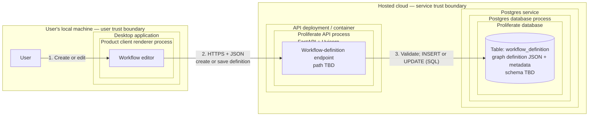
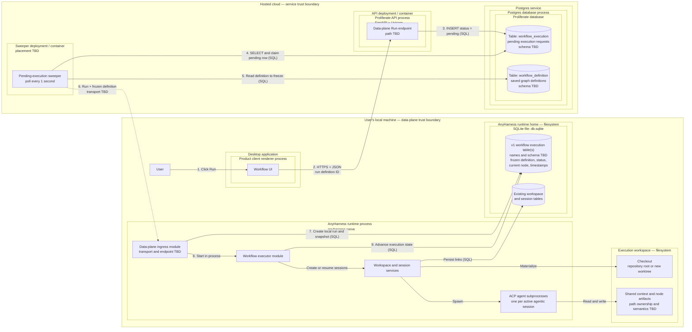

Description: Define the v1 local workflows product and the architecture that can extend to later workflow capabilities.
Date: 2026-08-07
Status: working draft

# Workflows v1 launch

This is the working ADR for the workflows PR ladder. The filename and date are
provisional until the team approves the decision. Per the
[ADR procedure](../guides/process/adrs.md), this file lands in `adrs/` only in
the final PR of the ladder, after the decision has shipped.

## Orientation

### Purpose

Workflows let a user define, save, and execute a directed graph of agentic work.
A graph contains agentic work nodes (`agent` and `human_in_loop`), conditional
decision nodes (`choice`), and terminal nodes (`succeed` and `fail`). A workflow
definition is JSON conforming to a schema owned by this repository.

The product is intended to become a general infrastructure primitive for
individuals and teams automating knowledge work, including software delivery,
support engineering, ticket triage, on-call response, bug fixes, and email.

### Goals

- Ship a deliberately scoped workflows feature end to end for v1.
- Let a user manually create and save a workflow definition.
- Let a user manually trigger a saved workflow.
- Choose runtime and data-model primitives that can accommodate the planned
  follow-up capabilities without redesigning the foundation.

### Non-goals

- Generating workflows from a prompt. A later workflow-builder agent will need
  repository-owned Markdown rules that encode the product's workflow standards.
- Triggering workflows through webhooks or schedules. V1 supports only manual
  triggers.
- Executing workflows in a cloud sandbox. V1 execution is local only.

### Requirements

1. The implementation and deployment plan consists of an initial PR that
   removes the existing Workflows beta, then four sequential PRs: engine, data
   models, workflow lifecycle orchestration, then UI and client.
2. The v1 product surface stays intentionally narrow, but its runtime primitives
   and data model account for the known follow-up capabilities so those changes
   do not require an architectural redesign.
3. A user can create a workflow manually in the graph UI.
4. A user can save a workflow as a `workflowDefinition`.
5. A user can modify an existing `workflowDefinition` and save it in place.
6. A user can delete an existing `workflowDefinition`.
7. A user can manually trigger an existing `workflowDefinition`.
8. Each `agent` and `human_in_loop` node has its own model configuration.
9. Each workflow execution creates its own workspace.
10. A `workflowDefinition` specifies whether an execution creates a new worktree
    or runs at the repository root by default.
11. When manually triggering a workflow, the user can override the definition's
    worktree or repository-root default in the UI.
12. One workflow execution owns one workspace, and each agentic workflow
    execution node maps to one session in that workspace.
13. Each `agent` and `human_in_loop` node receives a prompt, a set of goals, and
    optional verification methods.
14. A `choice` node evaluates a condition and selects an outgoing branch.
15. A valid workflow has exactly one `succeed` node and exactly one `fail` node;
    these are its only terminal node types.
16. Every non-terminal node has an edge to `fail` for runtime errors and
    exceptions.
17. Multiple nodes may have an edge to `succeed`.
18. All nodes in a workflow execution share context under
    `<workspace-root>/context/shared/<document>`. Shared context is typically
    Markdown but may be any file or artifact usable by agents and humans.
19. All nodes have full read and write access to
    `<workspace-root>/.proliferate/workflows/<workflow-name>/shared/`.
20. Each agentic node can create files and artifacts under
    `<workspace-root>/.proliferate/workflows/<workflow-name>/<node-index>/`, where
    `<node-index>` is the zero-padded agentic-node index (`00`, `01`, `02`, and
    so on).
21. The graph UI shows each agentic node's index in both definition and execution
    views, matching the index used in the node artifact path in requirement 20.
22. A workflow execution workspace uses the same UI and UX primitives as a
    normal workspace and its sessions.
23. A user can chat in any workflow-generated session.
24. A user can manually create additional sessions in a workflow execution
    workspace to work with the workflow's shared context.

## Current context

A complete Workflows beta already ships in this repository, spanning the
product clients, the Cloud SDKs, the hosted control plane, and the AnyHarness
runtime. Its operating law is the six-document set indexed at
[Workflow Systems](../specs/codebase/systems/product/workflows/README.md).
The beta models a workflow as a linear document executed remotely:

- A definition is `inputs[]` plus ordered `stages[]`; each stage is one
  `harnessConfig` plus sequential `agent.prompt` steps
  ([definitions.md](../specs/codebase/systems/product/workflows/definitions.md)).
  There are no other node kinds, no edges, no conditions, and no terminal
  vocabulary.
- The only executable shape is exactly one stage containing exactly one prompt
  step, run as one prompt in one new session in one workspace
  ([runs.md](../specs/codebase/systems/product/workflows/runs.md); enforced for
  both schema versions in
  [service.rs](../anyharness/crates/anyharness-lib/src/domains/workflows/service.rs)
  and
  [portable_validation.rs](../anyharness/crates/anyharness-lib/src/domains/workflows/portable_validation.rs)).
- The only launch target is `managedCloud`: a Cloud worker pipeline delivers
  the run into the user's personal cloud sandbox
  ([invocations.md](../specs/codebase/systems/product/workflows/invocations.md),
  [managed-cloud-execution.md](../specs/codebase/systems/product/workflows/managed-cloud-execution.md)).
  There is no local execution path.
- Triggers are manual-only, matching this ADR's non-goals. New managed
  delivery is gated off by default (`WORKFLOW_MANAGED_RUNS_ENABLED`,
  [env-vars.yaml](../specs/developing/reference/env-vars.yaml)). Definition
  authoring, run history, and cancellation are live for every signed-in user
  behind a dismissable interstitial that gates nothing structurally
  ([WorkflowsBetaGateModal.tsx](../apps/packages/product-client/src/components/workflows/WorkflowsBetaGateModal.tsx)).

This decision replaces that model with a locally executed JSON graph of
`agent`, `human_in_loop`, `choice`, `succeed`, and `fail` nodes. The beta's
definition schema, wire contracts, persistence shapes, execution engine, and
editor UI are contradicted rather than extended (exact conflicts below), so
the ladder starts with a removal PR instead of carrying both models through
the four build PRs.

### Source tree, ordered by data flow

Only the paths below are the feature. `hooks/<area>/workflows/` and
`lib/workflows/**` elsewhere in the frontend are an action-orchestration
naming convention, `.github/workflows/**` is CI, and the legacy `automations`
domain is the older scheduled-sessions feature whose routes redirect to
`/workflows`; none of those are part of the beta.

```text
apps/packages/product-client/src/
├── pages/WorkflowsPage.tsx                      /workflows routes; beta interstitial
├── components/workflows/                        form editor; run launch/history/detail
├── hooks/workflows/workflows/                   save/launch/cancel/open actions
├── hooks/access/cloud/workflows/                Cloud query access wrappers
└── domain/workflows/                            client twin of the linear definition

cloud/sdk-react/src/hooks/workflows.ts           queries; 3 s nonterminal run polling
cloud/sdk/src/client/workflows.ts                wraps the eleven Cloud endpoints

server/proliferate/
├── server/workflows/                            api, service, managed gate, validation
│   └── worker/                                  workflows.deliver / observe / cancel
├── server/cloud/workspaces/workflow_binding.py  Cloud workspace alias per run
├── db/models/workflows.py                       the three Postgres tables
└── integrations/anyharness/workflow_*.py        runtime HTTP clients

anyharness/crates/
├── anyharness-contract/src/v1/workflow_*.rs     v1 + v2 wire contracts
├── anyharness-lib/src/api/http/workflow_*.rs    the five runtime endpoints
├── anyharness-lib/src/domains/workflows/        acceptance, resolution, execution,
│   │                                            run control
│   └── workspace_materialization/               placement claim for workflows/<runId>
├── anyharness-lib/src/domains/workspaces/       workflow_placement.rs worktree seam
├── anyharness-lib/src/domains/sessions/         admission.rs session admission
└── anyharness-lib/src/persistence/              migrations 0060–0064; three SQLite
                                                 tables
```

### Clients — `apps/packages/product-client`, one surface for Desktop and Web

Routes `/workflows`, `/workflows/:workflowId`, and
`/workflows/:workflowId/runs/:runId`
([app-routes.ts](../apps/packages/product-client/src/config/app-routes.ts))
mount a sequential form editor — title, description, default repository,
scalar input rows, ordered stage cards with catalog-driven agent/model/effort
selects, ordered prompt blocks with optional goal
([WorkflowDefinitionEditor.tsx](../apps/packages/product-client/src/components/workflows/WorkflowDefinitionEditor.tsx))
— plus managed-run launch, cursor-paginated history, and a run detail view of
the remote delivery pipeline
([WorkflowRunsSurface.tsx](../apps/packages/product-client/src/components/workflows/runs/WorkflowRunsSurface.tsx)).
The editor authors up to 64 stages and steps, but launch eligibility blocks
anything beyond one stage, one step, no goal: authoring capability already
exceeds runnable capability. Navigation chrome: a sidebar entry with a beta
pill, a command palette entry, a keyboard shortcut, and legacy `/automations`
redirects into `/workflows`. Mobile and the Desktop shell have no additional
workflow surfaces.

- Reused: app routing and navigation chrome; the catalog-driven
  agent/model/effort selectors as the basis for per-node model configuration
  (requirement 8); the ordinary workspace and session UI that requirement 22
  mandates, which the beta never modified.
- Contradicted: requirements 3 and 21 require a graph editor with visible
  node indexes; the current surface is a sequential form, and
  [definitions.md](../specs/codebase/systems/product/workflows/definitions.md)
  records "There is no canvas". The run detail view narrates remote delivery
  custody that local execution does not have.

### SDKs — `cloud/sdk`, `cloud/sdk-react`, `anyharness/sdk`

[client/workflows.ts](../cloud/sdk/src/client/workflows.ts) wraps the eleven
Cloud endpoints;
[hooks/workflows.ts](../cloud/sdk-react/src/hooks/workflows.ts) owns
definition queries, mutation actions, and 3-second nonterminal run polling.
The AnyHarness SDK carries workflow runs only as generated OpenAPI types,
pinned by
[workflow-runs.test.ts](../anyharness/sdk/src/workflow-runs.test.ts) against
[workflow-portable-execution/v1.json](../fixtures/contracts/workflow-portable-execution/v1.json).

- Contradicted: the current clients round-trip the linear definition schema
  and the `managedCloud` invocation and delivery lifecycle, both retired by
  this decision. The rebuilt definition and execution APIs get new generated
  clients rather than an evolution of these shapes.
- Extended: the AnyHarness SDK gains the new local API through the normal
  generated-OpenAPI boundary; regeneration replaces the workflow-run types
  rather than accumulating beside them.

### Hosted control plane — `server/`

[api.py](../server/proliferate/server/workflows/api.py) owns eleven endpoints
under `/v1/workflows` and `/v1/workflow-invocations`: definition CRUD plus
run-eligibility, immutable invocation acceptance, deliver, cancel, and
history. Three Postgres tables live in
[db/models/workflows.py](../server/proliferate/db/models/workflows.py):
`workflow_definition` (linear `inputs_json`/`stages_json`, `schema_version`
CHECK-pinned to 1, optimistic `revision`, soft delete), `workflow_invocation`
(immutable snapshot; only `target.kind == "managedCloud"` is accepted), and
`workflow_managed_execution` (delivery checkpoints, sandbox custody,
monotonic runtime projection). Delivery runs as three outbox tasks —
`workflows.deliver`, `workflows.observe`, `workflows.cancel`
([worker/delivery.py](../server/proliferate/server/workflows/worker/delivery.py))
— that place a workspace, bind a product Cloud workspace alias
([workflow_binding.py](../server/proliferate/server/cloud/workspaces/workflow_binding.py)),
PUT the run into the sandbox runtime, and poll it to a terminal state.
[check_workflow_managed_boundaries.py](../scripts/check_workflow_managed_boundaries.py)
ratchets this tree off the legacy Cloud sync planes.

- Reused: the control-plane platform itself (API framework, Postgres, the
  background substrate) with nothing workflow-specific carried over. The
  catalog read used by authoring validation belongs to the catalogs platform
  and remains.
- Contradicted: the preferred design keeps definitions and pending execution
  requests in this cell, but no current primitive expresses them. The
  definition document rejects unknown fields at every nesting level and pins
  `schemaVersion: 1`, so the graph schema cannot land as an evolution of
  these rows or endpoints, and the invocation, managed-execution, and worker
  pipeline exist to deliver runs into a cloud sandbox, which local-only v1
  execution never does. The new feature rebuilds this cell — same names,
  different schemas — rather than extending it.

### AnyHarness runtime — `anyharness/`

Five endpoints: `PUT`/`GET /v1/workflow-runs/{runId}`,
`POST /v1/workflow-runs/{runId}/cancel`, and
`PUT`/`GET /v1/workflow-run-workspaces/{runId}`
([workflow_runs.rs](../anyharness/crates/anyharness-lib/src/api/http/workflow_runs.rs),
[workflow_workspaces.rs](../anyharness/crates/anyharness-lib/src/api/http/workflow_workspaces.rs)).
A run freezes `invocation_json` as canonical-JSON replay identity, resolves
one concrete agent/model/mode/effort plan before effects
([resolution.rs](../anyharness/crates/anyharness-lib/src/domains/workflows/resolution.rs)),
creates one InternalOnly session, dispatches the single deterministic prompt
`workflow:<runId>:0:0`
([model.rs](../anyharness/crates/anyharness-lib/src/domains/workflows/model.rs)),
and terminalizes through a session-completion extension. Run control adds
truthful cancellation, `stateVersion`, restart fencing to
`interrupted/runtime_restarted`, and exclusive session admission with
`409 SESSION_CONTROLLED_BY_WORKFLOW`
([run-control.md](../specs/codebase/systems/product/workflows/run-control.md)).
Placement materializes `<managed-worktrees-root>/workflows/<runId>` on branch
`workflow/<runId>` — scratch or repository worktree, never repository root
([workspace-placement.md](../specs/codebase/systems/product/workflows/workspace-placement.md)).
Local persistence is three SQLite tables — `workflow_runs`,
`workflow_run_steps`, `workflow_workspace_materializations`, plus a
partial-unique active-controller index — across migrations 0060–0064, snapshot
in [anyharness-db-schema.sql](../specs/generated/anyharness-db-schema.sql).
Steps are addressed as `(stage_index, step_index)`, a linear coordinate space
with only `(0, 0)` ever materialized. Nothing resembling the requirement
18–20 shared-context paths exists; run artifacts live only in session
transcripts.

- Reused: the generic seams the beta added to the sessions domain (checked
  internal session creation, persisted startup, text-prompt dispatch with a
  caller-owned prompt ID, `SessionExtension` completion hooks) and the
  workspace domain's worktree materialization and operation gates. These are
  owned by sessions and workspaces, not workflows, and carry directly into
  the new engine's `agent` nodes.
- Design references that survive removal as patterns, not code:
  canonical-JSON acceptance and replay, guarded compare-and-set status
  transitions, restart fencing, deterministic fail-closed placement, and
  secret-free closed failure codes.
- Contradicted: the run model itself; see the conflict table below.

### Workspace and session lifecycle, repository/worktree setup

The beta consumes ordinary workspaces and sessions without changing their
contracts: a placed workflow workspace is a visible ordinary workspace
excluded from generic retention by creator context, and the run's session is
a normal session inspectable through existing session APIs. The new feature
keeps that posture (requirements 22–24) and needs two behaviors the beta
lacks: execution-owned workspace creation with a repository-root mode
(requirements 9–10), and open chat in workflow sessions, which the beta's
exclusive admission deliberately rejects while a run is nonterminal
([admission.rs](../anyharness/crates/anyharness-lib/src/domains/sessions/admission.rs)).

### Canonical documentation and repository tooling

The six workflow documents above are current-status operating law, and
roughly twenty more reference the beta: server and AnyHarness structure
guides, the product system map, testing scenarios (active `T2-WFDEF-1` and
parked `T2-WF`/`T3-WF` rows in
[scenarios.md](../specs/TESTING/scenarios.md)), the env-var reference, the
generated SQLite schema, contract fixtures
([workflow-definition](../fixtures/contracts/workflow-definition/minimal.json)),
and the intent spec
[workflow-definitions.spec.ts](../tests/intent/specs/workflow-definitions.spec.ts).
[check_docs.py](../scripts/check_docs.py) pins the workflows README as a
required routing root. The removal PR must update all of these in the same
PR, per the documentation authority rules in
[specs/README.md](../specs/README.md).

### Conflicts that force removal

| Beta primitive | This decision requires |
| --- | --- |
| Linear definition document: `inputs[]` plus ordered `stages[].steps[]`, unknown fields rejected at every level, `schemaVersion` pinned to 1. | A graph JSON schema with typed nodes and edges (Purpose; requirements 4, 13–17). Not expressible as an evolution of the stored shape. |
| One step kind, `agent.prompt`; no human, choice, or terminal vocabulary. | `agent`, `human_in_loop`, `choice`, `succeed`, and `fail` node types (requirements 13–15). |
| Runnable cardinality hard-limited to one stage, one step, no goal; one run = one session = one prompt. | Multi-node executions where each agentic node owns one session with prompt, goals, and verification (requirements 12–13). |
| Closed run/step statuses and failure codes; failure is a code on the run row. | Graph terminals: exactly one `succeed` and one `fail` node, and a failure edge from every non-terminal node (requirements 15–17). |
| Only launch target `managedCloud`: outbox delivery into a personal cloud sandbox. | Local-only v1 execution; cloud-sandbox execution is an explicit non-goal. |
| One resolved model plan per run, fixed before effects. | Per-node model configuration (requirement 8). |
| Caller-orchestrated pre-run placement at fixed `workflows/<runId>` worktree or scratch; no repository-root mode, no trigger-time choice. | Execution-owned workspace per run, a definition-level worktree-or-root default, and a trigger-time override (requirements 9–11). |
| Exclusive session admission: foreign mutation of a workflow session fails with `409` while the run is nonterminal. | Users chat in workflow-generated sessions and add sessions to the execution workspace (requirements 23–24). |
| Sequential form editor; "There is no canvas". | A graph UI with per-node indexes in definition and execution views (requirements 3, 21). |

### Removal precedes the ladder

Every contradicted primitive is strict, schema-pinned, and cross-referenced by
tests and fixtures, so carrying it through the ladder would force dual old/new
paths in all four build PRs — exactly what the repository rules prohibit after
a migration. The namespaces also collide: the new feature wants
`/v1/workflows`, `domains/workflows`, `components/workflows`, and the
`workflow_*` table names with different meanings. Removal is bounded because
the riskiest layer is dormant — managed delivery defaults off, triggers are
manual-only, and no scheduler exists — but definition authoring was never
gated, so the disposition of existing user rows is recorded in Open
decisions. The sessions and workspaces seams stay where they are; the removal
PR deletes workflow-owned code, tables (forward migrations on both Postgres
and runtime SQLite; the 0060–0064 migration numbers stay claimed), generated
artifacts, fixtures, scripts, and the documentation listed above.

## External systems and spikes
N/A

## Design

### Preferred design

The v1 launch separates durable product intent from local execution. Reusable
definitions and pending execution requests live in the hosted control plane. A
claimed run's frozen definition and live execution state live in the executor
runtime's SQLite database on the user's machine.

The maps below read from the outside in: infrastructure and trust boundary,
deployment or container, operating-system process, logical module or endpoint,
then table or filesystem. Only a box explicitly labeled as a process or
container is a running unit. `TBD` marks a placement, transport, path, or schema
that this design has not settled.

#### Control-plane flow: create and save a definition

Source-readable deployment map:

```text
USER'S LOCAL MACHINE — user trust boundary
├─ User
└─ Desktop application
   └─ Product client renderer process
      └─ Workflow editor

HOSTED CLOUD — service trust boundary
├─ API deployment / container
│  └─ Proliferate API process (FastAPI + Uvicorn)
│     └─ Workflow-definition endpoint (path TBD)
└─ Postgres service
   └─ Postgres database process
      └─ Proliferate database
         └─ table: workflow_definition
            └─ graph definition JSON + metadata (schema TBD)

FLOW
1. User ── create or edit ──► Workflow editor
2. Workflow editor ── HTTPS + JSON ──► Workflow-definition endpoint
3. Workflow-definition endpoint ── validate; INSERT or UPDATE (SQL)
   ──► workflow_definition
```

Rendered map:



#### Data-plane flow: run a saved definition locally

Source-readable deployment map:

```text
USER'S LOCAL MACHINE — data-plane trust boundary
├─ User
├─ Desktop application
│  └─ Product client renderer process
│     └─ Workflow UI
├─ AnyHarness runtime process (`anyharness serve`)
│  ├─ Data-plane ingress module (transport and endpoint TBD)
│  ├─ Workflow executor module
│  ├─ Workspace and session services
│  └─ ACP agent subprocesses (one per active agentic session)
├─ AnyHarness runtime home (filesystem)
│  └─ SQLite file: db.sqlite
│     ├─ v1 workflow execution table(s) (names and schema TBD)
│     │  └─ frozen definition, status, current node, timestamps
│     └─ existing workspace and session tables
└─ Execution workspace (filesystem)
   ├─ checkout: repository root or new worktree
   └─ shared context and node artifacts (path ownership and semantics TBD)

HOSTED CLOUD — service trust boundary
├─ API deployment / container
│  └─ Proliferate API process (FastAPI + Uvicorn)
│     └─ data-plane Run endpoint (path TBD)
├─ Postgres service
│  └─ Postgres database process
│     └─ Proliferate database
│        ├─ table: workflow_execution
│        │  └─ pending execution requests (schema TBD)
│        └─ table: workflow_definition
│           └─ saved graph definitions (schema TBD)
└─ Sweeper deployment / container (placement TBD)
   └─ Pending-execution sweeper
      └─ polls every 1 second

FLOW
1. User ── click Run ──► Workflow UI
2. Workflow UI ── HTTPS + JSON: definition ID ──► Run endpoint
3. Run endpoint ── INSERT status=pending (SQL) ──► workflow_execution
4. Sweeper ── SELECT and claim pending row (SQL) ──► workflow_execution
5. Sweeper ── read and freeze definition (SQL) ──► workflow_definition
6. Sweeper ── run + frozen definition; transport TBD ──► data-plane ingress
7. Data-plane ingress ── create local run and snapshot (SQL)
   ──► v1 workflow execution table(s)
8. Data-plane ingress ── start in process ──► workflow executor
9. Workflow executor ── advance execution state (SQL)
   ──► v1 workflow execution table(s)
```

Rendered map:



### Assumptions

Not established yet.

### Tradeoffs

Not evaluated yet.

### Alternatives

Not evaluated yet.

### Open decisions

| Decision | Owner | Must close by |
| --- | --- | --- |
| Define the canonical schema vocabulary for definitions, executions, execution nodes, and the `succeed` terminal. The source draft used both `succeed` and `success`; this ADR consistently uses `succeed`. | Product and runtime | Engine PR delivery spec |
| Decide whether requirements 18 and 19 describe two distinct context classes or two candidate paths for the same shared context, then define ownership, visibility, cleanup, and migration semantics. | Runtime and product | Engine PR delivery spec |
| Define graph validation semantics, including entry-node cardinality, cycles, unreachable nodes, choice exhaustiveness, and whether every non-terminal node must have an explicit failure edge or may inherit one. | Runtime | Engine PR delivery spec |
| Define what "account for follow-up capabilities" means as a finite capability list so requirement 2 is testable and does not force speculative generality. | Product | Engine PR delivery spec |
| Decide the disposition of existing user-authored `workflow_definition` and `workflow_invocation` rows when the beta is removed (drop, export, or archive). Definition authoring was never feature-gated, so live rows may exist. | Product and server | Removal PR delivery spec |

## New and modified primitives, by grid cell

Each numbered item is one affected ownership cell. The build points under it
are the concrete state, endpoint, class/function, schema, or access additions
for that cell. `Rebuilt` means the beta namespace returns after the removal PR
with new state and contracts.

This design currently touches 28 ownership cells:

- AnyHarness runtime: 8 cells (1 new, 5 rebuilt, 2 modified).
- Hosted control plane: 7 rebuilt cells.
- Local delivery: 1 new cell whose owner is unresolved.
- SDKs: 4 rebuilt cells.
- Product client: 8 cells (7 rebuilt, 1 modified).

Exact endpoint paths, persisted fields, and method signatures close with the
open decisions above.

### AnyHarness runtime grid — 8 cells

1. **`live/workflows` — new**
   - `LiveWorkflowManager`
   - `LiveWorkflowHandle`
   - `WorkflowActor`
   - `WorkflowLaunch`
   - `WorkflowActorCapabilities`
   - `WorkflowLiveSnapshot`
   - private `WorkflowCommand`

   This cell coordinates running executions. The manager owns the process-local
   registry, the handle is the only public port to one execution, and one actor
   serializes node completion, human decisions, cancellation, retry, and
   shutdown. SQLite remains authoritative.

2. **`domains/workflows` — rebuilt**
   - `WorkflowEngine`
   - `WorkflowExecutionStore`
   - `WorkflowExecutionService`
   - `WorkflowExecutionRuntime`
   - `WorkflowSessionExtension`
   - `WorkflowContextLayout`
   - `WorkflowDefinitionSnapshot`
   - `WorkflowExecutionRecord`
   - `WorkflowNodeExecutionRecord`
   - execution status, transition, failure, and recovery enums

   This cell owns durable workflow meaning. It validates frozen definitions,
   decides graph transitions, records execution and node state, correlates
   workflow-owned session turns, and bridges durable state to
   `LiveWorkflowManager`.

3. **`api/http/workflows` — rebuilt**
   - idempotent local execution acceptance
   - execution read and list
   - cancellation
   - human-decision submission
   - retry and resume
   - wire/domain mappers and typed error mapping

   These are thin HTTP operations over `WorkflowExecutionRuntime`. Exact paths
   remain TBD. An execution event stream is added only if durable reads and
   ordinary session streams cannot serve the execution view.

4. **`anyharness-contract/v1/workflows` — rebuilt**
   - frozen execution envelope
   - execution view
   - execution-node view
   - placement override
   - cancellation request
   - human-decision request
   - retry/resume requests and typed problem responses

   These are the only workflow shapes that cross the AnyHarness HTTP boundary.
   Generated OpenAPI carries them into the AnyHarness SDK.

5. **`persistence/workflows` — rebuilt**
   - `workflow_executions` table family (working name)
   - `workflow_execution_nodes` table family (working name)
   - replay, state-version, and active-controller indexes
   - migrations and regenerated SQLite schema snapshot

   These replace the beta's linear run, step, and materialization tables.
   Whether attempts or events need separate rows remains part of the engine
   schema decision.

6. **`app/workflows` — rebuilt**
   - workflow store/service/runtime construction
   - `WorkflowActorCapabilities` wiring
   - `LiveWorkflowManager` construction
   - route and `WorkflowSessionExtension` registration
   - startup recovery

   This cell composes dependencies. It owns no graph or transition policy.

7. **`domains/workspaces` — modified**
   - remove the beta workflow-placement API
   - remove workflow materialization records
   - route root and worktree execution through ordinary workspace creation with
     workflow creator context

   A workflow execution still owns one ordinary workspace. Context and artifact
   directories belong to the workflow domain rather than the workspace domain.

8. **`domains/sessions` — modified**
   - remove `SESSION_CONTROLLED_BY_WORKFLOW` admission
   - retain caller-owned prompt IDs and `SessionExtension` completion
   - retain normal user prompts and user-created sessions

   Workflows use `SessionRuntime`; they do not add another session manager,
   actor, or HTTP surface. Generic session origin metadata changes only if the
   run-to-execution vocabulary requires it.

### Hosted control-plane workflows column — 7 cells

1. **`(models, workflows)` — rebuilt**
   - graph-definition and definition-summary models
   - placement-default models
   - execution-request and delivery-state models
   - claim/dispatch acknowledgement and failure models
   - `workflow_definition` and `workflow_execution` ORM rows

   An execution request identifies the exact definition revision it runs,
   either through a frozen snapshot or an immutable revision reference.

2. **`(domain, workflows)` — rebuilt**
   - graph validation
   - stable agentic-node index validation
   - definition mutation policy
   - execution-request policy
   - delivery/claim transition policy

   This cell contains pure product rules and performs no I/O.

3. **`(store, workflows)` — rebuilt**
   - `WorkflowDefinitionStore`
   - `WorkflowExecutionStore`

   The stores own definition CRUD and revision compare-and-set, pending
   execution creation, delivery transitions, acknowledgement, cancellation,
   failure, and stale-delivery recovery.

4. **`(service, workflows)` — rebuilt**
   - `WorkflowDefinitionService`
   - `WorkflowExecutionService`
   - workflow delivery service

   These services orchestrate the workflow stores, catalog reads, and selected
   local-delivery transport without exposing ORM rows.

5. **`(api, workflows)` — rebuilt**
   - definition create/list/get/update/delete
   - manual execution trigger
   - execution read/list
   - cancel
   - claim or dispatch
   - delivery acknowledgement and failure

   The API composes authentication and resource access, then delegates to the
   workflow services. Paths remain TBD.

6. **`(worker/service, workflows)` — rebuilt**
   - pending-execution delivery/expiry operation

   The worker service owns domain-aware background orchestration and calls the
   selected delivery transport.

7. **`background` — rebuilt**
   - thin Celery delivery or claim task
   - Beat- or outbox-owned dispatch

   There is no process-owned one-second scheduler. Background task shims contain
   no workflow policy.

### Local execution delivery — 1 unresolved cell

1. **Owner TBD — new**
   - execution delivery identity
   - claim or dispatch lease
   - frozen-definition handoff envelope
   - AnyHarness acceptance call
   - certain/uncertain acknowledgement and retry

   One owner must move a pending control-plane request to the user's loopback
   AnyHarness runtime. A Desktop ProductClient lifecycle can claim and forward
   work; server push instead requires a new authenticated outbound device
   connection. A hosted sweeper cannot call loopback directly, and Proliferate
   Worker cannot absorb this under its current no-command-runner contract.

### SDK grid — 4 cells

1. **`cloud/sdk` — rebuilt**
   - definition client methods
   - execution and delivery client methods
   - generated FastAPI workflow types

   This is the framework-independent control-plane transport surface.

2. **`cloud/sdk-react` — rebuilt**
   - definition queries and mutations
   - execution/delivery queries and mutations
   - query keys and invalidation

   This cell owns generic React state for Cloud workflow resources.

3. **`anyharness/sdk` — rebuilt**
   - execution client methods
   - optional execution stream helper
   - generated Rust-contract workflow types

   This is the framework-independent local-runtime transport surface.

4. **`anyharness/sdk-react` — rebuilt**
   - execution queries and mutations
   - optional execution stream lifecycle
   - query keys and invalidation

   This cell owns generic React state for AnyHarness workflow resources.

### Product-client workflows grid — 8 cells

1. **`stores/workflows` — rebuilt**
   - graph draft
   - persisted graph layout
   - device-local delivery identity, if required by the selected transport

   Only client-owned state lives here. Cloud and AnyHarness resources remain in
   their query caches.

2. **`hooks/access/cloud/workflows` — rebuilt**
   - definition access hooks
   - execution/delivery access hooks
   - Cloud query keys and invalidation

   This is the ProductClient boundary to the Cloud SDK.

3. **`hooks/access/anyharness/workflows` — rebuilt**
   - local execution access hooks
   - cancellation and human-decision mutations
   - local execution query keys and invalidation

   This is the ProductClient boundary to the AnyHarness SDK.

4. **`domain/workflows` and `lib/domain/workflows` — rebuilt**
   - graph draft types
   - pure graph validation
   - stable node-index projection
   - execution graph projection
   - trigger and placement decisions

   These modules contain synchronous product rules and import no React or
   transport clients.

5. **`lib/workflows/workflows` — rebuilt**
   - save definition
   - delete definition
   - trigger execution
   - local handoff and recovery

   These functions own multi-step sequences using injected Cloud, AnyHarness,
   navigation, cache, and telemetry capabilities.

6. **`hooks/workflows/**` — rebuilt**
   - derived workflow state
   - user-action workflow hooks
   - Desktop-only local-delivery lifecycle, if ProductClient owns delivery
   - page facade

   These hooks compose stores, access, and pure workflow functions for the UI.

7. **`components/workflows` — rebuilt**
   - graph editor
   - per-node configuration
   - visible agentic-node indexes
   - trigger placement dialog
   - execution graph
   - human-in-loop controls

   Components render state and call hooks; they own no raw access or
   orchestration.

8. **Workflow pages and route configuration — modified**
   - workflow list/editor route
   - workflow execution route
   - navigation and command-palette entries

   Existing workflow URLs remain where possible, but every beta surface behind
   them is replaced.

Catalogs, repo roots, the normal workspace/session UI,
`LiveSessionManager`/`SessionActor`, and Desktop's AnyHarness sidecar lifecycle
are accessed but otherwise unchanged. Proliferate Worker is not a workflow
execution cell.

## Flows

These flows use **local delivery owner** for the unresolved cell that claims or
receives a pending control-plane execution and hands it to the user's
AnyHarness runtime. The owner, transport, exact endpoint paths, condition
language, and retry-attempt schema remain open decisions. The ordering and
durability guarantees below do not depend on those choices.

### Create and save a workflow definition

1. The user opens the workflow editor and starts an unsaved graph draft.
2. The user adds nodes and edges, configures each agentic node's model, prompt,
   goals, and optional verification methods, and chooses the definition's
   default placement.
3. The ProductClient projects stable agentic-node indexes into the graph and
   shows the same indexes that will name node artifact directories.
4. On Save, the ProductClient validates the draft against the supported schema
   and graph rules. At minimum, it requires exactly one `succeed` node, exactly
   one `fail` node, and a failure edge from every non-terminal node.
5. The save workflow sends the graph, layout, placement default, and metadata
   through the Cloud SDK to the control-plane definition API.
6. The API authenticates the user, checks resource access, and delegates to the
   definition service. The server repeats graph, node-index, and catalog
   validation; client validation is not authoritative.
7. The definition store atomically inserts the definition and its initial
   revision, then returns the canonical saved representation.
8. The ProductClient replaces the unsaved draft with the returned definition,
   updates definition queries, and opens the saved-definition route. If any
   hop fails, the draft stays in the editor and no local execution state is
   created.


### Create a workdlow definition from a template

### Edit a workflow definition

1. The ProductClient loads the saved definition and its current revision into a
   graph draft.
2. The user changes the graph, node configuration, metadata, layout, or default
   placement. The ProductClient preserves existing agentic-node indexes and
   assigns new indexes without renumbering unchanged nodes.
3. On Save, the client performs the same local validation as creation and sends
   the edited definition with the revision it loaded.
4. The control plane authenticates, authorizes, and revalidates the document,
   then updates it with a revision compare-and-set.
5. A successful update creates the next definition revision and returns it to
   the ProductClient. Existing pending and local executions remain pinned to
   the revision they already captured.
6. If the compare-and-set fails, the API returns a stable revision-conflict
   error. The ProductClient keeps the user's draft and asks them to reload or
   reconcile it instead of silently overwriting the newer revision.

### Delete a workflow definition

1. The user requests deletion from the definition list or editor and confirms
   the action.
2. The ProductClient sends the definition ID and loaded revision to the
   control-plane definition API.
3. The API authenticates, authorizes, and applies the definition deletion
   policy with a revision compare-and-set.
4. After deletion, new execution requests for that definition are rejected.
   Execution requests that already captured a revision and local executions
   with a frozen snapshot remain readable and executable.
5. The ProductClient removes the definition from its caches and leaves the
   deleted definition route. A revision conflict leaves the definition and
   local draft untouched.

### Manually trigger an execution

1. From a saved definition, the user opens the trigger dialog and selects the
   repository.
2. The dialog shows the definition's default placement and asks the user to run
   there or in the other placement. If the default is the repository root, the
   alternative is a new worktree; if the default is a new worktree, the
   alternative is the repository root. Choosing the alternative creates an
   explicit trigger-time override.
3. The ProductClient sends the definition ID, selected revision, repository
   reference, and optional placement override to the control-plane execution
   API.
4. The control plane authenticates and authorizes the request, verifies that
   the definition revision is triggerable, resolves the effective placement
   from that revision and any override, and atomically creates a pending
   execution request pinned to the revision and effective placement.
5. The local delivery owner claims or receives the pending request, obtains the
   exact definition revision, and resolves the repository reference to the
   user's local repository.
6. The local delivery owner sends the execution ID, frozen definition, and
   effective placement to AnyHarness. Acceptance is idempotent by execution ID
   so an uncertain delivery can repeat this hop.
7. AnyHarness validates the envelope and persists the accepted execution and
   frozen definition before starting workflow effects.
8. The ordinary workspace service creates an execution-owned workspace in the
   effective placement. Repository-root placement binds the workspace to the
   existing repository root without creating a branch or worktree.
   New-worktree placement creates a worktree through the existing
   worktree-creation path.
9. The workflow domain records the workspace link and materializes the shared
   context and node-artifact layout required by the definition.
10. After placement succeeds, `LiveWorkflowManager` starts one `WorkflowActor`
    at the graph's entry node. Placement failure is recorded before any agentic
    node starts. The runtime returns the durable execution identity and state
    version.
11. The local delivery owner acknowledges acceptance to the control plane, and
    the ProductClient opens the ordinary workspace and execution view. If the
    acknowledgement is uncertain, redelivery returns the existing local
    execution and workspace rather than creating either again.

### Advance through `agent`, `human_in_loop`, and `choice` nodes

All node transitions pass through one `WorkflowActor`. The actor serializes
session completion, human decisions, cancellation, retry, and shutdown, while
SQLite remains authoritative.

#### `agent`

1. The actor enters the `agent` node and durably records it as the current
   running node before dispatching work.
2. The workflow runtime creates the node's ordinary session in the execution
   workspace, links that session to the node execution, and prepares the
   node-indexed artifact directory.
3. The runtime sends the node's prompt, goals, verification instructions, and
   model configuration through `SessionRuntime` with a workflow-owned prompt
   ID.
4. The agent subprocess runs as an ordinary session and may read or write the
   checkout, shared context, and its node artifacts.
5. `WorkflowSessionExtension` reports completion only for the workflow-owned
   turn. The actor ignores ordinary user-chat turns for graph advancement.
6. The engine evaluates the completion and configured verification result. A
   successful result selects the node's normal outgoing edge; an execution
   error or failed verification selects its explicit edge to `fail`.
7. The actor atomically records the node result, selected edge, next node, and
   new state version before it dispatches the next node.

#### `human_in_loop`

1. The actor enters the `human_in_loop` node, records it as current, and creates
   its ordinary node session through the same path as an `agent` node.
2. The runtime dispatches the workflow-owned turn using that node's prompt,
   goals, verification instructions, and model configuration.
3. When the turn reaches its human checkpoint, the actor records that the node
   is waiting for a human decision. It does not choose an outgoing edge.
4. The execution view shows the node session, relevant context, and the
   decision controls defined by the node.
5. The user may chat in the session without advancing the graph. To advance,
   the user submits an explicit human-decision request with the state version
   they observed.
6. The actor rejects a stale or invalid decision, or durably records an
   accepted decision and maps it to the node's configured outgoing edge.
7. The actor records the completed node, selected edge, next node, and new
   state version in one transition before continuing.

#### `choice`

1. The actor enters the `choice` node and durably records it as current. A
   `choice` node does not create a session.
2. The engine evaluates the node's condition against the frozen node
   configuration and the inputs allowed by the condition contract.
3. Exactly one matching outcome selects one configured outgoing edge.
4. The actor atomically records the evaluated outcome, selected edge, next
   node, and new state version before continuing, so recovery never evaluates
   an already-committed choice a second time.
5. An evaluation error or an outcome with no valid branch selects the node's
   explicit edge to `fail`. The condition language and exhaustiveness rule
   remain part of the graph-semantics open decision.

### Succeed, fail, and cancel an execution

#### Succeed

1. A completed non-terminal node selects an edge to the workflow's unique
   `succeed` node.
2. The actor enters the `succeed` node and atomically records the predecessor's
   result, terminal node, terminal execution status, timestamp, and state
   version.
3. The actor dispatches no further nodes and rejects later completion or
   decision messages as stale.
4. The ProductClient reads the terminal state from AnyHarness and leaves the
   execution workspace and its sessions available through the ordinary
   workspace UI.

#### Fail

1. A node may select the unique `fail` node as a defined graph outcome. A
   runtime error, exception, invalid choice result, or failed verification
   takes the non-terminal node's required failure edge.
2. The actor records the source-node result and a stable, scrubbed failure code
   before entering `fail`.
3. Entering `fail` atomically records the terminal node, failed execution
   status, timestamp, and state version.
4. The actor dispatches no further nodes. The execution view identifies the
   failed node and exposes retry only when the eventual retry policy allows it.

#### Cancel

1. The user chooses Cancel from the execution view.
2. For an unclaimed pending request, the ProductClient asks the control plane
   to cancel it. The store atomically prevents a later claim and returns the
   cancelled request.
3. For a claimed request, the control plane records cancellation intent for the
   local delivery owner. For a locally accepted execution, the ProductClient
   also sends an idempotent cancel command to AnyHarness.
4. The `WorkflowActor` serializes cancellation against node completion and
   durably records cancellation intent before asking `SessionRuntime` to stop
   the active workflow-owned turn.
5. The actor fences late session completions, records the current node as
   cancelled, and terminalizes the execution without traversing `fail`.
6. Repeated cancellation returns the same terminal result. The ordinary
   workspace and completed session transcripts remain available.

### Recover or retry after process, session, or client interruption

#### ProductClient or delivery interruption

1. A trigger survives renderer or Desktop shutdown because the pending request
   and selected definition revision are durable in the control plane.
2. When the local delivery owner is available again, it reclaims or receives
   the pending request under the delivery lease policy and repeats the handoff
   with the same execution ID.
3. If AnyHarness accepted the first handoff but its acknowledgement was lost,
   idempotent acceptance returns the existing execution, frozen snapshot, and
   workspace link.
4. The owner acknowledges that execution to the control plane. Reopening the
   ProductClient reads Cloud delivery state and local execution state instead
   of relying on renderer memory.

#### AnyHarness process interruption

1. The workflow runtime persists the current node, node result, selected edge,
   state version, and workflow-owned prompt identity before each corresponding
   external effect or graph transition.
2. On startup, the app composition root scans non-terminal workflow executions
   and registers at most one actor for each with `LiveWorkflowManager`.
3. Recovery reconciles the durable node record with the linked ordinary
   session and its workflow-owned prompt. A completion already recorded by the
   session is applied at most once.
4. A waiting human checkpoint remains waiting. A committed choice continues
   from its stored selected edge rather than evaluating again.
5. If the agent process disappeared with no durable completion, recovery
   records an interruption and follows the configured recovery policy; it
   never infers success from process disappearance.
6. State-version checks fence commands and completion messages from the actor
   that existed before restart.

#### Session interruption and explicit retry

1. `WorkflowSessionExtension`, or startup reconciliation, reports that the
   workflow-owned turn ended without a valid completion.
2. The actor records the interruption with a stable failure code and does not
   take the node's normal outgoing edge.
3. The user requests Retry or Resume from the execution view. The request names
   the execution, failed or interrupted node, and observed state version.
4. The actor rejects stale requests and nodes that are not retryable under the
   configured policy.
5. For an accepted request, the actor records the retry transition before
   resuming or redispatching through the node's session. The frozen definition,
   workspace, shared context, and prior node history do not change.
6. The retried workflow-owned turn receives a new correlation identity, and
   late events from the previous turn cannot complete the new attempt. The
   exact attempt-row schema remains an engine-schema decision.

### Chat in a workflow-generated session and create an additional session

#### Chat in a node session

1. Each `agent` and `human_in_loop` node exposes its linked ordinary session in
   the execution workspace.
2. The user opens that session through the normal workspace and session UI and
   sends a prompt through the ordinary session API.
3. `SessionRuntime` admits and persists the user turn; workflows do not install
   the beta's `SESSION_CONTROLLED_BY_WORKFLOW` admission gate.
4. Caller-owned prompt identities distinguish user turns from the
   workflow-owned turn that may advance the node.
5. The user and agent can read and update the execution workspace and shared
   context under normal session permissions.
6. Completion of the user turn updates the session transcript but does not
   complete a node, select an edge, or substitute for the explicit decision on
   a `human_in_loop` node.

#### Create an additional session

1. The user opens the execution's ordinary workspace and chooses the standard
   action to create a session.
2. The existing workspace/session service creates and persists the session
   without a workflow-node binding.
3. The new session can work in the same checkout and with the same shared
   context under ordinary workspace permissions.
4. The workflow actor does not wait for, advance from, or cancel this session.
   Any artifact it writes affects a later node only if that node reads it
   through the workflow's defined context contract.
5. The session remains visible under the ordinary workspace lifecycle after
   the workflow execution becomes terminal.

### Preserve compatibility as definitions and executions evolve

#### Definition evolution

1. Every stored definition carries a schema-version tag, stable definition ID,
   and monotonic revision.
2. A definition read selects the decoder for its stored schema version and
   normalizes the document into the current domain model. Unsupported versions
   fail closed with a stable error and are not rewritten implicitly.
3. Saving an edited historical definition validates it under the current rules
   and writes the current schema version as a new revision. The prior revision
   remains unchanged for execution requests that already reference it.
4. Triggering resolves one exact revision and places either that immutable
   revision reference or its snapshot in the pending execution request. Later
   edits and deletion cannot alter the requested execution.
5. A new definition writer is enabled only after the control plane,
   ProductClient, local delivery owner, and AnyHarness can read that schema
   version.
6. A historical decoder can be removed only after an invariant sweep proves
   that no retained definition revision or execution snapshot depends on it.

#### Execution-record evolution

1. The handoff envelope identifies its contract version and the schema version
   of its frozen definition.
2. AnyHarness stores the accepted envelope and frozen definition as immutable
   execution identity before effects. Repeated acceptance compares against
   that identity and rejects a conflicting payload.
3. SQLite migrations may add or normalize execution-record fields, but must
   preserve execution IDs, definition revisions, node indexes, selected edges,
   state versions, workspace links, session links, and terminal meaning.
4. Startup recovery uses the decoder for the frozen definition's version, so a
   runtime upgrade does not reinterpret an in-progress graph under the newest
   editor schema.
5. Execution read APIs continue to project supported historical records into
   the current execution view. An unsupported record remains untouched and
   returns a stable incompatibility error instead of partially resuming.
6. Contract fixtures cover every still-supported definition and execution
   version before writers move forward or old readers are retired.

## Failure modes, tests, and observability

Not designed yet. Every failure mode must name its detection mechanism, stable
error or invariant, recovery behavior, and proof tier from
[Testing](../specs/TESTING.md). Telemetry must follow
[Observability](../specs/OBSERVABILITY.md), including the repository's data
classification and scrubbing requirements.

Regression coverage must include existing workspace, session, repository-root,
and worktree behavior reused by workflows.

## High-level sequencing

The requested ladder is an initial removal PR followed by four sequential
build PRs. Scope, gate, revert mechanism, proof, and canonical-document
updates remain to be designed for each PR.

0. Removal of the existing Workflows beta: the surfaces, contracts, tables,
   fixtures, scripts, and documents mapped in Current context, preserving the
   sessions and workspaces seams. No gate; managed delivery already defaults
   off. Reverts by git revert.
1. Engine.
2. Data models.
3. Workflow lifecycle orchestration.
4. UI and client.

Each PR receives a frozen delivery specification. The ADR remains the working
decision record across the ladder and is committed in the final PR as required
by the [ADR procedure](../guides/process/adrs.md).

## Appendix

- Current Obsidian draft: `obsidian://open?vault=Proliferate%20Workspace&file=ADRs%2FWorkflows%2FWorkflows%20%28v1%20launch%29`
- [ADR procedure](../guides/process/adrs.md)
- [Codebase documentation index](../specs/codebase/README.md)
- [Testing](../specs/TESTING.md)
- [Observability](../specs/OBSERVABILITY.md)
