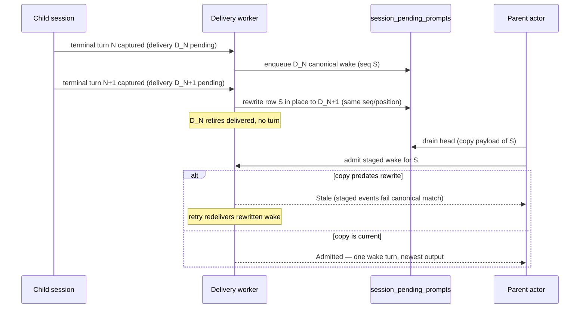

# Subagent wake suppression and coalescing

Description: resolve redundant subagent completion deliveries without a parent wake turn — suppress when the child's own message already reached the parent, coalesce by rewriting the queued wake row in place to the newest completion.
Date: 2026-08-15
Status: approved; shipped in PR #1965 (PRO-287).

## Orientation

Every terminal subagent turn creates a durable completion delivery, and the
delivery worker turns each one into a parent prompt with `SubagentWake`
provenance. Separately, children report results with `send_message`, which
creates an `AgentSession` parent prompt. The parent model pays a full LLM turn
per prompt, so one logical child update ("here is my result" + "I finished")
produced two parent turns, and every terminal follow-up turn on an
already-completed child produced another. In the investigated parent session
(`ce4ad24e`), 17 direct messages plus 17 completion wakes drained into roughly
29 automated parent turns full of "Superseded…" / "No action needed"
acknowledgements.

This decision keeps the durable exactly-once delivery machinery and adds a
semantic layer on top of it: a completion delivery may resolve without its own
parent wake turn when the wake would be redundant.

Goals: eliminate redundant parent turns; keep completion state durable and
visible; keep wake semantics for completions that materially require parent
action. Non-goals: cross-child batching of wakes into one prompt, changing the
`send_message` path (child messages are real content and always surface),
retry-cadence or dead-letter changes, and any wire-contract or schema change.

Requirements (the PRO-287 acceptance criteria):

1. A child that reports completion via `send_message` and then ends does not
   create redundant parent-facing turns.
2. Multiple terminal follow-up turns from the same already-completed child do
   not flood the central transcript, and the parent never drains a wake whose
   output is staler than a newer captured completion.
3. Completion state remains durable and visible in delegated-work/agent UI.
4. Parent wake-up semantics remain available when the completion materially
   requires parent action (failed and cancelled turns always wake).
5. Tests use the real durable prompt/completion path and prove that
   SSE/history replay remains idempotent.
6. Coalesced and suppressed deliveries are observable.

## Current context

One grid cell is touched: the AnyHarness sessions domain
(`anyharness-lib/src/domains/sessions/**`), plus its live actor counterpart.
The primitives involved:

- **Completion delivery outbox** (`store/completion_deliveries*`): one row per
  `(child_session_id, child_turn_id)`, states
  `pending → enqueued → delivered` (or `abandoned`/`failed`), leased by the
  delivery worker, with `enqueue_claimed_canonical` reconciling or creating
  exactly one canonical parent prompt per delivery inside one SQLite
  transaction. Reused and extended; the state machine and schema are
  unchanged (the `state` column carries a CHECK constraint, so new states
  would need a table rebuild — deliberately avoided).
- **Pending prompt queue** (`session_pending_prompts`): the durable queue the
  parent actor drains. The actor holds no in-memory queue copy — it re-peeks
  the table head each drain step — but it does copy a row's payload just
  before admission. Queue visibility events (`pending_prompt_added/removed`)
  are durable session events; a durable row mutation without a matching event
  desynchronizes replayed clients.
- **Wake admission** (`completion_deliveries/admission.rs` +
  `live/sessions/sink/subagent_wakes.rs`): the actor stages the four wake-turn
  events and the store validates them against the delivery resolved from the
  durable row's `prompt_id` (`staged_wake_matches_delivery`) before committing
  the turn, the queue-row delete, and the delivered transition atomically.
  Extended by this decision (one new outcome classification).
- **Completion metadata injection**: on the single `pending → enqueued`
  transition the worker injects one `subagent_turn_completed` event via
  `emit_runtime_event`, which routes through the live actor (the only live
  seq owner) or appends offline. The transcript indexes it for wake receipts
  and roster invalidation; the SDK reducer keys
  `linkCompletionsByCompletionId` off it. Reused as-is; for a suppressed
  delivery it becomes the only parent-transcript record.
- **Prompt provenance**: internal `PromptProvenance` (`agent_session`,
  `subagent_wake`) persisted on queue rows; the public twin persisted inside
  item events. The boundary checker forbids importing wire contract types
  below the API mapper, so domain code probes persisted item payloads with
  untyped JSON (the `persisted_stop_reason` precedent).

## Design

At the single choke point where a claimed delivery would enqueue its canonical
prompt (`enqueue_claimed_canonical`), and only for a **fresh** delivery — one
with no `parent_prompt_seq` and no canonical queue row, so recreate/retry
reconciliation is never affected — two rules apply, in order:

1. **Coalesce (newest wins).** If an older wake for the same
   `(parent, child)` is still enqueued with an unconsumed, canonically
   matching queue row, that row is **rewritten in place** — `prompt_id`,
   `text`, `blocks_json`, `provenance_json` — to carry the fresh delivery's
   canonical prompt, and the older delivery retires to `delivered` with
   `parent_prompt_seq`/`parent_turn_id` NULL. Same seq and queue position, so
   no queue-visibility event is needed: the queued chip renders from the
   provenance label, which is unchanged, and the drain path reads durable
   truth. The parent drains at most one wake per child, always with the
   newest output (requirement 2).
2. **Suppress (redundant with the child's message).** A completed-turn
   delivery resolves terminal `delivered` with no prompt at all when the
   child's own `agent_session` message for that turn already reached the
   parent: either still queued with `queued_at` at or after the child turn's
   `turn_started` timestamp (busy parent), or already executed as a parent
   transcript item with `agentSession` provenance from that child at or after
   the turn start, found by scanning `item_completed` events newest-first and
   stopping at the first event older than the turn start (idle parent). The
   message is the wake (requirement 1). Failed and cancelled turns are never
   suppressed (requirement 4).

Either way the worker still injects the completion metadata event and the
completion ledger row persists, so delegated-work surfaces stay current
(requirement 3), and it logs the decision (requirement 6).

Assumptions: child turns are serial, so a fresh delivery is always for a later
turn than any enqueued sibling (a `created_at` guard defends imports anyway);
timestamps across sessions come from the same process clock; the worker
processes claims serially, and every queue/outbox mutation shares one SQLite
transaction with the actor's admission serialized against it.

The known race is accepted and handled: the actor may copy the old payload
just before the rewrite commits. Admission validates staged events against
the delivery resolved from the durable row, so the stale copy cannot execute;
it now classifies as `Stale` (previously the forged-row `Err` path), the
drain skips quietly, and the enqueued delivery's retry redelivers.

Cons accepted: when an old wake is already queued and the newest turn also
messaged, the parent sees the message turn plus one coalesced wake turn (two
turns, not one) — coalescing takes precedence over suppression because
retiring a queued wake with nothing to rewrite it to would need a durable
removal event from the worker, which it cannot emit transactionally.

Alternatives rejected:

- **Suppress the newer delivery, keep the older queued wake** (oldest wins):
  no queue mutation, but the parent drains stale output and the newest result
  never surfaces in a prompt — the exact flaw review caught.
- **Delete the older queued row and enqueue the newer wake**: correct output,
  but a durable delete needs a durable `pending_prompt_removed` event or
  replayed clients resurrect the chip forever, and the worker cannot append
  parent events inside its own transaction while a live actor owns the seq.
  In-place rewrite avoids the problem instead of patching it.
- **Discard at admission (drain time) instead of enqueue time**: the child's
  message has usually already been consumed by then, so detecting redundancy
  requires the same backward-looking evidence with none of the transactional
  convenience, and each discarded wake still burns a drain cycle.
- **Defer the newer delivery until the older wake is consumed**: keeps every
  wake but recreates the retry churn PRO-287 documented (deliveries retried
  100+ times) and still drains one turn per completion.
- **New `suppressed`/`coalesced` outbox states**: honest bookkeeping, but the
  `state` CHECK constraint makes it a table rebuild; terminal `delivered`
  with NULL prompt/turn plus tracing carries the same information.

No open decisions.

## New and modified primitives

AnyHarness sessions domain only:

- `enqueue/coalescing.rs` (new): `adopt_superseded_sibling_wake` (in-place
  rewrite + sibling retirement + projection null-out) and
  `wake_is_redundant_with_child_message` (turn-window message detection,
  untyped-JSON provenance probe).
- `ClaimedDeliveryEnqueueOutcome`: `Enqueued` gains
  `superseded_delivery_id: Option<String>`; new terminal-without-prompt
  variant `Suppressed { delivery }`.
- `admission.rs`: staged-events-vs-delivery mismatch on a canonically matching
  row returns `Stale` instead of an integrity error.
- Delivery worker: handles `Suppressed` (best-effort completion-event
  injection) and logs both resolutions.
- `canonical.rs`: `pending_prompt_agent_session_source` helper.

No schema, endpoint, contract, or frontend changes; no new cross-cell access.

## Flows

Happy path, message-then-finish (busy or idle parent): child sends
`send_message` during turn T → `AgentSession` prompt queued (or executed
immediately) → turn T ends, delivery captured → worker claims, finds the
message queued/executed at or after T's start → delivery goes `delivered`
with no prompt, completion event injected → parent processes exactly the
message turn.

Failure path: turn T fails → suppression and coalescing rules are checked but
suppression is outcome-gated → the failure wake enqueues and drains as its own
turn.

Retry/recovery: a delivery that ever reached the queue reconciles through the
legacy exactly-once path (recreate on deleted row, `AlreadyVisible` on a
committed turn); suppressed and retired deliveries are terminal and never
re-claimed; the stale-copy race resolves to `Stale` plus redelivery.

## Failure modes, tests, observability

- Stale queued wake drained after a newer completion — prevented by the
  in-place rewrite; tier-1 store test
  `newer_wake_takes_over_the_queued_row_of_an_unconsumed_older_wake`.
- Suppression firing on stale or unrelated messages — turn-window bound
  (`queued_at`/item timestamp vs `turn_started`); tier-1
  `message_queued_before_the_terminal_turn_does_not_suppress`; a missing
  turn-started event disables suppression entirely (fail open to a wake).
- Material completions silenced — outcome gate; tier-1
  `failed_wake_is_never_suppressed`.
- Exactly-once regression on retry — freshness gate; tier-1
  `previously_enqueued_delivery_is_recreated_not_suppressed` plus the existing
  reconciliation suite.
- Actor executes a stale payload copy — admission canonical validation; tier-1
  `stale_actor_copy_of_a_rewritten_wake_is_skipped_then_redelivered`.
- Delegated-work UI losing completion state — completion event still injected
  once; tier-2 worker test
  `suppressed_completion_injects_metadata_without_a_wake_prompt` also proves
  recovery replay injects no duplicates and re-claims nothing.

Runtime observability: `anyharness.subagent.delivery_suppressed` with
`result_class = "suppressed"` and `reason = "coalesced" |
"redundant_child_message"`, ids only. No cloud alerting: this is
local-runtime behavior with no hosted failure surface.

## High level sequencing

Single-PR ladder: PR #1965 (`fix(anyharness): suppress redundant subagent
completion wakes`), no flag — the enqueue-time rules are the new default, and
reverting the PR restores one-wake-per-terminal-turn with no data migration
(suppressed rows are ordinary terminal `delivered` rows). Canonical docs
updated in the same PR: `specs/anyharness/sessions.md` (Workspace MCP And
Completion Delivery, Parent Wake).

## Appendix

- PRO-287 — Sub-agent updates flood the parent transcript with redundant
  turns (ticket; contains the `ce4ad24e` session evidence).
- PR #1965, including the two review findings that shaped the design
  (stale-output coalescing, stale-copy race).
- [`specs/anyharness/sessions.md`](../specs/anyharness/sessions.md) — the
  canonical description of the shipped behavior.
