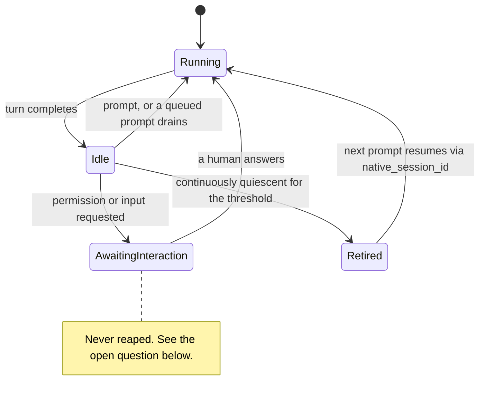

# Delivery Specification: Idle Session Reaper (local runtime)

Status: frozen delivery specification, founder-approved intent for one PR.
Original: 2026-08-15, drafted from an estimate on Pablo's laptop.
Revised: 2026-08-21, after the controlled fleet load measurement and a revised founder ruling on the threshold. Founder: Pablo.

## Problem

The local runtime keeps every agent session process alive forever once started. Sessions enter `SessionExecutionPhase::Idle` and stay in the manager's `live_sessions` map until something explicitly closes them. Nothing ever does.

The 2026-08-15 draft of this specification rested on a rough observation from Pablo's 18-core / 24GB laptop: nineteen idle agents holding roughly 2 GB total, which was the margin that pushed the machine into memory-pressure level 2 with 7.0 of 8.0 GB swap used. That estimate has been superseded by a controlled measurement and is retained here only as the origin of the request.

### What the measurement says

Source: `Fleet load model results 2026-08-21`, a controlled run on an `m8g.4xlarge` (16 vCPU, 64GB, aarch64, Ubuntu 24.04), five profiles, forty-five live Bedrock-backed sessions, PSS read from `/proc/<pid>/smaps_rollup` over each profile's cgroup process tree.

Three findings bear directly on this design.

**A session costs 207 MB, every time.** The per-session marginal cost is a straight line with no knee from the second session to the fifteenth, on one profile and on five. Three independent cold-boot runs agree to 3.3 MB at n=15, which is 0.09%. The robust figure is the endpoint-to-endpoint slope, `(3707.5 - 813.4) / 14 = 206.7 MB per session`. Each session adds exactly two processes at every N with no exceptions. The cost is almost entirely the vendor agent: at fifteen sessions the `claude` CLIs are 64% of a profile and the ACP adapters are 22%, while everything Proliferate wrote is 3%.

**A session that has run one turn holds 33 MB more, permanently.** Six matched sessions, one real turn each, sampled at fixed offsets out to 900 seconds after the turns ended:

| Phase | PSS | Delta from idle | Per session |
| --- | --- | --- | --- |
| 6 sessions idle, never prompted | 1,854.7 MB | | |
| peak, t+10s | 2,085.2 MB | +230.5 MB | +38.4 MB |
| t+15s after last turn | 2,047.0 MB | +192.3 MB | +32.1 MB |
| t+300s | 2,054.0 MB | +199.3 MB | +33.2 MB |
| t+900s | 2,052.6 MB | +197.9 MB | +33.0 MB |

The decay curve is not slow, it is absent. 86% of the peak growth is still resident a quarter of an hour after the work finished, and the last 600 seconds of the curve move by 0.3 MB, which is noise. 91% of the retention sits inside the vendor CLI, holding the conversation, the tool results, and the file contents it read. Nothing in that list is memory Proliferate can free without ending the process.

**Therefore there is nothing to wait for.** Waiting reclaims exactly zero. The reaper is the only reclaim mechanism this runtime has, and reaping recovers the whole session, not the 33 MB increment: 207 MB of baseline plus 33 MB of retained conversation, so about 240 MB per reaped session that has done any work.

## Founder rulings (do not relitigate)

1. Reap aggressively. Threshold ruled **"a minute or 2"** on 2026-08-21, superseding the 5 minutes in the 2026-08-15 draft. Resume latency is explicitly deprioritized: "we don't care if it is a little slower to resume an agent, it matters way more that machines don't get / feel slow."
2. Applies to all idle workspace sessions, where idle means no running turn, no background work, and sitting in the idle loop.
3. Resume is the existing built-in path. No new resume UX is in scope.
4. Never reap `AwaitingInteraction`.

## The threshold is a user-experience choice, not a tradeoff

This is the strongest argument for the shorter threshold and it replaces guesswork with measurement.

Because the post-turn curve is flat from t+15s onward, a 60-second threshold and a 900-second threshold reclaim the identical amount of memory. There is no memory-versus-latency frontier to sit on, because delay buys nothing back. The only thing a longer threshold buys is a lower chance that a user who steps away for a moment comes back to a session that has to cold start. The only thing a shorter threshold buys is that the reclaim happens sooner in wall-clock terms, which matters when a burst of sessions is created and abandoned quickly.

**Default: 120 seconds.** It is the top of the founder's ruled range, so it is the least user-hostile point inside the ruling, and picking it costs nothing in memory relative to 60 seconds. Configurable through `ANYHARNESS_IDLE_SESSION_REAP_SECONDS` in whole seconds. `0` disables the reaper. An unparseable value keeps the default rather than silently turning a memory-reclaim feature off.

## Intended behavior

A reaper in the session plane retires any live session that has been continuously quiescent for the threshold.

Quiescence predicate, all of which must hold:

- `SessionExecutionPhase::Idle`
- no pending interactions on the live snapshot
- the handle's busy flag is clear
- zero pending durable background-work rows for the session
- the durable pending-prompt queue for the session is empty
- no pending wake schedule on a link this session parents whose delivery needs a live parent handle
- a cold start of this session would resolve to a launch strategy

Never reaped: `Starting`, `Running`, `Errored`, `Closed`, and `AwaitingInteraction`. A durable read that fails yields `Undetermined`, which is treated as not reapable. The reaper fails closed on missing evidence.

Retirement is the existing graceful non-terminal `Unload` disposition, not SIGSTOP and not a terminal close. The durable session row, its transcript, its configuration, and its `native_session_id` all survive. Resume happens through the ordinary startup strategy matrix on the next prompt.

The command the reaper sends is `SessionCommand::UnloadIfIdle`, not `Unload`. A sweep verdict is an outside observation that is already stale when the command is delivered, and `Unload` is not advisory: mid-turn it sends `CancelNotification` and resolves pending interactions `Cancelled`, and the idle loop's biased select puts commands ahead of the durable queue drain. So the actor re-evaluates the condition serially on its own loop, where the durable queue head, the busy flag, the pending interactions and the rest of the mailbox are all authoritative, and refuses the reap if anything arrived in between. The refusal reason is a bounded class (`active_turn`, `busy`, `pending_interaction`, `queued_prompt`, `mailbox_not_empty`, `replay_session`) and it resets the idle clock.

Residual window, stated exactly: between the actor answering `Unloading` and its handle leaving the live map, a caller that already fetched the handle can still send into a closing mailbox and get `ResponseDropped`. That window is not introduced by the reaper - it is the same window every `unload_live_session_nonterminal` caller has always had - and closing it needs the handle lookup and the send to be atomic with respect to actor retirement, which is a manager-wide change and out of scope here.

The actor's exit sequence signals the agent's process GROUP on every exit, not only on `Stop`. `kill_on_drop` is the crash backstop for the direct child only, and the direct child is the ACP adapter: the measurement below puts 64% of a session's memory in the vendor CLI it spawns, which is a grandchild. A reap that dropped only the child would leave the expensive half of the session resident, which is a leak plus a cold start rather than a reclaim. `kill_group_and_await` returns immediately on an empty group and exits its grace as soon as the group honors the TERM, so an ordinary exit pays milliseconds for this. A child that is not its own group leader gets the direct SIGKILL `kill_on_drop` would have delivered instead of a group signal, because a group kill aimed at a non-leader pid signals nothing and the reap would then wait out its whole budget for a process nobody told to die.

The idle clock is the reaper's own observation ledger, held in the sweep task rather than on the handle. Each sweep records the first tick at which a session was seen quiescent, keyed by the live snapshot's `updated_at` activity marker. Any non-quiescent observation drops the record, and a changed activity marker restarts it, so what is measured is continuous idleness rather than cumulative idleness. Sweep cadence is `min(threshold / 4, 15s)`, which bounds how much later than the threshold a reap can land.

### Correction to the frozen draft

The 2026-08-15 draft said resume uses `SessionStartupStrategy::ResumeSeqFreshNative`. That is right only for a session that has never run a turn. For a Claude session with a recorded `native_session_id` and a `last_prompt_at` (the ordinary case for anything worth reaping), `choose_startup_strategy` selects `LoadNative(native_session_id)`, which is the stronger of the two: it reloads the native conversation rather than replaying the event sequence into a fresh one. Either way the `native_session_id` is preserved and used, so the draft's intent holds and only its naming was wrong.

## Resolved implementer verification items

The frozen draft flagged three items to confirm in code rather than assume. All three are resolved, and review added a fourth.

**Wake schedules survive reaping, but only ONE relation's delivery survives a reaped parent.** Corrected 2026-08-21 after review; the original text below the correction was wrong about which subsystem delivers a cowork wake.

A wake schedule is a durable row in `session_link_wake_schedules`, keyed by session link, and actor retirement does not touch it. When the child finishes, `LinkCompletionStore::insert_completion_and_consume_schedule` consumes the schedule and inserts the parent's wake prompt into `session_pending_prompts` inside one store transaction with no live parent involved. What happens next depends entirely on the relation:

- **`subagent`.** `persist_terminal_turn_in_tx` writes a `session_link_completion_deliveries` row (`WHERE relation = 'subagent'`), and `CompletionDeliveryWorker` claims it on a one-second lease cadence and calls `SessionRuntime::activate_durable_prompt_consumer`, which cold starts the parent through `ensure_live_session_handle`. A reaped parent is woken. This is the path the original text described.
- **`cowork_coding_session`.** No outbox row is ever written for this relation. Its one production caller is `deliver_cowork_coding_completion`, which sends the wake with `acp_manager.get_handle(&link.parent_session_id)` and skips the send silently when that returns `None`. Nothing scans for stranded pending prompts. A reaped parent's wake therefore sits in `session_pending_prompts` until a human next opens or prompts the session, which may be never.

The fix is in the predicate rather than in a new drainer: a session that parents a link with a pending wake schedule on any relation other than `subagent` is not reapable. Unknown future relations are held back by the same test, which is the fail-safe direction. Once the wake prompt row exists the durable-queue check takes over.

The mandatory acceptance test is split to match the truth: `a_cowork_parent_expecting_a_wake_is_not_reaped` (held back, verdict `PendingWake`, reapable again once the wake is delivered and drained) and `a_subagent_parent_is_reapable_and_its_wake_still_becomes_a_durable_prompt` (reaped, schedule intact, completion still produces the parent's durable wake prompt with no live parent). Neither test demonstrates the delivery worker's cold start, which belongs to the worker's own suite; the assertions stop at the durable facts this PR owns.

**Durable prompt-queue emptiness.** The check is `QueueDurable::list_pending_prompts(session_id)`, read through the manager's existing `ActorCapabilities`. This is the same rowset the actor's own queue drain reads, so a queued prompt cannot be dropped by retirement: retirement is refused while any row exists.

**Relaunchability after a reap.** Added 2026-08-21 after review. Retirement is only non-terminal for a session the startup matrix will take back, and one shape it refuses is fully quiescent from birth: a process-local (Claude) zero-turn fork child is inserted with `last_prompt_at: None` (`runtime/fork/mod.rs`), finalizes to `Idle`, and `choose_fork_child_strategy` bails with "process-local zero-turn fork recovery requires an exact-prefix recovery proof". Before this PR that state was only reachable after a process restart; a two-minute timer would have made it routine and permanent. The predicate therefore asks the launch policy itself - `choose_session_startup_strategy` against the same durable rows the next prompt will read - and refuses to reap anything it errors for. Keying on the policy rather than on "is it a Claude fork child" means the carve-out cannot drift from the policy: a zero-turn NON-fork session still resolves to `ResumeSeqFreshNative` and stays reapable, pinned by `a_zero_turn_session_that_is_not_a_fork_child_is_still_reaped`.

**Subagent orphaning.** Delegated subagent sessions are ordinary sessions in the same `live_sessions` map, and the parent/child relationship is durable in `session_links` rather than held by the parent's actor. Reaping a parent therefore cannot orphan a live child: the child keeps running, records its completion durably, and wakes the parent by the path above. A child that is itself idle is reaped on its own merits. No special casing is required and this PR does not add any.

## The `AwaitingInteraction` question

The same measured run surfaced a case the frozen draft does not answer. One of six turns stopped in `awaiting_interaction`: the profile's mode was Manual, the prompt asked the agent to use its tools, and nobody answered the resulting permission request. That session's turn never finished, and it held its full memory cost for the remaining fifteen minutes of the run.

The founder ruling that `AwaitingInteraction` is never reaped is correct for a user who is about to answer. For a prompt nobody will ever answer, which is exactly what an abandoned session looks like, it is a permanent leak. A fleet driven by automation against a Manual-mode profile will silently accumulate these.

**Ruling for this PR: out of scope, and here is why.** Retiring an `AwaitingInteraction` session is not the same operation as retiring an idle one. The `Unload` path resolves every pending interaction as `Cancelled`, which aborts an in-flight turn and discards the work it had done. Retiring a session that finished its turn costs a cold start; retiring one parked mid-turn costs the turn. Those are different user-visible prices, they deserve a different threshold, and raising that threshold means overriding an explicit founder ruling, which is not an implementer's call to make.

What this PR does instead is make the leak measurable rather than invisible. Every sweep counts the sessions held back solely because a human has not answered, and emits it as `result_class = "awaiting_interaction_held"`. A follow-up can then be argued from data rather than from one anecdote.

**Proposed follow-up, requiring a founder ruling before it is built:** a second, much longer `AwaitingInteraction` threshold, on the order of tens of minutes to hours, defaulting to disabled. `IdleReapPolicy` is deliberately shaped so this arrives as an extra field and a second clock in the existing ledger, not as a redesign.

## Out of scope

- Cloud and sandbox session culling, owned by the Cloud Culling program.
- Any UI treatment of retired sessions. Retired-and-resumable should look identical to idle does today.
- SIGSTOP-style suspension.
- Reaping `AwaitingInteraction`, per the ruling above.
- Any change to the resume path itself.

## Observability

Per `specs/OBSERVABILITY.md`. All fields are ids, durations, and bounded classes; no prompts, no paths, no values.

| Event | Fields |
| --- | --- |
| `idle_reaper_started` / `idle_reaper_disabled` | threshold seconds, sweep interval seconds |
| reap succeeded, `result_class = "reaped"` | session id, idle seconds, threshold seconds |
| reap failed, `result_class = "reap_failed"` | session id, idle seconds, `failure_code = "nonterminal_unload_failed"`, error |
| clock reset, debug | session id, blocking verdict as a bounded string |
| reap refused by the actor, `result_class = "reap_retained"` | session id, idle seconds, refusal reason as a bounded string |
| `result_class = "awaiting_interaction_held"`, debug | count held on THIS sweep |
| `result_class = "background_work_held"`, debug | count held on THIS sweep |
| threshold override ignored | `failure_code = "idle_reap_threshold_unparseable"` |

Both `_held` counters are per-sweep gauges, not cumulative totals: a session that nobody ever answers is counted again on every sweep for as long as it is held. That is the intended shape for the follow-up argument, since the quantity of interest is "how many sessions are stuck right now", but it means the numbers must be read as a gauge and not summed over time.

Only one `_held` counter fires per held session per sweep, because the predicate short-circuits in a fixed order and `AwaitingInteraction` is tested first. A session that is both awaiting a human and holding a background-work tracker is counted as `awaiting_interaction_held` only. The order is deliberate and is not going to change: the founder ruling makes `AwaitingInteraction` the never-reap case, so it must be the first thing the predicate proves.

## Testing

Per `specs/TESTING.md`. Tier 2, in `live/sessions/manager/reaper/tests.rs`, against a real in-memory `SessionStore` and the real `unload_session_if_still_idle` path, whose actors are scripted mailbox consumers rather than real ones.

- A continuously idle session is reaped once the threshold passes, and not one second before.
- An `AwaitingInteraction` session is never reaped, at any elapsed time, and is counted as held.
- A session with a non-empty durable prompt queue is not reaped.
- A session with a pending background-work tracker is not reaped, and the same session becomes reapable once the tracker goes terminal.
- A busy handle is not reaped.
- A `Running` session is not reaped.
- Activity between sweeps restarts the continuous-idleness clock, and the restarted clock still runs out.
- A reaped session's durable row is untouched: `native_session_id`, `last_prompt_at`, `status = "idle"`, no `closed_at`, no `dismissed_at`. That is exactly the shape `choose_session_startup_strategy` turns into `LoadNative(native_session_id)`, pinned by the existing `choose_startup_strategy_loads_claude_when_last_prompt_was_recorded`.
- A `subagent` parent is reapable, its wake schedule survives, and the child's completion still turns into the parent's durable wake prompt with no live parent.
- A `cowork_coding_session` parent with a pending wake schedule is NOT reaped, and becomes reapable once that wake has been delivered and drained.
- A process-local zero-turn fork child is never reaped, and the same session becomes reapable the moment it has a `last_prompt_at`.
- A zero-turn session that is not a fork child is still reaped.
- A durable read that fails makes the session `Undetermined`, which is never reaped.
- An actor that refuses the conditional unload keeps its session, and the refusal resets the idle clock.
- The env contract: absent keeps the default, unparseable keeps the default, `0` disables.
- The spawned sweep loop reaps on its own cadence.
- A zero threshold disables the reaper entirely.

Tier 2 store-backed tests cannot prove what happens to the agent's processes or to the durable status, because their actors are scripted consumers rather than real ones. Three tests in `live/sessions/actor/tests/idle_reap.rs` therefore drive a REAL `SessionActor` over a real ACP duplex against a real spawned process tree:

- A conditional unload kills the agent's whole process group, including a grandchild that outlives its parent's stdin, and the durable status transitions from `running` to `idle` with `native_session_id` intact.
- A prompt queued behind the reap wins: the prompt is answered by the still-live actor and the session is kept.
- A mid-turn reap is refused without cancelling the turn, and no ACP `session/cancel` is sent.

Every one of these carries a negative control: the mechanism is mutated behaviourally with all signatures intact, the test is observed failing, the mutation is reverted, and the test is observed passing. Compile failures do not count.

## Acceptance

- One reviewable PR against `main`, labels per repo convention: one `release:*` plus every applicable `area:*`.
- Current documentation updated in the same PR: `specs/anyharness/acp.md` and `specs/developing/reference/env-vars.yaml`.
- Live check on a dev machine: start several sessions, let them complete, observe the agent processes exit about two minutes later, then resume one by prompting it and confirm the conversation continues.
- No merge without Pablo's review.
