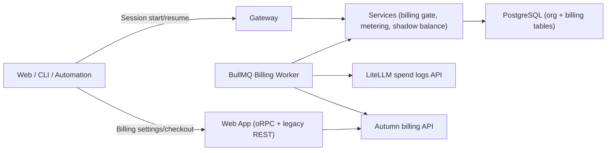
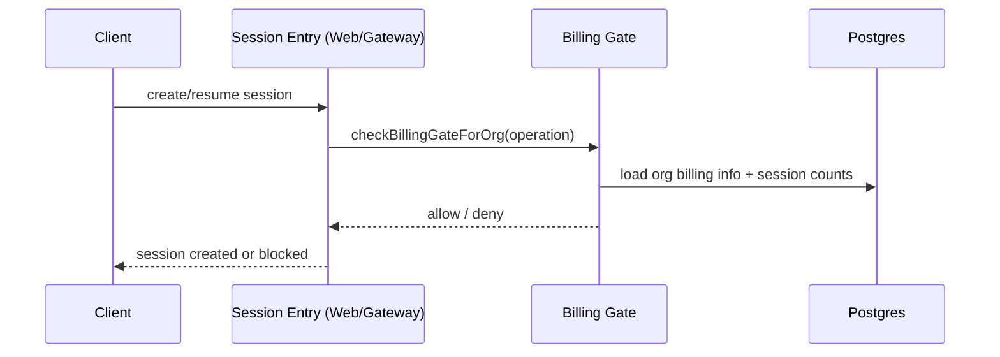

# Billing Alignment Remediation — Advisor Spec

Status: Draft for advisor review  
Date: 2026-02-19  
Audience: Technical advisor without repository access  
Primary system spec this extends: `docs/specs/billing-metering.md`

---

## 1) Why This Document Exists

This document gives complete context for a full billing alignment effort:

1. How billing works today end-to-end.
2. What is correct vs what is drifted or partially implemented.
3. What should be fixed, in what order, and with what acceptance criteria.
4. Where advisor input is needed for architecture and risk tradeoffs.

The goal is to let an external technical advisor critique the plan and help de-risk implementation without needing direct codebase access.

---

## 2) Executive Summary

Billing is structurally solid in core areas:

1. Shadow-balance deductions are atomic and idempotent.
2. Session start/resume gating is enforced in all billable admission paths.
3. Compute and LLM usage both flow into a single local ledger, then to Autumn asynchronously.
4. Enforcement is pause/snapshot-first (resumable), not destructive termination.

But there are alignment gaps:

1. Duplicate billing API surfaces exist (oRPC + legacy REST routes), and they already diverge.
2. Overage settings exist in UI/schema but are not operationally enforced/reset.
3. Contract/type drift exists (`billing_events.status="skipped"` in runtime, but shared status types omit `skipped`).
4. Some documented subsystems are stale (billing-token section references removed code).
5. Reconciliation is nightly-only for full sync; same-day drift can persist.
6. Event storage has no archival/retention strategy.

Revised implementation order (advisor-incorporated):

1. Phase 1.1: Stabilize and clean (`A + C`).
2. Phase 1.2: Introduce new financial logic (`B + D` together).
3. Phase 2: Scale and defend (`E + F` plus remaining reconciliation hardening).

---

## 3) Current Billing System (As Implemented)

### 3.1 Core Architecture

Key boundary:

1. Session hot path does not call Autumn.
2. Session hot path relies on local org state + shadow balance.
3. Autumn interaction happens in outbox/reconcile/checkout style flows.

### 3.2 Credit Economics

1. 1 credit = $0.01.
2. Compute rate = 1 credit / minute of sandbox uptime.
3. LLM rate = (`response_cost_usd` * 3x markup) / $0.01.
4. Trial = 1,000 credits.
5. Top-up product = 500 credits for $5.

Plans:

1. Dev = $20/month, 1,000 included credits, 10 max concurrent sessions, 5 snapshots.
2. Pro = $500/month, 7,500 included credits, 100 max concurrent sessions, 200 snapshots.

### 3.3 Billing State Machine

States:

1. `unconfigured`
2. `trial`
3. `active`
4. `grace`
5. `exhausted`
6. `suspended`

Important semantics:

1. `trial -> exhausted` is direct on depletion (no grace for trial).
2. `active -> grace` on depletion; grace window defaults to 5 minutes.
3. `grace -> exhausted` on expiry or overdraft cap breach.
4. `exhausted/suspended` enforcement path pauses and snapshots running sessions.

### 3.4 Data Model

Primary tables:

1. `billing_events`:
   - Immutable usage ledger + outbox.
   - Unique `idempotency_key`.
   - Status values used in runtime: `pending`, `posted`, `failed`, `skipped`.
2. `llm_spend_cursors`:
   - Per-org ingestion cursor for LiteLLM spend sync.
3. `billing_reconciliations`:
   - Audit trail for balance corrections and adjustments.

Org-level billing columns:

1. `billing_state`
2. `shadow_balance`
3. `shadow_balance_updated_at`
4. `grace_entered_at`
5. `grace_expires_at`
6. `billing_plan`
7. `billing_settings` (JSON with overage policy/cap/used-this-month)
8. `autumn_customer_id`

### 3.5 Operational Flows

#### Flow A: Session Start/Resume Gate

Behavior:

1. Start operations (`session_start`, `automation_trigger`) enforce minimum 11 credits and concurrent session limit.
2. Resume operations (`session_resume`, `cli_connect`) skip minimum-credit and concurrency checks, but still enforce blocked states.
3. Concurrent admission is re-checked atomically at insert time via `pg_advisory_xact_lock`.

#### Flow B: Compute Metering

1. Worker runs every 30 seconds.
2. Reads running sessions.
3. Checks sandbox liveness (dead after 3 consecutive failures).
4. Bills elapsed interval via `deductShadowBalance()` using deterministic idempotency keys.
5. On dead sandbox, bills final bounded interval and pauses session.
6. On enforcement signal, pauses/snapshots all org sessions.

#### Flow C: LLM Spend Sync

1. Dispatcher runs every 30 seconds and fans out per-org jobs.
2. Each org job reads cursor (or 5-minute bootstrap lookback).
3. Pulls spend logs from LiteLLM `/spend/logs/v2`.
4. Converts spend to credits and bulk-deducts in one DB transaction.
5. Advances cursor.

#### Flow D: Outbox to Autumn

1. Worker runs every 60 seconds.
2. Processes pending/failed ledger events below retry limit.
3. Posts to Autumn with idempotency key.
4. Marks posted or retries with exponential backoff.
5. Permanently failed events emit alert logs.

#### Flow E: Reconciliation

1. Nightly at 00:00 UTC.
2. Loads billable orgs with Autumn customer IDs.
3. Fetches Autumn balance and reconciles local shadow balance.
4. Logs drift alerts above threshold.

#### Flow F: Snapshot Cleanup

1. Daily at 01:00 UTC.
2. Evicts expired snapshots, bounded per cycle.
3. Provider deletion hook exists but is currently a no-op (provider-side TTL assumed).

### 3.6 Worker Schedule and Concurrency

1. `billing-metering`: 30s, concurrency 1.
2. `billing-outbox`: 60s, concurrency 1.
3. `billing-grace`: 60s, concurrency 1.
4. `billing-reconcile`: daily 00:00 UTC, concurrency 1.
5. `billing-llm-sync-dispatch`: 30s, concurrency 1.
6. `billing-llm-sync-org`: on-demand, concurrency 5.
7. `billing-snapshot-cleanup`: daily 01:00 UTC, concurrency 1.

---

## 4) Verified Findings (Current Problems)

This section is from direct verification against current behavior, not assumptions.

### 4.1 P0/P1 Findings Matrix

| ID | Finding | Severity | User/Business Impact | Why It Matters |
|---|---|---|---|---|
| F1 | Duplicate billing API surfaces (oRPC + legacy REST) | P0 | Inconsistent billing behavior depending on entry point | Drift already exists and will worsen |
| F2 | API divergence in buy-credits behavior | P0 | Potential shadow-balance desync when legacy route is used | One surface updates shadow in immediate-charge path, another does not |
| F3 | Overage policy UI/settings are mostly non-operational | P0 | Users can configure behavior that is not actually enforced as advertised | Product contract mismatch |
| F4 | No visible monthly reset mechanism for `overage_used_this_month_cents` | P0 | Cap display/logic cannot be trusted over time | Billing correctness and trust issue |
| F5 | Shared `BillingEventStatus` omits `skipped`, runtime writes `skipped` | P0 | Type-level falsehood; future regressions likely | Contract drift |
| F6 | `shouldTerminateSessions` naming contradicts real behavior | P1 | Maintainer confusion, wrong assumptions in future changes | Semantics drift |
| F7 | Stale billing-token references in spec/docs/schema | P1 | Architectural confusion, wrong remediation effort | Technical debt + onboarding drag |
| F8 | LLM allowlist/cost-floor constants are currently unused | P1 | False sense of protection; unclear model policy | Security/cost-policy ambiguity |
| F9 | Full reconcile is nightly; no event-driven correction layer | P1 | Same-day drift can persist | Temporary gating inaccuracies possible |
| F10 | No ledger archival/retention strategy for `billing_events` | P1 | Table growth risk, slower queries/ops over time | Scalability risk |
| F11 | Snapshot provider delete hook is no-op | P2 | Potential hidden provider cost if TTL assumptions change | External dependency risk |
| F12 | Legacy docs/comments contain outdated pricing details | P2 | Advisor/operator confusion | Process hygiene issue |

### 4.2 Notable Divergence Examples

1. Top-up pricing source of truth is 500 credits / $5, but one legacy route still documents $20 / 2,000 in comments.
2. UI and hooks use oRPC billing router, but legacy `/api/billing/*` routes still implement separate logic.
3. Runtime inserts `billing_events.status = "skipped"` for trial/unconfigured, but shared status union excludes `skipped`.

---

## 5) Root Cause Analysis

1. Partial migration from legacy REST routes to oRPC left dual active paths.
2. Overage controls were added to settings/UI before backend policy engine implementation.
3. Billing v2 rollout improved core correctness but left stale docs/types and some dead constants.
4. Long-term data lifecycle and reconciliation hardening were deferred in favor of shipping core metering/gating first.

---

## 6) Target State (What “Aligned” Means)

### 6.1 Product and Policy Outcomes

1. One billing API contract.
2. Overage behavior is explicit, implemented, observable, and test-covered.
3. Local/remote balance divergence is corrected quickly when high-risk events occur.
4. Ledger storage is bounded without losing auditability.
5. No stale subsystem references in specs/types.

### 6.2 Engineering Principles to Preserve

1. No Autumn calls in session create/resume hot path.
2. Atomic shadow deduction + ledger insert is non-negotiable.
3. Idempotency keys remain deterministic.
4. Enforcement remains pause/snapshot-first for resumability.
5. Fail-closed remains default for uncertain billing state.

---

## 7) Revised Remediation Plan (Advisor-Incorporated)

### 7.1 Workstream A — Consolidate API Surface (P0, Phase 1.1)

Scope:

1. Make oRPC billing router the authoritative product API.
2. Convert legacy `/api/billing/*` endpoints into thin adapters that delegate into the same service-layer methods as oRPC.
3. Add deprecation signaling (headers and logs), then remove legacy routes after a defined window.

Acceptance criteria:

1. No duplicated billing business logic across API surfaces.
2. Frontend traffic uses oRPC-only billing hooks.
3. Adapter responses are contract-equivalent and drift-free during deprecation.

### 7.2 Workstream C — Contract and Type Cleanup (P0, Phase 1.1)

Scope:

1. Rename pause-enforcement result fields to reflect behavior (for example, replace `shouldTerminateSessions` with pause-first naming).
2. Remove stale billing-token references from specs/contracts/comments; deprecate dead schema fields (including `billing_token_version`) via migration plan.
3. Correct stale route comments/pricing references.
4. Resolve `skipped`-status drift by changing behavior: do not persist no-op/skipped ledger rows; short-circuit trial/unconfigured outbox paths in memory.

Acceptance criteria:

1. Shared contracts match runtime behavior.
2. No references to removed billing-token modules/endpoints remain in billing specs.
3. `billing_events` contains only financially meaningful rows.

### 7.3 Workstream B — Implement Overage Policy End-to-End (P0, Phase 1.2)

Ruling adopted:

1. Overage model = auto-top-up increments (prepaid continuity), not postpaid debt.

Scope:

1. Implement real overage logic for `overage_policy = allow`.
2. Move overage accounting out of `billing_settings` JSON and into first-class columns.
3. Use lazy cycle rollover, not global reset cron:
   - store `overage_cycle_month`
   - reset `overage_used_this_month_cents` opportunistically on first write in a new cycle
4. Implement cap enforcement linked to gating/enforcement state machine.

Mandatory safety guardrails:

1. Card-decline circuit breaker:
   - on terminal decline, stop retry loop
   - force policy fallback to `pause`
   - transition to blocked/exhausted path immediately
2. Velocity cap:
   - enforce max top-ups per rolling window (daily and per billing cycle)
   - emit fraud-risk alerts before hard fail thresholds
3. Deficit-aware block sizing:
   - when balance underflows due to burst LLM spend, purchase enough blocks to clear deficit + floor buffer (subject to velocity/cap limits)

Acceptance criteria:

1. Overage behavior is deterministic under success and failure paths.
2. UI overage values reflect operational counters, not static settings blobs.
3. No infinite retry loops on declined payment instruments.

### 7.4 Workstream D — Fast Reconciliation and Unblock Path (P0/P1, Phase 1.2 + Phase 2)

Rationale:

1. Overage auto-top-up cannot wait for nightly reconcile.

Scope:

1. Keep nightly full reconcile as backstop.
2. Add event-driven fast-reconcile triggers for:
   - successful top-up/plan attach
   - Autumn denial responses
   - outbox backlog and permanent-failure thresholds
3. Add per-org reconcile freshness tracking (`reconcile_age_seconds`) and drift-age alerting.

Target SLO:

1. Payment event unblocking in under 5 minutes.
2. Minor compute drift tolerated up to nightly 24-hour sweep.

Acceptance criteria:

1. Credits added via payment become usable without waiting for nightly job.
2. Drift alerts include absolute drift and staleness age.

### 7.5 Workstream E — Ledger Retention and Archival (P1, Phase 2)

Ruling adopted:

1. 90 days hot retention baseline.

Scope:

1. Partition `billing_events` by month in Postgres.
2. Archive by detaching partitions older than hot window.
3. Keep pending/failed rows in hot storage until terminal resolution.

Acceptance criteria:

1. Hot-table growth remains bounded and queryable.
2. Archive operations do not require application-level ETL workers.

### 7.6 Workstream F — LLM Billing Policy Clarification (P1, Phase 2)

Ruling adopted:

1. Remove billing-layer model allowlist/cost-floor checks from deduction path.
2. Bill any spend log emitted by LiteLLM.
3. Replace dead constants with anomaly monitoring:
   - zero-dollar spend with non-zero tokens
   - unknown model spikes

Acceptance criteria:

1. No dead “safety” constants in billing path.
2. Unknown-model behavior is explicit and observable.

### 7.7 Cross-Cutting Coupling Risk Closures (P0/P1)

1. Snapshot quota contradiction closure:
   - if pause/snapshot enforcement cannot persist a snapshot, fail closed by terminating the runtime and marking the session non-running with explicit reason.
2. Resume gate loophole closure:
   - atomic resume path must check balance-derived condition (not only state label), closing short windows before async workers update state.
3. Snapshot storage churn closure:
   - elevate provider-side snapshot lifecycle management to P1 when overage rollout increases exhausted-state frequency.

---

## 8) Sequence of Delivery (Revised)

### Phase 1.1 — Stabilize and Clean

1. Workstream A (API consolidation).
2. Workstream C (contract/type/stale-reference cleanup).

Exit criteria:

1. Single logical API behavior with no drift.
2. Existing `pause` semantics unchanged but fully stable.

### Phase 1.2 — New Financial Logic

1. Workstream B (overage auto-top-up model).
2. Workstream D (fast reconciliation/unblock path).

Exit criteria:

1. Overage policy works with bounded failure loops.
2. Payment-to-unblock SLO (< 5 minutes) is met.

### Phase 2 — Scale and Defend

1. Workstream E (partitioned archival/retention).
2. Workstream F (LLM policy simplification + anomaly monitoring).
3. Remaining Workstream D hardening (advanced drift telemetry).

---

## 9) Testing Strategy (Expanded)

### 9.1 Unit Tests

1. State transitions across `trial/active/grace/exhausted/suspended` with overage policy branches.
2. Idempotent deduction behavior under duplicate keys.
3. Lazy rollover logic for `overage_cycle_month`.
4. Top-up block sizing logic for deficit clearance.

### 9.2 Integration Tests

1. Session start/resume gating across state and balance edge cases.
2. Metering + outbox + fast reconcile + nightly reconcile interplay.
3. LLM sync under burst loads and duplicate spend logs.
4. Adapter parity tests (`/api/billing/*` vs oRPC) during deprecation window.

### 9.3 Failure and Chaos Cases

1. Card decline retry-loop prevention (terminal decline circuit breaker).
2. Top-up velocity limit enforcement under runaway usage.
3. LLM burst underflow with deep negative balance and multi-block top-up recovery.
4. Outbox backlog saturation and permanent failure handling.
5. Grace-expiry race with concurrent session resume.
6. Partial worker outage and restart idempotency.

### 9.4 Non-Functional

1. Billing worker throughput at high org/session cardinality.
2. Partitioned query performance for hot `billing_events`.
3. Payment-event unblock latency percentiles.

---

## 10) Observability and SLOs

Minimum metrics:

1. `billing_gate_denied_total{reason}`
2. `shadow_balance_drift_abs`
3. `reconcile_age_seconds`
4. `outbox_pending_count`
5. `outbox_oldest_pending_age_seconds`
6. `outbox_permanent_failures_total`
7. `overage_charge_attempt_total{result}`
8. `overage_cap_block_total`
9. `overage_topup_velocity_limited_total`
10. `payment_decline_circuit_breaker_total`

SLO targets:

1. Payment event to usable balance: under 5 minutes.
2. Minor compute drift correction: under 24 hours (nightly sweep acceptable).

Minimum alerting:

1. Permanent outbox failures above threshold.
2. Reconcile stale age above threshold.
3. Drift magnitude above threshold with staleness dimension.
4. Overage charge failure ratio and velocity-limit spikes.

---

## 11) Migration and Rollback Notes

Migration approach:

1. Phase 1.1 first, no net-new financial semantics.
2. Introduce overage logic behind flags in Phase 1.2.
3. Enable canary cohorts before broad rollout.
4. Use route adapters with explicit deprecation window before deletion.

Rollback approach:

1. Disable overage `allow` handling, force `pause`.
2. Keep outbox + nightly reconcile operational as safety baseline.
3. Keep adapter routes available until full rollback risk passes.

---

## 12) Advisor Rulings Adopted (D1-D7)

1. D1: Overage charging model = auto-top-up increments (prepaid continuity).
2. D2: Overage accounting moves from JSON to first-class columns.
3. D3: Legacy REST routes become thin adapters, then are removed.
4. D4: Remove/deprecate `billing_token_version` and stale token references.
5. D5: Remove billing-layer model allowlist enforcement; rely on anomaly monitoring.
6. D6: Hot retention target = 90 days before archive.
7. D7: Reconcile SLO = < 5 minutes for payment events; 24 hours for minor drift.

---

## 13) Simplifications Adopted

1. Lazy overage-cycle reset (no monthly thundering-herd cron).
2. Native Postgres partitioning for archival lifecycle.
3. Stop persisting skipped/no-op billing events; short-circuit in memory.

---

## 14) Implementation Checklist

### Phase 1.1 Checklist

1. API consolidation complete.
2. Contract/type cleanup complete.
3. Stale billing-token references removed.
4. Adapter deprecation policy documented.

### Phase 1.2 Checklist

1. Overage auto-top-up semantics implemented.
2. First-class overage columns live and populated.
3. Fast-reconcile triggers in production.
4. Card-decline and velocity guardrails active.

### Phase 2 Checklist

1. Monthly partition archival live.
2. LLM billing policy simplification complete.
3. Drift and unblock SLO dashboards active.

---

## 15) Advisor Follow-Up Ask

Please provide a final implementation-risk review on:

1. Guardrail thresholds (velocity, deficit buffer, decline breaker behavior).
2. Snapshot enforcement fallback semantics (pause vs terminate path).
3. Resume gate atomicity checks under concurrent load.
