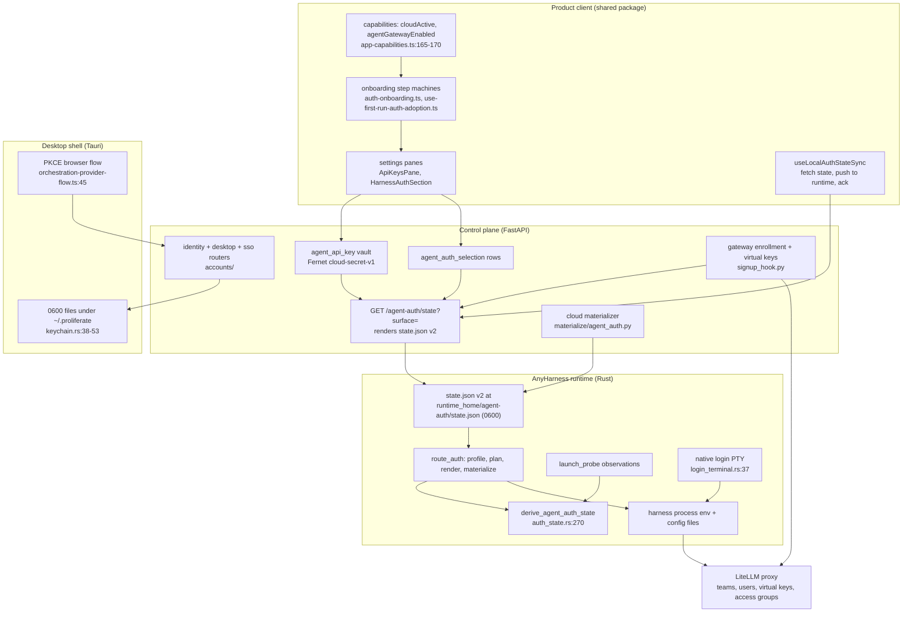
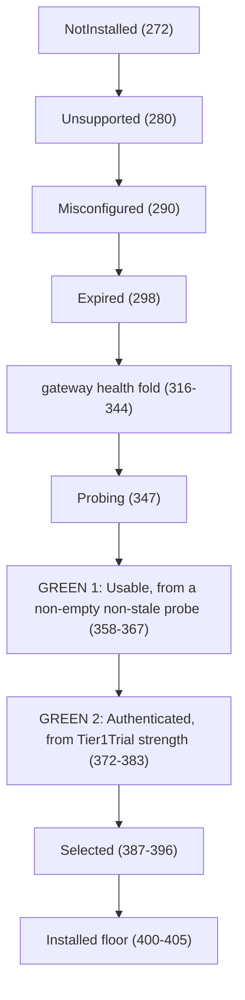
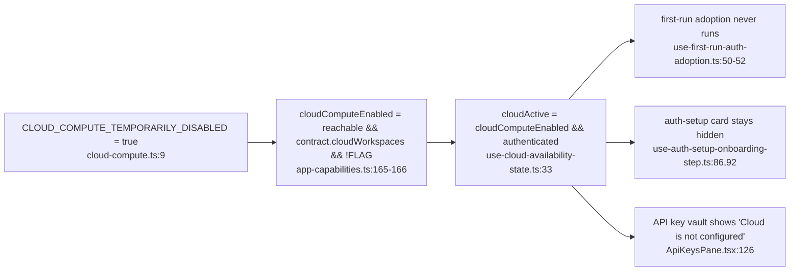
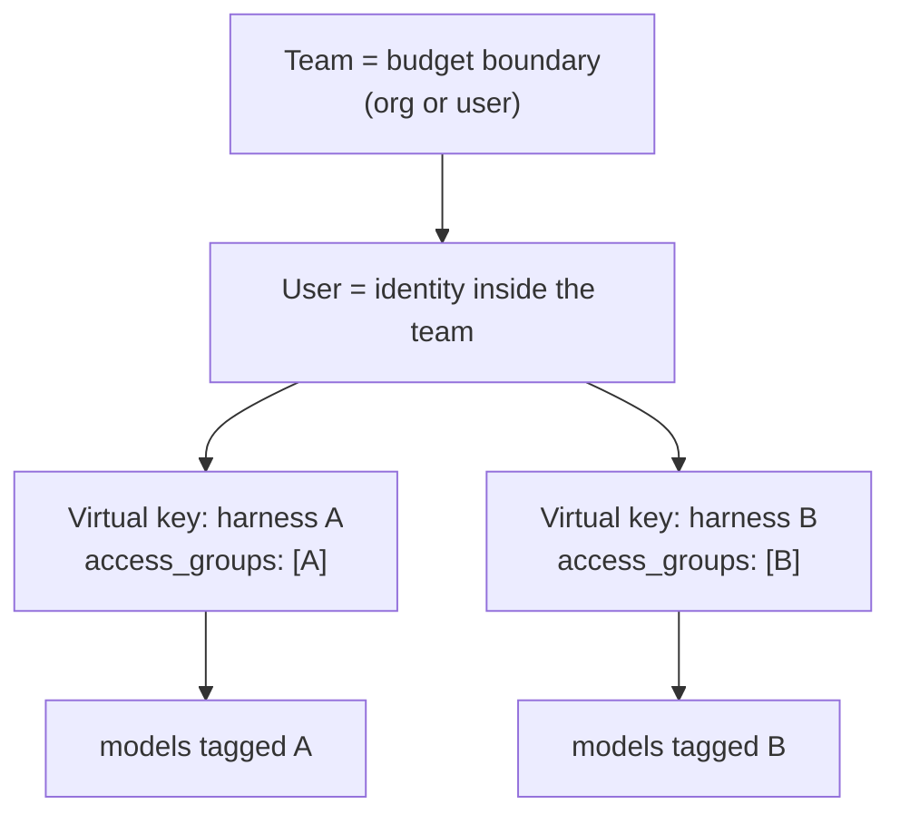

# Agent Auth + Onboarding, Current System (2026-08-20)

Status: current-system context pack. Written to be read once, end to end, before architecting changes to agent auth or first-run onboarding.

Reading time: about 40 minutes end to end. If you are short on time, sections 1, 6, 9 and 11 are the 15-minute path and carry every decision-relevant finding.

Evidence labels used throughout, one per claim:

- `[fact]` verified by reading the code, a migration, a merged PR, or a CI run in this repo at commit `8e6198ee9f` on branch `context-packs-2026-08-20`.
- `[inference]` a conclusion drawn from facts, not itself directly observed.
- `[reported]` asserted by a person or a prior document, not independently verified here.

Every repository claim carries a `file:line`, a PR number, or a commit SHA. Where a lead did not verify, section 7 says so instead of dropping it.

---

## 1. Executive summary

There are two different things in this codebase called "auth", they share almost no machinery, and conflating them is the single largest source of the feeling that onboarding is broken. **Product identity** is the user signing in to Proliferate: fastapi-users, JWTs, GitHub / Google / Apple / password / enterprise SSO, plus a desktop PKCE browser flow. **Agent auth** is the credential a coding harness (Claude Code, Codex, Cursor, OpenCode, Grok) presents to a model provider when the runtime launches it. Separate tables, separate APIs, separate storage, separate failure modes, separate UI. `[fact]` The routers are physically separate packages: `server/proliferate/server/accounts/` for identity and `server/proliferate/server/cloud/agent_gateway/` for agent auth.

Product identity is in good shape and is not gated by anything. `[fact]` Access tokens live 7 days and refresh tokens 30 days (`server/proliferate/constants/auth.py:7-8`), every token embeds a monotonic `token_generation` so a single integer bump is the "log out everywhere" primitive (`server/proliferate/db/models/auth.py:43-52`), and the desktop exchange is a real PKCE flow with an S256 challenge and a 60-second one-time code (`server/proliferate/constants/auth.py:4,9`, `server/proliferate/db/models/auth.py:64-84`).

Agent auth is also, on paper, complete. `[fact]` The selection model is `(user_id, harness_kind, surface, source_kind, env_var_name)` with `surface IN ('local','cloud')` and `source_kind IN ('gateway','api_key')` (`server/proliferate/db/models/cloud/agent_gateway.py:99-131`), the absence of rows means "use the harness's own native login", the server renders a `state.json` v2 document per surface, and the Rust runtime turns that document into per-launch environment and config files through a profile / plan / render / materialize pipeline (`anyharness/crates/anyharness-lib/src/domains/agents/route_auth/`). A seven-rung implementation ladder for this landed between 2026-08-15 and 2026-08-16 (`[fact]` PRs #1916, #1925, #1935, #1939, #1941, #1943, #1944, all merged).

The gap between "complete on paper" and "feels broken" is four specific things, and none of them is a missing feature.

**One: a launch gate silently disabled three onboarding paths.** `[fact]` `CLOUD_COMPUTE_TEMPORARILY_DISABLED = true` (`apps/packages/product-client/src/lib/domain/capabilities/cloud-compute.ts:9`) feeds `cloudComputeEnabled` (`apps/packages/product-client/src/lib/domain/capabilities/app-capabilities.ts:165-166`), which makes `cloudActive` permanently `false` for every user in every current build (`apps/packages/product-client/src/hooks/cloud/derived/use-cloud-availability-state.ts:33`). Three agent-auth paths were wired to `cloudActive` rather than to control-plane reachability, so they are all dark: first-run gateway adoption never runs (`apps/packages/product-client/src/hooks/agents/lifecycle/use-first-run-auth-adoption.ts:50-52`), the "setting up your agents" home card can never render (`apps/packages/product-client/src/hooks/agents/lifecycle/use-auth-setup-onboarding-step.ts:86,92`), and the API-key vault pane renders a dead-end "Cloud is not configured" empty state to every authenticated user (`apps/packages/product-client/src/components/settings/panes/agents/api-keys/ApiKeysPane.tsx:126`). `[fact]` The correct decoupling already exists one directory over and is documented in a comment: `useLocalAuthStateSync` gates on `authenticated && controlPlaneReachable` precisely because "the local agent-auth push must NOT be gated on cloud COMPUTE" (`apps/packages/product-client/src/hooks/agents/lifecycle/use-local-auth-state-sync.ts:72-82`). `[inference]` This is a coupling bug with a known fix shape, not a design question.

**Two: the honest-evidence badge work ships dark.** `[fact]` The only feature flag in the client is `agentAuthEvidencePanes`, default off, read from `VITE_AGENT_AUTH_EVIDENCE_PANES` (`apps/packages/product-client/src/config/feature-flags.ts:24-28`), and a repo-wide grep finds that variable in exactly three places, none of which is a build configuration. So shipped builds render the legacy badge, which returns an unconditional green "Authenticated" for OpenCode providers (`apps/packages/product-client/src/components/settings/panes/agents/harness/HarnessAuthStatusBadge.tsx:72-77`), a green for any complete API-key row without ever calling the provider (`ibid.:47-54`), and a green for CLI auth via a readiness fallback (`ibid.:59-61`).

**Three: even with the flag on, two display states are unreachable.** `[fact]` `derive_agent_auth_state` reaches `Authenticated` only through a `Tier1Trial` fact and `Unavailable` only through gateway health (`anyharness/crates/anyharness-lib/src/domains/agents/auth_state.rs:316-383`), but the only production constructor of `AuthRuntimeInputs` hardwires `trial: None, gateway: None` (`anyharness/crates/anyharness-lib/src/domains/agents/launch_probe/mod.rs:297-307`) and `handoff` is always `None` (`anyharness/crates/anyharness-lib/src/domains/agents/auth_state.rs:546`). `[fact]` The enabling flags `tier1_trial_enabled` and `gateway_health_enabled` no longer exist anywhere in `anyharness/`; they were removed by the launch-options cutover (#2070).

**Four: typed refusals arrive as raw strings.** `[fact]` The runtime emits seven precise codes (`AGENT_ROUTE_SELECTION_MISSING`, `AGENT_ROUTE_SELECTION_INCOMPLETE`, `AGENT_ROUTE_STATE_STALE`, and four more) at `anyharness/crates/anyharness-lib/src/domains/agents/route_auth/mod.rs:93-104`, mapped to HTTP 409 or 500 at `anyharness/crates/anyharness-lib/src/api/http/sessions_errors.rs:175-186`. `[fact]` A repo-wide grep for `AGENT_ROUTE` under `apps/` returns nothing, and `formatSessionCreateFailureMessage` falls through to `error.message` for any unrecognised code (`apps/packages/product-client/src/lib/domain/sessions/creation/create-session-error.ts:49-54`). `[fact]` The user therefore sees a toast headlined "Chat not opened" whose cause line is the raw Rust error string (`apps/packages/product-client/src/hooks/chat/workflows/use-chat-launch-actions.ts:305-312`), with no route to the settings pane that would fix it.

What is genuinely absent, as opposed to merely dark: there is no telemetry event anywhere in the agent-auth funnel (`[fact]` `apps/packages/product-client/src/lib/domain/telemetry/events.ts` catalogs sign-in, agent seed, chat, cloud workspace and connector events but nothing for selection, apply, probe, enrollment or agent login), and the gateway verification worker that would prove an enrollment actually works is off by default (`[fact]` `agent_gateway_verification_enabled: bool = False` at `server/proliferate/config.py:433`, gate at `server/proliferate/server/cloud/agent_gateway/worker.py:164-172`). `[inference]` Together these mean nobody, including us, can currently measure where first-run agent auth fails.

---

## 2. Architecture and ownership boundaries

Five planes own distinct parts of this system. The boundaries are real and mostly well kept.

**Server (`server/proliferate/`, FastAPI + SQLAlchemy + alembic).** Owns product identity, the personal key vault, selection rows, the rendered `state.json` document, and all LiteLLM administration. `[fact]` Identity routes live at `server/proliferate/server/accounts/identity/api.py`, desktop PKCE at `server/proliferate/server/accounts/desktop/api.py`, enterprise SSO at `server/proliferate/server/accounts/sso/api.py`, and agent auth at `server/proliferate/server/cloud/agent_gateway/api.py`. `[fact]` The server is the only plane that ever holds a LiteLLM admin key (`server/proliferate/integrations/litellm/client.py`).

**Product client (`apps/packages/product-client/`).** A shared React domain layer consumed by both the web app and the desktop app. Owns capability derivation, onboarding step machines, settings panes, and the local-surface state push. `[fact]` It is a package, not an app: `apps/web/` and `apps/desktop/` both import from it, which is why a single boolean in `lib/domain/capabilities/cloud-compute.ts` reaches every surface at once.

**Desktop (`apps/desktop/`, Tauri + Rust commands).** Owns the browser OAuth round trip, the deep-link callback, and on-disk secret storage. `[fact]` Recreatable secrets (auth session, pending OAuth state, provider and env credentials) are stored as mode-0600 files under `~/.proliferate`, deliberately not in the macOS keychain, because a keychain item's ACL is bound to the build's code signature (`apps/desktop/src-tauri/src/commands/keychain.rs:38-53`). `[fact]` Only `ANYHARNESS_DATA_KEY` remains a real keychain item, under service `com.proliferate.app.runtime` (`ibid.`).

**Rust runtime (`anyharness/crates/anyharness-lib/`).** Owns everything from `state.json` inward: persisting the document, resolving a launch route, rendering harness-specific env and files, materializing them atomically, probing for observed credentials, deriving the display state, and running native harness logins in a PTY. `[fact]` It never talks to the LiteLLM admin API; it only receives an already-minted virtual key inside the state document (`fixtures/contracts/agent-auth-state/v2.json`).

**LiteLLM gateway (`server/litellm/config.yaml` + `server/proliferate/integrations/litellm/client.py`).** The model proxy. `[fact]` Each model declares `model_info.access_groups`, for example `[claude, opencode]` and `[codex, opencode]` and `[grok, opencode]`, and Cursor is deliberately absent from every group (`server/litellm/config.yaml:26-29`). `[inference]` Access groups are the mechanism by which a per-harness virtual key can only reach that harness's models.



Boundary rules that hold today, each verified:

- `[fact]` The server never learns a harness's native credential. Native means zero selection rows; the render simply omits the harness or emits it with no sources, and the runtime leaves the harness's own config untouched (`fixtures/contracts/agent-auth-state/README.md`, `anyharness/crates/anyharness-lib/src/domains/agents/route_auth/mod.rs:200`).
- `[fact]` The client never decides a route. It writes selections and pushes an opaque rendered document; `resolve_launch_route_auth` is the only decision point (`anyharness/crates/anyharness-lib/src/domains/agents/route_auth/mod.rs:148`).
- `[fact]` Enrollment never blocks login. `schedule_agent_gateway_user_enrollment` runs on its own task with its own DB transaction, explicitly so that "login latency and login success never depend on LiteLLM" (`server/proliferate/server/cloud/agent_gateway/signup_hook.py:1-7,78`).
- `[inference]` The one boundary that leaks is presentation: the runtime's typed refusal codes stop at the HTTP layer and the client re-renders them as prose it did not author (section 1, finding four).

---

## 3. Auth and onboarding state and data models

### 3.1 Product identity tables

`[fact]` All in `server/proliferate/db/models/auth.py`:

| Model | Line | Purpose |
| --- | --- | --- |
| `OAuthAccount` | 28 | fastapi-users OAuth account link |
| `User` | 32 | product user; carries `token_generation` |
| `DesktopAuthCode` | 64 | one-time PKCE code for desktop token exchange |
| `AuthIdentity` | 87 | provider identity binding |
| `ProviderGrant` | 115 | encrypted provider access and refresh tokens |
| `AuthChallenge` | 151 | in-flight web auth challenge |
| `SsoConnection` | 180 | per-org OIDC connection |
| `SsoChallenge` | 290 | in-flight SSO challenge |
| `SsoIdentity` | 338 | SSO subject binding |
| `InstanceSetupToken` | 387 | self-host first-boot token |
| `PasswordLoginAttempt` | 410 | password brute-force throttle bucket |

The revoke-all primitive, verbatim `[fact]`:

```python
    # Monotonic session/token generation. Every access and refresh token embeds
    # the value that was current at mint time; a mismatch on use means the token
    # predates a logout or password change and must be rejected. Bumping this is
    # the server-side "log out everywhere" / "revoke all sessions" primitive.
    token_generation: Mapped[int] = mapped_column(
        Integer,
        default=0,
        server_default=text("0"),
        nullable=False,
    )
```

(`server/proliferate/db/models/auth.py:43-52`, enforced in `server/proliferate/auth/jwt.py:20-63`.)

The desktop code exchange `[fact]` (`server/proliferate/db/models/auth.py:64-84`):

```python
class DesktopAuthCode(Base):
    __tablename__ = "desktop_auth_code"
    code: Mapped[str] = mapped_column(String(128), unique=True, index=True)
    code_challenge: Mapped[str] = mapped_column(String(128))
    code_challenge_method: Mapped[str] = mapped_column(String(10), default="S256")
    state: Mapped[str] = mapped_column(String(128))
    redirect_uri: Mapped[str] = mapped_column(Text)
    consumed: Mapped[bool] = mapped_column(default=False)
```

`[fact]` Lifetimes and PKCE policy are constants, not config (`server/proliferate/constants/auth.py`): `SUPPORTED_CODE_CHALLENGE_METHODS = frozenset({"S256"})`, `JWT_LIFETIME_SECONDS = 60 * 60 * 24 * 7`, `REFRESH_TOKEN_LIFETIME_SECONDS = 60 * 60 * 24 * 30`, `AUTH_CODE_LIFETIME_SECONDS = 60`, `PASSWORD_LOGIN_FAILURE_LIMIT = 5` over a 900-second window with a 900-second block, and `GITHUB_OAUTH_SCOPES = ["repo", "user", "user:email"]`.

`[fact]` The code row is consumed under `SELECT ... FOR UPDATE` with an explicit expiry check, so a replayed code cannot mint a second session (`server/proliferate/db/store/auth.py:46-80`).

### 3.2 Agent-auth tables

`[fact]` All in `server/proliferate/db/models/cloud/agent_gateway.py`:

| Model | Line | Purpose |
| --- | --- | --- |
| `AgentApiKey` | 34 | personal vault entry, `kind IN ('api_key','aws_bedrock','azure_openai')` |
| `AgentAuthSelection` | 86 | one wiring row per source in a scope |
| `AgentAuthDeliveryAck` | 176 | per `(user, surface)` acked revision plus sha256 fingerprint |
| `AgentAuthHarnessSettings` | 224 | per-harness non-secret settings carried alongside sources |
| `AgentGatewayEnrollment` | 263 | LiteLLM team and user, `sync_status`, `budget_status` |
| `AgentGatewayEnrollmentKey` | 347 | per `(enrollment, harness)` virtual key plus verification fields |
| `OrgAgentPolicy` | 407 | org-level policy over agent auth |
| `AgentLlmUsageEvent` | 430 | imported spend rows |
| `LlmCreditGrant` | 481 | `source IN ('free_signup','topup','admin','seat_pool')` |
| `AgentLlmUsageImportCursor` | 522 | spend-log import watermark |

The selection scope and its constraint set, verbatim `[fact]` (`server/proliferate/db/models/cloud/agent_gateway.py:99-142`):

```python
        UniqueConstraint(
            "user_id", "harness_kind", "surface", "source_kind", "env_var_name",
            name="uq_agent_auth_selection_scope",
        ),
        CheckConstraint("surface IN ('local', 'cloud')", name="ck_agent_auth_selection_surface"),
        CheckConstraint("source_kind IN ('gateway', 'api_key')", name="ck_agent_auth_selection_source_kind"),
        CheckConstraint(
            "source_kind != 'api_key' OR api_key_id IS NOT NULL",
            name="ck_agent_auth_selection_api_key_shape",
        ),
        CheckConstraint(
            "source_kind != 'gateway' OR (api_key_id IS NULL AND env_var_name IS NULL)",
            name="ck_agent_auth_selection_gateway_shape",
        ),
        Index(
            "ux_agent_auth_selection_gateway",
            "user_id", "harness_kind", "surface",
            unique=True,
            postgresql_where=text("source_kind = 'gateway'"),
        ),
```

`[fact]` The api-key shape CHECK is deliberately loose. The full rule (a bare `api_key` vault entry requires an `env_var_name`, a typed entry forbids one) cannot be expressed in a single-table CHECK because it depends on the referenced vault row's `kind`, so it is enforced in the store's write gate `_assert_keys_usable` (`server/proliferate/db/store/agent_gateway/selections.py:83`), and the model comment says exactly that (`agent_gateway.py:119-128`). `[inference]` This means any writer that bypasses `selections.py` can persist an invalid selection that will fail later at render or launch time.

`[fact]` Fourteen alembic revisions touch these tables, including `e6f7a8b9c0d1_agent_llm_auth_gateway_phase1.py`, `fa0b1c2d3e4f_agent_gateway_bifrost_router.py`, `f8b9c0d1e2a3_drop_agent_auth_gateway_tables.py`, `a9c0d1e2f3b4_agent_gateway_litellm_schema.py`, `c9b8a7d6e5f4_agent_auth_selection_rebuild.py`, `d6e8f0a2b4c6_typed_selection_api_key_shape.py`, `b0c1d2e3f4a6_agent_auth_provider_slots.py`, and `e7f1a3c9d20b_agent_gateway_enrollment_key_verification.py`. `[inference]` The Bifrost-to-LiteLLM migration is visible in the migration history as a drop-and-rebuild rather than an in-place edit.

### 3.3 The wire contract: `state.json` v2

`[fact]` A frozen fixture pins the contract at `fixtures/contracts/agent-auth-state/v2.json`. Abridged:

```json
{
  "version": 2,
  "revision": 42,
  "user_id": "20000000-0000-4000-8000-000000000001",
  "issuing_server_origin": "https://api.proliferate.example",
  "harnesses": [
    { "harness_kind": "claude",
      "sources": [ { "kind": "gateway", "base_url": "https://llm.proliferate.example", "key": "sk-vk-claude-0001" } ] },
    { "harness_kind": "cursor",
      "sources": [ { "kind": "api_key", "env_var_name": "CURSOR_API_KEY", "value": "cur-raw-0004" } ] },
    { "harness_kind": "grok", "sources": [] },
    { "harness_kind": "opencode",
      "sources": [
        { "kind": "api_key", "env_var_name": "ANTHROPIC_API_KEY", "value": "sk-ant-raw-0005" },
        { "kind": "gateway", "base_url": "https://llm.proliferate.example", "key": "sk-vk-opencode-0003" },
        { "kind": "provider_config", "config_kind": "aws_bedrock",
          "env": { "AWS_BEARER_TOKEN_BEDROCK": "bedrock-raw-0006", "AWS_REGION": "us-east-1" } }
      ],
      "settings": { "reasoningEffort": "medium" } }
  ]
}
```

Three laws the fixture and README pin `[fact]` (`fixtures/contracts/agent-auth-state/README.md`):

1. A harness **absent** from `harnesses` means native: the runtime does not touch that harness's credentials.
2. A harness **present with `"sources": []`** is a refusal, not a fallback: launch fails closed with `AGENT_ROUTE_SELECTION_MISSING`. Note `grok` in the fixture is exactly this case.
3. Sources are sorted by `(kind, env_var_name)` so the document is byte-stable and its sha256 fingerprint is meaningful.

`[fact]` Gateway keys are per harness, not one shared key: `claude`, `codex` and `opencode` each carry a distinct `sk-vk-*` value in the fixture. `[fact]` The `settings` field is retained on the wire for compatibility only; the runtime comment says the per-harness settings are retired (`anyharness/crates/anyharness-lib/src/domains/agents/route_auth/state.rs:102-106`).

`[fact]` Two document-level guards exist: `revision` is a monotonic staleness guard producing `AGENT_ROUTE_STATE_STALE`, and `issuing_server_origin` is compared against `PROLIFERATE_API_BASE_URL_ORIGIN` so a document minted by one control plane is not applied under another (`anyharness/crates/anyharness-lib/src/domains/agents/route_auth/mod.rs:110`).

### 3.4 Client and desktop persistence

`[fact]` The onboarding store is in-memory zustand only, with no persistence: `adoptedHarnessKinds: string[] | null`, `adoptionStartedAt`, and `settled: "applied" | "advanced" | null` (`apps/packages/product-client/src/stores/agents/auth-setup-onboarding-store.ts`). `[inference]` A page reload during first run therefore resets the auth-setup card's state machine to `hidden`.

`[fact]` Desktop session persistence prefers Tauri-invoked 0600 files and falls back to `localStorage` under keys `proliferate.auth.session` and `proliferate.auth.pending`, emitting a one-shot `desktop_keychain_access_failed` telemetry event per failed operation (`apps/desktop/src/lib/access/tauri/auth.ts:38-58,112`). `[fact]` A pending OAuth attempt expires client-side after 10 minutes (`PENDING_AUTH_MAX_AGE_MS = 10 * 60 * 1000`, `apps/desktop/src/lib/integrations/auth/proliferate-auth-redirect.ts:22`) and the PKCE verifier is 48 random base64url bytes (`ibid.:24-31`).

### 3.5 Runtime credential state

`[fact]` The runtime persists the document at `<runtime_home>/agent-auth/state.json` with mode 0600, receiving it over `PUT /v1/agent-auth/state` and clearing it over `DELETE` (`anyharness/crates/anyharness-lib/src/api/router.rs:67-68`, handlers in `anyharness/crates/anyharness-lib/src/api/http/agent_auth.rs`). `[fact]` Both handlers fire `PokeReason::AuthApplied` so the probe layer re-observes immediately after a credential change (`agent_auth.rs:61,86`).

`[fact]` Route auth is six modules: `state.rs` (579 lines, load and validate), `profile.rs` (579, per-harness recipe), `plan.rs` (107), `render.rs` (680, pure env and file rendering), `materialize.rs` (239, atomic 0600 writes), plus `gateway_plan.rs`, `gateway_probe.rs` and `probe_materialization.rs`. `[inference]` The purity split (render is pure, materialize is the only writer) is what makes the whole path unit-testable without a filesystem.

---

## 4. End-to-end journeys

Each step carries a file reference. "What the user sees" is the rendered surface, and failure rows say what actually appears today, not what was designed.

### 4.1 Fresh desktop user, GitHub sign-in, harness already authenticated natively

This is the happy path and the one most first users hit, because Claude Code or Codex is usually already logged in on a developer's machine.

1. App boots, no stored session. `[fact]` `getStoredAuthSession` returns null after trying the Tauri 0600 file and the `localStorage` fallback (`apps/desktop/src/lib/access/tauri/auth.ts:112`).
2. User clicks GitHub. `[fact]` `signInWithGitHub` clears any published auth issue, checks control-plane reachability (throws a 503-shaped `AuthRequestError` if unreachable), then checks `GET /auth/desktop/github/availability` and throws "GitHub sign-in is not configured for this environment" if the server has no client id (`apps/desktop/src/lib/integrations/auth/orchestration-provider-flow.ts:45-79`, server route at `server/proliferate/server/accounts/desktop/api.py:141`).
3. `[fact]` A pending PKCE record is created and stored, then the system browser is opened (`orchestration-provider-flow.ts:93-104`).
4. `[fact]` GitHub redirects to the server callback, which mints a `DesktopAuthCode` and deep-links back to `proliferate://auth/callback` (`server/proliferate/server/accounts/desktop/api.py:204`, scheme constants at `server/proliferate/constants/auth.py:22-25`).
5. `[fact]` The app races the deep-link callback against a poll of `POST /auth/desktop/poll`, whichever lands first (`orchestration-provider-flow.ts:106-127`, `pollGitHubDesktopSession` at `apps/desktop/src/lib/integrations/auth/proliferate-auth.ts:193-211`, server route at `desktop/api.py:230`). `[inference]` The race exists because deep links are unreliable on macOS when the app was cold-started by the browser.
6. `[fact]` The code is exchanged at `POST /auth/desktop/token` with the verifier; the server recomputes the S256 challenge and refuses with `desktop_code_verifier_invalid` or a PKCE-verification failure on mismatch (`server/proliferate/server/accounts/desktop/service.py:476-522`).
7. `[fact]` Signup hooks schedule gateway enrollment out of band (`server/proliferate/server/accounts/desktop/service.py:448` calling `signup_hook.py:78`).
8. `[fact]` The desktop runtime reconciles installed agents, discovering while idle (`apps/packages/product-client/src/hooks/agents/derived/use-agent-catalog.ts:20-38`); the pure install decision lives at `anyharness/crates/anyharness-lib/src/domains/agents/installer/auto_install.rs`.
9. `[fact]` The probe layer observes the harness's own credentials and `derive_agent_auth_state` returns `Usable` from a non-empty, non-stale observation (`anyharness/crates/anyharness-lib/src/domains/agents/auth_state.rs:358-367`).
10. `[fact]` `planFirstRunAuthAdoption` would return an empty plan anyway, because `hasDetectedNativeAuth` is true for this harness (`apps/packages/product-client/src/lib/domain/agents/auth-onboarding.ts:53,161`).
11. `[fact]` `useLocalAuthStateSync` still runs (it is not cloud-gated) and pushes a state document that omits this harness, so nothing is overwritten (`use-local-auth-state-sync.ts:72-82`).

What the user sees: sign-in, then a home screen whose onboarding cards are about repositories and agent defaults, not about auth (`apps/packages/product-client/src/lib/domain/home/home-screen.ts:138-161`). `[inference]` This path feels fine and is probably why the breakage below went unnoticed.

### 4.2 Fresh user, no native credentials, gateway path (designed vs shipped)

**As designed** `[fact]` (`apps/packages/product-client/src/lib/domain/agents/auth-onboarding.ts:161-186`): `planFirstRunAuthAdoption` returns `[]` if any selection already exists, `[]` if native credentials were detected, `[]` if the gateway is not enabled, and otherwise returns the gateway source for every installed agent. `useFirstRunAuthAdoption` applies that plan and records it, `resolveAuthSetupStep` moves the home card to `settingUp`, and a 20-second grace window (`AUTH_SETUP_GRACE_MS = 20_000`, `auth-onboarding.ts:92`) covers the enrollment round trip before the card settles to `applied` or `advanced`.

**As shipped** `[fact]`: `useFirstRunAuthAdoption` returns at its second statement because `cloudActive` is false (`apps/packages/product-client/src/hooks/agents/lifecycle/use-first-run-auth-adoption.ts:50-52`). No selections are written. `resolveAuthSetupStep` therefore sees `adopted === null` and returns `"hidden"` (`auth-onboarding.ts:134`). `AuthSetupCard` renders only for `settingUp`, so nothing appears (`apps/packages/product-client/src/components/home/screen/HomeOnboardingCards.tsx:115`).

What the user sees: no auth card, no spinner, no error. The first chat attempt is where it surfaces, and it surfaces as the toast described in 4.5.

### 4.3 Fresh user, bring-your-own API key

1. User opens Settings, Agents, API keys. `[fact]` The outer route gate passes: `render-settings-section.tsx:62-67` deliberately builds an `authGate` that sets `cloudActive: authenticated` so control-plane sections stay reachable while cloud compute is off.
2. `[fact]` The pane's own inner gate then fails: `ApiKeysPane.tsx:41,44,126` destructures the real `cloudActive`, passes it to `useAgentApiKeys(cloudActive)`, and at line 126 returns a `SettingsEmptyState`.
3. `[fact]` The copy is "Cloud is not configured" over "Cloud is not configured on this deployment. An operator must finish configuring it before the API key vault is available." (`apps/packages/product-client/src/copy/settings/agent-api-keys-copy.ts:14,17-18`).

What the user sees: a dead end that blames the operator, on a deployment where the vault works fine. `[fact]` The regression test written for exactly this class of bug cannot catch it, because it mocks the pane away: `render-settings-section.test.tsx:11-13` substitutes `<div>pane:agent-api-keys</div>` and the assertion at lines 126-140 carries the comment "Regression: rung 1 flipped CLOUD_COMPUTE_TEMPORARILY_DISABLED on".

Had the pane rendered, the intended path continues `[fact]`: `POST /agent-auth/keys` for a bare secret or `POST /agent-auth/keys/provider-config` for a typed one (`server/proliferate/server/cloud/agent_gateway/api.py:80,95`), then `PUT /agent-auth/selections/{harness_kind}?surface=local` (`ibid.:152`), then `_assert_keys_usable` validates the bare-versus-typed shape against the registry (`server/proliferate/db/store/agent_gateway/selections.py:83`), then the client's `useLocalAuthStateSync` fetches `GET /agent-auth/state?surface=local` and pushes it to the runtime, then `POST /agent-auth/state/ack` stamps delivery (`api.py:199,228`).

### 4.4 Native login inside the app

`[fact]` The runtime can drive a harness's own login command in a real PTY: `POST /v1/agents/{kind}/login/terminal` starts a 120x24 PTY session (`anyharness/crates/anyharness-lib/src/api/router.rs:62-65`, `anyharness/crates/anyharness-lib/src/domains/agents/auth/login_terminal.rs:37,61-62`), with status polling and close on `/v1/agents/login-terminals/{terminal_id}` and a WebSocket at `.../ws` (`router.rs:41-46`). `[fact]` The client surfaces this through `AgentLoginTerminalPanel.tsx` and `HarnessAuthCliDetails.tsx`.

`[fact]` There is no browser-handoff login mode: `start_agent_login` hardcodes `mode: "terminal_command"` (`anyharness/crates/anyharness-lib/src/api/http/agents.rs:166`). `[inference]` This is consistent with `handoff: None` always being emitted by the fact adapter (`auth_state.rs:546`); the handoff variant is a type that nothing constructs.

### 4.5 Launch time, and what a refusal looks like

1. `[fact]` `resolve_launch_route_auth` loads the state document, matches the harness, and either returns a route or a typed error (`anyharness/crates/anyharness-lib/src/domains/agents/route_auth/mod.rs:148`). Helper predicates `launch_route_provides_credentials` (line 200) and `launch_route_selection_failure` (line 252) let readiness reason about the route without duplicating the decision.
2. `[fact]` The error maps to HTTP: `SelectionMissing`, `SelectionIncomplete`, `UnsupportedRoute`, `UnknownHarness` and `StaleStateRevision` become 409; `MalformedStateFile` and `Materialize` become 500 (`anyharness/crates/anyharness-lib/src/api/http/sessions_errors.rs:175-186`).
3. `[fact]` The client has no mapping for any of these codes; `formatSessionCreateFailureMessage` handles only `SESSION_MODEL_UNSUPPORTED`, `SESSION_MODE_UNSUPPORTED` and `WORKSPACE_DIRECTORY_MISSING`, then falls through to `error.message` (`apps/packages/product-client/src/lib/domain/sessions/creation/create-session-error.ts:49-54`).
4. `[fact]` The toast is built at `apps/packages/product-client/src/hooks/chat/workflows/use-chat-launch-actions.ts:305-312` with headline "Chat not opened", a consequence line saying the draft is preserved, and the raw string as the cause.

| Runtime condition | Code | HTTP | What the user actually sees |
| --- | --- | --- | --- |
| Harness present with zero sources | `AGENT_ROUTE_SELECTION_MISSING` | 409 | "Chat not opened" toast, raw Rust text, no action |
| Selection references a key that no longer renders | `AGENT_ROUTE_SELECTION_INCOMPLETE` | 409 | same |
| Runtime holds a newer revision than the pushed one | `AGENT_ROUTE_STATE_STALE` | 409 | same |
| Route not supported for that harness | `AGENT_ROUTE_UNSUPPORTED` | 409 | same |
| Unknown harness kind in the document | `AGENT_ROUTE_UNKNOWN_HARNESS` | 409 | same |
| Corrupt or unparseable state file | `AGENT_ROUTE_STATE_MALFORMED` | 500 | same |
| Atomic write failed | `AGENT_ROUTE_MATERIALIZE_FAILED` | 500 | same |

`[inference]` Every one of these is a state the settings pane could repair, and none of them routes the user there.

### 4.6 Returning user, second machine

`[fact]` Selections are server-side and surface-scoped, so a second machine that signs in receives the same `local`-surface document from `GET /agent-auth/state?surface=local` and pushes it to its own runtime (`server/proliferate/server/cloud/agent_gateway/api.py:199`, client at `use-local-auth-state-sync.ts:82`). `[fact]` Delivery is tracked per `(user, surface)` in `AgentAuthDeliveryAck` with an `acked_revision` and an `acked_fingerprint` (`server/proliferate/db/models/cloud/agent_gateway.py:176-223`). `[inference]` Because the ack is keyed by surface and not by device, two machines on the same surface overwrite each other's ack, so the server's "applied" stamp reflects the most recent device rather than all of them.

`[fact]` Native credentials do not travel: they are, by construction, the absence of rows. `[inference]` A returning user on a fresh machine with native-only auth must log each harness in again locally, and nothing in the product tells them that in advance.

### 4.7 Web user, cloud surface

`[fact]` `cloudComputeEnabled` is false in every build, and `useCloudAvailabilityState` derives `cloudActive` from it (`app-capabilities.ts:165-166`, `use-cloud-availability-state.ts:33`). `[fact]` `agentGatewayEnabled` is deliberately not gated by the cull flag (`app-capabilities.ts:170`). `[inference]` The intent was clearly that identity and agent-gateway surfaces survive the cloud-compute cull; the three sites in section 1 finding one simply did not get the same treatment.

### 4.8 Per-harness credential modes

`[fact]` From `catalogs/agents/registry.json`:

| Harness | Slots | Gateway | Provider configs | Cardinality |
| --- | --- | --- | --- | --- |
| `claude` | `anthropic` (required), `gateway` | yes | `aws_bedrock`, `azure_openai` (`azure_openai` only is `pending: true`) | `single` |
| `codex` | `openai`, `gateway` | yes | `aws_bedrock`; `azure_openai` `pending: true` | |
| `cursor` | `cursor` only | no | none | |
| `opencode` | `openai`, `anthropic`, `gemini`, `opencode-zen`, `gateway` (none required) | yes | `aws_bedrock`, `azure_openai` (neither pending) | multi |
| `grok` | `xai`, `gateway` | yes | none | |

`[fact]` Cursor is also excluded from automatic probing: `AUTO_PROBE_EXCLUDED_HARNESSES: &[AgentKind] = &[AgentKind::Cursor]` with a doc comment citing the macOS keychain prompt as the reason (`anyharness/crates/anyharness-lib/src/domains/agents/launch_probe/targets.rs:16-26`). `[inference]` Cursor is therefore the harness with the least evidence available: no gateway, no provider config, no auto probe, so its badge can only ever reflect a bare presence check.

---

## 5. Agent-auth selection and persistence, and its interaction with harness and model selection

`[fact]` The mental model, from the model docstring at `server/proliferate/db/models/cloud/agent_gateway.py:86-96`: a row is either the gateway (`source_kind='gateway'`, no key, no env var) or a single direct API key (`source_kind='api_key'`, both `api_key_id` and `env_var_name` set); native is the empty state; single-source harnesses keep exactly one enabled row; OpenCode composes the gateway plus any number of api-key rows; `provider_hint` is display-only with zero launch semantics and never reaches the wire.

`[fact]` Writes go through `PUT /agent-auth/selections/{harness_kind}?surface=` which replaces the whole source set for that scope, optionally persists harness settings in the same call, and returns each row annotated with an `applied` boolean derived from the delivery ack (`server/proliferate/server/cloud/agent_gateway/api.py:152-195`). `[inference]` Replace-whole-set is what makes "absent means native" expressible: sending an empty list is how a user goes back to native.

`[fact]` Validation is registry-driven, not hardcoded. `_assert_keys_usable` takes a `supported_provider_config_kinds` argument (`server/proliferate/db/store/agent_gateway/selections.py:83`) and raises `AgentProviderConfigNotSupportedError` (`ibid.:60`). On the client, `parseSupportedKindsByHarness` reads the bundled registry and filters out entries marked `pending` (`apps/packages/product-client/src/lib/domain/settings/provider-config-fields.ts:118-148`), with `getSupportedProviderConfigKinds` returning the derived set (`ibid.:164-168`).

`[fact]` The gateway side of a selection resolves to a per-harness LiteLLM virtual key held in `AgentGatewayEnrollmentKey` (`agent_gateway.py:347`), minted through `mint_virtual_key` against `/key/generate` (`server/proliferate/integrations/litellm/client.py:231,260`) and scoped by the model access groups in `server/litellm/config.yaml`.

Interaction with harness and model selection, in three parts:

- `[fact]` Model reachability follows from the access group, not from the selection: a `codex` virtual key can reach models tagged `[codex, opencode]` and nothing else (`server/litellm/config.yaml:83`). `[inference]` Choosing gateway auth for a harness therefore silently constrains that harness's model menu to the gateway's catalog, and choosing BYOK restores whatever the provider itself offers.
- `[fact]` Cursor has no gateway slot at all (`catalogs/agents/registry.json`) and is absent from every access group by explicit comment (`server/litellm/config.yaml:26-29`). `[inference]` Cursor is structurally BYOK-or-native only.
- `[fact]` Readiness and route auth are joined by an explicit seam: `resolve_agent_unrouted` and `resolve_agent_unrouted_by_kind` compute readiness without a route, and `apply_launch_route_upgrade` layers the route on top (`anyharness/crates/anyharness-lib/src/domains/agents/readiness/service.rs:62,77` and the seam doc at 202-213 referencing issue #1106). `[inference]` This is why an agent can read as "ready" in the picker and still refuse at launch: readiness is route-agnostic until the upgrade runs.

### 5.1 The display-state precedence ladder

`[fact]` `derive_agent_auth_state` (`anyharness/crates/anyharness-lib/src/domains/agents/auth_state.rs:270`) evaluates in this fixed order:



`[fact]` The fact adapter `facts_from_resolved_with_runtime` (`ibid.:461`) sets `handoff: None` unconditionally at line 546 and derives the credential fact from `credentials_from_route` into `Gateway` or `AcknowledgedRoute`, otherwise `BarePresence`.

`[fact]` The two inputs that would light up branches E and H are never constructed in production: `auth_runtime_inputs` and `auth_runtime_inputs_from_options` both build `AuthRuntimeInputs { probe: ProbeLifecycle{..}, trial: None, gateway: None }` (`anyharness/crates/anyharness-lib/src/domains/agents/launch_probe/mod.rs:274,297-307`), with the doc comment at lines 244-245 stating that launch-option observation replaced the deleted model-snapshot and trial authority and that no catalog or trial verdict is folded in. `[fact]` `GatewayHealth` is translated on the wire at `anyharness/crates/anyharness-lib/src/api/http/agents_contract.rs:398-402` but never produced. `[fact]` `tier1_trial_enabled` and `gateway_health_enabled` return zero hits across `anyharness/`.

`[inference]` So the shipped ladder is effectively: NotInstalled, Unsupported, Misconfigured, Expired, Probing, Usable, Selected, Installed. `Authenticated` and `Unavailable` are dead branches whose types survive but whose producers were deleted with #2070.

---

## 6. Current onboarding feel and failure states

`[reported]` Pablo reports that onboarding "FEELS broken". This section is the attempt to attach that feeling to code. Everything below is a verified mechanism except where labelled otherwise.

### 6.1 The cull flag is the dominant cause

`[fact]` The flag, in full (`apps/packages/product-client/src/lib/domain/capabilities/cloud-compute.ts:9`):

```ts
export const CLOUD_COMPUTE_TEMPORARILY_DISABLED = true;
```

`[fact]` Its file comment scopes it to cloud compute surfaces (new cloud workspaces, migrate workspace, enable remote access, open in web) and explicitly says identity is not affected (`ibid.:1-7`).

`[fact]` The propagation chain, in three hops:



`[fact]` The counter-example that proves the intent is `useLocalAuthStateSync`, whose comment says the local push must not be gated on cloud compute and which gates on `authenticated && controlPlaneReachable` instead (`use-local-auth-state-sync.ts:72-82`).

`[fact]` Downstream consequences that follow mechanically: `use-first-run-auth-adoption.ts:31` also disables the workflow queries entirely (`workflowQueriesEnabled = cloudActive && isDesktop`), and `use-auth-setup-onboarding-step.ts:86,92` disables both `useAuthSelections` and `useAgentGatewayEnrollment` polling (`AUTH_SETUP_POLL_MS = 3000` at line 29 never fires).

### 6.2 The evidence work ships behind an off flag

`[fact]` `apps/packages/product-client/src/config/feature-flags.ts` defines exactly one flag, `agentAuthEvidencePanes`, read via `readEnvFlag` accepting `"1"` or `"true"` from `VITE_AGENT_AUTH_EVIDENCE_PANES`, defaulting off (lines 24-28). `[fact]` A repo-wide grep for `VITE_AGENT_AUTH_EVIDENCE_PANES` finds three hits and no build config: `specs/FEATURE_DOCS/AGENT_AUTH.md:907`, `apps/packages/product-client/src/vite-env.d.ts:23`, and the flag file itself.

`[fact]` The switch points: `HarnessAuthSection.tsx:170-171` reads the flag and only then reads `editor.localAgent?.authState`, choosing `HarnessAuthEvidenceBadge` over `HarnessAuthStatusAction` at lines 179-193; `HarnessProvidersSection.tsx:92-97` is the OpenCode twin.

`[fact]` What renders instead, in `HarnessAuthStatusBadge.tsx`:

- `deriveProvidersStatus()` returns `{ label: authBadgeAuthenticated, tone: "success" }` unconditionally for OpenCode providers (lines 72-77).
- The `api_key` branch is green as soon as any enabled row is complete, with no provider call (lines 47-54).
- The `cli` branch falls back to `isReadyAgent(localAgent)` when `cliAuthState` is not `authenticated` (lines 59-61).

`[inference]` These three are exactly the false greens the rung-6 work replaced, and they are exactly what users see today. A green badge next to a harness that then refuses to launch is the most plausible single explanation for onboarding "feeling" broken.

### 6.3 Verified leads from section 6 of the brief

`[fact]` **Add-repo onboarding popover #1871**: merged 2026-08-14T23:15:44Z. Its follow-up #1890 ("chore(ci): refresh MainSidebar.test.tsx max-lines pin after #1871") also merged, 2026-08-15T01:01:37Z. `[reported]` Prior notes said #1890 was awaiting Pablo; that is stale.

`[fact]` **Auth-UX clarity layer**: the merged artifact is documentation, #1555 "docs(specs): founder-ruled UX layer for agent-auth and model-catalog" (2026-08-07); its sibling #1554 was closed unmerged. `[inference]` The clarity layer is design-and-spec only, with no distinct implementation PR, which matches the "design-only" characterisation.

`[fact]` **`CLOUD_COMPUTE_TEMPORARILY_DISABLED`**: verified true and traced above.

### 6.4 The other onboarding surface: repository readiness

`[fact]` `resolveRepositoryReadiness` runs ten ordered gates (`apps/packages/product-client/src/domain/repos/repo-readiness.ts:112`). Four of them terminate with `action: "none"`, meaning the UI offers nothing to click: gate 1 operator capability (line 124), gate 3 unsupported repo identity (line 134), gate 4 loading (line 142), and gate 8 `missing_user_repo_access` (line 171). The repairable gates offer `sign_in`, `authorize_user`, `reauthorize_user`, `install_app`, `copy_admin_request`, `grant_repo_access` and `set_up_cloud` (lines 128-188).

`[fact]` The home onboarding cards are built by `buildHomeOnboardingCards` (`apps/packages/product-client/src/lib/domain/home/home-screen.ts:114`) and cover `add-repository` (138-143), `agent-defaults` when `readyAgentCount === 0` or no default chat agent (147-152), and `repository-settings` (156-161). `[fact]` `HomeOnboardingCards` shows at most three cards, ordered evidence card, auth-setup card, setup cards, model probe (`apps/packages/product-client/src/components/home/screen/HomeOnboardingCards.tsx:209`).

`[inference]` Because the auth-setup card is unreachable (6.1), the only agent-auth-adjacent card a real user can see is `agent-defaults`, which is a model and harness default prompt, not a credential prompt. There is no first-run surface that says "your agents have no credentials".

### 6.5 Attention affordances

`[fact]` `getHarnessAttentionDotTone` emits no dot when `credentialState === "ready"` and no dot for `install_required` (`apps/packages/product-client/src/lib/domain/agents/status-presentation.ts:92-111`), and `isReadyAgent` is a plain `readiness === "ready"` check (`apps/packages/product-client/src/lib/domain/agents/status.ts`). `[inference]` Combined with the route-agnostic readiness seam in section 5, a harness with a broken route can show ready, show no attention dot, show a green badge, and still refuse at launch.

---

## 7. Built and merged versus parked and spec-only

Each named lead, with its verdict. Leads that did not verify are kept and marked.

| # | Lead | Verdict |
| --- | --- | --- |
| 1 | Agent-auth implementation ladder merged around 2026-08-16 | `[fact]` **VERIFIED.** Rung 2 #1916 merged 2026-08-15T19:49:13Z, rung 3 #1925 2026-08-15T20:04:10Z, rung 4 #1935 2026-08-16T10:11:14Z, rung 5 #1939 2026-08-16T11:33:40Z, rung 6 #1941 2026-08-16T11:46:34Z, rung 7 #1943 2026-08-16T12:11:08Z, lints #1944 2026-08-16T19:29:53Z. No PR titled as "rung 1" was found by search. |
| 2 | PR #1944 is parked | `[fact]` **DOES NOT VERIFY.** `gh pr view 1944` reports MERGED at 2026-08-16T19:29:53Z. Its body does end with a "do not merge" style note referencing the ladder, which is presumably the origin of the belief, but it merged. |
| 3 | "FR-1" debt item outstanding | `[fact]` **VERIFIED.** #1943's body states that the live end-to-end onboarding run Pablo ruled as the ADR's acceptance (fresh install, agent installed, authenticated, first usable session, in a booted app) was NOT validated, citing a fact adapter that fills only readiness-derived facts and a swap-saturated build machine. The same acceptance appears in `specs/FEATURE_DOCS/AGENT_AUTH.md` under "Acceptance (FR-1)". |
| 4 | LiteLLM in production since 2026-08-18, a 12-PR stack replaced Bifrost | `[fact]` **PARTLY VERIFIED.** The Promote Production run `32177195773` created 2026-08-18T19:32:41Z and completed 2026-08-18T20:08:31Z with `deploy-litellm / deploy` succeeding, at head SHA `b024f9814750236f2088e28ca78e268785e925cc`. `[fact]` The commit `fe938ca56` recorded in prior notes does not match that run. `[fact]` An earlier run `28698314641` on 2026-07-04 also deployed LiteLLM successfully, so 2026-08-18 is the most recent LiteLLM production deploy, not the first. `[fact]` Bifrost teardown is #814 "refactor(agent-auth): tear down Bifrost gateway stack", merged 2026-07-02. |
| 5 | Agent-auth ADR vetted with about 21 open questions | `[fact]` **NOT VERIFIABLE IN REPO.** `adrs/` on this branch contains only `2026-08-05-docs-restructure.md`, `2026-08-10-rust-observability.md`, and `2026-08-19-target-observed-harness-launch-options.md`. PR bodies reference "the Agent Auth ADR ladder (PRO-214)", so the ADR exists outside the repository. The question list could not be checked. |
| 6 | One shared OAuth app serves web and desktop | `[fact]` **VERIFIED for GitHub and Google.** A single `settings.github_oauth_client_id` and secret is used by both the web identity providers (`server/proliferate/auth/identity/providers.py:69-88`) and the desktop routes (`server/proliferate/server/accounts/desktop/api.py:143-146,185-190`). `[fact]` Apple is the exception and splits by surface, `apple_web_service_id` versus `apple_ios_bundle_id` (`providers.py:85-88`). |
| 7 | Separate prod and dev GitHub Apps | `[fact]` **VERIFIED STRUCTURALLY.** Config carries exactly one GitHub App per deployment (`server/proliferate/config.py:217-241`: `github_app_id`, `github_app_slug`, `github_app_client_id`, `github_app_client_secret`, `github_app_webhook_secret`, `github_app_callback_base_url`, `github_app_private_key`), and `guides/local/github-app-manual-qa.md` prescribes registering a separate dev App with an ngrok callback base. The actual app IDs are secrets and are not in the repository. |
| 8 | Three-layer feature-worktree auth doc under `specs/developing/local/` | `[fact]` **PATH DOES NOT VERIFY.** The document exists but lives at `guides/local/feature-worktree-auth.md` (181 lines, Layer A `VITE_DEV_DISABLE_AUTH=true`, Layer B real backend session in single-org mode, Layer C). `specs/developing/` contains only `README.md` and `reference/`. |

`[fact]` Additional current state worth recording: the spec `specs/FEATURE_DOCS/AGENT_AUTH.md` is 1230 lines and carries `Status: target`, meaning it describes the intended system, not necessarily the shipped one. Its "Current gaps" checklist at lines 1117-1230 contains two entries that are now stale:

- `[fact]` The claim that the client's typed-vault gate is hardcoded to an empty list is stale: `getSupportedProviderConfigKinds` is registry-derived (`apps/packages/product-client/src/lib/domain/settings/provider-config-fields.ts:118-168`).
- `[fact]` The claim that a stale `CURSOR_API_KEY` justification survives in `model_snapshot/targets.rs` is stale: the module moved to `launch_probe/targets.rs` and the comment now cites only the macOS keychain prompt (`anyharness/crates/anyharness-lib/src/domains/agents/launch_probe/targets.rs:16-26`).

---

## 8. Recent agent-auth PR stack and residual debt

`[fact]` The ladder, reconstructed from `gh pr list` and `gh pr view`:

| PR | Merged (UTC) | What it did |
| --- | --- | --- |
| #1916 | 2026-08-15T19:49:13Z | Ladder rung 2 |
| #1925 | 2026-08-15T20:04:10Z | Ladder rung 3 |
| #1935 | 2026-08-16T10:11:14Z | Ladder rung 4 |
| #1939 | 2026-08-16T11:33:40Z | Ladder rung 5 |
| #1941 | 2026-08-16T11:46:34Z | Ladder rung 6, the evidence-backed badge |
| #1943 | 2026-08-16T12:11:08Z | Ladder rung 7, closing rung, carries the FR-1 non-validation note |
| #1944 | 2026-08-16T19:29:53Z | Lint and max-lines follow-up |

`[fact]` Adjacent merged work: #1871 add-repo onboarding popover (2026-08-14T23:15:44Z) and its pin refresh #1890 (2026-08-15T01:01:37Z); #1555 founder-ruled UX layer docs (2026-08-07); #814 Bifrost teardown (2026-07-02). `[fact]` Open and relevant: #2072 "feat(product): add post-onboarding Home suggestions" (opened 2026-08-19).

`[fact]` The launch-options cutover #2070 is the change that removed `tier1_trial_enabled` and `gateway_health_enabled` from `anyharness/`, which is what left two branches of the display ladder unreachable (section 5.1).

Residual debt, each independently checked against current code:

| Item | State | Evidence |
| --- | --- | --- |
| FR-1 live onboarding acceptance run | `[fact]` still owed | #1943 body; `specs/FEATURE_DOCS/AGENT_AUTH.md` "Acceptance (FR-1)" |
| Cloud auth-applied probe poke | `[fact]` still open | Runtime fires `PokeReason::AuthApplied` on PUT and DELETE (`anyharness/.../api/http/agent_auth.rs:61,86`); the cloud materializer has no equivalent (no probe or poke reference in `materialize/agent_auth.py`) |
| OpenCode detector discards the provider name | `[fact]` still open | `for (_provider, value) in obj` at `anyharness/crates/anyharness-lib/src/domains/agents/auth/credentials.rs:308`, inside `detect_opencode_local_auth` (line 288) |
| `azure_openai` marked `pending` for claude and codex | `[fact]` still open | `catalogs/agents/registry.json` |
| Three-domain split of the agent-gateway server package | `[fact]` not done | `server/proliferate/server/cloud/agent_gateway/` is still a single package |
| Per-harness native settings reaching the runtime | `[fact]` moot on the runtime side | `resolve_settings_deltas` no longer exists in Rust; `settings` is retained for wire compatibility only (`route_auth/state.rs:102-106`) |
| Evidence panes flag never enabled in any build | `[fact]` open | section 6.2 |
| Gateway verification worker off by default | `[fact]` open | `server/proliferate/config.py:433`; `server/proliferate/server/cloud/agent_gateway/worker.py:164-172`; only tests monkeypatch it |

---

## 9. Gaps: what is missing entirely

These have no owner and no code, as distinct from the debt above which has code that is dark or incomplete.

1. `[fact]` **No agent-auth telemetry at all.** The event catalog at `apps/packages/product-client/src/lib/domain/telemetry/events.ts` contains `auth_signed_in`, `auth_sign_in_failed`, `auth_signed_out`, `agent_seed_hydrated`, `agent_seed_hydration_failed`, `chat_session_created`, `chat_prompt_submitted`, the `cloud_workspace_*` family, the `connector_*` family, `desktop_keychain_access_failed`, `runtime_connection_state_changed`, `screen_viewed` and `support_report_submitted`. There is no event for selecting a source, applying a selection, a probe result, an enrollment transition, or a native agent login. `[inference]` The agent-auth funnel is unmeasurable today, which means "it feels broken" cannot currently be turned into a number.

2. `[fact]` **No client mapping for `AGENT_ROUTE_*`.** Grep for `AGENT_ROUTE` under `apps/` returns nothing. `[inference]` Seven precise, actionable refusals are collapsed into one generic toast.

3. `[fact]` **No credential-state onboarding card.** `buildHomeOnboardingCards` covers repositories, agent defaults and repository settings only (`home-screen.ts:138-161`). `[inference]` Nothing prompts a user whose harnesses have no credentials, except indirectly via `agent-defaults` when `readyAgentCount === 0`.

4. `[fact]` **No persistence for onboarding progress.** The auth-setup store is memory-only (`auth-setup-onboarding-store.ts`). `[inference]` Any reload restarts the machine, and a cross-device first run has no shared notion of "onboarded".

5. `[fact]` **No live acceptance proof.** FR-1 was explicitly not validated (#1943), and no proof run has been recorded since.

6. `[inference]` **No device-scoped delivery tracking.** `AgentAuthDeliveryAck` is keyed `(user_id, surface)` (`agent_gateway.py:176`), so a multi-machine user has one shared ack. There is no code for per-device state and no issue tracking it that was found.

7. `[fact]` **Verification is opt-in and off.** `agent_gateway_verification_enabled` defaults to `False` with a 900-second interval (`server/proliferate/config.py:429-434`) and the worker returns `None` unless the gateway is enabled, background workers run, and the flag is on (`worker.py:164-172`). `[inference]` Nothing proves an enrollment's virtual key actually works before a user tries it.

---

## 10. Domain knowledge and best practices

This section is general knowledge, not claims about this repository. It exists so the decisions in section 11 can be read against the wider field. Nothing here carries a `file:line` because none of it is a repo fact.

### 10.1 OAuth device flow versus PKCE for desktop apps

Two credible patterns for signing a desktop app into a web control plane. **Loopback or custom-scheme PKCE** opens the system browser, the browser redirects to a URI the app owns, and the app exchanges a one-time code using a verifier it never transmitted. **Device authorization grant** shows a short user code, the user types it into a browser on any device, and the app polls until the grant completes.

```mermaid
sequenceDiagram
  participant App as Desktop app
  participant Br as System browser
  participant AS as Auth server
  App->>App: verifier = random(48); challenge = S256(verifier)
  App->>Br: open /authorize?code_challenge=challenge&state=s
  Br->>AS: user authenticates
  AS-->>Br: redirect app-scheme://callback?code=c&state=s
  Br-->>App: deep link (may be lost)
  App->>AS: POST /token {code: c, code_verifier: verifier}
  AS-->>App: access + refresh tokens
```

The failure everyone hits is the dashed step: custom-scheme deep links are unreliable when the app was cold-started by the browser, when a second instance is launched, or when the OS routes the scheme to the wrong bundle. The standard mitigation is exactly the race this codebase implements, deep link versus poll, first one wins. The device flow avoids the deep link entirely at the cost of a user typing a code, which is why it dominates on TVs and CLIs and is rarer on desktop GUIs.

Practical rules worth holding: the authorization code must be single-use, short-lived (60 seconds is aggressive and correct), and consumed under a lock so a replay cannot mint a second session. `state` protects against CSRF and must be compared, not merely echoed. The verifier must never leave the device.

### 10.2 Desktop token storage

Three options, each with a real tradeoff.

- **OS keychain or credential manager.** Best confidentiality, but on macOS the item's ACL is bound to the signing identity, so a re-signed or locally built binary loses access and the user sees an opaque prompt or failure. Migration across signing identities is genuinely painful.
- **Mode-0600 files in a user-owned directory.** Weaker against a local attacker who already has the user's UID, but stable across builds, trivially inspectable during support, and easy to clear. Appropriate when everything stored is recreatable by re-authenticating.
- **Browser local storage.** Only defensible as a fallback in a webview context; readable by any script that achieves execution in the same origin.

The maxim that decides between them: store irrecoverable secrets in the keychain and recreatable secrets on disk. A session token you can re-mint by signing in again is recreatable; a data-encryption key that would orphan local data is not.

### 10.3 Credential brokering through an LLM gateway

An LLM proxy such as LiteLLM turns "which model can this agent call, and on whose budget" into key management. The shape that works:



Design rules that hold across gateways:

- Mint one key per (identity, harness) rather than one per identity. Blast radius on leak is one harness, rotation is independent, and per-harness spend attribution is free.
- Put the budget on the team, not the key, so a per-key limit is a safety valve and the team limit is the real ceiling.
- Never let a client hold the admin key. The control plane mints; the client receives only the derived virtual key.
- Rotation must be create-then-swap-then-delete, never delete-then-create, or in-flight requests fail during the window.
- Enrollment must be asynchronous relative to sign-up. If the gateway is down, users must still be able to log in; degrade to "no gateway route available" rather than to "cannot sign in".
- Verification is not optional in practice. A key that exists is not a key that works: a periodic cheap call (a models list, a one-token completion) is the only thing that distinguishes a healthy enrollment from a silently broken one.

### 10.4 Multi-tenant credential isolation

Four invariants worth stating explicitly because they are easy to violate incrementally.

1. Every secret read is scoped by the caller's identity at the query, not filtered after the fetch. A store function that takes `user_id` as a parameter and always includes it in the `WHERE` is the enforcement point.
2. Secrets at rest are encrypted with a key the application holds and the database does not, and the ciphertext column is named so that a schema reader knows it is ciphertext.
3. Rendered credential documents are per-identity artifacts, never cached across identities, and never logged. Fingerprints (hashes) may be logged; contents may not.
4. Cross-boundary delivery is acknowledged, and the acknowledgement carries both a monotonic revision and a content fingerprint. Revision alone lets a rollback pass; fingerprint alone lets a replay pass.

A subtlety: the acknowledgement's key determines what "delivered" means. Keyed by identity, it means "some device has it". Keyed by device, it means "this device has it". Products that show a per-account "applied" badge while keying acks by account will show green when only one of a user's three machines is current.

### 10.5 Onboarding funnels for developer tools

Developer-tool onboarding differs from consumer onboarding in one decisive way: a meaningful fraction of users arrive already configured. They have the CLI installed and logged in. The best-performing pattern is therefore **detect, then offer, then ask**, in that order:

1. **Detect.** Probe for existing credentials before showing anything. A user who is already set up should see zero auth UI.
2. **Offer a zero-decision default.** For users with nothing, apply the managed path automatically and tell them what happened, rather than presenting a provider matrix. The card that says "we set up your agents, here is how to change it" outperforms the card that says "choose a provider".
3. **Ask only for what is irreducible.** Every field is a drop-off point.

Three failure modes to design against:

- **Optimistic green.** A status badge that reports configuration rather than capability trains users to distrust all badges. The rule is that a green state must be backed by an observation, and if no observation exists the honest state is "unknown", not "ready".
- **Terminal dead ends.** Any state the user can reach must offer either an action or an explanation naming who can act. "Not configured, contact an operator" shown to a user whose deployment is fine is worse than showing nothing.
- **Unmeasured funnels.** If no event fires at selection, apply, and first successful call, the funnel cannot be debugged, and the only signal is qualitative reports.

A useful discipline for gating: distinguish *capability* flags (does this deployment have the feature) from *release* flags (are we shipping it yet) from *kill switches* (turn it off in an incident). Wiring an unrelated surface to a kill switch is the classic way a temporary gate becomes a permanent regression, because nothing about the flag's name suggests it reaches that surface.

---

## 11. Open architecture decisions for Pablo

Each decision states the tension, the options, and what the current code implies. None is a recommendation to adopt without your call.

### D1. What should the cloud-compute kill switch actually gate?

**Tension.** `CLOUD_COMPUTE_TEMPORARILY_DISABLED` was scoped in its own comment to compute surfaces, but `cloudActive` is the variable three agent-auth surfaces happened to read, so a compute kill switch became a credential kill switch. `[fact]` `use-local-auth-state-sync.ts:72-82` already documents the correct alternative.

**Options.** (a) Point the three sites at `authenticated && controlPlaneReachable`, matching the sync hook, and leave `cloudActive` meaning compute only. (b) Split the capability into `cloudComputeEnabled` and `cloudControlPlaneEnabled` as first-class named capabilities and forbid raw `cloudActive` reads outside compute code. (c) Delete the flag now if the cull is over.

**What the code implies.** `[inference]` Option (a) is a three-line fix but preserves the trap. Option (b) is the only one that makes the next kill switch safe, because the failure was a naming and coupling failure, not a logic error. `[fact]` The existing regression test cannot catch a recurrence because it mocks the pane (`render-settings-section.test.tsx:11-13`), so whichever option you take, the test needs to render the real pane.

### D2. Should the evidence-backed badge become the only badge?

**Tension.** Two badge implementations exist. `[fact]` The honest one is behind a flag no build sets; the optimistic one ships. Keeping both doubles the surface and guarantees drift.

**Options.** (a) Enable the flag in all builds and delete the legacy badge. (b) Enable it, keep the legacy path one release as a rollback. (c) Leave it off until the unreachable states in D3 are fixed, on the grounds that a partially populated evidence model may be worse than a familiar wrong one.

**What the code implies.** `[fact]` The legacy path contains an unconditional green (`HarnessAuthStatusBadge.tsx:72-77`), which is not a degradation of accuracy but an absence of it. `[inference]` That argues against (c): "always green" is strictly less informative than an evidence model with two dead branches. But note D3, because flipping the flag today ships a ladder that can never say `Authenticated`.

### D3. Do trial and gateway-health facts come back, or do the states get deleted?

**Tension.** `[fact]` `Authenticated` and `Unavailable` are reachable only through `Tier1Trial` and `GatewayHealth` facts, and the only production constructor hardwires both to `None` (`launch_probe/mod.rs:297-307`); the enabling flags were removed with #2070. So the type system promises ten display states and the runtime can produce eight.

**Options.** (a) Restore producers: fold gateway health from the enrollment's verification fields and reintroduce a trial or strength signal. (b) Delete the two variants and their wire translations, collapsing the ladder to what is actually derivable. (c) Leave as is, documented.

**What the code implies.** `[fact]` The wire already carries a `GatewayHealth` translation that nothing produces (`agents_contract.rs:398-402`), and `AgentGatewayEnrollmentKey` already has `verification_status`, `verification_delta` and `verified_at` columns (`agent_gateway.py:395-397`). `[inference]` Option (a) is closer than it looks: the data model for gateway health exists and is unpopulated only because the verification worker is off (D5). Option (c) is the worst, because a variant that cannot occur is a permanent trap for the next reader.

### D4. How should typed launch refusals reach the user?

**Tension.** `[fact]` Seven precise codes exist and none is mapped client-side; the user gets a raw string with no action.

**Options.** (a) Add a code-to-presentation map alongside the existing session-error map (`create-session-error.ts:49-54`), each entry carrying a headline, a cause and a primary action. (b) Go further and give each code a deep link into the exact settings pane and harness that would repair it. (c) Have the server, not the client, own the presentation and return a structured problem document with a suggested action.

**What the code implies.** `[fact]` The web app already does (a) well for a different domain: `apps/web/src/lib/domain/auth/web-auth-errors.ts` carries per-code title, description, status label and primary plus secondary actions. `[inference]` That file is a working template, so the marginal cost of (a) is low and (b) is a small extension of it. Option (c) conflicts with the current boundary in which the runtime, not the control plane, produces these codes.

### D5. Should gateway verification be on by default?

**Tension.** `[fact]` `agent_gateway_verification_enabled` defaults to `False` (`config.py:433`) and no environment sets it, so an enrollment's virtual key is never proven to work before a user's first call. `[inference]` This is also what starves the gateway-health branch in D3.

**Options.** (a) Default on with the existing 900-second interval. (b) Verify once at enrollment time, synchronously in the background task, and periodically only for enrollments that have failed. (c) Verify lazily, on the first launch that routes through the gateway.

**What the code implies.** `[fact]` The verification columns already exist on the enrollment key row and the worker is written. `[inference]` The cost of (a) is one cheap call per user per fifteen minutes, which is likely acceptable at current scale and becomes questionable later; (b) matches the "enrollment must never block login" principle already codified in `signup_hook.py:1-7` while still producing a fact.

### D6. What is the first-run contract for a user with no credentials?

**Tension.** `[fact]` The designed answer was silent gateway adoption with a "setting up your agents" card and a 20-second grace window (`auth-onboarding.ts:92,161`). It has never run in a shipped build. So there is no evidence about whether it is the right contract, only that it is the intended one.

**Options.** (a) Ship the designed behaviour once D1 lands, and measure. (b) Make adoption explicit: one card, one button, "use Proliferate's models" versus "bring your own key" versus "log in to your own agent". (c) Defer credentials to first use: let the user reach the composer and handle the refusal well, per D4.

**What the code implies.** `[inference]` Option (c) is the cheapest and is a strict improvement even if you also do (a) or (b), because the refusal path exists today and is bad today. `[fact]` Option (a) is nearly free in code terms since `planFirstRunAuthAdoption` is written and tested. `[inference]` The strongest argument for (b) is that silent adoption spends money on the user's behalf without a decision point, which is a product and billing question rather than an engineering one.

### D7. Should the delivery acknowledgement be per device?

**Tension.** `[fact]` `AgentAuthDeliveryAck` is keyed `(user_id, surface)` (`agent_gateway.py:176-223`), and the settings UI shows an `applied` flag derived from it (`api.py:186-194`). `[inference]` A user with two machines sees "applied" when only the most recent one is current.

**Options.** (a) Leave it and relabel the UI to "applied on your most recent device". (b) Add a device identifier to the ack key and show per-device state. (c) Push the state to every connected runtime and treat the ack as a liveness check rather than a delivery record.

**What the code implies.** `[fact]` The runtime already re-fetches and re-pushes on a 10-second enrollment poll and tracks pushed versus acked fingerprints separately (`use-local-auth-state-sync.ts:43,84-90`). `[inference]` That machinery makes (b) mostly a schema change, but it is only worth doing if multi-machine users are a real segment; (a) is honest and free.

### D8. Where does the spec live, and is it target or current?

**Tension.** `[fact]` `specs/FEATURE_DOCS/AGENT_AUTH.md` carries `Status: target`, is 1230 lines, and its "Current gaps" list contains at least two entries that the code has since closed (section 7). `[fact]` The ADR that PR bodies cite as the source of the ladder does not exist in `adrs/`.

**Options.** (a) Keep the target spec and add a short current-state companion, refreshed per release. (b) Convert the spec to current-state and track intent in issues. (c) Bring the ADR into `adrs/` so the decision record and the spec live together.

**What the code implies.** `[inference]` The observed failure mode is a target document being read as a current one, which is how the two stale gap entries survived. `[fact]` This pack is itself an instance of option (a), which suggests the pattern works but needs a refresh owner.

---

## Appendix: where this came from

`[fact]` All repository claims were read at commit `8e6198ee9f` on branch `context-packs-2026-08-20`, in a read-only worktree. No build, test, container or dev server was run.

`[fact]` PR and CI claims come from the `gh` CLI: `gh pr view <n> --json state,mergedAt,title,body`, `gh pr list --search`, and `gh run view` for the Promote Production runs cited in section 7.

`[fact]` The format follows the two sibling packs on this branch, `docs/context-packs/observability-current-system-2026-08-20.md` and `docs/context-packs/testing-release-current-system-2026-08-20.md`.

Known limits of this pack:

- `[fact]` No runtime behaviour was observed. Every statement about what a user sees is derived from reading the rendering code, not from running the app. Section 6's conclusions are therefore `[inference]` even where their premises are `[fact]`.
- `[fact]` The agent-auth ADR and its question list are outside this repository and could not be checked (section 7, lead 5).
- `[fact]` Production secrets (GitHub App IDs, LiteLLM admin keys, Fernet keys) are not in the repository, so claims about production configuration are limited to what the deploy workflows and `config.py` defaults express.
- `[fact]` Prior notes recorded the 2026-08-18 LiteLLM promote at commit `fe938ca56`; the run's actual head SHA is `b024f9814750236f2088e28ca78e268785e925cc`. The discrepancy is unresolved and the run data is the more reliable of the two.
