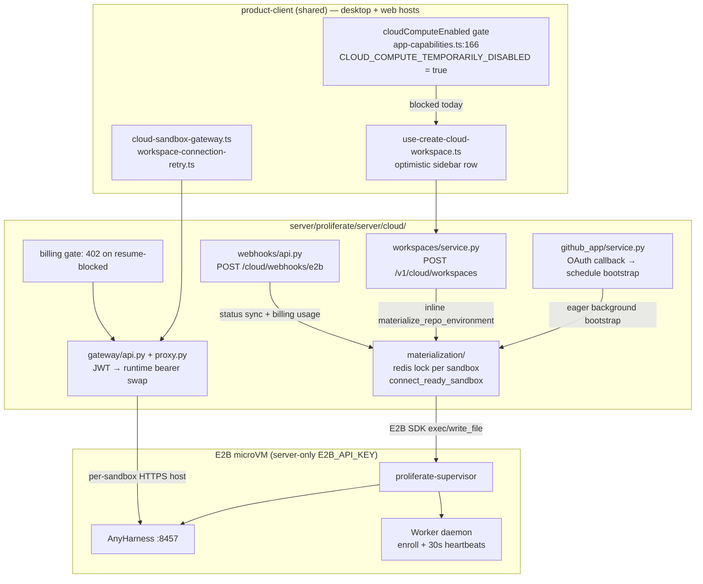

# Cloud Workspaces: Current System (2026-08-20)

Half-depth context pack. Companion to the existing Cloud Culling context docs (`01 How Cloud Workspaces Are Wired Today.md`, `02 Backend Cloud Machinery and External Systems.md`) in this same folder, which this doc does not repeat in full. Read those two first for the detailed grid-cell map; this doc adds the current-state facts that changed since 2026-08-14/16 and reframes everything around the near-term plan: founders running cloud workspaces themselves, on behalf of design-partner customers, before any self-serve customer-facing cloud exists.

## 1. Executive summary

The cloud workspace backend (E2B sandbox provisioning, materialization, gateway, worker fleet) is fully built, was live in production, and is architecturally sound: clean server/client trust boundary, idempotent materialization with per-sandbox locking, a real template release/rollback pipeline, and written incident runbooks. None of that was torn out.

What changed on 2026-08-15 is a client-side kill switch. `CLOUD_COMPUTE_TEMPORARILY_DISABLED = true` in `apps/packages/product-client/src/lib/domain/capabilities/cloud-compute.ts` (PR #1915, "Cloud Culling rung 1") flips `cloudComputeEnabled` to `false` everywhere the shared product-client code is used, which is both desktop and web — there is no web-specific override. New cloud workspace creation, "Migrate workspace," "Enable remote access," and "Open in web" are all gated off in the product UI right now, for every user, on every host. This was a deliberate, founder-directed cull (a UI/product decision, not an infra decision) with no host carve-out yet.

For a founder-operated pilot this matters directly: today, using the actual product UI to spin up a cloud workspace for a customer does not work, because the client gate blocks the create flow before any request reaches the server. The server-side API (`POST /v1/cloud/workspaces` and friends) is untouched and still fully functional if called directly or if the flag is flipped. So the fastest path to a pilot is almost certainly "flip the flag back (at least for an internal/operator surface) and drive the existing UI," not "build new tooling."

Beyond the flag, three real gaps stand between where the system is today and an external team self-serving cloud without founder hand-holding: no persisted workspace status/error column (status is derived, so operators have limited visibility into stuck states without DB access), workspace archive/delete never tears down the underlying sandbox or worktree (cleanup is manual/operator-driven), and the workspace-mobility engine (moving a materialized checkout between cloud and local) has zero callers on `main` — export/import of a cloud workspace to a customer's own machine does not exist yet as a product flow.

## 2. Architecture today

How a cloud workspace comes to exist, end to end, from a user clicking "New cloud workspace" through to a live AnyHarness session.

Provisioning chain, condensed:

1. GitHub App authority completes → eager background bootstrap creates the E2B sandbox from the rolling template, launches the supervisor, health-probes AnyHarness, pauses the VM. (`server/proliferate/server/cloud/runtime/bootstrap.py`)
2. User creates a workspace → the client gate above must be open → `POST /v1/cloud/workspaces` → `workspaces/service.py` validates GitHub authority, calls `connect_ready_sandbox` (creates/resumes the sandbox, launches the runtime if cold), inserts the `cloud_workspace` row, creates the AnyHarness worktree, CAS-writes `anyharness_workspace_id`.
3. All runtime traffic after that flows client → `/v1/gateway/cloud-sandbox/anyharness/{path}` → AnyHarness in the VM. The VM auto-pauses after 45 minutes idle; the next request is the wake trigger (E2B auto-resumes in about a second).
4. E2B webhooks drive a parallel status-sync + billing path (usage segments open/close on resume/pause/kill), independent of the request path.

Template release pipeline (separate from the runtime code path, but load-bearing for any operator changing what a fresh sandbox boots with): `Release Cloud Template` (`.github/workflows/release-cloud-template.yml`) builds AnyHarness + Worker + Supervisor into an image via `scripts/build-template.mjs`, publishes an immutable `sha-<shortsha>` tag, smoke-tests that exact ref, then promotes a rolling tag (`staging`/`production`) either through `_deploy-e2b.yml` or the manual `promote-cloud-template.yml`. Rolling-tag moves only affect newly created sandboxes; there is no atomic replace for already-running ones. Documented in `guides/operating/e2b-template-operations.md`.

Notably absent/stubbed in CI right now: the "Deploy Workers" workflow (`.github/workflows/_deploy-workers.yml`) is a placeholder — it checks a `WORKERS_DEPLOY_ENABLED` var and, even if true, errors with "no canonical worker command/service has been configured in this workflow yet." This appears to be a second, not-yet-wired deploy lane; it does not mean background workers are undeployed (Celery/background infra is provisioned separately via `server/infra/main.tf` / `background.tf`), but it is a loose end worth flagging if anyone assumes this workflow is load-bearing.

## 3. Key data models

All under `server/proliferate/db/models/cloud/`.

| Model | Key columns | Notes |
| --- | --- | --- |
| `cloud_sandbox` (`sandboxes.py:39`) | `sandbox_type` (only `'e2b'`), `provider_sandbox_id`, `status` ∈ {creating, ready, paused, error, destroyed}, `anyharness_base_url`, `runtime_token_ciphertext`, `anyharness_data_key_ciphertext` | One active personal sandbox per user via partial unique index on `owner_user_id WHERE destroyed_at IS NULL`. |
| `cloud_workspace` (`workspaces.py:20`) | `workspace_kind`, `repo_environment_id`, `git_branch`, `anyharness_workspace_id`, `archived_at` | **No persisted status/error column.** Status is derived at read time: `archived` if `archived_at`, else `materializing` if `anyharness_workspace_id` is null, else `ready`. Archive/restore/delete are pure DB writes — none tear down the AnyHarness worktree or the sandbox. |
| `cloud_workspace_materialization` (`workspace_materializations.py:21`) | `target_kind` = `managed_cloud` OR `local_desktop`, `worktree_path`, `state`, `generation` | Shared with local flows — `local_desktop` rows track local checkouts too. Don't treat this table as cloud-only. |
| `repo_environment` (`repositories.py:89`) | `environment_kind` ∈ {local, cloud} | Genuinely shared table between local and cloud. |
| `cloud_repo_environment_materialization` | `status` ∈ {pending, running, ready, error}, `applied_manifest_json` | The idempotency ledger for checkouts; CAS-guarded via `expected_updated_at`. |
| `cloud_runtime_worker` + enrollment | worker fleet identity | Also serves desktop dispatch, not cloud-only. |
| `cloud_secret_set` / `cloud_secret_env_var` / `cloud_secret_file` | `scope_kind` ∈ {personal, organization, workspace}, `version` | Version bump drives materialization diff. |

The load-bearing trap for anyone touching this area: several tables under `db/models/cloud/` are shared local/cloud infrastructure (`repo_environment`, `cloud_workspace_materialization` with `target_kind='local_desktop'`, `cloud_runtime_worker`). They look cloud-scoped by directory location but are not cloud-only in practice.

## 4. What works today vs what an operator-run pilot needs

Framing: the near-term plan is founders operating cloud workspaces *for* design-partner customers (forward-deployed), not customers self-serving. Self-serve is a later phase.

### Works end-to-end today (backend-verified, client currently gated)

- Full provisioning: GitHub App authorization → sandbox create/resume → repo checkout → secrets materialization → agent-auth state → AnyHarness worktree, all idempotent and lock-serialized per sandbox.
- Runtime access: gateway JWT-to-bearer swap, idle-pause at 45 minutes, sub-second wake on next request.
- Billing gate: 402 on resume when a spend hold is active; E2B webhooks close/open usage segments on pause/resume/kill.
- Template lifecycle: build, immutable-tag, smoke, promote, rollback — a real CI pipeline, not a manual process.
- Incident runbooks exist and look genuinely operational (`guides/operating/cloud-provisioning-failure.md`, `guides/operating/e2b-template-operations.md`), including explicit secret-handling rules for whoever triages a live incident.
- Orphan reaping (`cloud_sandbox_orphan_reap`) keeps billed sandboxes from leaking when the add-on is enabled.

### Blocking a pilot right now

- **The client gate.** `CLOUD_COMPUTE_TEMPORARILY_DISABLED = true` blocks workspace creation, migrate, remote-access, and "open in web" in the product UI on every host. There is no operator/internal-only bypass surface yet — flipping it is currently all-or-nothing across every user of the deployed client. Whoever runs the first pilot session needs this resolved (flag flip, environment-scoped override, or a direct-API tool) before touching the product UI.
- **No workspace-level status/error surfaced without DB access.** Since `cloud_workspace` has no persisted status/error column, diagnosing "why is this customer's workspace stuck" from outside a DB shell means either reading logs or deriving state manually. Fine for a founder with backend access; not fine for a wider team.
- **No teardown on archive/delete.** Deleting a Cloud workspace row never kills the sandbox or the worktree. An operator running several pilots needs a habit or a script to actually reclaim sandboxes, or costs/orphaned VMs accumulate silently (the orphan reaper only catches sandboxes that fall out of contact entirely, not ones that are merely abandoned but still heartbeat).
- **Workspace mobility does not exist as a live flow.** The AnyHarness mobility engine (`prepare_runtime_mobility_destination`, `create_worktree_at_ref`, etc.) and a `workspace_moves`/`mobility` server stack were both scoped (visible in an earlier in-flight branch as of 2026-07-03) but neither exists on `main` today — confirmed by absence of `server/proliferate/server/cloud/workspace_moves/` and `.../mobility/` directories. Handing a customer their own copy of a cloud workspace, or moving a pilot workspace off a founder's account onto the customer's, is not a supported product action yet.
- **Self-hosted vs hosted cloud story is still an open add-on gate, not a product-level answer.** `E2B_API_KEY` unset gracefully disables provisioning server-side; whether hosted production should keep it set while the client gate is also on is itself listed as an open question in the existing Cloud Culling doc set (needs-ruling, low priority there — but directly relevant if a pilot needs the real hosted stack live).
- **No org-scoped sandboxes.** Sandboxes are strictly per-user (`ensure_personal_cloud_sandbox_exists` is user-scoped; org-scoped sandboxes explicitly raise/return None). A pilot model where a customer *org* owns a shared cloud workspace isn't supported; today it's one sandbox per individual account.

## 5. Open design questions

1. **What is the actual mechanism for a founder-operated pilot to create cloud workspaces given `CLOUD_COMPUTE_TEMPORARILY_DISABLED`?** Options: flip the global flag back (re-exposes it to every user), add a host- or role-scoped override (e.g. web-only, or an internal operator build), or build/use a thin direct-API tool that bypasses the product UI entirely. Each has different blast radius and different build cost.
2. **Who owns a pilot's cloud workspace: the founder's account or the customer's?** Given sandboxes are strictly per-user with no org scoping, does the founder create workspaces under their own identity on the customer's behalf (simplest, but means the founder is a standing dependency and there's no clean handoff), or does the customer need their own account from day one even in a forward-deployed model?
3. **Does a pilot need workspace teardown/reclaim tooling before it needs anything else?** Given archive/delete never kills the sandbox and there's no persisted status column, is it acceptable to run early pilots with manual/DB-level cleanup, or does even a handful of design partners require a minimal "actually stop this sandbox and confirm it's gone" operator action first?
4. **Is workspace mobility (export/handoff to the customer's own machine or account) in scope for the pilot phase at all, or explicitly deferred to self-serve?** The engine exists in scaffolding form but has zero callers; deciding this now avoids the pilot silently creating an expectation ("can I take this workspace with me?") the product can't yet fulfill.
5. **Should hosted production keep `E2B_API_KEY` configured while the client gate stays on, and is that decision the same for a founder-operator pilot as for the eventual self-serve relaunch?** The existing Cloud Culling docs flag this as an open, low-priority question from the culling side; it stops being low-priority the moment a real pilot needs the backend live.
