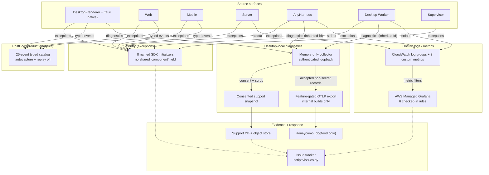
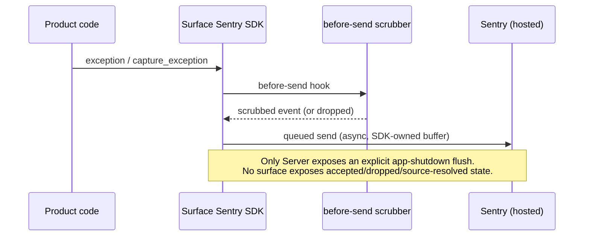
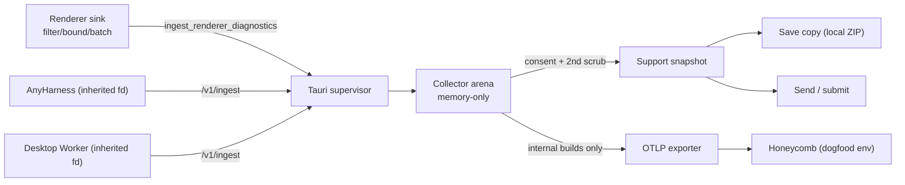
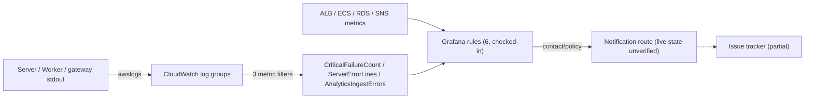
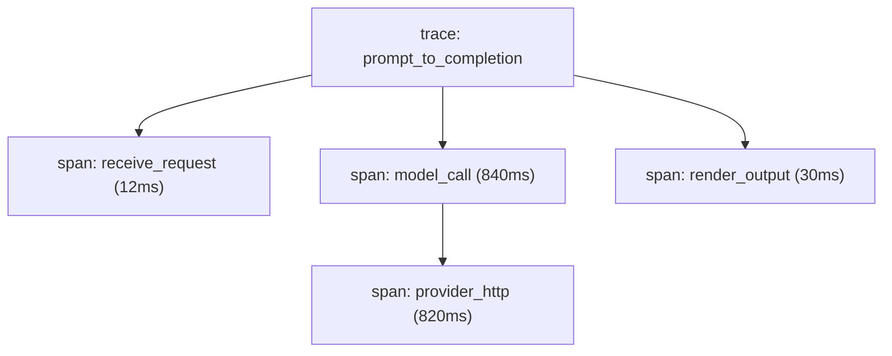
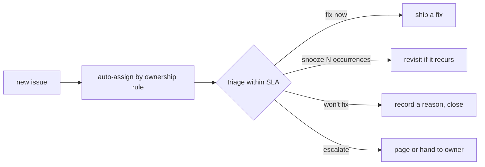

Status: Current-system context pack, prepared overnight 2026-08-19 → 2026-08-20 for ADR design work.
Repository: `/Users/pablohansen/proliferate`. Grounded against the overnight research pin `8532f52b226413458721b46839fc78b852b69373` and verified against `main` at `d0b7b585b71b5f064eb8ba290090d95e31d2ac5c` (2026-08-20 04:35 UTC).
Read this in about 20 minutes. Every claim about code carries a `file:line` pointer; every claim about a live provider carries the run that measured it. §8 is general external-system knowledge, clearly separated from claims about this codebase.

**Updated 2026-08-20 afternoon:** §10 is a verified deep-dive addendum added after Pablo ruled the end-state architecture. It covers the collector OTLP adapter's real configuration surface, how `internal-dogfood-export` gates the code, the exact release-gate check, the Grafana rule inventory and apply mechanism, the per-provider credential inventory for account recreation, and a set of corrections to §2 through §4. §10 uses explicit `[fact]` / `[inference]` / `[reported]` markers. It also records that the local checkout is 47 commits behind `origin/main`, which is the source of several stale citations circulating in adjacent documents.

# 1. Executive summary

Proliferate already runs six separate observability systems: Sentry (exceptions), PostHog (product analytics), CloudWatch/Grafana (hosted logs, metrics, alerts), a Desktop-local diagnostics collector (memory-only, feeds Support snapshots and an internal Honeycomb export), and a production issue tracker. None of these form one control plane. Each has a different owner, a different identity scheme, and a different proof surface, and several provider states are simply unread: not broken, unknown.

Overnight 2026-08-19 an "Observability Control Plane" program (`ADRs/Observability/Control Plane 2026-08-19/`) ran a three-lane live-provider audit, froze ten scoped specs (CP-00 through CP-09), and shipped nine of them as merged PRs before morning:

- Session replay is now source-disabled on every client surface: Desktop Sentry (#2083), Desktop PostHog (#2093), Web PostHog (#2096), Mobile PostHog (#2097).
- Server Sentry transport now enforces privacy at the transport boundary rather than trusting scrubbers alone (#2087, "CP-S2B").
- Client-side vendor privacy leaks (email/display-name surviving the shared scrubber) are closed (#2064, "CP-S2A").
- Support's Slack-notification receipt, which unconditionally recorded success even when Slack was unconfigured or failed, now records the truth (#2061, "CP-S1").
- Support's Save-copy flow, which silently dropped cleanup failures, now surfaces them (#2084, "CP-U1").
- A read-only Grafana metadata inventory now exists (#2085, "CP-G0").

What did not ship: `observe doctor`/`observe issue` (the proposed unified read-only operator CLI, CP-00A/09, spec only, no code), the full issue lifecycle (evidence to dedup to claim to fixing PR to recovery, CP-08B/09, spec only), and CP-D1 (profile-managed debug runtime activation, meant to close a real collector-restart delivery gap in the dev-only activation path, still an unopened spec, see §7).

Two independent findings should reset the reader's prior model. First, most "is this system working" questions are currently unknown, not green: Sentry/PostHog live event state, Grafana's live dashboards/rules/routes, and Honeycomb's live dataset freshness were all found unauthorized, unread, or empty during the overnight audit (§6). Second, two Postgres tables (`agent_model_snapshot`, `agent_catalog_override`) are live in production with no ORM model pointing at them and no drop migration, a direct side effect of the unrelated launch-options cutover (#2070) that merged the same day (§3, §7).

# 2. High-level architecture



Structural facts worth internalizing:

- **Four planes, one shared rule, no shared code.** Each destination gets a different minimum shape (exception/stack for Sentry, typed event for PostHog, small operation-result for central logs, richer record for the local collector), but the intended shared discipline is just `timestamp` + `component` + `environment` + `release` (`Control Plane 2026-08-19/01 - Shared Instrumentation Contract.md:17-24`). Today no Sentry initializer actually sets a field literally named `component`; the eight surfaces (Server, Web, Desktop renderer, Desktop native, Mobile, AnyHarness, Worker, Supervisor) use a `surface` tag and/or a component-prefixed release string instead.
- **The local collector never touches disk.** Retention is one bounded in-memory ring; the only disk writers in that subtree are the outage-only fallback log, the support artifact store, and (once shipped) the dogfood config plane's key file.
- **Internal OTLP export to Honeycomb is compiled out of every customer binary.** It rides a non-default Cargo feature (`internal-dogfood-export`); the release workflow greps every packaged binary for the endpoint env-var literal and fails the bundle if it's present (the grep is at `.github/workflows/release-desktop.yml:465`, inside the loop opened at `:464`; `:438` is the enclosing step header, see §10.4).
- **The alert-evaluation source is CloudWatch/Grafana, not Sentry.** `specs/OBSERVABILITY.md:37-38` states this explicitly; Sentry is diagnostic, never a product request's success condition.

# 3. Data models

## The diagnostics wire contract (`ProducerRecordV1`)

Everything inside the local-collector plane rides one record type (`anyharness/crates/proliferate-diagnostics-protocol/src/v1/types.rs:261`):

- schema `1.1` (accepts producer minors 1.1/1.0, never forward-compatible);
- producer identity: source timestamp, monotonic `producer_sequence` per (component, `producer_boot_id`), closed `ComponentV1` enum (`DesktopRenderer | DesktopTauri | DiagnosticsCollector | Anyharness | DesktopWorker | Server`), release, environment;
- the correlation spine: mandatory `operation_id`, optional `parent_operation_id`, `trace_id`, plus workspace/session/turn/item/request/target/prompt/workflow IDs, all skip-serialized when absent;
- `record_class`: `detailed` XOR `lifecycle`; any other combination rejects at ingest (`RecordClassV1` at `types.rs:23`, `LifecyclePhaseV1` at `:30`, `TerminalOutcomeV1` at `:37`, the field itself at `:296`). Note that no runtime producer emits the `lifecycle` class today; see §10.1;
- `privacy == secret` rejects outright, record-level and per-argument.

The collector's own state (`anyharness/crates/proliferate-diagnostics-collector/README.md:81`) is a process-local arena: accepted records in total order, a retention cursor, a lifecycle table, per-producer sequence state, health counters, all bounded under a 50 MiB total-process RSS ceiling (`anyharness/crates/proliferate-diagnostics-protocol/src/v1/limits.rs:29`), with the retained record arena separately capped at 32 MiB (`limits.rs:30`). It is entirely lost on every collector restart: a new boot ID and generation number replace it, which is exactly why the restart/reconnect path matters (§4, §7).

## Harness launch-options states (`HarnessLaunchOptionsState`)

The newly-cutover launch-options system (`#2070`, merged same day as the observability work, unrelated to it but relevant to §7 and §9) exposes a 6-state machine (`anyharness/crates/anyharness-lib/src/domains/agents/launch_options/types.rs:99-105`):

```
Detecting | Refreshing | Observed | ObservedEmpty | LastGoodAfterFailure | FailedWithoutObservation
```

`specs/OBSERVABILITY.md:10-25` names the five events this system is supposed to emit (`agent.launch_options_probe.completed`, `agent.launch_options.served`, `session.launch_selection.validated`, `session.initial_config.apply`, `session.live_config.changed`), each with a closed safe-field list (no selected values, model IDs, provider output, or paths). None of these states or events has a Grafana panel, alert, or dashboard today (§7), and the cutover already caused one production incident same-day, hotfixed by PR #2103 ("send raw target-observed control ids at session create").

## Orphaned Postgres tables (`agent_model_snapshot`, `agent_catalog_override`)

Confirmed live and orphaned:

- Both tables were created by earlier migrations (`server/alembic/versions/a9c0d1e2f3b4_agent_gateway_litellm_schema.py:254-300` creates `agent_catalog_override`; `server/alembic/versions/b7c1e4d9f082_agent_model_snapshot_rekey.py:1` renames `agent_catalog_snapshot` to `agent_model_snapshot`).
- PR #2070 deleted the `AgentModelSnapshot`/`AgentCatalogOverride` ORM classes entirely (no remaining reference anywhere under `server/proliferate/`, confirmed by direct grep).
- PR #2094's body states this explicitly: *"deleting the `AgentModelSnapshot`/`AgentCatalogOverride` ORM classes left 227 [wall-clock defaults, down from 230]... Both alembic migration files remain untouched under `alembic/versions/` — history stays replayable; only the test asserting an ORM equivalence that no longer holds was removed."* (quoted verbatim from the PR)
- Net effect: the tables are live in a production database today, nothing in the ORM metadata describes them, and no downgrade/drop migration exists. This is schema drift by omission, not by accident, and it is a decision item (§9).

## Support report row (CP-07)

```
support_report_id, created_at, environment, client release,
message + user-selected options,
snapshot included / scope / hash / size / coverage gaps,
stable failure stage + reason when unsuccessful,
safe session/trace reference when available,
submission status + receipt,
reporter-update opt-in + delivery state
```

`server/proliferate/server/support/service.py:477` is the exact boundary where report completion and Slack-notification truth used to diverge (fixed by #2061).

## Issue evidence row (CP-08B/09, spec, not yet built)

```
issue ID, status, severity, owner, timestamps
environment, affected component, release
bounded symptom + customer impact
immutable evidence references (provider + occurrence time, bodies stay at source)
claim + investigation conclusion
fixing PR + deployed release
recovery signal + verified recovery time
reporter follow-up state
audit history
```

The only piece of this that exists in code today is `scripts/issues.py:1` and `scripts/issues.py:295`: read commands (`list`, `poll`, `get`, `ops`) and mutation commands (`claim`, `release`, `patch`, `dedup`, `link-pr`) behind one shared credential; read and write authority are not separated yet.

## PostHog's live 25-event catalog

`apps/packages/product-client/src/lib/domain/telemetry/events.ts:56` is the shared typed source. The 25 names actually shipping in production: `agent_seed_hydrated`, `agent_seed_hydration_failed`, `app_update_available`, `app_update_check_started`, `app_update_download_started`, `app_update_install_failed`, `app_update_install_succeeded`, `auth_sign_in_failed`, `auth_signed_in`, `auth_signed_out`, `chat_pending_prompt_deleted`, `chat_pending_prompt_edited`, `chat_pending_prompt_steered`, `chat_pending_prompts_reordered`, `chat_prompt_submitted`, `chat_session_created`, `cloud_workspace_created`, `cloud_workspace_deleted`, `desktop_keychain_access_failed`, `desktop_minversion_block`, `runtime_connection_state_changed`, `screen_viewed`, `support_report_submitted`, `workspace_created`, `workspace_selected`. No session, agent, or workspace ID rides any of them.

# 4. Key flows end to end

## Unexpected failure to Sentry



Coverage is uneven: Server redacts sensitive-looking keys and bearer/JWT/path patterns (`server/proliferate/integrations/sentry.py:23`) but leaves some exception-frame context under-covered; Desktop-native has no explicit scrubber at all (`specs/OBSERVABILITY.md:143-145`, a documented, still-open gap); Worker and Supervisor lack the equivalent transaction-envelope coverage AnyHarness has. The one exception path that must never reach Sentry, child-agent stderr, is explicitly tagged and diverted (`specs/OBSERVABILITY.md:161-164`).

## Intentional product event to PostHog

Shared emitter (`trackProductEvent`) to host `ProductEvent` to per-surface adapter to identify + scrub to capture. Desktop allow-lists exactly six event names at its adapter boundary (`apps/desktop/src/lib/integrations/telemetry/client.ts:40`); Web forwards a broader arbitrary host-bound set (`apps/web/src/browser/telemetry/web-telemetry.ts:51`); Mobile emits only `mobile_screen_viewed`. Journey semantics are still incomplete: core-value has `chat_session_created` and `chat_prompt_submitted` but no first-output, usable-session, or turn-completed edge anywhere in the catalog.

## Local diagnostic to collector to Support / Honeycomb



Restart is survivable for the bundled child path: the supervisor's own tests exercise a killed collector restarting with a new generation and boot ID, and the child bridge re-acquires the new generation over the fd bridge (`apps/desktop/src-tauri/src/diagnostics_collector/supervisor_recovery_tests.rs:90-198`), while a `desktop.collector.restart` lifecycle record with a death certificate (trigger, exit code/signal, restart count) is always emitted (`apps/desktop/src-tauri/src/diagnostics_collector/supervisor/death_certificate.rs:68-91`). This part of the "collector dies and nobody notices" defect class is already closed for production bundled runs.

It is not closed for the debug-only externally-launched runtime path (`make dev` / `ANYHARNESS_DEV_URL`), which has no inherited fd and instead does one-shot activation from an env snippet. The code says so directly: *"Without the path (an old app build's 3-line file) a collector restart still ends delivery until the runtime restarts. Debug builds only."* (`anyharness/crates/proliferate-diagnostics-client/src/bridge/activation.rs:100-101`). Even the fixed variant only self-heals if the host keeps rewriting the snippet file and the producer keeps re-reading it (`activation.rs:97-126`); this whole path is `#[cfg(debug_assertions)]`-only and never ships in a release bundle, so it cannot leak into customer builds, but it does mean dev-profile telemetry silently goes dark on any collector restart unless that specific refresh wiring is present. CP-D1 was written to give this path a supported, coherent activation story (see §7); it is not merged.

## Hosted log to CloudWatch to Grafana to alert to issue



`report_critical(...)` writes the `CRITICAL_FAILURE` marker into the customer-facing Server log; a CloudWatch metric filter increments a counter (default zero, so the series stays populated); Grafana rule `bfrmh7e7x2k8wd` evaluates a five-minute sum (`specs/OBSERVABILITY.md:117`; rule source `server/infra/observability/grafana/production-alerts.json:1`). What happens after that (contact routing, actual Slack/PagerDuty delivery, resolution) was not verified live during the overnight audit because the canonical Grafana Viewer credential returned HTTP 401 and no local Admin token was available. No native CloudWatch alarm has a target configured (all 3 RDS alarms have actions disabled), so paging today runs entirely through Grafana, whose live state is unread.

# 5. What's built, merged, and deployed today vs. not

All PR states below are read live from GitHub, not inferred from the vault's mid-run notes (which had gone stale by morning; see the correction under CP-D1).

| Slice | What it does | PR | State |
| --- | --- | --- | --- |
| CP-S1 | Support Slack-notification receipt truth | [#2061](https://github.com/proliferate-ai/proliferate/pull/2061) | **Merged** 2026-08-19 12:18 |
| CP-S2A | Client vendor privacy closure (email/display-name leak) | [#2064](https://github.com/proliferate-ai/proliferate/pull/2064) | **Merged** 2026-08-19 12:19 |
| CP-C1S | Desktop Sentry session replay source-disabled | [#2083](https://github.com/proliferate-ai/proliferate/pull/2083) | **Merged** 2026-08-19 18:28 |
| CP-U1 | Support save-copy cleanup truth | [#2084](https://github.com/proliferate-ai/proliferate/pull/2084) | **Merged** 2026-08-19 18:35 |
| CP-G0 | Read-only Grafana metadata inventory | [#2085](https://github.com/proliferate-ai/proliferate/pull/2085) | **Merged** 2026-08-19 18:52 |
| CP-S2B | Server Sentry transport privacy enforcement | [#2087](https://github.com/proliferate-ai/proliferate/pull/2087) | **Merged** 2026-08-19 20:37 |
| CP-C1PD | Desktop PostHog session recording source-disabled | [#2093](https://github.com/proliferate-ai/proliferate/pull/2093) | **Merged** 2026-08-19 21:16 |
| CP-C1PW | Web PostHog session recording source-disabled | [#2096](https://github.com/proliferate-ai/proliferate/pull/2096) | **Merged** 2026-08-19 21:33 |
| CP-C1PM | Mobile PostHog session replay source-disabled | [#2097](https://github.com/proliferate-ai/proliferate/pull/2097) | **Merged** 2026-08-20 00:00 |
| CP-D0 | Debug activation guide correction | n/a | Superseded by CP-D1 before implementation, per its own review round 3 |
| CP-D1 | Profile-managed debug runtime activation (closes the dev-only collector-restart gap in §4) | none found | **Not merged, not open as a PR.** The overnight run's own notes claimed it was gated on open PR #2069; that PR number is real but now belongs to an unrelated topic's PR ("remove obsolete worktree retention policy", merged 2026-08-19). CP-D1 exists only as a frozen spec file (`Control Plane 2026-08-19/run-2026-08-19/specs/CP-D1 Profile-managed debug runtime activation.md`); treat the vault's PR reference as stale. |
| CP-00A / CP-09 | Unified `observe doctor` / `observe issue` read-only operator CLI | none | **Spec only**, no implementation started |
| CP-08B | Full issue lifecycle (evidence to dedup to claim to fixing PR to recovery) | none | **Spec only** |
| n/a | Harness launch-options cutover (unrelated program, but its production incident is a live example of the monitoring gap in §7/§9) | [#2070](https://github.com/proliferate-ai/proliferate/pull/2070) merged, hotfixed by [#2103](https://github.com/proliferate-ai/proliferate/pull/2103) | **Merged**, same-day prod incident and same-day fix |

Everything the founder authorized to ship overnight, shipped. What remains is exactly the connective-tissue layer: the unified operator CLI, the full issue lifecycle, and CP-D1.

# 6. Measured facts from the overnight live-provider audit

Recorded in `Control Plane 2026-08-19/run-2026-08-19/live-audit/*/verification-summary.md` and `.../provider-ui-readback/`.

- **Sentry:** a signed-in browser readback confirmed 8 active Proliferate projects with recent ingestion exist, but no authorized API/CLI read was ever completed, so grouping, ownership, alert rules, and freshness are still unverified at the repository level.
- **PostHog:** project `356553` is reachable and shows recent named events; the readback directly confirmed the (now-fixed) pre-patch email/display-name identity leak in captured events.
- **Honeycomb:** 7 datasets exist in the `dogfood` environment, but 4 of the core datasets showed zero logs over the prior 24 hours at read time. This is what "internal-only, dogfood" actually looks like in practice right now: not a steady stream, an intermittent one.
- **Grafana:** AWS confirms the `proliferate-ops` workspace is active; the canonical Viewer credential returned HTTP 401, and the browser path is blocked behind an IAM Identity Center username prompt. Net: live dashboards, rules, contacts, routes, and delivery history are all unread, not absent.
- **CloudWatch:** 16 log groups inventoried; exactly 3 live custom metrics exist (`CriticalFailureCount`, `ServerErrorLines`, `AnalyticsIngestErrors`), all undimensioned (no component/release label). 3 native RDS alarms exist; all have actions disabled.
- **Six checked-in Grafana rules** all treat "no data" as `OK` and "execution error" as alerting, which is safe only if a separate freshness signal exists, and none does yet.
- **None of the 8 Sentry surfaces sets a field literally named `component`.** Every surface uses `surface` and/or an embedded prefix in `release` instead, which is why cross-system joins are manual today.

# 7. Gaps

- **No unified read-only health command.** `observe doctor` is fully speced (CP-00A) but not built; today an operator strings together the self-hosted deploy doctor (`server/deploy/doctor.sh:1`, local-only), the Desktop diagnostics broker CLI (`apps/desktop/src-tauri-debug`, same-owner only), `scripts/issues.py`, and separate Grafana ops scripts: four different tools, four different credential models, no single "is the whole pipe healthy" answer.
- **No wired path from a production exception to a triaged, owned, recovery-verified ticket.** The full lifecycle in CP-08B/09 is spec only; the connectors that exist (Sentry/Grafana/Support to issue references) are partial and share read/write credentials.
- **Orphaned Postgres tables.** `agent_model_snapshot` and `agent_catalog_override` are live with no ORM model and no drop migration (§3). Nobody currently owns cleaning this up.
- **The dev-only collector-restart delivery gap is real but scoped.** It cannot reach a customer build (debug-only, `#[cfg(debug_assertions)]`), but it does mean a `make dev` profile can silently stop emitting diagnostics on any collector restart unless the newer env-snippet-refresh path is wired up (`activation.rs:100-101`). CP-D1 was written to fix this properly and remains unshipped.
- **The launch-options probe states have zero observability coverage.** `Detecting / Refreshing / Observed / ObservedEmpty / LastGoodAfterFailure / FailedWithoutObservation` and their five named events (`specs/OBSERVABILITY.md:10-25`) exist in code but appear in no Grafana panel, no alert, and no PostHog funnel, and this exact system had a same-day production incident (fixed by #2103) with no dashboard that would have shown it happening in real time.
- **Desktop-native Sentry still has no explicit scrubber:** a standing, documented gap (`specs/OBSERVABILITY.md:143-145`), unrelated to the CP program's replay fixes.
- **No duty owner or urgent route is named anywhere.** Both CP-00 and CP-07 list this as a required founder input that was never supplied (`Control Plane 2026-08-19/00 - Program Map and Execution Process.md:126-129`, `08 - Alerting and Paging.md:44`).
- **The "hosted vs. local" line for detailed telemetry is still a live decision, not a settled fact.** The program map itself flags it as open (§9, item 2).

# 8. Domain knowledge and best practices (general knowledge, not facts about our codebase)

Everything in this section is standard external-system knowledge: how Sentry, PostHog, and distributed tracing actually model the world, plus patterns a small team commonly uses to run production. None of it describes what Proliferate has built; §2 through §7 are the only sections above that make claims about this repository, and §5/§6 are the only ones grounded in a live measurement.

## How Sentry models the world

Sentry's object hierarchy, top to bottom: an **organization** contains **projects** (typically one project per deployable component or service); every captured event belongs to exactly one project and carries an **environment** tag (production, staging, dev) used purely for filtering, not for grouping.

A **release** is a version identifier, conventionally `<name>@<version>+<build>`, associated with the commit range that produced it. Attaching source maps or debug symbols to a release is what lets Sentry resolve a minified stack trace or a stripped Rust binary back to real file:line locations. Releases are also the unit release health measures (below).

An **event** is one occurrence: a single captured exception or message. An **issue** is a group of events sharing a fingerprint. The default grouping algorithm hashes normalized stack frames (function, module, filename), marking vendor and library frames as "not in-app" so grouping keys on the frames that are actually yours. When default grouping is wrong (too many issues for the same root cause, or one issue swallowing unrelated causes), a project can supply an explicit fingerprint:

```python
sentry_sdk.capture_exception(
    err,
    fingerprint=["model-timeout", error.provider, error.model_id],
)
```

That collapses every timeout from a given provider/model pair into one issue regardless of which call site or stack shape triggered it.

**Release health / session tracking** is a separate subsystem from error tracking. SDKs track "sessions" (an app launch, a page load, a request) independent of whether an error occurred, and report crash-free session rate and crash-free user rate per release. This is the standard metric for gating a rollout: a release with a normal error count but a crash-free rate that dropped from 99.8% to 97% is the thing to halt on, not raw issue count, because absolute counts are meaningless without a comparable install-base baseline.

**Alert rules** come in two kinds. Issue alerts fire on a new issue, a regression (a previously resolved issue reopening), or an occurrence-rate threshold within a project. Metric alerts fire on an aggregate, such as error rate over N minutes or crash-free rate below a threshold, and can page independently of whether any single issue looks alarming. Issue **ownership rules** (path-based or team-based) auto-assign new issues so they don't all land in one unowned queue, and issue **states** (unresolved, resolved, ignored/muted for N occurrences or N time) are what keeps a backlog from becoming permanent background noise.

## Relevant PostHog concepts

PostHog's raw unit is an **event** with arbitrary properties, captured via `capture(event, properties)`. A **person** is the identity an event resolves to; an anonymous `distinct_id` merges into an identified person the moment `identify()` runs, and person properties (persistent, e.g. plan tier) are distinct from event properties (per-occurrence, e.g. which button).

**Autocapture** instruments every click and page view automatically: high volume, low signal, and it captures DOM structure that can leak more than intended. The alternative, and the one considered best practice for a product with real privacy constraints, is a small typed catalog of intentional events with a stable naming convention (commonly `object_verbed`, e.g. `workspace_created`) and an explicit property schema per event, so a property's meaning can never silently change underneath existing dashboards.

A **funnel** is an ordered sequence of events with a conversion window; PostHog computes the drop-off between each step and the elapsed time. This is the standard tool for "how many people who did X went on to do Y within Z minutes," which is exactly the shape of an activation or core-value journey. **Cohorts** group persons by property or behavior for retention analysis. **Session replay** is a separate opt-in recording capability with its own masking configuration (input masking, block/mask by CSS selector) and should be treated as a distinct privacy surface from ordinary event capture, not a free extra.

## Tracing fundamentals

A **trace** represents one logical end-to-end operation (a request, a turn, a job). It is composed of **spans**: each span is one bounded unit of work with a name, a start and end time, a set of attributes, and a parent-child link to other spans, forming a tree.



Distributed propagation uses the **W3C Trace Context** standard: a `traceparent` header carries the trace ID, the calling span's ID, and sampling flags across a process or service boundary, so independently-instrumented services can reconstruct one shared tree.

**OTLP** (OpenTelemetry Protocol) is the vendor-neutral wire format, over gRPC or HTTP with protobuf or JSON, for exporting traces, logs, and metrics. Sending data to a given backend (Honeycomb, Grafana Tempo, or anything else) is just pointing an OTLP exporter at that backend's endpoint with its credentials; the instrumentation code itself never names a vendor.

**Sampling** decides which traces survive to the backend. Head-based sampling decides at trace start (keep a fixed 10% regardless of outcome); tail-based sampling waits until the whole trace is known and keeps traces by outcome (every trace with an error, every trace over a latency threshold, a small sample of the rest). Tail-based sampling needs a collector that buffers spans until a trace completes, which is a real infrastructure cost head-based sampling avoids.

The three primitives are not interchangeable: a span answers "how long did this bounded operation take and what happened inside it," a log answers "what happened at this instant," and a metric answers "how many, or how much, over time" as a pre-aggregated number. Reaching for a log where a span was the right shape loses duration and causality; reaching for a metric where a log was needed loses the specific instance that mattered.

## Best-practice patterns for a small team running production

**The error triage loop.** A new issue lands, gets auto-assigned by an ownership rule, and gets a triage decision within a fixed SLA (commonly "by next business day" for a small team): fix now, snooze for N occurrences, mark won't-fix with a recorded reason, or escalate.



The loop only works if "unresolved" never becomes a place issues go to be silently ignored; an unbounded unresolved count trains the team to stop reading it, which is the failure mode this program's own alerting doc already names (§7).

**Release-health gates, not error-count gates.** Before widening a rollout from canary to full, the standard check is crash-free session rate and crash-free user rate against the previous release's own baseline, never an absolute error count in isolation. A release with more total errors than the last one because it also has more users is not a regression; a release with a lower crash-free rate at the same traffic almost always is.

**Alert-fatigue avoidance.** Page only for what a human must act on right now: a customer-facing SLO burning down fast, or a "must never happen" invariant breaking. Everything else (recoverable retries, expected degraded-mode fallbacks, slow capacity drift) belongs in a log or a daily/weekly digest issue, not a page. An alert without a named owner, a runbook, and a recovery condition should not exist; this is already the stated rule in this program's own alerting spec (`Control Plane 2026-08-19/08 - Alerting and Paging.md`, cited in §7), and it is standard practice well beyond this codebase.

**What to page vs. what to log, concretely:**

```text
page:   checkout is down for all customers
page:   the monitoring pipeline itself stopped emitting signal
log:    a retry succeeded on attempt 2
log:    a background job fell into an expected degraded-mode fallback
digest: capacity trending toward a threshold over the next two weeks
```

**Small-team-specific bias.** A two-person team cannot staff 24/7 on-call, so the highest-leverage investment is usually making failures recoverable by the system itself (retries, circuit breakers, graceful degradation) rather than paging a human for anything that resolves on its own within a few minutes. Paging should be reserved for genuinely unrecoverable, customer-visible breaks; everything below that line should degrade quietly and show up in a digest, not a phone buzzing at 3am.

# 9. Open design questions for Pablo

1. **Universal source identity now, or unify only at the query layer?** Making every Sentry initializer (8 surfaces) and every hosted log formatter emit a literal `component`/`environment`/`release` triple is a real rewrite across the whole surface area. Deferring it keeps every cross-system join manual indefinitely, and it's the single fact the overnight audit flagged as blocking almost every other claim ("no shared discriminator"; §2, §6).

2. **Detailed/lifecycle telemetry: stay client-only for launch, or approve a small hosted operational-event route?** Staying local preserves the current privacy stance (no prompts/transcripts/tool output ever leave the device) but starves Grafana and any future alerting of the richest signal available. A hosted route reopens exactly the "customer content in central telemetry" line the whole diagnostics protocol was built to avoid.

3. **Build the unified `observe` CLI before or after Grafana dashboards/alerting?** Building it first gives an early, trustworthy health surface but means alerting ships with no consumer to interrogate a page. Building it last risks shipping alerts nobody can actually triage without four separate tools.

4. **Issue-tracker scope: repair the existing Sentry/Grafana/Support connectors only, or commit to the full lifecycle (claim to investigation to fixing PR to deployed release to verified recovery)?** Connector repair is bounded and shippable soon; the full lifecycle is the actual "path from exception to owned ticket" the founder has asked about, but it's a materially bigger program (CP-08B/09 combined).

5. **Drop the orphaned `agent_model_snapshot`/`agent_catalog_override` tables now, or leave them as documented drift?** Dropping needs a reviewed migration and a rollback story; leaving them live risks a future schema/security audit flagging tables with no code owner and no ORM visibility.

6. **Ship CP-D1 now, or accept the dev-only collector-restart gap as tolerable risk?** It cannot reach production (debug-assertions-gated), but it does degrade the team's own dogfooding signal quality on any collector restart during local development.

7. **Name the launch-week duty owner and urgent route.** Every alerting/paging spec in the CP program (CP-00, CP-07) is blocked on this input and has been since the program was scoped.

8. **Give the launch-options probe states (`Detecting`/`ObservedEmpty`/etc.) a dashboard now, given today's same-day production incident, or fold them into the general Sentry/CI safety net until the "prompt-to-visible-completion" journey dashboards land?** The states already exist and already caused one incident; the question is purely sequencing against the rest of the Grafana buildout in §4/§6.

# 10. Addendum: verified deep dive, 2026-08-20 afternoon

Added after Pablo ruled the end-state architecture. Scope: the load-bearing unknowns the morning pass left open, plus corrections to claims above that did not survive re-verification. Grounded against `origin/main` at `8b6dc1f442`. Claims in this section carry an explicit epistemic marker: `[fact]` means read directly out of the cited file at the cited line, `[inference]` means derived from facts and labelled as reasoning, `[reported]` means asserted by a person or a prior document and not independently confirmed here.

**Read this before re-checking any citation in this pack.** `[fact]` The local checkout of `/Users/pablohansen/proliferate` sits on branch `codex/harness-launch-options-cutover` at `572595f83d`, which is 47 commits behind `origin/main` and is not an ancestor of it. `[inference]` Line numbers and even symbol existence differ between the two; several stale claims corrected below trace directly to someone verifying against that checkout instead of `origin/main`. Verify against `origin/main`.

## 10.1 The lifecycle gap: the single most consequential correction

`[fact]` The five harness launch-option events named in `specs/OBSERVABILITY.md:15-26` are `tracing::info!` call sites carrying an `event = "..."` field, at `anyharness/crates/anyharness-lib/src/domains/sessions/service/create.rs:317-329` (accepted) and `:523-533` (rejected), `.../domains/agents/launch_probe/attempt.rs:36-45`, `:84-95`, `:108-116` (three outcome arms), `.../live/sessions/actor/config/handle.rs:294-301`, `.../live/sessions/actor/config/persist.rs:160`, and `.../api/http/agent_launch_options.rs:41`.

`[fact]` The diagnostics tracing layer converts every tracing event into a record whose class is **detailed**, never lifecycle: `anyharness/crates/proliferate-diagnostics-client/src/tracing_layer/mod.rs:235` is `on_event`, and every branch of the name resolution at `:272-287` produces a `DetailedKindV1` of `Log`, `SpanEvent`, or `Stdio`.

`[fact]` `anyharness/crates/proliferate-diagnostics-client/src/lib.rs:148` exposes `try_emit_detailed` as the producer client's only emit method. There is no lifecycle emission API in the runtime client.

`[fact]` The only producer of lifecycle records anywhere in the repository is the Tauri process supervisor, at `apps/desktop/src-tauri/src/diagnostics_collector/producer/lifecycle.rs:96` and `:188`, restricted to eight names by `apps/desktop/src-tauri/src/diagnostics_collector/producer.rs:33-42`: `desktop.collector.start|restart|stop`, `desktop.anyharness_process.start|restart|stop`, `desktop.worker_process.start|stop`, with terminal classifications drawn from a fixed 16-entry table at `producer.rs:44-59`.

`[fact]` The wire contract's lifecycle operation catalog is closed and holds 91 P0 names across 8 families (`anyharness/crates/proliferate-diagnostics-protocol/src/v1/catalog.rs`): collector 4, desktop supervisor 8, desktop application 17, desktop support 2, **anyharness 31**, desktop worker 4, server transport 4, server domain 21. A lifecycle record whose name is outside the catalog is rejected at ingest (`.../v1/validation.rs:84`).

`[fact]` Zero of the 31 `anyharness.*` catalog operations are emitted by any code path. The four most relevant already exist as legal names: `anyharness.session.create` at `catalog.rs:63`, `anyharness.turn.execute` at `:65`, `anyharness.agent.start` at `:66`, `anyharness.model.request` at `:71`.

`[inference]` A lifecycle-only customer export shipped today would carry process-supervision records and nothing product-facing. The pipe therefore has two segments: instrument the runtime with real lifecycle records first, then export. Any plan that treats "the events already emit" as meaning the SLIs are one filter away is wrong by roughly the size of the instrumentation work.

## 10.2 The collector OTLP adapter: actual configuration surface

`[fact]` Destination configuration is two environment variables and nothing else, defined at `anyharness/crates/proliferate-diagnostics-collector/src/export/target.rs:11-12`: `PROLIFERATE_DIAGNOSTICS_OTLP_ENDPOINT` and `PROLIFERATE_DIAGNOSTICS_OTLP_HEADERS`. Read once at startup by `target::from_environment` at `:45-57`.

`[fact]` Parsing rules at `target.rs:59-81`: the endpoint must be a URL; scheme must be `https`, or `http` only when the host is loopback (`127.0.0.0/8`, `::1`, or the literal `localhost`, decided at `:83-90`); a path not already ending in `/v1/logs` gets `/v1/logs` appended.

`[fact]` Header rules at `target.rs:94-119`: comma-separated `name=value` matching the `OTEL_EXPORTER_OTLP_HEADERS` convention, at most 16 headers, names restricted to alphanumerics plus `-_.` and lowercased, values non-empty, at most 4096 bytes, and visible ASCII only.

`[fact]` `ExportTarget` has no `Clone`, no `Serialize`, and a hand-written `Debug` that prints the header count followed by `[REDACTED]` and never a value (`target.rs:18-33`, asserted by the test at `:208-215`).

`[fact]` Three configuration outcomes exist (`target.rs:36-43`, consumed at `src/export/present.rs:35-56`): `Absent` when the endpoint variable is unset or blank, which yields `Sink::Off` and allocates no queue and spawns no task; `Invalid` when parsing fails, which marks the exporter degraded with classification `invalid_configuration` and counts every offered record as dropped; and `Configured`, which builds the queue and worker.

`[fact]` A third variable, `PROLIFERATE_DIAGNOSTICS_DEV_TAG`, is read once and cached at `src/export/mod.rs:34,44-53`, falling back to `$USER`, and is exported as the `dev.user` resource attribute so teammates sharing one dogfood environment are distinguishable.

`[fact]` No vendor name appears anywhere in the crate. The module header at `src/export/mod.rs:11-14` states the wire contract is OTLP/HTTP JSON logs and that provider identity and credentials stay outside the contract.

`[fact]` The payload shape is set by `src/export/otlp.rs`. Resource attributes at `:80-97` are `service.name` (from the component enum), `service.version` (release), `service.instance.id` (producer boot id), `deployment.environment.name`, `telemetry.sdk.name`, plus `dev.user` when configured. Record attributes at `:134-206` always include `proliferate.name`, `proliferate.record_class`, `proliferate.component`, `proliferate.source`, `proliferate.producer_boot_id`, `proliferate.privacy`, `proliferate.redaction`, `proliferate.producer_sequence`, `proliferate.accepted_order`, `proliferate.retention_cursor`, and `proliferate.operation_id`, then conditionally `parent_operation_id`, `trace_id`, `workspace_id`, `session_id`, `turn_id`, `item_id`, `request_id`, `target_id`, `prompt_id`, `workflow_id`, and `error_classification`. Lifecycle phase, finalizer, and outcome are appended at `:208-231`.

`[fact]` The encoder is a second privacy fence: records classified `Secret` are dropped rather than encoded and the refusal is counted (`otlp.rs:36-44`), and secret-classified arguments are skipped again at `:194-199`.

`[fact]` `install_id` is not in the wire protocol. `anyharness/crates/proliferate-diagnostics-protocol/src/v1/types.rs:261-303` (`ProducerRecordV1`) has no such field, and the OTLP encoder emits no such attribute.

`[fact]` Worker bounds at `src/export/worker.rs:26-39`: a 512-record queue, 128-record or 512 KiB batches, a 250 ms linger, a 10 s request timeout, one attempt plus two retries at 250 ms and 1 s, a 30 s cooldown after 5 consecutive failed batches, and a 1 s shutdown flush that is explicitly never a shutdown gate.

`[fact]` Backpressure is **drop-newest**: `src/export/present.rs:83-93` calls `try_send` and counts the offered record as dropped when the channel is full, documented at `worker.rs:24-26` as "an overflowing queue drops the newest record rather than applying back pressure to the accepting ingest path".

`[fact]` Failure classifications are a fixed 7-entry table (`src/export/classification.rs:9-56`): `invalid_configuration`, `encode`, `connect`, `timeout`, `http_client_error`, `http_server_error`, `request`. The module header states the published classification is never built from a provider message, URL, or response body, so `/v1/health` cannot echo a destination or credential.

`[fact]` The record class is available at the exact line the exporter is offered the record but is discarded: `src/state/ingest.rs:306-312` builds `StoredRecord { cursor, version, record_class, component, encoded }`, and `:318` then calls `self.exporter.offer(&encoded)`. `[inference]` This is the natural insertion point for a class filter, and it is a signature change on `offer` plus one comparison, not a restructure.

## 10.3 How `internal-dogfood-export` gates the code paths

`[fact]` The feature is declared empty and non-default at `anyharness/crates/proliferate-diagnostics-collector/Cargo.toml:14`.

`[fact]` The gate is module substitution, not runtime branching: `src/export/mod.rs:16-18` uses `#[cfg_attr]` to bind `mod handle` to `present.rs` when the feature is on and `absent.rs` when it is off, and `:20-27` compiles `classification`, `otlp`, `target`, and `worker` only under the feature.

`[fact]` `src/export/absent.rs:12-33` is the customer build: `ExporterHandle` is a unit struct, `offer` is an inlined no-op, `spawn` and `shutdown` do nothing, and `health()` returns the constant `Disabled` state with zero drops. `[inference]` A customer binary therefore contains no HTTP client, no queue, no destination read, and no credential handling for this path, which is what makes the absence-proof release gate meaningful today.

`[fact]` Even with the feature on, nothing is exported until a destination is configured out of band, per the module header at `src/export/mod.rs:8-9` and the `Sink::Off` path at `present.rs:38`.

`[fact]` CI runs the dogfood-feature test as its own step: `.github/workflows/ci.yml:276` runs `cargo test -p proliferate-diagnostics-collector --features internal-dogfood-export`, and the end-to-end proof lives at `anyharness/crates/proliferate-diagnostics-collector/tests/otlp_dogfood.rs` behind `#![cfg(feature = "internal-dogfood-export")]` at `:17`.

`[fact]` Enabling the path for a developer requires more than the two OTLP variables. `guides/local/dev-profiles.md:185-196` states a default collector build cannot export at all and that the developer must build the collector with the feature and point `PROLIFERATE_DIAGNOSTICS_COLLECTOR_BIN` at it. `:201-215` adds that any profile setting `ANYHARNESS_DEV_URL` runs the runtime externally, so it never inherits the control-bridge descriptor and its producer stays disabled unless `PROLIFERATE_DIAGNOSTICS_BRIDGE_ENDPOINT` is also set, which is why session, turn, ACP, and subagent records go silently missing in dev.

## 10.4 The release-gate check, exact shape

`[fact]` The step is "Verify packaged native binary inventory" at `.github/workflows/release-desktop.yml:438`, macOS-only (`:439`), operating on `Proliferate.app/Contents/MacOS`.

`[fact]` It first asserts an exact directory inventory of five binaries (`:445-450`: `anyharness proliferate proliferate-debug proliferate-diagnostics-collector proliferate-worker`), then for four of them checks presence, executability, absence of the literal `diagnostics collector placeholder`, and codesign validity (`:451-459`).

`[fact]` The OTLP absence proof is a separate loop over all five binaries at `:464-469`, and the grep itself is at **`:465`**: `if grep -a -q "PROLIFERATE_DIAGNOSTICS_OTLP_ENDPOINT" "$bin_dir/$binary"; then` followed by `echo "::error::Packaged $binary carries the internal OTLP export path"` and `exit 1`. The comment explaining it occupies `:460-463`.

`[reported]` §2 of this pack cites `:438` for the grep and a prior plan of record cited `:463`. `[fact]` `:438` is the step header and `:463` is the last line of the comment. Both are wrong for the grep; the grep is at `:465`.

`[inference]` Shipping the adapter into customer builds inverts this gate's premise, because the endpoint literal will then be present in every packaged binary and the gate will fail the first release after the change. A replacement assertion has to land in the same PR.

## 10.5 Grafana: rule inventory and how rules are applied

`[fact]` Six rules are frozen by UID, title, and severity in code at `scripts/ops/grafana-alerting.mjs:39-47`: `dfrmh7bc4yqrkf` "ALB 5xx > 10 in 5m" critical, `bfrmh7c7ecbnkb` "API p95 Latency > 5s for 10m" critical, `cfrmh7d7od8g0c` "ECS CPU > 90% for 15m" critical, `bfrmh7e7x2k8wd` "CRITICAL_FAILURE in prod logs" critical and the only log-backed rule, `cfrmh7f2sbe2od` "Analytics ingest errors" critical, `cfrmh7fttw4jke` "Server error rate > 10 in 10m" warning.

`[fact]` `verifyUidAllowlist` at `:143-161` throws on any unknown UID, throws on duplicates, and throws unless exactly those six are present. `[inference]` Adding a seventh rule or retiring one is an edit to the `KNOWN_RULES` constant plus a gated live apply, never a Grafana UI action.

`[fact]` Every rule must carry a `runbook_url` annotation or `assertApprovedMetadata` throws (`:197-199`). Labels are restricted to `proliferate_rule_uid`, `proliferate_component`, `severity` (`:50`, enforced `:174-189`), `proliferate_component` must equal `proliferate-server`, and the three log-lookup annotations may appear only on `bfrmh7e7x2k8wd` (`:202-225`), pinned to log group `/ecs/proliferate-prod`, filter pattern `CRITICAL_FAILURE`, region `us-east-1`.

`[fact]` The checked-in rule definitions live at `server/infra/observability/grafana/production-alerts.json`, phase `e1-phase1`, captured 2026-07-14 via a GET-only ruler read with the Viewer credential. All six sit in rule group `production-alerts`, all six are `noDataState: OK` and `execErrState: Alerting`, none is paused, and the pending periods are 0s except p95 latency at 10m and ECS CPU at 15m. All six `runbook_url` values point into `guides/operating/production-alerts.md`.

`[fact]` Live operations refuse the network unless `GRAFANA_ALERTING_LIVE=1` (`assertLiveAllowed`, `:332-339`), whose error text describes the gate as Phase 2 conditioned on slice A acceptance. `runCheck` at `:361-383` is fully offline: it validates both checked-in artifacts, recomputes each rule's `queryChecksum` as sha256 over canonical JSON of the captured query model, and optionally diffs against a snapshot.

`[fact]` The write path is export, then apply, then optional restore. `runExport` at `:409-445` lists live rules, re-verifies the allowlist, asserts live rules match the checked-in checksums, then writes a private mode-0600 rollback receipt containing normalized rules, contact points, notification policy, and the full Alertmanager config. `runApply` at `:449-506` overlays **only labels and annotations**, preserving each rule's query model byte for byte, hard-rejects on any title change or checksum drift against the receipt, and refuses to recreate a rule.

`[fact]` The target is not configurable from the environment: `scripts/ops/grafana-client.mjs:17-23` freezes AWS account `157466816238`, region `us-east-1`, workspace `g-e532d030d8` named `proliferate-ops`, Grafana 10.4, and `:28` derives the base URL from that constant alone. `fixedWorkspaceUrl` at `:36-46` rejects any path or origin that does not match.

`[fact]` Credentials: the operator Admin token is read at request time from `~/.proliferate-local/ops/grafana-admin.token` and the file must be mode 0600 and non-empty or the provider throws (`grafana-client.mjs:30`, `:181-194`). Secret resolution first asserts the AWS caller is in the target account (`:206-224`) and then reads a named field from AWS Secrets Manager (`:229-267`). Two secrets are referenced: `issue-tracker/app` field `grafanaWebhookSecret` for the tracker webhook Bearer (`:271-273`), and `issue-tracker/sources` field `grafanaToken` for the read-only Viewer token (`:276-279`).

`[fact]` The Grafana to issue-tracker route exists as a validated checked-in artifact and is deliberately inert. `server/infra/observability/grafana/issue-tracker-contact.json` defines contact point `issue-tracker-webhook`, type `webhook`, POST to `https://issues.proliferate.com/v1/ingest/grafana`, `maxAlerts: 0`, `authorization_scheme: Bearer` with the credential named only by `secretRef`, and `sendResolved: true`. Its own description states that E1 creates the contact point and proves it exists but "no notification policy references it, so it cannot deliver a business alert or health canary to the tracker until E2 activates it." The file also records that HMAC signing is unsupported on Grafana 10.4 and deferred.

`[fact]` That darkness is mechanically enforced: `runApply` captures the notification policy checksum before and after and throws "Notification policy changed during apply; this operation must not mutate it" if it differs (`grafana-alerting.mjs:499-503`).

`[inference]` Wiring alerts into the response queue is therefore a narrower job than "routing does not exist" suggests: the endpoint, the contact point, the credential reference, the resolved-notification behavior, and the validation are all built. What is missing is the notification-policy branch that points a route at the existing receiver, plus the Sentry side of the fan-in.

`[fact]` `server/infra/background.tf` declares 10 CloudWatch log metric filters (`background_oldest_due_age`, `background_relay_failed`, `background_relay_heartbeat`, `background_recovered_leases`, `background_supported_pending_health_noop`, `background_task_success`, `background_task_retry`, `background_task_failure`, `background_terminal_rows`, `background_queue_age`). `[reported]` The background subsystem is dormant, so these instrument a system nobody currently runs.

## 10.6 Provider credential and environment inventory, per surface

Assembled for account recreation. Every entry below is `[fact]` from `specs/developing/reference/env-vars.yaml` plus the cited consumption site.

**Sentry.** GitHub secret `SENTRY_AUTH_TOKEN` (`.github/workflows/release-desktop.yml:312`, `:476`). GitHub vars `SENTRY_ORG`, `SENTRY_URL`, `SENTRY_PROJECT`, `SENTRY_DESKTOP_RENDERER_PROJECT`, `SENTRY_DESKTOP_NATIVE_PROJECT`, `SENTRY_ANYHARNESS_PROJECT` (`release-desktop.yml:312-315`, `:476-481`). Build-time DSNs `VITE_PROLIFERATE_SENTRY_DSN`, `PROLIFERATE_DESKTOP_SENTRY_DSN`, `ANYHARNESS_SENTRY_DSN` (`release-desktop.yml:74`, `:80`, `:83`; catalogued at `env-vars.yaml:1118`, `:1204`, `:1228`). Server `SENTRY_DSN` (secret), `SENTRY_ENVIRONMENT` (default `trusted-beta`), `SENTRY_RELEASE`, `SENTRY_TRACES_SAMPLE_RATE` (`env-vars.yaml:870-892`; consumed at `server/proliferate/integrations/sentry/client.py:76-90`; environment injected at `.github/workflows/_deploy-server.yml:600-603`). Cloud sandboxes `CLOUD_RUNTIME_SENTRY_DSN`, `CLOUD_TARGET_SENTRY_DSN` (both secret) plus their `*_ENVIRONMENT`, `*_RELEASE`, `*_TRACES_SAMPLE_RATE` siblings (`env-vars.yaml:730-782`); the three `*_SENTRY_RELEASE` overrides are refused unless they canonically name their own component. Mobile `EXPO_PUBLIC_PROLIFERATE_SENTRY_DSN`, `EXPO_PUBLIC_PROLIFERATE_SENTRY_TRACES_SAMPLE_RATE` (`env-vars.yaml:1176-1187`; consumed at `apps/mobile/src/lib/integrations/telemetry/config.ts:46-69`). Renderer `VITE_PROLIFERATE_SENTRY_TRACES_SAMPLE_RATE`, `VITE_PROLIFERATE_SENTRY_ENABLE_LOGS` (consumed at `apps/desktop/src/lib/integrations/telemetry/config.ts:36-54`, `apps/web/src/browser/telemetry/install-web-telemetry.ts:67-93`).

`[fact]` The renderer sourcemap step preflights the project with a live API call against `${SENTRY_URL}/api/0/projects/${SENTRY_ORG}/${SENTRY_PROJECT}/` and fails the release when it is not accessible (`release-desktop.yml:325-336`). `[inference]` A fresh org with different project slugs breaks the release until those GitHub vars are updated.

**PostHog.** Project write key `VITE_PROLIFERATE_POSTHOG_KEY` and `EXPO_PUBLIC_PROLIFERATE_POSTHOG_KEY`, host `VITE_PROLIFERATE_POSTHOG_HOST` and `EXPO_PUBLIC_PROLIFERATE_POSTHOG_HOST` defaulting to `https://us.i.posthog.com` (`env-vars.yaml:1136-1147`, `:1188-1199`; consumed at `apps/desktop/src/lib/integrations/telemetry/config.ts:37,62`, `apps/web/src/browser/telemetry/install-web-telemetry.ts:68,101`, `apps/mobile/src/lib/integrations/telemetry/config.ts:47,77`; injected in CI at `release-desktop.yml:77-78`). `[reported]` No PostHog read credential exists anywhere on this machine; a personal API key with query-read scope is a fresh-account requirement, and its absence is why PostHog liveness was unreadable during the overnight audit.

**Honeycomb / diagnostics.** `PROLIFERATE_DIAGNOSTICS_OTLP_ENDPOINT` (non-secret), `PROLIFERATE_DIAGNOSTICS_OTLP_HEADERS` (**secret**, carries the ingest key), `PROLIFERATE_DIAGNOSTICS_DEV_TAG` (defaults to `$USER`), `PROLIFERATE_DIAGNOSTICS_COLLECTOR_BIN`, `PROLIFERATE_DIAGNOSTICS_BRIDGE_ENDPOINT` (debug builds only), all catalogued at `env-vars.yaml:1296-1325`. `[reported]` Locally these live in `~/.proliferate-local/dev/otlp-honeycomb.env`, which also holds a `HONEYCOMB_CONFIG_KEY` used for read-only config queries.

**Grafana.** `GRAFANA_ALERTING_LIVE=1` to permit any network write; `~/.proliferate-local/ops/grafana-admin.token` mode 0600 for writes; AWS Secrets Manager `issue-tracker/sources.grafanaToken` for reads and `issue-tracker/app.grafanaWebhookSecret` for the webhook Bearer. All cited in §10.5.

**Cross-cutting.** `PROLIFERATE_TELEMETRY_MODE` (`local_dev | self_managed | hosted_product`, `env-vars.yaml:26`) gates whether vendor telemetry initializes at all; `VITE_PROLIFERATE_TELEMETRY_DISABLED` and `EXPO_PUBLIC_PROLIFERATE_TELEMETRY_DISABLED` disable both vendor and anonymous client telemetry; `PROLIFERATE_ANONYMOUS_TELEMETRY_ENDPOINT` defaults to `https://app.proliferate.com/api/v1/telemetry/anonymous` with `PROLIFERATE_ANONYMOUS_TELEMETRY_DISABLED` as its off switch (`env-vars.yaml:894-903`).

## 10.7 Identity spine: what each surface actually stamps

`[fact]` Server structured logs carry `timestamp`, `level`, `logger`, `message`, `release_id` (the canonical `<component>@<version>+<sha>`), `version`, `git_sha`, and any correlation context, built at `server/proliferate/middleware/logging.py:36-58`. There is no field literally named `component` and none named `environment`.

`[fact]` Correlation context is a fixed set of contextvars resolved at `server/proliferate/middleware/request_context.py:56`, including `session_id`, `interaction_id`, `command_id`, `worker_id`, `anyharness_workspace_id`, and the cloud target and sandbox ids.

`[fact]` PostHog registers `app`, `surface`, `environment`, `release` as super-properties (`apps/desktop/src/lib/integrations/telemetry/posthog.ts:33-38`). No `component`, no `install_id`.

`[fact]` Two distinct install identifiers already exist on disk on Desktop: `install_id` for anonymous telemetry and `desktop_install_id` for desktop identity, both under the app dir (`apps/desktop/src-tauri/src/app_config.rs:124-129`), minted as UUIDv4 on first read (`.../commands/anonymous_telemetry.rs:53-67`, `.../commands/desktop_identity.rs:5-24`). A third browser-scoped id lives in localStorage under `proliferate.anonymousTelemetry.installId` (`apps/desktop/src/lib/integrations/telemetry/anonymous-storage.ts:13,69-76`).

`[fact]` The renderer diagnostics call-site helper treats `hostname`, `install_id`, `machine_id`, `origin`, `user_agent`, `user_id`, and `username` as ambient fields and silently drops them from caller-supplied metadata (`apps/desktop/src/lib/infra/diagnostics/renderer-diagnostic-callsite.ts:9-17`, dropped at `:62-64`). `[inference]` This guard is consistent with a collector-stamped identity design and must survive it; an implementation that tries to push `install_id` up from a call site will be swallowed without error.

## 10.8 Sign-in has no server-side observability at all

`[fact]` The sign-in token-exchange endpoints are `POST /web/token` at `server/proliferate/server/accounts/identity/api.py:393`, `POST /mobile/token` at `:406`, and `POST /token` at `server/proliferate/server/accounts/desktop/api.py:252`. None emits an outcome log line.

`[fact]` A grep for any logger call under `server/proliferate/auth/**` returns nothing. The only logging under `server/proliferate/server/accounts/**` is four Customer.io and GitHub-profile sync lines at `desktop/service.py:241,253,409,411`.

`[inference]` Sign-in success rate is the one SLI that needs no new transport, because JSON logs already reach CloudWatch and Grafana already evaluates against them, but it is currently at zero coverage and needs a log line, a metric filter, and a rule.

## 10.9 Corrections to earlier sections of this pack

- `[fact]` §2 cites `.github/workflows/release-desktop.yml:438` for the endpoint grep. The grep is at `:465`; `:438` is the step header. Corrected inline.
- `[fact]` §3 states the collector arena is "bounded under a 50 MiB RSS ceiling". Two different limits exist: `COLLECTOR_TOTAL_RSS_LIMIT_BYTES = 52_428_800` (50 MiB, the total process ceiling) at `anyharness/crates/proliferate-diagnostics-protocol/src/v1/limits.rs:29`, and `RETAINED_RECORD_ARENA_LIMIT_BYTES = 33_554_432` (32 MiB, the retained arena) at `:30`. Corrected inline.
- `[fact]` Protocol line numbers for the ADR to cite: `RecordClassV1` at `types.rs:23`, `LifecyclePhaseV1` at `:30`, `TerminalOutcomeV1` at `:37`, `CanonicalLifecycleV1` at `:249`, `ProducerRecordV1` at `:261`, the `record_class` field at `:296`, the `lifecycle` field at `:302`.
- `[fact]` Session replay is source-disabled, not environment-gated. `apps/desktop/src/lib/integrations/telemetry/posthog.ts:30` and `apps/web/src/browser/telemetry/install-web-telemetry.ts:330` pass `disable_session_recording: true` unconditionally, and `specs/codebase/systems/engineering/analytics/posthog.md:35-38`, `:67-72`, `:82-86` state that no build value, environment value, or PostHog provider-side setting can start it, and that re-enabling requires a founder-approved source change plus the synthetic privacy qualification in `specs/frontend/telemetry.md`. `[fact]` No variable named `VITE_PROLIFERATE_POSTHOG_SESSION_RECORDING_ENABLED` exists on `origin/main`; it exists only in the 47-commit-behind local checkout, where it survives in `apps/desktop/.env.example:22` and `apps/web/.env.example:16`. Any document citing that variable as the live gate is reading the stale branch.
- `[fact]` Cloud compute is gated server-side by a derived capability, not a named flag: `cloud_workspaces = managed_cloud.status == CAPABILITY_READY` at `server/proliferate/server/meta.py:236`. `[fact]` A named build-time export `VITE_PROLIFERATE_DISABLE_CLOUD_COMPUTE=1` exists at `.github/workflows/release-desktop.yml:407`, commented "Launch gate: ship with cloud compute hidden", but it has zero consumers on `origin/main`: no source file reads it and it is not declared in `apps/desktop/src/assets.d.ts`. `[inference]` The export is dead; the server capability is what actually hides cloud compute. Worth its own ticket to wire or delete.
- `[fact]` The Desktop PostHog allowlist is exactly six names at `apps/desktop/src/lib/integrations/telemetry/client.ts:40-52`, confirming §4.

# Appendix: where this came from

- `ADRs/Observability/Control Plane 2026-08-19/00` through `10`: the ten frozen-draft slice specs (source of §2's shared-identity model, §4's journey framing, §7's gaps, and §9's open decisions).
- `ADRs/Observability/Control Plane 2026-08-19/run-2026-08-19/synthesized-current-system.md`: the independently-verified current-system synthesis this doc leans on most heavily for §2 through §4 and §6.
- `ADRs/Observability/Control Plane 2026-08-19/run-2026-08-19/RUN_RECORD.md`: overnight execution log; cross-checked against live `gh pr view` state rather than trusted as-is (it was stale on the CP-D1/#2069 point, corrected in §5).
- `specs/OBSERVABILITY.md`: canonical per-PR decision layer, still current and not superseded by the CP program.
- `ADRs/Observability/Observability ADR.md` (2026-08-14): the prior consolidated ADR for the local-diagnostics/Honeycomb/support-snapshot system; still accurate for anything not touched by the CP program.
- Direct repository reads: `anyharness/crates/proliferate-diagnostics-*`, `apps/desktop/src-tauri/src/diagnostics_collector/**`, `server/alembic/versions/*agent_*`, `server/proliferate/integrations/sentry.py`, `apps/packages/product-client/src/lib/domain/telemetry/events.ts`.
- Live GitHub state via `gh pr view` for every PR number cited in §5, checked 2026-08-20.
- §8 is standard Sentry/PostHog/OpenTelemetry documentation and common small-team operating practice, not sourced from this repository.
- §10 was added 2026-08-20 afternoon from direct reads of `origin/main` at `8b6dc1f442`: `anyharness/crates/proliferate-diagnostics-collector/src/export/**`, `.../src/state/ingest.rs`, `anyharness/crates/proliferate-diagnostics-client/src/{lib.rs,tracing_layer/**}`, `anyharness/crates/proliferate-diagnostics-protocol/src/v1/{types.rs,limits.rs,catalog.rs,validation.rs}`, `apps/desktop/src-tauri/src/diagnostics_collector/producer{.rs,/lifecycle.rs}`, `scripts/ops/grafana-{alerting,client}.mjs`, `server/infra/observability/grafana/*.json`, `server/infra/background.tf`, `server/proliferate/middleware/{logging.py,request_context.py}`, `server/proliferate/server/accounts/**`, `server/proliferate/server/meta.py`, `specs/developing/reference/env-vars.yaml`, `specs/codebase/systems/engineering/analytics/posthog.md`, `guides/local/dev-profiles.md`, and `.github/workflows/{release-desktop,ci,_deploy-server}.yml`.
- The companion end-state documents are `ADRs/Observability/New System (Ruled) 2026-08-20.md` (ruled architecture and implementation skeleton) and `ADRs/Observability/Spec - Lifecycle Export Pipe 2026-08-20.md` (frozen mechanism spec for the export leg).
