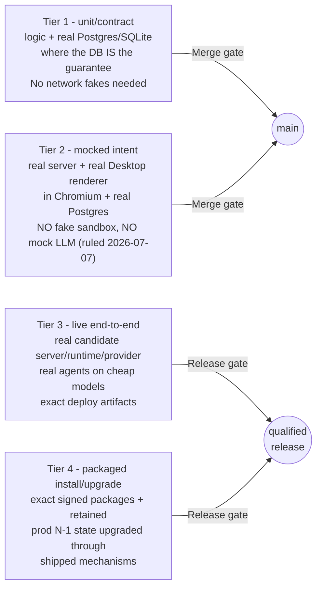
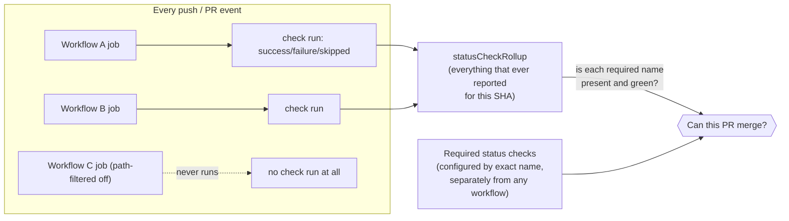

# Testing + CI + Release: Current System

Context doc for the Testing/CI/Release ADR. Describes the pipeline as it exists on `main` in `/Users/pablohansen/proliferate` as of 2026-08-19/20. Evidence labels: [code] read in repo, [gh] read live from the GitHub API/CLI (read-only, no builds run), [spec] claim from `specs/TESTING.md` or `specs/TESTING/*`, [reported] a measured fact handed in for this doc that this pass did not independently re-time. Linear issues PRO-334/335/336 exist for this lane.

## 1. Executive summary

The four-tier testing standard (`specs/TESTING.md`) is well-designed and mostly followed: unit/contract and mocked-intent tests gate merges, real-agent/real-deploy tests gate releases, no fake sandbox and no mock LLM by deliberate 2026-07-07 ruling. The gap is not the test design - it's the plumbing around it.

Three structural facts dominate everything else in this doc:

1. **`main` has no branch protection and no rulesets** [gh, verified live: `gh api repos/proliferate-ai/proliferate/branches/main/protection` → 404 "Branch not protected"; `.../rulesets` → `[]`]. No GitHub-enforced required check exists. Every "merge gate" described in `specs/TESTING.md` (the "Merge" column) is a social convention, not a mechanical one. This is exactly how PR #2070 merged at 19:47:19Z on 2026-08-19 while its own "Cargo check & test" job was still running and later failed at 19:55:07Z, and while Server CI's `test` job failed at 20:42:43Z - **55 minutes after the merge** [gh, verified: `gh pr view 2070 --json mergedAt,statusCheckRollup`]. Production then broke on normalized launch-option control keys; the fix was PR #2103, merged 2026-08-20T02:04:58Z.
2. **The nightly release train's "zero-touch auto-prod" is not zero-touch.** The `Production` GitHub Environment carries a `required_reviewers` protection rule naming `pablonyx` [gh, verified: `gh api repos/proliferate-ai/proliferate/environments/Production`]. Every `*-prod` job in `nightly-release-train.yml` and every production job in `hotfix-production.yml` targets that environment and silently pauses for his manual approval in the Actions UI. Live proof: run `32236204613` (the 2026-08-19 09:09 UTC scheduled train) has sat in `status: waiting` for **19h38m** as of this writing, blocked on `deploy-mobile-prod` and `deploy-e2b-prod` [gh, verified: `gh run view 32236204613`]. The workflow's own comment says the auto-prod jobs "stay unattended only if the `Production` GitHub Environment does not require a reviewer" (`nightly-release-train.yml:308-312`) - today it does, so they don't.
3. **Production promotion does not verify Tier 3/4 qualification evidence for the SHA it promotes.** `specs/TESTING/core-release-validation.md`'s own "Current enforcement exception" section says so directly: staging deployment evidence is checked, but "does not invoke or verify a trusted Tier 3/4 qualification aggregate for the same source SHA and artifact digests." The `Release E2E` qualification workflows run on a schedule/manually, largely gated behind the `Qualification` GitHub Environment, and are not wired as a release gate - `guides/deploying/releases.md` states this explicitly for the self-host lane ("Its artifact-chain job is therefore not a release gate today, even though Testing's target requires an every-release gate").

Below that: Server CI on PRs measures 55-71 minutes against an agreed target of 6-9 minutes for overall PR verdict; a poisoned test mutex convention turns one real Rust failure into 130-140 red tests; `pnpm --filter @anyharness/tests test` secretly shells out to `cargo build` (`anyharness/tests/src/harness/runtime-harness.ts:86`); and `Publish Agent Catalog` is red by design pending unprovisioned signing secrets. None of this is contradictory to the testing standard's own design - the standard is aware of most of its own gaps and names them. The ADR's job is to decide what closes first.

## 2. The pipeline as it exists

```mermaid
flowchart TB
    subgraph PR["Pull request (no branch protection, no ruleset)"]
        direction TB
        PRM["PR Metadata\npull_request_target\nvalidates title + labels"]
        CI["CI (ci.yml)\nrepo-shape, terraform, cargo check+test,\nSDK/frontend builds, login-budget,\nscroll-physics, workflow-def tier-2, ..."]
        SCI["Server CI (server-ci.yml)\npath-filtered on server/**\nlint + pytest, 55-71 min"]
        IT["Intent Tests (intent-tests.yml)\ncontinue-on-error: true\nprovisional, non-blocking"]
        SHS["Self-Host Smoke\nchanges-gate then full compose smoke\n'designed to be blocking' but nothing enforces it"]
        CQL["CodeQL\njs/py/rust, weekly + PR"]
    end

    MERGE{{"Merge to main\n(a human clicks merge)\nno required status checks exist"}}

    subgraph STAGE["Deploy Staging (workflow_run: CI success on main)"]
        WAIT["wait-for-Server-CI step:\nif no run found for SHA, continue anyway"]
        SURF["detect-deploy-surfaces\n(diff-based, additive force / exact only)"]
        DEP["deploy e2b / server / workers / litellm\n/ web / mobile / desktop(build-only)"]
    end

    subgraph TRAIN["Nightly Release Train (cron 09:00 UTC + manual)"]
        PREP["prepare: version bump commit to main,\ncreate tags, detect surfaces"]
        REL["release-runtime / release-server\n/ release-desktop (artifact publish)"]
        DSTG["deploy-*  → staging"]
        DPROD["deploy-*-prod → Production environment\n(required_reviewers: pablonyx)\n= SILENT MANUAL GATE"]
        PUB["publish-product-release\n(raw GitHub Release, independent\nof prod success/failure)"]
    end

    subgraph HOTFIX["Hotfix Production (manual only)"]
        HREF["ref must be an ancestor of\nremote main (git merge-base --is-ancestor)"]
        HPREP["prepare: exact only_surfaces required,\nversion bump, tags"]
        HREL["release-runtime / release-server"]
        HPROD["deploy-* straight to Production\n(same required-reviewer gate,\nNO staging step first)"]
    end

    subgraph QUAL["Release E2E / self-host / cloud (Tier 3/4)"]
        T3["schedule + manual, Qualification env\nlocal / staging / self-host / managed-cloud lanes"]
        NOTE["NOT invoked or verified by\nproduction promotion for the\npromoted SHA (spec-documented gap)"]
    end

    PRM --> MERGE
    CI --> MERGE
    SCI -.non-required.-> MERGE
    IT -.never blocks.-> MERGE
    SHS -.path-gated.-> MERGE
    CQL -.never blocks.-> MERGE
    MERGE --> STAGE
    STAGE --> WAIT --> SURF --> DEP
    MERGE -.cron.-> TRAIN
    PREP --> REL --> DSTG --> DPROD --> PUB
    HREF --> HPREP --> HREL --> HPROD
    QUAL -.no wiring into.-> DPROD
    QUAL -.no wiring into.-> HPROD
```



Notes grounded in code:

- The wait step in `deploy-staging.yml:101-146` polls `gh run list --workflow server-ci.yml --commit <sha>` up to 90×30s; if it finds **no run at all** for the SHA it logs "continuing" and exits 0 rather than blocking - this is the mechanism that made the "no Server CI entry" gating gap possible: Server CI is path-filtered (`server-ci.yml:6-23`, only triggers on `server/**` and a short allow-list), so a PR that never touches those paths produces no Server CI run to wait for or to have failed, and neither GitHub nor this workflow treats that as suspicious.
- `hotfix-production.yml:87-101` requires `git merge-base --is-ancestor "$head_sha" refs/remotes/origin/main` - the dispatched ref must already be on `main`; you cannot hotfix from an arbitrary branch.
- `nightly-release-train.yml:307-312` (comment) states the zero-touch premise explicitly and names the exact condition under which it stops being true; that condition is currently true (see §1).
- The raw GitHub product release (`publish-product-release`) depends only on the **staging** dependency chain plus the artifact releases, never the `-prod` jobs (`nightly-release-train.yml:366-395`) - so "a release exists" and "production has it" are two different, independently-failable claims, exactly as `guides/deploying/releases.md` ("Raw Product Release And Landing Boundary") says.

## 3. Inventory of every CI workflow/check

| Workflow (file) | Trigger | What it actually gates | Notes |
| --- | --- | --- | --- |
| `ci.yml` ("CI") | push to main, PR, dispatch | repo-shape lints (many `scripts/check_*.py`), Terraform validate, CI/CD script self-tests, candidate-build-handoff smoke, `cargo check`/`cargo test --workspace`, SDK build, desktop/web/mobile frontend builds, `/login` first-load budget (fail-closed, `ci.yml:386-418`), shared-frontend-packages, scroll-physics (chromium+webkit, fail-closed), workflow-definition-lifecycle tier-2 (fail-closed, the one true tier-2 merge gate today) | Also the trigger for `Deploy Staging` via `workflow_run`. |
| `server-ci.yml` ("Server CI") | push/PR on `server/**` + a short path allow-list, `workflow_call` from release coordinators | ruff/format, mypy diagnostic ratchet, `pytest tests/unit tests/integration tests/e2e/cloud/test_e2b_webhooks.py`, then (on tag/publish only) docker build+push and self-hosted release assets | 75-minute job timeout (`server-ci.yml:114`); measured 55-71 min. Path-filtered - silent on non-server PRs. |
| `intent-tests.yml` ("Intent Tests") | PR, dispatch | Tier-2 `tests/intent` broad suite + billing suite | Both jobs `continue-on-error: true` (`intent-tests.yml:32,111`) - explicitly provisional/non-blocking per its own header comment; never fails the workflow. |
| `self-host-smoke.yml` ("Self-Host Smoke") | PR→main, push main, dispatch | boots `docker-compose.production.yml` for real, walks setup-token → invite → login journey | Header comment says "designed to be a blocking required check" - but no branch protection exists, so nothing enforces that today. Has a changes-gate job so unrelated PRs report "skipped" (satisfied) instead of hanging pending. |
| `codeql.yml` ("CodeQL") | push/PR to main, weekly cron | JS/TS, Python, Rust static analysis | Never blocks merge either way; security signal only. |
| `pr-metadata.yml` ("PR Metadata") | `pull_request_target` (title/label/etc edits) | validates PR title + labels via changed-file list from the API | Runs against the trusted base ref only; never checks out untrusted PR head code (`pr-metadata.yml:26-32`). |
| `agent-runtime-compat.yml` | dispatch only | real-agent (claude/codex) compatibility smoke against seeded auth | Not wired to any PR/merge/release trigger; manual-only today. |
| `catalog-probe.yml` ("Catalog Probe") | daily 09:00 UTC cron, dispatch | probes every harness × auth-context, drafts a catalog PR | Fails closed if `CATALOG_PROBE_CREDENTIALS_APPROVED` var isn't `true` or the rotation date has lapsed (`catalog-probe.yml:39-63`). Opens a PR for review, does not auto-merge. |
| `publish-agent-catalog.yml` ("Publish Agent Catalog") | push touching `catalogs/agents/*.json`, dispatch | signs + publishes the agent catalog to S3/CloudFront | **Permanently red by design**: exits 1 with an explicit `::error::` when `AGENT_CATALOG_SIGNING_PRIVATE_KEY`/`_PASSWORD` are absent (`publish-agent-catalog.yml:70-75`) - "Failing this job on purpose rather than publishing unsigned." Bundled runtimes still serve the compiled-in floor catalog regardless. |
| `deploy-staging.yml` ("Deploy Staging") | `workflow_run` after CI succeeds on main, dispatch | deploys detected surfaces (e2b/server/workers/litellm/web/mobile/desktop-build-only) to staging | Waits (best-effort, non-blocking on absence) for Server CI on the same SHA; resolves the previous successful staging deploy as its diff base. |
| `nightly-release-train.yml` ("Nightly Release Train") | daily 09:00 UTC cron, dispatch | version bump + tag on main, artifact releases, staging deploy, then zero-touch(-intended) prod deploy, raw GitHub release | See §1/§2: prod leg silently gated on a human reviewer today. |
| `hotfix-production.yml` ("Hotfix Production") | dispatch only | exact-surface emergency path straight to production, no staging step | `ref` must already be an ancestor of `main`; requires exact `only_surfaces`, a `reason`, and a version-bump choice; same Production-environment approval gate applies. |
| `promote-production.yml` ("Promote Production") | dispatch only | manual promotion of an exact staging-tested SHA to production, with `require_staging_success` gate | The documented "normal" production path (`guides/deploying/hosted.md`); requires a successful non-dry-run staging summary whose `headSha` matches. |
| `release-runtime.yml` / `release-desktop.yml` / (reused `server-ci.yml`) | tag push (`runtime-v*`/`desktop-v*`/`server-v*`), `workflow_call` from train/hotfix | build+publish the AnyHarness/SDK, Desktop, and Server/self-host artifacts | Desktop matrix: `macos-15` (aarch64) and `macos-15-intel` (x86_64); codesign+notarization steps refuse ad-hoc signing unless `allow_unsigned=true` (`release-desktop.yml:419-427`). |
| `release-e2e.yml` ("Release E2E (tier 3)") | schedule, dispatch | local/staging tier-3 lanes (provisional), plus four strict manual lanes behind the `Qualification` environment: tier-2 billing/auth, local smoke+functional, selfhost-install-1, cloud-provision-1 | Strict lanes: no `continue-on-error`, V4 evidence reports, `Qualification` environment (branch-policy only, no required reviewer). Provisional lanes: `continue-on-error`, diagnostic only. |
| `release-e2e-selfhost.yml`, `release-e2e-hard-cancel-cleanup.yml` | schedule/dispatch | self-host T3/T4 and managed-cloud hard-cancel cleanup proofs | Self-host lane's own doc note: not wired as a release gate despite the testing target requiring one. |
| `release-cloud-template.yml` / `promote-cloud-template.yml` | dispatch only | build+smoke immutable `sha-<12>` E2B template, then move rolling `staging`/`production` tag | Manual entrypoints on the one E2B template family also touched by staging/prod deploy lanes. |
| `cloud-tests.yml`, `cloud-live-webhook.yml` | dispatch only | ad hoc cloud/E2B and live-webhook smoke | Not part of CI, staging, train, or promotion (`hosted.md` says so explicitly for the webhook one). |

## 4. Test tiers and where they run

Source of truth: [`specs/TESTING.md`](/Users/pablohansen/proliferate/specs/TESTING.md), depth docs under `specs/TESTING/`.



The hard rule (`specs/TESTING.md:65-71`): **the merge gate is tiers 1-2 only.** No real LLM, no real sandbox in the merge gate - Stripe test mode is the one explicit real-network exception and is fail-closed in trusted CI. Tier 3/4 failures block *release*, never an ordinary merge, and file into the issues service.

Where each tier actually runs:

- **Tier 1 (Rust):** colocated `*_tests.rs`/`tests.rs` next to the module, `cargo test --workspace` in `ci.yml`'s `cargo-check` job, plus a dedicated `cargo test -p proliferate-diagnostics-collector --features internal-dogfood-export` step because the default-feature build compiles that path out (`ci.yml:274-275`, `specs/TESTING.md:104-113`).
- **Tier 1 (Python):** `server/tests/unit/` and `server/tests/integration/` (HTTP-level, real Postgres), run via `pytest tests/unit tests/integration tests/e2e/cloud/test_e2b_webhooks.py` in `server-ci.yml:168-169`, and locally via `make test-server` (`Makefile:764-766`, no `-x` isolation flags in CI beyond that command).
- **Tier 1 (TypeScript):** colocated `*.test.ts(x)`, run per-package (`pnpm --filter <pkg> test`); the `shared-frontend-packages` CI job runs the product-client suite plus two focused named-file gates (ProductClient domain, workflow authoring surface) so those specific regressions stay individually named (`ci.yml:458-471`).
- **Tier 1 (contract fixtures):** `fixtures/contracts/<name>/*.json`, asserted from each language's own tier-1 suite; a shape change breaks the consuming side mechanically.
- **The harness launch-option authority gate** (`specs/TESTING.md:9-51`) is its own named deterministic gate spanning Rust + TS + Python + a manual live-attach verifier (`node scripts/verify-harness-launch-options.mjs`); this is the exact gate the current worktree (`codex/harness-launch-options-cutover`) is mid-repair on, per PR #2103's description of the raw-id contract violation that #2070 introduced.
- **Tier 2 (`tests/intent/`):** the one true merge-gating Tier-2 job today is `workflow-definition-lifecycle` in `ci.yml:527-598` - fail-closed, no `continue-on-error`, real Postgres+Redis services, real Playwright+Chromium. The **broad** Tier-2 suites (`intent-tests`, `intent-billing` in `intent-tests.yml`) are explicitly provisional and non-blocking until they earn "a demonstrated flake-free record" (workflow header comment, `intent-tests.yml:1-13`); `specs/TESTING.md:281-286` names this as a tracked migration exception, not an oversight.
- **Scroll-physics suite:** Tier-2-shaped but browser-engine-is-the-SUT; real `MessageList` renderer driven by a scripted event batch in real Chromium **and** real WebKit (`specs/TESTING.md:166-198`, `ci.yml:473-519`). This is the suite that produced the multi-day WebKit flake (§6).
- **Workflow-canvas suite:** same shape, Chromium-only, run on demand rather than in CI (`specs/TESTING.md:200-224`).
- **Tier 3 (`tests/release/`):** one runner CLI, explicit world/host/selector/strict inputs, same code path from a laptop or from `release-e2e.yml`. Also the per-agent catalog bump gate: a candidate agent version runs its smoke on staging before promotion.
- **Tier 4:** clean Desktop install, Desktop N-1→N signed update (`T4-DESKTOP-1`), managed-runtime upgrade through Worker mailbox + Supervisor activation (`T4-RUNTIME-1`), self-host N-1→N - one qualification stage, not a rerun of the Tier-3 functional matrix.

**Local entry points and the machine-crash-relevant gotcha:** `pnpm --filter @anyharness/tests test` runs `vitest run` (`anyharness/tests/package.json`), and its own `vitest.config.ts` pins `pool: "forks", singleFork: true, maxWorkers: 1` - so this particular suite is *not* what spawns many workers. But the suite **does secretly build the Rust runtime**: `anyharness/tests/src/harness/runtime-harness.ts:86` calls `execFileSync("cargo", ["build", "--bin", "anyharness"], { cwd: REPO_ROOT, stdio: "inherit" })` whenever a test constructs a local (non-`external-runtime`) harness, which is the default. Anyone running this suite alongside another cargo build on this 18-core/24GB machine trips the "one cargo build at a time" rule without any warning that it's about to build Rust. Other vitest configs in the repo (`apps/web`, `apps/desktop`, `apps/mobile`, `apps/packages/product-client`, `anyharness/sdk`) set no explicit `maxWorkers`/`poolOptions`, so they default to Vitest's CPU-count thread pool - consistent with the 18-worker spawn observed on this machine.

## 5. Measured timings vs targets

| Stage | Measured (Aug 18-19 session, [reported] unless noted) | Agreed target | Live corroboration this pass |
| --- | --- | --- | --- |
| Overall PR verdict | n/a | 6-9 min | `ci.yml` alone completes in ~9-11.5 min on recent runs [gh, verified: e.g. run `32332408601` 04:35:04→04:44:38 = 9.5 min; run `32331881508` 11.4 min], but the PR's true verdict time is gated by the slowest workflow touching it, which is Server CI when server paths change. |
| Server CI on PRs | 55-71 min | (rolls into the 6-9 min PR-verdict target above) | **Verified directly** from recent runs: 56.5 min (`32294854548`), 57.6 min (`32294958650`), 58.3 min (`32299508969`), 58.0 min (`32301229165`), 65.2 min (`32301748445`) - all within the reported 55-71 min band. |
| Local tests | n/a | 5-10 min | Not independently timed this pass (no builds permitted tonight). |
| Candidate build (desktop) | 49-98 min | 18-22 min | Not re-timed this pass (no recent standalone `release-desktop.yml` run in range; last several completed runs are from June/July and predate the current measurement window). |
| API + desktop rollover | n/a | 2-5 min | Not independently timed. |
| Prod E2E | n/a | 10-20 min | Not independently timed; `Release E2E` strict lanes carry 90-150 min job timeouts (`release-e2e.yml:430,540,703,1026`), which is a ceiling, not a measurement. |
| Merge → qualified production | 2-3+ hours | 35-55 min | **Directly contradicted upward** by live evidence: nightly train run `32236204613` (started 2026-08-19T09:09:55Z) is still `status: waiting` after **19h38m** as of 2026-08-20T04:47:54Z, blocked on the Production-environment reviewer gate for `deploy-mobile-prod`/`deploy-e2b-prod`. Even excluding that pathological case, `Deploy Staging` alone measures 8-45 min per recent run [gh, verified: runs `32324067734` 8 min, `32321752684` 19 min, `32319507978` 45 min (failure), `32317718762` 44.5 min]. |

Machine context this session obeyed: no cargo/rustc build, no Docker, no test execution - every number above is either taken from `[reported]` input or read live from GitHub Actions run metadata via `gh`, never re-run locally.

## 6. Known flakes and structural defects

- **PR merged with red/in-flight CI, no gate stopped it.** PR #2070 merged 2026-08-19T19:47:19Z; its own workflow's `Cargo check & test` job reported `FAILURE` at 19:55:07Z (8 min after merge) and Server CI's `test` job reported `FAILURE` at 20:42:43Z (55 min after merge) [gh, verified via `gh pr view 2070 --json statusCheckRollup`]. Root cause of the outage: `useChatLaunchControlActions` persisted normalized control keys instead of raw target-observed ids, breaking every new codex/grok chat send with `Not sent: launch value '<unknown-control>' for 'effort' is not supported` (per #2103's own description). Fixed by #2103 (merged 2026-08-20T02:04:58Z). Root enabling cause: **`main` carries no branch protection and no ruleset** [gh, verified 404/`[]`], so there is no mechanical way for a red or still-running check to block a merge today - the "Merge" column in `specs/TESTING.md`'s tier table is aspirational, not enforced.
- **Poisoned `ENV_MUTEX` turns one Rust failure into 130-140 red tests.** `anyharness/crates/anyharness-lib/src/app/test_support.rs:63-67`'s `lock_env()` does `ENV_MUTEX.get_or_init(...).lock().expect("expected env mutex")`. A `Mutex::lock()` on a poisoned mutex (i.e., a prior holder panicked while holding it) returns `Err`, and `.expect(...)` immediately panics again - so the first real test panic while the crate-wide env lock is held cascades: every other test in the crate that also calls `lock_env()` (documented as necessary because `PATH`/`HOME`/agent-program env vars are process-global, `readiness/test_env_guards.rs:1-13`) panics too, on a completely unrelated assertion. This is exactly the "onion-peeling, one root cause per CI round" pattern: a red run with 130-140 failing tests usually has exactly one real bug, buried under mutex-poisoning noise.
- **WebKit "transcript scroll physics" flake blocked multiple PRs for days.** `scroll-physics` is a fail-closed, non-`continue-on-error` merge-gating job (`ci.yml:473-519`) that runs the real transcript renderer against scripted event batches in **both** Chromium and WebKit because "physics differ between Blink and WebKit" (job comment). [reported: this flake blocked multiple PRs across several days in the Aug 18-19 window; not independently re-triggered this pass since no test runs were permitted.]
- **`macos-15-intel` codesign/notarization flaked twice in one night.** [reported] `release-desktop.yml`'s Intel matrix leg (`os: macos-15-intel`, `release-desktop.yml:105-107`) does real Apple codesigning and notarization (`release-desktop.yml:341-427`) with no visible retry wrapper around the `xcrun notarytool` step; a transient Apple-side failure fails the whole matrix leg. This pass did not find a recent standalone `release-desktop.yml` run in the affected window to independently confirm - noting as reported, structurally plausible given the lack of a retry.
- **"Shared frontend packages" flaked on a Rust-only PR.** [reported] The job (`ci.yml:420-471`) runs `pnpm shared:build` plus a Python theme-contrast check and several vitest suites regardless of whether the diff touched any frontend code, so a Rust-only PR still exercises the full frontend build/test surface and can flake on it. Structurally consistent with the job having no path filter (unlike `server-ci.yml`).
- **`Publish Agent Catalog` is permanently red by design.** Confirmed in the workflow's own code: it exits 1 with `::error::AGENT_CATALOG_SIGNING_PRIVATE_KEY / AGENT_CATALOG_SIGNING_PASSWORD are not provisioned yet` (`publish-agent-catalog.yml:70-75`) rather than publishing unsigned. This is intentional fail-closed behavior, not a bug, but it means this check can never be added to a required-checks list without either provisioning the secrets or excluding it by name.
- **The zero-touch nightly-prod claim is currently false in practice**, live-observed: run `32236204613` shows `release-server / test` and one `release-runtime` build matrix cell as `cancelled`, `deploy-mobile-prod` and `deploy-e2b-prod` stuck `waiting`, and `publish-product-release` `skipped` as a consequence - nearly 20 hours after the scheduled 09:00 UTC start, with no incident raised anywhere because "waiting on human approval" is not a failure state GitHub alerts on.
- **`Hotfix Production` requires `ref == main` tip at dispatch** (well, an ancestor of `origin/main`, verified live via `git merge-base --is-ancestor`, `hotfix-production.yml:93-95`) and has the same silent per-job `Production` environment approval gate as the nightly train, with no staging validation step at all in that path (`hotfix-production.yml:217-309` goes straight from `prepare` to production deploy jobs).

## 7. Gaps

Grounded directly in `specs/TESTING/core-release-validation.md`'s own "Current enforcement exception" section (lines ~640-700) plus this pass's findings:

- **No branch protection / no ruleset on `main`.** Nothing GitHub-native stops a merge on red, in-flight, or entirely absent checks. This is the single largest gap in the whole pipeline and the direct cause of the #2070 incident.
- **Production promotion does not verify Tier 3/4 qualification evidence for the exact SHA/artifact digests it promotes** - the spec says this outright. Staging deployment evidence is checked; a trusted Tier 3/4 aggregate for that same candidate is not.
- **The "Merge queue" row in `specs/TESTING/core-release-validation.md`'s Gate cadence table describes a merge queue that does not exist in this repo** - there is no GitHub merge queue configured, so "rerun Tier 1 and the complete Tier 2 manifest on the integration commit" happens nowhere as a distinct step; PRs merge directly.
- **The broad Tier 2 intent suites remain `continue-on-error` in trusted CI**, with the billing suite additionally skipping itself whole when `STRIPE_TEST_SECRET_KEY` is absent; only the manual strict `Qualification`-environment lane fails closed on that.
- **The self-host Tier 3/4 artifact-chain job is not wired as a release gate**, contradicting the testing target's requirement for an every-release gate (`guides/deploying/releases.md`, "Qualification Workflows" section, explicit).
- **The target manifest still records the complete guarantee set as planned/deferred** rather than deriving an enforced baseline from collector metadata and accepted evidence.
- **Hosted Web is not booted by the existing Tier 2 world**, and the **Tier 4 Desktop/cloud update journeys cannot qualify in CI today** (both stated directly in the spec's enforcement-exception list).
- **Catalog Probe and the Nightly Release Train share the same 09:00 UTC cron** (`catalog-probe.yml:14`, `nightly-release-train.yml:5`). The probe's own comment says it's meant to run "before the nightly release train picks up merged catalogs," but cron scheduling gives no ordering guarantee between two workflows firing at the identical minute - this is a latent race, not an enforced sequence.
- **No incident/alert fires when a nightly-prod run sits `waiting` on human approval for hours.** GitHub Actions treats an environment-gated pending job as normal, not stuck; nobody gets paged. The only workflow with an explicit failure-alert path today is `Catalog Probe` (`catalog-probe.yml:176-213`, opens/comments a GitHub issue and assigns `pablonyx` on a scheduled failure) - no equivalent exists for a stalled nightly-prod run.
- **`Self-Host Smoke`'s own header comment calls it "designed to be a blocking required check,"** but per the branch-protection finding above, nothing currently makes it one.

## 8. Domain knowledge and best practices

Everything in this section is **[domain]**: general knowledge about how GitHub Actions works and how teams shipping continuously typically operate, not a claim about this repo. Where a mechanism explains why a finding earlier in this doc is possible, that cross-reference is called out by section number inline. Read this section as the theorems the rest of the doc's proofs rest on.

### 8.1 How GitHub Actions actually gates a merge

**[domain] A check run and a required status check are different objects.** Every job in every workflow that runs against a commit posts a check run into that commit's combined status; non-Actions integrations (Vercel, CodeQL's legacy path, etc.) post the older "commit status" shape instead, and both show up together. GitHub's PR UI reads all of them back as `statusCheckRollup`, a flat list of every check that has ever reported against the PR's head SHA, whether or not anything requires it to pass. Nothing about a check existing makes it required; "required" is a separate, opt-in property configured by exact name. A check that never ran for a given SHA (path-filtered off, its workflow never triggered, renamed since) has no entry in the rollup at all. That absence looks identical, from the rollup alone, to "this check does not apply here" and to "this check should have run and silently didn't."



**[domain] Branch protection (classic) vs rulesets.** GitHub has two overlapping mechanisms for the same job: "classic" branch protection rules (one config object per branch pattern, the older API) and rulesets (newer, layered, can target multiple branches or repos, support bypass lists, and are the direction GitHub is investing in). Either one can independently require named status checks, block force-push, require PR review, or require linear history. A repo can have branch protection with no rulesets, rulesets with no branch protection, both, or neither. `gh api repos/<owner>/<repo>/branches/<branch>/protection` and `gh api repos/<owner>/<repo>/rulesets` are two separate calls precisely because the two systems are independent. **This is why this doc's section 1 finding is possible at all**: a 404 on the first call and an empty array on the second mean there is no GitHub-native gate of either kind, so PR merge becomes a purely human decision with no mechanical backstop.

**[domain] Merge queues** are a distinct feature layered on top of required checks: instead of testing each PR's branch tip against a possibly-stale base, GitHub creates a temporary merge commit against the current base for each queued PR, runs required checks against that merge commit, and only fast-forwards the base branch when they pass. This closes the "PR was green against an old main but conflicts with something that merged first" gap that plain required-checks cannot close. A merge queue requires required status checks to already exist; there is no merge queue without them, which is one reason this doc's section 7 finding (the testing standard's own "Merge queue" gate-cadence row describing a mechanism this repo does not have configured) is worth resolving before inventing new tiers of test.

**[domain] Environments and per-job approval gates.** A GitHub Environment can be referenced by a job via `environment: <name>` and can carry its own protection rules independently of branch protection: required reviewers (named people or teams who must click Approve before the job body runs), a wait timer, and branch/tag deployment policies restricting which refs may deploy to it. This is a per-job pause, not a repo-wide merge gate, so it says nothing about whether a PR can merge; a workflow can reference the same environment from any number of jobs, and each one pauses independently. A required-reviewer environment puts the job into a `waiting` state; GitHub does not surface that as a failure, a notification, or anything visible outside that specific run's Actions page, which is exactly the mechanism behind this doc's section 1/6 finding about the nightly train.

```yaml
# Illustrative only, not this repo's file. A job that targets a gated
# environment pauses here until someone with reviewer rights on
# "Production" approves it in the Actions UI, however long that takes;
# the run just sits at status: waiting with no alert anywhere.
jobs:
  deploy-prod:
    environment: Production
    runs-on: ubuntu-latest
    steps:
      - run: ./deploy.sh
```

**[domain] Concurrency groups** deduplicate and optionally cancel in-flight runs sharing a `concurrency.group` key. `cancel-in-progress: true` suits a PR's own CI (a new push should kill the stale run, not race it). `cancel-in-progress: false` suits anything mutating a shared external resource serially, like a deploy or a release train, where a half-finished run must be let alone or handled explicitly rather than torn down mid-mutation.

```yaml
concurrency:
  group: deploy-staging-${{ github.ref }}
  cancel-in-progress: false   # a half-finished deploy is worse than a queued one
```

**[domain] Path filters** (`on.push.paths` / `on.pull_request.paths`) make a workflow trigger only when the diff touches matching paths. The tradeoff: they save CI minutes on unrelated changes, but a required check that never triggers reports no conclusion at all for that SHA, and branch protection treats "no conclusion" as unsatisfied, not as skipped, unless the workflow is written to post an explicit skipped/success conclusion for the irrelevant case (typically a cheap upstream "changes" job whose output gates the heavy job with `if:`, so the heavy job still runs once and reports `skipped`, which branch protection accepts as satisfying a required check). This is the exact pattern this repo's `self-host-smoke.yml` already uses (section 3), and the exact gap that lets Server CI's path filter (section 2, section 6) produce a silent absence rather than a visible skip on a non-server PR.

**[domain] Caching and artifacts** are two different mechanisms often confused. A dependency/build cache (`actions/cache` or a language-specific cache action) restores a keyed directory across runs to speed up the *next* run's install/compile step; a cache miss degrades to a full cold build, it never fails the job. Artifacts (`actions/upload-artifact` / `download-artifact`) move files *between jobs or workflows within the same run graph*, such as test reports, built binaries, or a deploy-plan JSON; they carry a retention window rather than indefinite storage and are not a caching mechanism.

### 8.2 Industry-standard practices for teams shipping continuously

**[domain] Required-check hygiene.** The standard practice is that a check stays in the required list only while it is fast, deterministic, and owned. A slow, flaky, or aspirational check does not get added "so it counts"; it stays informational until it earns trust, then gets promoted. Un-promoting is just as normal as promoting: a required check that starts flaking under new load gets pulled from the required list while it is fixed, rather than left in place and routinely bypassed, because routine bypass is itself a worse habit than not requiring the check at all.

**[domain] Flake quarantine.** The standard pattern for a known-flaky test is an explicit, tracked, time-boxed quarantine, not a silent `continue-on-error` or a skip. A quarantined test still runs and still reports, but its result does not count toward the required conclusion; it is paired with a ticket, an owner, and a review date, so quarantine cannot quietly become the test's permanent address. `continue-on-error: true` with no other bookkeeping, which is what this repo's provisional Tier-2 jobs currently have (section 3, section 4), achieves the "does not block" half of quarantine without the "tracked and time-boxed" half.

**[domain] Test pyramids and where each tier runs.** The textbook shape is many fast unit tests, fewer integration tests, and fewer still end-to-end tests, with each layer running at the earliest point in the pipeline that can afford it: unit/contract on every commit in seconds-scale CI, integration on every PR in minutes-scale CI, full end-to-end against real deployed artifacts only at release cadence because it is slow, expensive, and touches real external systems. The anti-pattern is an inverted pyramid, where end-to-end tests are the primary coverage and run (or get skipped) on every PR because nothing faster was built to catch the same class of bug. A tiered standard like this repo's `specs/TESTING.md` (section 4 above) exists specifically to keep the pyramid upright: tier 1/2 own the merge gate, tier 3/4 own the release gate, and a bug caught at tier 3/4 is supposed to earn a lower-tier test as its fix, not just a passing rerun.

**[domain] Release trains vs on-demand promotion.** A release train (fixed cadence, whatever is on the branch at cutoff ships) trades "a bug lands one train late" for "everyone knows exactly when the next opportunity is," which matters once many contributors merge continuously and an ad hoc "ship whenever" cadence causes either shipping paralysis or surprise deploys. On-demand promotion (ship this exact commit right now) trades that predictability for speed on a specific fix. Mature pipelines usually run both: a scheduled train for the steady state, plus a narrow, audited on-demand/hotfix path for emergencies, with the hotfix path deliberately more manual (exact ref, exact surfaces, a written reason) precisely because it bypasses the safety of "this already baked on staging via the train." This repo has exactly that split (nightly train plus `Hotfix Production`, section 3), which matches the standard shape even where the train's zero-touch premise does not currently hold (section 1, section 6).

**[domain] Canary / health-gated rollout.** Rather than flipping all production traffic to a new version at once, a canary shifts a small percentage first (or deploys to one box or region first) and watches error rate, latency, and business metrics against an automatic threshold before continuing the rollout; a breach auto-halts or auto-rolls-back without waiting for a human to notice. The mechanical prerequisite is that the deploy step itself is metric-aware; a plain "deploy to 100% of instances" step has nothing to gate on partway through, which is why adding canary logic retroactively usually means changing the deploy mechanism, not adding a CI job on top of it.

**[domain] Rollback discipline.** The standard is that rollback is a *tested*, forward-only operation, re-pointing to the last-known-good artifact by its immutable identity, rather than a `git revert` plus a fresh build assembled under incident pressure. A fresh build under pressure recompiles whatever else has landed since and can behave differently from what was actually running before. This requires every promoted artifact to be addressable by an immutable identity (an image digest, a version-pinned storage key, a tagged release, all patterns this repo's release workflows already use, section 3) that a rollback can re-point to without rebuilding, and it requires the rollback path itself to be exercised outside of a real incident, so the first real rollback is not also the first rehearsal of it.

## 9. Open design questions for Pablo

1. **Turn on branch protection for `main`, and with what required-check set?** The tradeoff: a required-check list freezes in the workflows that must stay green forever (including any accidental slow/flaky one), but its absence is the direct, now-proven cause of a production incident (#2070/#2103). A narrower alternative - require only `Cargo check & test` + the fail-closed Tier-2 jobs, leave Server CI advisory - trades safety for keeping today's fast-merge culture on non-server PRs.
2. **Is the `Production` environment's required-reviewer gate intentional, or a leftover from before "zero-touch auto-prod" was built?** If intentional, the nightly train's "zero-touch" framing in its own comments and in `guides/deploying/releases.md` is misleading and should be corrected in the docs rather than the workflow. If unintentional, removing it makes the train genuinely unattended - but then nothing human reviews a nightly production push before it lands, which is a bigger blast-radius change than it sounds.
3. **Should a stalled-on-approval nightly-prod run page someone, or auto-expire?** Right now a run can sit `waiting` for 19+ hours with zero signal anywhere. Cheap fix: a scheduled check that flags any `nightly-release-train` run older than N hours in `waiting` status, mirroring the alert job Catalog Probe already has.
4. **Wire Tier 3/4 qualification evidence into production promotion, or formally accept the current staging-only gate?** The spec already documents this as an open enforcement exception; the ADR should decide whether closing it is next, or whether the cost (release cadence, flake surface) means the team accepts staging-only forever and rewrites the target document to match reality instead.
5. **Fix `lock_env()`'s poisoning, or accept onion-peeling as the debugging workflow?** A `PoisonError::into_inner()` recovery (ignore poisoning, since the mutex only protects env-var mutation ordering, not data integrity) would stop one flaky test from cascading into 130+ failures, at the cost of potentially masking a genuinely corrupted env state from a prior panic. Low-cost, worth deciding explicitly rather than leaving as tribal knowledge.
6. **Should `pnpm --filter @anyharness/tests test` fail loudly (or skip) instead of silently building Rust when another cargo build is already running**, given the standing one-cargo-build-at-a-time rule on the dev machines? A `pgrep -x cargo` guard before the `execFileSync("cargo", ...)` call in `runtime-harness.ts:86` would convert a silent OOM risk into an explicit, actionable error.
7. **Does `Server CI`'s path-filter need a fallback "ran but skipped" signal** so a required-checks rule (if adopted per Q1) can distinguish "no server changes, correctly silent" from "changes exist but the workflow never fired"? Today, from the outside, both look identical: no entry in the status-check rollup.
