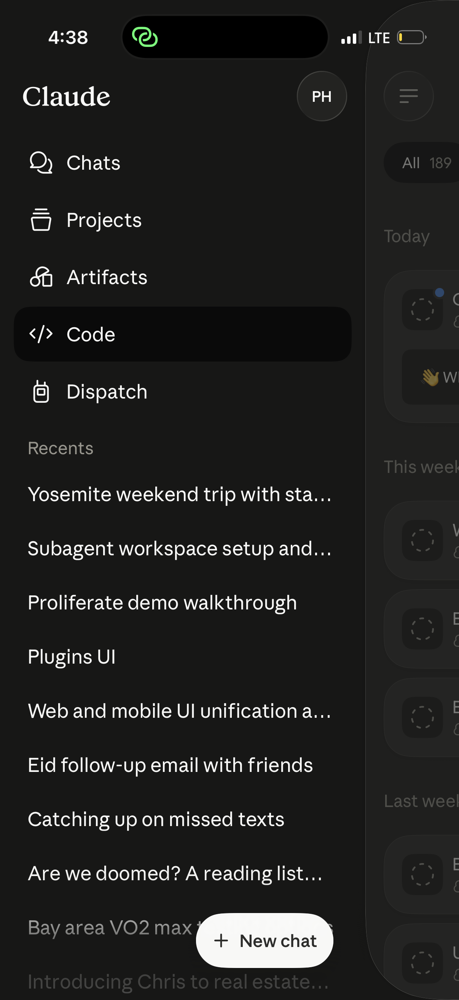
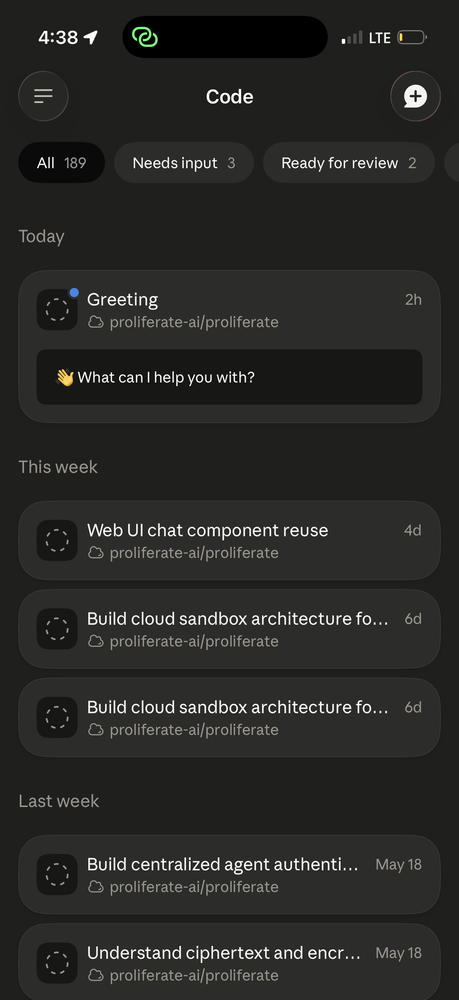
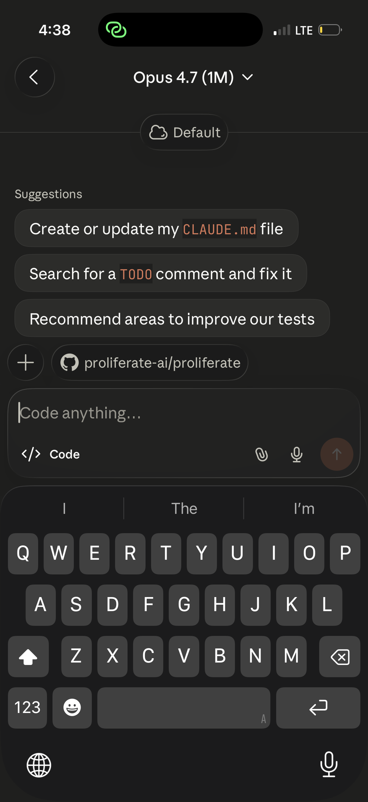
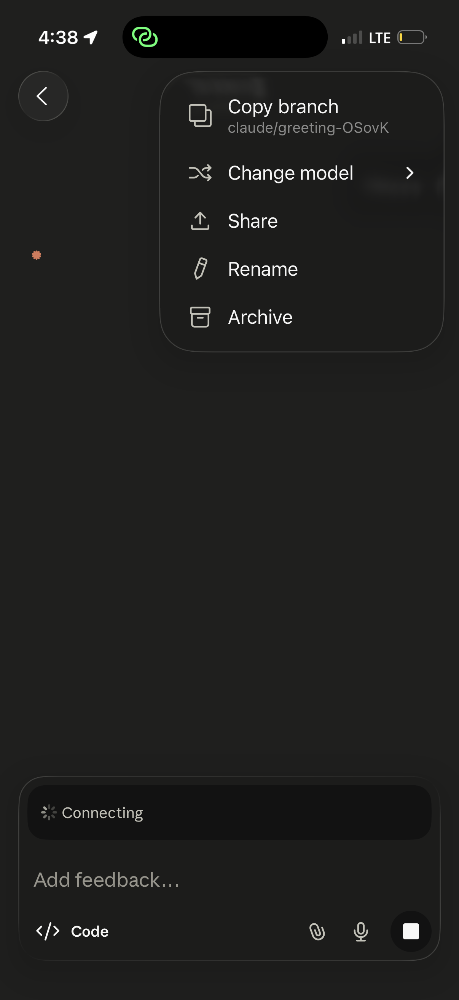
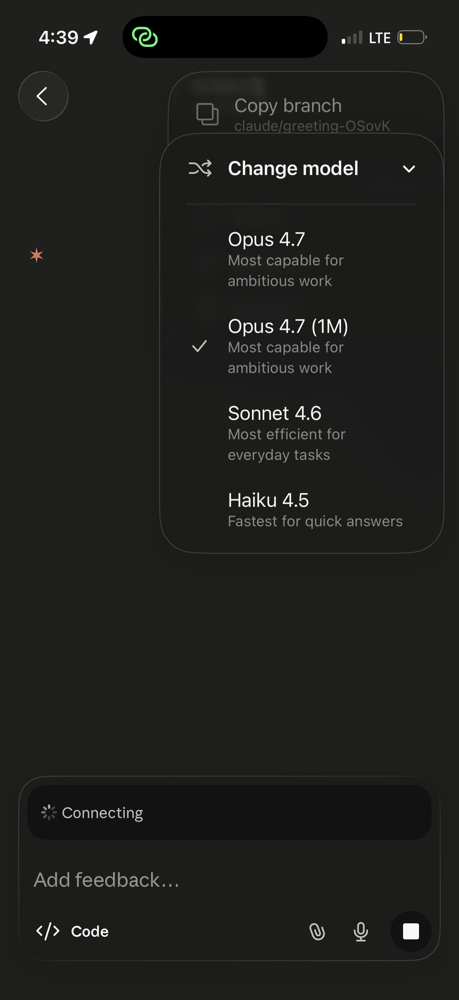
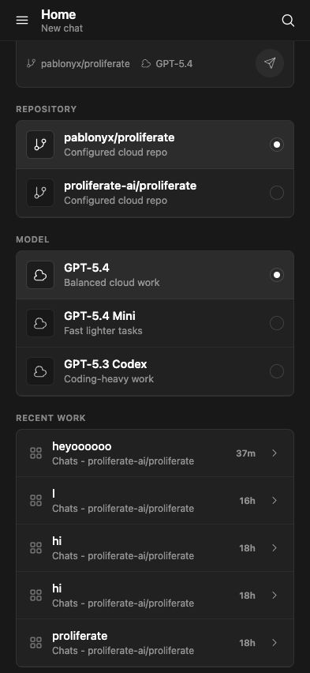
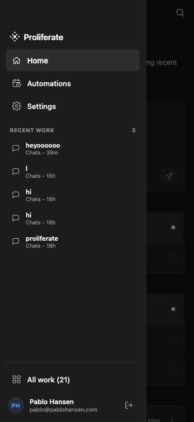
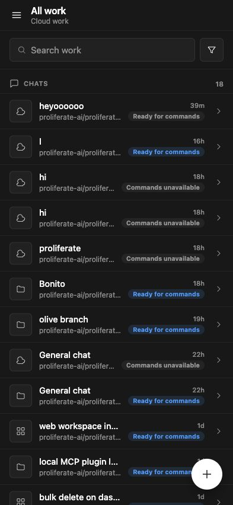
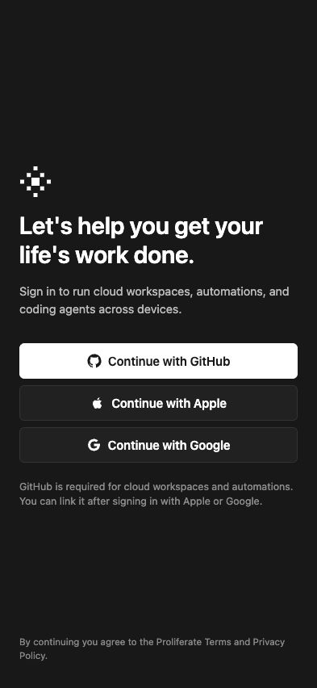
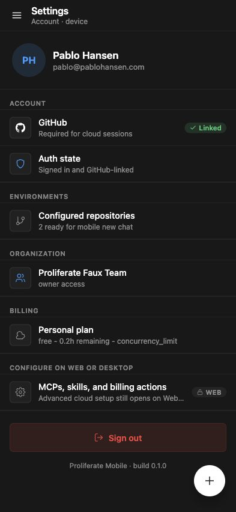

# Mobile Claude UI Alignment Spec

Status: working product/UI spec.

Date: 2026-05-26

Scope:

- `apps/mobile/src/**`
- shared mobile-safe product rules in `apps/packages/product-domain/**`
- `@proliferate/cloud-sdk` and `@proliferate/cloud-sdk-react` only where the
  UI needs a concrete backend contract
- server/cloud APIs only when a mobile workflow is missing a real launch or
  command primitive

This spec is intentionally visual and compact. It uses Claude mobile as the
interaction reference, but maps each screen to Proliferate concepts:
workspaces, sessions, runtime targets, cloud access, dispatch, automations, and
agent auth.

## Reference Images

Claude references:

Current Proliferate mobile references:

## Product Goal

Mobile should feel like the same product as Web/Desktop, but shaped like a
mobile app:

- one primary action per screen
- drawer for navigation and recent work
- bottom sheets for configuration, filtering, tool details, and actions
- chat config presented as the same product model as Web/Desktop
- runtime location shown separately from cloud sync
- workspace and session identity always visible

Mobile must not import DOM components from `apps/packages/product-ui`. It should
reuse product models, copy, ordering, config rules, and SDK hooks, then render
native React Native UI.

## Visual Fidelity Rules

- Match the Claude references for mobile density: large safe-area-aware
  headers, 44px minimum icon buttons, 48px+ nav rows, generous vertical gaps,
  and no table-density row layouts on primary screens.
- Use dark native surfaces with subtle contrast: app background, raised cards,
  selected pills, borders, and scrims must be visually distinct but quiet.
- Use rounded pill controls for filters/config and large rounded cards for
  workspace rows. Avoid boxed desktop-style list sections except in Settings.
- Default screens should show one primary action and one primary visual object.
- Validate screenshots at 393x852 and one larger iPhone viewport before
  shipping.

## Architecture / Ownership

- Components render native UI and forward events. They should not own product
  filtering, sorting, status, icon semantics, command readiness, or launch
  orchestration.
- Shared product decisions live in `apps/packages/product-domain/**`: workspace and
  session inventory semantics, source/runtime/status/ownership labels and
  ordering, filter/sort rules, launch/config controls, transcript row
  semantics, command readiness, and pending prompt reconciliation rules.
- Mobile derived hooks under `apps/mobile/src/hooks/**/derived/**` adapt SDK/query
  state into mobile view models.
- Mobile workflow hooks under `apps/mobile/src/hooks/**/workflows/**`, or pure
  helpers under `apps/mobile/src/lib/workflows/**`, coordinate SDK mutations,
  pending prompt storage, cache invalidation, navigation, and errors.
- Mobile-only pure presentation adapters live under `apps/mobile/src/lib/domain/**`,
  such as mapping product-domain semantic tokens to `MobileIconName`.
- Do not add new inline source/status/runtime string checks to screen
  components while implementing this spec.

## Backend Readiness

The UI is allowed to rely on these existing contracts:

- Configured repos: `useCloudRepoConfigs`.
- Managed cloud launch: `useCreateCloudWorkspace`, followed by mobile pending
  first-prompt replay through `start_session` and `send_prompt` once the
  workspace is command-ready.
- Desktop/target dispatch launch: `useLaunchCloudWorkspaceOnTarget`, backed by
  `POST /v1/cloud/workspaces/target-launch`. This is currently a synchronous
  foreground launch contract that may take several minutes; mobile must show a
  blocking launch state and recover by refreshing workspace lists if the request
  is interrupted. An async staged launch API is out of scope unless added
  separately.
- Target list and liveness: `useCloudTargets` and `useTargetLive`.
- Workspace list: `useCloudWorkspaces`.
- Workspace snapshots and live session projections: existing mobile chat
  workspace/session queries and live streams.
- Existing session commands: `start_session`, `send_prompt`,
  `update_session_config`, plus the mobile command readiness helpers.
- Claim state: existing claim mutation and workspace visibility fields.
- Automations: existing list/status APIs are enough for a read-first mobile
  automations view, pause/resume, and status. Showing last run in every row
  requires either per-automation run queries or future list-response enrichment.

Remaining backend QA before shipping the new UI:

- Manually exercise `POST /v1/cloud/workspaces/target-launch` against a live
  Desktop target from mobile.
- Confirm target launch failure messages are specific enough for mobile sheets.
- Confirm source icons can be derived from shared product-domain inventory
  fields without mobile-only guessing.

## Screen Spec Cards

### 1. Drawer

Reference: `assets/mobile-claude-ui/claude-sidebar.png`.

Current comparison: `assets/mobile-claude-ui/ours-mobile-drawer-current.png`.

Target:

- Drawer should visually match the Claude sidebar reference as closely as
  product naming allows.
- Drawer slides in from the left.
- It is closed by default.
- It opens from the sidebar icon and by edge swipe where native/web runtime
  supports it.
- Header shows Proliferate mark and profile/avatar.
- Primary nav rows:
  - Home
  - Automations
  - Workspaces
  - Settings
- Recents section is labeled `Workspaces`.
- Recent rows are workspace rows, not generic chat rows.
- Bottom row is `See all` or `All workspaces` and opens the Workspaces list.
- The drawer owns a sticky/floating `New chat` pill near the lower edge,
  matching the Claude reference. Do not hide the primary new-chat action behind
  only a top-bar icon.
- Drawer width should visually match Claude: roughly three quarters of the
  viewport, with dimmed underlying content still visible at the right edge.
- Selected nav row uses a rounded filled pill. Inactive rows are plain icon/text
  rows.
- Recent workspace rows in the drawer are simple text rows, not full cards.

Source icon rules:

- Mobile dispatch: phone/mobile icon.
- Normal cloud or claimed cloud workspace: cloud icon.
- Slack origin: Slack icon.
- Automation origin: automation/calendar icon.
- Unknown origin: neutral workspace icon.

Implementation notes:

- Use the existing `MobileDrawer`, but change nav IA and row presentation.
- Source/runtime/status kinds come from `apps/packages/product-domain`; mapping those
  semantic tokens to `MobileIconName` lives in a mobile presentation helper, not
  inline component conditionals.

### 2. Workspaces List

Reference: `assets/mobile-claude-ui/claude-workspaces.png`.

Current comparison: `assets/mobile-claude-ui/ours-mobile-workspaces-current.png`.

Target:

- Title is `Workspaces`. Claude says `Code`; this is an intentional
  Proliferate copy divergence while preserving the Claude layout.
- Top row has:
  - sidebar button
  - centered title
  - new chat / add button
- Horizontal filter pills sit below the title.
- First pill is active filter summary, for example `All 12`.
- Filter/sort pill opens a bottom sheet.
- Do not show a persistent search bar above the list in the default view.
- Section headings use recency groups such as `Today`, `This week`, and
  `Last week`.
- Workspace rows are rounded cards grouped by recency/status.
- Cards show:
  - source/runtime icon
  - workspace title
  - repo and branch
  - last activity time
  - status or attention label
  - optional latest prompt/status block inside the card
  - claim affordance only when unclaimed
- Cards are large touch targets with rounded corners, an icon tile at left,
  title plus time on the first row, and repo/branch metadata below.

Filter sheet:

- Source/runtime: All, Cloud sandbox, Desktop/local, Mobile-created,
  Automation, Slack.
- Status: All, Live, Ready, Running, Needs input, Error, Archived.
- Ownership: Mine, Shared, Unclaimed.
- Repo: configured repo list.
- Sort: Recent activity, Created, Name, Status.

Behavior:

- Tap may open `lastSessionSummary` immediately when there is a clear default.
- If the workspace snapshot reveals multiple meaningful sessions, expose the
  session chooser in chat or after a lightweight snapshot fetch.
- Long press or row action opens workspace actions.

Implementation notes:

- Replace the current Shared/Personal split with filterable workspace cards.
- The routed `work` surface should become the Workspaces list. Avoid keeping
  both `MobileAllWorkScreen` and the older `MobileWorkspacesScreen` as
  competing product routes after the migration.
- Use `useCloudWorkspaces` plus the shared inventory model.
- Filter option definitions, counts, grouping, sorting, source/runtime mapping,
  and default-open/session-choice rules belong in `apps/packages/product-domain` or a
  mobile derived hook, not in the screen component.
- Implement source/runtime filters from shared product-domain `sourceKind` and
  `runtimeLocation`; extend product-domain filters if needed rather than adding
  backend-only UI guesses.
- Keep pull-to-refresh as a later enhancement unless cheap.

### 3. Home / New Chat

Reference: `assets/mobile-claude-ui/claude-new-chat-home.png`.

Current comparison: `assets/mobile-claude-ui/ours-mobile-home-current.png`.

Target:

- This screen is an actual composer, not a dashboard.
- Header follows the Claude hierarchy: back/drawer control, centered
  model/config dropdown, and a compact runtime/target pill below.
- Chat input is always open and visually primary.
- The text input is the primary object.
- The input should focus automatically when native runtime allows it.
- The composer sits above the keyboard and dominates the lower half of the
  screen when focused.
- Repo sits right above the chat input as a compact pill/chip, matching the
  Claude repo pill placement.
- Runtime/target sits near the top under the model/config header, matching the
  Claude `Default` cloud pill placement.
- Model/config is opened from the top-right/center header control, not from a
  permanent model list in the page.
- Suggestions are optional and should not push the composer out of primary
  focus.

Controls:

- Runtime selector:
  - Cloud sandbox
  - Desktop Mac / local target when online
  - future shared/self-hosted targets when present
- Runtime selector shows live/offline status.
- Repo selector shows current repo and add/select affordance.
- Model/config selector uses the same launch controls as Web/Desktop:
  - agent/harness
  - model
  - reasoning
  - permission/mode where supported

Submit behavior:

- Cloud runtime creates the workspace with `useCreateCloudWorkspace`, then
  replays the pending first prompt through `start_session` and `send_prompt`
  once the workspace is command-ready.
- Desktop/local target submits through `useLaunchCloudWorkspaceOnTarget`.
- Offline desktop target disables submit and explains the blocker in a sheet or
  inline note.
- Pending first prompt must be saved with enough config to replay:
  - prompt text
  - agent kind
  - model/config updates
  - selected repo
  - selected runtime target
- Pending first prompt is currently client-persisted pending state. Do not
  assume server-durable pending prompts across devices until a backend
  pending-launch contract exists.

Implementation notes:

- Remove the current permanent repo list and permanent model list from Home.
- Keep those choices in selector sheets.
- Launch/config controls must come from shared launch/config control models, not
  hardcoded mobile model arrays.
- Branch/display-name construction and first-prompt payload construction should
  move out of the component.
- The launch workflow should live in a mobile workflow hook or
  `apps/mobile/src/lib/workflows/**`; the component calls `submit()` and renders the
  result.

### 4. Workspace Chat

Reference: `assets/mobile-claude-ui/claude-three-dot-menu.png` for actions. Add
a fresh current Proliferate chat screenshot before implementation if
`ours-mobile-chat-current.png` is stale.

Current comparison: `assets/mobile-claude-ui/ours-mobile-chat-current.png`.

Target:

- Header always makes workspace/session identity clear.
- Header structure:
  - back or drawer button
  - workspace title
  - three-dot actions button
- Session switching is not a separate page or standalone header chip. It lives
  inside the three-dot/action flow.
- The three-dot flow includes a thin selector state for sessions and config,
  matching the Claude changing-config reference.
- Composer stays visually aligned with Web/Desktop product behavior, but uses
  native layout.
- Config controls should not crowd the composer. Prefer the three-dot sheet or
  compact control chips.

Transcript and tools:

- User and assistant rows stay readable and centered in the chat flow.
- Tool calls render as compact inline cards.
- Tapping a tool call opens a bottom sheet with command/tool details.
- Work history should not become a giant empty card or obscure transcript
  content.
- Command/status errors are visible, but not permanently noisy after recovery.

Actions sheet:

- Copy branch.
- Change model/config.
- Switch session.
- Claim workspace when unclaimed.
- New session.
- Stop/archive workspace only when a mobile access hook is added for the
  existing stop/delete API; session archive is not currently a mobile-ready
  contract.
- Runtime/target details.

Out of scope for now:

- Share.
- Rename.

Implementation notes:

- Chat selection, optimistic prompt rows, pending prompt reconciliation, config
  mutation state, and command failure labels should move into hooks/domain
  helpers before adding more sheet/tool UI to `MobileChatScreen`.
- Tool-call display semantics should reuse product-domain transcript/tool
  presentation helpers. Mobile renders the native card and bottom sheet.

### 5. Three-Dot / Config Sheets

References:

- `assets/mobile-claude-ui/claude-three-dot-menu.png`
- `assets/mobile-claude-ui/claude-three-dot-changing.png`

Target:

- On normal phone viewports, the three-dot menu is an anchored floating popover
  with a dimmed/blurred backdrop, matching the Claude reference. Use a bottom
  sheet only for long option lists or constrained heights.
- It is not a settings page.
- It owns immediate chat/workspace actions.
- It owns session switching and new-session creation for the current workspace.
- Nested config sheets should use the same option ordering as Web/Desktop.
- Nested selector states should visually match the Claude changing-config
  reference: a thin focused selector/list state for the active option family,
  not a separate full page.
- Model and reasoning options come from shared product-domain controls, not
  hardcoded mobile lists.

Behavior:

- Config changes show pending state.
- Accepted config reconciles from live session config.
- Rejected config rolls back and shows a specific error.

### 6. Automations

Target:

- Mobile v1 is read-first.
- Show automations in the same list/card language as Workspaces.
- Show status, repo/workspace, schedule/trigger, and last run.
- Allow pause/resume if already supported and low risk.
- Do not prioritize create/edit UI in this pass. If existing create UI remains,
  keep it secondary and do not expand it during this alignment pass.

Backend:

- Existing automation list/status APIs are enough for read-first list,
  pause/resume, and status. Showing last run in every row requires either
  `useAutomationRuns` per automation or a future list-response last-run summary.

### 7. Settings

Current comparison: `assets/mobile-claude-ui/ours-mobile-settings-current.png`.

Target:

- One clean mobile settings surface.
- Sections:
  - Account
  - Billing
  - Agent auth
  - Cloud repos
  - Targets / dispatch
  - Legal/dev tools when applicable
- Use the same product model/copy as Web settings where possible.
- Keep native mobile controls and safe-area behavior.
- Settings should not show a floating new-chat/add button.
- Use simple grouped settings rows. Do not apply the Workspaces card treatment
  unless the row represents a concrete workspace/repo/target object.

## Implementation Order

1. Shared mobile work inventory semantics: source/runtime icon helpers, filter
   vocabulary alignment, and product-domain tests.
2. Shell IA: route `work` as Workspaces, drawer rows
   Home/Automations/Workspaces/Settings, workspace-centric recents, sticky
   `New chat`, and no competing unused Workspaces route.
3. Workspaces list: cards, recency groups, horizontal summary pills, and a
   source/status/ownership filter sheet.
4. Home managed-cloud composer: make the composer primary, move repo/model into
   sheets, preserve the existing `useCreateCloudWorkspace` and pending first
   prompt behavior.
5. Home target-launch: add target liveness, runtime selector, offline disabled
   state, and `useLaunchCloudWorkspaceOnTarget`.
6. Chat header/actions: polish workspace identity, session chip, and three-dot
   actions while keeping existing config controls working.
7. Chat transcript/tool details: compact tool rows and detail bottom sheet.
8. Automations read-first polish.
9. Settings cleanup.

## Acceptance Checks

- Claude reference images and current Proliferate images remain linked in this
  spec for visual comparison.
- Product-model coverage confirms source/category mapping for mobile-created,
  cloud sandbox, desktop exposed, desktop offline, Slack, personal automation,
  team automation, API, and unknown work.
- Screenshot comparison confirms Home has no permanent repo/model lists.
- Screenshot comparison confirms Workspaces no longer uses dense table rows or
  a search-first layout.
- Screenshot comparison confirms the drawer has the sticky/floating `New chat`
  action and dimmed content edge.
- Screenshot comparison confirms three-dot actions use an anchored popover on
  normal phone viewports.
- Home can create a managed cloud workspace.
- Home can launch on a live Desktop target through target launch.
- Offline Desktop target is visible but blocked with clear copy.
- Pending first prompt survives reload before workspace readiness.
- Workspaces list can filter by source, status, ownership, and repo.
- `my` and `exposed` workspace scopes do not duplicate rows.
- Unclaimed workspaces show claim affordance only when unclaimed.
- Opening a workspace with multiple sessions exposes session switching rather
  than silently selecting the wrong session.
- Starting a new session in an existing workspace works.
- Existing session prompt send still works.
- Config changes still use shared session config semantics.
- Config accept/reject rollback remains visible and specific.
- Claim flow still gates shared/unclaimed workspaces.
- Tool rows appear compact inline; tapping one opens a detail sheet and closing
  it preserves transcript scroll position.
- Drawer recents are workspace-centric and do not look like a separate chat
  product.
- Every implementation PR runs `pnpm --filter @proliferate/mobile typecheck`.
- Product-model changes run the relevant product-domain tests.
- Manual QA uses a named profile, for example `make dev-init
  PROFILE=mobileclaude`, `make dev PROFILE=mobileclaude`, then mobile web on
  the profile's mobile port.
