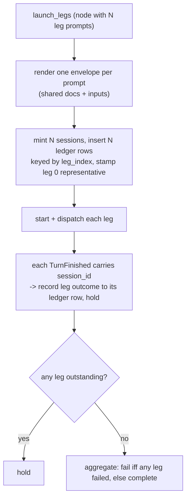

> **SUPERSEDED (gen-2, 2026-08-14).** The Workflows ADR replaced the gen-1
> system this document describes. The gen-1 runtime execution vertical
> (one-prompt runs, portable invocations, run control, managed cloud
> execution) has been deleted from the runtime; `workflow_runs`,
> `workflow_run_steps`, and `workflow_workspace_materializations` were
> dropped and recreated as the gen-2 tables (`workflow_runs`,
> `workflow_run_nodes`, `workflow_run_docs`). The gen-2 model — multi-node
> runs on a linear chain, one session per node, a pure transition table, and
> a client-delivered invocation snapshot — is documented by the delivery
> specs (`delivery/workflows-gen2/delivery-spec-workflows-gen2-pr1.md`
> and successors) until this
> document is rewritten at the end of that ladder. Three sections here already
> describe live gen-2 code, not the superseded gen-1 vertical: "Current gen-2
> authoring experience" (the builder), "Gen-2 follow-up: existing-workspace
> placement and parallel nodes" (the follow-up ADR's rungs), and the "Workspace
> Placement" section (`domains/workspaces/workflow_placement.rs`). The remaining
> gen-1 sections stay for the record until the full rewrite.
>
> Superseded by name: this document's repeated prohibition on a runtime-side
> workflow actor/manager/scheduler ("no workflow actor", "no scheduler", the
> run-control and managed-cloud sections' variants) is REVERSED by the
> Workflows ADR. Gen-2 executes runs through a per-run workflow actor behind
> a `WorkflowManager`, with SQLite rows as the sole truth and
> persist-before-act ordering; the prohibition described a gen-1 constraint
> and no longer binds.

Read before touching: `apps/packages/product-client/src/**/*workflow*`, `server/proliferate/server/workflows/**`, `anyharness/crates/anyharness-lib/src/domains/workflows/**`

This document covers the Workflow system spanning server ↔ runtime ↔ workspace placement, including definitions, invocations, runs, run control, workspace placement, and managed cloud execution.

## Current gen-2 authoring experience

The authenticated Workflows surface keeps the production shell and routes. Its
index lists saved schema-v2 definitions, legacy delete-only definitions, and
runtime executions; creation starts from a blank workflow or one of the four
starter templates. Definition Run continues through the existing Cloud
invocation/runtime courier and opens the exact workspace. The workspace
right-panel run pane is unchanged.

The schema-v2 builder has a fixed palette rail, deterministic graph canvas,
and inspector. The draft owns explicit real-node `edges`; the editor-only Input
sentinel connects to the unique head and is never serialized. New nodes start
detached, removing a node removes only incident edges, and moving a node changes
display order without rewiring. Save requires a workflow title, a title and a
prompt on every step, one linear path covering every node, and an
Input-to-head connection, in addition to the definition, reference, catalog,
and repository rules — the same set the control plane and the runtime enforce,
so a savable draft is one every plane accepts. Every gate that holds Save down
is stated on the surface: definition issues against the step that owns them,
and the workflow title and unapplyable JSON as their own banners. Canvas
Backspace/Delete removes the selected node or document, while Cmd/Ctrl+Z and
Shift+Cmd/Ctrl+Z undo and redo the whole draft outside editable controls.

Cards are placed by hand: dragging a card body moves it under the pointer at
any zoom, arrow keys nudge a focused card by the grid pitch, and edges are
redrawn from wherever the cards now sit. A card that has not been moved keeps
its rank in the deterministic layout, so placement is an override of that
layout and never a replacement for it. Placements are local to the machine and
keyed by workflow (`workflow_node_layout` in product storage): they are not
part of the definition — the document is sealed and frozen into every
invocation — and two people can arrange the same chain differently. A draft
holds its arrangement in memory and adopts it under the new id at the first
save.

The JSON tab edits only the camelCase `WorkflowDefinitionV2` document. Title,
description, and default repository stay in the record envelope. Valid JSON is
applied atomically to the graph; malformed, semantically invalid, or
unknown-field JSON keeps the last valid graph, retains its editor text, and
blocks Save. Format prettifies the valid document and Revert restores the
graph's current document, which the tab also re-seeds from on every reopen
unless it holds unparseable text the author typed.

This current behavior explicitly supersedes the older PR7 delivery-spec rules
that treated graph editing as a non-goal and rebuilt edges from array order.
There is no schema, API, database, runtime, or run-pane change in this UI
migration.

## Gen-2 follow-up: existing-workspace placement and parallel nodes

This section is current operating truth for the two additive capabilities the
Follow-up Workflows ADR bolted onto the merged gen-2 engine: running a workflow
run inside a workspace the user already owns (Feature A), and fanning one node
out to N parallel sessions that each carry their own authored prompt (Feature
B). They compose into the motivating case, a reviewer panel (a correctness,
security, and perf reviewer) running as one parallel node in an existing PR
worktree.

It owns only the follow-up delta. The gen-2 base engine it extends (the per-run
actor behind `WorkflowManager`, the pure transition table, the node/session
model, the client-delivered invocation snapshot) is still documented by the
delivery specs under
[`../../delivery/workflows-gen2/`](../../delivery/workflows-gen2/) until the
full gen-1 rewrite lands; this section never restates that base, it names the
seam it changed. Workspace materialization for a fresh worktree stays owned by
[Workspace Placement](#workspace-placement); this section owns only the third
placement mode that adopts an existing workspace instead.

The follow-up shipped as a linear ladder of rungs, each stacked on the prior:

| Rung | Capability | Primary home |
| --- | --- | --- |
| 1 | Run-scoped context docs under `.proliferate/context/<runId>/` | [`render.rs`](../../anyharness/crates/anyharness-lib/src/domains/workflows/render.rs) |
| 2 | `ExistingWorkspace` placement + re-scoped occupancy | [`definition.rs`](../../anyharness/crates/anyharness-lib/src/domains/workflows/definition.rs), [`workflow_runs.rs`](../../anyharness/crates/anyharness-lib/src/api/http/workflow_runs.rs) |
| 3 | One run rail per concurrent run, capped at four | [`WorkflowPane.tsx`](../../apps/packages/product-client/src/components/workflows/run-view/WorkflowPane.tsx) |
| 4 | Fan-in ledger + wait-for-all aggregation | [`0076_workflow_run_node_sessions.sql`](../../anyharness/crates/anyharness-lib/src/persistence/sql/0076_workflow_run_node_sessions.sql), [`transition.rs`](../../anyharness/crates/anyharness-lib/src/domains/workflows/transition.rs) |
| 5 | Per-leg authored prompts + N-way fan-out | [`definition.rs`](../../anyharness/crates/anyharness-lib/src/domains/workflows/definition.rs), [`launch.rs`](../../anyharness/crates/anyharness-lib/src/live/workflows/launch.rs), [`models_v2.py`](../../server/proliferate/server/workflows/models_v2.py) |
| 6 | Per-leg redo | [`transition.rs`](../../anyharness/crates/anyharness-lib/src/domains/workflows/transition.rs), [`store.rs`](../../anyharness/crates/anyharness-lib/src/domains/workflows/store.rs) |
| 7 | The ledger on the wire (projection, SDK, run view) | [`projection.rs`](../../anyharness/crates/anyharness-lib/src/domains/workflows/projection.rs), [`workflow-runs-v2.ts`](../../anyharness/sdk/src/types/workflow-runs-v2.ts), [`run-view-model.ts`](../../apps/packages/product-client/src/domain/workflows/run-view-model.ts) |

Read with the [gen-2 delivery specs](../../delivery/workflows-gen2/) for the base
engine, [Workspace Placement](#workspace-placement) for fresh-worktree
materialization, and [`../TESTING/README.md`](../TESTING/README.md) for the test
tiers cited below.

### Code map

```text
anyharness/crates/anyharness-lib/src/
  domains/workflows/
    render.rs           run_context_dir_relative(run_id); envelope + preamble render
    materialize.rs      writes each doc under the run-scoped context dir
    definition.rs       PlacementMode, occupancy predicate, DefinitionLeg, MAX_NODE_LEGS
    store.rs            ResolvedSideEffect fan-out shapes; leg ledger writes; cancel-all
    transition.rs       TurnFinished.session_id; F1 aggregation; RedoLeg; ResumeNode
    projection.rs       NodeView.sessions + NodeSessionView (the wire rollup)
  live/workflows/
    actor.rs            the launch/redo/resume driver; single-leg path stays inline
    launch.rs           launch_legs fan-out, relaunch_leg per-leg redo, session titling
  persistence/
    sql/0076_workflow_run_node_sessions.sql   the fan-in ledger table
    migrations.rs       registers 0076 (0075 is reserved for workspace_checkpoints)
  api/http/workflow_runs.rs                    placement DTO threading + stable errors
anyharness/sdk/src/types/workflow-runs-v2.ts   WorkflowLegStatusV2, NodeView.sessions
server/proliferate/server/workflows/models_v2.py  the legs list on the CP grammar plane
apps/packages/product-client/src/
  lib/domain/workflows/workflow-builder-draft.ts   addLeg/removeLeg/updateLeg + coalescing
  domain/workflows/run-view-model.ts               workflowNodeLegRollup
  components/workflows/run-view/WorkflowPane.tsx    concurrent-run rails, cap of four
  components/workflows/run-view/WorkflowGraphNodeCard.tsx  the "N/M done" row
  hooks/workflows/ui/use-workflow-doc-open.ts      builds the run-scoped doc path client-side
```

### Run-scoped context docs (rung 1)

> **A run owns its own context directory.** Context docs live under
> `.proliferate/context/<runId>/NN-slug.md`, not the old flat
> `.proliferate/context/NN-slug.md`, so two runs sharing one workspace never
> collide on the chain-index filename. The run-scoped path is minted once by
> `run_context_dir_relative(run_id)`
> ([`render.rs`](../../anyharness/crates/anyharness-lib/src/domains/workflows/render.rs)).

The ADR budgeted three consumers of the path constant; the as-built change has
five, because the client and a release scenario also construct the path (ADR
erratum #1). All five agree on the run subfolder:

| Consumer | Role |
| --- | --- |
| [`render.rs`](../../anyharness/crates/anyharness-lib/src/domains/workflows/render.rs) | owns `CONTEXT_DIR_RELATIVE` and `run_context_dir_relative`; resolves `@doc:` references and the preamble listing from the run-scoped dir |
| [`materialize.rs`](../../anyharness/crates/anyharness-lib/src/domains/workflows/materialize.rs) | creates the run dir and writes each doc into it before the first node's session starts |
| [`actor.rs`](../../anyharness/crates/anyharness-lib/src/live/workflows/actor.rs) | drives the launch path that renders envelopes against the resolved dir |
| [`use-workflow-doc-open.ts`](../../apps/packages/product-client/src/hooks/workflows/ui/use-workflow-doc-open.ts) | opens a doc by building `<dir>/<runId>/<filename>` from the DTO's existing `runId`, no contract change |
| [`t3-wf-1.ts`](../../tests/release/src/scenarios/t3-wf-1.ts) | the Tier-3 release scenario asserts the on-disk run-scoped path |

Migration is nil: context docs are ephemeral, gitignored run-workspace files;
old flat-path runs are terminal by the time this ships.

### Existing-workspace placement (rung 2, ruling F-A1)

A run's placement is one of three modes on `PlacementMode`
([`definition.rs`](../../anyharness/crates/anyharness-lib/src/domains/workflows/definition.rs)):

| Mode | Workspace | Compensation on failure |
| --- | --- | --- |
| `Worktree` | mints a fresh git worktree | destroys the worktree it created |
| `RepoRoot` | reuses the repo root's workspace | leaves the reused workspace |
| `ExistingWorkspace` | adopts a `workspaceId` the caller names | no-op; never touches an adopted workspace |

`ExistingWorkspace` carries a required `workspaceId` (validated at
[`definition.rs`](../../anyharness/crates/anyharness-lib/src/domains/workflows/definition.rs);
`workspaceId` is rejected for any other mode). Adoption skips
`ensure_workflow_workspace` entirely and validates that the named workspace
exists, is repo-backed, and is alive; it records the run-to-workspace
association on `workflow_runs.workspace_id` alone and never rewrites the
workspace's creator context.

> **Occupancy is re-scoped, not relaxed.** `enforces_exclusive_occupancy()`
> keeps the one-live-run law for `Worktree` and `RepoRoot`, and admits N
> concurrent runs only under `ExistingWorkspace`, where the user explicitly
> chose to stack work onto a workspace they own
> ([`definition.rs`](../../anyharness/crates/anyharness-lib/src/domains/workflows/definition.rs)).
> Both enforcement halves, the route pre-check and the store's in-transaction
> re-check, apply exactly this predicate, so the race protection survives the
> re-scoping.

> **Concurrent runs share one working tree with no write isolation.** Sessions
> of concurrent runs, and the workspace's own chat sessions, coexist on one git
> index and working tree; coordinating write-heavy concurrent workflows is the
> caller's decision. The run-accept OpenAPI description states this doctrine
> verbatim
> ([`workflow_runs.rs`](../../anyharness/crates/anyharness-lib/src/api/http/workflow_runs.rs)).

Repository-binding is deliberately not a placement constraint: the definition's
`repo_root_id` versus the adopted workspace's is left **unchecked** (ADR
erratum #2, ruled "it doesn't matter"), so cross-repo adoption is acceptable.
The in-code comment at the adoption block is the durable record of that intent
([`workflow_runs.rs`](../../anyharness/crates/anyharness-lib/src/api/http/workflow_runs.rs)).

Stable placement errors:

| Condition | Status + code |
| --- | --- |
| Occupancy conflict under the exclusive modes | `409 WORKFLOW_PLACEMENT_CONFLICT` |
| `existing_workspace` names an unknown workspace | `404 WORKFLOW_WORKSPACE_NOT_FOUND` |
| Named workspace is not repo-backed / not alive | `409 WORKFLOW_WORKSPACE_NOT_ELIGIBLE` |

The as-built codes carry the `WORKFLOW_` prefix; the ADR's drafted names
(`WORKSPACE_NOT_FOUND` / `WORKSPACE_NOT_ELIGIBLE`) were namespaced at
implementation time and are the same errors.

### Concurrent-run UI (rung 3, ruling F-A2)

> **At most four run rails render at once, and no waiting run is ever hidden
> silently.** The workspace pane shows one interactive rail per concurrent run,
> newest-first with active runs prioritized, capped at four; the rest sit behind
> a paging overflow line, and any run that hits a gate, needs human review, or
> fails is surfaced rather than merely reachable
> ([`WorkflowPane.tsx`](../../apps/packages/product-client/src/components/workflows/run-view/WorkflowPane.tsx)).

The cap resolves a collision with the `unvirtualizedLongLists` census lint: each
rail is a heavy interactive panel, so virtualization was rejected on the merits
and a bounded list was chosen over a founder-gated census exception (ADR erratum
#3). The single-run pane renders byte-identically to before the feature.

### Parallel nodes: the fan-in ledger (rung 4, rulings F1 and F3)

The question the ledger answers is "which of a parallel node's N sessions have
already finished," and it must be answerable from SQLite after a crash, never
from actor memory. The durable answer is one row per leg in
`workflow_run_node_sessions`
([`0076_workflow_run_node_sessions.sql`](../../anyharness/crates/anyharness-lib/src/persistence/sql/0076_workflow_run_node_sessions.sql)):

```text
node_row_id  TEXT  -> workflow_run_nodes(id) ON DELETE CASCADE
leg_index    INTEGER            the durable prompt-to-leg linkage (addresses legs[leg_index])
session_id   TEXT               the leg's session, null until minted
status       TEXT               running | done | cancelled | forced_unload
                                | node_launch_failed | turn_error | refusal
                                | empty_turn | harness_cap
completed_at TEXT
UNIQUE (node_row_id, leg_index)
```

The node row's scalar `session_id` stays the representative (leg 0) session for
back-compat. The migration is numbered 0076 (0075 is reserved for
`workspace_checkpoints`), and until the grammar could express N > 1 legs,
exactly one row existed per node (leg 0), so every real definition behaved
identically to the pre-ledger engine
([`migrations.rs`](../../anyharness/crates/anyharness-lib/src/persistence/migrations.rs)).

`TurnFinished` grew a `session_id` so every finish names the leg that produced
it; the 1:1 node-row shortcut is never relied on for N > 1.

> **A parallel node waits for every leg and fails iff any leg failed (F1).**
> Each terminal turn arm records the leg's outcome to its ledger row and holds;
> the aggregation branch fires only on the last outstanding leg. `RunState`
> carries the loaded ledger slice (`node_legs`, read per node via `legs_of()`;
> the ADR calls these `legs_total` / `legs_done`) so the pure transition table
> can answer completion without touching the store
> ([`transition.rs`](../../anyharness/crates/anyharness-lib/src/domains/workflows/transition.rs)).
> The existing harness caps (`MaxTokens` / `MaxTurnRequests`, which arrive as
> `HarnessCap`) bound one hung leg from holding the node open forever; a
> per-node timeout is a deferred exit, not built.

> **The undo window stamps at node completion, not first-of-N (F3).** For a
> parallel node the `first_turn_finished_at` stamp is written inside the
> transition that flips the node to completed, not by the per-report
> `note_first_turn_finished` call, so the window cannot close while N-1 legs are
> still running; for a one-leg node first equals last and the behavior is
> unchanged ([`store.rs`](../../anyharness/crates/anyharness-lib/src/domains/workflows/store.rs)).

A run-terminal Cancel stamps **every** running ledger leg terminal, adhoc rows
included, via `cancel_all_run_legs_tx`, so no leg is left dangling when a run is
cancelled ([`store.rs`](../../anyharness/crates/anyharness-lib/src/domains/workflows/store.rs)).

### Parallel nodes: per-leg prompts and fan-out (rung 5, rulings F5 and F6)

Ruling F5 reversed the drafted "one prompt fanned N times": a node is an ordered
list of authored leg prompts, one per session, so heterogeneous panels are v1
scope. The chain stays linear at node level; legs have no edges, ordering, or
inter-leg dependencies.

> **A node's `legs` is either absent (today's 1:1 node/session) or a 2..=8
> list, and `legs[0].prompt` equals the node's scalar `prompt`.** Leg 0 is the
> representative session and `leg_index` addresses `legs[i]` uniformly, so every
> consumer of the scalar prompt stays correct without knowing legs exist
> (`MAX_NODE_LEGS = 8`,
> [`definition.rs`](../../anyharness/crates/anyharness-lib/src/domains/workflows/definition.rs)).
> The invariant is pinned on all three grammar planes: runtime
> ([`definition.rs`](../../anyharness/crates/anyharness-lib/src/domains/workflows/definition.rs)),
> control plane
> ([`models_v2.py`](../../server/proliferate/server/workflows/models_v2.py), a
> `min_length=2, max_length=8` list with a `prompt == legs[0].prompt`
> validator), and the client draft
> ([`workflow-builder-draft.ts`](../../apps/packages/product-client/src/lib/domain/workflows/workflow-builder-draft.ts)).

Fan-out (`launch_legs` in
[`launch.rs`](../../anyharness/crates/anyharness-lib/src/live/workflows/launch.rs))
renders one envelope per authored prompt against the shared doc set and inputs,
mints one session per leg, and inserts N ledger rows keyed by `leg_index` in the
same transaction that stamps the representative session; any failure compensates
every session already minted so no half-born leg lingers.



> **Crash-resume re-fans-out all N legs (F6).** The boot fence parks a running
> node node-granularly and disposes nothing; `ResumeNode` then truncates the
> node's ledger and relaunches every leg from the frozen definition, using the
> same fan-out vocabulary as whole-node redo
> ([`transition.rs`](../../anyharness/crates/anyharness-lib/src/domains/workflows/transition.rs)).
> This is deliberately asymmetric with per-leg redo: crash-resume re-runs
> everything, only manual redo can target one leg.

The builder authors leg prompts through `addLeg` / `removeLeg` / `updateLeg`
([`workflow-builder-draft.ts`](../../apps/packages/product-client/src/lib/domain/workflows/workflow-builder-draft.ts)):
`addLeg` seeds a 2-leg fan-out from the current prompt (leg 0 mirrors it, leg 1
blank) and grows up to eight; `removeLeg` back down to one leg collapses `legs`
away entirely and keeps the survivor's text as the scalar prompt; editing leg 0
mirrors into `node.prompt` to hold the invariant. Per-leg prompt typing coalesces
into one undo entry per leg under the coalesce key `node:<id>:leg:<index>`, so a
burst of keystrokes is one Cmd+Z, not many.

### Per-leg redo (rung 6, ruling F2)

Ruling F2 reversed whole-node-only redo: the fail-redo verb accepts an optional
leg identifier.

- **Leg-targeted** redo is the `RedoLeg` transition
  ([`transition.rs`](../../anyharness/crates/anyharness-lib/src/domains/workflows/transition.rs)):
  it resets that one ledger row in place back to running (`reset_leg_running_tx`
  keeps the row's `leg_index` and its `session_id` until the relaunch re-stamps a
  fresh one), disposes that leg's live session when the leg is still running, and
  relaunches only that leg's prompt through the `DisposeSessionThenStartLeg`
  side effect
  ([`store/node_sessions.rs`](../../anyharness/crates/anyharness-lib/src/domains/workflows/store/node_sessions.rs)).
  `relaunch_leg` reads the addressed leg's prompt from the frozen definition
  ([`launch.rs`](../../anyharness/crates/anyharness-lib/src/live/workflows/launch.rs));
  sibling rows are untouched and the node stays held until the redone leg reaches
  the aggregation branch.
- **Untargeted** (whole-node) redo is the bulk case: it disposes all live legs
  and replaces the node row itself (`replaces_node_row_id`,
  [`store.rs`](../../anyharness/crates/anyharness-lib/src/domains/workflows/store.rs)),
  re-fanning-out every leg on the fresh node row.

Per-leg redo applies at a pause (failed, needs_attention, or awaiting_human) or
to a running chain node; there is no 409 for a still-running leg, whose live
session is disposed and relaunched. A per-leg redo aimed at a one-leg node, or an
out-of-range leg index, is rejected as an illegal command.

When a single-leg relaunch itself fails, the failure status lands only on the
addressed leg's row; its still-running siblings are stamped cancelled (not
failed) and their sessions disposed, and already-terminal siblings keep their
status and completion receipts
([`store/node_sessions.rs`](../../anyharness/crates/anyharness-lib/src/domains/workflows/store/node_sessions.rs),
`fail_leg_and_cancel_running_siblings_tx`).

### The ledger on the wire (rung 7, ruling F4)

The fan-in ledger surfaces to clients as an additive, read-only rollup. The run
projection carries `NodeView.sessions`, always emitted (an empty array for a node
that has not launched a leg), with the scalar `session_id` kept as the
representative for back-compat
([`projection.rs`](../../anyharness/crates/anyharness-lib/src/domains/workflows/projection.rs)).
The SDK types are `WorkflowLegStatusV2` and the per-node `sessions` list on the
node type
([`workflow-runs-v2.ts`](../../anyharness/sdk/src/types/workflow-runs-v2.ts));
the generated OpenAPI artifacts were regenerated to match.

The client computes the rollup with `workflowNodeLegRollup`
([`run-view-model.ts`](../../apps/packages/product-client/src/domain/workflows/run-view-model.ts))
and renders a "N/M done" progress row with per-leg status on the node card
([`WorkflowGraphNodeCard.tsx`](../../apps/packages/product-client/src/components/workflows/run-view/WorkflowGraphNodeCard.tsx)).
A one-leg node returns no rollup, so "1/1 done" never shows.

> **The ledger required a runtime projection field, not a client/SDK-only
> change.** The frozen ladder called rung 7 "client/SDK-only," but the SDK
> `sessions` list is generated from the Rust `NodeView.sessions` projection, so
> a small additive Rust field was unavoidable (wire erratum). The change is
> still additive and back-compatible; only the "revert is client-only" note was
> inaccurate.

### Errata against the frozen ladder

The as-built chain matches the frozen ADR except for the errata the ADR itself
records (five context-doc consumers not three; `repo_root_id` unchecked; the
run-rail cap at four) and two implementation notes:

- **Stable error names carry the `WORKFLOW_` prefix** where the ADR drafted the
  bare `WORKSPACE_NOT_FOUND` / `WORKSPACE_NOT_ELIGIBLE`. Same errors, namespaced.
- **Rung 7 needed a Rust projection field** despite the ladder's "client/SDK-only"
  label (see the wire erratum above).

Neither changes the settled architecture.

### Current gaps

- **Fan-out leg sessions are untitled.** Only the single-session launch path
  titles a session "NN Node <id>" (`node_session_title` is called from
  `link_start_and_dispatch`, not from the per-leg `launch_legs` dispatch loop,
  [`launch.rs`](../../anyharness/crates/anyharness-lib/src/live/workflows/launch.rs)).
  A fan-out leg's session shows no chain-index title yet.
- **Per-leg prompt editing on redo is not included.** `RedoLeg` relaunches the
  addressed leg from the frozen definition's stored prompt; there is no way to
  edit a leg's prompt as part of a redo. This was left as a parked founder
  question.
- **Chat-side context-doc mentions (rung 8) ship off this chain.** The composer
  `contextDoc` mention kind is delivered separately (PR #2037) and is not part
  of the rung 1..7 stack this document is based on, so it is described in that
  PR's spec, not linked here.

### Failure and observability

| Condition | Result | Recovery |
| --- | --- | --- |
| Occupancy conflict under an exclusive mode | `409 WORKFLOW_PLACEMENT_CONFLICT`, zero rows inserted | caller retries against a free workspace or uses `existing_workspace` |
| `existing_workspace` names an unknown / ineligible workspace | `404 WORKFLOW_WORKSPACE_NOT_FOUND` / `409 WORKFLOW_WORKSPACE_NOT_ELIGIBLE` | caller names a live, repo-backed workspace |
| A leg fails | node holds until all legs finish, then fails (F1) | per-leg redo re-runs only the failed leg (F2) |
| Per-leg redo of a running leg | that leg's live session is disposed and its ledger row reset to running, then relaunched (`RedoLeg`); siblings untouched | node re-aggregates when the redone leg finishes |
| Per-leg redo of a one-leg node or an out-of-range leg index | rejected as an illegal command | use whole-node redo instead |
| Crash mid-parallel-node | boot fence parks the node; resume truncates the ledger and re-fans-out all N (F6) | automatic on restart |
| Run cancelled mid-fan-out | every running ledger leg stamped terminal (`cancel_all_run_legs_tx`) | terminal |

No dedicated metrics ship with this program: the workflows domain emits none of
the counters the ADR sketched, and there is no `legs_total`/`legs_done` gauge. A
placement conflict surfaces as the `409 WORKFLOW_PLACEMENT_CONFLICT` and a
correlation-only log line
([`workflow_runs.rs`](../../anyharness/crates/anyharness-lib/src/api/http/workflow_runs.rs)),
and fan-in state is read off the projection's per-leg `NodeView.sessions` list
rather than a metric (the client derives `total`/`finished` from it, see rung 7).
See [`../OBSERVABILITY.md`](../OBSERVABILITY.md) for the per-PR observability
standard a follow-up would meet if metrics are added.

## Overview


- [Workflow Definitions](#workflow-definitions) — authoritative Workflows V1
  definition-authoring contract.
- [Workflow Runs](#workflow-runs) — durable one-prompt execution in an existing
  AnyHarness workspace.
- [Workspace Placement](#workspace-placement) — deterministic, idempotent
  placement/materialization of one isolated visible workspace for a run UUID
  (placement only; no execution or cleanup).
- [Portable Invocations](#portable-invocation-and-target-resolution) — immutable Cloud invocation and
  AnyHarness target-resolution contract.
- [Run Control and Session Admission](#run-control-and-session-admission) — truthful cancellation,
  run-state versioning, interruption vocabulary, and exclusive execution
  mutation admission for workflow-owned sessions.
- [Managed Cloud Execution](#managed-cloud-workflow-execution) — feature-gated durable
  delivery, exact target custody, monotonic observation, Cloud product
  experience, history, cancellation, and exact-session opening without Desktop
  presence.


## Workflow Definitions


Workflows are reusable, validated definitions for ordered agent work. The
first V1 slice owns only authoring and durable storage. It deliberately proves
the definition contract before adding execution, session takeover, grants,
triggers, or additional step kinds.

Read with:

- [`specs/FEATURE_DOCS/MODELS.md`](MODELS.md) for the
  probe-generated agent and model catalog;
- [`../codebase/platforms/product/agent-distribution.md`](../codebase/platforms/product/agent-distribution.md)
  for catalog distribution and target readiness;
- [`specs/server/standards.md`](../server/standards.md) for server
  ownership boundaries;
- [`specs/frontend/README.md`](../frontend/README.md) for
  frontend ownership boundaries; and
- [`../TESTING/README.md`](../TESTING/README.md)
  for the automated testing tiers.

## 1. PR1 Scope

PR1 includes:

- one `workflow_definition` table;
- personal ownership;
- strict server and client validation;
- create, list, read, full-replacement update, and soft-delete APIs;
- optimistic revision checks;
- an optional default repository configuration;
- sequential stages containing sequential `agent.prompt` steps;
- the same probe-generated catalog used by the optimistic agent UI;
- a basic Desktop list/create/edit/save/reopen surface; and
- contract, Postgres, server, frontend, and Tier 2 definition-lifecycle tests.

PR1 does not create runs, contact AnyHarness, take over sessions, invoke tools,
resolve credentials, grant integrations, schedule work, or deliver work to a
runtime. Runtime readiness is therefore not part of definition validation.

## 2. Mental Model

```text
WorkflowDefinition
  identity, user ownership, title, description
  schema version, optimistic revision, validating catalog version
  optional default repository configuration
  declared scalar inputs
  ordered stages

Stage
  harness configuration
  ordered steps executed in one session in a later PR

agent.prompt step
  prompt
  optional goal objective
```

The outer `stages` array is sequential. Each stage represents one future
session and its `steps` are sequential within that same session. PR1 stores
that meaning but does not execute it.

Stages and steps have no authored IDs. Their PR1 address is their array index.
Stable authored IDs arrive only when branching, output references, or graph
editing require them.

## 3. Definition Contract

API payloads use camelCase. The persisted JSON contract is `schemaVersion: 1`.
Unknown fields are rejected at every nested level.

```json
{
  "id": "10000000-0000-4000-8000-000000000001",
  "userId": "20000000-0000-4000-8000-000000000001",
  "title": "Diagnose a ticket",
  "description": "",
  "schemaVersion": 1,
  "revision": 1,
  "validatedCatalogVersion": "2026-07-11.2",
  "defaultRepoConfigId": null,
  "inputs": [
    { "name": "ticket", "type": "string", "required": true }
  ],
  "stages": [
    {
      "harnessConfig": { "agentKind": "claude" },
      "steps": [
        {
          "kind": "agent.prompt",
          "prompt": "Investigate {{inputs.ticket}}."
        }
      ]
    }
  ],
  "createdAt": "2026-07-12T12:00:00Z",
  "updatedAt": "2026-07-12T12:00:00Z",
  "deletedAt": null
}
```

The canonical cross-language examples are:

- [`../../fixtures/contracts/workflow-definition/minimal.json`](../../fixtures/contracts/workflow-definition/minimal.json)
- [`../../fixtures/contracts/workflow-definition/full.json`](../../fixtures/contracts/workflow-definition/full.json)

### 3.1 Inputs

An input contains exactly:

```json
{ "name": "ticket", "type": "string", "required": true }
```

Rules:

- `name` is a non-empty identifier and is unique within the definition;
- `type` is `string`, `number`, or `boolean`;
- `required` is a boolean;
- defaults, choices, arrays, objects, and secret values are not in PR1; and
- prompts reference inputs only as `{{inputs.name}}`.

Every input reference must name a declared input. Malformed references and
references to undeclared inputs are invalid.

### 3.2 Stages and harness configuration

A definition contains at least one stage. A stage contains exactly one
`harnessConfig` and at least one step.

`harnessConfig` contains:

| Field | Required | Meaning |
| --- | --- | --- |
| `agentKind` | yes | Catalog agent kind. |
| `modelId` | no | Explicit catalog model. Omission means use the target default at execution. |
| `effort` | no | Explicit model-specific effort. Requires `modelId`. |

Execution mode is not authored. Workflow sessions will use the product's
bypass-equivalent execution mode.

The string `"default"` is never an omission sentinel. If a catalog contains a
model whose ID is `default`, selecting that model persists `"modelId":
"default"`; choosing the future target default omits `modelId`.

### 3.3 Prompt steps and goals

The only PR1 step is:

```json
{
  "kind": "agent.prompt",
  "prompt": "Investigate {{inputs.ticket}}.",
  "goal": { "objective": "Produce an evidence-backed diagnosis." }
}
```

`prompt` is non-empty. `goal` is optional; when present it contains exactly one
non-empty `objective`. A prompt without a goal represents one completed turn.
A prompt with a goal represents future execution until that goal reaches a
terminal state. PR1 validates and stores that distinction only.

## 4. Default Repository

`defaultRepoConfigId` is either `null` or the ID of one of the owning user's
active `repo_config` rows. `null` explicitly means no repository.

The server rejects missing, deleted, or another user's repository
configuration. The foreign key uses `ON DELETE SET NULL` so physical removal
cannot strand the definition. Because repository removal may also be logical,
reads and replacements treat a soft-deleted referenced configuration as
unavailable rather than presenting it as a valid choice.

Branch, environment, checkout, and per-invocation repository overrides are
execution concerns and are out of scope.

## 5. Persistence

`workflow_definition` owns:

```text
id                          uuid primary key
user_id                     uuid FK user.id
title                       text
description                 text, non-null (empty when omitted/blank)
schema_version              integer, exactly 1
revision                    integer, starts at 1
validated_catalog_version   text
default_repo_config_id      uuid nullable FK repo_config.id, ON DELETE SET NULL
inputs_json                 jsonb
stages_json                 jsonb
created_at                  timestamptz
updated_at                  timestamptz
deleted_at                  timestamptz nullable
```

`user_id` is always the actor who created the row and is immutable. Deleting a
user cascades through that user's definitions.

Titles are required and are not unique. Description input is optional, but the
server normalizes an absent or blank description to the non-null empty string
in storage and responses. Deletion is soft deletion; normal list and read
operations exclude deleted rows.

`revision` is an optimistic concurrency counter. A full replacement supplies
`expectedRevision`. The store performs one conditional update equivalent to:

```sql
UPDATE workflow_definition
SET ..., revision = revision + 1
WHERE id = :id AND revision = :expected_revision
RETURNING ...;
```

A stale replacement returns HTTP 409 and does not change any field. A
read-then-write sequence without the revision predicate is invalid.

## 6. Catalog Validation

Definition authoring uses the current probe-generated catalog served by:

```text
GET /v1/catalogs/agents?schemaVersion=2
```

The server reads the same catalog document directly. There is no workflow-only
agent, model, or effort enum.

Rules:

- `agentKind` must exist in the catalog;
- an explicit model must be active and visible in the authoring menu
  (`status == active` and `defaultVisible == true`);
- promoted catalog rows materialize `defaultVisible`; malformed omissions fail
  closed as hidden;
- model aliases are accepted at the API boundary and the canonical model ID is
  stored and returned;
- `effort` requires an explicit model;
- effort options come from that exact model's `effort` or
  `reasoning_effort` control matrix;
- the matching session control must also declare an application mapping
  (`createField` or `liveConfigId`); probe metadata without an application
  mapping is not authorable;
- an agent-wide union must never authorize an option absent from the selected
  model; and
- a step with `goal` requires `session.supportsGoals` for that stage's agent.

Examples that must fail even though the value exists elsewhere in the same
harness catalog:

- Claude `sonnet` with `xhigh`;
- Claude `haiku` with `high`; and
- Codex `gpt-5.5` with `ultra`.

Omitted `modelId` and `effort` stay omitted. Probe-observed defaults are UI
hints and must never be materialized into the stored definition merely because
the user did not choose a value.

`validatedCatalogVersion` records the catalog version consulted by the server
for the most recent accepted create or replacement. It is diagnostic metadata,
not a pin. Reads never fail solely because the live catalog changed. The UI
compares every stored selection with the current catalog and warns about stale
or unavailable selections; version equality alone is not proof that every
selection remains available. New or changed selections must pass the current
catalog. The editor must never silently rewrite stale stored selections.

Target-specific installation, credentials, routing, and readiness are checked
against AnyHarness launch options only when execution exists. They do not make
a reusable definition invalid at authoring time.

## 7. Access Policy

- The actor creates definitions owned by themself.
- Only that user may list, read, replace, or delete their definitions.
- Another user receives a non-enumerating not-found response.
- `userId` is server-owned and immutable after creation.

Organization ownership and sharing are explicitly deferred. PR1 has no owner
scope selector, organization ID, creator/admin distinction, or organization
authorization path.

## 8. API Surface

The Cloud API owns:

```text
GET    /v1/workflows
POST   /v1/workflows
GET    /v1/workflows/{definitionId}
PUT    /v1/workflows/{definitionId}
DELETE /v1/workflows/{definitionId}
```

Create accepts only the mutable definition fields. The server supplies the ID,
`userId`, schema version, revision, catalog version, and timestamps. `PUT` is a
full replacement of mutable fields and requires `expectedRevision`; user
ownership and identity fields are immutable.

All writes are authoritatively validated by the server even when the client
already reported inline validation errors. Typed errors distinguish invalid
definitions, unavailable catalog selections, access denial/not-found, and
revision conflict.

## 9. PR1 Desktop And Web Surface

The first editor is intentionally basic:

- definition list and create/edit entrypoints;
- title and description;
- default repository or no repository;
- input rows;
- ordered stage cards;
- agent, model, and effort controls sourced from the current catalog;
- ordered prompt blocks with optional goal objective;
- inline validation; and
- save, reload, reopen, and soft-delete behavior.

Desktop local mode may mount the product shell without an account. Anonymous
users see a sign-in gate; development auth bypass shows instructions to disable
the bypass and use real account authentication. Neither state mounts the Cloud
workflow, catalog, or repository query tree. Authenticated Desktop requests use
the verified current user's ID as their cache scope and fail closed when that
identity is unavailable. Web remains behind its app-level authentication gate.

The UI preserves array order exactly. Switching an agent or model clears an
incompatible model or effort rather than submitting a hidden invalid value. A
revision conflict keeps the local draft and offers a deliberate reload; it
does not overwrite the newer server value.

There is no canvas, execution monitor, run history, trigger UI, grants editor,
or advanced step palette in PR1.

## 10. Acceptance

Tier 1 owns:

- server and client validation matrices;
- cross-language contract fixtures;
- canonical alias normalization;
- durable user-scoped CRUD against Postgres;
- repository configuration ownership validation;
- exact optimistic concurrency, including two writers racing on one revision;
- soft deletion and access policy; and
- UI component/domain behavior.

Tier 2 scenario `T2-WFDEF-1` owns the real definition lifecycle:

```text
sign in
  -> create a definition with inputs, stages, catalog choices, and a repo
  -> save
  -> reload the browser
  -> reopen and verify exact values and ordering
  -> edit and save with the returned revision
  -> reopen the newer revision
  -> delete and verify it leaves the normal list
```

AnyHarness is skipped for this scenario because PR1 has no runtime boundary.
Tier 3 begins only with the execution PR.

## 11. Follow-up PRs

The execution spine follows this contract without redesigning it:

- create a workflow invocation with filled inputs;
- deliver the resolved bundle to AnyHarness;
- persist invocation arguments and steps in the workflow service's SQLite;
- take over a live session or create a new one; and
- execute sequential prompt/goal steps.

Later independent additions own grants and integration scoping, required tool
calls, automation and polling, Slack notification, PR creation, scripts,
parallel agents, and function invocations. None of those extensions widen the
PR1 definition contract implicitly.

Organization-owned and shared definitions are also a follow-up. They require
an organization-compatible repository model and an explicit sharing/access
policy; PR1 must not pre-build either through dormant owner fields.


## Portable Invocation and Target Resolution


Owner: Cloud Workflow invocations and AnyHarness Workflow target resolution.

Read with [Workflow Definitions](#workflow-definitions), [Workflow Runs](#workflow-runs),
the Server and AnyHarness structure guides, and the repository testing standard.

Superseded in part: [Run Control and Session Admission](#run-control-and-session-admission)
supersedes this spec's "do not rename or widen the existing v1 components"
clause for exactly the run-control lifecycle additions listed in its §3.4;
everything else here remains authoritative.

## Outcome and boundary

Cloud freezes one exact current saved-definition revision, scalar arguments,
placement intent, and managed target into an immutable user-owned invocation.
AnyHarness schema v2 accepts the same portable one-stage/one-prompt meaning,
resolves model, mode, and optional effort against one existing workspace once,
stores the concrete plan before effects, and uses the existing
`WorkflowRunRuntime` to execute it.

This contract covers manual/test transfer. It does not own automated delivery,
background work, target custody, workspace creation/materialization,
cancellation, takeover, UI, Desktop, goals, multiple steps/stages, grants, MCP,
subagents, schedules, retry, recovery, a generalized compiler/resolver, a new
actor/manager/scheduler, or a Cowork refactor.

## Cloud API

```http
GET /v1/workflows/{definitionId}/run-eligibility
PUT /v1/workflow-invocations/{invocationId}
GET /v1/workflow-invocations/{invocationId}
```

`invocationId` is a canonical lowercase hyphenated UUID: parse it and require
its lowercase `8-4-4-4-12` rendering to equal the original path segment.

### Eligibility

```json
{
  "eligible": false,
  "blockers": [{
    "code": "goal_not_supported",
    "path": "stages[0].steps[0].goal",
    "message": "Goals are not supported by the current Workflow runner."
  }]
}
```

Positive is exactly `{ "eligible": true, "blockers": [] }`. Paths use the
bracketed grammar above. Collect all blockers, sorted by `path` then `code`.
Closed codes:

```text
stage_count_not_supported
step_count_not_supported
goal_not_supported
agent_catalog_selection_unavailable
model_catalog_selection_unavailable
effort_catalog_selection_unavailable
default_repository_unavailable
```

Check one stage, one prompt, no goal, current Cloud catalog identity, and an
owner-matched non-deleted default repo. Do not claim target readiness. PUT
reuses this collector and never drops an unsupported field.

### Immutable invocation

Strict create body:

```json
{
  "schemaVersion": 1,
  "workflowDefinitionId": "10000000-0000-4000-8000-000000000001",
  "expectedRevision": 3,
  "arguments": { "ticket": "PROL-123" },
  "target": { "kind": "managedCloud" }
}
```

ID is path-only. `expectedRevision` must equal the current active definition
row; there is no historical revision body. Only `managedCloud` is accepted.

Strict response:

```json
{
  "id": "40000000-0000-4000-8000-000000000001",
  "schemaVersion": 1,
  "workflowDefinitionId": "10000000-0000-4000-8000-000000000001",
  "definitionRevision": 3,
  "title": "Diagnose a ticket",
  "description": "",
  "definition": {
    "inputs": [{ "name": "ticket", "type": "string", "required": true }],
    "stages": [{
      "harnessConfig": {
        "agentKind": "claude",
        "modelSelection": { "kind": "targetDefault" },
        "permissionPolicy": "workflowDefault"
      },
      "steps": [{
        "kind": "agent.prompt",
        "prompt": "Investigate {{inputs.ticket}}"
      }]
    }]
  },
  "arguments": { "ticket": "PROL-123" },
  "placement": {
    "kind": "repositoryWorktree",
    "repoConfigId": "20000000-0000-4000-8000-000000000001"
  },
  "target": { "kind": "managedCloud" },
  "createdAt": "2026-07-14T12:00:00Z"
}
```

No default repo yields `{ "kind": "scratch" }`. No workspace/path/branch,
concrete target model/mode, credential, token, delivery state, or execution
state is exposed. First PUT is `201`; exact replay and GET are `200` with the
stored typed response. Definition changes never mutate it.

## Shared execution contract

Cloud maps an explicit authored model to `{kind: exact, modelId: canonicalId}`
and omission to `{kind: targetDefault}`. Effort requires an exact model.
Permission is always `workflowDefault`; Cloud never chooses `modeId`.

AnyHarness request:

```json
{
  "schemaVersion": 2,
  "workspaceId": "30000000-0000-4000-8000-000000000001",
  "definition": {
    "inputs": [{ "name": "ticket", "type": "string", "required": true }],
    "stages": [{
      "harnessConfig": {
        "agentKind": "claude",
        "modelSelection": { "kind": "exact", "modelId": "claude-sonnet-4-5" },
        "effort": "high",
        "permissionPolicy": "workflowDefault"
      },
      "steps": [{
        "kind": "agent.prompt",
        "prompt": "Investigate {{inputs.ticket}}"
      }]
    }]
  },
  "arguments": { "ticket": "PROL-123" }
}
```

V2 is strict: one stage/prompt, scalar inputs/arguments, no goal, input names
`^[A-Za-z][A-Za-z0-9_]*$`. Consume only exact `{{inputs.name}}`; remaining
`{{`/`}}` rejects. Required and referenced inputs need arguments. Rendering is
one pass: strings verbatim, canonical number scalar, booleans lowercase. Result
is nonblank and <=16,384 UTF-8 bytes. V1 validation/replay remains exact,
including underscore-leading names.

## AnyHarness version boundary

Do not rename or widen the existing v1 components:

```text
PutWorkflowRunRequest
WorkflowRunResponse
WorkflowRun
WorkflowRunStep
WorkflowRunFailureCode
```

Add strict v2 members and separately named operation unions:

```text
VersionedPutWorkflowRunRequest
  = PutWorkflowRunRequest | PutWorkflowRunRequestV2
VersionedWorkflowRunStoredSource
  = WorkflowRunInvocation | WorkflowRunStoredSourceV2
VersionedWorkflowRunResponse
  = WorkflowRunResponse | WorkflowRunResponseV2
```

Dispatch on required integer `schemaVersion` before strict member decode; GET
dispatches from stored version. V2 keeps `run + steps` and adds safe
`resolvedHarness {agentKind, modelId, modeId, effort}`. It never exposes effort
config ID, rendered prompt, launch options, or credentials.

Keep `WorkflowRunFailureCode` exact. V2 run/step use
`WorkflowRunFailureCodeV2 = v1 values + session_config_apply_failed`.

## Portable numbers

V2 accepts finite IEEE-754 binary64/I-JSON numbers and rejects integers outside
`[-9007199254740991, 9007199254740991]`. Replay and prompt scalar rendering use
RFC 8785: `-0` equals `0`; `1`, `1.0`, and `1e0` are equal. Python and Rust own
production canonicalization. TypeScript only parses/validates the shared
fixture and generated types. JSONB or raw `serde_json::Number` equality is not
the contract. V1 is unchanged.

## Target resolution and execution

For a new v2 run before acceptance:

1. Enforce HTTP workspace auth scope.
2. Run `WorkspaceAccessGate::assert_can_mutate_for_workspace`.
3. Read workspace `resolved_workspace_launch_options`.
4. Require the agent and an exact model, or require target `default_model_id`
   to yield one concrete model.
5. In `domains/workflows/resolution.rs`, resolve `workflowDefault` from the
   selected launch agent's active-catalog `unattendedModeId`; reject when the
   selected target declares no vetted unattended mode.
6. When the selected model has an explicit mode list, require that it contains
   the unattended mode. A missing model-local list inherits the catalog's
   already-validated agent-level mode vocabulary.
7. For effort, require the selected exact model's `effort` or
   `reasoning_effort` value and same-key active session control
   `mapping.liveConfigId`; persist `{configId,value}`.
8. Render, validate, and persist source + resolved plan before effects.

Workflow owns the decision to require an unattended mode. The active agent
catalog owns which opaque mode value is vetted for the selected target; do not
reintroduce family-specific mappings in Workflow. Do not import/edit Cowork.
One narrow generic session/catalog read seam may expose `liveConfigId`; do not
move Workflow execution policy into sessions/agents or broaden raw launch
options.

Resolved plan is exactly:

```text
workspaceId, agentKind, modelId, modeId,
effortConfig: null | {configId,value}, renderedPrompt, promptId
```

Reuse the normal InternalOnly, subagents-disabled session. After start and
before `begin_step`, call `set_live_session_config_option` when effort exists
and require `Applied`. Queued/rejected/missing/other fails run+step as
`session_config_apply_failed` and sends no prompt. Replay never resolves or
executes again.

## Persistence

Postgres:

```text
workflow_invocation
  id uuid primary key
  user_id uuid not null FK user.id on delete cascade
  workflow_definition_id uuid not null, non-FK correlation
  definition_revision integer not null
  title_snapshot text not null
  description_snapshot text not null
  schema_version integer not null, exactly 1
  creation_request_json jsonb not null
  invocation_json jsonb not null
  created_at timestamptz not null default now()
  updated_at timestamptz not null default now()
```

Reparse and RFC-8785-canonicalize stored typed `creation_request_json` for
replay; never use JSONB equality. `invocation_json` is the immutable response
and later delivery payload. The invocation record adds no delivery/execution
status.

AnyHarness keeps `workflow_runs.invocation_json`; replay identity becomes
`(schema_version, canonical invocation_json)`. Add nullable
`resolved_plan_json`, required for v2 and nullable for v1. Do not backfill
guessed v1 resolution.

Register `0061_workflow_runs_v2` in `CUSTOM_FOREIGN_KEY_MIGRATIONS` and use
`run_named_foreign_key_migration`, because steps reference the rebuilt parent.
Copy all rows, allow only v1/v2, require plan for v2, restore FK enforcement,
run `foreign_key_check`, and update schema snapshot. Do not use plain SQL.

## Replay and concurrency

Cloud:

```text
strict request + canonical UUID
  -> acquire_workflow_invocation_acceptance_lock
       pg_advisory_xact_lock(hashtextextended(
         'workflow-invocation:' + invocationId, 0))
  -> global ID lookup
       foreign owner -> 404 workflow_invocation_not_found
       same owner + exact request -> stored 200, no definition read
       same owner + mismatch -> 409
  -> current owned definition + exact revision + eligibility
  -> snapshot and insert -> 201
```

PUT authenticates but does not preload a definition dependency. Service returns
`Created` or `Replay`; HTTP glue chooses status.

AnyHarness:

```text
strict version + canonical source
  -> narrow run-ID gate
  -> exact existing version/source -> 200 without launch lookup
  -> mismatch -> 409
  -> access + resolve + render
  -> atomic run/source/plan/step insert
  -> Created only schedules existing executor
```

Keep lookup through scheduling inside the existing detached,
cancellation-safe `WorkflowRunRuntime::put` handoff. SQLite remains persistent
correctness authority.

## Failure contract

Cloud:

- malformed wire -> existing Pydantic `422`, no row;
- semantic args/nonportable number/noncanonical UUID ->
  `400 invalid_workflow_invocation`;
- definition absent/foreign -> `404 workflow_definition_not_found`;
- stale revision -> `409 workflow_definition_revision_conflict`;
- invocation mismatch -> `409 workflow_invocation_conflict`;
- invocation absent/foreign -> `404 workflow_invocation_not_found`;
- unsupported definition/catalog/repo ->
  `422 workflow_invocation_ineligible` with blockers.

AnyHarness pre-acceptance:

- missing workspace -> `404 WORKSPACE_NOT_FOUND`;
- direct-attach scope -> existing `403 DIRECT_ATTACH_SCOPE_MISMATCH` or
  `DIRECT_ATTACH_FORBIDDEN`;
- blocked/retired -> `409 WORKSPACE_MUTATION_BLOCKED` / `WORKSPACE_RETIRED`;
- access-store failure -> generic `500`;
- unresolved agent/model/mode/effort/mapping/default ->
  `422 WORKFLOW_RUN_TARGET_UNRESOLVABLE`;
- invalid prompt -> existing `400 WORKFLOW_RUN_INVALID`;
- replay mismatch -> existing `409 WORKFLOW_RUN_CONFLICT`.

Never persist/log/return prompts, argument values, credentials, environment,
launch payloads, provider bodies, or raw error chains as error detail.

## Ownership

```text
fixtures/contracts/workflow-portable-execution/v1.json
server/proliferate/db/models/workflows.py
server/proliferate/db/store/workflow_invocations.py
server/proliferate/server/workflows/{api,models,service,access,errors}.py
server/proliferate/server/workflows/domain/invocation.py
server/proliferate/main.py
server/alembic/versions/<revision>_workflow_invocations.py
cloud/sdk/src/{generated/openapi,types/workflows,client/workflows}.ts

anyharness/crates/anyharness-contract/src/v1/workflow_runs.rs
anyharness/crates/anyharness-lib/src/domains/workflows/{model,resolution,service,runtime}.rs
anyharness/crates/anyharness-lib/src/domains/workflows/store/**
anyharness/crates/anyharness-lib/src/domains/sessions/service/launch_options.rs
anyharness/crates/anyharness-lib/src/persistence/{custom_migrations,migrations}.rs
anyharness/crates/anyharness-lib/src/api/http/workflow_runs*.rs
anyharness/crates/anyharness-lib/src/api/workflow_runs_tests.rs
anyharness/sdk/{generated/openapi.json,src/generated/openapi.ts}
```

Existing `/workflows` router owns eligibility. Add `invocations_router` with
prefix `/workflow-invocations` and mount it in `main.py`. Invocation GET uses an
owner-scoped access dependency; PUT must decide replay before definition read.

Server stores own SQL/snapshots, service owns orchestration without SQL/commit,
and API owns transport. Workflow service owns sync validation/persistence;
`WorkflowRunRuntime` owns async sequencing. Cloud regenerates through
`make cloud-client-generate` and adds thin Workflow SDK aliases/methods.
AnyHarness regenerates Rust-owned OpenAPI artifacts only; no handwritten
Workflow SDK wrapper.

## Required proof

- eligibility positive/full blocker matrix and ordering;
- strict Cloud shapes, codes, current revision, snapshots, repo/user isolation;
- real Postgres identical/mismatch/foreign-owner advisory-lock races;
- Python/Rust RFC-8785 fixture and TypeScript fixture/type validation;
- exact v1 component/behavior compatibility and strict v1/v2 dispatch;
- pre-0061 file upgrade, copied rows, schema snapshot, `foreign_key_check`;
- real SQLite races and stored-plan replay without launch lookup;
- exact/default model, Claude/Codex mode, effort mapping, unsupported targets;
- access denial before acceptance;
- effort Applied before step; every other result sends no prompt;
- dropped PUT detached handoff, worker bearer, direct-attach exclusion/scope;
- one session/prompt/turn under replay; and generated OpenAPI/SDK ratchets.

Acceptance:

```text
create eligible definition -> Cloud PUT 201
edit definition/defaults -> exact replay 200 and GET same stored invocation
changed arguments/same UUID -> 409
manually transfer definition+arguments to AnyHarness v2 with existing workspace
-> one normal session completes
change launch defaults -> replay same plan, no second session/prompt/turn
```

Scripted/fake agent execution is sufficient here. Real-agent Tier 3 is later.


## Workflow Runs


Owner: AnyHarness workflow runs.

This specification defines the smallest real AnyHarness-only workflow
execution vertical. It consumes the authored definition contract in
  [Workflow Definitions](#workflow-definitions) without making Cloud, Desktop, or another
product surface responsible for workflow execution.

Superseded in part: [Run Control and Session Admission](#run-control-and-session-admission)
supersedes this spec's cancellation non-goals, the run/step status
enumerations, the no-cancellation restart clause, and the definition-of-done
no-cancellation line (see its §9 for the exact list). Its session mutation
admission contract also supersedes the workflow-mutation-locking non-goal in
§2.2. Everything else here remains authoritative.

Read with:

- [`specs/anyharness/README.md`](../anyharness/README.md) for
  AnyHarness ownership;
- [`specs/anyharness/api.md`](../anyharness/api.md)
  for HTTP boundary rules;
- [`specs/anyharness/domains.md`](../anyharness/domains.md)
  for store/service/runtime ownership;
- [`specs/anyharness/persistence-stores.md`](../anyharness/persistence-stores.md)
  for SQLite transaction rules;
- [`specs/anyharness/live-runtime.md`](../anyharness/live-runtime.md)
  for nonblocking session extensions; and
- [`../TESTING/README.md`](../TESTING/README.md)
  for test tiers.

## 1. Outcome

AnyHarness accepts one frozen executable workflow definition, concrete
arguments, and an existing AnyHarness workspace ID. It stores the invocation
and one materialized prompt step in AnyHarness SQLite, creates a new normal
session in the supplied workspace, executes the prompt, persists run and step
status, and returns the durable result.

```text
PUT definition + arguments + existing workspaceId
  -> validate and transactionally create / replay / conflict
  -> materialize one pending step in AnyHarness SQLite
  -> create a new normal session in the supplied workspace
  -> resolve arguments and send one prompt
  -> observe completion through one SessionExtension
  -> persist step and run terminal status
  -> GET run + step status
```

Acceptance requires one real prompt to complete while proving:

- run and step status are queryable;
- transcript and actor detail remain in existing session APIs;
- no workspace, directory, Git repository, or worktree is created; and
- replaying the identical PUT creates no second step, session, prompt, or
  turn.

## 2. Boundary

### 2.1 In scope

- `PUT /v1/workflow-runs/{runId}`;
- `GET /v1/workflow-runs/{runId}`;
- one strict schema-version-1 invocation;
- one frozen definition plus concrete scalar arguments;
- one existing AnyHarness workspace supplied by the caller;
- exactly one stage containing exactly one `agent.prompt` step;
- canonical-JSON exact replay versus same-ID conflict;
- AnyHarness SQLite run and materialized-step records;
- one new normal `SessionRuntime` session in the supplied workspace;
- one prompt with deterministic workflow-owned identity;
- terminal observation through one `SessionExtension`;
- `accepted`, `running`, `completed`, and `failed` run states;
- `pending`, `running`, `completed`, and `failed` step states;
- fail-closed restart fencing without recovery; and
- durable correlation to the ordinary workspace, session, turn, and
  transcript.

### 2.2 Explicit non-goals

Workspace creation and scratch/worktree placement are non-goals *of this run
document*. They are now owned by a separate, purpose-built API described in
[Workspace Placement](#workspace-placement): placement materializes an
isolated workspace for a run UUID before the run, and schema-version-2 run
acceptance carries a narrow guard binding the shared UUID to that workspace.
Run execution itself still creates no workspace.

- creating, initializing, registering, renaming, deleting, or claiming a
  workspace (owned by placement, not run execution);
- scratch workspaces, cloning, repository selection, or worktrees (owned by
  placement, not run execution);
- existing-session takeover or exclusive workspace access;
- more than one stage or prompt step;
- goals, cancellation APIs, or cancellation recovery;
- Cloud/Desktop delivery, custody, acknowledgements, or product run history;
- product-facing invocation or UI;
- secret inputs or arguments;
- grants, integrations, external MCP servers, or required tools;
- schedules, polling, retry, resume, or automatic recovery;
- reasoning-effort mutation;
- assistant-output projection into workflow tables;
- handwritten Cloud/Desktop/SDK workflow clients; and
- a workflow actor, manager, scheduler, task registry, executor port, generic
  step trait, plugin registry, command bus, placement hierarchy, retry
  framework, or `live/workflows` subsystem.

Later work may extend this domain without changing the boundary documented
here.

## 3. Invocation and API

### 3.1 Request

```http
PUT /v1/workflow-runs/{runId}
GET /v1/workflow-runs/{runId}
```

```json
{
  "schemaVersion": 1,
  "workspaceId": "20000000-0000-4000-8000-000000000002",
  "definition": {
    "inputs": [
      {
        "name": "ticket",
        "type": "string",
        "required": true
      }
    ],
    "stages": [
      {
        "harnessConfig": {
          "agentKind": "claude",
          "modelId": "claude-sonnet-4-5",
          "modeId": "bypassPermissions"
        },
        "steps": [
          {
            "kind": "agent.prompt",
            "prompt": "Investigate {{inputs.ticket}}"
          }
        ]
      }
    ]
  },
  "arguments": {
    "ticket": "PROL-123"
  }
}
```

Rules:

- `runId` is a canonical UUID supplied in the path only.
- Objects are strict; unknown fields are rejected at every level.
- `schemaVersion` is exactly `1`.
- `workspaceId` is a required existing AnyHarness workspace identifier.
- The definition contains exactly one stage and one `agent.prompt` step.
- Input names are unique, nonblank identifiers.
- Input types are `string`, `number`, or `boolean`, with boolean `required`.
- Defaults, arrays, objects, choices, and secret input types are rejected.
- `arguments` contains no undeclared keys and every value matches its declared
  scalar type.
- Every required input is present.
- Every input referenced by the prompt has an argument; an unreferenced
  optional input may be omitted.
- Placeholders are exactly `{{inputs.name}}`.
  - strings insert verbatim;
  - numbers use JSON scalar representation;
  - booleans render as `true` or `false`.
- The rendered prompt is nonblank and at most 16,384 UTF-8 bytes.
- `agentKind` is nonblank with no surrounding whitespace.
- `modelId` and `modeId` are required keys containing a nonblank string or
  `null`.
  - `modelId: null` uses existing target-default behavior.
  - `modeId: null` uses existing `SessionRuntime` behavior.
  - non-null values pass unchanged to `SessionRuntime`.
- Goals, attachments, system-prompt append, effort, caller-supplied prompt ID,
  and definition database identity/revision metadata are rejected.

Structural, input, argument, template, and rendered-prompt validation happen
before acceptance. Workspace availability, agent readiness, and model/mode
support remain post-acceptance execution checks and produce a durable failed
run.

### 3.2 Exact replay

The normalized domain invocation—`workspaceId`, frozen definition, and
arguments—is serialized as canonical `invocation_json`.

- `invocation_json` is the sole replay authority; there is no plan hash.
- JSON whitespace and object-key order do not matter.
- Workspace ID, arguments, prompt text, typed values, and array order do
  matter.

```text
no existing runId                    -> insert run + step -> Created
same runId + equal invocation_json   -> unchanged         -> ExactReplay
same runId + different invocation    -> unchanged         -> Conflict
```

Acceptance inserts the run and pending step in one transaction. The
transaction contains no workspace, session, or live-runtime call. Only
`Created` starts execution. Replay never resumes, retries, or starts effects.

### 3.3 Response and HTTP results

PUT and GET return:

```text
run:
  id, schemaVersion, definition, arguments
  status, workspaceId, sessionId?
  failureCode?
  createdAt, updatedAt, startedAt?, finishedAt?

steps:
  stageIndex, stepIndex, status, promptId, turnId?, failureCode?
  createdAt, updatedAt, startedAt?, finishedAt?
```

Assistant output, actor state, stop reason, and transcript events remain in
existing session APIs.

| Result | HTTP |
| --- | --- |
| New durable acceptance | `201 Created` |
| Exact replay | `200 OK` with current run and step |
| Same ID, different invocation | `409 WORKFLOW_RUN_CONFLICT` |
| Invalid ID, definition, arguments, or rendered prompt | `400` |
| Missing GET | `404 WORKFLOW_RUN_NOT_FOUND` |
| Acceptance storage failure | `500`; no committed run or step |

Ordinary AnyHarness `/v1` bearer behavior applies. These routes are not added
to the direct-attach JWT allowlist.

## 4. Persistence

### 4.1 Ownership

The server's existing `workflow_definition` Postgres table remains the
authored workflow source. This execution contract adds no Postgres run table. Future Cloud
delivery or product history may own a separate invocation/projection record.

AnyHarness SQLite is authoritative for execution.

### 4.2 Tables

`workflow_runs` owns invocation-level state:

```text
id                  text primary key
schema_version      integer not null, exactly 1
invocation_json     text not null, valid JSON
status              text not null
workspace_id        text not null
session_id          text nullable
failure_code        text nullable
created_at          text not null
updated_at          text not null
started_at          text nullable
finished_at         text nullable
```

`workflow_run_steps` owns the materialized prompt step:

```text
run_id              text not null
stage_index         integer not null
step_index          integer not null
status              text not null
prompt_id           text not null unique
turn_id             text nullable
failure_code        text nullable
created_at           text not null
updated_at           text not null
started_at           text nullable
finished_at          text nullable
primary key          (run_id, stage_index, step_index)
```

Constraints:

- run status is `accepted`, `running`, `completed`, or `failed`;
- step status is `pending`, `running`, `completed`, or `failed`;
- `workflow_run_steps.run_id` uses `ON DELETE CASCADE` to its run;
- `workspace_id`, `session_id`, and `turn_id` are stored identifiers, not
  foreign keys, and remain as correlation evidence after artifact deletion;
- `session_id` is not globally unique: future takeover may reuse a session
  after an earlier run releases it;
- active session exclusivity belongs to the later session-claim contract;
- C2a materializes only `stage_index = 0`, `step_index = 0`;
- the run has no persisted current-step cursor; step rows are the status
  authority;
- `failure_code` is at most 64 UTF-8 bytes;
- terminal rows have `finished_at` and only failed rows have `failure_code`;
- there is no `plan_sha256`, persisted failure message, stop reason, or event
  sequence; and
- there is no workflow deletion or cleanup API.

The deterministic prompt ID is:

```text
workflow:<runId>:0:0
```

It is opaque correlation evidence. Clients must not parse it, and it is not
the replay guard.

## 5. Lifecycle and execution

### 5.1 State machine

```text
run:   accepted -> running -> completed
       accepted -----------> failed
       running ------------> failed

step:  pending  -> running -> completed
       pending  ------------> failed
       running ------------> failed
```

- Run and pending step are committed together.
- The run becomes `running` before session setup.
- The step becomes `running` immediately before prompt dispatch.
- `SessionTurnOutcome::Completed` completes run and step.
- Failed or cancelled turn fails run and step.
- Setup failure fails the run and still-pending step with the same code.
- Stop reason and detailed actor state remain session-event concerns.
- All transitions are guarded compare-and-set writes.
- Terminal rows are immutable; duplicate and late callbacks are no-ops.
- If completion beats the post-send turn-ID write, the hook's turn ID wins.

### 5.2 Main flow

1. Decode and validate the strict invocation, bindings, and rendered prompt.
2. Canonicalize the full invocation.
3. In one SQLite transaction, create run plus pending step, exactly replay, or
   conflict.
4. For `Created` only, `WorkflowRunRuntime` starts one task on the captured
   process/main Tokio runtime.
5. Transition the run `accepted -> running`.
6. Use the supplied workspace unchanged: no filesystem, Git, registration,
   naming, worktree, or takeover behavior.
7. Acquire the existing shared `WorkspaceOperationKind::SessionStart` lease
   and hold it through prompt acceptance. This prevents destructive exclusive
   lifecycle operations without excluding other ordinary sessions.
8. Call checked durable internal-session creation using:
   - accepted `agentKind`, `modelId`, and `modeId`;
   - no system-prompt append;
   - no supplied MCP servers or binding summaries;
   - `SessionMcpBindingPolicy::InternalOnly`;
   - subagents disabled; and
   - `OriginContext::system_local_runtime()`.
9. Persist `session_id`, then call `start_persisted_session`.
10. Resolve arguments into the prompt.
11. Transition step `(0, 0)` `pending -> running`, then call the domain-owned
    text-prompt seam with rendered text and deterministic `prompt_id`.
    - `Running`: record the returned `turn_id` without overwriting terminal
      data.
    - `Queued`: remain running with nullable `turn_id`; add no queue model or
      retry.
12. `WorkflowRunSessionExtension` matches the exact stored `session_id` and
    `prompt_id`, then schedules one checked terminal transaction on the
    process/main runtime's blocking pool.
13. GET reads the durable run and step; session APIs provide transcript and
    actor detail.

The workflow owns the new session, not the supplied workspace. Other sessions
may share and mutate the same working directory. Worktree isolation and
exclusive workflow mutation locking are deferred.

### 5.3 Session seams

The runtime uses:

```text
create_persisted_internal_session(typed input)
  -> persist session_id
  -> SessionRuntime::start_persisted_session
  -> SessionRuntime::send_text_prompt_with_id
```

`create_persisted_internal_session` is a crate-visible, generic
`SessionRuntime` entry. It performs the existing workspace-access assertion,
creates but does not start the InternalOnly/subagents-disabled session, and
preserves typed creation errors. Workflow code does not call the unchecked
`create_durable_session`, `SessionService`, or `WorkspaceAccessGate` directly.

The split preserves `session_id` before startup. The combined
`create_and_start_session` path cannot provide that checkpoint on startup
failure.

`send_text_prompt_with_id` is a crate-visible, domain-owned text-only prompt
entry. It reuses the normal access check, live handle, actor command, and
`Started`/`Queued` result. The workflow domain does not import the wire-only
`anyharness_contract::v1::PromptInputBlock`.

The generic session completion context gains `prompt_id: Option<String>` from
the already-present actor `PromptDiagnostics`, passed narrowly through:

```text
SessionTurnFinishResult
  -> SessionTurnFinishedContext
  -> SessionRuntime extension mapping
```

The extension requires exact session and prompt identity. Session-only
matching could terminalize a workflow for an unrelated or queued turn.

## 6. Failure, restart, and retention

### 6.1 Failure behavior

Before acceptance:

- invalid shape, bindings, template, or rendered prompt returns `400` and
  creates no row;
- replay mismatch returns `409` and leaves the existing rows unchanged; and
- SQLite acceptance failure returns `500` with neither row committed.

After acceptance:

- missing or unavailable supplied workspace fails run and step;
- session creation, startup, or prompt dispatch failure fails run and step;
- failed or cancelled turn fails run and step; and
- already-persisted workspace/session/turn identifiers remain unchanged.

Stable failure codes are:

```text
workspace_unavailable
session_create_failed
session_start_failed
prompt_dispatch_failed
session_turn_failed
session_turn_cancelled
runtime_restarted
```

No failure message is persisted. `failureCode` is the programmatic result.
Prompts, arguments, credentials, environment, provider responses, transcript,
raw error chains, and `SessionTurnFinishedContext.error_details` are never
copied into workflow rows.

If session startup fails, the run retains `workspace_id` and `session_id`; run
and pending step become `session_start_failed`; the workspace remains
untouched; and the session row remains inspectable.

If a terminal SQLite write fails, log only safe correlation IDs, leave rows
nonterminal, and let startup fencing handle them. Never claim completion.

### 6.2 Restart and retention

After migrations and before serving HTTP, AppState construction fences all
nonterminal workflow state in one checked transaction:

```text
accepted | running run  -> failed(runtime_restarted)
pending  | running step -> failed(runtime_restarted)
```

- A fencing failure aborts AppState initialization; HTTP does not serve
  ambiguous rows.
- Previously terminal rows remain unchanged.
- There is no resume, retry, replay, cancellation, or reconciliation.
- The supplied workspace is never deleted, retired, renamed, or managed by
  workflows.
- The created session and transcript use existing retention behavior.
- Stored correlation identifiers remain on workflow rows.
- Run execution performs no scratch or cleanup behavior. Deterministic scratch
  and repository-worktree *placement* (before the run) is owned separately by
  [Workspace Placement](#workspace-placement); it also adds no cleanup or
  automatic deletion.

## 7. Engineering structure

### 7.1 Ownership and files

`domains/workflows` is a top-level AnyHarness product domain. A workflow run
may own several sessions later, so it is not a sessions subdomain. Durable
truth does not belong in `live/`, HTTP handlers, app wiring, the server, or the
thin binary.

```text
anyharness/crates/anyharness-contract/src/v1/workflow_runs.rs

anyharness/crates/anyharness-lib/src/domains/workflows/
  mod.rs
  model.rs
  store/
    mod.rs
    runs.rs
    steps.rs
  service.rs
  runtime.rs
  session_extension.rs

anyharness/crates/anyharness-lib/src/api/http/
  workflow_runs.rs
  workflow_runs_contract.rs
  workflow_runs_errors.rs

anyharness/crates/anyharness-lib/src/app/workflows.rs
anyharness/crates/anyharness-lib/src/persistence/sql/0060_workflow_runs.sql
```

Two row families earn `store/`. Store `mod.rs` owns public atomic operations;
`runs.rs` and `steps.rs` own private row SQL and mapping. Domain `mod.rs` is
exports-only. Service and runtime remain flat until another named concern or
the normal file-size thresholds earn a split.

Existing session files receive only the narrow generic seam changes described
above:

```text
domains/sessions/runtime/creation.rs
domains/sessions/runtime/prompt.rs
domains/sessions/runtime/startup.rs
domains/sessions/extensions.rs
live/sessions/actor/turn/types.rs
live/sessions/actor/turn/finish.rs
```

Normal integration edits register contracts, routes, OpenAPI, migration,
schema snapshot, generated SDK artifacts, AppState wiring, and the new product
domain in the AnyHarness architecture/code map.

### 7.2 Responsibilities

```text
WorkflowRunStore    synchronous workflow SQL
WorkflowRunService  synchronous durable rules
WorkflowRunRuntime  async cross-domain execution facade
SessionRuntime      existing session/live-agent orchestration
SessionActor        existing live actor
```

`WorkflowRunStore`:

- owns synchronous SQL and private row mapping;
- atomically accepts run plus step and atomically transitions coupled state;
- exposes intent-named operations such as `accept`, `bind_session`,
  `begin_step`, `record_turn`, `finish_turn`, `fail_nonterminal`, and
  `fence_nonterminal_after_restart`;
- returns replay, terminal, not-found, and mismatch outcomes as `Ok` data; and
- never validates product input, calls sessions, starts tasks, or awaits.

`WorkflowRunService`:

- owns invocation validation, scalar rendering, canonical JSON, replay,
  guarded transitions, GET, and restart fencing;
- uses domain models and typed status/failure/outcome enums;
- translates store infrastructure failures into one typed service error; and
- never spawns, awaits, holds live state, or calls `SessionRuntime`.

`WorkflowRunRuntime`:

- is the sole async workflow facade stored in `AppState`;
- depends on `Arc<WorkflowRunService>`, `Arc<SessionRuntime>`,
  `Arc<WorkspaceOperationGate>`, and the process/main Tokio handle;
- accepts before effects and spawns only for `Created`;
- owns the shared workspace-operation lease and concrete session sequence;
- converts every post-acceptance error into one guarded durable failure
  attempt; and
- delegates GET to the service on the blocking pool.

`WorkflowRunSessionExtension`:

- depends only on `Arc<WorkflowRunService>` and the captured main Tokio
  handle;
- maps generic session completion into a domain completion input;
- matches exact session and prompt identity;
- returns immediately on the per-session actor runtime; and
- schedules checked SQLite completion on the process/main blocking pool.

API handlers assert workspace auth, map wire/domain shapes, make one runtime
call, and map one typed runtime error. They contain no product validation,
SQL, spawning, session calls, or orchestration. Contract types stop at the API
boundary; private row types stop inside the store.

### 7.3 Composition

```text
Db::open -> migrations
  -> WorkflowRunStore
  -> WorkflowRunService
  -> synchronously fence interrupted run + step rows
  -> WorkflowRunSessionExtension(service, main Tokio handle)
  -> existing SessionRuntime(extension list)
  -> WorkflowRunRuntime(service, SessionRuntime, operation gate, main handle)
  -> AppState.workflow_run_runtime
  -> thin PUT / GET handlers
```

`app/workflows.rs` performs construction only. Wiring is intentionally
two-phase because the workflow extension exists before `SessionRuntime`, while
the completed `SessionRuntime` is injected into `WorkflowRunRuntime`.

### 7.4 Rust and concurrency rules

- Domain JSON-object-like maps use deterministic forms such as `BTreeMap`.
- Statuses and failure codes are enums with stable storage/wire strings; no
  control flow depends on error text.
- `AcceptOutcome::{Created, ExactReplay, Conflict}` and transition no-ops are
  structured `Ok` outcomes. Infrastructure failures are errors.
- Every synchronous workflow-store call from async code runs through
  `spawn_blocking`.
- `WorkflowRunRuntime` owns that boundary for PUT, GET, and execution; the
  extension uses its captured main-runtime handle.
- Synchronous durable session creation is also offloaded.
- No SQLite connection, transaction, mutex guard, or workspace lease moves
  into blocking work or survives an unrelated await.
- No `SessionRuntime` call occurs while a workflow transaction is held.
- Private `&Connection` row helpers compose one transaction; public store
  methods do not recursively acquire `Db`.
- Domain-meaningful timestamps are minted by service/runtime; store-owned
  `updated_at` is bookkeeping.
- Public use cases have one tracing span with run/workspace IDs. Logs exclude
  prompts, arguments, credentials, provider responses, and raw error chains.
- The one execution task has one outer `Result` boundary, no
  `unwrap`/`expect`, and one guarded failure write.
- No task registry, JoinSet, workflow mailbox, or in-memory retry system is
  introduced. Process death or panic is handled by the next startup fence.
- Completion terminalizes run and step atomically, may fill a null `turn_id`,
  and treats a later same-turn write as idempotent. Correlation mismatch is a
  typed no-op; terminal rows never change.

### 7.5 Growth discipline

- Multiple prompt/goal steps extend `WorkflowRunRuntime`; runtime files split
  only when another execution concern exists.
- A second concrete step kind earns the later shared step-dispatch seam.
- Placement/takeover adds durable claims in its own slice.
- Grants and required tools extend stage/session launch inputs through existing
  session-extension and MCP composition seams.
- Cloud and automation call the same PUT API.
- Parallel lanes earn durable lane identity and a live coordinator only when
  real concurrent execution exists.

None of those future seams are part of this execution contract.

## 8. Verification

### 8.1 Contract and HTTP

- strict nested shape, UUID, workspace ID, and one-stage/one-step cardinality;
- input declaration, argument type, missing/undeclared argument, template, and
  rendered-prompt validation;
- PUT `201`, replay `200`, mismatch `409`, GET, and missing `404`;
- GET embeds step `(stageIndex: 0, stepIndex: 0)` without transcript/actor
  projection;
- ordinary runtime bearer behavior without direct-attach expansion; and
- OpenAPI plus generated SDK artifacts.

### 8.2 Real AnyHarness SQLite

- run and pending step commit atomically;
- step identity is `(run_id, stage_index, step_index)` with no run cursor;
- exact replay includes workspace ID, definition, and arguments;
- concurrent identical acceptance yields one `Created` and all other results
  `ExactReplay`;
- concurrent changed acceptance yields one winner and conflicts for mismatches;
- transition guards and terminal immutability;
- duplicate/late completion and completion-before-turn-ID races;
- later terminal runs may reuse a historical `session_id`;
- wrong or missing prompt ID, wrong session ID, and conflicting turn ID do not
  mutate rows;
- no hash, failure-message, stop-reason, or event-sequence columns;
- non-FK correlation IDs remain after external artifact deletion;
- file-backed reopen fences nonterminal run and step rows;
- fencing failure prevents AppState and HTTP startup; and
- generated schema snapshot matches migrations.

### 8.3 Ownership and concrete runtime

- contract types do not cross `api/http`; row types do not escape the store;
- `WorkflowRunService` has no `SessionRuntime`, Tokio, actor, or API dependency;
- only `WorkflowRunRuntime` calls `SessionRuntime` for workflows;
- workflow code imports no wire `PromptInputBlock`;
- async workflow SQLite calls execute on the blocking pool;
- completion returns immediately on the per-session runtime and hands durable
  work to the main runtime;
- AnyHarness dependency and old-path ratchets remain green;
- the supplied workspace is reused without directory, Git, workspace-record,
  display-name, or worktree creation;
- exactly one new normal session is created in that workspace;
- ordinary workspace access and shared session-start lease are enforced;
- `session_id` is persisted before startup;
- arguments resolve into the prompt with deterministic prompt/turn
  correlation;
- immediate failures persist only stable codes;
- exact replay invokes no execution effect twice; and
- tests use real AnyHarness fixtures, not a mock executor port.

### 8.4 Real acceptance journey

```text
boot isolated AnyHarness with an existing workspace
  -> PUT definition + arguments + workspaceId
  -> poll GET terminal
  -> assert completed run + step
  -> correlate workspace/session/prompt/turn with session events
  -> inspect assistant output through session API
  -> replay identical PUT
  -> prove no workspace creation and no second step/session/prompt/turn
```

The live-agent journey remains Tier 3. Replay, concurrency, lifecycle,
restart, and failure safety are merge-gated with real SQLite and controlled
AnyHarness fixtures.

## 9. Definition of done

The slice is complete only when:

- both routes and strict contracts are generated and documented;
- canonical `invocation_json` is the only replay authority;
- one new normal session executes exactly one resolved prompt in the supplied
  workspace;
- identical replay is side-effect free and mismatch conflicts;
- GET remains useful after terminal completion and external artifact deletion;
- prompt/session/turn correlation, completion races, duplicate callbacks, and
  restart fencing are proven;
- failure persistence is stable-code-only and secret-safe;
- focused merge-gated tests pass;
- the real Tier 3 journey passes with captured evidence; and
- the diff contains no Cloud, Desktop, scratch, takeover, cancellation,
  cleanup, workflow actor/manager, scheduler, retry, generalized executor, or
  premature future-feature framework.


## Run Control and Session Admission


Owner: AnyHarness workflow run control.

This specification adds truthful, durable cancellation and run-state
versioning to the existing one-prompt workflow execution vertical. It builds
directly on [Workflow Runs](#workflow-runs) (the C2a envelope) and
[Portable Invocation and Target Resolution](#portable-invocation-and-target-resolution) (portable invocation and
target resolution, schema v2) and supersedes only the clauses listed in
[§9](#9-supersession-and-cross-links). Everything else in both predecessor
specs remains authoritative.

Read with:

- [Workflow Runs](#workflow-runs) for the one-prompt envelope,
  acceptance/replay, execution sequence, and completion extension;
- [Portable Invocation and Target Resolution](#portable-invocation-and-target-resolution) for the v1/v2 version
  boundary, target resolution, and `resolved_plan_json`;
- [`specs/anyharness/domains.md`](../anyharness/domains.md)
  and [`specs/anyharness/persistence-stores.md`](../anyharness/persistence-stores.md)
  for placement and SQLite transaction rules; and
- [`../TESTING/README.md`](../TESTING/README.md)
  for test tiers.

## 1. Outcome

AnyHarness can durably request cancellation of a v1 or v2 workflow run and
report what is actually known:

```text
cancel before prompt dispatch -> cancelled immediately; prompt never sent
cancel after prompt dispatch  -> running + cancelRequestedAt
correlated cancelled turn     -> cancelled
runtime restart ambiguity     -> interrupted/runtime_restarted
```

While a run is nonterminal, it exclusively controls execution mutation of the
normal session it creates. Foreign execution mutation fails with
`409 SESSION_CONTROLLED_BY_WORKFLOW` before any persistence, projection,
queue, actor command, or file effect. Reads and cosmetic title updates remain
available. Cancellation is durable requested state, not a guarantee that it
beats an already accepted or queued turn; a later correlated completion or
failure remains truthful and may win.

## 2. Boundary

### 2.1 In scope

- `POST /v1/workflow-runs/{runId}/cancel`;
- required `stateVersion` plus optional `cancelRequestedAt` and
  `interruptionCode` on v1 and v2 run responses;
- `cancelled` and `interrupted` run/step states on both response families;
- the atomic four-outcome cancel-intent operation;
- one narrow crate-private exact-active-turn live-cancel session seam;
- `WorkflowRunGates`: per-run serialization across acceptance, execution CAS
  boundaries, completion terminal CAS, and cancellation;
- workflow-owned session mutation admission with stable
  `409 SESSION_CONTROLLED_BY_WORKFLOW`;
- preselected session-ID reservation, active-controller uniqueness, and
  permit-serialized terminal release;
- trusted internal workflow prompt/cancel mutation sources plus static HTTP
  and non-HTTP owner ratchets;
- custom foreign-key migration `0062` with strict legacy pair validation; and
- restart fencing to `interrupted/runtime_restarted`.

### 2.2 Explicit non-goals

- existing-session takeover or workspace locking;
- Cloud/Desktop/UI projection;
- retry, resume, recovery, grants, MCP, credentials, goals, multiple steps;
  and
- a generalized workflow actor, manager, scheduler, or cancellation framework.

## 3. Public contract

### 3.1 Cancel route

```http
POST /v1/workflow-runs/{runId}/cancel
```

The operation has no request body and returns the existing
`VersionedWorkflowRunResponse` envelope. The route uses the existing workflow
bearer rules and remains excluded from direct-attach JWT routes.

| Request | Result |
| --- | --- |
| Noncanonical UUID | `400 WORKFLOW_RUN_INVALID` |
| Unknown run | `404 WORKFLOW_RUN_NOT_FOUND` |
| Known run | `200` with its current versioned workflow snapshot |
| Terminal run | unchanged `200` |
| First nonterminal request | durable intent, then best-effort live cancel when a prompt may have been dispatched |
| Repeated nonterminal request | same timestamp/version, but re-attempt live cancel so an earlier missing actor can recover |

A `200` acknowledges durable intent. It does not claim the turn is cancelled.

### 3.2 Response fields and states

Both v1 and v2 run responses add:

```text
stateVersion        integer >= 1, required
cancelRequestedAt?  optional timestamp, omitted when null
interruptionCode?   optional closed enum, omitted when null: runtime_restarted
```

Both response families share these run states:

```text
accepted | running | completed | failed | cancelled | interrupted
```

Both share these step states:

```text
pending | running | completed | failed | cancelled | interrupted
```

Request shapes and the separate existing v1/v2 failure-code components
(`WorkflowRunFailureCode`, `WorkflowRunFailureCodeV2`) remain unchanged. Step
responses gain only the expanded status vocabulary.

### 3.3 Wire version distinguisher

V1 and v2 responses are distinguished by `schemaVersion` and the presence of
`resolvedHarness` (v2 only). `resolved_plan_json` is a DB-only column: it is
never serialized on the wire in either family.

### 3.4 V1 widening supersession

This contract supersedes the
[Portable Invocation and Target Resolution](#portable-invocation-and-target-resolution) "do not rename or widen
the existing v1 components" clause for exactly these additions, and nothing
else:

- required `stateVersion` on both v1 and v2 run responses;
- optional-omitted `cancelRequestedAt` and `interruptionCode` on both v1 and
  v2 run responses; and
- the widened run/step status vocabularies (`cancelled`, `interrupted`) on
  both families.

Request components and the per-family failure-code components remain per
family and otherwise unchanged.

## 4. State and version rules

- Acceptance starts at `stateVersion = 1`.
- Every successful externally visible snapshot transaction increments the run
  version exactly once.
- Run `updatedAt` changes if and only if `stateVersion` increments; step
  `updatedAt` changes only when that step actually changes.
- A coupled run+step change increments once, not once per row.
- Exact replay, guarded no-op, duplicate callback, late callback, and repeated
  cancel intent do not increment.
- Run `failureCode` is non-null if and only if run status is `failed`.
- Run `interruptionCode = runtime_restarted` if and only if run status is
  `interrupted`.
- Step `failureCode` is non-null if and only if step status is `failed`.
- Every other step status, including `interrupted`, has null `failureCode`;
  steps have no interruption-code column.
- `cancelled` and `completed` carry neither `failureCode` nor
  `interruptionCode`.
- `completed` or `failed` may retain `cancelRequestedAt` when that truthful
  terminal outcome wins after cancellation intent.
- `cancelled` does not require `cancelRequestedAt`: migrated rows and exact
  correlated provider cancellation may provide truthful cancelled-turn
  evidence without workflow API intent.
- Terminal rows remain immutable; first truthful terminal evidence wins.
- JSON, OpenAPI, and generated TypeScript tests pin required `stateVersion`
  and optional-omitted control fields for both v1 and v2.

## 5. Durable cancellation flow

### 5.1 Cancel-intent operation

The atomic cancel-intent operation returns one domain outcome:

```text
Missing
Terminal(current snapshot)
CancelledBeforeDispatch(current snapshot)
CancellationPending(current snapshot + sessionId + optional turnId)
```

Rules:

1. Record the first `cancelRequestedAt` and one version increment.
2. If the materialized step is still pending, atomically terminalize run and
   step as `cancelled`; this is proof that no prompt was dispatched.
3. If the step is running, retain the last proven status. When its durable
   workflow `turn_id` is present, request cancellation only if that exact turn
   is still active in the bound session. When it is null (queued, or
   correlation persistence was unavailable), record intent only; never cancel
   unrelated active work.
4. Missing/unavailable live state leaves the durable run nonterminal for a
   repeated request or restart fencing.
5. After the live-cancel attempt, read and return the latest durable snapshot;
   the response may therefore already be terminal if correlated evidence won.

### 5.2 Live-cancel session seam

A narrow internal session seam reports:

```text
request_live_turn_cancel(sessionId, expectedTurnId)
  -> Requested | NotActive | NotLive | ActorUnavailable
```

This crate-private mechanism targets the already-bound live session under the
owning workflow's trusted mutation source; the public session-cancel path is
fenced above it. It changes no session row. The actor serially compares
`expectedTurnId` with its current active turn before forwarding ACP
cancellation. `Requested` proves only that the matching-turn cancel command
was accepted, not provider cancellation; `NotActive` covers idle or a
different active turn. No seam result terminalizes the workflow; only the
exact correlated callback can.

### 5.3 Queued and null-turn prompts

The predecessor's `Queued` prompt behavior remains unchanged. Session
admission prevents new foreign execution mutation after the workflow binds
the session, but it does not turn a queued or acknowledgement-lost dispatch
into terminal evidence. There is no workflow-specific queue-removal path;
cancellation remains requested and only its exact correlated terminal outcome
(or restart fencing) terminalizes the run. A stale stored workflow turn ID
must never cancel a different active turn: the actor's exact-active-turn
comparison returns `NotActive` and forwards nothing.

### 5.4 Cancelling a lost-acknowledgement step

A lost prompt acknowledgement (`TextPromptDispatchError::AcknowledgementLost`,
PR #1185) leaves the step running with a null `turn_id` and writes no failure:
the turn may or may not be running. Under this spec such a step follows the
null-turn rule in [§5.1](#51-cancel-intent-operation) exactly: cancellation
records intent only — with no stored turn there is no exact turn to target,
and unrelated active work must never be cancelled. The run is then resolved by
the exact correlated callback if the turn did run, or by startup fencing to
`interrupted/runtime_restarted` if it did not.

### 5.5 Failure behavior

- Invalid/missing run fails before mutation with the public results in
  [§3.1](#31-cancel-route).
- Intent-transaction or blocking-task failure before commit returns the
  existing generic workflow storage `500` and changes nothing.
- `NotActive`, `NotLive`, and `ActorUnavailable` are truthful `200` pending
  snapshots, not transport failures.
- A final snapshot-read failure after intent commit returns generic `500`, but
  the committed intent remains and exact repetition is safe.
- Logs and errors contain stable codes and safe run/session IDs only — never
  prompts, arguments, credentials, provider bodies, or raw error chains.

## 6. Cancel/dispatch ordering

### 6.1 WorkflowRunGates

`WorkflowRunGates` (`domains/workflows/control/gate.rs`) is the per-run keyed
gate: acceptance, execution CAS boundaries, the completion extension's
terminal CAS, and cancellation all serialize on the same per-run key.

Wiring: `app/` constructs one shared `Arc<WorkflowRunGates>` and injects it
into both the workflow runtime and the completion extension. Do not add an
actor, manager, scheduler, retry loop, or generalized orchestration framework.

### 6.2 Ordering rules

Exactly one prompt-dispatch classification site exists — `run_execution` in
`domains/workflows/execution.rs`, which consumes the shared decision seam in
`domains/workflows/dispatch.rs` (`apply_prompt_dispatch_outcome`) — plus the
separate v2 effort-application step; these rules are written against those
sites.

- PUT holds the run gate through durable acceptance and execution scheduling.
- Execution acquires the gate for `accepted -> running`, releases it while
  acquiring the workspace lease, then reacquires it to recheck
  nonterminal/uncancelled state and hold through durable session creation plus
  `session_id` binding. If cancellation wins that recheck, no session is
  created; if creation wins, its binding attempt happens before cancellation
  can terminalize the pending step.
- Session startup and optional v2 effort application run outside the gate so a
  cancel request is not blocked for their full duration.
- Execution reacquires the gate for its final uncancelled CAS,
  `pending -> running`, prompt acceptance at the single dispatch site,
  persistence of a returned running `turn_id`, and any prompt-dispatch failure
  terminalization.
- Cancellation holds the same gate across cancel-intent CAS and the
  live-cancel request.
- If cancellation wins, stale execution cannot send a prompt.
- If prompt acceptance wins, cancellation observes the accepted state and may
  issue the exact-active-turn request; it never claims that command acceptance
  is terminal evidence.
- Session completion uses the same per-run serialization before its terminal
  CAS, so a cancel request and a terminal callback cannot cross in an
  unobservable interval. The completion task obtains its opaque run key
  through an exact session+prompt store lookup; it never parses the
  deterministic prompt ID.
- Every classified execution-failure terminalization uses the same run gate.
- If session creation wins before cancellation, cancellation waits for its
  binding attempt. A binding infrastructure failure or process death between
  the separate session and workflow transactions remains restart-fenced
  ambiguity; only already-persisted correlation is promised.
- Cancellation during startup or v2 effort application may terminalize the
  still-pending step; the execution task must observe terminal/cancel intent
  before dispatch and send no prompt.
- A session whose creation or startup already won may remain as an ordinary
  retained idle session after pre-dispatch cancellation. Do not initiate a new
  startup after observing terminal state, but add no cleanup or actor-teardown
  semantics; the hard guarantee here is zero prompt dispatch.
- `WorkflowRunRuntime::cancel` uses the same detached main-runtime handoff as
  PUT. Dropping the HTTP future cannot cancel the intent-CAS -> live-request
  -> final-snapshot sequence. A process failure still leaves durable intent
  for a repeated request or startup fencing.

### 6.3 Workflow-owned session mutation admission

The existing nonterminal `workflow_runs.session_id` binding is the durable
controller record. A partial unique index permits at most one nonterminal run
to control a non-null session ID; terminal history may reuse a session.

Creation closes the writable gap:

1. the workflow preselects the normal session ID;
2. it reserves that session's transient mutation gate before the session row
   exists;
3. under the run gate and held mutation permit, it creates the session and
   durably binds `workflow_runs.session_id`; and
4. it releases the permit only after the binding commits.

Every external execution-affecting session owner acquires admission before its
first effect. An active controller returns stable
`409 SESSION_CONTROLLED_BY_WORKFLOW`; ordinary sessions keep their existing
behavior. The workflow's crate-private prompt and exact-turn cancel seams use
an unforgeable trusted `WorkflowRun(runId)` source. HTTP input cannot select
that source.

Terminal completion, failure, and cancellation acquire the same session
permit before the terminal workflow CAS. Foreign mutation therefore either
observes active control and conflicts or proceeds after terminal release.
Startup `runtime_restarted` fencing is the narrow exception: it runs before
session runtime construction or HTTP service, when no live mutation can race.

When an owner also needs a workspace operation lease, lock order is mutation
permit before workspace lease. Workspace purge, retirement, retention, and
mobility destruction acquire permits for affected sessions, take the
exclusive lease, and recheck the durable controller set before destructive
effects. Lookup or recheck failure is fail-closed. Read APIs, transcript/SSE,
and store-only cosmetic title changes remain admitted.

## 7. Persistence and migration

Extend AnyHarness SQLite only:

```text
workflow_runs
  state_version          integer not null check >= 1
  cancel_requested_at    text nullable
  interruption_code      text nullable, runtime_restarted only
```

Because `workflow_runs` and `workflow_run_steps` have status checks and a
parent/child foreign key, this is custom foreign-key migration `0062`
(`workflow_run_control_migration.rs`, beside
`workflow_runs_v2_migration.rs`), registered in
`CUSTOM_FOREIGN_KEY_MIGRATIONS`; it is not an ordinary SQL migration.

Migration requirements:

- rebuild and copy both tables;
- preserve schema v1/v2, `invocation_json`, nullable/required
  `resolved_plan_json`, every correlation ID, timestamp, and v2-only failure
  code;
- set every historical run to `stateVersion = 1`;
- old `failed/session_turn_cancelled` run+step -> `cancelled`, clear the
  failure code;
- old `failed/runtime_restarted` run+step -> `interrupted`, clear the failure
  code and set run `interruptionCode = runtime_restarted`;
- leave all other completed/failed history unchanged;
- migrated `cancelRequestedAt = null`;
- enforce the status/code relationships in [§4](#4-state-and-version-rules)
  with direct-SQL cross-column checks on the rebuilt tables;
- validate legacy run+step pairs before copying: the known
  cancellation/restart mappings require the run and its materialized step to
  be failed with the same legacy code; all failed pairs must share one failure
  code; completed pairs must both be completed; accepted pairs are
  accepted+pending; running pairs may have a pending or running step. Any
  other pair aborts the migration instead of guessing product history; and
- restore FK enforcement, run `foreign_key_check`, and regenerate the schema
  snapshot.

Do not add active-session uniqueness or a controller table here.

## 8. Restart and retention

Before serving HTTP, startup fencing converts every remaining nonterminal run
and step to `interrupted`, sets `runtime_restarted` on the run, and increments
each run's `stateVersion` exactly once.

- No prompt or session replay.
- No retry or recovery.
- Workspace/session/turn/transcript correlation is retained.
- Already-terminal rows remain unchanged.
- A fencing failure still aborts AppState construction.

## 9. Supersession and cross-links

This spec supersedes only these [Workflow Runs](#workflow-runs)
clauses:

- the §2.2 non-goal excluding workflow mutation locking;
- the §2.2 non-goals lines excluding cancellation APIs and cancellation
  recovery;
- the §5.1 run/step status enumerations (now widened per
  [§3.2](#32-response-fields-and-states));
- the §6.2 restart clause "there is no resume, retry, replay, cancellation, or
  reconciliation" (fencing now writes `interrupted` plus one version
  increment, and durable cancellation exists); and
- the §9 definition-of-done line asserting the diff contains no cancellation.

It supersedes only the [Portable Invocation and Target Resolution](#portable-invocation-and-target-resolution)
v1-widening clause, exactly as scoped in
[§3.4](#34-v1-widening-supersession).

Everything else in `runs.md` — the one-prompt envelope, acceptance
and replay, target resolution, the execution sequence, the completion
extension, and all unrelated behavior — and all of `invocations.md`
remain authoritative and unchanged.

## 10. Ownership and interface sketch

```text
anyharness-contract/src/v1/workflow_runs.rs
anyharness-contract/src/v1/workflow_runs_v2.rs

anyharness-lib/src/domains/workflows/
  model.rs
  service.rs
  runtime.rs                 # facade; delegates cancel and execution
  dispatch.rs                # effect boundary: abort contract + dispatch decision
  execution.rs               # the one execution task with the §6.2 gate points
  session_extension.rs
  control/
    mod.rs                   # exports only
    gate.rs                  # WorkflowRunGates: transient per-run async serialization
    runtime.rs               # cancel use case and detached handoff
  store/{mod,runs,steps}.rs

anyharness-lib/src/domains/sessions/runtime/lifecycle.rs
  narrow internal exact-active-turn cancel request only

anyharness-lib/src/domains/sessions/admission.rs
  generic keyed mutation gate, source, kind, permit, and policy port

anyharness-lib/src/domains/workflows/session_admission.rs
  durable active-controller lookup and workflow policy implementation

anyharness-lib/src/live/sessions/
  handle.rs
  actor/command.rs
  actor/run.rs
  actor/turn/active.rs
  narrow conditional-cancel command/result only

anyharness-lib/src/api/http/workflow_runs*.rs
anyharness-lib/src/api/http/access.rs
anyharness-lib/src/api/router.rs
anyharness-lib/src/persistence/workflow_run_control_migration.rs
anyharness-lib/src/persistence/workflow_run_control_migration_tests.rs
anyharness-lib/src/persistence/custom_migrations.rs
anyharness/sdk generated artifacts
scripts/check_session_mutation_admission.py
scripts/session_mutation_admission*.txt
```

Workflows owns cancellation policy, run serialization, and the durable
controller lookup. Sessions owns the generic mutation gate/policy port and
live-cancel mechanism; `app/` injects the workflow policy without a Sessions
dependency on Workflows. HTTP remains thin. Contract types stay at the API
boundary; SQLite row types stay in the store. The conditional live command is
crate-private, trusted only for its owning workflow, and the existing public
session-cancel route is fenced above it.

## 11. Required proof

### 11.1 Contract and migration

- v1 and v2 status/field shapes plus generated OpenAPI/SDK;
- cancel `400`, `404`, and truthful `200` snapshots;
- direct-attach JWT exclusion for POST cancel, matching existing PUT/GET;
- file-backed pre-0062 upgrade containing v1 and v2 rows;
- exact historical mappings and v2 `resolved_plan_json`/failure preservation;
- an invalid legacy pair aborts the migration, leaves `0062` unapplied, and
  restores the connection's prior foreign-key-enforcement state; and
- reopen, constraints, schema snapshot, and `foreign_key_check`.

### 11.2 Real SQLite and concurrency

- exact version progression for accept, begin, bind, step, turn, terminal;
- no increments for replay, no-op, duplicate/late callback, repeated intent;
- cancel before the executor and at every durable boundary;
- cancellation during effort application;
- the final dispatch-versus-cancel gate race;
- a running turn stays running until exact cancelled evidence;
- queued/null-turn cancellation records intent without cancelling unrelated
  active work and remains nonterminal until a correlated outcome or restart;
- a stale stored workflow turn ID while a newer foreign turn is active returns
  `NotActive` and never forwards ACP cancellation;
- completion/failure/cancellation first-terminal-wins races;
- missing actor plus repeated cancel retry;
- a dropped cancel HTTP awaiter cannot orphan the durable-to-live handoff;
- an intent-write failure performs no durable change;
- a post-commit final-read failure returns `500` while preserving durable
  intent; and
- restart -> `interrupted` exactly once with zero replay.

### 11.3 Acceptance journey

```text
start portable v2 one-prompt run with a held scripted turn
  -> POST cancel
  -> observe running + cancelRequestedAt
  -> provider reports correlated cancellation
  -> GET cancelled run + step
  -> prove one session, prompt, and turn
  -> exact PUT replay creates no effects
```


## Workspace Placement


Owner: AnyHarness workspaces (placement/materialization) with a thin Workflows
coordination record.

This document is the current operating truth for how a Workflow run acquires an
isolated workspace *before* it runs. It is placement only: it materializes
exactly one visible, retained, ordinary workspace for a run UUID and returns its
`workspaceId`. It does **not** accept, schedule, or execute the run, and it adds
no cleanup or automatic deletion.

Read with:

- [Workflow Runs](#workflow-runs) for one-prompt execution in an existing workspace. The
  run's workspace-creation non-goals predate this slice; §6 of that document is
  reconciled to point here.
- [`../codebase/platforms/product/workspace-provisioning.md`](../codebase/platforms/product/workspace-provisioning.md)
  for the Cloud provisioning read path. Workflow placement is a separate,
  purpose-built AnyHarness API and does not go through the Cloud flow.

## 1. Outcome

Given one run UUID and one target-local placement request, AnyHarness
deterministically materializes exactly one isolated, visible, retained ordinary
workspace and returns its `workspaceId`. It stops before accepting or executing
the run.

```text
run UUID + placement
  -> canonical request acceptance (SQLite)
  -> immutable target path + (repo) base OID resolution before effects
  -> exact workspace ensure/adopt through the workspace-owned seam
  -> durable workspaceId
  -> later caller PUTs the Workflow run with that workspaceId
```

## 2. API

```http
PUT /v1/workflow-run-workspaces/{runId}
GET /v1/workflow-run-workspaces/{runId}
```

The PUT body is a strict, schema-version-1 discriminated union on
`placement.kind`:

- `scratch` — no user repository; carries no repository fields.
- `repositoryWorktree` — requires both `repoRootId` and `baseRef`.

Unknown top-level or nested fields, an unknown kind, `scratch` carrying
repository fields, and `repositoryWorktree` missing either field are all coded
`400`. The generated SDK encodes this as a `oneOf` with a closed `kind` enum and
exact per-variant `required` sets.

## 3. Deterministic placement

Both variants materialize at the single deterministic path:

```text
<managed-worktrees-root>/workflows/<runId>
```

No request may override this path. The managed root is resolved through the
owning seam and **fails closed** when it cannot be canonicalized (a
relative/invalid `ANYHARNESS_WORKTREES_ROOT` is rejected, never used raw). The
target parent and final component are proved to be symlink-free descendants of
the canonical root before any filesystem/Git effect or adoption.

- **Scratch**: one blank local Git repository, initial branch `main`, a stable
  AnyHarness-owned non-personal identity, exactly one empty initial commit, no
  remote.
- **Repository worktree**: `baseRef` is resolved to an exact commit OID
  (`<baseRef>^{commit}`, so an annotated tag persists the commit it points at,
  not the tag object) and persisted before any effect; the worktree is created
  from the persisted OID on branch `workflow/<runId>`. A moved mutable ref after
  acceptance cannot change retry meaning. Name-conflict policy is `Fail`: never
  suffix path or branch.

Both variants register as visible ordinary local/standard workspaces with
display name `Workflow run <runId>` and creator context `Workflow { runId }`.

## 4. Exact replay and crash reconciliation

The SQLite materialization row is the durable ownership claim and must exist
before any filesystem effect. Replay is exact:

- identical request reconciles the same record; a different placement under the
  same run UUID is `409` and changes nothing;
- terminal `ready` replays the same `workspaceId`; terminal `failed` does not
  auto-retry.

On a nonterminal replay the workspace-owned ensure/adopt seam inspects only the
deterministic path and adopts an artifact **only** on an exact match of
repo/common-dir, base OID, branch, path, scratch shape (branch, one empty
commit, no remote, stable identity, clean worktree), and `Workflow { runId }`
provenance. Any mismatch fails closed — never a delete, reset, checkout, rename,
or suffix.

## 5. Retention and visibility

Workflow-created workspaces are visible ordinary workspaces that are explicitly
excluded from generic retention eligibility by their creator context (startup
and post-create passes alike). They persist across ready, failed execution,
runtime restart, and Workflow terminality. There is **no cleanup API or
automatic deletion in this version**; a later retention product decision may add
one.

## 6. Binding to later run acceptance

Schema-version-2 run acceptance carries one narrow guard so the shared run UUID
cannot be paired with a different workspace. The HTTP/runtime preflight gives
early typed errors, but it is not the authority: the run store repeats the
classification in the same SQLite transaction that inserts the run and step.
That transaction and materialization acceptance use the shared `Db` transaction
seam, whose connection mutex is held through commit:

- no materialization row: preserve the manual existing-workspace behavior;
- materialization exists but is not ready: `409 workflow_workspace_not_ready`;
- ready materialization whose `workspaceId` differs from the request:
  `409 workflow_workspace_mismatch`;
- ready and matching: continue normal run acceptance.

The reciprocal materialization-acceptance transaction checks
`workflow_runs` before inserting a new same-ID materialization. If a run already
claimed the ID, placement fails with
`409 workflow_run_already_accepted` and creates no materialization or workspace
effect. An already-existing exact materialization remains replayable. Therefore
both possible acceptance orderings serialize to one durable claim; a stale
preflight can never allow two disagreeing rows.

The guard creates no run/session/prompt/turn and no automatic execution
coupling. Schema version 1 is behaviorally unchanged.

## 7. Failure behavior

Failure detail is bounded and secret-free: stored/logged detail excludes
prompts, arguments, credentials, environment values, arbitrary command output,
and **raw Git stderr**. Repository worktree creation routes through a
correlation-only Git seam, and the stored `failure_message` is length-bounded at
the durable boundary regardless of the caller-supplied string. Free-form
placement mismatch reasons are discarded at that boundary; the durable detail
is the fixed `placement mismatch` classification.

## 8. Explicit non-goals

Cloud repo configuration/environment resolution; Cloud delivery/background
tasks; run/session/prompt changes beyond the narrow acceptance guard; setup
scripts; hiding, deleting, pruning, or auto-cleaning Workflow workspaces; cloning
an unconfigured repository; arbitrary caller paths or branch names; and any
generalized placement provider/plugin hierarchy.


## Managed Cloud Workflow Execution


Managed Cloud execution delivers an immutable portable invocation without a
Desktop process. New delivery is controlled by
`WORKFLOW_MANAGED_RUNS_ENABLED`, which defaults off. Disabling the gate blocks
only new delivery; detail/history, observation, and cancellation of existing
work remain available.

## Product API

```text
POST /v1/workflow-invocations/{id}/deliver
POST /v1/workflow-invocations/{id}/cancel
GET  /v1/workflow-invocations/{id}
GET  /v1/workflow-invocations?workflowDefinitionId={id}&cursor={cursor}
```

The detail projection keeps four independent truths: delivery status and
checkpoint, desired state, AnyHarness execution state, and Cloud freshness.
Freshness is derived on read from a durable basis plus `latestObservedAt`; a
proven terminal projection remains live, while an unprovable store replacement
is `target_lost` and never invents a terminal run outcome.

## Custody and checkpoints

`workflow_invocation` remains immutable. Its one
`workflow_managed_execution` row owns generations, checkpoints, safe runtime
projection, and durable non-FK correlations. Target custody is the exact pair
`cloudSandboxId + executionStoreId`; the SQLite-owned execution-store identity
survives process restart and changes with a replacement database.

```text
none -> target_plan_frozen -> target_bound -> workspace_put_started
     -> workspace_ready -> run_put_started -> accepted
```

The frozen plan contains only placement meaning. Repository plans pin the
active Cloud repo environment and its nonempty default branch before effects;
there is no guessed `main` fallback. Workspace success is not checkpointed
until the exact AnyHarness workspace, ordinary `CloudWorkspace`, and active
`managed_cloud` materialization ledger agree on owner, sandbox, and workspace
identity.

Cold create/resume/launch, selected agent-auth reconciliation, refreshed
runtime credential access, and the first execution-store probe all run under
the existing per-sandbox Cloud materialization lock. Duplicate task claims can
therefore replay workspace/run PUTs, but cannot establish competing provider or
runtime custody.

The locked Workflow runtime concern ends each PostgreSQL read/write phase
through the Cloud sandbox transaction owner before provider or AnyHarness I/O.
It does not call `AsyncSession.commit()` directly. The server-boundary checker
classifies this named concern as service orchestration even though it lives
under `materialization/materialize/`, so moving it out of a generic
`service.py` cannot weaken that transaction rule.

`run_put_started` is the response-ambiguity boundary. Cancellation before it
invalidates delivery and creates no run. Cancellation at or after it reconciles
the exact idempotent run PUT, then calls the Workflow cancel endpoint. Cloud
never substitutes direct session cancellation.
The first cancellation request also persists an immutable
`cancelRequestedAt`; projection heartbeats may update the row without resetting
pending-cancellation age.

## Background execution

Exactly three outbox-delivered task names exist:

```text
workflows.deliver
workflows.observe
workflows.cancel
```

Idempotency keys are `workflow:<operation>:<invocationId>:<generation>`. Each
attempt claims one generation, performs at most one bounded external phase,
then commits a guarded result and one successor. Escaped crashes are broker
retried; duplicate delivery is expected and safe. No managed-execution row lock
or PostgreSQL transaction spans GitHub, E2B, or AnyHarness I/O.

Observation accepts only an explicit secret-free run DTO. `stateVersion`
orders projections: higher applies, equal-identical refreshes reachability,
equal-different records an invariant error, and lower is ignored. Prompts,
arguments, transcript data, credentials, response bodies, and arbitrary error
messages are never projected or persisted.

## Operational posture

The capability contract is version 3 and exposes `workflowManagedRuns` from
the same setting used by delivery admission. Older servers default false.
Each relay heartbeat emits fixed-cardinality Workflow outbox depth/oldest-age
gauges plus queued/delivering age, accepted observation age, pending-cancel
age, unreachable/target-lost counts, and equal-version conflict count. Worker
error attempts emit only operation and a bounded safe code; correlation logs
carry invocation ID and generation but never request/response content.

CI also scans the Workflow server tree and rejects imports from the legacy
Cloud command/session/event planes or the public Cloud proxy. Managed delivery
must continue using its typed direct runtime and owned Postgres seams.

Runtime, worker, and Beat use the same image through the background substrate.
This implementation defines no production enablement: hosted exact-image proof
and controlled rollout are qualification work, and production remains a hard
separate approval gate.

## Product experience

The authenticated Workflow definition surface consumes the managed Cloud API
through `cloud/sdk` and `cloud/sdk-react`. It does not call AnyHarness, Tauri,
or a raw runtime route. New launch is available only when the capability probe
is reachable and reports `workflowManagedRuns`; older, unreachable, and
capability-disabled servers keep a visible disabled control while existing-run
history, detail, and cancellation remain usable.

An eligible saved definition renders its scalar inputs in authored order. The
client mirrors server validation for finite numbers, explicit booleans,
required values, and exact input names. It mints one invocation UUID per user
launch and retains the exact canonical request across create or delivery
transport ambiguity. A response-loss recovery first reads that UUID and only
replays the immutable PUT when it is still absent; a double click cannot mint a
second run.

Run history is definition-scoped and cursor-paginated. Run detail keeps
delivery, desired state, execution state, and freshness distinct, polls Cloud
only while the projection is nonterminal, and uses authored copy for
unreachable, stale, interrupted, cancellation-pending, and target-lost states.
Frozen argument values are owner-visible only in a collapsed, masked-on-replay
Inputs section and are excluded from telemetry projections and error copy.

Repository and scratch placement share one result path. Scratch runs never
invent repository metadata or repository actions. Opening a result refreshes
the exact correlated Cloud workspace and requires the same active,
non-archived row plus matching `anyharnessWorkspaceId`; only then does the host
open the exact ordinary `cloud:<workspaceId>` session. The Workflow surface
never embeds a second transcript.

The Tier-2 acceptance journey boots the real Web and Server against Postgres
with `WORKFLOW_MANAGED_RUNS_ENABLED=true` and external background workers
disabled. It proves saved-definition launch, one immutable invocation despite a
duplicate click, durable reload/deep link, queued-before-sandbox cancellation,
and persisted cancelled history without pretending to qualify E2B or agent
execution.
