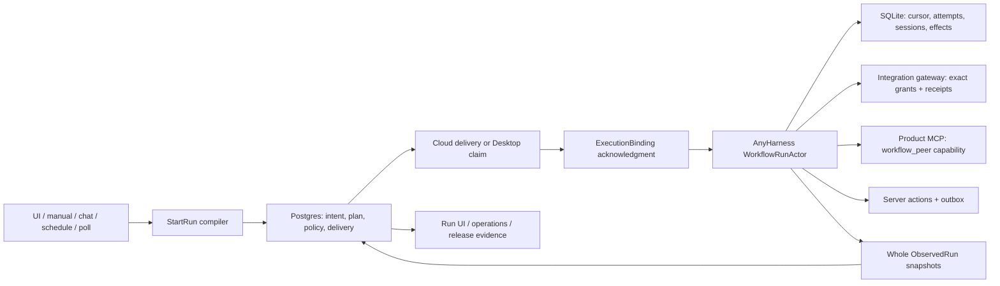

# Workflows

Status: authoritative target contract.

Date: 2026-07-10.

Depends on:

- [`../structures/server/guides/background.md`](../structures/server/guides/background.md)
- [`../structures/anyharness/README.md`](../structures/anyharness/README.md)
- [`../structures/anyharness/contract.md`](../structures/anyharness/contract.md)
- [`../primitives/mcp-runtime.md`](../primitives/mcp-runtime.md)
- [`../primitives/claiming.md`](../primitives/claiming.md)
- [`../primitives/workspace-lifecycle.md`](../primitives/workspace-lifecycle.md)
- [`agent-features/servers.md`](agent-features/servers.md)
- [`delegated-work.md`](delegated-work.md)
- [`chat-composer.md`](chat-composer.md)
- [`../../developing/deploying/ci-cd.md`](../../developing/deploying/ci-cd.md)

The dependency-ordered migration from the current implementation is tracked in
[`../../tbd/workflows-v1-completion-plan.md`](../../tbd/workflows-v1-completion-plan.md).
That plan is not operating law; this document is.

## 1. Purpose and scope

A workflow is a durable, versioned program for coordinating coding-agent work.
It combines deterministic orchestration with agent turns, isolated workspaces,
temporary capabilities, and triggers.

The launch contract includes:

- sequential agent stages
- parallel agent groups with isolated lane worktrees and a deterministic join
- schema-validated emitted state
- deterministic branching over emitted state
- explicit integration and HTTP function-invocation access
- required agent invocations proven by gateway receipts
- manual, chat, schedule, and poll triggers
- local Desktop and managed-cloud execution through the same AnyHarness engine
- binding and taking over compatible existing sessions
- workflow-agent discovery and messaging through Product MCP
- bypass-mode unattended execution
- fresh workspace or worktree isolation by default

Human approval, dynamic graph mutation, arbitrary agent-selected control flow,
and organization-owned workflow sharing are outside the launch bar. The schema
may leave room for them, but they are not release requirements.

## 2. Source precedence

This specification supersedes workflow behavior described by older planning
documents under `codex/**` and the vault whenever they disagree. In particular,
the following older rules are no longer current:

- workflows are sequential-only
- schedule, poll, or gateway-enabled runs are cloud-only
- a workflow capability grant names only a provider and therefore means every
  provider tool
- one run-wide gateway bearer is also the run-report credential
- a transcript tool name is proof of a required invocation
- an automation scheduler may execute or reconcile a workflow directly
- user input may interleave at workflow step boundaries
- manual local runs default to the selected shared checkout

The decisions in this document retain the valid core of those designs:
AnyHarness executes the whole resolved program, Postgres owns durable intent,
only StartRun compiles a definition, and agents never choose orchestration
branches through prose.

## 3. Decision register

| ID | Decision |
| --- | --- |
| WF-1 | The workflow interpreter is `WorkflowRunActor` in AnyHarness. The server never advances workflow steps. |
| WF-2 | Postgres owns definitions, immutable versions, triggers, run intent, desired state, delivery and execution-health state, frozen capability and peer policy, integration/function leases, server actions, and the monotonic mirror of runtime observations. AnyHarness owns Product MCP assembly and its run/session capability token. |
| WF-3 | AnyHarness SQLite owns observed execution truth: attempts, cursors, lane state, sessions, emits, checkpoints, effects, and quiescence acknowledgment. |
| WF-4 | Only StartRun resolves a workflow version into an immutable, secret-free logical plan. Execution cannot begin until the selected executor also freezes and acknowledges an immutable source `ExecutionBinding`. |
| WF-5 | Local and cloud use the same plan and execution engine. They differ only in materialization and delivery. |
| WF-6 | The server background plane is Celery/Beat plus the transactional outbox. A scheduler materializes intent; it does not execute a run. |
| WF-7 | Workflow branching is deterministic and reads only schema-valid prior emits. An LLM never chooses a branch through a branch tool. |
| WF-8 | Workflow capability access is an explicit, temporary, per-slot maximum. It does not inherit interactive default access. |
| WF-9 | A required invocation is satisfied only by a successful authoritative gateway receipt for the current attempt. |
| WF-10 | A workflow-owned session is protected by a Postgres reservation and an acknowledged AnyHarness enforcement lease. Every user mutation is denied until quiescent release. |
| WF-11 | Cancellation is desired state until the runtime acknowledges quiescence. Terminal state and lease release happen after that acknowledgment. |
| WF-12 | Fresh workspace or worktree isolation is the default. Existing workspace or session execution is an explicit binding. |
| WF-13 | Workflow sessions run in the harness's bypass-equivalent mode by default. Unsupported unattended approval is a typed preflight failure. |
| WF-14 | Workflow-agent communication reuses Product MCP, session links, and durable session messaging. It is not a new message bus. |
| WF-15 | Selected and effective source binding, harness, model, and mode are frozen and auditable before the first step. A runtime never silently substitutes them. |
| WF-16 | External effects are attempt-keyed and durable. An uncertain outcome is recorded as uncertain, not blindly replayed. |
| WF-17 | `workflow.include` is a bounded, capability-non-widening compile-time macro. StartRun pins and namespaces it into the parent plan; it never starts a child run or child interpreter. |
| WF-18 | Bypass-mode agent processes are untrusted. OS/process isolation prevents them from reading or mutating runtime state, credentials, control sockets, observations, leases, or checkpoint metadata. The workspace and explicitly brokered tool channels are the only shared surfaces. |

## 4. Core nouns and ownership



The only interpreter is `WorkflowRunActor`. Every other arrow either compiles,
delivers, authorizes an effect, or observes; none advances the workflow cursor.

```text
Workflow
  an authored program

WorkflowVersion
  an immutable definition snapshot

Trigger
  a mechanism that requests a run: manual, chat, schedule, poll, API, or agent

Run
  one durable execution intent

ResolvedPlan
  immutable, versioned, secret-free program produced only by StartRun

ExecutionEnvelope
  target-specific delivery metadata and short-lived credentials; private to the
  control plane, Desktop executor, and AnyHarness. It contains the immutable
  ExecutionBinding after executor acceptance

ExecutionBinding
  non-secret, immutable attestation of the actual source/workspace lineage used
  by this execution; hashed independently from the logical plan

Slot
  one immutable slot ID plus editable label, agent configuration, and session
  affinity

Stage
  one sequential agent node or one parallel group in the ordered spine

Emit
  schema-validated state produced by an agent and addressable by later stages

CapabilityLease
  temporary authority for exact integration tools or function invocations;
  Product MCP uses an AnyHarness-minted run/session capability

ObservedRun
  AnyHarness-produced execution truth projected monotonically to Postgres
```

| Concern | Owner |
| --- | --- |
| Workflow/version/trigger CRUD and visibility | Server/Postgres |
| Definition validation and StartRun compilation | Server workflow domain |
| Due-time discovery and durable follow-up | Celery Beat and transactional outbox |
| Local claim, heartbeat, materialization, and delivery | Desktop executor plus server claim API |
| Cloud materialization and delivery | Celery task calling the cloud workspace/sandbox boundary |
| Step interpretation, sessions, lanes, emits, and effects | AnyHarness workflow domain and live runtime |
| Agent/control-process integrity isolation | AnyHarness launcher plus Desktop-native or cloud worker platform adapter |
| Integration/function authorization and receipts | Server integration gateway |
| Frozen peer roster and maximum peer policy | Server/Postgres and the resolved plan |
| Product MCP token, tool assembly, and peer messaging | AnyHarness Product MCP domains |
| User-facing authoring, launch, lockout, and run observation | Shared product domain/UI plus Desktop wiring |

## 5. The four run contracts

The implementation must not collapse these contracts into one JSON blob.

### 5.1 Authored definition

The authored definition is user-visible, versioned, and contains no secrets.
It declares:

- inputs and defaults
- an ordered spine of sequential nodes and parallel groups
- slot harness/model/mode configuration
- workflow-level capability references
- optional per-slot capability subsets
- steps and their failure policy
- emit schemas and stable output names
- deterministic branch selectors and cases
- compile-time workflow includes

Unknown definition versions or step kinds are not editable by an older client.
The client renders an upgrade/read-only state; it never drops unknown data and
saves a truncated definition.

Canonical definitions persist lowercase UUID identities for every slot,
sequential node, parallel group/lane, include step, and ordinary step. New
objects use UUIDv7. Labels are editable business data; references, capability
subsets, session bindings, and React keys use IDs. A resolved step key is:

```text
<include-step-id path or root>::<node-id>::<lane-id or ->::<step-id>
```

Reorder and rename do not change it; clone creates new IDs. An include path is
the ordered `/`-joined sequence of include-step IDs, so two includes of the same
child cannot collide. Legacy definitions without identities are upgraded by a
new immutable version whose UUIDv5 IDs are deterministically derived once from a
fixed Proliferate namespace
`2b5e907a-2cd8-5b8f-b5ab-5c891bb93263`. The UTF-8 UUIDv5 name is exactly:

```text
workflow-version=<lowercase UUID>\nkind=<slot|node|group|lane|step>\nidentity=<identity>
```

For structural objects, `identity` is the RFC 6901 JSON Pointer into the
canonical legacy definition, such as `/agents/2/parallel/0/steps/3`. For a slot,
it is `slot:<legacy ASCII slot label>`, so repeated sequential uses share one
identity. The old version is retained for audit and is not silently rewritten.

### 5.2 Resolved plan

StartRun is the only logical-program compiler. It:

1. Pins the workflow version and every included version.
2. Validates and coerces inputs.
3. Resolves includes, rejects cycles, and namespaces included keys.
4. Assigns stable hierarchical step keys independent of array position.
5. Resolves source intent and execution-isolation requirements. A remote-backed
   source may also be pinned to an exact provider commit at this point.
6. Resolves requested and effective harness/model/mode configuration.
7. Resolves exact tagged capability references per slot.
8. Records deterministic parallel and branch semantics.
9. Produces and persists a SHA-256 content hash over RFC 8785 canonical JSON for
   the complete logical plan, excluding only the `planHash` field itself.

The plan does not contain bearer tokens, decrypted headers, encrypted secret
blobs, or a private execution envelope. Ordinary workflow APIs may return it.

The plan contains source intent, not an invented representation of executor-local
state. Fresh remote-backed runs normally carry a provider-resolved commit. An
offline local checkout, an unpushed commit, or an explicitly bound dirty
workspace completes source freezing through the `ExecutionBinding` handshake in
the next section.

Materialization-offer and runtime-delivery idempotency are separate. Before a
binding exists, an offer may be redelivered only for the same
`(run_id, plan_hash, target, execution_generation, executor_id)`. After binding,
runtime delivery may be redelivered only for the complete immutable delivery
identity. Any conflict is rejected.

### 5.3 Execution envelope

The binding handshake deliberately does not send final runtime credentials in
the first executor message:

1. StartRun persists the logical plan and source intent.
2. The server sends the selected executor a `MaterializationOffer` containing
   the plan/source intent, target, execution generation, executor fence, and a
   materialization-only credential.
3. The executor quiesces any explicit binding, materializes or checkpoints the
   actual source, and posts the proposed `ExecutionBinding` over that credential.
4. The server accepts exactly one binding hash for the generation and only then
   mints binding-bound audience credentials into the final immutable envelope.
5. The executor delivers the plan plus final envelope to AnyHarness and reports
   runtime acknowledgment.

`MaterializationOffer` is a derived, fenced transport message—not a fifth run
contract or a place to store mutable truth.

The final execution envelope is delivered separately and is never returned by
ordinary run list/detail APIs. It contains only what the selected executor and
runtime need, including:

- run-report credential
- per-slot one-use integration-credential issuance handle
- delivery/claim fencing identity
- private callback endpoints
- expiration and credential-generation metadata
- the accepted non-secret `ExecutionBinding` and its `bindingHash`

A fresh slot has no session ID when the envelope is minted. After AnyHarness
creates/registers the session and acknowledges its lease, it exchanges the
one-use handle over the authenticated control channel for a short-lived gateway
credential bound to run, binding, generation, slot, and session. The handle and
resulting credential are never agent-visible. The server durably records the
private issuance result before responding. An identical authenticated retry for
the same unacknowledged context returns that same credential generation; after
the runtime ACKs installation the handle is consumed. A different context,
post-ACK reuse, wrong-session exchange, or exchange before lease acknowledgment
is denied.

For a fresh remote-backed run, the binding records the exact provider commit and
the materialized workspace lineage. For a local-only or unpushed checkout,
Desktop attests the exact local commit. For an explicit existing-workspace
binding, Desktop/AnyHarness first creates an immutable system checkpoint and the
binding records the base commit plus checkpoint identity. The checkpoint
includes staged and unstaged tracked content, non-ignored untracked files,
symlink targets, executable bits, and submodule gitlink revisions. It excludes
`.git`, Git-ignored files, runtime-state roots, registered secret-materialization
paths, and sockets/devices; unsupported special files, index conflicts, or dirty
submodules fail preflight rather than being silently omitted. “Secret” here is a
path registered by the secret/materialization subsystem, not a heuristic content
scan. A registered secret path that would otherwise enter the checkpoint fails
preflight. Ignored files may remain in an explicitly selected existing workspace
but are outside the reproducible source binding and cannot be used as workflow
transport.

`checkpointContentHash` is `sha256:<lowercase hex>` over an RFC 8785 canonical
JSON checkpoint manifest. The v1 manifest records the repository object format
and base OID plus separate `indexEntries` and `worktreeEntries`. Entries sort by
raw path bytes and encode those bytes as unpadded base64, avoiding Unicode or OS
path normalization. Each entry records origin (`tracked` or `untracked`), Git
mode (`100644`, `100755`, `120000`, or `160000`), and SHA-256 of raw file bytes
or raw symlink-target bytes; gitlinks record their full submodule OID. Absence
relative to the base/index represents deletion. Directories are implicit. This
manifest, its valid/invalid cases, and restoration equivalence are shared golden
fixtures; implementations may not substitute `git status` text or a commit-tip
hash.

The v1 binding fields are fixed by the contract fixture:

```text
schemaVersion = 1
target = local | personal_cloud | shared_cloud
sourceKind = remote_commit | local_commit | workspace_checkpoint
repositoryObjectFormat = sha1 | sha256
baseCommitOid = full lowercase Git object id in that format
checkpointId/checkpointContentHash = required only for workspace_checkpoint
workspaceId/workspaceGeneration/materializationId
executorId/executorGeneration
bindingHash
```

Optional checkpoint fields are absent, not null. No timestamp, credential, path
on the user's machine, branch name, or mutable display label enters the binding
hash.

Postgres persists the redacted binding and its SHA-256 hash over RFC 8785
canonical JSON, excluding only the `bindingHash` field itself. The immutable
delivery identity is:

```text
(run_id, plan_hash, binding_hash, execution_generation)
```

If an executor cannot attest the selected source or checkpoint, it reports a
typed preflight failure and no step begins.

Credential audiences are separate. An integration credential cannot report
run status, a report credential cannot call an integration, and a Desktop
claim credential cannot be replayed by another device.

Every short-lived credential carries an audience and credential generation.
Before expiry, the executor/runtime requests rotation over its authenticated
claim/control channel. The server persists and returns the next audience-bound
generation; the runtime atomically installs and acknowledges it, after which the
old generation is revoked. A bounded overlap may accept both generations only
for the same immutable delivery identity and can never widen scope. If rotation
is not acknowledged before expiry, execution parks in the typed
`waiting_credential_refresh` state; it never falls back to interactive or
agent-visible credentials.

Envelope credentials, workflow provenance, and trusted activation context never
enter agent-controlled prompts, tool arguments, environment variables,
workspace files, or transcripts. They are injected only at trusted runtime,
MCP, proxy, or control-API boundaries. A public field such as
`workflow_internal=true` is never authorization.

They also never enter workflow-domain SQLite rows, raw/normalized events,
checkpoint manifests, or ordinary logs. Server-side issuance responses and
runtime-side credentials live only in a private encrypted credential store whose
data key is outside the database and unavailable to the agent process. Runtime
code holds plaintext only for the call boundary and zeroizes it after use. If
that private store/key is unavailable, preflight fails closed; persisting a
bearer in the workflow plan/store is not a fallback.

Credential secrecy alone is insufficient because a bypass-mode coding agent can
run arbitrary shell commands. Agent processes run under a separate OS principal,
container/sandbox namespace, or equivalently enforced platform sandbox from the
AnyHarness/worker/Desktop control plane. They cannot read/write the runtime home,
SQLite files, credential vault, private callbacks/sockets, lease/observation
state, or checkpoint/control metadata; cannot reach internal control listeners;
and cannot ptrace, signal, or read the environment/memory of control-plane
processes. Internal listeners also authenticate peer identity and trusted
generation rather than relying on loopback. The selected workspace and explicit
MCP/process I/O brokers are the only shared surfaces. Workflow bypass preflight
fails closed when the platform cannot enforce this integrity boundary.

### 5.4 Observed run

AnyHarness reports a whole `ObservedRun` snapshot bound to the immutable delivery
identity. It has a strictly increasing revision and includes:

- observed run and quiescence state
- global cursor and per-lane cursors
- stable step keys and attempt IDs
- step outputs and typed errors
- slot-keyed session IDs
- worktree/checkpoint identities
- cost and timing summaries

The server accepts a snapshot only when all identity fields match and its
revision is exactly the current revision plus one. A retry at the current
revision is accepted only when its canonical bytes are identical; a conflicting
same-revision snapshot is rejected and audited. Older snapshots are ignored and
future revisions are rejected for resynchronization. Once terminal, the run
snapshot is immutable. Late provider cost or audit reconciliation is append-only
in a separate ledger and never rewrites the terminal snapshot.

This exact sequencing is backed by a durable AnyHarness SQLite observation
outbox. Every revision is an immutable row. The reporter sends only the lowest
unacknowledged revision, retries identical canonical bytes until the server
acknowledges it, and then sends the next; it never polls only the latest runtime
snapshot. On reconnect, the server returns its acknowledged revision and the
runtime replays from the next row. Acknowledged rows may be compacted only after
the terminal snapshot and audit retention requirements are satisfied.

Rust, Python, and TypeScript consume shared golden fixtures for all four
contracts, including an `execution-binding-v1.json` fixture inside the envelope
contract.

## 6. Definition and execution semantics

### 6.1 Ordered spine and slot/session affinity

The plan is an ordered spine. A spine entry is either one agent node or one
parallel group. Steps within a node are sequential.

A run-level sequential slot ID owns one session on one workspace lineage. Later
sequential stages using the same slot ID reuse that session and conversational
context. A different slot never silently inherits it.

Parallel slot IDs are group-scoped lane slots. Each receives a fresh session on
its lane worktree and may not appear in another lane, an earlier/later
sequential stage, or another parallel group. The compiler rejects a slot used by
concurrent lanes or reused outside its group. Existing-session bindings are
therefore allowed only for run-level sequential slots. Reusing a parallel
session would require a future explicit context-clone or session-migration
protocol; v1 does neither.

### 6.2 Emitted state and branches

Workflow schemas use JSON Schema Draft 2020-12. V1 accepts only the vocabulary
implemented in all three contract languages; unsupported keywords are rejected
at save/compile rather than ignored. `agent.emit` prompts an agent, reads a
runtime-controlled output file or equivalent structured channel, validates a
JSON object against the frozen schema, and retries with bounded corrective
feedback. Only a schema-valid object becomes visible to later steps.

The exact v1 profile permits `$schema`, `type`, `properties`, `required`,
`additionalProperties`, `items`, `enum`, `const`, `minimum`, `maximum`,
`minLength`, `maxLength`, `minItems`, `maxItems`, `title`, `description`, and
`default`. Root schemas are canonicalized with
`"$schema":"https://json-schema.org/draft/2020-12/schema"`. `type` is one JSON
type or a two-item `[TYPE,"null"]` union; numbers must be finite. Emit roots are
objects, top-level property names are ASCII identifiers, and omitted
`additionalProperties` is canonicalized to `false` for every object. `default`
is an authoring annotation only and never causes runtime coercion. `$ref`,
`$defs`, combinators, conditionals, `pattern`, `format`, unevaluated/dependency
keywords, and every unlisted keyword are rejected. Golden valid/invalid schemas
pin this profile in Rust, Python, and TypeScript.

Authored templates have exactly two ordinary reference forms:

```text
{{inputs.NAME}}
{{EMIT_NAME.FIELD}}
```

Names are ASCII identifiers. Emit names are globally unique in the authored
definition and, after include expansion, in the resolved plan. A lane can read
pre-group emits and its own earlier emits; post-group stages can read joined
lane emits. Input values are coerced once by StartRun according to the declared
`text`, `number`, `boolean`, or `choice` type. Emit values are never implicitly
coerced. A template reference to an emit that is absent because its producing
step used `on_fail: continue` fails with `missing_emit`; the consuming step's
own `on_fail` policy then applies.

The v1 branch grammar is deliberately narrow: `branch.on` is exactly one
`{{EMIT_NAME.FIELD}}` reference whose schema field is a string, and `cases` maps
literal strings to `continue` or `end`. An unmatched or missing value is the
typed `branch_unmatched` or `missing_emit` failure and the branch step's
`on_fail` applies. It is evaluated by pure runtime code. There is no LLM branch
tool and no arbitrary expression language. A sibling lane's emit is invisible
until the parallel join succeeds.

`end` has one global meaning: complete the run and skip the remaining spine.
Inside a parallel group, an `end` request stops new work from starting, lets
already-running effects reach a safe boundary, quiesces the group, and then
completes the run without executing post-group stages. A future lane-local
termination primitive must use a different authored target such as `end_lane`;
v1 does not overload `end`.

When a lane requests `end`, partial group results are retained for inspection
but are not merged into the run-level workspace and no group emits become
visible. External effects that already completed remain durable and auditable;
workflow failure, cancellation, `end`, or a merge conflict never rolls them
back.

Terminal precedence is deterministic:

```text
explicit cancellation > unhandled failure > branch end > normal completion
```

### 6.3 Parallel groups and code reconciliation

At parallel-group entry the runtime:

1. Creates a durable checkpoint of the complete run workspace, including
   ordinary uncommitted edits.
2. Creates every lane worktree from that identical checkpoint.
3. Materializes every lane session, lease, peer link, and Product MCP capability
   before any lane receives its first turn.
4. Gives each lane its own cursor, attempts, session affinity, and emitted state.
5. Runs lanes concurrently.
6. Prevents a lane from seeing sibling in-progress outputs.
7. Waits for every started lane to settle or quiesce.
8. Captures each successful lane's complete allowed tree delta from the group
   base: committed, staged, unstaged, deleted, executable/symlink metadata, and
   non-ignored untracked changes.
9. Applies every successful delta in authored lane order to an off-to-the-side
   candidate checkpoint.
10. Atomically adopts that checkpoint as the run workspace only after every
    non-continued lane and every merge succeeds.
11. Persists base, lane-result, conflict, and merged checkpoint identities.
12. Exposes joined emits and the merged tree only after successful adoption.

By default, any unhandled lane failure fails the group after siblings settle.
Per-step `on_fail: continue` remains available. A merge conflict is a typed run
failure unless a later explicit reconciliation design is added; changes are
never silently discarded. On an unhandled lane failure or merge conflict, the
run workspace remains at the group-base checkpoint and all lane/candidate/
conflict artifacts are retained for inspection; no partial delta is adopted.

### 6.4 Compile-time includes

`workflow.include` is retained in v1 with these bounds:

- the target is a visible, same-owner, immutable workflow version containing
  one sequential agent node; includes inside parallel groups are rejected
- child triggers, target, source, isolation, harness, model, mode, and session
  bindings are ignored; included steps inherit the parent node's slot and run
  binding
- the include maps every required child input from parent inputs or prior emits
- the required include handle namespaces child step keys and emit names; child emits are
  referenced as `{{HANDLE_CHILD_EMIT.FIELD}}` after the include
- child capability references are requirements only: they must already be
  present in the parent's workflow maximum and parent slot subset, so an
  include can never widen authority
- cycles and expansion depth greater than eight are rejected

StartRun pins every included version and fully expands it. AnyHarness never sees
an include step or executes a child run.

### 6.5 Attempts, effects, and crash recovery

Before an externally meaningful action, the runtime persists a stable attempt
and effect identity derived from at least `(run_id, step_key, attempt)`.

Effects include agent turns, shell processes, SCM changes, gateway calls,
server actions, and notifications. Every effect defines one replay policy:

- resume or query the same external operation
- safely replay with an idempotency key
- reconcile by a durable external identifier
- stop with `outcome_uncertain`

A crash never causes a blind repeat of a non-idempotent effect. Runtime restart
rehydrates attempts, sessions, lane cursors, ownership leases, and checkpoints
before accepting new work.

## 7. Capabilities and function invocations

### 7.1 Interactive defaults and workflow overlays

Interactive default access and workflow access are separate policies.

- Interactive sessions receive the configured user/organization default set.
- Workflow definitions explicitly opt into exact capabilities.
- A slot may narrow the workflow maximum but cannot widen it.
- An ordinary agent prompt/emit receives the slot maximum for that turn unless
  the definition explicitly narrows its activation set.
- A required-invocation step names exactly one `integration_tool` or `function`
  capability and activates only that capability for every initial or corrective
  turn in its attempt. Product MCP is not a required-invocation target in v1.
- The overlay is revoked after runtime-confirmed terminal/quiescent state.

An exact `CapabilityRef` is a tagged union:

```json
[
  {"kind":"integration_tool","providerDefinitionId":"...","providerRevision":"...","toolName":"...","inputSchemaHash":"sha256:..."},
  {"kind":"function","definitionId":"...","semanticRevision":3},
  {"kind":"product_mcp","definition":"workflow_peer","policyRevision":1}
]
```

Product MCP is not routed through the integration gateway: the resolved plan
freezes its maximum peer policy, and AnyHarness mints/verifies the run/session
capability used by central MCP assembly. Integration/function credentials bind
run, plan hash, binding hash, generation, slot, and session on the trusted
gateway boundary. Agent-supplied run/slot/step context is ignored.

The effective authority is the intersection of:

```text
principal and organization policy
  ∩ worker or environment ceiling
  ∩ workflow-declared exact capability references
  ∩ slot-specific subset
  ∩ current-step activation
```

New integrations, tools, or functions created after StartRun never widen the
run. Revocation, archive, membership removal, or policy narrowing may deny a
previously frozen capability at the next authorization decision. The integration
gateway performs that live check on every request and keeps no positive
authorization cache; configuration writes bump the policy generation used for
audit and credential invalidation.

Binding an existing interactive session is an atomic preflight transition.
Lease preparation first closes admission. Existing active work must reach a
safe boundary or be explicitly cancelled by the takeover request; queued
prompts/interactions are cancelled with audit provenance and no pre-lease item
may start after preparation. The runtime then checkpoints the session, verifies
workspace lineage plus requested/effective harness, model, and mode, and stops
its `SessionRuntime` actor.

Because MCP assembly is fixed at actor start, AnyHarness uses central session
assembly to restart the same session ID and transcript with only the
workflow-scoped gateway and Product MCP bindings. It acknowledges the lease only
after that actor is ready. Dynamic ad hoc MCP injection is forbidden. On common
terminal release, the actor is quiesced and restarted through the same central
assembly with newly minted interactive bindings; the old bindings are never
reactivated.

### 7.2 Function invocation definitions

Function invocations are person-owned in v1. The model retains organization
and creator fields for a later ownership migration.

A semantic revision contains:

- stable definition ID and revision
- gateway tool name and display metadata
- HTTP method and endpoint
- authored header names, templates, and secret-binding identities
- path, query, header, and body input mapping
- input and optional output JSON Schema
- accepted success status rules
- redirect policy and idempotency-header behavior
- safety policy
- active/revoked state

Headers are encrypted and write-only. Credential rotation may take effect
immediately only when the secret value changes behind the same binding identity;
it cannot change names or templates. Any endpoint, method, mapping, header,
schema, status, redirect, or idempotency behavior edit creates a new semantic
revision and cannot mutate a running workflow's meaning.

The server performs outbound HTTP. It pins the vetted IP, preserves original
Host/SNI internally, rejects transport-controlled authored headers, refuses
private/reserved destinations and unsafe redirects, validates arguments,
limits body size and wall time, and never exposes credentials to agents.

### 7.3 Required invocation receipts

A required invocation is an agent completion gate, not a deterministic server
action.

```text
runtime persists attempt and generates a non-agent-controlled activation id
  -> runtime activates (run, slot, session, step, attempt, turn) through its
     authenticated control/report channel
  -> agent receives prompt
  -> agent calls integrations.call_tool
  -> trusted MCP/proxy adds bound credential context; agent arguments add none
  -> gateway authorizes, validates, executes, validates declared output schema,
     and durably records the activation-keyed result
  -> turn ends
  -> runtime queries or receives the authoritative record through an
     authenticated control interface
     -> present: complete
     -> absent: corrective re-prompt within the frozen budget
     -> exhausted: typed failure
```

A receipt records, without secret arguments or headers:

- run, plan hash, slot, session, step key, attempt, and turn/activation identity
- exact provider/tool/schema or function semantic revision
- authorization decision
- denied, upstream-failed, output-invalid, or successful outcome
- receipt ID and timestamps

Transcript prose, a native tool name, or an agent-supplied claim is never proof.
Denied, failed, stale, wrong-slot, wrong-step, or wrong-attempt receipts do not
satisfy the gate. A receipt ID returned in agent-visible tool output is only UX
metadata and is ignored as proof. If the upstream call succeeds but the tool
response or agent turn is lost, the runtime recovers the durable gateway record
by activation identity and does not repeat the external effect. Every corrective
turn gets a new activation ID under the same attempt; any one successful current
activation satisfies the gate, and stale activations cannot satisfy a later
attempt.

### 7.4 Deterministic actions

Actions such as a templated Slack notification are runtime- or server-issued
effects, not agent orchestration decisions. They use stable step/attempt keys,
the transactional outbox, idempotent action claims, and durable result receipts.

The runtime first persists its action effect, then submits the stable
`(run_id, step_key, attempt)` identity to the control API. The server atomically
records the action and outbox row and returns its action identity. The runtime
enters `waiting_action_result` and advances only after querying or receiving the
authoritative terminal receipt. A lost request/response is recovered with the
same idempotency identity; it never creates a second action. The result then
drives the runtime's `on_fail` decision. The server delivers and records the
effect but never advances the workflow cursor.

The internal action identity makes runtime-to-server submission retry-safe; it
does not magically make a provider POST idempotent. An outbox worker may retry a
provider send only when it passes a provider-supported, verified idempotency key
or can reconcile by a provider operation/message identity. If the provider may
have accepted a request but offers neither guarantee, the worker persists
`outcome_uncertain` and never resends automatically. Provider adapters document
which of those policies they implement.

Launch-v1 Slack notification freezes the reconciliation choice. The adapter
uses `chat.postMessage` with non-secret message metadata
`event_type=proliferate_workflow_action` and the stable action ID in the payload.
The connected bot must have `chat:write` plus the applicable public/private
conversation-history scopes; setup/preflight rejects a destination that cannot
be reconciled. After any ambiguous send result, the worker queries bounded
channel history for that metadata. A match records the returned channel/message
identity as success; no match after the bounded reconciliation window records
`outcome_uncertain` and never resends. Only a failure proven to occur before any
request bytes were accepted may retry. T3-WF-10 injects the post-acceptance crash
and proves one message. This relies on Slack's documented
[`chat.postMessage`](https://docs.slack.dev/reference/methods/chat.postMessage/)
metadata support and
[`conversations.history`](https://docs.slack.dev/reference/methods/conversations.history/)
readback; WS0/WS1 fixtures pin the exact metadata payload and required scopes.

## 8. Run state, session ownership, and takeover

### 8.1 Independent state axes

One overloaded `status` field is insufficient. The durable model separates:

```text
desired state
  running -> cancel_requested

delivery state
  ready -> claimed -> materializing -> delivered -> acknowledged
                      \-> retryable_ready
                      \-> terminal_delivery_failure

observed runtime state
  accepted -> running -> completed | failed
  running <-> waiting_action_result
  running <-> waiting_credential_refresh
  running -> quiescing -> cancelled

control-plane execution health
  healthy -> suspect -> orphaned

pre-acceptance cancellation coordination
  none -> cancelling_preaccept -> cancelled_before_acceptance

step attempt
  pending -> running -> completed | failed | outcome_uncertain
```

Execution health and pre-acceptance cancellation are independent: a cancelling
materialization can also become suspect/orphaned. `orphaned` is a server-owned
coordination marker set when an executor cannot be
reached; it is never forged as an AnyHarness observation. The last runtime
snapshot remains unchanged and terminal-snapshot immutability still holds.
Public presentation derives a concise run status from desired, delivery,
observed, lease, and execution-health facts without destroying them.

Human approval and interactive permission/user-input waits are not launch-v1
states. Workflow sessions use bypass-equivalent unattended mode. An unsupported
interactive requirement is a typed failure, not a parked run that can never be
resumed safely.

### 8.2 Session leases

A bound or runtime-created workflow session has a two-sided durable lease:

```text
available -> reserved -> prepared -> claimed -> quiescing -> released | orphaned
```

Postgres is authoritative for reservation and enforces one non-released lease
per `session_id` with a partial unique constraint whose blocking states are
`reserved`, `prepared`, `claimed`, `quiescing`, and `orphaned`. Only `released`
may be rebound. `generation` is a monotonically increasing fencing token, not
part of a uniqueness key that would allow two generations. Acquisition of all
explicitly bound sessions for a run is one transaction: either every reservation
succeeds or none does.

Installation is a coordinated prepare/commit protocol across the owning
runtimes. Prepare closes admission, drains/cancels prior work, checkpoints,
restarts through central capability assembly, and persists the proposed lease
in AnyHarness SQLite, but permits no workflow turn. Only after every session
returns an authenticated prepared acknowledgment does the control plane commit
the batch; every runtime then marks it claimed. The run cannot enter `accepted`
or execute a step until every commit acknowledgment arrives.

If any prepare/commit fails, the coordinator aborts every participant. A runtime
that already prepared must quiesce, reverse-restart interactive assembly, and
return a rollback acknowledgment. Postgres reservations remain fenced until all
prepared participants have rolled back; an unreachable participant becomes
orphaned rather than being released optimistically. A runtime-created session is
registered and acknowledged before its first turn.

AnyHarness synchronously hydrates and enforces active local leases before its
health/readiness boundary opens after startup. Every workflow-internal mutation
carries unforgeable run/generation provenance on a dedicated internal path; the
same data in a public request body has no authority.

While claimed, every user-originated mutation is denied, including prompt,
resume, config, fork, close, dismiss, cancel, title changes, permission or user
input responses, and MCP elicitation resolution. Workflow-internal operations
carry trusted provenance and use explicit internal paths.

This workflow session lease is not the irreversible
`cloud_workspace_claim`/shared-work ownership transfer in
[`../primitives/claiming.md`](../primitives/claiming.md). An existing shared
workspace still follows that one-way ownership policy. Workflow session leases
are temporary executor fencing and never undo or impersonate a workspace claim.

### 8.3 Terminal release, cancellation, and takeover

Cancellation is valid before runtime acceptance and follows delivery evidence:

- if the run is unclaimed and no runtime lease was prepared, one transaction
  sets desired cancel, records `cancelled_before_acceptance`, invalidates offers,
  and releases reservation-only rows; quiescence is vacuously proven because no
  executor could start and no runtime observation is fabricated
- if an executor claimed/materialized or any session lease prepared, the server
  records a durable cancel command and retains a cancellation/report fence; the
  executor stops materialization, aborts prepared leases, and acknowledges
  cleanup before `cancelled_before_acceptance` becomes terminal
- if final-envelope delivery occurred but runtime acknowledgment was lost, the
  executor queries AnyHarness by immutable delivery identity; an accepted run
  uses runtime quiescence, while a proven non-acceptance uses compensating
  rollback. Without either proof the run remains `cancel_requested`

Invalidating an offer prevents new work but never removes the narrow authority
needed to acknowledge cancellation/rollback.

Normal completion, failure, cancellation, and takeover share one release
protocol. The runtime first stops all turns/process groups and reports a
terminal **and quiescent** observation. The server mirrors terminal truth,
revokes workflow gateway/Product MCP authority, and requests central actor
reassembly with fresh interactive bindings for retained sessions. Only after the
runtime acknowledges that reassembly does Postgres mark those session leases
released and permit user mutations. If reassembly fails, the run may remain
terminal but the session stays visibly `quiescing` and fenced.

Takeover is destructive cancellation with audit provenance. It has no resume.

```text
server desired_state = cancel_requested
  -> durable cancel command
  -> runtime stops turns and process groups
  -> runtime persists and reports quiescent cancellation
  -> server mirrors observed cancelled
  -> revoke capability leases
  -> runtime reassembles retained sessions with fresh interactive bindings
  -> release session leases after reassembly acknowledgment
```

The server never reports terminal cancellation or accepts a new binding merely
because a best-effort cancellation request was sent. An unreachable executor
remains visibly `cancel_requested`. Lease expiry may revoke server/gateway
authority and mark the old execution `orphaned`, but it cannot prove a local
process stopped and therefore cannot make the same live session rebindable.
Rebinding that session requires the original runtime to self-fence, stop every
turn/process, and return a quiescent acknowledgment for its generation.
The same run/generation never resumes on another runtime without that proof.
Otherwise the old run becomes non-resumable `orphaned`; an operator may
explicitly create a distinct replacement run with a new run ID and fresh
sessions after reviewing duplicate-effect risk. There is no automatic
replacement, and the old sessions/materialization remain retained for
inspection.

## 9. Workspace and source isolation

The plan plus acknowledged `ExecutionBinding` pins the exact source lineage. A
moving branch cannot alter an accepted run, and the first step cannot begin
before source attestation succeeds.

Default launch behavior:

| Entry | Default |
| --- | --- |
| Manual local | Desktop creates a fresh per-run worktree, then delivers to local AnyHarness. |
| Scheduled/polled local | Desktop claims the run and creates a fresh per-run worktree. |
| Manual/scheduled/polled cloud | Cloud delivery materializes a fresh run workspace or worktree. |
| Chat with explicit existing-session binding | Execute in the bound session's workspace after atomic ownership transfer. |
| Explicit existing-workspace launch | Use the selected workspace and show that choice clearly. |

Local and cloud AnyHarness support the same sequential and parallel plan. A
target adapter may fail preflight for a missing platform capability, but the
workflow language does not have local-only or cloud-only semantics.

Cloud materialization launches agent processes outside the runtime/control
container or UID/namespace. Desktop uses its native child-process sandbox/helper
boundary to deny runtime-home, control-socket, process-inspection, and private
loopback access. File permissions alone under the same unrestricted user are not
an equivalent boundary. Both targets run the same adversarial isolation suite.

Run and lane worktrees have a retention and cleanup policy. Cleanup occurs only
after terminal observation and preserves failed/conflicted work long enough for
inspection. A worktree/checkpoint is execution materialization, not the durable
Workspace, Session, transcript, or run record; cleanup never deletes those
records. Successful clean materializations may be pruned after their terminal
checkpoint is recorded. Dirty materializations are auto-pruned only after an
explicit adopted checkpoint satisfies the generation/preflight rules in
[`../primitives/workspace-lifecycle.md`](../primitives/workspace-lifecycle.md).
Failed, conflicted, outcome-uncertain, or orphaned materializations are retained
under a bounded operator-visible policy and are never silently discarded.

## 10. Triggers, scheduling, and polling

### 10.1 One StartRun path

Manual, chat, schedule, poll, API, and agent triggers all call the same StartRun
service. A trigger never interprets a step and never constructs a partial plan.

### 10.2 Schedule plane

Beat finds due trigger occurrences. The thin Celery task owns a short database
transaction in which the worker-facing service:

1. Locks or compare-and-swaps the due trigger state.
2. Creates an idempotent run intent for the occurrence.
3. Writes a cloud-delivery outbox row when external follow-up is required.
4. Advances the schedule cursor only past durably represented occurrences.
5. Returns without committing; the task commits the transaction.

After commit, the outbox relay delivers a cloud job. A committed local-ready row
is already claimable and requires no outbox merely to become visible; an
optional best-effort Desktop wake is not correctness-critical. Local Desktop
execution remains an HTTP claim/heartbeat/report protocol, not a Celery task.
Cloud delivery is an idempotent task that materializes the target and hands the
complete plan and private envelope to AnyHarness.

The schedule occurrence idempotency identity is
`(trigger_id, scheduled_for_utc)`. RRULEs are interpreted in the stored IANA
timezone and occurrence identities are stored in UTC. A nonexistent spring-DST
wall time is skipped; an ambiguous fall-DST wall time fires once at the earlier
offset. Missed occurrences are enumerated oldest-first. `run_latest` records all
older slots as `missed` and runs the newest, `skip_all` records every slot as
`missed`, and `replay_all` creates one intent for every slot in order. A retry
cannot create another row for an existing occurrence identity.

No workflow-specific `while True` scheduler or poller process exists.

### 10.3 Poll contract

The launch contract is replayable and cursor-based. Both endpoints return the
same v1 page shape:

```text
GET <base>/init
GET <base>/poll?cursor=<opaque>&limit=<n>

200 application/json
{
  "items": [
    {
      "id": "non-empty stable external id (maximum 255 characters)",
      "kind": "optional string",
      "occurred_at": "optional RFC 3339 timestamp",
      "data": {"workflow_input": "value"}
    }
  ],
  "cursor": "optional opaque string or null",
  "has_more": false
}
```

`/init` is called without a cursor and its first item is the setup sample used
to derive/diff workflow inputs; an empty page is valid. `/poll` returns items
with stable external IDs and an opaque next cursor. `items` is required and is
an array; `cursor` and `has_more` default to null/false. Unknown response fields
are ignored for forward compatibility. Providers may replay pages; they are not
required to destructively remove served items.

Poll auth is one configured header name plus a write-only value encrypted at
rest and decrypted only in the worker. Header names are matched
case-insensitively. `Host`, `Content-Length`, `Transfer-Encoding`, `Connection`,
`Proxy-*`, `Forwarded`, `X-Forwarded-*`, `Via`, `Upgrade`, `TE`, `Trailer`, and
`Sec-*` are forbidden, as are any standard hop-by-hop or client-controlled
transport headers. Fetches pin the vetted IP while preserving original Host/SNI,
do not follow redirects, and enforce the frozen timeout/body/page limits.

Polling uses the scheduling plane:

```text
Beat -> durable poll-attempt task
prepare transaction:
  claim/fence attempt and freeze trigger config + requested cursor
task -> close DB session -> SSRF-safe HTTP -> open a new DB session
apply transaction:
  validate page and item schemas
  dedupe by (trigger_id, external_item_id)
  persist each new item as durable run intent
  write delivery outbox only for cloud targets; local-ready rows are claimable
  record duplicate or permanently invalid/dead-letter decisions
  compare-and-swap the cursor only when every page item is durable
  when has_more, write the next-page outbox row in this same cursor transaction
```

Transient materialization or database failure leaves the cursor unchanged.
Poison items have explicit retry/dead-letter state; they are not silently sealed
into the seen set as if successfully scheduled. Network I/O never holds a trigger
row lock or database transaction. A schema-invalid item is a permanent dead
letter with its external ID and redacted validation error. A transient item/run
failure is retried with the same identity up to five attempts, then becomes a
visible dead letter; the page cursor advances only after every item has a
durable run, duplicate, or dead-letter decision. `has_more=true` schedules the
next bounded page task with the returned cursor rather than looping inside one
transaction. It is valid only with a non-null cursor different from the request
cursor. The cursor CAS and next-page outbox write are atomic, so a crash cannot
lose the next page. One poll occurrence processes at most 100 pages; reaching
the budget records `poll_page_budget_exhausted`, emits no immediate next-page
job, and lets the next scheduled occurrence continue from the last durable
cursor. Repeated cursors are a permanent contract error, not a loop.

Setup supports both directions:

- poll first: probe `/init`, derive workflow inputs, preserve the non-secret
  trigger draft, create the workflow, then create the trigger
- workflow first: show the required `/init`/`poll` schema and reject an
  incompatible endpoint before enabling the trigger

Poll targets may be local or cloud. A local target produces the same durable run
intent and waits for a Desktop claimant.

## 11. Workflow-agent communication

Workflow peers use the existing Product MCP assembly, capability-token, session
link, and durable message storage. They use a distinct `workflow_peer` link
policy rather than subagent parent/child ownership.

The workflow resolver supplies a run roster and peer policy. AnyHarness session
MCP assembly attaches a workflow-aware Product MCP capability; the workflow
executor does not construct MCP servers directly.

Launch tools are intentionally narrow:

- list planned and materialized permitted peers in the current run, with stable
  slot identity, session availability, status, and whether an unstarted future
  actor-scheduled turn can consume a message
- send a durable message only to a materialized permitted peer with such a
  future turn
- observe separate `queued` and `consumed` receipts

A session cannot enumerate or message another run's agents. Run termination or
capability revocation denies new messages. Messaging informs agents; it does not
mutate the deterministic workflow graph or choose branches. It never creates an
autonomous turn or advances a cursor: the recipient consumes queued messages as
context only on its next actor-scheduled turn. Sequential data flow should use
emits; a future, not-yet-materialized sequential peer cannot receive a message.
If the peer has no future unstarted turn, send fails `peer_no_future_turn`
instead of claiming delivery that can never be consumed.

## 12. Product behavior

The product must support authoring, not merely preserving API-seeded fields:

- input schemas and template references
- sequential nodes and parallel groups
- stable editable slot labels backed by immutable draft identities
- emit JSON Schemas and retry budgets
- required provider/tool or exact function invocation
- workflow-wide capabilities and per-slot subsets
- deterministic branches
- schedule and both poll setup flows
- explicit existing-workspace/session binding
- local versus cloud target

The run surface shows desired, delivery, and observed state honestly. A
cancel-requested run is not rendered as cancelled. Bound sessions visibly show
workflow ownership, block input, link to the run, and provide destructive
takeover. Session links navigate to the exact session rather than only its
workspace.

Editor drag/drop uses typed stable draft identities. Editable slot names are
business data, not React keys or lookup identity.

## 13. Observability

Every background task and runtime report carries run, trigger, target, user,
organization, worker/executor, and correlation identity without secret payloads.

Minimum operational views:

- workflow success/failure/cancellation by target and trigger
- scheduled-for to run-intent, claim, delivery, runtime-start, and terminal latency
- claim expiry and retry counts
- poll HTTP, validation, duplicate, retry, and dead-letter counts
- gateway allow/deny/failure receipts by provider/tool without arguments or headers
- cancellation-request to quiescence latency
- duplicate-effect prevention and outcome-uncertain counts
- parallel lane duration and merge-conflict rate

## 14. Verification and release contract

Every correctness property has two proofs:

1. A deterministic lower-tier state-machine, security, or fault-injection test.
2. A minimal live product-path test proving the deployed components are connected.

The required live matrix covers:

- UI creation and launch
- local/cloud agent-shell denial against runtime home, SQLite, vault, private
  sockets/callbacks, and control-process inspection/mutation
- function-invocation UI creation
- strict emit and deterministic branch
- required invocation receipt
- function and integration allow/deny with zero denied upstream calls
- sequential slot reuse
- parallel dirty-state fork, lane work, merge, and downstream visibility
- poll `/init`, item scheduling, cursor, and replay
- scheduled cloud execution
- scheduled Desktop claim, execution, relay, and completion
- bound-session lockout and acknowledged takeover
- workflow-agent listing and messaging
- one idempotent real notification

Release policy treats missing, skipped, blocked, expected-fail, cancelled, and
duplicate required scenarios as failures. Workflow Tier 2 is a required merge
check. Pre-merge qualification may run on an integration SHA, but it is not
release evidence after a squash merge. Strict local and staging/cloud Tier 3
summaries used for promotion are built, deployed, and rerun against the exact
merged `main` SHA and record immutable artifact identities.

Production remains a separate explicit approval after the exact SHA passes
CI, staging deployment, strict workflow Tier 3, and the configured staging bake.
While production workflows are enabled, every production path—including
nightly, hotfix, Desktop stable-updater, runtime/worker, and template
promotion—must consume that same fail-closed evidence. A staging-bypass input is
not permitted for a workflow-enabled release.

## 15. Current migration exceptions

The current workflow branch does not yet conform to this target. Known classes
of migration work include:

- public observed state loses stable step and slot identity
- plan and private gateway credentials are combined
- local/unpushed/dirty source is not frozen through an acknowledged execution binding
- capability grants are namespace-wide and flattened across slots
- required invocation uses transcript/native-name heuristics rather than receipts
- workflow scheduling and polling use bespoke loops rather than Celery/Beat/outbox
- polling holds database state across HTTP and can advance past unscheduled items
- manual local execution defaults to an existing workspace and local parallel is rejected
- run-wide slot/session reuse is incompatible with lane-specific parallel worktrees
- lane merge-back does not capture ordinary uncommitted edits
- cancellation and ownership release precede runtime quiescence
- the editor cannot author required invocations or emit schemas
- workflow-agent communication is not provisioned
- current Tier 3 can pass with blocked or expected-fail workflow scenarios

The completion plan owns the migration sequence and current file-level evidence.
Do not weaken this contract to match a temporary implementation exception.
