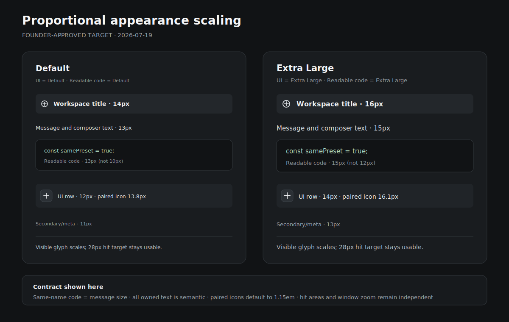

# Appearance Scaling

Status: target

Current gap: Desktop/Web already persist and apply independent UI font,
readable-code font, and window-zoom preferences, but the visible contract is
incomplete. At the frozen base, Default message/composer text is 13px while
Default readable code is 10px; a production scan also finds 32 fixed text-size
declarations across 20 files and 107 fixed-size vector-glyph call sites. Those
fixed consumers respond to whole-window zoom but generally do not respond to
the UI font preference.

Frozen delivery base: `ec2aafc2cf1d0d254adfce1bb0084a90e06e4b38`.

## Outcome and boundary

The Appearance controls must be truthful across the shared Desktop/Web
product:

- UI font size owns every non-code product text role and every
  Proliferate-owned vector glyph.
- Readable code font size owns Monaco, xterm, diffs, code blocks, file-source
  views, and code-shaped diagnostic output.
- Window zoom remains an independent multiplier over the whole rendered
  component tree.

This is one indivisible Appearance-preference flow across auth, home,
workspace, sidebar, settings, dialogs, error recovery, and shared Cloud product
surfaces. A partly migrated product is not an acceptable intermediate target.
Mobile remains outside this DOM preference contract until it exposes an
equivalent native setting.

## Design reference

- **Primary reference:** Codex Desktop `26.715.31925`.
- **Exact state:** the open file-browser/file-tree workspace preserved as
  `reference/codex/files/file-browser.png`, a `1800 × 1600` deterministic replay
  of saved live DOM with the installed renderer's adopted stylesheet. Its
  measured file-tree row uses 13px text in a 28px row with a 10px label/icon
  gap.
- **Match:** one legible scale per semantic role, code that is not artificially
  smaller than surrounding reading text, label/icon optical sizing that moves
  together, and stable compact-control hit areas.
- **Intentional differences:** Proliferate retains eight independent UI and
  readable-code presets, existing fonts and hierarchy, the 46rem chat column,
  themes, and separate window zoom.
- **Founder-approved Proliferate mock:**
  [Default and Extra Large scale contract](appearance-scaling-mock.svg). The
  founder approved the mock direction and complete-coverage rule on
  2026-07-19.



## Control flow

```text
uiFontSizeId
  -> UI_FONT_SCALES
  -> root semantic --text-* and --icon-* variables
  -> every owned non-code text and vector-glyph consumer

readableCodeFontSizeId
  -> READABLE_CODE_FONT_SCALES
  -> Monaco + xterm + diffs + code blocks + file source + diagnostics

windowZoomId
  -> existing whole-renderer zoom path
```

The three stored ids remain independently selectable, persisted, resolved, and
applied. Invalid or missing ids continue to fall back independently to
`default`.

## Readable-code parity

For every `id` in `APPEARANCE_SIZE_IDS`, the same-named readable-code font size
equals the visible message/composer font size:

```text
READABLE_CODE_FONT_SCALES[id].monacoFontSize
  = px(UI_FONT_SCALES[id].composer.fontSize)
  = px(READABLE_CODE_FONT_SCALES[id].diffsFontSize)
  = px(READABLE_CODE_FONT_SCALES[id].codeFontSize)
```

| Preset | Message/composer | Readable code target |
| --- | ---: | ---: |
| Extra Extra Small | 11px | 11px |
| Extra Small | 11.5px | 11.5px |
| Small | 12px | 12px |
| Default | 13px | 13px |
| Large | 14px | 14px |
| Extra Large | 15px | 15px |
| Extra Extra Large | 16px | 16px |
| Extra Extra Extra Large | 17px | 17px |

Editor, diff, and terminal line heights remain readable, strictly monotonic,
and greater than their font sizes; they do not need to equal prose line height.

## Semantic text and glyph contract

- Every user-visible owned string resolves through a semantic text role,
  including badges, counts, keyboard hints, empty states, dialogs, errors,
  auth/brand text, terminal-login text, and code-adjacent labels.
- Every owned vector mark resolves through a semantic optical tier, including
  icons, chevrons, close controls, disclosure glyphs, status symbols, dirty
  markers, provider marks, and icon-font characters.
- `body` inherits the primary `--text-ui` role as the safety net for otherwise
  untyped owned strings and icon-only controls. Role-specific utilities still
  override that fallback, and the unchanged `html` root keeps rem-based layout
  geometry independent from the UI font preference.
- Paired row/button icons default to `1.15em` of their owning label. Compact,
  large, and display tiers remain proportional to a semantic text owner.
- Visible glyphs scale inside their existing accessible target. Pointer hit
  areas and structural row heights stay fixed unless an existing responsive
  contract already scales them.
- Build-time CSS defaults equal the runtime Default rung so pre-hydration and
  hosted-Web rendering cannot drift.
- Third-party numeric APIs receive a value resolved by the appearance owner;
  they do not own literal sizes at feature call sites.

Raster media, user avatars, screenshots, borders, shadows, and pointer hit
targets are not glyph icons and do not become font-relative.

## Ownership and implementation seams

- `apps/packages/product-client/src/lib/domain/preferences/appearance.ts`
  owns UI, readable-code, window-zoom, and semantic glyph ladders.
- `apps/packages/product-client/src/config/theme.ts` applies the resolved text
  and readable-code root variables through `applyAppearancePreference`; the
  stable `em` glyph ratios resolve from design CSS against those text owners.
- `apps/packages/design/src/css/dom.css` and `product.css` own Default CSS
  fallbacks and global semantic utilities.
- `apps/packages/ui/src/utils/tw-merge.ts` preserves custom semantic utilities
  where Tailwind merge classification requires registration.
- Production consumers live under
  `apps/packages/{ui,product-ui,product-client}`. Component-local aliases must
  not preserve a fixed-size path.
- Focused appearance/drift tests and a repository source guard own regression
  enforcement.

The glyph ladder is exposed as `--icon-status`, `--icon-compact`,
`--icon-paired`, `--icon-control`, `--icon-large`, and `--icon-display`.
The matching `icon-*` utilities size only the visible vector through those
properties; wrappers keep owning fixed pointer-target and row geometry.

## Repository enforcement

Repo checks must reject raw fixed production text or glyph sizing at product
call sites. The migration inventory is generated from the final PR head and
must reach zero.

`scripts/check_appearance_scaling.py` is the no-allowlist production guard. It
runs in the repo-shape CI job and from the Desktop design-system check; its
focused unit test locks fixed text, imported/custom/inline SVG, descendant
selectors, component-local glyph props/aliases/defaults, status-dot, and global
CSS-alias failure cases.

Allowed numeric definitions are limited to:

- the canonical appearance ladders and matching CSS Default fallbacks;
- non-glyph geometry such as hit targets, rows, avatars, media, and hairlines;
- a documented third-party adapter whose numeric value is derived from the
  active preference.

There is no open-ended allowlist. Every structural exception names its semantic
reason in the guard. A developer adding a fixed `size={16}` glyph must get a
failing repository check before merge.

## Failure behavior

- Missing CSS variables fall back to the same Default geometry that hydration
  applies.
- Changing UI size does not change readable code when the readable-code id is
  unchanged; changing readable-code size does not change UI text or glyphs.
- Window zoom continues to increase or decrease the complete rendered
  component tree without rewriting either font preference.
- Enlarged text and glyphs use the owning surface's existing wrap, truncate, or
  scroll behavior. Essential labels and accessible targets must not be clipped.
- A missed owned call site is a release blocker, not deferred cleanup, because
  mixed scaling makes one selected preset internally inconsistent.

## Non-goals

- Mobile/native appearance controls.
- Font-family, weight, color, spacing/density, chat-width, or window-zoom
  redesign.
- Scaling raster media, avatars, borders, shadows, or hit targets as glyphs.
- Redesigning individual product surfaces while migrating semantic sizing.
- Raising bundle caps or absorbing unrelated JavaScript/Rust failures.

## Acceptance and proof

- At all eight presets, Monaco, xterm, diffs, code blocks, and file-source views
  equal same-named message/composer font size.
- Default computes to 13px for message and every readable-code surface; Extra
  Large computes to 15px.
- UI, readable-code, and window-zoom preferences remain independent in storage
  and application.
- The production source guard finds zero raw fixed text sizes outside canonical
  ladders/preference-derived adapters and zero raw fixed glyph dimensions at
  product call sites.
- Paired icons stay within 0.5 CSS px of their semantic ratio at Default and
  Extra Large while accessible targets remain usable.
- Matching `1280 × 720` real-product captures cover Appearance settings and a
  populated workspace with sidebar, message, inline code/diff, composer, right
  file tree, and terminal at Default and Extra Large.
- A `900 × 720` capture proves enlarged content does not clip essential labels
  or controls.
- One 10–30 second recording changes UI size and readable-code size separately
  and shows no cross-coupling.
- Focused behavior, drift, and source-guard tests; product-client/shared package
  typechecks; frontend boundary/strict-structure checks; `git diff --check`;
  login-budget proof; and PR metadata/readiness checks pass.
- This frontend-only change runs no Rust build and starts no Docker stack.
