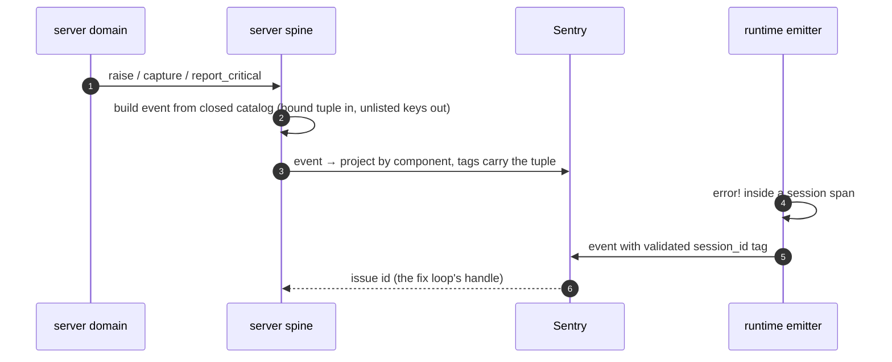
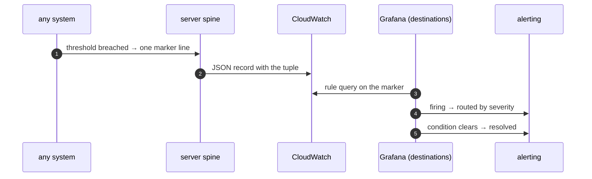
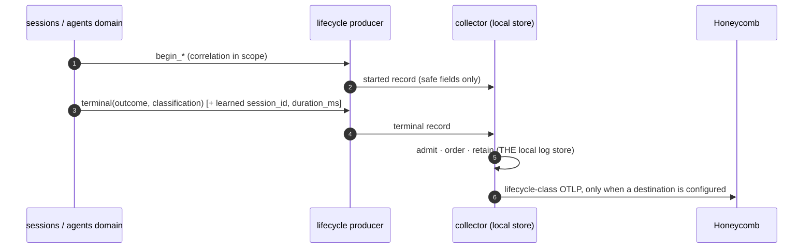
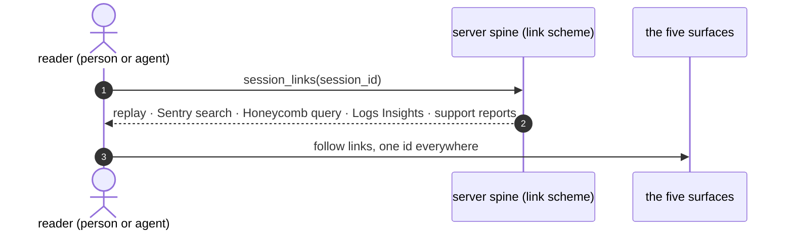

# Observability

Status: current for the signal machinery, catalogs, and scrubbing law; the delta table at the end names every place prod still trails this document. Grade B pending Pablo's full pass.

Read before touching: [standard.md](standard.md) (the per-PR observability-delta decision layer), [sentry.md](sentry.md) (the exception surface's capability file), [honeycomb.md](honeycomb.md) (the attempt/SLI surface's capability file), [alerting.md](alerting.md) (thresholds, severity, routing — a sibling system, not this one), and the [rust-observability ADR](../../../adrs/2026-08-10-rust-observability.md) (the diagnostics plane's frozen wire contract).

## 0 · Scope

Observability is the engineering system that turns every other system's signals into one legible account of what happened, for two readers: a person triaging and an agent fixing. It owns no product state — it owns the correlation vocabulary, the closed catalogs that bound what may leave a machine, the emitters' shared machinery, and the destination wiring. **Given a `session_id`, everything that happened to it is reachable — by a person in under a minute, by an agent with no person — and nothing leaves a machine that is not in a closed catalog.**

The boundary, by leg:

```text
server/proliferate/integrations/sentry/        server spine: capture helpers + the closed Sentry catalog
server/proliferate/middleware/{request_context,request_telemetry,logging}.py   the ID tuple, its binders, the JSON log shape
server/proliferate/auth/sign_in_observability.py                              the sign-in outcome contract line
anyharness/crates/anyharness-lib/src/observability/                            runtime emitter: tracing targets + lifecycle producers
anyharness/crates/proliferate-diagnostics-{protocol,client,collector}/         the diagnostics plane: wire contract, producer, THE local log store + export valve
anyharness/crates/anyharness/src/telemetry.rs · proliferate-{worker,supervisor}/src/logging.rs   runtime Sentry inits + scrubbers + log sinks
apps/packages/product-client/src/domain/telemetry/ · apps/{desktop,web,mobile}/**/telemetry/     client emitters: adapters + scrubbers, zero owned truth
server/infra/observability/ · scripts/ops/                                     destinations: config-as-intent + apply/verify tooling
```

This system is responsible for: the canonical metadata every signal carries and who stamps each field; the closed catalogs (Sentry tags/extras, lifecycle operations, log markers) and the law that they are allowlists; the three production surfaces and the one local one, each with exactly one job; the export valve through which anything runtime-side leaves a machine; and the link scheme that makes one id reach every surface.

Fences — what this system deliberately does not own:

| Not ours | Owner | The line |
| --- | --- | --- |
| Alert thresholds, severity policy, routing, runbooks, the issue→test loop | [alerting](alerting.md) | we emit markers and records a rule *can* select; the rule is theirs |
| PostHog, product analytics, anonymous telemetry, Metabase | [posthog](posthog.md) / [analytics](analytics.md) | product measurement rides our naming and scrubbing laws but is its own consumer |
| Report capture, redaction, S3 custody, the Slack receipt | [support](../../systems/support/README.md) | we consume its `support.report.captured` marker and report id as correlation |
| Test tiers, proof placement, the pre-push/PR/nightly pipelines | [testing](../testing/README.md) | we supply stable ids; CI verdict red is not a telemetry event |
| Release construction, `release_id` identity | [delivery](../ci-cd/release-delivery.md) | we stamp what delivery mints |
| Each product system's own emitters | that system's spec | we may *require* a signal; we never write another system's emitter |
| Cloud-sandbox log custody after the sandbox dies | [seam](../../systems/environments/seam.md) | a named deferral: runtime logs in cloud environments are relayed or lost; the relay is seam work, post-launch |

Rules of the road, governing every section below: **ids are bound, never threaded** — one bind point per leg, no function signature grows a telemetry parameter — and a bound id only survives if the destination catalog also **admits** it, so every id change touches binder and catalog together or it silently vanishes. **Closed catalogs, never scrub-by-review** — outbound events are built from allowlists; an unlisted key is structurally absent, and nothing relaxes for a demo. **Three surfaces, three jobs** — logs alert, Sentry catches, Honeycomb traces; no surface is ever a success condition for a product request, and every emitter no-ops when unconfigured. **The record is the replay** — the runtime session event log is the canonical transcript; observability links to it and annotates it with ids, never builds a second one. **Two naming namespaces** — machine telemetry is dot-form `<system>.<object>.<verb>` with closed outcome enums; product analytics events are snake_case past-tense and TypeScript-typed; both are closed, and the split is a fence, not a debt.

## 1 · Cells

### server spine — the tuple and the exception path

Owns the correlation vocabulary (ContextVars), the closed Sentry catalog, the JSON log record shape, and the one bridge from application failure to a page-worthy marker.

- **Doors** — `report_critical(message, *, tags, extras)`: fatal Sentry event plus the exact `CRITICAL_FAILURE` log marker, the only line the production-down alert rule selects. Every server domain raises through it or through `capture_server_sentry_exception`; nothing else reaches Sentry deliberately.
  - consumed by every server domain's failure paths; by [alerting](alerting.md), whose critical rule greps the marker.
- **Door** — `with_correlation_context(**ids)` and `bind_background_correlation_context(**ids)`: bind the tuple for a request or a background job. The request path binds automatically (`session_id` parsed from a `/sessions/<uuid>` path segment); a job or proxy that loads a session binds explicitly at its entry.
  - consumed by the HTTP middleware (automatic), Celery task entries, and any code doing session work off-path.
- **Door** — the structured log record: one JSON line via `JsonLogFormatter`, carrying the tuple; the alert-evaluation source.
  - consumed by CloudWatch → Grafana (the destinations cell); by anyone reading a session's server-side story.
- **Door (target)** — `session_links(session_id)`: the link scheme, one helper returning the five story links (app session page, Sentry tag search, Honeycomb query, CloudWatch Logs Insights, support reports). Encoded once; consumed by the runs-triage surface and the alerting runbooks.
- **Consumes** — `release_id` from delivery; the session route shape from sessions.

### runtime emitter — machine truth and the local log store

Owns the named tracing targets, the closed lifecycle-operation table and its producers, every runtime scrubber, the per-process log sinks, and the diagnostics collector — which is **the** local logging system: admission, ordering, bounded retention, query, tail, and the export valve.

- **Door** — the lifecycle producers `begin_session_create(…)`, `begin_turn_execute(…)`, `begin_agent_start(…)`, `begin_model_request(…)`: session/harness code emits product lifecycle records through these and nothing else; the closed `LIFECYCLE_OPERATIONS` table is the contract.
  - consumed by the sessions domain (create, turns), the agents domain (start), and the launch probe (model request).
- **Door** — the collector's local HTTP surface: `/v1/records` (bounded query), `/v1/tail` (live stream), `/v1/health` (exporter state, drop counts). Loopback-only, capability-token-authed.
  - consumed by the `proliferate logs` tail verb; by desktop support snapshots; by the desktop debug view.
- **Door** — the OTLP export leg: the **only** way a runtime record leaves the machine, collector-subset-by-label under a compile-time policy (customer builds physically export `lifecycle` class only). Destination is configuration (`PROLIFERATE_DIAGNOSTICS_OTLP_ENDPOINT` / `_HEADERS`); absent destination means no queue, no task, no export.
  - consumed by Honeycomb ([honeycomb.md](honeycomb.md)); gated by the desktop release workflow's `lifecycle_only` assertion.
- **Consumes** — `install_id` and `user_id` from the desktop host at collector spawn (collector-stamped resource attributes; producers cannot set, spoof, or omit them); the destination endpoint and key from the destinations cell.

### client emitters — adapters with zero owned truth

Own the per-surface Sentry adapters and scrubbers (desktop renderer, desktop native, web, mobile) and the typed product-event map. They adapt and scrub; they hold no session truth beyond the scope tag they set when a session gains focus and clear when it closes.

- **Door** — `scrubTelemetryEvent` and the per-surface before-send scrubbers: every client event passes one before leaving.
- **Door** — `host.telemetry.track(name, payload)` over the 40-event typed map: product analytics events, routed by [posthog](posthog.md)'s allowlist. Not a telemetry signal; a product measurement.
- **Consumes** — the active session id from the session store; DSNs and environment from build config.

### destinations — config-as-intent

Owns the checked-in statements of what the live providers should look like — Grafana rule and dashboard JSON, Honeycomb trigger JSON, CloudWatch group retention, the secrets inventory — and the operator tooling that applies and verifies them. A checked-in file is intent; a receipt from `verify` is the only evidence the live provider matches.

- **Door** — the `check | apply | verify` verbs (`scripts/ops/grafana-*.mjs`, `scripts/ops/honeycomb-triggers.mjs`): `check` runs offline in PR CI; apply+verify+receipt runs on merge to main; a nightly `check` catches drift, and the fix is commit-back or revert, never silent divergence.
  - consumed by the monitor lane (`.github/workflows/grafana-monitors.yml`); by agents proposing monitors as PRs.
- **Consumes** — repo secrets (`GRAFANA_ADMIN_TOKEN`, `HONEYCOMB_INGEST_KEY_PROD`, `HONEYCOMB_CONFIG_KEY`), minted by Pablo, mirrored in `~/.proliferate-local/observability-keys.env` with 1Password as source of truth.

## 2 · Data

### The canonical metadata

Every signal carries the tuple below. Each field has exactly one stamper; producer-supplied identity is refused (a compromised or buggy child cannot forge it). An id is admitted to a vendor only in canonical UUID form where UUID-shaped; custom ids stay local.

| Field | Stamper | Server logs / Sentry | Runtime records (OTLP) | Client |
| --- | --- | --- | --- | --- |
| `organization_id` | server auth middleware; runtime env at spawn | log key + tag `organization_id` | scope tag `org_id` (Sentry), absent on wire records | tag via auth state |
| `user_id` (id only, never email) | server auth dependency; desktop host at collector spawn | Sentry `user.id`, cleared at teardown | resource attr `proliferate.user_id`, absent when signed out | Sentry user id |
| `session_id` | the leg that holds the session (see the bind law) | log key + tag `session_id` | wire field → attr `proliferate.session_id`, every phase where the id exists | scope tag `session_id` on focus |
| `run_id` · `invocation_id` (target) | the CP transition writer, when runs land | log key + tag | — | — |
| `request_id` | HTTP middleware, per request | log key + tag | — | — |
| `operation_id` · `parent_operation_id` | the diagnostics producer, per lifecycle operation | — | wire fields, mandatory / optional | — |
| `install_id` | the collector, from `--install-id` passed by the desktop host | never in server logs | resource attr `proliferate.install_id`, pseudonymous, absent when the host has none | optional Sentry tag |
| `component` | each process at init, closed enum | log key `component` (target) | `service.name` + attr `proliferate.component` | Sentry tag `component` (target) |
| `surface` | the interaction's entry point | tag `surface` | — | tag `surface` |
| `environment` | build/deploy config, closed set | Sentry environment + log key | `deployment.environment.name` | Sentry environment |
| `release_id` | delivery: `component@version+sha12` | log key `release_id` + Sentry release | `service.version` | Sentry release |
| `cloud_target_id` · `cloud_sandbox_id` | environments; kept distinct, both | log keys + tags | `proliferate.target_id` | — |

The bind law, per leg: the runtime holds `session_id` as a span field and a wire correlation field — it is in scope wherever session work happens, and `learn_session_id` attaches an id minted mid-operation to the terminal record. The server binds it ambiently — automatically from a `/sessions/<uuid>` path, explicitly via `with_correlation_context` at any job or proxy entry that loads a session. The client sets a scope tag on session focus and clears it on close. The worker reads it off the message envelope it carries and interprets nothing. **Bind + admit, always**: `TAG_VALIDATORS` (server), the scrub allowlists (clients), and the wire schema (runtime) must each admit a key or the bind evaporates silently — `test_sentry_transport_privacy.py` pins the server half.

### Closed vocabularies

- `environment` ∈ `local · staging · production · dogfood`. `trusted-beta` is retired; it was production's fossil name and survives only as a dated alias row in the Sentry catalog until the last pre-rename release ages out.
- `component` ∈ `server · web · desktop_renderer · desktop_native · anyharness · worker · supervisor · mobile · diagnostics_collector`.
- `surface` ∈ `web · desktop · mobile · api · slack`.
- Terminal outcomes ∈ `succeeded · rejected · failed · cancelled · timed_out · abandoned` (six, enforced in `TerminalOutcomeV1`). `rejected` means user-fixable configuration; `failed` means we broke it — the split drives pager posture in the alerting spec.
- Severity for alerts ∈ `critical · warning` (the alerting spec's; listed for completeness).
- Machine signal names are dot-form `<system>.<object>.<verb>` from a closed catalog; product analytics names are snake_case past-tense from the typed event map. No third namespace exists.

### The closed catalogs

- **Sentry tags and extras** — `TAG_VALIDATORS` / `EXTRA_VALIDATORS` in `server/proliferate/integrations/sentry/privacy.py`. Allowlist with per-key validators; unlisted keys structurally absent; UUID-shaped ids admitted via `canonical_uuid` only. Any tuple change edits this file and its pinning test in the same PR.
- **Lifecycle operations** — `LIFECYCLE_OPERATIONS` in `proliferate-diagnostics-client/src/lifecycle.rs`: the operations AnyHarness may emit, each with closed `safe_fields` and closed `classifications`. Four product operations: `anyharness.session.create`, `anyharness.turn.execute` (carries `duration_ms` and `first_output_ms` on terminals), `anyharness.agent.start`, `anyharness.model.request`. An addition is a privacy decision, not a logging decision, because every entry is exported from every customer machine.
- **The P0 operation catalog** — 91 dot-form names in `proliferate-diagnostics-protocol/src/v1/catalog.rs`, pinned by the golden fixture `fixtures/contracts/rust-observability-v1/` and enforced at collector ingest: a lifecycle record with an uncatalogued name is rejected. The catalog is part of the frozen v1 contract; launch-selection validity deliberately does **not** add a name — it is already encoded in `session.create` and `agent.start` rejection classifications (`launch_options_unavailable`, `launch_value_unsupported`, `agent_env_override_unsupported`, `route_auth_refused`).
- **Log markers** — the stable server log names a rule may select: `CRITICAL_FAILURE`, `auth.sign_in.outcome`, and the fleet markers (`RUN_TERMINAL`, `BUDGET_ENVELOPE_EXHAUSTED`, `WORKER_DEGRADED`) as their systems land. A marker is a contract; renaming one is a seam change with the alerting spec.
- **The wire record** — `ProducerRecordV1`: schema version, timestamps, sequence, boot id, component, release, environment, the correlation fields (`operation_id`, `parent_operation_id`, `trace_id`, `workspace_id`, `session_id`, `turn_id`, `item_id`, `request_id`, `target_id`, `prompt_id`, `workflow_id`), name, severity, typed arguments, error classification, record class, privacy, redaction, and exactly one of a `detailed` or `lifecycle` payload. `CanonicalLifecycleV1` (phase, outcome, finalizer, bounded model/plugin metadata) has no free-text field to leak.
- **The log record** — one JSON line: `timestamp, level, logger, message, release_id, version, git_sha`, every bound correlation key, scalar extras, `exception`. Text format only when a human is the reader (local dev, `debug=true`); JSON whenever a machine is (production, cloud mode).
- **Destination intent** — `server/infra/observability/grafana/*.json` (rules, dashboard, checksummed), `server/infra/observability/honeycomb/triggers/*.json` (the five SLI triggers), CloudWatch group retention (30 days everywhere).

### Key custody

Operational keys live in `~/.proliferate-local/observability-keys.env` (0600) for tools, with a 1Password entry as source of truth and a re-mint line per key in the runbook; CI reads repo secrets (`SENTRY_AUTH_TOKEN` live; `GRAFANA_ADMIN_TOKEN`, `HONEYCOMB_INGEST_KEY_PROD`, `HONEYCOMB_CONFIG_KEY` pending mint). A wiped dotfile must never again take the insight loop down: the file is a cache, never the only copy.

## 3 · Flows

### Flow 1 — a failure becomes a Sentry issue carrying the tuple

A server exception propagates (Starlette/Celery integrations) or is captured (`capture_server_sentry_exception`) or is reported fatal (`report_critical`) — **one capture per failure, never two**: propagate *or* capture *or* report-critical. The outbound event is built from the closed catalog — bound context flushed at teardown, unlisted keys absent — and lands in the component's project tagged with the tuple. Runtime ERRORs forward through the sentry-tracing layer, which copies the validated `session_id` span field onto the event; a handled AnyHarness incident returns its incident receipt and the client does not re-capture it. Client exceptions carry the focused session's scope tag. Server ERRORs in logs deliberately do not auto-Sentry (exceptions propagate; logs stay logs) while runtime `error!` deliberately does (no exception mechanism crosses the process edge) — an asymmetry that is law, not accident.



### Flow 2 — a marker becomes an alert that fires and resolves

Code crosses a threshold it owns and emits one bounded marker line — **thresholds live in code and emit on breach; rules select markers and never compute business logic**. The line lands in CloudWatch, the one evaluation engine (Grafana) evaluates its rule, the firing routes through the alerting spec's destinations, and when the condition clears the alert resolves — **every rule has a firing state and a clear condition; a stuck alert is a bug in the rule**. One deploy-gate sensor (`RelayHeartbeat`, read by the server deploy workflow) lives outside Grafana by design; nothing else does.



### Flow 3 — a lifecycle record leaves the machine

Session work begins; the domain calls its `begin_*` producer; arguments outside the operation's closed `safe_fields` are dropped before the record exists; the collector admits it (uncatalogued names and secret-classified fields rejected at ingest — the single mechanical privacy gate), orders it, retains it locally. If and only if a destination is configured, the export worker encodes the **lifecycle-class subset** to OTLP and ships it to Honeycomb — `detailed` records, the only payload that can carry free text, never leave under a customer policy, and the compile-time `EXPORT_POLICY` plus the release workflow's `lifecycle_only` assertion make widening impossible without a build change. The destination arrives baked into the desktop release from a repo secret today and moves to the server-served capability document (Stage 3) so export becomes revocable org-wide without a client release; self-hosters keep the telemetry-mode off switch either way.



### Flow 4 — an SLI breaks durably

Honeycomb holds the lifecycle stream; the five SLIs are defined over it as checked-in trigger intent, applied and verified by the destinations tooling, and evaluated by Honeycomb on its own cadence — the trigger fires into the alerting path and resolves when the condition clears. The five: **session-create success** (rejected vs failed split), **agent-start success**, **time-to-first-output** (`first_output_ms` on turn terminals), **launch-selection validity** (rejection-classification rate), and **orphan rate** — **one `started` and exactly one terminal per operation is the protocol's own invariant, so a `started` with no terminal within budget is a bug by definition**, no judgment required. Sign-in success stays in Grafana (log-sourced, no pipe needed).

```mermaid
sequenceDiagram
    autonumber
    participant HC as Honeycomb
    participant DT as destinations tooling
    participant AL as alerting
    DT->>HC: apply trigger intent (check offline in PR; apply on merge)
    HC->>HC: evaluate on cadence over lifecycle records
    HC->>AL: trigger fires → Slack via the alerting path
    HC->>AL: condition clears → resolves
```

### Flow 5 — one id becomes the story

A reader — a person triaging or the demo fixing agent — starts from a `session_id`. The link scheme door renders the five links from the one id by a fixed scheme, never hand-pasted: the app session page (the canonical replay — the record IS the replay), the Sentry tag search `session_id:{id}`, the Honeycomb query on `proliferate.session_id`, the CloudWatch Logs Insights filter, and the support reports citing it. Locally, the same story is one command: `proliferate logs --session <id>` interleaves the collector's records and every process's file sink into one time-ordered stream — the local twin of the production story.



### Flow 6 — a new signal is born

A PR that changes behavior states its observability delta or an explicit "none" ([standard.md](standard.md)). A new machine signal takes a dot-form name, a closed outcome, and a catalog admission in the same PR (safe-field list for a lifecycle op, validator row for a Sentry tag, marker registration for a log rule source); a new product event takes a typed map entry and, if it must reach PostHog, an allowlist decision in [posthog](posthog.md). When a surface dies, its signals die in the same PR — markers, rules, triggers, typed events, and display names, grep-gated (deletion-completeness). A rename is a seam change.

Coverage check: flow 1 exercises the capture doors and the Sentry catalog; flow 2 the log record, markers, and the Grafana lane; flow 3 the lifecycle producers, the collector doors, and the export valve; flow 4 the trigger intent and the SLI vocabulary; flow 5 the link scheme and the tail verb; flow 6 the per-PR surface and both namespaces. Every catalog in §2 is written or read by at least one flow; the `/v1/records`–`/v1/tail` doors serve flows 3 and 5.

## 4 · Structure

### Cell 1 · server spine

```text
server/proliferate/
├── integrations/sentry/
│   ├── __init__.py                 re-exports
│   ├── client.py                   init_server_sentry (gated: enabled + hosted_product + DSN) · explicit integration list ·
│   │                               capture_server_sentry_exception(error, *, level, tags, extras) · report_critical(message, *, tags, extras) ·
│   │                               set_server_sentry_tag / set_server_sentry_correlation_context / clear_server_sentry_user
│   └── privacy.py                  TAG_VALIDATORS · EXTRA_VALIDATORS · canonical_uuid · _UUID_TAGS (session_id, interaction_id, command_id, anyharness_workspace_id) · http_route
├── middleware/
│   ├── request_context.py          ContextVars for the tuple · with_correlation_context(**ids) · bind_background_correlation_context(**ids) · get_correlation_context()
│   ├── request_telemetry.py        per-request binding: session_id_from_path (canonical UUID after /sessions/) · http_route + http_method tags ·
│   │                               correlation → Sentry at teardown · clear user
│   └── logging.py                  JsonLogFormatter (the log record) · CorrelationLogFilter · text only when debug
├── auth/sign_in_observability.py   log_sign_in_outcome → event="auth.sign_in.outcome" + auth_sign_in_{outcome,surface,failure_code}
├── background/task_metrics.py      message-only JSON loggers for the deploy-gate sensor family
└── server/event_logging.py         correlation-carrying structured event helper (rename rides the Wave-2 server regroup)
```

Local invariants: the catalog is an allowlist and every change to it changes `test_sentry_transport_privacy.py` in the same PR; `send_default_pii=False`, `max_request_body_size="never"`, profiles off; the Sentry user is id-only and cleared at request teardown; `report_critical` is the only source of the `CRITICAL_FAILURE` marker; a request without a session binds nothing (pinned by `test_request_telemetry_session_binding.py`).

### Cell 2 · runtime emitter

```text
anyharness/crates/
├── anyharness-lib/src/observability/
│   ├── mod.rs                      the named tracing targets (anyharness.*), underscore-spelled targets → dot-spelled record names
│   └── lifecycle.rs                begin_session_create(workspace_id, agent_kind, preselected_session_id, reuse_existing, selected_model, selected_control_count, origin)
│                                   begin_turn_execute(session_id, turn_id, engine_initiated) · begin_agent_start(workspace_id, session_id, agent_kind, startup_strategy, has_system_prompt_append)
│                                   begin_model_request(session_id, agent_kind, route)          ← the probe's request
├── proliferate-diagnostics-client/src/lifecycle.rs
│                                   LIFECYCLE_OPERATIONS (closed safe_fields + classifications per op) · LifecycleOperation::{begin, begin_with_arguments,
│                                   append, learn_session_id, succeeded, terminal(outcome, classification), terminal_with_model} · install_global_producer
├── proliferate-diagnostics-protocol/src/v1/
│   ├── types.rs                    ProducerRecordV1 · CanonicalLifecycleV1 · TerminalOutcomeV1 (six) · the correlation fields
│   ├── catalog.rs                  the 91 P0 names, golden-fixture-pinned
│   └── validation.rs               ingest gate: uncatalogued names rejected · privacy==Secret rejected record- and argument-level · detailed XOR lifecycle
├── proliferate-diagnostics-collector/src/
│   ├── http.rs                     /v1/ingest · /v1/records · /v1/tail · /v1/export · /v1/health (loopback-only, capability token)
│   ├── main.rs · config.rs         --install-id · --user-id (absent when signed out) → collector-stamped resource attrs
│   └── export/{policy,target,otlp,worker}.rs
│                                   EXPORT_POLICY compile-time (LifecycleOnly | All under internal-dogfood-export) ·
│                                   PROLIFERATE_DIAGNOSTICS_OTLP_{ENDPOINT,HEADERS} (https-only unless loopback; /v1/logs appended) ·
│                                   resource attrs service.* + deployment.environment.name + proliferate.install_id + proliferate.user_id + dev.user ·
│                                   record attrs proliferate.{name,record_class,component,session_id,turn_id,operation_id,error_classification,lifecycle.*,argument.*}
├── anyharness/src/telemetry.rs     Sentry init (ANYHARNESS_SENTRY_DSN) · scrubbers · SessionIdSpanLayer → session_id event tag · target→record mapping · file sink <runtime_home>/logs/anyharness.log
├── anyharness/src/cli.rs           the clap surface: Serve · InstallAgents · CatalogProbe · … · Logs (the tail verb)
└── proliferate-worker/src/logging.rs · proliferate-supervisor/src/logging.rs
                                    Sentry inits (PROLIFERATE_TARGET_SENTRY_*) · scrubbers · rotating file sinks worker.log / supervisor.log · JSON when a machine reads
```

Local invariants: one `started` + exactly one terminal per operation (duplicate and conflicting terminals are counted and surfaced by the collector); an argument outside `safe_fields` is dropped before the record exists; an unlisted classification degrades `failed` to `abandoned` rather than shipping an unbounded string; the collector is the single mechanical privacy gate and the producer table is the second belt; a process with no installed producer emits nothing (every test, every non-desktop run); the export leg no-ops without a destination; `session_id` rides every phase where the id exists at emit time — `session.create` learns its minted id via `learn_session_id` and carries it on the terminal.

### Cell 3 · client emitters

```text
apps/packages/product-client/src/
├── domain/telemetry/scrub.ts       scrubTelemetryEvent — the client allowlist (session_id admitted as a tag)
├── lib/domain/telemetry/events.ts  DesktopProductEventMap — the 40 snake_case typed product events
└── lib/hooks (telemetry)           useTelemetrySessionSelection — tags session_id on focus, clears on close; setTag('', …) clears
apps/desktop/src/lib/integrations/telemetry/   renderer Sentry + PostHog adapters (replay off; 7-event allowlist is posthog.md's)
apps/desktop/src-tauri/src/telemetry.rs        native Sentry with the full before-send/breadcrumb/log scrubber, send_default_pii=false
apps/web/src/browser/telemetry/                web Sentry + PostHog (autocapture off, pageviews off, recording source-disabled)
apps/mobile/src/lib/integrations/telemetry/    mobile Sentry adapter
```

Local invariants: every emitter has a before-send scrubber — no exceptions, desktop-native included; clients derive no session truth (the scope tag mirrors the store, nothing else); replay stays source-disabled pending its parked ruling; typed events are product analytics, fenced to [posthog](posthog.md).

### Cell 4 · destinations

```text
server/infra/observability/
├── grafana/production-alerts-rebuild.json     the canonical workspace's rules (g-48655e6419) — five production + sign-in SLI
├── grafana/production-overview-dashboard.json the dashboard
├── grafana/production-alerts.json             OLD workspace (g-e532d030d8) — retirement rides the burn-in delta row
├── honeycomb/triggers/*.json                  the five SLI triggers as intent (session-create, agent-start, ttfo, launch-selection, orphan-rate)
└── honeycomb/product-sli-queries.json         superseded by triggers/ — deleted in the same PR that applies them
scripts/ops/
├── grafana-{client,alerting,rebuild-bootstrap,sli-alerts,receipts,…}.mjs   check/export/apply/verify + receipts
└── honeycomb-triggers.mjs                     check | apply | verify for trigger intent (offline check; live gated on HONEYCOMB_CONFIG_KEY)
.github/workflows/grafana-monitors.yml         PR check · merge apply+verify+receipt · nightly drift (loud skip until secrets exist)
.github/workflows/release-desktop.yml          bakes the OTLP destination from HONEYCOMB_INGEST_KEY_PROD (loud skip when absent) · asserts lifecycle_only on packaged collectors
```

Local invariants: intent is checksummed and `check` runs offline; apply happens only from main; every apply ends in verify and a receipt; drift is flagged nightly, never silently reconciled; CloudWatch retention is 30 days everywhere; the downloads CloudFront distribution logs to `proliferate-cloudfront-logs` (hand-made — its terraform absence is an infra-spec debt, not ours).

## Delta vs prod

Structural differences between this document and `main` as of 2026-08-26 evening. Each row names its discharge.

| # | Spec says | Prod today | Discharged by |
| --- | --- | --- | --- |
| 1 | `http_route` admitted | set but dropped by the catalog | PR #2255 |
| 2 | runtime Sentry events carry `session_id` | org/user/sandbox/target only | PR #2256 |
| 3 | client session scope tag + native scrubber | no client session tag; native unscubbed | PR #2257 |
| 4 | environment ∈ closed four-value set | `trusted-beta` defaults everywhere | PR #2258 |
| 5 | sentry.md capability file | pre-ruling content | PR #2259 |
| 6 | one evaluation engine + deploy-gate sensor | (landed: alarms deleted live) terraform + spec | PR #2262 |
| 7 | monitor lane: check/apply/verify/drift in CI | hand-run scripts | PR #2263 (+ `GRAFANA_ADMIN_TOKEN` mint) |
| 8 | worker/supervisor file sinks · JSON-when-machine-reads | console-only; text everywhere | PR #2264 |
| 9 | grafana-logging.md capability file | absent | PR #2265 |
| 10 | `begin_model_request` emitted at the probe | declared, never emitted | slice O-1 |
| 11 | `duration_ms` + `first_output_ms` on turn terminals | neither exists | slice O-1 |
| 12 | `--user-id` collector stamp when signed in | install_id only | slice O-1 |
| 13 | destination baked into desktop release from secret | no destination anywhere; leg dark | slice O-1 (+ `HONEYCOMB_INGEST_KEY_PROD` mint) |
| 14 | five SLI triggers as intent + honeycomb-triggers.mjs | three parked queries, never executed | slice O-2 (+ `HONEYCOMB_CONFIG_KEY` mint) |
| 15 | `proliferate logs` tail verb · local server.log sink | four disjoint places, no merge | slice O-3 |
| 16 | `session_links(session_id)` helper | links hand-assembled | slice O-3 |
| 17 | `support.report.captured` marker | receipt carries fields; no queryable marker | support seam PR (this branch) |
| 18 | Stage 3 server-served destination (kill switch) | unbuilt | post-launch build item |
| 19 | old Grafana workspace retired + JSON deleted | both live through burn-in | dated retirement PR |
| 20 | cloud-sandbox log custody | lost with the sandbox | seam spec, post-launch |
| 21 | session replay ruling | source-disabled, parked | Pablo, unparked when the xterm/canvas masking is provable |

## Build list

Dependency-ordered; each item names the delta rows it discharges.

- [ ] Merge train for the standing PRs: #2255 → #2256 → #2257 → #2258 → #2262 → #2263 → #2264 → #2265 → #2259, rebasing serially (rows 1–9). Pablo merges.
- [ ] Pablo mints: `HONEYCOMB_INGEST_KEY_PROD` + `HONEYCOMB_CONFIG_KEY` (+ dogfood re-mint) and `GRAFANA_ADMIN_TOKEN` → repo secrets + the keys file (rows 7, 13, 14).
- [ ] Slice O-1 — every install streams (rows 10–13): `delivery/observability/delivery-spec-slice-1-every-install-streams.md`.
- [ ] Slice O-2 — SLIs that break durably (row 14): `delivery-spec-slice-2-durable-slis.md`.
- [ ] Slice O-3 — the local tail + the link scheme (rows 15–16): `delivery-spec-slice-3-local-tail.md`.
- [ ] Support marker seam change (row 17) — rides this spec PR, flagged to the support owner.
- [ ] Stage 3: destination served by the server capability document; the baked secret becomes the fallback (row 18).
- [ ] Old-workspace retirement PR after the burn-in week, JSON deleted in the same PR (row 19).
- [ ] Seam spec names cloud log custody (row 20); replay stays parked until ruled (row 21).
