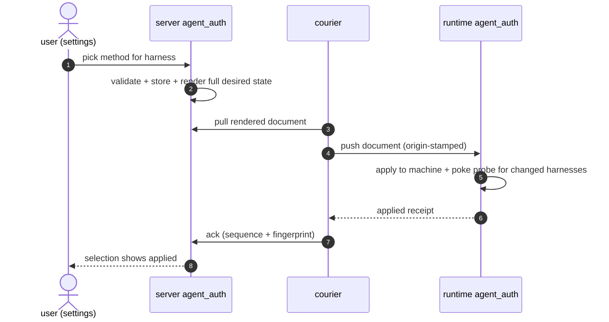
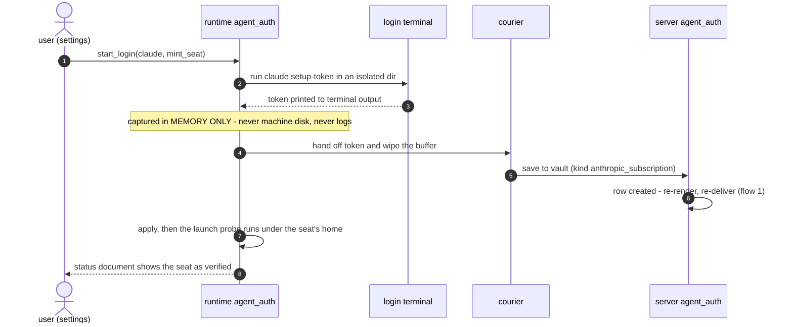
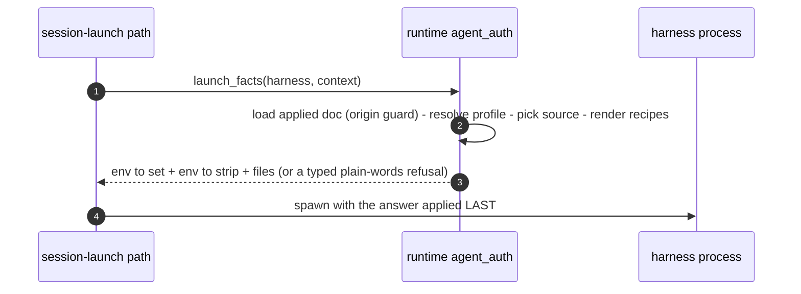
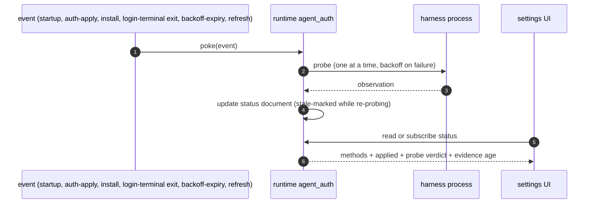
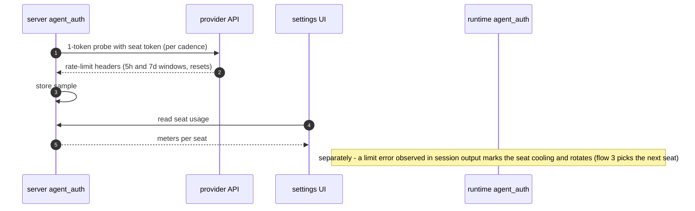

# Agent auth

How a harness gets working model credentials at launch. The server half owns the *choices* — the credential vault, each person's per-harness selection, org policy, and the renderer that turns choices into one desired-state document per surface. The runtime half owns the *machine truth* — applying that document, probing that it works, running login flows, and answering the launcher. Couriers move documents between the halves and never interpret them.

The one-sentence contract: **at session launch, the runtime reads one local document, resolves the harness's selected sources, and materializes them; a selection that cannot be satisfied refuses the launch with a plain-words typed error rather than silently running on different credentials.**

This spec reads as ground truth for the final system. Every difference from what `main` runs today is collected in the transitional [Delta vs prod](#delta-vs-prod) section at the end, which is deleted when spec and code converge.

## 0 · Scope

**The folder census** — the code inside this system's boundary:

| Leg | Code |
| --- | --- |
| server | `server/agent_auth/` · the agent_auth tables in `db/models/agent_gateway.py` · the agent_auth stores in `db/store/agent_gateway/` · `constants/agent_gateway.py` |
| runtime | `domains/agent_auth/` — `route_auth/` · `auth/` · `launch_probe/` · `status/` — plus `api/http/agent_auth.rs` |
| client | the courier files (`use-local-auth-state-sync.ts`, `local-auth-state.ts`, the sidecar origin line) · the settings auth panes and onboarding auth surfaces (consumers) |
| data | `fixtures/contracts/agent-auth-state/` (the wire pin) · the generated SDK clients |

**Responsibilities:**

- Know which auth methods exist for each harness, and hold each person's choice per (harness, surface).
- Store credential material: API keys, typed provider configs, and seats (portable Max-plan subscriptions).
- Render choices into one full-desired-state document per (user, surface) and deliver it to whichever machine runs the harness.
- Apply the document on the machine, verify it works, and expose one truthful status per harness.
- Answer the session-launch path with exactly what a launch needs — and refuse, in words, when it can't.
- Meter and rotate seats.

**Fences:**

| Not owned here | Owner | The line |
| --- | --- | --- |
| Serving our models: the LiteLLM instance and config, virtual keys, the credit ledger, top-ups, usage import | [ai_gateway](../ai_gateway/README.md) | this system renders the minted key as an opaque value and consults the budget predicate at render |
| Harness install, readiness, the registry, the catalog, model/launch-option observation | harnesses ([distribution](../harnesses/distribution.md), [launch-options.md](../harnesses/launch-options.md)) | the registry declares each harness's auth vocabulary; this system applies it; install events arrive as probe pokes |
| Launching sessions | sessions | sessions applies this system's answer faithfully and never looks inside it — wrong answer is our bug, right answer misapplied is theirs |
| User login, JWTs, org membership | identity | a different auth |
| Pixels | the settings surface | panes render this system's documents and add nothing |

**The three methods** — every way a harness authenticates is one of these, and all three are the same shape (a credential rendered into the launch):

| Method | The user is saying | Rendered at launch as |
| --- | --- | --- |
| **gateway** | "bill my Proliferate org; use managed model access" | that harness's scoped virtual key + proxy base URL |
| **api_key / provider config** | "use my own provider account" | the named env var, or the provider's full native env set |
| **seat** | "run on this Max subscription" | `CLAUDE_CODE_OAUTH_TOKEN`, a long-lived `claude setup-token` credential from the vault |

Native harness login is not a method: it is an onboarding detection that offers to become a seat, never a launch-time auth source. A harness with zero enabled selections is unconfigured, and launches refuse with words.

**Rules of the road:**

- **One owner per fact.** The server owns what the user picked; the runtime owns what is true on the machine; the frontend derives nothing.
- **Couriers carry, never interpret.** An opinion in transit is a bug.
- **Refusals speak plain words.** Every typed error names its cause and what to do; a bare error code never reaches a human.
- **Credential material exists in two places only** — the vault at rest, the launch materialization in flight. Never logs.

**Fence enforcement** — who may import this system is machine-held, not convention:

| Boundary | Held by |
| --- | --- |
| Rust: which domains may import `agent_auth` | [lints/anyharness/fences.toml](../../../lints/anyharness/fences.toml) — the domain is a node in the fence graph; its edge list is the Doors tables in machine form (AH-FENCE-001, shrink-only baseline that must equal reality exactly), and no sibling domain reaches its store (AH-FENCE-002) |
| Rust: layer direction inside the cell (api never imports live; live imports domain) | [scripts/check_anyharness_boundaries.py](../../../scripts/check_anyharness_boundaries.py) |
| Server: which modules may import `server/agent_auth/` | `lints/server/fences.toml` — same record shape and shrink-only rule as the anyharness and frontend fences |
| Server: the vault and selection stores | `NamedStoreBoundary` rows in [scripts/check_server_boundaries.py](../../../scripts/check_server_boundaries.py) — credential-bearing store symbols are owner-locked to this system's modules |
| Frontend: panes reach this system only through `lib/access` | [scripts/check_frontend_boundaries.py](../../../scripts/check_frontend_boundaries.py) (the FE-ACCESS rules) with [lints/frontend/fences.toml](../../../lints/frontend/fences.toml) |
| The wire document | the contract fixture, pinned by tests on both sides — a shape change fails whichever side didn't move |
| Credentials never in logs | [scripts/check_agent_auth_secret_logs.py](../../../scripts/check_agent_auth_secret_logs.py) |

Two rules of the road are held by review, not machinery: *couriers carry, never interpret* and *panes render documents and add nothing*. A violation there is a review finding, not a checker failure.

## 1 · Cells

### server `agent_auth` — the choices half

- **Owns:** the vault (every stored credential, seats included), each person's selections, org policy, the renderer that produces the desired-state document, and seat usage samples. (Seat *rotation* state is the runtime's — it lives where limit errors are observed.)
- **Doors:**
    - The selections API — read and set the method choice per harness.
        - The settings pane writes choices through it; org admins set policy through the sibling policy routes, enforced at write time.
    - The vault API — save, list, and delete credentials; seats are rows here.
        - The settings pane and onboarding are the only writers; the mint flow's courier upload lands here too.
    - The state document (`GET /state` + `POST /state/ack`) — the rendered full desired state, and the receipt that a machine applied it.
        - The courier pulls and acks; the ack is what lets the pane say "applied" truthfully.
    - The seat-usage read — the latest window samples per seat.
        - The settings meters render it.
    - The importable functions — the renderer pair (`render_agent_auth_state` / `build_agent_auth_state`), `resolve_headless`, `seat_usage_probe`.
        - The renderer is called only by this system's own routes; `resolve_headless` by automations at run placement; nothing else imports anything else.
- **Consumes:** ai_gateway — `is_gateway_budget_available` at render, plus the renderer's gateway inputs (the public proxy base URL and the enrollment's per-harness virtual-key map, as opaque values) · the registry mirror constants · encryption at rest · org membership for policy routes.

### runtime `agent_auth` — the machine-truth half

- **Owns:** the applied state file, the per-harness status document, the isolated home directories, the login-terminal lifecycle, and the probe engine with every probe's meaning.
- **Doors:**
    - `launch_facts(harness, context)` — the launch answer: env to set, env to strip, files, ready to apply.
        - **One consumer: the session-launch path.** Sessions initiates, harnesses assembles, subagents inherit — one caller wearing three names; the answer is applied last at spawn.
    - `methods(harness)` — every method available and which is applied.
        - The settings pane's method picker renders straight from it; no client-side guessing.
    - The status document — read, subscribe, or poke to re-check.
        - The local HTTP API serves it to the frontend; the courier reports the ack from it; readiness consumes it through one seam (`apply_launch_route_upgrade`).
    - `start_login(harness, variant)` — the login terminal, including the `mint_seat` variant.
        - The settings pane's "Authenticate" and the seat-minting affordance are its only callers.
- **Consumes:** the applied document (from the courier) · the catalog surface (which harnesses exist, which auth contexts each declares) · the terminal machinery for login flows.

### the courier — desktop TS

- **Owns:** nothing. It moves documents.
- **Doors:** `pullStateAndApply()` (pull from the server, fingerprint-compare, stamp the origin, push into the runtime, ack) and `uploadSeatToken()` (carry a captured mint token to the vault, held in memory only).
    - Both are called by the desktop app's lifecycle — on sign-in, and on every auth-relevant invalidation. Cloud compute is never a precondition.
- **Consumes:** the server's state/ack routes and the runtime's local state routes — opaquely, in both directions.

### the frontend — consumers with zero owned truth

- **Owns:** nothing. It renders the status document verbatim and pokes at the right moments.
- **Doors:** none — this cell only consumes.
- **Consumes:** `useHarnessStatus(kind)` · `useMethods(kind)` · `useSeatUsage()` · the selections and vault APIs for writes.

## 2 · Data

### Server tables ([db/models/agent_gateway.py](../../../server/proliferate/db/models/agent_gateway.py))

```sql
-- The vault: one titled secret per row. kind decides what value_ciphertext decrypts to:
-- one opaque secret string (api_key, anthropic_subscription) or a provider-config JSON
-- document (aws_bedrock: region+bearerToken; azure_openai: endpoint+apiKey — no deployment
-- field: the render side cannot honor one, and a field the apply side cannot honor is not
-- collected). Decryption happens in exactly three server-side places: the renderer, the
-- authed GET /state, and the seat usage probe.
CREATE TABLE agent_api_key (
    id                uuid PRIMARY KEY,
    user_id           uuid NOT NULL REFERENCES "user"(id) ON DELETE CASCADE,
    title             text NOT NULL,          -- "Max seat · ops@acme.com"
    kind              text NOT NULL CHECK (kind IN
                        ('api_key','aws_bedrock','azure_openai','anthropic_subscription')),
    value_ciphertext  text NOT NULL,          -- Fernet, cloud-secret-v1
    encryption_key_id text NOT NULL,
    redacted_hint     text NOT NULL,          -- "sk-…abc4"
    status            text NOT NULL CHECK (status IN ('active','revoked')),
    created_at        timestamptz NOT NULL,
    updated_at        timestamptz NOT NULL
);

-- Who-uses-what: one desired source per (user, harness, surface, source_kind, env_var_name).
-- gateway rows reference nothing (the key resolves from the org's enrollment at render).
-- api_key rows reference a vault entry; env_var_name is required for a bare key and
-- forbidden for a typed one — enforced in the store write gate, since the rule spans tables.
-- seat rows reference an anthropic_subscription vault row. Zero enabled rows for a scope
-- means unconfigured. provider_hint is display-only; the renderer never puts it on the wire.
CREATE TABLE agent_auth_selection (
    id            uuid PRIMARY KEY,
    user_id       uuid NOT NULL,
    harness_kind  text NOT NULL,              -- claude | codex | opencode | grok | cursor
    surface       text NOT NULL CHECK (surface IN ('local','cloud')),
    source_kind   text NOT NULL CHECK (source_kind IN ('gateway','api_key','seat')),
    api_key_id    uuid REFERENCES agent_api_key(id),
    env_var_name  text,                       -- ^[A-Z][A-Z0-9_]{0,127}$
    provider_hint text,
    enabled       boolean NOT NULL,
    UNIQUE (user_id, harness_kind, surface, source_kind, env_var_name)
    -- + partial unique index: at most one gateway row per scope
    -- + ck_agent_auth_selection_gateway_shape / _api_key_shape (kind-conditional column presence)
    -- api_key_id is ON DELETE CASCADE at the schema layer; the API layer never lets it fire
    -- (delete of an in-use key refuses with 409) — the cascade is the belt behind that suspender
);

-- Courier receipts: the last acknowledged (sequence, fingerprint) per (user, surface).
-- sequence orders; fingerprint identifies content. Only moves forward; an ack from the
-- future (a sequence above the current rendered one) is 400, because accepting it would
-- wedge the only-forward store against every later legitimate ack. v1 assumes one machine
-- per (user, surface); multi-desktop ack reconciliation rides the environments rebuild.
CREATE TABLE agent_auth_delivery_ack (
    id                uuid PRIMARY KEY,
    user_id           uuid NOT NULL,
    surface           text NOT NULL,
    acked_sequence    bigint NOT NULL,        -- monotonic per (user, surface); today's column is acked_revision
    acked_fingerprint text NOT NULL,          -- sha256 of the canonical document
    acked_at          timestamptz NOT NULL,
    created_at        timestamptz NOT NULL,
    updated_at        timestamptz NOT NULL,
    UNIQUE (user_id, surface)
);

-- Catalog-declared per-harness toggles. Not auth; rides this system's delivery as the vehicle.
CREATE TABLE agent_auth_harness_settings (
    id            uuid PRIMARY KEY,
    user_id       uuid NOT NULL,
    harness_kind  text NOT NULL,
    surface       text NOT NULL,
    settings_json text NOT NULL               -- JSON string; dict[str, bool]
);

-- Org guardrails: allow-lists per org. 'native' appears as a policy value only — it is never
-- a selection row. Enforced when selections are written (403); violations of a later-tightened
-- policy surface in the admin report, never as launch failures.
CREATE TABLE org_agent_policy (
    organization_id        uuid PRIMARY KEY,
    allowed_routes_json    text,              -- JSON list, subset of {gateway, api_key, seat, native}; NULL = allow all
    allowed_harnesses_json text,              -- JSON list; NULL = allow all
    updated_by_user_id     uuid
);

-- Usage-probe samples per seat. Written only by the usage probe (flow 5). Advisory only:
-- meters and rotation hints, never a launch gate.
CREATE TABLE seat_usage_sample (
    id             bigserial PRIMARY KEY,
    api_key_id     uuid NOT NULL REFERENCES agent_api_key(id),
    sampled_at     timestamptz NOT NULL,
    util_5h        real,                      -- 0..1, from anthropic-ratelimit-unified-5h-utilization
    util_7d        real,
    reset_5h       timestamptz,
    reset_7d       timestamptz,
    binding_window text,                      -- five_hour | seven_day
    status         text NOT NULL CHECK (status IN ('allowed','limited','probe_failed'))
);
```

### The wire document (`state.json` v2)

Full desired state for one (user, surface): **every harness with any enabled selection appears in every render.** Pinned by the [contract fixture](../../../fixtures/contracts/agent-auth-state) — the Python renderer asserts it produces it, the Rust reader asserts it consumes it, and a shape change is made by changing the fixture.

```text
{ version: 2, sequence, user_id, issuing_server_origin,
  harnesses: [ { harness_kind, sources: [ source ], settings? } ] }
source = { kind: "gateway",         base_url, key }
       | { kind: "api_key",         env_var_name, value }
       | { kind: "provider_config", config_kind, env: {NAME: value} }
       | { kind: "seat",            env: {CLAUDE_CODE_OAUTH_TOKEN: value}, seat_id }
```

How delivery is governed:

- **`sequence`** — in the document. Monotonic per surface, bumped only by a render whose content changed; the runtime rejects any push whose sequence is below the persisted one.
- **`fingerprint`** — a `GET /state` rider only, never in the document. A content hash of the canonical harnesses array; pure change detection.
- **A no-op render changes neither.** Downstream invalidation keys on per-harness content, never on the document's sequence.
- **`issuing_server_origin`** — the server-switch guard. The courier stamps the origin it fetched from; the runtime treats a document from any other origin as absent.
- **Unsatisfiable sources stay visible.** The harness keeps its entry with the dead source omitted — present-but-empty fails closed at launch, and the refusal names the actual reason.
- **Two riders on `GET /state`**, stripped by the courier before the push: `fingerprint`, and `harness_settings` (the surface's full settings map, so an unconfigured harness's toggles still reach the pane).
- **Shape changes go through the fixture** — change the contract fixture and whichever side lags breaks.

### Runtime persistent state (`<runtime_home>/`, mode 0600)

- `agent-auth/state.json` — the applied document, read fresh at every launch, never watched. Absent means nothing configured.
- The status document, one per harness — the machine's single source of auth truth, event-refreshed, served stale-marked while a re-probe runs, never withdrawn. Persisted in the runtime's SQLite through the `status/` store (one row per harness); it survives restart marked stale until the startup pass re-verifies:

```json
{ "harness_kind": "claude",
  "methods":  [ { "kind": "seat", "available": true, "seat_id": "…" },
                { "kind": "gateway", "available": true },
                { "kind": "native", "detected": true, "offer": "mint_seat" } ],
  "applied":  { "kind": "seat", "seat_id": "…" },
  "next_seat_id": "…",
  "rotate": true,
  "probe":    { "verdict": "verified", "at": "…", "stale": false },
  "cooling_until": null }
```

- Isolated homes per harness and per seat (`claude-config-<seat>/`, `codex-home-<seq>/`, grok's home, opencode's xdg-config) — sequence-keyed where they embed credentials or models, so an in-flight session launched under the previous document keeps its files; GC retains current and previous only. Route-auth is the only writer of these homes, and it runs no commands: application is atomic file writes plus env composition, which is what makes a failed launch side-effect-free and a retry idempotent.

`surface='cloud'` is retained dormant: no current writer or reader exists (cloud machines were deleted in the cull), and the column waits for the environments rebuild rather than migrating out and back.

### Vocabularies

`constants/agent_gateway.py` holds the closed sets (harness kinds, gateway-capable kinds, surfaces, source kinds, the state version) and mirrors [registry.json](../../../catalogs/agents/registry.json), the declared authority for the harness set, gateway capability, and per-harness cardinality. A drift test fails CI the moment a literal and its registry derivation disagree.

## 3 · Flows

Five flows. Together they exercise every door in §1 and touch every table in §2, with one named exemption: org policy and harness settings are **administrative writes** — their routes and tables are exercised by settings-pane writes inside flow 1's validation, not by a flow of their own.

### Flow 1 — Changing an agent's auth method, and having it actually apply

Triggered by picking a method in settings. **A change isn't real until the machine has confirmed it.**

- **Validate at write time** — legality rules + org policy; a violating write gets a `403` there, never a launch failure later.
- **Store full desired state** for the scope, re-render, and let the courier deliver.
- **Apply, then poke** — the runtime applies the document and pokes the probe engine for **only the harnesses whose content changed**.
- **Ack closes the loop** — a selection reads "applied" only when the ack carries the current sequence and fingerprint.
- **Apply is two steps with different failure meanings:** the state file persists once the document validates (that is what the ack acknowledges); a per-harness materialization failure surfaces in that harness's status document without blocking the ack. Delivery truth and harness health are separate facts with separate owners.
- **Failure exits:** `400` illegal selection set · `403 policy_violation` · `AGENT_ROUTE_STATE_STALE` on an out-of-order push.



### Flow 2 — Storing auth material: credentials and plans

Everything that puts a secret into the vault or takes one out. Every change here ends in a re-render and re-delivery (flow 1's tail).

- **Saving a key** — a bare API key or a typed provider config is a settings write straight into the vault.
- **Minting a seat** is the one upward secret path. The login terminal runs `claude setup-token` in an isolated directory; the token is captured **in memory only** and handed straight to the courier for the vault upload. If capture fails at any step, the buffer is wiped and nothing was persisted anywhere.
    - Capture rule: the last non-empty line of terminal output matching `^sk-ant-[A-Za-z0-9_-]{40,}$` (the `oat01` infix is server-issued, observed not contractual — the loose prefix survives a version bump).
    - Completion: terminal exit, or a 60-second grace after the pattern appears, whichever comes first.
    - Single-flight per harness — a second mint focuses the open terminal. (New machinery: today's login-terminal service spawns unconditionally.)
    - Identity is user-entered: the system can learn neither email nor plan (setup-tokens carry no profile scope), so the mint sheet asks for the account email and optionally the plan tier — stored as `title` + a display tag, defaulting to "Max seat N".
    - Prior art: the claude adapter's portable-auth keychain export (`auth/claude.rs`) — the capture generalizes an existing move.
- **Verification is the ordinary launch probe**, run under the seat's isolated home after apply — no separate mechanism. A failed verification leaves the seat saved, shown unverified with the probe's failure detail, retried on the engine's normal backoff.
- **Revoking an in-use key refuses** with `409 agent_api_key_referenced`, naming the harnesses using it — keys disable, they never dangle.



### Flow 3 — Configuring an agent for launch with the proper auth

The heart of the system, triggered by every session create, resume, and fork.

- **Load** the applied document, checking the origin guard.
- **Pick the source** from the harness's profile. Seats: round-robin over active seats, skipping cooling ones.
- **Headless runs resolved earlier, server-side at placement** — `resolve_headless`: run override → the subject's own selection → the org default → a loud refusal, and **no branch may resolve to another person's vault row**. The resolved source travels in the run's own rendered document; the runtime never runs the ladder.
- **Render the recipes** (the per-harness application recipes in §4, cell 2) into the world the harness runs in.
- **Apply the answer last** at spawn: env to set, env to strip — a leftover `ANTHROPIC_API_KEY` on the machine can never outrank the chosen method.
- **Refuse with words, always:** `NoConfiguredSource` (nothing configured) · `SourceUnsatisfied` naming why (out of credits, key revoked) · `AllSeatsCooling` naming the earliest reset · a malformed state file.



The decision logic, since this flow carries the most:

```text
launch_facts(harness, ctx):
  entry = applied doc[harness]                 # origin guard checked at load
  no entry            → Err(NoConfiguredSource)      # "Claude Code isn't set up — pick a method in Settings"
  sources empty       → Err(SourceUnsatisfied{why})  # "out of LLM credits — top up" / "key revoked"
  method == seat      → seat = next active seat, round-robin, skipping cooling   # runtime-local decision
                        all cooling → Err(AllSeatsCooling{earliest_reset})
  build env_set + env_remove (per-method strip list) + files
```

### Flow 4 — Detecting the authentication status of a harness

Triggered by the probe engine's closed event set: app start, an applied auth change, an install, a login-terminal exit, a backoff expiry, a manual refresh. The set **includes its own recovery events**, so a missed probe heals without a human.

- **Detection reads what exists** — files, keychain, env — and never writes any of it. Workspace checks read only the workspace's composed env, never the host's ambient one.
- **The probe verifies what actually works.** Detection and verification both land in the per-harness status document — which is also where a detected native login carries its "make this a seat" offer.
- **Green needs dated evidence** — a probe observation, a key-scoped gateway check, or an acknowledged applied route. Bare file or keychain presence never yields green.
- **A probe failure dims the light, it never turns it off** — the document goes stale, not dark, and the last observation stays visible while the re-probe runs.



### Flow 5 — Detecting the status of a plan

Two signals, one picture.

**The usage probe — the soft signal, advisory only, never a launch gate** (the header surface is undocumented, so control never depends on it):

- A one-token request per active seat; the response's rate-limit headers carry live 5-hour and 7-day utilization plus resets, account-global → `seat_usage_sample` → the meters.
- Cadence is config: `agent_seat_usage_probe_active_interval` (default 5 min while a session runs on the seat) · `_idle_interval` (default 30 min) · off for revoked seats · a settings-pane open forces one sample.
- The request rides the same pinned-address egress rules as every outbound call; provider errors record a `probe_failed` sample and back off exponentially to a one-hour cap.
- Samples older than 30 days are pruned by the writer; the meters read only the latest per seat.

**Observed limit errors — the hard signal:**

- A seat that hits its limit mid-session is marked cooling, runtime-local, until the reset time the error carries.
- The next launch rotates to the next active seat, or falls back to the gateway; the user is offered a relaunch.
- The hit is reported upward through the courier as `agent_seat_limit_hit`, so the meters and any future cross-machine reconciliation see it.



## 4 · Structure

### Cell 1 · server `agent_auth`

Full file tree (final layout — today's locations live in the delta table):

```text
server/proliferate/
├── constants/agent_gateway.py            closed vocabularies, registry mirrors, STATE_VERSION
├── db/models/agent_gateway.py            the agent_auth tables (the gateway tables are ai_gateway's)
├── db/store/agent_gateway/               the agent_auth stores (the gateway stores are ai_gateway's)
│   ├── records.py · mappers.py           typed records; DesiredAuthSource
│   ├── api_keys.py                       vault CRUD, encryption at rest, decrypt for render
│   ├── selections.py                     full-desired-state put, the cross-table write gate, scope revision
│   ├── delivery_acks.py                  only-forward ack stamp
│   ├── harness_settings.py               settings rows
│   └── policy.py                         org policy + member route listing
└── server/agent_auth/
    ├── MANIFEST.toml                     → this spec
    ├── api.py                            /agent-auth + org policy routers
    ├── models.py                         wire models incl. the state document + riders
    ├── selection_rules.py                THE legality validator
    ├── state_render.py                   THE renderer (full desired state + fingerprint)
    ├── service.py                        vault + selections + state + ack + org policy orchestration
    ├── harness_settings.py               toggle validation + upsert (not auth)
    └── seats.py                          seat lifecycle, usage probe, mint intake

fixtures/contracts/agent-auth-state/      the Python↔Rust wire pin
cloud/sdk/src/client/agent-gateway.ts     generated CP client (+ sdk-react hooks)
```

The full API, route by route (`/v1/cloud/agent-auth/…`, product-user bearer auth):

```text
GET  /keys
  → [ { id, title, kind, redactedHint, status, createdAt } ]
POST /keys                       { title, value }                          → the created key row
POST /keys/provider-config       { title, kind, value: {…} }               → the created key row
     (aws_bedrock: {region, bearerToken} · azure_openai: {endpoint, apiKey} — no deployment field)
DELETE /keys/{key_id}
  → the revoked key row · 409 agent_api_key_referenced { harnesses: [kind] }   # in-use keys disable, never dangle

GET  /selections?surface=        # surface optional — absent returns all surfaces
  → [ { id, harnessKind, surface, sourceKind, apiKeyId?, keyTitle?, envVarName?, providerHint?,
        enabled, applied, createdAt, updatedAt } ]             # applied = ack carries current (sequence, fingerprint)
PUT  /selections/{harness}?surface=
     { sources: [ { sourceKind, apiKeyId?, envVarName?, providerHint?, enabled } ], settings?: {key: bool} }
  → the scope's selections          # full desired state; the server diffs. 400 illegal · 403 policy_violation

GET  /state?surface=
  → state.json v2 + riders { fingerprint, harness_settings }   # same renderer for every caller
POST /state/ack?surface=          { sequence, fingerprint }
  → the ack row · 400 invalid_agent_auth_delivery_ack          # only-forward; future acks refused

Every error on this surface shares one envelope: { "detail": { code, message, ...fields } } — code is the
typed value shown per route, message is the plain-words copy, extra fields are named per code.

GET  /seats/usage
  → [ { apiKeyId, util5h, util7d, reset5h, reset7d, bindingWindow, status, sampledAt } ]
POST /seats/{key_id}/limit-hit    { window, resetAt }
  → 204        # the courier relays the runtime's observed limit hits; feeds meters + the audit event

GET  /organizations/{org}/agent-auth/policy        → { allowedRoutes, allowedHarnesses }
PUT  /organizations/{org}/agent-auth/policy        (admin) same shape
GET  /organizations/{org}/agent-auth/policy/violations → existing out-of-policy selections, listed
```

Importable functions (nothing else is):

```python
render_agent_auth_state(inputs) -> (document, fingerprint)   # THE renderer (state_render.py); pure; full desired state
build_agent_auth_state(...)                                  # its input assembly
resolve_headless(subject, harness) -> Source                 # target — the flow-3 ladder for automations
seat_usage_probe(api_key_id) -> UsageSample                  # target — flow 5's soft signal
```

Events (via `log_cloud_event`; ids carried: user, org, harness kind, key/seat id): `agent_api_key_created` · `agent_provider_config_created` · `agent_api_key_revoked` · `agent_auth_selections_put` · `agent_auth_delivery_acked` · `org_agent_policy_updated` · `agent_seat_minted` · `agent_seat_limit_hit` · `agent_seat_rotated`.

**The seat selection shape:** one enabled `source_kind='seat'` row with `api_key_id NULL` means "use my seat pool" — the renderer expands it to every active seat, in vault order; a non-null `api_key_id` pins one specific seat. The single-source radio counts *kinds*, not seats: one enabled seat row satisfies it however many seats the pool holds.

Cell-local invariants: single-source harnesses (claude, codex, grok, cursor) allow at most one enabled row — a radio — while opencode composes additively (gateway + N keys); a gateway source requires a gateway-capable harness (cursor is not); the cross-table write gate (a bare key requires an env var name, a typed one forbids it); at most one gateway row per scope (partial unique index); env var names match `^[A-Z][A-Z0-9_]{0,127}$`; acks only move forward. The runtime deliberately has no cardinality check — the document cannot express a conflict the server would not have written.

### Cell 2 · runtime `agent_auth`

Full file tree (final layout — today's locations live in the delta table):

```text
anyharness/crates/anyharness-lib/src/
├── api/http/agent_auth.rs                PUT/DELETE /v1/agent-auth/state; both poke AuthApplied
├── domains/agent_auth/
│   ├── route_auth/
│   │   ├── state.rs                      wire contract, tolerant read, sequence guard
│   │   ├── profile.rs                    sources[] → typed profile (pure)
│   │   ├── plan.rs · gateway_plan.rs     live gateway model-plan seam (opencode's provider block)
│   │   ├── gateway_probe.rs              gateway reachability check
│   │   ├── render.rs                     per-harness recipes (pure env delta + file specs)
│   │   ├── materialize.rs                atomic writes, sequence-keyed homes, GC
│   │   ├── probe_materialization.rs · probe_materialization/ · probe_materialization_tests/   scratch materialization for probes
│   │   ├── mod.rs                        the pipeline, origin guard, RouteAuthError
│   │   ├── test_support.rs               shared fixtures
│   │   └── tests: cursor/opencode/provider_config render · contract_fixture · origin_guard · gateway_plan
│   ├── auth/
│   │   ├── mod.rs
│   │   ├── credentials.rs                native detection (read-only; env reads scoped by law)
│   │   ├── login.rs · login_terminal.rs  CLI login flows (+ mint_seat capture)
│   │   ├── launch_facts.rs               what the launcher is told
│   │   ├── context.rs                    auth context assembly
│   │   └── credential_ladder_tests.rs · credentials_tests.rs · launch_facts_provider_config_tests.rs
│   ├── launch_probe/
│   │   ├── mod.rs                        reconciler: single-flight, pokes, the brakes
│   │   ├── attempt.rs · probe.rs         one admitted attempt; the probe itself
│   │   ├── backoff.rs · phase.rs         failure spreading; live-phase reading
│   │   ├── targets.rs                    which harnesses may be probed (cursor manual-only)
│   │   ├── live_state.rs · lock.rs       slot + one-engine-per-home lock
│   │   ├── config.rs
│   │   └── contradiction_tests.rs · runner_tests.rs · test_support.rs
│   └── status/                           the status document store (absorbs the evidence-based display derivation)
└── consumers (not owned — the launch path and the readiness seam):
    domains/sessions/service/create.rs · domains/sessions/runtime/startup.rs
    · live/sessions/driver/process.rs (applies facts LAST)
    · the harnesses readiness seam (apply_launch_route_upgrade, the one seam)

anyharness/sdk/src/client/agent-auth.ts   runtime state-push client
```

The four doors, full types:

```rust
pub fn launch_facts(harness: &str, ctx: &LaunchContext) -> Result<LaunchFacts, LaunchRefusal>
pub struct LaunchContext { workspace_env: BTreeMap<String,String>, subject: SubjectRef }  // who is launching - a person's session or a run
pub struct LaunchFacts { env_set: BTreeMap<String,String>, env_remove: Vec<String>,
                         files: Vec<FileSpec>, method: AppliedMethod }
pub enum LaunchRefusal { NoConfiguredSource { harness: String },
                         SourceUnsatisfied  { harness: String, reason: PlainWords },
                         SeatCooling { seat: SeatId, reset_at: DateTime },
                         AllSeatsCooling { earliest_reset: DateTime } }

pub fn methods(harness: &str) -> Vec<MethodRow>   // {kind, available, seat_id?, applied}

pub fn status(harness: &str) -> StatusDoc
pub fn subscribe_status() -> impl Stream<Item = StatusDoc>
pub fn poke(event: ProbeEvent)  // Startup | InstallCompleted | AuthApplied{changed} | LoginTerminal
                                // | LiveContradiction | Manual | BackoffExpired | FirstDetected

pub fn start_login(harness: &str, variant: LoginVariant) -> TerminalHandle  // Native | MintSeat
```

The local HTTP API (runtime bearer auth) — the concrete mirror of doors 2-4 for the courier and UI:

```text
PUT    /v1/agent-auth/state                    apply a document (sequence-guarded) · DELETE clears; both poke AuthApplied
POST   /v1/agents/{kind}/launch-options/refresh   the manual-refresh poke (409 PROBE_ENGINE_NOT_OWNER for non-owners)
POST   /v1/agents/login-terminals              create a login terminal (mint_seat is a request variant — target)
GET|DELETE /v1/agents/login-terminals/{id}     terminal lifecycle · GET …/{id}/ws streams it
GET    /v1/agent-auth/status                   → StatusDoc[] (all harnesses) · ?harness= for one
GET    /v1/agent-auth/status/stream            SSE — one event per status-document change (polling the GET is the fallback where SSE is unavailable)
GET    /v1/agent-auth/methods?harness=         → MethodRow[]
```

The per-harness recipe table — the one place "every harness has its own way of accepting auth" is paid for:

| Harness | gateway route | api_key / provider-config route | seat route |
| --- | --- | --- | --- |
| claude | `ANTHROPIC_BASE_URL` + `ANTHROPIC_AUTH_TOKEN`, isolated `CLAUDE_CONFIG_DIR` | the named env var / Bedrock+Azure env sets | `CLAUDE_CODE_OAUTH_TOKEN`, per-seat `CLAUDE_CONFIG_DIR`; strips `ANTHROPIC_AUTH_TOKEN`/`_API_KEY`/`_BASE_URL` + rerouting flags; the isolated dir neutralizes `apiKeyHelper` and ambient settings |
| codex | isolated `CODEX_HOME` with provider-only `config.toml` (`base_url` suffixed `/v1`, `env_key = "PROLIFERATE_GATEWAY_KEY"`, `wire_api = "responses"`, no model pin) + `PROLIFERATE_GATEWAY_KEY`; removes ambient `OPENAI_API_KEY`/`ANTHROPIC_API_KEY` | the named env var | phase 2 (refreshing-file shape) |
| opencode | isolated `XDG_CONFIG_HOME` + `OPENCODE_CONFIG` (the generated `opencode.json` path, live gateway model list) + `PROLIFERATE_GATEWAY_KEY`; `XDG_DATA_HOME` deliberately ambient for native coexistence | the named env var, additive | — |
| grok | isolated `HOME`, `GROK_MODELS_BASE_URL`, `XAI_API_KEY` | the named env var | — |
| cursor | typed refusal — no gateway route exists | the named env var (`CURSOR_API_KEY`) | — |

**The application recipes, exactly** — how a rendered source becomes the harness's world. This is the spec-first change surface: a structural change to how any harness receives auth is made HERE, then in `render.rs`.

- **claude · gateway** — env only, no files: set `ANTHROPIC_BASE_URL` (proxy, trailing slash trimmed) + `ANTHROPIC_AUTH_TOKEN` (the scoped key) + `CLAUDE_CONFIG_DIR` → the stable isolated `claude-config/` dir (empty on purpose: it exists so an ambient `~/.claude` cannot defeat the env).
- **claude · seat** — env only: set `CLAUDE_CODE_OAUTH_TOKEN` + `CLAUDE_CONFIG_DIR` → that seat's own dir (`claude-config-<seat>/`), which also neutralizes `apiKeyHelper` and ambient settings.
- **claude · api_key / provider_config** — the named env var, or the provider env set: Bedrock = `CLAUDE_CODE_USE_BEDROCK=1` + `AWS_BEARER_TOKEN_BEDROCK` + `AWS_REGION`; Azure/Foundry = claude's Foundry vars (cell pending live verification).
- **codex · gateway** — one file + two vars: write `config.toml` into a sequence-keyed `codex-home-<seq>/` declaring the single provider (`proliferate`, `base_url` suffixed `/v1`, `env_key = "PROLIFERATE_GATEWAY_KEY"`, `wire_api = "responses"`, **no model pin**); set `CODEX_HOME` → that dir + `PROLIFERATE_GATEWAY_KEY` = the scoped key.
- **codex · api_key** — the named env var. Seat route is phase 2 (the refreshing-file shape).
- **codex · provider_config** — a typed config renders an `[model_providers.azure]` block into `config.toml` (`wire_api = "responses"`, `env_key` naming the vault-delivered var); the codex × azure cell stays registry-`pending` until live-verified.
- **opencode · gateway** — one file + three vars: write `opencode.json` (adds only the `proliferate` provider: `apiKey: "{env:PROLIFERATE_GATEWAY_KEY}"` + the exact live gateway model list from the plan seam); set `XDG_CONFIG_HOME` → the isolated dir, `OPENCODE_CONFIG` → the file path, `PROLIFERATE_GATEWAY_KEY` = the scoped key. **`XDG_DATA_HOME` stays ambient on purpose** — coexistence with native provider logins is opencode's model.
- **opencode · api_key** — the named env var, additive beside gateway and native.
- **grok · gateway** — env only: `HOME` → sequence-keyed `grok-home-<seq>/`, `GROK_MODELS_BASE_URL` (proxy), `XAI_API_KEY` (the scoped key).
- **cursor** — gateway is a typed refusal (no route exists); api_key sets `CURSOR_API_KEY`.

Rules that hold across every recipe:

- **A recipe never chooses a model.** Config files carry providers and credentials, never a model pin; the persisted launch intent is the only explicit selection.
- **Isolation follows the route.** A routed home contains only that route's material; native credentials are never copied in, and a routed launch never falls back to the ambient login.
- **Sanitization:** claude gets the full treatment on every routed launch — the rerouting flags (`CLAUDE_CODE_USE_BEDROCK`/`_VERTEX`/`_FOUNDRY`, `AWS_BEARER_TOKEN_BEDROCK`) always stripped (exempt only when the flag is itself a provider_config key of the route), plus every Anthropic selector the route did not set. Other harnesses strip exactly what their recipe names (codex's gateway route removes `OPENAI_API_KEY`/`ANTHROPIC_API_KEY`; opencode and grok strip nothing). Removal wins over inherited values, applied last at spawn.
- **Adding a harness** = declare its auth vocabulary in the registry + add its cardinality row + write its recipe here and in `render.rs`. Nothing else changes.

**Rotation ownership.** The rendered document carries **every active seat** for a harness as sources, in vault order; the runtime owns the rotation decision, because the runtime is where limit errors are observed. It keeps a per-seat cooling record (seat id, cooling_until) beside the status documents, picks the next non-cooling seat round-robin at each launch, and reports every limit hit upward through the courier as an `agent_seat_limit_hit` event so the server's meters and any future cross-machine reconciliation see it. The status document exposes the serving seat and the next in line (the design's serving-now / next-up tags), and rotation is a per-harness toggle riding `agent_auth_harness_settings` — off pins the applied seat. The server never picks seats; it only supplies the pool.

**Method availability**, as `methods(harness)` computes it — from facts the runtime actually holds, consistent with "policy gates writes, not launches": a method row is available when the catalog declares the method for the harness AND its material is present in the applied document (a gateway source rendered, an api_key source rendered, at least one seat source in the pool). Org policy and enrollment sync are server facts enforced at selection-write and render time — a disallowed or unsynced method simply never reaches the document, so the runtime needs no policy knowledge. `applied` comes from the applied document, never from detection. Native appears as a detection row (`detected`, with the mint offer), never as an available launch method.

**Probe targeting**, per event: `Startup` probes every eligible harness once; `AuthApplied{changed}` probes only the harnesses whose document content changed (today's `AuthApplied` is the widest possible apply — the changed-set is target); `InstallCompleted` and `FirstDetected` probe that harness; `LoginTerminal` probes the harness whose login terminal closed; `LiveContradiction` re-probes a harness whose live session contradicted the observation; `Manual` is the user's refresh; `BackoffExpired` retries exactly the harness whose backoff lapsed. Cursor is excluded from every unattended probe (its keychain prompts) and probes only on manual refresh.

Typed runtime errors, each with its status and the flow that raises it: `AGENT_ROUTE_SELECTION_MISSING` (409, flow 3 — rendered in plain words per the refusal variants) · `AGENT_ROUTE_SELECTION_INCOMPLETE` (409, flow 3) · `AGENT_ROUTE_UNSUPPORTED` (409, flow 3 — e.g. cursor gateway) · `AGENT_ROUTE_UNKNOWN_HARNESS` (409, flow 3) · `AGENT_ROUTE_STATE_MALFORMED` (500, flows 1 and 3) · `AGENT_ROUTE_STATE_STALE` (409, flow 1) · `AGENT_ROUTE_MATERIALIZE_FAILED` (500, flow 3).

Cell-local invariants: the origin guard (a document from another server reads as absent); the sequence guard (out-of-order pushes rejected); the pure-render/atomic-materialize split (recipes are pure functions; materialize is atomic writes; no commands); the probe engine's brakes (single-flight per harness, exponential backoff, one probe machine-wide); native credentials are read, never written; green needs dated evidence.

### Cell 3 · the courier

```text
apps/
├── desktop/src-tauri/src/sidecar.rs      sets PROLIFERATE_API_BASE_URL_ORIGIN at spawn (the origin guard's input)
└── packages/product-client/src/
    ├── hooks/agents/lifecycle/use-local-auth-state-sync.ts   the pull → stamp → push → ack loop
    └── lib/domain/agents/local-auth-state.ts                 push planning, origin stamping, rider stripping
```

```ts
pullStateAndApply()    // GET /state → fingerprint-compare → stamp origin → PUT into runtime → POST /state/ack
uploadSeatToken()      // mint flow: POST /keys; held in memory, never persisted client-side
reportSeatLimitHit()   // relays the runtime's observed limit hit to POST /seats/{id}/limit-hit; fire-and-forget, cooling never waits on it
```

**When the loop runs** — the complete trigger set:

- On app start, once signed in and the local runtime reports healthy. Sign-in plus a healthy runtime are the only preconditions; cloud compute is never one.
- On every auth-relevant invalidation: a selection PUT, a vault create or revoke, a seat mint upload, and an enrollment reaching synced (a document pulled before sync completed dropped the gateway source as unsatisfiable, and must not persist until an unrelated mutation).
- Never on a timer. The loop is event-driven; a healthy idle app does not poll.

**The push semantics, exactly:**

- Runs are serialized through one operation queue; rapid switches coalesce and only the newest rendered document is ever pushed (latest-wins — no intermediate document is observable after a later one).
- The push skips when a client-computed fingerprint of the fetched document equals the last pushed one (no-op renders move nothing); the **ack** echoes the served rider fingerprint, never a client-computed value.
- An empty document (zero harness entries) is delivered as `DELETE /v1/agent-auth/state`, not a push of `{}`.
- The ack fires only after the runtime PUT succeeded.
- A rejected push (`AGENT_ROUTE_STATE_STALE`) refetches `/state` and re-pushes; a failed push leaves the selection visibly **pending** — never a silently stale runtime — and the next invalidation retries. There is no client-side backoff loop; the pending badge plus the next trigger is the retry policy.
- `uploadSeatToken` holds the token in memory only, POSTs once, and surfaces failure to the mint flow (which tells the user to re-run the mint); it never retries silently and never persists the token anywhere client-side.

### Cell 4 · the frontend

```text
apps/packages/product-client/src/
├── components/settings/panes/agents/harness/     the per-harness pane: auth section, status/evidence badges,
│                                                 CLI + api-key details, provider rows/picker, config-issue banner
├── components/settings/panes/agents/api-keys/ApiKeysPane.tsx
├── components/settings/panes/agent-auth/ApiKeyCreatorModal.tsx
├── stores/agents/auth-setup-onboarding-store.ts  onboarding auth flow state
├── components/home/screen/HomeOnboardingCards.tsx · HomeOnboardingEvidenceCard.tsx
├── lib/access/anyharness/agent-auth.ts           client edge of the runtime's local API
├── lib/domain/settings/harness-auth-sources.ts · provider-config-fields.ts
└── copy/settings/agent-auth-copy.ts              all the words (the plain-words surface)
```

```ts
useHarnessStatus(kind)   // subscribes the status document; returns { methods, applied, nextSeatId, rotate, probe: {verdict, at, stale}, coolingUntil }
useMethods(kind)         // the method picker's truth; returns MethodRow[] straight from door 2
useSeatUsage()           // the meters; returns the latest sample per seat
```

**When the frontend re-reads and re-probes** — the complete boundary set. The frontend never derives and never probes on its own; it re-reads the status document and, at defined boundaries, asks the runtime to re-check via door 3's poke or the manual-refresh route:

- **Subscription is the default.** `useHarnessStatus` subscribes on mount (settings pane, onboarding card, composer badge) and renders every push; there is no client polling loop. Where the stream is unavailable, the hook falls back to re-reading on the invalidation boundaries below.
- **Opening the agents settings pane** re-reads status and methods, and forces a fresh usage sample for visible seats (the pane-open probe).
- **After a login terminal closes**, the runtime has already poked itself (`LoginTerminal`); the frontend just re-reads — it never issues its own poke here.
- **After a selection or vault mutation acks**, the query set invalidates and re-reads: selection PUT → selections + state + status; key create/revoke → keys + selections + status; seat mint → keys + status + usage.
- **Manual refresh** is the one user-facing poke: the refresh affordance calls the runtime's refresh route, renders `queued`/`running` inline, and — on failure — shows the backoff line with the next-attempt countdown, never an eternal spinner.
- **A stale status renders as stale**, not as loading: the last observation stays visible with a "re-checking" marker while the runtime re-probes (the dims-never-extinguishes rule, rendered).

**The onboarding card is state-bound, never timed.** It completes when every adopted harness reaches a terminal state (usable, authenticated, or installed-with-next-action), each badge carrying its next-action affordance; a stuck probe shows its backoff countdown. No timer advances it.

**The design pass is the pixels authority** (Agent auth system redesign, 2026-08-26): the exclusive-route header — exactly one route active per single-source harness, **configuring never switches** (saving material is a vault write; the explicit "Use this" action is the selection write, shown as row-level Applying until the ack) · the Claude.ai logins section (per-seat email + plan, 5h/7d meters with the binding window emphasized and warning at ≥75%, serving-now/next-up tags, the rotate switch, inline add → waiting-for-sign-in row) · the multi-key list with one "delivering" key · the install gate replaced by an in-structure Runtime row that hands over to Authentication when ready · the restart-sessions offer as an inline banner (pending founder sign-off — the settled copy was ruled as a modal). Where design and spec conflict on pixels, the design wins; where the design implies data (next-up, meters), this spec names the source. (The same zip's committed Models section — flat list, capability tags, live refresh states — is the launch-options surface: harnesses' pass carries it, [launch-options.md](../harnesses/launch-options.md).)

**Relationship to the agents projection:** the status document replaces the projection's `authState` field; `credentialState`, `readiness`, and `credentialsFromRoute` remain harnesses' fields on `GET /v1/agents`, untouched. The panes read auth truth from the status document only.

Cell-local invariants: the status document renders verbatim (no local fallback, no readiness-based green); green only with an evidence age ("verified 2m ago"); every refusal renders its plain-words copy from the copy module (do-not-reword markers respected); attribution and badges never gate anything — an unknown state renders neutrally and changes nothing about what is clickable.

---

## Delta vs prod

*Transitional — this section and the build list are deleted when spec and code converge.* Root-cause evidence for the first two rows is the 2026-08-26 renderer trace (prod API + CloudWatch).

| This spec says | Prod today | The change |
| --- | --- | --- |
| Refusals name their cause in words | An unfunded org renders present-but-empty → launches fail as bare `AGENT_ROUTE_SELECTION_MISSING`. Confirmed live: the signup grant simply never ran for this account (its identity's free-credit allocation was stranded on a deleted account's orphaned org — found, fixed, and guarded in ai_gateway slice 5), leaving the ledger at $0 | **Funded 2026-08-26** ($25 admin grant via a one-off ECS task; `creditsExhausted` false, keys render again). Remaining: the typed-reason refusals |
| Selections deliver with cloud gone | Delivery was gated on cloud compute until #2245; the first un-gated delivery applied the fail-closed unfunded doc — why "gateway broke" this week | Landed (#2245); the funding row clears the visible breakage |
| Vault kinds include `anthropic_subscription`; the wire has a `seat` source | Three kinds; two source kinds | New enum values + `seats.py` + the seat recipe |
| Probe engine self-recovers (`BackoffExpired`, `FirstDetected`); status served stale-marked | Closed event set with no self-recovery; a missed probe darkens the harness until manual retry | Two new events + serve-stale store |
| `status/` is the single machine truth; the frontend derives nothing | `agent-auth-evidence.ts` re-derives state client-side; `auth_state.rs` ships beside the legacy ladder | The status module absorbs the derivation; the evidence file is deleted |
| `seat_usage_sample` + the usage probe + meters | — | New |
| The runtime cell lives in `domains/agent_auth/` | `route_auth/`, `auth/`, `auth_state.rs`, `launch_probe/` sit inside `domains/agents/`; no `status/` module exists (`auth_state.rs` carries the derivation) | Wave-3 move + the status module |
| `server/agent_auth/` holds only agent_auth files; `seats.py` exists | The ai_gateway code split landed (slice 5): `server/agent_auth/` holds only agent_auth files; no seats.py yet | Seats v1 |
| Seat minting works end to end | `claude setup-token` proven by hand (2026-08-26): headless and interactive launch on a fresh dir; usage headers confirmed on a plain 1-token request | Build the capture + upload path |
| Grok authenticates, or doesn't offer login | The registry declares `grok login` AND a managed install — but the managed artifact is the ACP sidecar (`grok-launcher`), grok has no native artifact, and login resolution searches native → managed `grok` → PATH, so every rung misses | Ship the vendor `grok` CLI in the managed install (or teach login resolution the launcher name), or drop the login declaration |
| The headless ladder exists | Selections are per-user only; org policy only restricts | Creator-credentials at v1; org default when the first team org lands (ruled 2026-08-26) |
| `surface` stays in the schema; the API defaults it to `local` and the UI never shows it until cloud machines return | `?surface=` is a live parameter on every route; cloud rows may exist from the pre-cull era | Default the parameter, hide the dimension, keep the column (ruled 2026-08-26) |
| Delivery ordered by `sequence`, content identified by `fingerprint` (rider-only) | `revision` is one ms-epoch number doing both jobs, in-document; `acked_revision` is the ack column | Rename revision → sequence in the document AND the contract fixture; rename `acked_revision` → `acked_sequence`; drop the equal-revision clause; the launch-options basis stops folding the global document revision (`launch_options/basis.rs:67-72` — today every push invalidates every harness's options) |
| The local API grows `GET /status`, `GET /status/stream`, `GET /methods`; the server grows `GET /seats/usage` + `POST /seats/{id}/limit-hit`; events grow `agent_seat_minted/limit_hit/rotated` | None of these exist | The seats + status build items |
| Importable renderer keeps its names | `render_agent_auth_state` / `build_agent_auth_state` in `state_render.py` | No rename — the spec uses the real names; `resolve_headless` and `seat_usage_probe` are new |
| Probe events gain `BackoffExpired`, `FirstDetected`, and a changed-set on `AuthApplied` | `PokeReason` is Startup · InstallCompleted · AuthApplied (widest apply) · LoginTerminal · LiveContradiction · Manual | Two new variants + per-harness targeting |
| `methods()` availability computes from the applied document only | No methods door exists; org policy and enrollment sync are server-only facts | Ruled: policy gates writes and render, never runtime availability — no policy rider needed |
| Login terminals are single-flight per harness (mint) | The service spawns a new terminal unconditionally | New guard in the login-terminal service |
| Zero rows = unconfigured, with a migration for today's native users | Zero rows = native and the harness launches on its own login — retiring the convention converts working native setups into refusals | Cutover ships the status-document detection + mint offer first; existing native harnesses get a one-time settings prompt, and until acted on launches keep native behavior behind a legacy flag the migration removes — the exact bridge UX is the design pass's call |
| One ack row per (user, surface) | Same | v1 explicitly assumes one machine per surface; multi-desktop reconciliation rides the environments rebuild |
| `org_agent_policy` gains `seat` in the allowed-routes vocabulary | Vocabulary is {gateway, api_key, native} | One vocabulary value; no shape change |
| The status document replaces `authState` on the agents projection | `authState` ships beside the legacy ladder fields | Replace the field; `credentialState`/`readiness` stay harnesses' |
| Who may import this system is machine-pinned per the enforcement table | Server side landed (slice 5): `lints/server/fences.toml` held by [scripts/check_server_fences.py](../../../scripts/check_server_fences.py) (SRV-FENCE-001) and the `NamedStoreBoundary` locks on the vault + selection stores (SRV-STORE-8). Rust: still fenced only as part of the `agents` domain (coarse — the checker can't tell a consumer of `launch_facts` from one poking mint internals) | The `agent_auth` fence node with its pinned edge list rides Wave 3 |

Carried, still true in prod (not deltas): the origin guard · only-forward acks · the contract fixture pin · the per-harness recipes and ambient sanitization · the restart-running-sessions offer after an applied auth change · the registry mirror drift tests · opencode's per-slot detector gap · the `azure_openai` cells pending live verification for codex and claude · native-auth harness settings never reaching the runtime (the settings rider covers the pane, not the launch) · cursor's native credential is detected from `~/.cursor/cli-config.json` (a file — the registry's `cursor-keychain` discovery name is historical).

## Build list

*Transitional — deleted at convergence. Seats are the spine (ruled 2026-08-26): the reconstruction happens through seats v1, which pulls refusals, the status document, and rotation in as its parts.*

- [x] Fund the founder org's billing subject (row 1) — done 2026-08-26: $25 admin grant, keys render again; re-enable claude's gateway toggle in settings (it was toggled off during debugging)
- [ ] **Seats v1 for claude, the spine** (rows 3, 11): vault kind, seat selection + wire source, mint capture, seat recipe + strip list, per-seat homes, verification probe — live-test gate **PASSED 2026-08-26** (real token matches the capture rule ✓ · end-to-end session through the installed adapter on seat env alone, ACP handshake to end_turn ✓ · per-seat keychain coexistence via config-dir-hash-suffixed services ✓) — carrying with it:
    - [ ] typed launch refusals with plain words end to end (rows 1, 4)
    - [ ] rotation: cooling on limit error, round-robin, gateway fallback (row 3)
    - [ ] the status module; frontend subscribe migration; delete the client derivation (row 7)
    - [ ] the usage probe + `seat_usage_sample` + settings meters (row 8)
- [ ] Alongside, not gating: content-hash revision + content-hash launch-options basis + probe recovery events + serve-stale status (rows 5, 6)
- [ ] The API defaults `surface` to `local`; the column stays for cloud's return (ruled 2026-08-26)
- [x] ai_gateway code split out of `server/agent_auth/`; recompose the remainder — landed (slice 5)
- [ ] Grok: a managed install recipe, or drop CLI-login from its catalog entry (row 12)
- [ ] Fence teeth (the enforcement table, last delta row): `NamedStoreBoundary` locks for the vault + selection stores — **done (slice 5, SRV-STORE-8)** · `lints/server/fences.toml` with the ai_gateway split — **done (slice 5, SRV-FENCE-001)** · the `agent_auth` fence node at Wave 3 — open
- [ ] Wave 3: the Rust consolidation (row 10) · Phase 2: codex seats (refreshing-file shape, single lease, sync-back)
