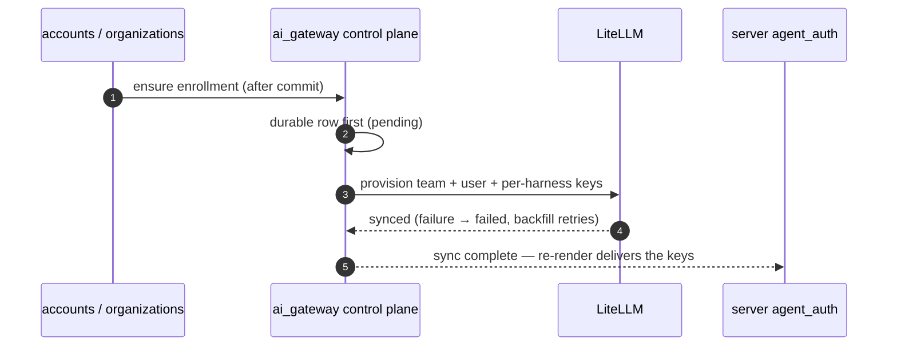

# AI gateway

Managed model access: a deployment pays for and controls inference on behalf of every organization member without any client, worker, or machine ever holding a provider credential. The harness remains the execution client; this system decides *whether* and *under whose budget* it may call a model. (Formerly `agent_auth/model-gateway.md` — split into its own system 2026-08-26.)

The one-sentence contract: **every gateway request is made with a per-(org member, harness) virtual key whose access group limits the models it can see, whose team budget mirrors the org's remaining LLM credit, and whose spend is imported back into that org's ledger; unfunded means no key.**

This spec reads as ground truth; differences from `main` are collected in the transitional section at the end.

## 0 · Scope

**The folder census:** `server/ai_gateway/` with its own MANIFEST (signup_hook, enrollment, migration, free_credits, budget, usage_import, topups, verification, worker, api, service, models — the §4 tree) · the gateway stores in `db/store/agent_gateway/` (enrollments, enrollment_keys, credits, usage) · the five gateway tables in `db/models/agent_gateway.py` · the data plane at `server/litellm/` (config.yaml + Dockerfile) · the vendor leaf `integrations/litellm/` · `server/ai_magic/` as the control plane's own inference consumer.

**Responsibilities:** enroll every (org, member) into the org's LiteLLM team · mint one scoped virtual key per (member, gateway-capable harness) · fund those keys from the org's LLM credit ledger (signup grants, top-ups) and fail closed when the ledger is empty · import spend idempotently and attribute it · verify observed model access against the declared config.

**Fences:**

| Not owned here | Owner | The line |
| --- | --- | --- |
| Which credential a harness launches with, delivery, application, seats | [agent_auth](../agent_auth/README.md) | this system hands agent_auth an opaque key + base URL and a budget predicate; agent_auth renders and refuses in plain words |
| Compute billing, plans, segments, Stripe relationship | billing | top-ups charge *through* billing; the LLM ledger is this system's |
| Which models a target *advertises* | harnesses ([models.md](../harnesses/launch-options.md)) | the gateway's model list is observed through the harness before any surface may offer it |
| Company-systems gateway (MCP tools) | integration_gateway | the analogous gateway for tools, not models |

**Rules of the road:**

- **Organizations are the only gateway and billing subject.** One LiteLLM team per org, one LiteLLM user per (org, member); a personal experience is a one-member default org, never a separate payer.
- **Unfunded fails closed.** Zero credit withholds key material; the launch refusal (agent_auth's, in plain words) names the reason.
- **Master credentials never leave the server.** Clients, workers, and machines receive only scoped keys through agent_auth's delivery.
- **Proxy-side enforcement, never client-side filtering.** A key's access group is what limits its models; no UI filter substitutes.

## 1 · Cells

### the control plane (`server/ai_gateway/`)

- **Owns:** the five tables below, the enrollment/key lifecycle, the ledger, the importer, verification, and the four background loops.
- **Doors:**
    - `GET /v1/cloud/agent-gateway/capabilities` — is the gateway enabled, which harnesses may take a gateway source. The settings pane and onboarding read it.
    - `GET /v1/cloud/agent-gateway/enrollment` — the caller's sync/budget status, for the settings surface.
    - `ensure_signup_enrollment` / `ensure_org_enrollment` — accounts and organizations call these after commit via `signup_hook.py`; durable row first, LiteLLM shape second, failure marks `failed` for the backfill. Never raises into an auth flow.
    - `is_gateway_budget_available` — the launch-gating predicate; agent_auth's renderer consults it and withholds gateway sources when false.
    - The renderer's gateway inputs — `build_agent_auth_state`'s input gathering hands agent_auth the public proxy base URL (`agent_gateway_litellm_public_base_url`) and the enrollment's per-harness virtual-key map, consumed as opaque values. (There is no `gateway_profile` function; the seam is the renderer's input assembly.)
    - `create_llm_topup_grant` — billing calls it when a top-up invoice is paid; records the grant and reactivates what it re-funds.
    - `get_remaining_credit_usd`, `llm_cost_usd_timeseries` and siblings — read-only ledger projections for the billing usage API.
- **Consumes:** `integrations/litellm` (admin + spend-log client under the master key) · billing (Stripe charge for top-ups; the `free_cloud_allocation` anti-abuse guard) · organizations (membership rows drive the backfill) · the `agent_gateway_*` settings in config.py.

### the data plane (`server/litellm/`)

- **Owns:** the LiteLLM instance's reviewed configuration — model names, upstream providers, `model_info.access_groups` — and its image. The instance sits in the request path (harness → LiteLLM → provider); LLM traffic never touches the Python server.
- **Doors:** the proxy URL itself, and `GET /v1/models` scoped by each key's access group; out-of-group inference is denied proxy-side.
- **Consumes:** upstream provider credentials (deployment-owned, e.g. the deployment's AWS role for Bedrock models).

### `ai_magic` — the control plane's own inference consumer

Three direct endpoints today; routes through the gateway once per-run keys exist (open ruling, PR #2247 discussion).

## 2 · Data

### Tables ([db/models/agent_gateway.py](../../../server/proliferate/db/models/agent_gateway.py))

```sql
-- One (org, member) enrolled into the org's LiteLLM team. The team is the only
-- budget layer; the row never carries max_budget. subject_kind still admits
-- 'user': legacy rows persist soft-revoked (revoked_at) so pre-migration spend
-- attribution resolves — org-only is enforced for new enrollments by code.
CREATE TABLE agent_gateway_enrollment (
    id                             uuid PRIMARY KEY,
    subject_kind                   varchar(16) NOT NULL,     -- 'organization' | 'user' (legacy)
    user_id                        uuid,                     -- the member (org kind) or the legacy subject
    organization_id                uuid,
    billing_subject_id             uuid NOT NULL,
    litellm_team_id                varchar(255),             -- org-<uuid>
    litellm_user_id                varchar(255),             -- org-<org>-user-<uuid>
    virtual_key_id                 varchar(255),             -- legacy single-key era; per-harness keys below
    virtual_key_ciphertext         text,
    virtual_key_ciphertext_key_id  varchar(255),
    sync_status                    varchar(16) NOT NULL,     -- pending | synced | failed
    budget_status                  varchar(16) NOT NULL,     -- ok | exhausted | limit_reached
    sync_fingerprint               varchar(128),             -- idempotent re-sync detection
    last_error_code                varchar(128),
    last_error_message             text,
    created_at                     timestamptz NOT NULL,
    updated_at                     timestamptz NOT NULL,
    revoked_at                     timestamptz,              -- soft revocation
    CHECK (subject_kind IN ('organization','user')),
    CHECK (sync_status IN ('pending','synced','failed')),
    CHECK (budget_status IN ('ok','exhausted','limit_reached')),
    -- subject shape: user_id NOT NULL for BOTH kinds (an org enrollment is one per (member, org))
    CHECK (user_id IS NOT NULL AND (subject_kind != 'organization' OR organization_id IS NOT NULL))
    -- + partial unique indexes: one ACTIVE (revoked_at IS NULL) enrollment per user-kind subject,
    --   and one per (organization_id, user_id) for org-kind
);

-- One access-group-scoped virtual key per (enrollment, gateway-capable harness).
-- The alias is deterministic per (enrollment, harness), so re-minting is idempotent;
-- the sync fingerprint detects drift and reopens sync.
CREATE TABLE agent_gateway_enrollment_key (
    id                             uuid PRIMARY KEY,
    enrollment_id                  uuid NOT NULL REFERENCES agent_gateway_enrollment(id),
    harness_kind                   varchar(64) NOT NULL,
    virtual_key_id                 varchar(255),
    virtual_key_ciphertext         text,
    virtual_key_ciphertext_key_id  varchar(255),
    sync_fingerprint               varchar(128),
    verification_status            varchar(32),              -- NULL until the verification loop records one; 'misconfigured' carries a delta
    verification_delta             text,
    verified_at                    timestamptz,
    created_at                     timestamptz NOT NULL,
    updated_at                     timestamptz NOT NULL,
    revoked_at                     timestamptz,
    UNIQUE (enrollment_id, harness_kind)
    -- + the active-scope partial unique (revoked_at IS NULL)
);

-- One imported LiteLLM spend-log row. litellm_request_id is UNIQUE — the
-- importer's idempotency across restarts and the overlap window.
CREATE TABLE agent_llm_usage_event (
    id                  uuid PRIMARY KEY,
    litellm_request_id  varchar(255) NOT NULL UNIQUE,
    virtual_key_id      varchar(255),
    litellm_team_id     varchar(255),
    user_id             uuid,
    organization_id     uuid,
    billing_subject_id  uuid,
    provider            varchar(64),
    model               varchar(255),
    prompt_tokens       bigint NOT NULL DEFAULT 0,
    completion_tokens   bigint NOT NULL DEFAULT 0,
    total_tokens        bigint NOT NULL DEFAULT 0,
    cost_usd            numeric(18,8),                       -- margin already applied at import
    status              varchar(32) NOT NULL,                -- 'imported'
    workspace_id        varchar(255),                        -- attribution riders when LiteLLM metadata carries them
    session_id          varchar(255),
    occurred_at         timestamptz NOT NULL,
    imported_at         timestamptz NOT NULL,
    raw_metadata_json   text
    -- + (subject, occurred_at) attribution indexes per owner column; user/org FKs SET NULL on delete
);

-- One credit-side ledger entry. Remaining credit = active grants − imported cost.
CREATE TABLE llm_credit_grant (
    id                  uuid PRIMARY KEY,
    billing_subject_id  uuid NOT NULL,
    user_id             uuid,
    source              varchar(32) NOT NULL,                -- free_signup | topup | admin | seat_pool
    amount_usd          numeric(12,4) NOT NULL CHECK (amount_usd >= 0),
    created_at          timestamptz NOT NULL,
    expires_at          timestamptz,
    source_ref          varchar(255) UNIQUE                  -- the Stripe invoice / admin tag; the UNIQUE is
                                                             -- top-up idempotency: replaying returns the existing grant
);

-- The single-row importer cursor. Advances only after the batch commits.
CREATE TABLE agent_llm_usage_import_cursor (
    id                    varchar(16) PRIMARY KEY,           -- 'default'
    last_seen_occurred_at timestamptz,
    last_polled_at        timestamptz,
    status                varchar(32) NOT NULL,              -- idle | error
    last_error_code       varchar(128),
    last_error_message    text,
    metadata_json         text,
    created_at            timestamptz NOT NULL,
    updated_at            timestamptz NOT NULL
);
```

### The data plane's config ([config.yaml](../../../server/litellm/config.yaml))

Every entry has one shape — and this file is the harness-to-model map; no client-side filtering exists anywhere:

```yaml
- model_name: claude-sonnet-5              # what harnesses request; unknown names fail at the proxy
  litellm_params:
    model: anthropic/claude-sonnet-5       # the REAL upstream id — never a cross-provider alias
    api_key: os.environ/ANTHROPIC_API_KEY  # provider keys from the container env only
  model_info:
    access_groups: [claude, opencode]      # exactly the harness_kind identifiers allowed to invoke it
```

- **Cross-provider aliases are forbidden** — an alias may re-point only within the same provider (they silently change semantics otherwise).
- **cursor appears in no access group** — it has no gateway recipe, so no key can ever be scoped to it.
- Bedrock entries use real cross-region inference-profile ids and the task role's credential chain instead of an api_key.

## 3 · Flows

### Flow 1 — Enrollment

Triggered by signup or an org-membership change. **Account creation never waits on LiteLLM.**

- `signup_hook` schedules after commit → a durable enrollment row lands first (`pending`).
- A signup with no default org yet defers (returns without a row); the backfill's membership discovery enrolls it on a later tick.
- The LiteLLM shape follows: team `org-<uuid>`, user `org-<org>-user-<uuid>`, per-harness keys.
- Success → `synced`; any LiteLLM failure → `failed`, retried by the backfill loop on its interval.
- `migration.py` converges pre-org residue first on every tick — never inline in alembic.
- agent_auth re-renders when sync completes, so a selection made before sync heals itself.



### Flow 2 — Key mint

- One virtual key per (member, gateway-capable harness), alias-deterministic, access-group-scoped (`_sync_one_harness_key`).
- Drift (fingerprint mismatch) reopens sync; re-minting is idempotent by alias.
- **This system never delivers**: a key reaches a machine only inside agent_auth's rendered document.

### Flow 3 — Funding and exhaustion

- Remaining credit = active grants − imported cost, mirrored onto the LiteLLM team budget (`_remaining_credit_budget_raw`).
- Zero remaining: the mirror hits zero (the proxy blocks at its layer), `budget_status=exhausted`, `is_gateway_budget_available` turns false, and agent_auth withholds gateway sources at render — the refusal names the reason. There is no per-key disable verb; the mirror and the withhold are the mechanism.
- A top-up (Stripe, through billing) records a grant — idempotent by `source_ref` — and `reactivate_subject_if_credited` re-budgets; the auto path buys exactly one pack (`agent_gateway_topup_amount_usd`) when the threshold crosses. The import tick reactivates too (org caps: `limit_reached` → raise → next tick).

### Flow 4 — Usage import

- Each tick reads LiteLLM spend logs from `last_seen − overlap` (`agent_gateway_usage_import_overlap_seconds`).
- Inserts by unique `litellm_request_id` — idempotent across restarts and the overlap.
- Applies the margin percent, attributes to (subject, harness, model), enforces exhaustion + org caps as it goes.
- The cursor advances only after the batch commits.

### Flow 5 — Verification

- On its interval, diff each key's **observed** model list against its declared access group.
- Mismatch → `verification_status=misconfigured` with the delta stored on the key row.
- **The fix is config.yaml + redeploy** — never a client-side patch. (This loop is the drift detector that would have caught the stale Claude-5 list before a user did.) The expected set is parsed from the reviewed config.yaml itself, which therefore rides the server image as well as the LiteLLM image (`/app/litellm/config.yaml`); absent, the loop degrades: a non-empty observed list reads `ok` with a `config_unavailable` delta marker, an empty list still reads `misconfigured`.
- The tick runs in three phases — a short transaction listing keys, the LiteLLM probes with NO transaction open, a short transaction writing verdicts — and errors aggregate: one warning with counts, one `report_critical` only for an outage-shaped tick (never per key).

## 4 · Structure

```text
server/proliferate/
├── constants/agent_gateway.py                  gateway-capable harness tuple (shared with agent_auth)
├── db/models/agent_gateway.py                  the five gateway tables (+ agent_auth's)
├── db/store/agent_gateway/
│   ├── enrollments.py · enrollment_keys.py     row CRUD, key hashes
│   ├── credits.py                              grants, ledger moves, remaining credit
│   └── usage.py                                idempotent usage insert, cursor, cost projections
│       (records.py · mappers.py are agent_auth's — consumed here for record types)
├── integrations/litellm/                       vendor leaf: admin + spend-log client
├── server/ai_gateway/
│   ├── signup_hook.py                          after-commit enrollment scheduling
│   ├── enrollment.py                           team/user/key provisioning, drift reopen, backfill
│   ├── migration.py                            pre-org-only residue converger (first each tick)
│   ├── free_credits.py                         signup grant, GitHub-identity dedup
│   ├── budget.py                               the launch-gating predicate
│   ├── usage_import.py                         spend-log importer, margin, exhaustion + org caps
│   ├── topups.py                               Stripe top-up, grant, reactivation
│   ├── verification.py                         observed-vs-declared access-group diff
│   ├── worker.py                               the four background loops (started in main.py)
│   ├── api.py                                  gateway_account_router
│   ├── service.py                              get_capabilities / get_enrollment
│   └── models.py                               AgentGatewayCapabilitiesResponse, AgentGatewayEnrollmentResponse
└── server/ai_magic/                            control-plane inference consumer

server/litellm/config.yaml · Dockerfile         the data plane: models, providers, access groups
cloud/sdk/src/client/agent-gateway.ts           SDK client
```

The HTTP surface, with bodies (`/v1/cloud/agent-gateway/…`, product-user bearer auth):

```text
GET /capabilities
  → { gatewayEnabled, publicBaseUrl, enrollmentStatus,
      creditsExhausted,          # true exactly when the renderer is withholding keys — the AA-3 plain-words surface
      verifications: [ { harnessKind, status, delta?, verifiedAt? } ] }
      # delta only when the loop stored one, passed through verbatim:
      #   diff shape     { missing: [...], extra: [...], observed_count, expected_count }
      #   degraded shape { degraded: "config_unavailable", reason? }
GET /enrollment
  → { id, subjectKind, litellmTeamId, syncStatus, lastErrorCode, createdAt, updatedAt }
```

Importable functions (nothing else is):

```python
ensure_signup_enrollment(user) / ensure_org_enrollment(org, member)   # after-commit via signup_hook; never raises into an auth flow
is_gateway_budget_available(billing_subject) -> bool                  # the launch-gating predicate agent_auth consults at render
create_llm_topup_grant(subject, amount, source_ref)                   # billing calls on invoice-paid; records + reactivates
get_remaining_credit_usd(subject) -> Decimal                          # ledger projections for the billing usage API
llm_cost_usd_timeseries(subject, …) -> series
```

The four background loops (`worker.py`, started from `main.py` lifespan; each interval is a `agent_gateway_*` setting):

| Loop | Does | Interval setting |
| --- | --- | --- |
| backfill | retries `failed` enrollments; runs `migration.py` residue convergence first; zero-grant guard after (`free_credits.run_zero_grant_check`, own transaction, at most once per `agent_gateway_zero_grant_check_interval_seconds`: aged active org enrollments whose subject holds zero grant rows get the grant re-attempted; the legitimately unhealable — no GitHub identity, invitee orgs — classify out with a warning; the rest page once per org per process) | `agent_gateway_backfill_interval_seconds` (+ `agent_gateway_zero_grant_check_interval_seconds`) |
| usage import | flow 4 | `agent_gateway_usage_import_interval_seconds` (+ `_overlap_seconds`) |
| verification | flow 5 | `agent_gateway_verification_interval_seconds` (gated by `agent_gateway_verification_enabled`, default true) |
| top-ups | auto top-up when the threshold crosses and a price id is configured | `agent_gateway_topup_*` (interval, threshold, price id, amount) |

Other settings (config.py `agent_gateway_*`): enabled flag · LiteLLM base URLs + master key + timeout · default org budget · free credit amount · margin percent · policy minimum plan · qualification run/shard ids.

Proof: the unit and integration suites named per concern — enrollment, usage import, top-ups, litellm integration, config access groups (the reviewed config.yaml is pinned by `test_litellm_config_access_groups.py`), key lifecycle, migration, verification, org-member gateway, LLM limit enforcement — under `server/tests/{unit,integration}/test_agent_gateway_*` and siblings.

Failure modes: LiteLLM unreachable at enrollment → `sync_status=failed`, backfill retries · out of credit → keys disabled, exhausted, typed launch refusal, top-up reactivates · org cap → `limit_reached`, raise + next tick reactivates · key sees wrong models → `misconfigured` with delta, fix config.yaml · importer restart mid-batch → nothing, the overlap window + unique id absorb it.

---

## Delta vs prod

*Transitional — deleted at convergence.*

| This spec says | Prod today | The change |
| --- | --- | --- |
| Per-run virtual keys with envelope budgets | Keys are per (member, harness); budgets are org team + member cap | Open ruling (PR #2247 discussion): mint per run at placement — the only shape where the proxy hard-stops a runaway fan-out mid-run |
| `ai_magic` routes through the gateway | Three direct endpoints, spend unattributed | After per-run keys (open ruling) |

## Build list

- [x] Claude 5 family added to the direct-Anthropic model list — PR #2249 (the first funded launch 403'd on `claude-sonnet-5`; lands on the next release run)
- [x] Refresh the codex model list the same way (slice 5): the GPT-5.6 family + gpt-5.5 join the codex group — gpt-5.6-sol is codex's current default, and the access-group pin now fails on either harness's CLI default going missing
- [x] Code split into `server/ai_gateway/` + manifest + recompose (slice 5) — `lints/server/fences.toml` landed with it, pinning who may import this folder and `server/agent_auth/` (enforcement table in [agent_auth §0](../agent_auth/README.md))
- [x] Find the signup-hook miss that let an org reach day 8 with zero grants; alert on zero-grant orgs (slice 5). Cause found: the founder deleted his first account, and the one-per-GitHub-identity `free_cloud_allocation` survived on the deleted account's orphaned org subject (org row alive, zero memberships) — the re-signup's reserve hit "claimed elsewhere", the grant silently skipped, and a synced enrollment is never revisited. Fixed: an allocation stranded on an orphaned org-kind subject is reclaimed ONLY when the move is provably identity-pure — zero active memberships, a ledger holding nothing but the identity's own signup grant, exactly one allocation (this identity's), and a destination without a free_signup row; an impure orphan refuses with a non-paging manual-resolution error, and a live second account still gets nothing. Guarded: the zero-grant check (hourly cadence via the backfill loop, own transaction) self-heals aged grantless enrollments, classifies the legitimately unhealable as non-paging, and pages each newly-broken org once per process
- [x] Enable verification (slice 5): default true now that config.yaml is settled; the expected-set path is pinned against file moves and the reviewed config rides the server image
- [ ] Per-run keys + envelopes (pending the ruling) · then ai_magic through the gateway
