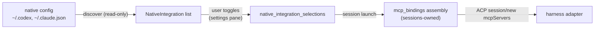

# Native Integrations

Status: target

The passthrough that lets a session use capabilities the user's own harness installation already provides — the MCP servers in `~/.codex/config.toml` or `~/.claude.json`, and the harness vendor's bundled capability plugins (Codex Computer Use, Codex Chrome browser use) — without weakening the isolation posture that keeps a Proliferate launch reproducible. Owner spec: [README.md](README.md). Delivery rides the session MCP pipeline owned by sessions ([sessions](../sessions/README.md)); this section owns discovery, selection, and the curated bundles.

**The one-line boundary, repeated on both sides:** harnesses *discovers and selects* native integrations; sessions *delivers* them (as ordinary [mcp_bindings](../../../anyharness/crates/anyharness-lib/src/domains/sessions/mcp_bindings/assembly.rs) entries). The product MCPs of [product-mcp-servers.md](../subagents/product-mcp-servers.md) are Proliferate-authored servers; native integrations are user-environment servers — the two never share a registry.

## Mental model

Every managed harness launches config-neutralized today: Codex launches with `-c mcp_servers={} -c plugins={} -c marketplaces={} -c features.plugins=false` ([registry.json](../../../catalogs/agents/registry.json), codex `launch.defaultArgs`), and Claude launches under a runtime-owned `CLAUDE_CONFIG_DIR` ([claude.md](claude.md), launch guard). That is correct and stays. But the user's real harness home holds working capability the neutralization silently discards — most importantly Codex Computer Use, which is fully functional on a machine with the Codex desktop app: the bundled plugin's `node_repl` MCP server plus the proprietary Sky client under `~/.codex/computer-use/` drive real desktop control, verified end-to-end against codex 0.147.0.

Native integrations answers one question: *which specific pieces of the user's native harness environment has the user explicitly re-admitted into Proliferate sessions?* The answer is a per-harness selection set on this machine, default empty. Selected pieces are never re-admitted by un-neutralizing the harness's own config; they are re-materialized by Proliferate as session MCP bindings and injected through ACP `session/new` like every other binding — enumerable, auditable, identical mechanics for every harness kind.



## Owned state

| State | Where | Written by |
| --- | --- | --- |
| `native_integration_selections` — which discovered integrations are enabled, per agent kind | new migration under [persistence/sql/](../../../anyharness/crates/anyharness-lib/src/persistence/sql) | the selection API only |
| Curated bundle definitions (Computer Use, Chrome) — id, harness kind, required on-disk artifacts, servers + env + skill text to inject | compiled in, next to the bundled registry ([registry/](../../../anyharness/crates/anyharness-lib/src/domains/agents/registry/schema.rs)) | compiled in |

```sql
CREATE TABLE native_integration_selections (
    id             TEXT PRIMARY KEY,
    agent_kind     TEXT NOT NULL,          -- 'codex' | 'claude' | ...
    integration_id TEXT NOT NULL,          -- 'bundle:computer-use' | 'mcp:<server-name>'
    enabled_at     TEXT NOT NULL,
    UNIQUE (agent_kind, integration_id)
);
```

Discovery results are **derived, never stored** (same posture as readiness: resolution never mutates). Each list call and each launch re-reads the native config from disk, so a server the user edits or removes natively is picked up without a sync step, and no copy of a user env block (which may hold tokens) persists in the Proliferate database.

## Discovery

A read-only parser per harness kind, in a new `domains/agents/native_integrations/` module, producing:

```rust
pub struct NativeIntegration {
    pub id: String,                    // "bundle:computer-use" | "mcp:linear"
    pub agent_kind: AgentKind,
    pub kind: NativeIntegrationKind,   // McpStdio | McpHttp | Bundle
    pub display_name: String,
    pub available: bool,               // required artifacts present on disk
    pub unavailable_reason: Option<String>,
    pub risk: NativeIntegrationRisk,   // None | DesktopControl | BrowserControl
}
```

| Harness | Read from | Yields |
| --- | --- | --- |
| codex | `~/.codex/config.toml` `[mcp_servers.*]` (command/args/env/cwd, or url/headers) | one `McpStdio`/`McpHttp` integration per entry, spawn spec verbatim |
| codex | bundled-plugin marketplaces under `~/.codex/.tmp/bundled-marketplaces/openai-bundled/plugins/<name>/` (`.mcp.json` + `skills/*/SKILL.md`) | inputs to the curated bundles below; never listed raw |
| claude | `~/.claude.json` `mcpServers` and the workspace's `.mcp.json` | one integration per entry |

Discovery only parses. It never spawns a server, never probes, never writes. `available` is a pure file-existence check on the artifacts a bundle's recipe names.

## Curated bundles

Raw config entries are meaningless UX for vendor capabilities, so vendor capabilities ship as compiled-in bundles: a recipe naming required on-disk artifacts and the exact servers, env, and skill text to inject. The recipe is Proliferate-authored; the artifacts are the vendor's own, already provisioned on the user's machine by the vendor's desktop app — Proliferate never vendors or downloads proprietary vendor binaries.

| Bundle | Harness | Required on disk (`available` check) | Injects |
| --- | --- | --- | --- |
| `bundle:computer-use` | codex | `node_repl` binary under `/Applications/ChatGPT.app/Contents/Resources/cua_node/bin/`; Sky client under `~/.codex/computer-use/Codex Computer Use.app`; the bundled plugin dir | stdio server `node_repl` with the env block from the user's `[mcp_servers.node_repl]` (`SKY_CUA_SERVICE_PATH`, `NODE_REPL_TRUSTED_SERVICES`, `CODEX_HOME`, trusted-path vars), plus the plugin's `SKILL.md` text as a first-prompt append |
| `bundle:chrome` | codex | the `chrome@openai-bundled` plugin cache and the same `node_repl` binary | the same `node_repl` server with the browser service env; the chrome plugin's skill text |

The functional surface of Codex Computer Use is exactly `node_repl` + the Sky env: verified by an A/B `codex exec` run where the full config drove `sky.list_apps()` against the live desktop and the neutralized config (`registry.json` defaultArgs) reported the tool unavailable. Plugin *hooks* and the marketplace machinery are deliberately not injected — they would require `features.plugins=true` and reopen the whole config surface for no functional gain.

## Delivery

At session launch, when `native_integration_selections` has rows for the session's agent kind:

```text
resolve_native_launch_extras(workspace, record):
    selections = load_selections(agent_kind)                   -- absence of rows: return empty
    discovered = discover(agent_kind)                          -- fresh read from disk
    for sel in selections:
        match discovered.find(sel.integration_id):
            Some(i) if i.available -> extras.mcp_servers += materialize(i)   -- SessionMcpServer::{Stdio,Http}
                                      extras.first_prompt_append += i.skill_text
            Some(i)                -> extras.binding_summaries += unavailable(i)  -- visible, not silent
            None                   -> extras.binding_summaries += stale(sel)      -- visible, not silent
```

The extras merge into [assemble_session_mcp_launch](../../../anyharness/crates/anyharness-lib/src/domains/sessions/mcp_bindings/assembly.rs) as one more source alongside product extras (that one-line delta is a **sessions** change, filed against [sessions](../sessions/README.md)), flow out through [to_acp_servers](../../../anyharness/crates/anyharness-lib/src/domains/sessions/mcp_bindings/acp.rs) unchanged, and appear in the session's binding summaries ([summaries.rs](../../../anyharness/crates/anyharness-lib/src/domains/sessions/mcp_bindings/summaries.rs)) like every other binding. Skill text rides the existing `first_prompt_system_prompt_append` channel — the mechanism assembly already uses because Codex ignores `systemPrompt.append` session meta.

## Laws

**Neutralization is never relaxed.** The codex `launch.defaultArgs` in [registry.json](../../../catalogs/agents/registry.json) and the Claude `CLAUDE_CONFIG_DIR` guard stay byte-identical; passthrough happens only by Proliferate materializing selected servers into ACP `mcpServers`. Without this law, enabling one integration silently admits the user's entire native config, and launches stop being reproducible from Proliferate-owned state.

**The absence of rows is the absence of passthrough.** Zero selection rows for an agent kind means the launch is exactly today's launch. No default-on bundle, ever — these capabilities include desktop control.

**Discovery never executes.** The parser reads files and stats paths; it spawns nothing. A malformed native config yields an empty or partial listing with a per-entry error, never a launch failure.

**Every injected server is enumerable.** Anything materialized by this system appears in the session's MCP binding summaries; an unavailable or stale selection appears there as an error entry rather than being silently dropped. A capability that can control the desktop must never be invisibly present or invisibly absent.

**Bundles are compiled in; raw entries are verbatim.** A curated bundle's servers/env/skill recipe is Proliferate-authored and versioned with the binary; a raw `mcp:*` selection injects the user's config entry unmodified. Nothing in between — no runtime-edited recipes.

**Local surface only.** Discovery resolves against the runtime host's home directories, so on `RuntimeSurface::Cloud` it finds nothing and the selection API reports every integration unavailable. Cloud desktop control, when it exists, is the product MCP's job ([product-mcp-servers.md](../subagents/product-mcp-servers.md)).

## Relationship to the computer_use product MCP

[product-mcp-servers.md](../subagents/product-mcp-servers.md) reserves `domains/computer_use/mcp` as a future Proliferate-authored, harness-agnostic computer-use product MCP backed by an environment sidecar. That remains the destination for cloud sessions and for harnesses without a native capability (Claude Code's own computer use is interactive-TUI-only and unavailable over the SDK/ACP path, verified against Claude Code 2.1.250). `bundle:computer-use` is the local-surface fast path for codex. When the product MCP ships, it takes precedence wherever both could attach; the bundle remains valid for local codex sessions or is retired — that call is made in the product MCP's delivery, not silently here.

## Settings surface

One section in the **per-harness pane** (`/settings?section=agent-codex`, [HarnessPane.tsx](../../../apps/packages/product-client/src/components/settings/panes/agents/harness/HarnessPane.tsx)), placed after Authentication and before Models — "From your Codex setup" — listing that harness's discovered integrations with per-row toggles writing `native_integration_selections`, bundles first with their own consent dialog (Computer Use states plainly that the agent will control the local desktop and that macOS approval prompts come from the vendor's client). Unavailable rows render disabled with `unavailable_reason`; a selection whose config entry has disappeared renders with a `Missing` badge and its toggle still on, so the user sees what to fix. Not the Integrations pane: that is the cloud OAuth catalog, organization-scoped, and these are local-machine facts about one harness. The pane is a thin editor over this system's contract, per [settings](../settings/README.md).

Every row is the existing settings vocabulary — `SettingsSection` over `RosterRow` (comfortable density) with `Badge` and `Switch` in the trailing slot — no new pattern.

**Icons.** Leading marks come from the compiled-in registry in [IntegrationIcon.tsx](../../../apps/packages/product-client/src/components/settings/panes/integrations/IntegrationIcon.tsx), never from the vendor's plugin assets: the bundled plugins ship proprietary `app-icon.png` artwork under OpenAI's and Google's marks, and displaying it would also need a new runtime→client file-serving seam. Each curated bundle registers one Proliferate-drawn monochrome glyph in `primitives/icons/` (the `LinearGlyph` pattern, lucide-free per the glyph ratchet). Raw `mcp:*` rows render the registry's existing `Plug` fallback — the documented treatment for custom MCP definitions — because a config entry carries no icon metadata and matching a brand on its user-typed name would paint the wrong company's logo. Deterministic host-based matching for HTTP servers (`mcp.linear.app` → the Linear glyph) is a possible later enrichment, out of v1.

## Failure modes

| Condition | Behavior | Recovers |
| --- | --- | --- |
| Bundle artifacts missing (no desktop app, plugin never provisioned) | integration listed `available: false` with reason; toggle disabled; if previously selected, launch adds an unavailable binding-summary entry and injects nothing | user provisions via the vendor app; next launch picks it up (discovery is per-launch) |
| Selection references a server no longer in native config | stale binding-summary entry, nothing injected | user re-toggles off, or restores the config entry |
| Malformed native config file | that harness's discovery returns a parse-error listing; launches proceed with zero native extras | user fixes the file |
| `node_repl` fails to spawn at harness side | codex reports the MCP server startup failure through existing ACP/session channels; the turn degrades to "tool unavailable" | see gaps: `codex-code-mode-host` install |
| Cloud surface | all integrations unavailable by law | not applicable |

## Code map (target)

```text
anyharness/crates/anyharness-lib/src/domains/agents/native_integrations/
├── mod.rs                      NativeIntegration model, ids, risk taxonomy
├── discover_codex.rs           config.toml + bundled-plugin parsing (read-only)
├── discover_claude.rs          ~/.claude.json + workspace .mcp.json parsing (read-only)
├── bundles.rs                  compiled-in curated bundle recipes + availability checks
└── launch_extras.rs            selections × discovery → SessionMcpServer + prompt appends
anyharness/crates/anyharness-lib/src/persistence/sql/00XX_native_integration_selections.sql
anyharness/crates/anyharness-contract/src/v1/…                 list + select wire shapes
anyharness/crates/anyharness-lib/src/api/http/…                GET list / PUT selection routes
```

Consumed by sessions at [assembly.rs](../../../anyharness/crates/anyharness-lib/src/domains/sessions/mcp_bindings/assembly.rs) (their delta); presented by the settings pane (its delta).

> [!decision] PABLO DECIDES: selection scope. Options: (a) workspace × agent
> kind; (b) global per agent kind (recommended — it lives in the per-harness
> pane, which has no repo scope, and these are facts about one machine's
> harness install, not about a repo); (c) per-session with a global default.
> Recommendation: (b); if (a) or (c) is wanted later, the selection table gains
> a nullable `workspace_id` and the section grows a scope control — additive.

> [!decision] PABLO DECIDES: v1 surface. Options: (a) curated bundles only;
> (b) bundles + raw user MCP passthrough (recommended — the raw path is the
> same mechanism with a verbatim recipe, and it is the half users ask for by
> name); (c) raw only. Recommendation: (b).

## Current gaps

Nothing below exists on `main`; the body above is the destination.

- [ ] **Verify codex-acp merge order.** ACP-supplied `mcpServers` must survive the CLI `-c mcp_servers={}` override in the fork's session config assembly ([fork patch](../../../catalogs/agents/adapter-migration/codex-acp-1.1.14+fork-registration.patch) shows `request.mcpServers` reaching `createSessionConfig`; whether CLI `-c` overrides win over session-config servers is unverified). If the flag wins, the fork applies session servers after overrides — a small adapter patch, versioned through the registry's pinned Git ref.
- [ ] **Installer: stage `codex-code-mode-host` next to the native codex binary.** The managed native install dir holds `codex` only; without the sidecar, codex's code-mode router fails `node_repl` closed ("failed to spawn code-mode host"). The binary already ships inside the npm package codex-acp vendors (`@openai/codex-darwin-arm64/vendor/…/bin/`); the installer ([pinned.rs](../../../anyharness/crates/anyharness-lib/src/domains/agents/installer/pinned.rs)) stages it into the same dir the launcher script prepends to `PATH`. This is a standalone mechanical fix, shippable before everything else.
- [ ] **Verify computer-use approval flow over ACP.** The headless proof ran `approval: never`; a live Proliferate session must show codex's computer-use confirmations surfacing through codex-acp's permission mapping, or name the gap.
- [ ] `domains/agents/native_integrations/` module, migration, contract routes, harness-pane section — the build itself.
- [ ] **Session-level visibility.** The "every injected server is enumerable" law is only half-met today: MCP binding summaries reach the client session record ([summary.ts](../../../apps/packages/product-client/src/lib/domain/sessions/summary.ts)) but no component renders them — there is no session surface showing which servers a session launched with. This gap predates native integrations; it becomes load-bearing once a desktop-control server can be among them. Owner: chat/workspace-surface (their delta); this spec only names it.
- [ ] The one-line extras-source delta in sessions' [assembly.rs](../../../anyharness/crates/anyharness-lib/src/domains/sessions/mcp_bindings/assembly.rs) and the boundary-law sentence in [product-mcp-servers.md](../subagents/product-mcp-servers.md) §370 admitting the second source — filed against their owners in the delivery PR.
