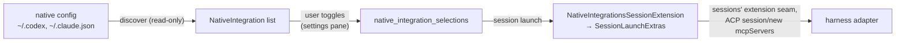

# Native Integrations

Status: target

The passthrough that lets a session use capabilities the user's own harness installation already provides — the MCP servers in `~/.codex/config.toml` or `~/.claude.json`, and the harness vendor's bundled capability plugins (Codex Computer Use, Codex Chrome browser use) — without weakening the isolation posture that keeps a Proliferate launch reproducible. Owner spec: [README.md](README.md). Delivery rides the sessions-owned `SessionExtension` seam ([extensions.rs](../../../anyharness/crates/anyharness-lib/src/domains/sessions/extensions.rs)); this section owns discovery, selection, the curated bundles, and its own extension.

**The one-line boundary, repeated on both sides:** harnesses *discovers and selects* native integrations and hands sessions a `SessionLaunchExtras` through its registered `SessionExtension`; sessions *delivers* those extras exactly as it delivers every other extension's — the assembly boundary ([assembly.rs](../../../anyharness/crates/anyharness-lib/src/domains/sessions/mcp_bindings/assembly.rs)) is unchanged and sessions owns no native-integrations code. The product MCPs of [product-mcp-servers.md](../subagents/product-mcp-servers.md) are Proliferate-authored servers; native integrations are user-environment servers — the two never share a registry.

## Mental model

Every managed harness launches config-neutralized today: Codex launches with `-c mcp_servers={} -c plugins={} -c marketplaces={} -c features.plugins=false` ([registry.json](../../../catalogs/agents/registry.json), codex `launch.defaultArgs`), and Claude launches under a runtime-owned `CLAUDE_CONFIG_DIR` ([claude.md](claude.md), launch guard). That is correct and stays. But the user's real harness home holds working capability the neutralization silently discards — most importantly Codex Computer Use, which is fully functional on a machine with the Codex desktop app: the bundled plugin's `node_repl` MCP server plus the proprietary Sky client under `~/.codex/computer-use/` drive real desktop control, verified end-to-end against codex 0.147.0.

Native integrations answers one question: *which specific pieces of the user's native harness environment has the user explicitly re-admitted into Proliferate sessions?* The answer is a per-harness selection set on this machine, default empty. Selected pieces are never re-admitted by un-neutralizing the harness's own config; they are re-materialized by Proliferate as session MCP bindings and injected through ACP `session/new` like every other binding — enumerable, auditable, identical mechanics for every harness kind.



## Owned state

| State | Where | Written by |
| --- | --- | --- |
| `native_integration_selections` — which discovered integrations are enabled, per agent kind | [0077_native_integration_selections.sql](../../../anyharness/crates/anyharness-lib/src/persistence/sql/0077_native_integration_selections.sql), accessed only through [store.rs](../../../anyharness/crates/anyharness-lib/src/domains/agents/native_integrations/store.rs) | the selection API only (`PUT …/native-integrations/{id}`) |
| Curated bundle definitions (Computer Use, Chrome) — id, harness kind, required on-disk artifacts, servers + env + skill text to inject | compiled in ([bundles.rs](../../../anyharness/crates/anyharness-lib/src/domains/agents/native_integrations/bundles.rs)) | compiled in |

```sql
CREATE TABLE native_integration_selections (
    id             TEXT PRIMARY KEY,
    agent_kind     TEXT NOT NULL,          -- 'codex' | 'claude' | ...
    integration_id TEXT NOT NULL,          -- 'bundle:computer-use' | 'mcp:<server-name>'
    enabled_at     TEXT NOT NULL,
    UNIQUE (agent_kind, integration_id)
);
```

Discovery results are **derived, never stored** (same posture as readiness: resolution never mutates). Each list call and each launch re-reads the native config from disk, so a server the user edits or removes natively is picked up without a sync step, and no copy of a user env block (which may hold tokens) persists in the Proliferate database.

## Discovery

A read-only parser per harness kind: [discovery.rs](../../../anyharness/crates/anyharness-lib/src/domains/agents/native_integrations/discovery.rs) exposes `discover(kind, home)` and dispatches to `discover_codex.rs` / `discover_claude.rs` plus the compiled-in `bundles.rs`, producing ([model.rs](../../../anyharness/crates/anyharness-lib/src/domains/agents/native_integrations/model.rs)):

```rust
pub struct NativeIntegration {
    pub id: String,                    // BUNDLE_ID_PREFIX "bundle:" | MCP_ID_PREFIX "mcp:"
    pub agent_kind: AgentKind,
    pub kind: NativeIntegrationKind,   // McpStdio | McpHttp | Bundle
    pub display_name: String,
    pub description: Option<String>,
    pub source: Option<String>,        // which native file/dir this came from
    pub available: bool,               // required artifacts present on disk
    pub unavailable_reason: Option<String>,
    pub risk: NativeIntegrationRisk,   // None | DesktopControl | BrowserControl
    pub spawn: Option<NativeSpawn>,    // Stdio{command,args,env} | Http{url,headers}
    pub skill_text: Option<String>,    // bundle SKILL.md text, first-prompt append
}
```

`spawn` and `skill_text` never leave the runtime: the service's wire mapping drops them, and `NativeSpawn`'s `Debug` impl redacts env and header values (they may hold user tokens). Wire responses instead carry `enabled` — merged in by the service from the selection store, never stored on the domain model.

| Harness | Read from | Yields |
| --- | --- | --- |
| codex | `~/.codex/config.toml` `[mcp_servers.*]` (command/args/env/cwd, or url/headers) | one `McpStdio`/`McpHttp` integration per entry, spawn spec verbatim |
| codex | bundled-plugin marketplaces under `~/.codex/.tmp/bundled-marketplaces/openai-bundled/plugins/<name>/` (`.mcp.json` + `skills/*/SKILL.md`) | inputs to the curated bundles below; never listed raw |
| claude | `~/.claude.json` `mcpServers` (home scope only — selections are global per agent kind, so workspace `.mcp.json` files are out of v1's reach; see Current gaps) | one integration per entry |

Discovery only parses. It never spawns a server, never probes, never writes. `available` is a pure file-existence check on the artifacts a bundle's recipe names.

## Curated bundles

Raw config entries are meaningless UX for vendor capabilities, so vendor capabilities ship as compiled-in bundles: a recipe naming required on-disk artifacts and the exact servers, env, and skill text to inject. The recipe is Proliferate-authored; the artifacts are the vendor's own, already provisioned on the user's machine by the vendor's desktop app — Proliferate never vendors or downloads proprietary vendor binaries.

| Bundle | Harness | Required on disk (`available` check) | Injects |
| --- | --- | --- | --- |
| `bundle:computer-use` | codex | `node_repl` binary under `/Applications/ChatGPT.app/Contents/Resources/cua_node/bin/`; Sky client under `~/.codex/computer-use/Codex Computer Use.app`; the bundled plugin dir | the Sky REPL as a stdio server named **`cua_repl`** (never `node_repl` — see Laws) with the env block from the user's `[mcp_servers.node_repl]` (`SKY_CUA_SERVICE_PATH`, `NODE_REPL_TRUSTED_SERVICES`, `CODEX_HOME`, trusted-path vars), plus the plugin's `SKILL.md` text — rewritten to name the tool `cua_repl` — as a first-prompt append |
| `bundle:chrome` | codex | the `chrome@openai-bundled` plugin cache and the same `node_repl` binary | the same binary injected as **`browser_repl`** with the browser-service env (the `BROWSER_USE_*` keys and the trusted-services entry pointing at the plugin cache's browser service script are always the derived chrome set, never the user's sky-only table); the chrome plugin's skill text, referring to the tool by the injected name |
| `bundle:claude-chrome` | claude | the Chrome native-messaging manifest `com.anthropic.claude_code_browser_extension.json` under `~/Library/Application Support/Google/Chrome/NativeMessagingHosts/` (macOS; the CLI's own extension-detection marker), **and** a Claude auth posture the CLI accepts for Chrome (see "Claude in Chrome" below) | nothing into `mcpServers`: the ACP `session/new` `_meta.claudeCode.options.extraArgs = {"chrome": ""}`, which claude-agent-acp forwards to the Agent SDK verbatim and the SDK renders as `claude … --chrome`; the CLI then spawns its own in-process `claude-in-chrome` MCP server and ships its own `claude-in-chrome` skill, so no server recipe and no skill text are Proliferate's to inject |

The functional surface of Codex Computer Use is exactly `node_repl` + the Sky env: verified by an A/B `codex exec` run where the full config drove `sky.list_apps()` against the live desktop and the neutralized config (`registry.json` defaultArgs) reported the tool unavailable. Plugin *hooks* and the marketplace machinery are deliberately not injected — they would require `features.plugins=true` and reopen the whole config surface for no functional gain.

### Claude in Chrome

The Claude bundle is the return of the `--chrome` toggle that [catalog.json](../../../catalogs/agents/catalog.json) carried as a `settings[]` `cli_flag` until #2070 deleted the static-settings mechanism (target-observed launch options, 2026-08-19). Nothing about the CLI advertises Chrome as a launch control, so it never came back through the probe; it belongs here, as a bundle, because it is a vendor capability the user's own harness install provides. Facts the design rests on, verified against Claude Code 2.1.251 (2026-08-28):

- **Print mode is not a gate.** Under `claude -p --chrome` the CLI starts its in-process `claude-in-chrome` MCP server and connects it (`hasTools: true`), so the ACP → Agent SDK path — which runs the CLI in print mode with stream-json — carries the capability. The `-p`-only exclusion that blocks the built-in `computer-use` MCP does not apply here.
- **The gate is auth scope.** The CLI disables Chrome when the session's token lacks the profile scope: "env-var and setup-token sessions default to user:inference only". In this system's vocabulary ([agent_auth](../agent_auth/README.md)) that is **every rendered method** — gateway (`ANTHROPIC_AUTH_TOKEN` + base URL), api_key, and seat (`CLAUDE_CODE_OAUTH_TOKEN` from `claude setup-token`). Only a **native login** in the harness's isolated `CLAUDE_CONFIG_DIR` (the registry's `login.command`, `claude /login`) carries `user:profile`. Availability therefore reads the resolved Claude auth posture through the agent_auth read model and lists the bundle `available: false` with the reason `Claude disables Chrome for gateway, API-key, and seat sessions — sign in natively on the Claude harness pane` whenever the posture is anything but native login. This is a read of Proliferate's own state, not a probe; the discovery law holds.
- **The CLI rewrites one global manifest per launch.** Every `--chrome` launch writes a wrapper script `<CLAUDE_CONFIG_DIR>/chrome/chrome-native-host` (`exec <claude binary> --chrome-native-host`) and re-points the browser's native-messaging manifest at it. Two config dirs on one machine — the user's `~/.claude` and this system's isolated dir — flip that manifest between them; the wrapper carries no `CLAUDE_CONFIG_DIR`, so the host process Chrome spawns runs against the *default* config dir regardless of which wrapper it came from. Whether a session under the isolated dir still reaches the extension through that host is unproven (the CLI has `stale_host_mismatch` / `binding_missing` error paths for exactly this) and is the bundle's blocking gap below. Proliferate never writes the manifest or the wrapper itself — that is the CLI's job on launch — and never touches `~/.claude`.
- **Consent is per action here.** Unlike the Sky `js` tool, Claude's browser tools flow through the SDK's `canUseTool`, which claude-agent-acp maps to ACP `session/request_permission`, so each browser action lands in Proliferate's ordinary approval surface. `permissionMode: bypassPermissions` makes the CLI drop Chrome entirely (its own rule), which is consistent: no prompts means no browser.
- **Risk class** is `browser_control`, so the existing consent dialog gates the toggle; the row's description says the agent controls Chrome through the Claude in Chrome extension and that the extension's own site-permission prompts still apply.

## Delivery

Delivery is a `SessionExtension`, not an assembly change. [extension.rs](../../../anyharness/crates/anyharness-lib/src/domains/agents/native_integrations/extension.rs) defines `NativeIntegrationsSessionExtension`, registered in the app's `session_extensions` vec ([app/mod.rs](../../../anyharness/crates/anyharness-lib/src/app/mod.rs)); its `resolve_launch_extras` delegates to [launch_extras.rs](../../../anyharness/crates/anyharness-lib/src/domains/agents/native_integrations/launch_extras.rs). [assembly.rs](../../../anyharness/crates/anyharness-lib/src/domains/sessions/mcp_bindings/assembly.rs) is unchanged and sessions owns no delta — the extension seam already merges every extension's extras.

```text
resolve_native_launch_extras(store, home, agent_kind) -> SessionLaunchExtras:
    selections = store.list_enabled(agent_kind)                -- absence of rows: return default
    discovered = discover(agent_kind, home)                    -- fresh read from disk
    for sel in selections:
        match discovered.find(sel):
            Some(i) if i.available -> extras.mcp_servers += materialize(i.spawn)  -- SessionMcpServer::{Stdio,Http}
                                      extras.first_prompt_append += i.skill_text
            Some(i)                -> extras.binding_summaries += not_applied(NativeUnavailable)  -- visible, not silent
            None                   -> extras.binding_summaries += not_applied(NativeStale)        -- visible, not silent
```

A bundle whose recipe is a harness launch argument rather than a server (today only `bundle:claude-chrome`) materializes into `extras.harness_args` — a `BTreeMap<String, String>` of CLI arguments in the Agent SDK's `extraArgs` shape (`{"chrome": ""}` renders `--chrome`) — and still contributes an `applied` binding-summary entry under its bundle id, so the "enumerable" law holds for a capability whose server the harness spawns itself. `SessionLaunchExtras` gains that field (a sessions delta, additive and default-empty); the Claude driver renders it into the ACP `session/new` `_meta` as `claudeCode.options.extraArgs` beside the existing `systemPrompt` key ([native_session.rs](../../../anyharness/crates/anyharness-lib/src/live/sessions/driver/native_session.rs), `build_launch_meta` is the meta builder for both keys). No other harness driver reads `harness_args` in v1; a bundle may only set it for the harness kind it is compiled for.

The extras flow out through [to_acp_servers](../../../anyharness/crates/anyharness-lib/src/domains/sessions/mcp_bindings/acp.rs) unchanged and appear in the session's binding summaries ([summaries.rs](../../../anyharness/crates/anyharness-lib/src/domains/sessions/mcp_bindings/summaries.rs)) like every other binding; the not-applied cases use the `SessionMcpBindingNotAppliedReason` variants `NativeUnavailable` and `NativeStale` ([mcp.rs](../../../anyharness/crates/anyharness-contract/src/v1/mcp.rs)). Skill text rides the existing `first_prompt_system_prompt_append` channel — the mechanism assembly already uses because Codex ignores `systemPrompt.append` session meta.

## Laws

**Neutralization is never relaxed.** The codex `launch.defaultArgs` in [registry.json](../../../catalogs/agents/registry.json) and the Claude `CLAUDE_CONFIG_DIR` guard stay byte-identical; `--chrome` is additive on top of the guard — the isolated config dir, the neutralized settings, and the auth rendering are untouched by it; passthrough happens only by Proliferate materializing selected servers into ACP `mcpServers`. Without this law, enabling one integration silently admits the user's entire native config, and launches stop being reproducible from Proliferate-owned state.

**The absence of rows is the absence of passthrough.** Zero selection rows for an agent kind means the launch is exactly today's launch. No default-on bundle, ever — these capabilities include desktop control.

**Discovery never executes.** The parser reads files and stats paths; it spawns nothing. A malformed native config yields an empty or partial listing with a per-entry error, never a launch failure.

**Every injected server is enumerable.** Anything materialized by this system appears in the session's MCP binding summaries; an unavailable or stale selection appears there as an error entry rather than being silently dropped. A capability that can control the desktop must never be invisibly present or invisibly absent.

**Injected servers never reuse a harness-owned name, and every launch's injected names are unique.** The Computer Use bundle injects the Sky REPL as `cua_repl` and the Chrome bundle as `browser_repl`, never `node_repl`: codex cancels a thread-config MCP server whose name collides with the plugin-owned one — startup reports "cancelled" even with zero `-c` args (verified live) — and each bundle's skill text refers to the tool by its own injected name so the model calls what actually exists. Raw discovery skips the vendor-owned entries outright — `node_repl` (the plugin's server) and `computer-use` (the plugin's on/off marker the desktop app writes) — because the bundles are the sanctioned re-admission of that capability and a raw row would list it twice, and materialization refuses — `NativeNameCollision`, visible in the binding summaries — any selected server whose name collides with a reserved Proliferate/bundle name or with another selected server, because codex-acp's session config is name-keyed and a collision silently clobbers one side ([launch_extras.rs](../../../anyharness/crates/anyharness-lib/src/domains/agents/native_integrations/launch_extras.rs)).

**Bundles are compiled in; raw entries are verbatim.** A curated bundle's servers/env/skill recipe is Proliferate-authored and versioned with the binary; a raw `mcp:*` selection injects the user's config entry unmodified. Nothing in between — no runtime-edited recipes.

**Local surface only.** Discovery resolves against the runtime host's home directories, so on `RuntimeSurface::Cloud` it finds nothing and the selection API reports every integration unavailable. Cloud desktop control, when it exists, is the product MCP's job ([product-mcp-servers.md](../subagents/product-mcp-servers.md)).

## Relationship to the computer_use product MCP

[product-mcp-servers.md](../subagents/product-mcp-servers.md) reserves `domains/computer_use/mcp` as a future Proliferate-authored, harness-agnostic computer-use product MCP backed by an environment sidecar. That remains the destination for cloud sessions and for harnesses without a native capability (Claude Code's own computer use is interactive-TUI-only and unavailable over the SDK/ACP path, verified against Claude Code 2.1.250). `bundle:computer-use` is the local-surface fast path for codex. When the product MCP ships, it takes precedence wherever both could attach; the bundle remains valid for local codex sessions or is retired — that call is made in the product MCP's delivery, not silently here.

## Settings surface

One section in the **per-harness pane** (`/settings?section=agent-codex`, [HarnessPane.tsx](../../../apps/packages/product-client/src/components/settings/panes/agents/harness/HarnessPane.tsx)), placed after Authentication and before Models — "From your Codex setup" — listing that harness's discovered integrations with per-row toggles writing `native_integration_selections`, bundles first with their own consent dialog (Computer Use states plainly that the agent will control the local desktop and that macOS approval prompts come from the vendor's client). Unavailable rows render disabled with `unavailable_reason`; a selection whose config entry has disappeared renders with a `Missing` badge and its toggle still on, so the user sees what to fix. Not the Integrations pane: that is the cloud OAuth catalog, organization-scoped, and these are local-machine facts about one harness. The pane is a thin editor over this system's contract, per [settings](../settings/README.md).

Every row is the existing settings vocabulary — `SettingsSection` over `RosterRow` (comfortable density) with `Badge` and `Switch` in the trailing slot — no new pattern.

**Icons.** Leading marks come from the compiled-in registry in [IntegrationIcon.tsx](../../../apps/packages/product-client/src/components/settings/panes/integrations/IntegrationIcon.tsx), never from the vendor's plugin assets: the bundled plugins ship proprietary `app-icon.png` artwork under OpenAI's and Google's marks, and displaying it would also need a new runtime→client file-serving seam. Each curated bundle registers one Proliferate-drawn monochrome glyph in `primitives/icons/` (the `LinearGlyph` pattern, lucide-free per the glyph ratchet). Raw `mcp:*` rows render the registry's existing `Plug` fallback — the documented treatment for custom MCP definitions — because a config entry carries no icon metadata and matching a brand on its user-typed name would paint the wrong company's logo. Deterministic host-based matching for HTTP servers (`mcp.linear.app` → the Linear glyph) is a possible later enrichment, out of v1.

## Failure modes

| Condition | Behavior | Recovers |
| --- | --- | --- |
| Bundle artifacts missing (no desktop app, plugin never provisioned) | integration listed `available: false` with reason; toggle disabled; if previously selected, launch adds an unavailable binding-summary entry and injects nothing | user provisions via the vendor app; next launch picks it up (discovery is per-launch) |
| Selection references a server no longer in native config | stale binding-summary entry, nothing injected | user re-toggles off, or restores the config entry |
| Malformed native config file | that harness's discovery returns a parse-error listing; launches proceed with zero native extras | user fixes the file |
| the injected `cua_repl` server fails to spawn at harness side | codex reports the MCP server startup failure through existing ACP/session channels; the turn degrades to "tool unavailable" | the `codex-code-mode-host` companion is installer-staged and reconciled (`ReinstallReason::MissingCompanion`, [distribution.md](distribution.md)) |
| Claude auth posture is gateway / api_key / seat | `bundle:claude-chrome` listed `available: false` with the sign-in-natively reason; toggle disabled; a stale selection produces an unavailable binding-summary entry and no `--chrome` | user signs in natively on the Claude harness pane; discovery is per-launch |
| Claude in Chrome extension not paired with the isolated config dir's host | the CLI's own `claude-in-chrome` tools report `binding_missing` / bridge errors to the model; Proliferate has nothing to add | the bundle's blocking gap; see Current gaps |
| Cloud surface | all integrations unavailable by law | not applicable |

## Code map

```text
anyharness/crates/anyharness-lib/src/domains/agents/native_integrations/
├── mod.rs                      module doc + re-exports
├── model.rs                    NativeIntegration, NativeSpawn (Debug-redacted), id prefixes
├── discovery.rs                discover(kind, home) — per-harness dispatch (read-only)
├── discover_codex.rs           config.toml + bundled-plugin parsing
├── discover_claude.rs          ~/.claude.json mcpServers parsing (home scope; see gaps)
├── auth_posture.rs             ClaudeAuthPosture {NativeLogin, Routed, None} — route state + login marks, file reads only
├── bundles.rs                  compiled-in curated bundle recipes + availability checks
│                               (codex: computer-use, chrome; claude: claude-chrome — auth posture via agent_auth read model)
├── store.rs                    NativeIntegrationSelectionStore over native_integration_selections
├── service.rs                  list/set_enabled; to_wire drops spawn + skill_text
├── launch_extras.rs            selections × discovery → SessionLaunchExtras (mcp_servers + first_prompt_append + harness_args)
└── extension.rs                NativeIntegrationsSessionExtension (the delivery seam)
anyharness/crates/anyharness-lib/src/persistence/sql/0077_native_integration_selections.sql
anyharness/crates/anyharness-contract/src/v1/native_integrations.rs    wire shapes
anyharness/crates/anyharness-lib/src/api/http/agent_native_integrations.rs
    GET /v1/agents/{kind}/native-integrations           → NativeIntegrationsResponse
    PUT /v1/agents/{kind}/native-integrations/{id}      body {enabled} → NativeIntegrationsResponse
```

Delivered through sessions' extension seam ([extensions.rs](../../../anyharness/crates/anyharness-lib/src/domains/sessions/extensions.rs), no sessions delta); presented by the settings pane (its delta). `AppState` carries `native_integrations_service`; the extension is registered in the app's `session_extensions` vec ([app/mod.rs](../../../anyharness/crates/anyharness-lib/src/app/mod.rs)).

## Proof

- Selection store: inline tests in [store.rs](../../../anyharness/crates/anyharness-lib/src/domains/agents/native_integrations/store.rs) — fresh store lists nothing, per-kind isolation, idempotent enable, harmless double-disable.
- Service merge: inline tests in [service.rs](../../../anyharness/crates/anyharness-lib/src/domains/agents/native_integrations/service.rs) — a selection discovery no longer reports is listed as stale; disabling a stale selection clears it.
- Discovery: inline tests in `discover_codex.rs`, `discover_claude.rs`, and `bundles.rs` against fixture home directories (parse verbatim, availability is a pure file check, malformed config degrades per entry).
- Launch extras: inline tests in `launch_extras.rs` — available/unavailable/stale selections produce servers, `NativeUnavailable`, and `NativeStale` summaries respectively; zero selections produce default extras.
- Settings surface: `HarnessNativeIntegrationsSection` component tests and the section's hook tests beside their sources under [harness/](../../../apps/packages/product-client/src/components/settings/panes/agents/harness/HarnessPane.tsx) (sibling `.test.tsx` idiom).
- Claude in Chrome: `bundles_tests.rs` covers manifest present/absent × posture native/routed/none (available only for present + native, each other cell carries its exact reason and no `--chrome`); `auth_posture.rs` covers the two login marks and the no-route/no-login case; `launch_extras.rs` covers a harness-args bundle merging its args with an `applied` summary under `claude-in-chrome` and a raw `mcp:claude-in-chrome` selection refused as a name collision; `native_session.rs` covers the meta builder emitting `systemPrompt` and `claudeCode.options.extraArgs` together, alone, and omitting `claudeCode` when there are no args; `launch_policy.rs` covers the Claude-only gate (`harness_args_for` drops the args for every other harness); the section test covers the Claude bundle's consent body naming per-action approval and `claude-in-chrome`, never `browser_repl`.

> [!decision] RULED 2026-08-27 (Pablo): selection scope is (b) — global per
> agent kind. It lives in the per-harness pane, which has no repo scope; these
> are facts about one machine's harness install. If workspace or per-session
> scope is wanted later, the selection table gains a nullable `workspace_id`
> and the section grows a scope control — additive.

> [!decision] RULED 2026-08-27 (Pablo): v1 surface is (b) — curated bundles
> plus raw user MCP passthrough. The raw path is the same mechanism with a
> verbatim recipe, and it is the half users ask for by name.

## Current gaps

The body above is the destination; struck items record what landed and what was learned. The spec stays `Status: target` until this list empties.

- [x] **Verify codex-acp merge order.** Verified live (codex-acp 1.1.14-proliferate.1 / codex 0.147.0): codex-acp spawns `codex app-server` with **no** `-c` flags at all — it parses `-c` overrides into its own config, and `createSessionConfig` sets `mcp_servers` *after* spreading those overrides, so ACP-supplied servers survive `-c mcp_servers={}`. No adapter patch needed.
- [x] **Installer: stage `codex-code-mode-host` next to the native codex binary.** Done: the registry's `tarball_release` install declares `companions[]`, the catalog pins each companion per platform (sha256 from the same GitHub release), the installer places it beside `codex` ([pinned.rs](../../../anyharness/crates/anyharness-lib/src/domains/agents/installer/pinned.rs)), and a missing pinned companion is a `ReinstallReason::MissingCompanion` so existing installs converge on the next reconcile ([distribution.md](distribution.md)). Landed in PR #2311.
- [ ] **Computer-use write actions never prompt over ACP today — decide the consent posture.** Verified: the Sky `js` tool self-declares `readOnlyHint: true` (observed via a direct `tools/list` handshake), and codex's MCP approval gate (`requires_mcp_tool_approval`) exempts read-only-hinted tools under both `Auto` and `Writes` modes — so codex cannot distinguish `sky.click()` from `sky.list_apps()` and neither ever raises `session/request_permission` (confirmed by a live ACP spike: zero permission requests). The only codex-side knob is per-server config `tools.js.approval_mode = "prompt"` (prompts on *every* call, reads included), which the ACP-injected server config cannot carry today — codex-acp's `createMcpSeverConfig` emits only command/args/env. The vendor-side per-app macOS approval prompts (the Sky client's own) still apply. Options for Pablo: accept vendor-side prompts as the consent surface (today's behavior), extend codex-acp to pass per-tool approval config, or wait for per-call annotations upstream. No real click/type actions are run on a developer's desktop during verification.
- [ ] **Claude workspace `.mcp.json` discovery.** v1 discovery is home-scope only (`~/.claude.json`): selections are global per agent kind and `discover(kind, home)` carries no workspace path. Re-admitting workspace-scoped `.mcp.json` entries needs a workspace dimension on discovery and the selection surface — additive, out of v1 (adversarial review flagged the original Discovery row as over-promising; the row now says home-only).
- [ ] The build itself. The skeleton is in — migration `0077`, contract shapes, `GET`/`PUT` routes, store, service, extension wiring — with `discovery.rs` and `launch_extras.rs` landing their real implementations, and the harness-pane section its UI, in this slice's lanes.
- [ ] **`bundle:claude-chrome` — prove the isolated-config-dir rendezvous before the bundle lists available.** Design is settled above; what is unproven is whether a session under `CLAUDE_CONFIG_DIR=<isolated>` reaches the extension when the native host Chrome spawns runs against `~/.claude`. Proof recipe (needs a browser, so it is Pablo's run): native login on the Claude harness pane, toggle the bundle on, open a session, ask for `tabs_context`; success means the tool returns real tabs, failure means `binding_missing`/`stale_host_mismatch` in the tool result. The bundle ships available on the artifact + auth-posture check so that run is possible; the spec stays at this gap until the result is recorded. If it fails, the fallback is to run the Claude harness's Chrome sessions against the user's `~/.claude` config dir for the chrome wrapper only — which would be a neutralization exception and needs its own ruling.
- [ ] **`bundle:claude-chrome` — browser coverage.** v1 availability checks the Google Chrome manifest path on macOS only; the CLI also registers Brave, Edge, Arc, Chromium, Vivaldi, and Opera. Additive: more manifest paths in the recipe.
- [ ] **Session-level visibility.** The "every injected server is enumerable" law is only half-met today: MCP binding summaries reach the client session record ([summary.ts](../../../apps/packages/product-client/src/lib/domain/sessions/summary.ts)) but no component renders them — there is no session surface showing which servers a session launched with. This gap predates native integrations; it becomes load-bearing once a desktop-control server can be among them. Owner: chat/workspace-surface (their delta); this spec only names it.
- [x] The boundary sentence in [product-mcp-servers.md](../subagents/product-mcp-servers.md) admitting that session extensions may contribute servers to the launch boundary, naming native integrations. Done (its "Session MCP Binding Modules" section). The once-planned extras-source delta in sessions' assembly.rs turned out not to exist: delivery is a `SessionExtension` and sessions owns no delta (see Delivery).
