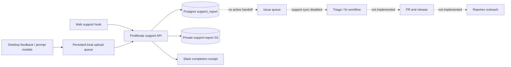
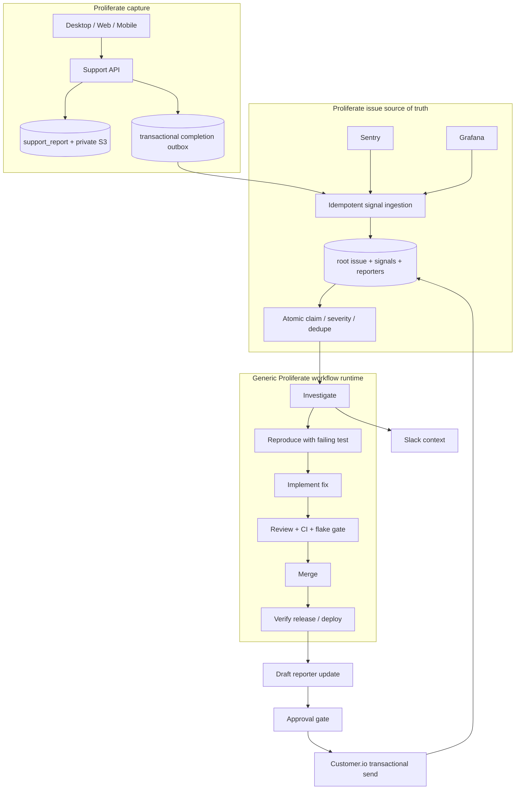

# Support system alignment

Status: historical audit and superseded planning record.

The accepted operating contract is
[`../codebase/features/support-system.md`](../codebase/features/support-system.md).
This file preserves the 2026-07-12 evidence and earlier alternatives; its
ownership recommendations and open decisions are not current operating law.

Audit date: 2026-07-12.

This document answers one question: what must exist for Proliferate to say it
has a support system, rather than only a support-report upload form?

The answer is the complete closed loop:

```text
capture -> acknowledge -> deduplicate -> triage -> investigate -> reproduce
        -> fix -> review -> merge -> release -> notify every affected reporter
```

The terminal invariant is stronger than "an issue exists": every report is
attached to a durable issue, every actionable issue reaches a verified product
outcome, and every reporter who asked for an update is contacted exactly once
after that outcome is real.

The current production system satisfies the capture and internal-alert portion
of that loop. It does not yet satisfy triage, repair, release verification, or
reporter outreach.

## 1. Intent recovered from the vault

The recent vault notes use "support system" consistently to mean an
end-to-end operating loop, not a UI surface. The relevant intent is:

- support reports and feature prompts enter through Proliferate;
- signals from support, Sentry, and Grafana converge into one issue queue;
- duplicate reporters attach to one root issue rather than creating parallel
  work;
- an agent investigates, writes a failing test, produces a fix, and opens a PR;
- review, tests, and flake checks gate merge;
- a release/deploy signal proves the fix is available;
- Slack carries operational context, but Slack is not the system of record;
- reporters who opted in are notified after the fix ships;
- this workflow must be built with Proliferate's own workflow product. A
  permanently separate, bespoke support daemon would fail the dogfood test.

Intent inputs, newest first:

```text
~/vault/Vault/Launch/Archive/CURRENT.md
~/vault/Vault/Todos/Current Week.md
~/vault/Vault/Workspace/Extraneous/Support Workspace.md
~/vault/Vault/Workflow Workspace.md
~/vault/Vault/Daily/2026-07-06*.md
```

Those notes are product-intent inputs. Once decisions are accepted, the
contracts must be promoted into this repository's authoritative specs; the
vault must not remain the only place where the system architecture is known.

## 2. Recommended decision

Proliferate should own the whole support loop and use its generic workflow
runtime to execute it.

Recommended ownership:

- the existing `support` server domain remains the immutable capture source;
- an internal issue queue becomes the durable source of truth for triage and
  resolution;
- generic workflow definitions orchestrate investigation, repair, PR, release,
  Slack, and outreach steps;
- GitHub PRs, Sentry events, Slack messages, and Customer.io deliveries are
  projections or linked evidence, not the primary issue state;
- the standalone `issue-tracker` repository is a migration source and
  prototype, not the permanent production owner;
- the parked `support-ops` repository remains parked.

This is the only option that satisfies the latest vault constraint that a
customer should not need to build and operate a bespoke side service to obtain
this workflow from Proliferate.

## 3. Outcome invariants

The completed system must enforce all of these:

1. A completed report is never lost, even when Slack, an agent, GitHub, or an
   email provider is unavailable.
2. Capture is idempotent by `(owner_user_id, client_job_id)`.
3. Ingestion into the issue queue is idempotent by `(source, source_id)`.
4. One root issue may have many source signals and many reporters.
5. Private messages, diagnostics, prompts, tool I/O, attachments, tokens, and
   signed URLs never enter public GitHub content, telemetry, or logs.
6. Claiming work is atomic and lease-backed. Two agents cannot own one issue at
   the same time.
7. An issue cannot be marked fixed without linked verification evidence.
8. A merged PR is not the same as a shipped fix. Outreach waits for a verified
   release or deploy event.
9. Reporter contact is approval-gated until the templates and release linkage
   are proven safe.
10. A delivery attempt has a durable idempotency key and records provider
    acceptance; "notification attempted" is not recorded as "notification
    sent."
11. Duplicate reporters inherit the root issue's resolution and each eligible
    reporter receives at most one delivery for that resolution.
12. Every state transition is attributable to a user, agent run, workflow run,
    webhook, or operator action.

## 4. Current production topology



### 4.1 What is wired

| Stage | Current state | Evidence |
| --- | --- | --- |
| Desktop capture | Wired | Feedback and prompt modals create `SupportReportJob` records. |
| Durable client retry | Wired, with known edge cases | Jobs persist locally and retry with backoff across restarts. |
| Authenticated API capture | Wired | Split create, upload-target, and complete endpoints are active. |
| Durable server record | Wired | `support_report` row is the capture source of truth. |
| Private object storage | Wired | `request.json`, optional diagnostics/attachments, and `complete.json` use private S3 prefixes. |
| Capture correlation | Wired | Report, user, tenant, workspace, session, Sentry, and PostHog identifiers are retained where available. |
| Slack completion receipt | Wired | The server posts one best-effort completion notification. New code marks delivery only after provider success. |
| Urgent / notify / credit / outreach capture | Wired | Fields persist in Postgres; request manifests now retain kind and credit intent as well. |
| Diagnostics privacy | Wired after this audit | Diagnostic schema v2 omits the report message and sanitizes session content and live config. |

### 4.2 What is not wired

| Stage | Current state | Consequence |
| --- | --- | --- |
| Completed-report feed/outbox | Missing | Nothing durably hands a report to issue processing. |
| Dedupe/root issue assignment | Missing in Proliferate | Duplicate reports can become duplicate work. |
| Triage and ownership | Missing | Slack is the de facto queue. |
| Investigation/reproduction | Missing | No automatic session, evidence pack, or failing-test gate. |
| Fix/PR workflow | Missing | No support report can autonomously reach a reviewed PR. |
| Merge/release linkage | Missing | The system cannot prove when a fix is available. |
| Reporter notification | Missing | `notify_me` and `outreach_email` are captured but unused. |
| Internal queue UI | Missing in Proliferate | Operators cannot see or manage the complete lifecycle in-product. |
| Workflow-product dogfood | Missing | The current loop does not exercise the planned workflow engine. |

## 5. Live-system audit

The audit used local source, Git history, GitHub, the AWS CLI, production and
staging ECS/task definitions, read-only database queries, S3 metadata, and the
running issue service. Secret values were not copied into this document.

### 5.1 Hosted Proliferate

| Check | Result on 2026-07-12 | Interpretation |
| --- | --- | --- |
| Production API task | Healthy, running the current release task family | Capture endpoints are deployed. |
| Staging API task | Healthy | Staging is available for end-to-end validation. |
| Production reports | 18 rows: 16 completed, 2 created | Capture is real and has incomplete cases worth auditing. |
| Slack timestamps | 16 rows marked | Historical values do not prove delivery because the old code marked success after swallowed failures. |
| Legacy tracker links | 11 rows have GitHub and Linear links | These are historical projections from the removed reconciler. |
| Recent reports | Recent S3 case objects exist; recent reports have no `tracker.json` | The active build captures and alerts but does not reconcile trackers. |
| Staging reports | No rows | A staging support-loop smoke has not established evidence. |
| Slack secret runtime reference | Present in both ECS task definitions | Runtime can deliver, but deploy wiring previously depended on inherited task-definition state. |
| Legacy tracker runtime config | Still injected | Configuration outlived the server tracker implementation. |

Slack itself was not readable through an installed connector during this
audit. Provider delivery therefore remains unverified; DB timestamps and task
configuration are not a substitute for seeing the message in the destination.

### 5.2 GitHub

- historical support issues exist;
- several historical reports produced duplicate or cross-linked GitHub issues,
  which confirms that the old tracker path was not a trustworthy issue source
  of truth;
- no recent issue projection corresponds to the post-reconciler reports;
- the cloud SDK still attempted the deleted tracker nudge endpoint until this
  audit removed that dead call.

### 5.3 Standalone issue service

The local repository is `~/issue-tracker`; its public spec is
`~/issue-tracker/SPEC.md`.

| Check | Result | Interpretation |
| --- | --- | --- |
| API/worker/beat/Redis/web/Caddy | Running | The service itself is operational. |
| Health and authenticated feeds | Healthy | Basic service operations work. |
| Issue rows | 75 new, 1 merged test, 6 dismissed | Sentry ingestion is active, but meaningful progression is not. |
| Claims | 0 | No agent currently consumes the queue. |
| Triaged / awaiting merge | 0 | The repair loop is inactive. |
| Support sync | Disabled every five minutes | Proliferate reports do not enter this service. |
| Missing support credential | `PROLIFERATE_SUPPORT_TOKEN` absent | The proposed `/v1/support/reports` source is not wired and the endpoint does not exist in Proliferate. |
| Slack / LLM / Customer.io credentials | Absent | Triage context, agent work, and reporter outreach cannot run. |
| Deployment ownership | No canonical CI/IaC path | The side service is not production-grade Proliferate infrastructure. |

The current sync implementation would also discard important capture intent
(`urgent`, `notify_me`, credit, message, and private evidence pointers), has no
database uniqueness constraint on `(source, source_id)`, and can advance its
cursor after per-item failures. Connecting it unchanged risks silent loss.

### 5.4 Parked support-ops prototype

`~/support-ops` remains a useful source for defensive parsing, duplicate
reporter fan-out, and dry-run-first notification concepts. It is not a deployable
or canonical service and should receive no new product work.

### 5.5 Existing automations are not the workflow runtime

The current `server/automations` domain schedules or manually triggers one
agent prompt and tracks its execution. It does not provide event or poll
triggers, arbitrary multi-step graphs, step outputs, approvals, emits/chaining,
generic Slack/PR steps, or release-gated continuation. The current automations
system therefore cannot express the support workflow above without first
landing the generic workflow contracts described in the vault workflow plan.

Unmerged experimental branches are evidence, not product state. The support
architecture must target contracts present on `main` or explicitly sequence
the workflow foundation as a dependency.

## 6. Current code and data map

```text
apps/desktop/src/
  components/support/
    SendFeedbackModal.tsx
    SubmitPromptModal.tsx
    SupportModalHost.tsx
  hooks/support/
    facade/use-support-modal-state.ts
    lifecycle/use-support-report-upload-queue.ts
    lifecycle/support-report-upload-payload.ts
    lifecycle/support-report-upload-persistence.ts
  lib/domain/support/
    report-types.ts
    report-upload-failure.ts
    report-upload-sanitizer.ts
    session-debug/sanitizer.ts
  lib/workflows/support/
    support-report-upload-workflows.ts

cloud/
  sdk/src/client/support.ts
  sdk-react/src/hooks/support.ts

server/proliferate/
  server/support/
    api.py
    models.py
    service.py
    notifications.py
    upload_lifecycle.py
    storage.py
    domain/report_records.py
  db/models/support.py
  db/store/support_reports.py
  integrations/slack/

server/alembic/versions/
  ... support_report schema migrations

.github/workflows/_deploy-server.yml
server/infra/main.tf
specs/developing/reference/env-vars.yaml
```

### 6.1 Active HTTP surface

```text
POST /v1/support/messages
POST /v1/support/report-uploads                      legacy wrapper
POST /v1/support/reports
POST /v1/support/reports/{report_id}/upload-targets
POST /v1/support/reports/{report_id}/complete
```

There is no active tracker nudge route, completed-report read feed, claim API,
resolution API, release callback, or outreach API.

### 6.2 Capture persistence

The `support_report` row currently contains both active capture columns and
legacy tracker columns.

Active capture state includes:

```text
id, client_job_id, owner_user_id
status, created_at, completed_at
s3_bucket, s3_prefix
source_surface, source_context_json
workspace_refs_json, telemetry_refs_json
expected_uploads_json, object_manifest_json
kind, credit_consent, credit_name
urgent, notify_me
request_id, complete_request_id
request_object_written_at, slack_notified_at
```

The GitHub, Linear, crosslink, tracker lease, and tracker retry columns are
legacy. They must not be interpreted as the current resolution source of truth.

### 6.3 Private S3 case bundle

```text
support/reports/YYYY/MM/DD/<report_id>/
  request.json
  diagnostics.json                         optional
  attachments/<client_file_id>/<file_name> optional
  complete.json
```

`cloud-diagnostics.json` is not produced by the current server; cloud
enrichment is a deliberate no-op after the cloud target model cutover.
`tracker.json` is historical and is not produced by the current server.

## 7. Immediate correctness changes from this audit

These are no-regret changes and do not choose the future orchestration model.

### 7.1 Diagnostic privacy

The desktop had regressed from schema v2 to schema v3 and copied the user's
message, raw prompts, normalized events, tool inputs/outputs, raw notification
bodies, and live config into `diagnostics.json`.

The corrected contract is:

```json
{
  "schemaVersion": 2,
  "report": {
    "messagePresent": true,
    "messageLength": 42
  },
  "workspaces": [
    {
      "sessions": [
        {
          "summary": "sanitized shape/length placeholders",
          "normalizedEvents": "sanitized",
          "rawNotifications": "body redacted",
          "liveConfig": "sensitive values redacted"
        }
      ]
    }
  ]
}
```

The private message remains in `request.json`; it is not duplicated into the
diagnostic export.

### 7.2 Truthful Slack state

The server previously swallowed missing-webhook and provider failures, then
unconditionally wrote `slack_notified_at`. It now records that timestamp only
after the Slack webhook accepts the message. Report completion still succeeds
when Slack fails.

Historical timestamps remain unverified and should not be retroactively
treated as proof of delivery.

### 7.3 Complete capture manifest

`request.json` now retains `kind`, `creditConsent`, and `creditName` alongside
urgent and notify intent. Downstream processing no longer needs to guess those
fields from incomplete private evidence.

### 7.4 Deterministic deploy secret

Hosted deploys explicitly copy `SUPPORT_SLACK_WEBHOOK_URL` from the protected
GitHub environment to a named SSM SecureString parameter and inject it into ECS.
Fresh task definitions no longer rely on an old task definition retaining an
unmanaged secret reference.

The `staging` and `Production` GitHub environments now explicitly set the
parameter paths under `/proliferate/<environment>/support/slack-webhook-url`.
The SSM values are created or refreshed by the first server deployment that
contains this workflow change; setting the path variables did not deploy or
rotate the live webhook.

### 7.5 Dead client tracker nudge

The cloud SDK and React hook no longer call the deleted
`POST /v1/support/reports/{report_id}/tracker` route after completion.

## 8. Open capture defects

These are real defects in the active capture path and should be fixed before a
support-loop launch claim.

| Priority | Defect | Required correction |
| --- | --- | --- |
| P0 | No downstream durable handoff | Land the chosen outbox/feed and prove replay/backfill. |
| P0 | No reporter outreach | Land release-gated, approval-gated, idempotent delivery. |
| P1 | Desktop keeps only the newest ten queued jobs | Replace silent truncation with an explicit capacity policy; clean staged files only after a durable terminal outcome. |
| P1 | HTTP 422 is treated as transient | Align client validation with server limits and classify validation responses as terminal/actionable. |
| P1 | Sidebar/settings bypass support capability routing | Route every entry point through `vendor | operator | none`; do not show vendor support on self-managed servers. |
| P1 | Attachment staging uses all-or-nothing `Promise.all` | Clean successfully staged siblings when any file fails. |
| P1 | Entry-point source is hardcoded to `sidebar` | Preserve the actual source surface through modal state and telemetry. |
| P1 | Notify intent has inconsistent prompt UI | Decide whether prompt reporters may opt in; remove dead state or restore the control. |
| P1 | Urgent helper promises email by tomorrow | Remove the SLA promise until an owned human/automated SLA exists, or explicitly staff the commitment. |
| P2 | `SupportSurface` owns product behavior in a shared UI package | Restore props-only package ownership; keep hooks/workflows in the app. |
| P2 | Legacy tracker columns/config/integrations remain | Remove them after the new issue-state migration and historical export plan are accepted. |
| P2 | Cloud diagnostics status/schema remain despite no-op behavior | Collapse the legacy state or reintroduce an ownership-correct enrichment source. |

## 9. Recommended target architecture



### 9.1 Boundary rules

- `support_report` owns immutable capture facts, not resolution state.
- issue state owns dedupe, severity, claims, investigation, PR, release, and
  resolution.
- workflow runs own orchestration attempts and step outputs, not the issue's
  durable business truth.
- integrations own raw Slack, GitHub, Sentry, Grafana, and Customer.io access.
- Slack messages link to the issue/report; they never become the only queue.
- GitHub issues are optional projections. Fix PRs are first-class evidence.
- reporter email is resolved as `outreach_email ?? account_email` at draft
  time, not copied broadly into every workflow event.

### 9.2 Proposed repository ownership

Exact folders must follow the workflow and server structure specs accepted for
the implementation. The intended ownership is:

```text
server/proliferate/
  server/support/                 immutable report capture
  server/issues/                  issue, signal, reporter, claim, resolution APIs
  server/workflows/               generic definition/run orchestration
  db/models/
    support.py                    capture rows only after migration
    issues.py                     issue/signal/reporter/delivery state
    workflows.py                  generic definitions/runs/steps/outbox
  db/store/
    support_reports.py
    issues.py
    workflow_*.py
  integrations/
    sentry.py
    grafana.py
    github/
    slack/
    customerio.py

apps/web/src/ or apps/desktop/src/
  components/issues/              queue, issue detail, evidence, approval UI
  hooks/issues/                   query/mutation/orchestration hooks

fixtures/contracts/support-issue-completed/v1.json
tests/intent/specs/support-capture.spec.ts
tests/release/src/scenarios/workflows/support-loop.ts
```

No `server/support/tracker.py`, support-only daemon, or second email queue
should be introduced. Generic issue/workflow ownership is the product proof.

## 10. Durable contracts

### 10.1 Completion event

The recommended handoff is a transactional outbox record written in the same
database transaction that moves a report to `completed`. A generic poll feed
may expose outbox events, but the DB record—not a Slack message or an S3 list—is
the replay source.

Proposed v1 envelope:

```json
{
  "eventId": "uuid",
  "eventType": "support.report.completed",
  "schemaVersion": 1,
  "occurredAt": "2026-07-12T12:34:56Z",
  "dedupeKey": "support-report:<reportId>",
  "subject": {
    "kind": "support_report",
    "id": "<reportId>"
  },
  "data": {
    "reportId": "<reportId>",
    "ownerUserId": "uuid",
    "kind": "bug",
    "urgent": false,
    "notifyRequested": true,
    "creditConsent": false,
    "creditName": null,
    "completedAt": "2026-07-12T12:34:56Z",
    "privateCaseRef": "support-report:<reportId>",
    "telemetryRefs": {},
    "correlation": {}
  }
}
```

The event intentionally excludes the message body, attachment bodies, storage
locations, signed URLs, and resolved email address. Authorized issue ingestion
resolves `privateCaseRef` through the support service boundary.

### 10.2 Issue identity and dedupe

Minimum constraints:

```text
UNIQUE issue_signal(source, source_id)
UNIQUE issue_reporter(issue_id, user_id, support_report_id)
UNIQUE issue_delivery(issue_id, reporter_id, event_kind, channel)
```

Suggested issue lifecycle:

```text
new
  -> triaged
  -> investigating
  -> reproducing
  -> fixing
  -> in_review
  -> merged
  -> released
  -> resolved

side exits: dismissed | duplicate | blocked | needs_human
```

`duplicate` points at a root issue. A duplicate signal is not discarded; its
reporter and evidence attach to the root.

### 10.3 Claiming

Claiming must be a compare-and-swap or row-lock operation with:

```text
claimed_by_kind      user | agent | workflow
claimed_by_id
claim_token
claimed_at
claim_expires_at
last_heartbeat_at
```

Expired claims return to the queue. Every step result checks the claim token so
a stale worker cannot overwrite a newer owner.

### 10.4 Fix and release evidence

An issue reaches `merged` only with a linked PR and passing required checks. It
reaches `released` only after the release/deploy ledger reports the containing
commit on the affected surface and environment. Reporter delivery keys off the
`released` transition, not GitHub's merge event.

### 10.5 Reporter delivery

The delivery record must include:

```text
issue_id, reporter_id, support_report_id
channel, template_id, template_version
to_address_snapshot
drafted_at, approved_at, attempted_at
provider_message_id, accepted_at, failed_at
idempotency_key, last_error
```

Initial operation is dry-run/draft-first. The message is approved by a human,
then sent through Customer.io transactional delivery. Automatic approval can be
considered only after templates and release matching have a measured safety
record.

## 11. Workflow definition

The first dogfood workflow should be declarative enough to prove the generic
product surface:

```yaml
name: support-issue-resolution
trigger:
  event: support.report.completed
steps:
  - id: ingest
    uses: issues.upsert-signal
  - id: dedupe
    uses: agent.run
    needs: [ingest]
  - id: triage
    uses: agent.run
    needs: [dedupe]
  - id: investigate
    uses: agent.run
    needs: [triage]
  - id: reproduce
    uses: agent.run
    needs: [investigate]
  - id: fix
    uses: agent.run
    needs: [reproduce]
  - id: pull_request
    uses: github.pull-request
    needs: [fix]
  - id: review
    uses: agent.run
    needs: [pull_request]
  - id: merge_gate
    uses: github.required-checks
    needs: [review]
  - id: release_gate
    uses: releases.wait-for-commit
    needs: [merge_gate]
  - id: outreach_draft
    uses: issues.draft-reporter-update
    needs: [release_gate]
  - id: outreach_approval
    uses: approval.wait
    needs: [outreach_draft]
  - id: outreach_send
    uses: customerio.transactional-send
    needs: [outreach_approval]
```

This syntax is illustrative, not yet a committed workflow contract. The
workflow engine must own retries, timeouts, cancellation, step idempotency,
secrets, parallelism, and resumability before this definition is promoted.

## 12. Migration plan

### PR 0 — no-regret correctness

- restore diagnostic schema-v2 privacy;
- persist Slack delivery only after success;
- retain kind and credit fields in `request.json`;
- make Slack secret deployment deterministic;
- remove the dead client tracker nudge;
- update canonical support docs and the operator runbook.

This audit implements PR 0 in the current worktree.

### PR 1 — accept contracts

- decide the open questions in section 14;
- promote the chosen architecture into authoritative issue/workflow specs;
- add a cross-language golden fixture for the completion event;
- define retention and access policy for private evidence.

### PR 2 — transactional handoff

- add the completion outbox and keyset/replay semantics;
- add the issue ingestion idempotency constraint;
- backfill every completed capture row;
- prove crash/replay behavior against Postgres in tier 1.

### PR 3 — queue and dedupe

- land internal issue/signal/reporter state;
- import standalone issue-service rows without changing source IDs;
- implement atomic claims and duplicate-to-root fan-out;
- expose an operator queue UI.

### PR 4 — investigation workflow

- land support, Sentry, and Grafana trigger adapters;
- create the generic triage/investigate/reproduce workflow;
- require private-evidence access through an audited service boundary;
- send Slack context with links and IDs only.

### PR 5 — fix and review workflow

- create workspace/session from the issue;
- require a failing reproduction before fix where feasible;
- open a PR, run review agents and required CI, and preserve all evidence;
- route uncertain or unsafe cases to `needs_human`.

### PR 6 — release and outreach

- link merged commits to the release/deploy ledger;
- draft one resolution message per eligible reporter;
- add approval UI and Customer.io transactional delivery;
- prove delivery idempotency and duplicate reporter fan-out.

### PR 7 — migrate and retire side services

- run full historical backfill;
- compare counts and IDs across capture, issue, and delivery tables;
- stop standalone issue-service support sync and schedulers;
- archive its operational deployment after rollback retention;
- remove legacy tracker columns, config, SDK types, GitHub/Linear adapters, and
  historical runbook instructions from Proliferate.

## 13. Verification and launch gates

| Guarantee | Tier | Required proof |
| --- | --- | --- |
| Diagnostic redaction | Tier 1 | Golden payload contains placeholders and no seeded secrets. |
| Slack timestamp truth | Tier 1 | Success records timestamp; unset/failure does not. |
| Capture idempotency | Tier 1 + Postgres | Repeated create returns one row and preserves immutable intent. |
| Outbox atomicity | Tier 1 + Postgres | Completion and event commit together or neither commits. |
| Ingestion idempotency | Tier 1 + Postgres | Replaying a page/event produces one signal. |
| Cursor crash recovery | Tier 1 + Postgres | Failure before checkpoint replays; failure after item never skips it. |
| Duplicate reporter fan-out | Tier 1 | One root resolution creates one eligible delivery per reporter. |
| Capture UI to queue seam | Tier 2 | Real server + desktop web creates report, completes it, and creates a workflow run; external delivery is faked. |
| Full support dogfood | Tier 3 | Real report reaches issue, agent investigation, PR, release signal, Slack, and test Customer.io delivery. |
| Deploy-secret durability | Deployment test | A fresh task definition, not an inherited one, contains the SSM secret reference. |
| Backfill completeness | Migration audit | Completed capture count equals ingested support-signal count; exceptions are enumerated. |

Launch is blocked until all P0 rows pass and a staging report completes the
full loop with a test reporter address. A healthy `/health` endpoint or a Slack
receipt alone is not a support-system launch test.

## 14. Decisions requiring alignment

| ID | Decision | Recommendation | Why it matters |
| --- | --- | --- | --- |
| D1 | Permanent owner | Absorb issue and workflow state into Proliferate; treat `issue-tracker` as migration input. | Satisfies product dogfood and removes a bespoke deployment. |
| D2 | Orchestration | Generic workflow runtime, not a support-only worker. | The support loop should prove customer-facing workflow primitives. |
| D3 | Issue source of truth | Internal issue queue; GitHub PRs and optional issues are projections. | Private evidence, dedupe, claims, and outreach do not fit GitHub issue state. |
| D4 | Completion handoff | Transactional outbox first; expose a generic poll feed only when an external executor needs it. | Prevents skipped reports and avoids cementing a temporary service API. |
| D5 | Historical backfill | Backfill all completed reports and dedupe by stable report ID. | No reporter should disappear because they predate the new loop. |
| D6 | Outreach provider and gate | Customer.io transactional, human approval initially, send only after verified release. | Avoids parallel email systems and premature "fixed" messages. |
| D7 | Urgent UX promise | Remove "email by tomorrow" until an explicit staffed SLA exists. | The current system captures urgency but cannot honor that promise. |
| D8 | Prompt notify option | Restore only when release-gated outreach ships; otherwise remove dead state now. | UI intent must correspond to an owned outcome. |
| D9 | Public issue policy | Private by default; never publish message text without explicit, current consent. | Current desktop hardcodes consent false and diagnostics are always private. |
| D10 | Resolution threshold | `released`, not `merged`. | A merged change is not yet available to the reporter. |

Accepting D1–D4 determines the next implementation branch. D5–D10 may be
encoded as the recommended defaults unless product ownership chooses a
different policy explicitly.

## 15. Immediate operating checklist

Until the target loop ships:

1. Treat the `support_report` row and private S3 bundle as the capture truth.
2. Treat Slack as a page, not a durable queue or delivery ledger.
3. Audit the two production rows still in `created` and decide whether they can
   be recovered or should be classified as abandoned with an operator note.
4. Manually track every new completed report to an owner and outcome.
5. Resolve reporter contact as `outreach_email ?? account_email` only in an
   authorized support context.
6. Do not promise that `notify_me` currently triggers an email.
7. Do not enable the standalone issue service's support sync until its loss,
   uniqueness, and cursor defects are fixed and D1/D4 explicitly choose that
   transitional route.
8. Run one staging capture smoke after deploying PR 0 and visually confirm the
   Slack receipt; verify failed delivery leaves `slack_notified_at` null.

## 16. Related documents

- Current capture contract:
  [`../codebase/features/support-reporting.md`](../codebase/features/support-reporting.md)
- Operator runbook:
  [`../developing/debugging/support-reports.md`](../developing/debugging/support-reports.md)
- Historical capture implementation record:
  [`support-capture-v1.md`](support-capture-v1.md)
- Current scheduled-automation architecture:
  [`../codebase/features/automations.md`](../codebase/features/automations.md)
- Testing law:
  [`../developing/testing/README.md`](../developing/testing/README.md)
- Deployment and secret ownership:
  [`../developing/deploying/ci-cd.md`](../developing/deploying/ci-cd.md)
